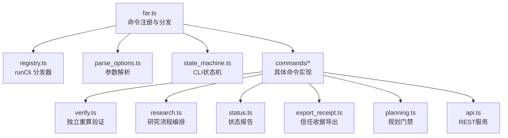
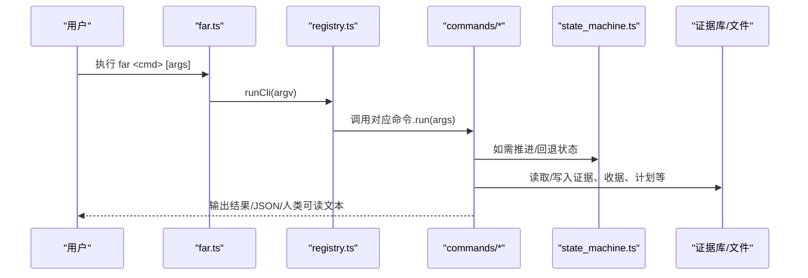
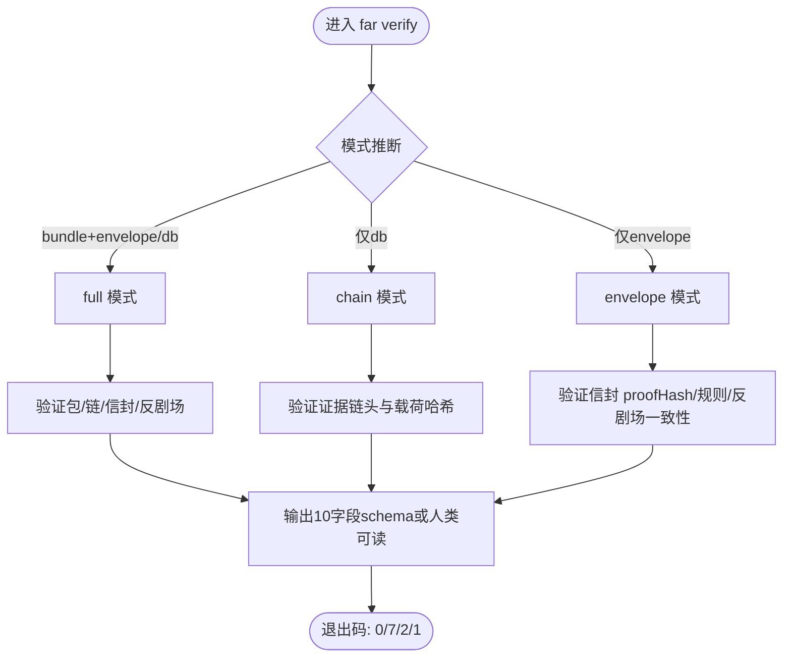
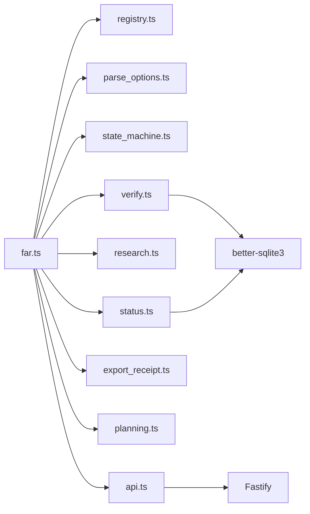
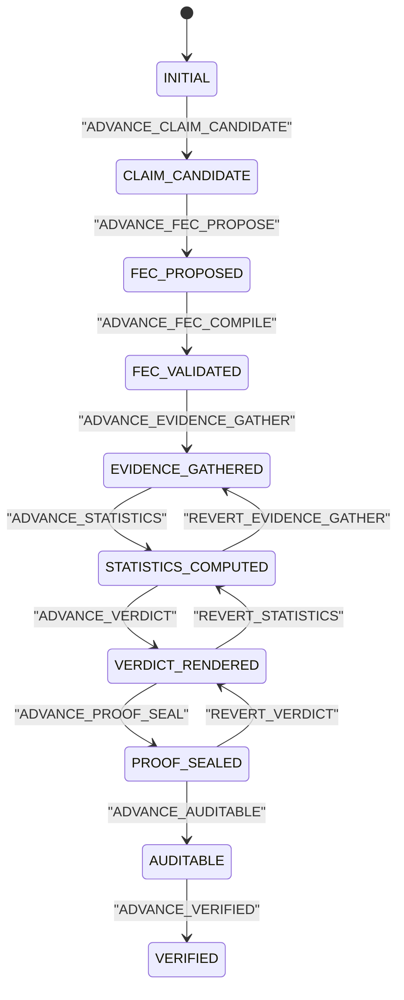

# CLI工具参考

<cite>
**本文引用的文件**
- [src/cli/far.ts](file://src/cli/far.ts)
- [src/cli/registry.ts](file://src/cli/registry.ts)
- [src/cli/parse_options.ts](file://src/cli/parse_options.ts)
- [src/cli/state_machine.ts](file://src/cli/state_machine.ts)
- [src/cli/commands/verify.ts](file://src/cli/commands/verify.ts)
- [src/cli/commands/research.ts](file://src/cli/commands/research.ts)
- [src/cli/commands/status.ts](file://src/cli/commands/status.ts)
- [src/cli/commands/export_receipt.ts](file://src/cli/commands/export_receipt.ts)
- [src/cli/commands/planning.ts](file://src/cli/commands/planning.ts)
- [src/cli/commands/api.ts](file://src/cli/commands/api.ts)
- [package.json](file://package.json)
</cite>

## 目录
1. [简介](#简介)
2. [项目结构](#项目结构)
3. [核心组件](#核心组件)
4. [架构总览](#架构总览)
5. [详细命令参考](#详细命令参考)
6. [依赖关系分析](#依赖关系分析)
7. [性能与最佳实践](#性能与最佳实践)
8. [故障排查指南](#故障排查指南)
9. [结论](#结论)
10. [附录](#附录)

## 简介
本参考文档面向使用 FAR-Lab CLI（far）的工程师与审计人员，系统化说明所有可用命令、参数选项、环境变量、输出格式、错误码与调试方式。内容按功能模块组织：验证相关（verify、audit、export等）、研究管理（research、planning等）、系统管理（api、status等）。同时给出状态机工作流程、命令间依赖关系、复杂工作流组合示例（批量验证、流水线处理），以及与外部工具的集成和管道操作建议。

## 项目结构
FAR-Lab CLI 采用“表驱动注册 + 懒加载实现”的设计：
- 入口 far.ts 声明所有命令描述符，并通过 registry.runCli 进行分发；命令实现在需要时通过动态 import 加载，避免冷启动开销。
- parse_options.ts 提供声明式参数解析与错误收集。
- state_machine.ts 定义 CLI 协议的状态机（9个状态、前进/回退事件），配合 stage receipt 形成哈希链。
- commands/* 为各子命令的具体实现，保持单一职责与可测试性。

图表来源
- [src/cli/far.ts:33-380](file://src/cli/far.ts#L33-L380)
- [src/cli/registry.ts:52-77](file://src/cli/registry.ts#L52-L77)
- [src/cli/parse_options.ts:30-134](file://src/cli/parse_options.ts#L30-L134)
- [src/cli/state_machine.ts:6-105](file://src/cli/state_machine.ts#L6-L105)

章节来源
- [src/cli/far.ts:1-394](file://src/cli/far.ts#L1-L394)
- [src/cli/registry.ts:1-78](file://src/cli/registry.ts#L1-L78)
- [package.json:28-30](file://package.json#L28-L30)

## 核心组件
- 命令注册与分发
  - 每个命令以 CliCommand 描述符注册（name/aliases/description/run），run 返回退出码或 undefined（如 api 接管进程生命周期）。
  - runCli 负责帮助文本、未知命令处理与命令执行。
- 参数解析
  - 支持 --flag value、--flag=value、布尔标志、枚举校验、位置参数、自定义 validate。
  - 统一错误收集与报告，便于用户快速定位问题。
- 状态机
  - 9个状态：INITIAL → CLAIM_CANDIDATE → FEC_PROPOSED → FEC_VALIDATED → EVIDENCE_GATHERED → STATISTICS_COMPUTED → VERDICT_RENDERED → PROOF_SEALED → AUDITABLE → VERIFIED。
  - 支持前进事件与在封存前的回退事件（REVERT_*），确保不可篡改的推进与可控回溯。
- 懒加载
  - 命令实现按需 import，减少启动时间与内存占用，提升 --help/错误路径体验。

章节来源
- [src/cli/registry.ts:13-77](file://src/cli/registry.ts#L13-L77)
- [src/cli/parse_options.ts:7-149](file://src/cli/parse_options.ts#L7-L149)
- [src/cli/state_machine.ts:6-151](file://src/cli/state_machine.ts#L6-L151)
- [src/cli/far.ts:33-380](file://src/cli/far.ts#L33-L380)

## 架构总览
下图展示 CLI 入口到各命令实现的调用关系，以及关键数据流（参数解析、状态机、验证结果、收据导出、API 服务）。

图表来源
- [src/cli/far.ts:382-394](file://src/cli/far.ts#L382-L394)
- [src/cli/registry.ts:52-77](file://src/cli/registry.ts#L52-L77)
- [src/cli/state_machine.ts:72-105](file://src/cli/state_machine.ts#L72-L105)

## 详细命令参考

### 通用约定
- 退出码
  - 0：成功
  - 1：运行时错误
  - 2：用法/参数错误
  - 3：中间态（如 planning gate IMPLEMENTED_UNVERIFIED）
  - 7：失败（如 verify FAIL、planning 门禁失败）
- 输出
  - 多数命令支持 --json 机器可读输出；否则输出人类可读摘要。
- 环境变量
  - 常见键：FAR_DASHSCOPE_API_KEY、DASHSCOPE_API_KEY、PORT、FAR_JWT_SECRET、FAR_RESEARCH_MEMORY 等（见各命令小节）。

章节来源
- [src/cli/commands/verify.ts:1-13](file://src/cli/commands/verify.ts#L1-L13)
- [src/cli/commands/planning.ts:1-14](file://src/cli/commands/planning.ts#L1-L14)
- [src/cli/commands/research.ts:108-138](file://src/cli/commands/research.ts#L108-L138)
- [src/cli/commands/api.ts:73-77](file://src/cli/commands/api.ts#L73-L77)

### 验证相关命令

#### far verify
- 用途：第三方独立重算验证，支持三种模式（自动推断或显式指定）。
- 语法
  - far verify [--mode chain|envelope|full] [--bundle <path>] [--envelope <path>] [--db <path>] [--lint-input <path>] [--pubkey <path>] [--json] [--explain]
- 行为
  - 模式推断：同时提供 bundle 与 envelope/db → full；仅 db → chain；否则 envelope → envelope。
  - 多轴重算：node（TS proofHash）、python（镜像脚本）、browser（Web Crypto 独立验证）。
  - 反剧场检测：可选 lint-input 独立重算并比对。
- 输出
  - 10字段 schema（status、verdict、proofHash、ledgerRoot、tamperStatus、scopeStatus、recomputation、errors、warnings、verifiedLevels）。
  - --explain 展开规则检查表。
- 退出码
  - 0 PASS / 7 FAIL / 2 参数错误 / 1 运行时错误。
- 环境变量
  - 无强制要求；Python 重算依赖 python/python3 可执行。

图表来源
- [src/cli/far.ts:537-592](file://src/cli/far.ts#L537-L592)
- [src/cli/commands/verify.ts:1-108](file://src/cli/commands/verify.ts#L1-L108)

章节来源
- [src/cli/far.ts:537-592](file://src/cli/far.ts#L537-L592)
- [src/cli/commands/verify.ts:1-200](file://src/cli/commands/verify.ts#L1-L200)

#### far verify-golden
- 用途：重算黄金向量用例，用于回归与跨语言一致性。
- 语法
  - far verify-golden [--all | --case <id> | --case-dir <path>] [--backend node|python|browser] [--json]
- 行为
  - 默认运行全部 GV-01..GV-14；支持单例或目录选择；后端可在 node/python/browser 切换。
- 退出码
  - 0 通过 / 非0 失败（具体由实现决定）。

章节来源
- [src/cli/far.ts:485-519](file://src/cli/far.ts#L485-L519)

#### far export receipt / receipt-v2 / far-proof / citations
- 用途：从 ProofEnvelopeV2 或 .far-proof 包导出“信任收据”或引用列表。
- 语法
  - far export receipt|--bundle/--envelope [--format json|markdown] [--output <path>]
  - far export receipt-v2 ...
  - far export far-proof ...
  - far export citations <runId> --format bibtex|csl-json [--output <path>]
- 行为
  - 收据包含声明摘要、裁决、证据范围、proofHash、防篡改状态、限制与下一步动作。
  - citations 支持 BibTeX 与 CSL-JSON 两种格式。
- 退出码
  - 0 成功 / 2 参数错误 / 1 运行时错误。

章节来源
- [src/cli/far.ts:650-800](file://src/cli/far.ts#L650-L800)
- [src/cli/commands/export_receipt.ts:1-200](file://src/cli/commands/export_receipt.ts#L1-L200)

#### far audit-seed-cherry / audit-multiseed
- 用途：反剧场检测演示与真实多种子审计（含种子相关的 BLS）。
- 语法
  - far audit-seed-cherry [args...]
  - far audit-multiseed [args...]
- 行为
  - 回放/审计种子相关证据，输出审计结果。
- 退出码
  - 依实现而定（通常 0/1/2）。

章节来源
- [src/cli/far.ts:214-222](file://src/cli/far.ts#L214-L222)

### 研究管理命令

#### far research
- 用途：端到端研究切片（ground → 生成假设 → 批判 → 评分 → 计划 → ResearchRun），支持断点续跑与可观测性。
- 常用子命令
  - start "<question>" [--source openalex|arxiv|crossref] [--profile auto|offline_replay|competition_aliyun_qwen] [--target 3..5] [--json] [--out <file>]
  - status <runId> [--json]
  - snapshots [--json]
  - resume <runId> [--profile ...] [--out <file>] [--json]
  - inspect <run.json> [--json]
  - verify <run.json|bundle-dir> [--json]
  - export <run.json> --out <bundle-dir> [--json]
  - compare <run.json> [--revision <a> <b>] [--json]
  - analyze <run.json> [--live] [--adjudicate] [--out <new.json>] [--json]
  - adjudicate <run.json> [--hypothesis <id>] [--ledger <path>] [--json]
  - review <run.json> --hypothesis <id> --to NOVEL_VALIDATED/REDISCOVERY ... [--reviewer <name>] [--ledger <path>] [--json]
  - memory <status|summary> [--path <file>] [--domain <d>] [--json]
  - evaluate <run.json> [--json]
  - baseline "<question>" [--profile ...] [--json]
  - feedback <run.json> --file feedback.json [--out <new.json>] [--profile ...]
  - registry [--verify | --export <file> | --json] [--ledger <path>]
  - registry anchor [--export <cred.json>] [--ledger <path>] [--json]
  - judge <runId> [--profile auto|competition_aliyun_qwen] [--json]
- 环境变量
  - FAR_DASHSCOPE_API_KEY 或 DASHSCOPE_API_KEY：启用 LIVE 模式（真实模型与检索）。
  - FAR_RESEARCH_MEMORY=0：禁用研究记忆读写。
- 行为要点
  - auto 模式：存在密钥则走 competition_aliyun_qwen，否则提示缺失密钥并提供离线 replay 指引。
  - offline_replay：合成夹具，证明管线接线而非科学真理。
- 退出码
  - 依子命令而定（常见 0/1/2/7）。

章节来源
- [src/cli/far.ts:249-348](file://src/cli/far.ts#L249-L348)
- [src/cli/commands/research.ts:1-200](file://src/cli/commands/research.ts#L1-L200)

#### far planning
- 用途：将规划门禁方法论代码化，提供确定性门禁引擎。
- 子命令
  - plan <file>：校验 Plan DAG，输出门禁报告与拓扑执行序。
  - spec <file>：校验 Spec（≥3 可验证 AC/Delta/trust-kernel 声明）。
  - batch <file> [--closure <file>]：校验 batch contract（十二字段），可选收尾对拍。
  - startup --baseline <f>：生成启动收据（资产哈希+baseline+状态差异）。
  - risk <signal>...：风险分级 P0-P4。
  - state <from> <to> [--compress]：状态机转移校验。
  - gate <file>：验证门禁报告（四步门函数，not_run 显式标注）。
  - checkpoint <file> [--template]：解析检查点（可生成模板）。
- 退出码
  - 0 通过 / 7 门禁失败 / 3 IMPLEMENTED_UNVERIFIED / 2 用法或文件错误。

章节来源
- [src/cli/commands/planning.ts:1-200](file://src/cli/commands/planning.ts#L1-L200)

### 系统管理命令

#### far status
- 用途：输出单一可信状态报告（SSOT），包括仓库信息、链头验证、测试计数、覆盖率等。
- 语法
  - far status [--json] [--db <path>]
- 行为
  - 若未提供 --db，chainHead 为 pending；提供后执行链头与载荷哈希验证。
  - 测试计数与覆盖率通过子进程运行 Node 测试并解析输出，失败降级为 pending。
- 退出码
  - 始终 0（只读报告，pending 不视为失败）。

章节来源
- [src/cli/far.ts:521-535](file://src/cli/far.ts#L521-L535)
- [src/cli/commands/status.ts:1-200](file://src/cli/commands/status.ts#L1-L200)

#### far api
- 用途：启动 REST API 服务器（Fastify），前端默认连接 localhost:3000。
- 语法
  - far api [--port <n>] [--host <addr>] [--db <path>|--persist] [--no-seed] [--jwt-secret <secret>] [--protected]
- 安全策略
  - 非 loopback 绑定且未启用受保护模式（--protected/FAR_JWT_SECRET）时拒绝启动，防止匿名写入信任账本。
- 行为
  - 默认离线 demo 模式（匿名 + in-memory DB + 种子数据）；生产建议使用 --persist 与 --protected。
  - 根据环境变量解析 LLM 网关（存在密钥则启用竞争 Qwen 真实推理，否则 fail-closed）。
- 环境变量
  - PORT：覆盖端口。
  - FAR_JWT_SECRET：启用 JWT 认证。
  - FAR_DASHSCOPE_API_KEY / DASHSCOPE_API_KEY：启用真实 LLM。

章节来源
- [src/cli/far.ts:67-74](file://src/cli/far.ts#L67-L74)
- [src/cli/commands/api.ts:1-141](file://src/cli/commands/api.ts#L1-L141)

#### 其他常用命令（概览）
- far version/-v：打印版本与 git HEAD。
- far doctor：环境自检（默认离线；--probe-credentials 可发送一次真实 ping）。
- far hardware：尽力而为的硬件能力探测（--json）。
- far demo：一键演示（支持 v2 收据验证路径）。
- far ask/stream/repl/replay/court/arena：研究/对抗/回放/裁决等高级流程。
- far init/keygen/sign/verify-sig/snapshot-verify：初始化、密钥、签名、快照校验等。
- far fec compile/freeze：FEC V2 编译与冻结交叉校验。
- far fsm advance：推进 CLI 协议状态机并追加阶段收据哈希链接。
- far bench run：基准演示（--json/--out/--generated-at/--git-commit/--domain）。
- far campaign：多问题研究活动（start/status/resume/report/replay）。
- far ground/check-resource：文献落地与资源存在性校验。
- far lifecycle/backup/schedule/real-paper：生命周期、备份、定时重验、真实论文流水线。

章节来源
- [src/cli/far.ts:33-380](file://src/cli/far.ts#L33-L380)

## 依赖关系分析
- 命令与实现
  - far.ts 仅持有命令描述符与分发逻辑；实际逻辑位于 commands/*，通过动态 import 加载。
- 参数解析
  - 所有命令共享 parseOptions，保证一致的参数处理与错误报告。
- 状态机
  - fsm advance 依赖 state_machine.ts 的合法转移表；其他命令在需要时推进/回退状态。
- 外部依赖
  - better-sqlite3：证据库与链头验证。
  - Fastify：API 服务。
  - Python 解释器：部分重算路径（verify-golden、verify 的 python 轴）。
  - Web Crypto：浏览器轴独立 proofHash 重算。

图表来源
- [src/cli/far.ts:33-380](file://src/cli/far.ts#L33-L380)
- [src/cli/commands/verify.ts:15-28](file://src/cli/commands/verify.ts#L15-L28)
- [src/cli/commands/status.ts:15-23](file://src/cli/commands/status.ts#L15-L23)
- [src/cli/commands/api.ts:10-15](file://src/cli/commands/api.ts#L10-L15)

章节来源
- [src/cli/far.ts:33-380](file://src/cli/far.ts#L33-L380)
- [src/cli/commands/verify.ts:15-28](file://src/cli/commands/verify.ts#L15-L28)
- [src/cli/commands/status.ts:15-23](file://src/cli/commands/status.ts#L15-L23)
- [src/cli/commands/api.ts:10-15](file://src/cli/commands/api.ts#L10-L15)

## 性能与最佳实践
- 启动优化
  - 命令实现懒加载，--help/未知命令路径不加载重型模块。
  - 使用 --json 输出便于 CI 快速解析，避免人类可读渲染开销。
- 验证性能
  - 优先选择最小必要模式：仅 envelope 或仅 chain 可减少 IO 与计算。
  - 多轴重算（node/python/browser）适合离线审计；CI 中可按需启用。
- 数据库与存储
  - 使用 --db 指向持久化文件以便复用证据链；status 支持只读 quick_check。
  - 定期 backup 与 schedule 重验保障长期一致性。
- 研究与实验
  - 使用 offline_replay 进行零成本管线验证；LIVE 模式注意密钥配置与速率限制。
  - 合理使用 --target、--max-per-query 控制资源消耗。
- API 部署
  - 生产务必启用 --protected 与 FAR_JWT_SECRET；避免在非 loopback 暴露匿名模式。
  - 使用 --persist 持久化证据库；结合前端 dev 模式快速联调。

[本节为通用指导，无需特定文件引用]

## 故障排查指南
- 常见错误与定位
  - 未知参数：parseOptions 会报告 unknown argument，检查拼写与是否支持。
  - 缺少必填参数：reportErrors 会列出缺失项与占位符提示。
  - 非法枚举值：enum 校验失败会列出允许值。
- 验证失败
  - verify 返回 7：检查 mode、输入路径、DB 完整性；使用 --explain 查看规则检查细节。
  - 反剧场不一致：使用 --lint-input 独立重算并比对。
- 研究流程
  - 缺失密钥：auto 模式会提示 missing-key；设置 FAR_DASHSCOPE_API_KEY 或改用 offline_replay。
  - 源失败：可通过 degradeOnSourceFailure 降级而非中断 grounding。
- API 安全
  - 非 loopback 匿名模式被拒绝：请绑定 127.0.0.1 或使用 --protected/FAR_JWT_SECRET。
- 状态机
  - 非法转移：transition 返回 PROTOCOL_DEVIATION_CRITICAL；检查当前状态与事件顺序。

章节来源
- [src/cli/parse_options.ts:53-134](file://src/cli/parse_options.ts#L53-L134)
- [src/cli/commands/verify.ts:1-108](file://src/cli/commands/verify.ts#L1-L108)
- [src/cli/commands/research.ts:108-138](file://src/cli/commands/research.ts#L108-L138)
- [src/cli/commands/api.ts:83-96](file://src/cli/commands/api.ts#L83-L96)
- [src/cli/state_machine.ts:136-151](file://src/cli/state_machine.ts#L136-L151)

## 结论
FAR-Lab CLI 提供了完整的验证、研究管理与系统管理能力，具备强一致的状态机、多轴重算与可审计的输出。通过模块化命令设计、声明式参数解析与安全默认策略，既满足本地开发效率，也满足生产环境的可靠性与安全性。建议在生产环境中启用持久化与认证，并结合 schedule/backup 建立长期维护流程。

[本节为总结，无需特定文件引用]

## 附录

### 状态机工作流程（CLI 协议）

图表来源
- [src/cli/state_machine.ts:6-105](file://src/cli/state_machine.ts#L6-L105)

### 复杂工作流组合示例
- 批量验证流水线
  - 步骤：准备多个 .far-proof 包或 ProofEnvelopeV2 JSON；循环调用 far verify --json 并将结果汇总；必要时触发 far export receipt 生成收据。
  - 建议：在 CI 中使用 --json 输出，结合脚本聚合 PASS/FAIL/WARN 统计。
- 研究闭环
  - 步骤：far research start 生成假设与计划 → far research analyze/adjudicate/review 迭代 → far research export 导出包 → far verify 独立重算 → far export receipt 生成收据。
  - 建议：使用 offline_replay 先验证管线，再切换到 competition_aliyun_qwen 进行真实推理。
- 审计与归档
  - 步骤：far status --db 检查链头与载荷哈希 → far backup 安全备份 → far schedule 定时重验 → far export far-proof 归档。

[本节为概念性示例，无需特定文件引用]

### 与外部工具的集成与管道操作
- Python 重算轴
  - verify/verify-golden 可调用 python/python3 执行镜像脚本；确保 PATH 正确。
- 浏览器轴
  - 利用 frontend/public/verify.html 中的 standalone 验证器，在 Node 中通过 vm 沙箱注入 Web Crypto 完成独立 proofHash 重算。
- 前端与 API
  - 启动 far api 后，前端可连接 http://localhost:3000/api/v1；events/stream 实时推送运行事件。
- 管道
  - 将 --json 输出通过 jq 或其他工具过滤、合并、告警；结合 shell 循环实现批量处理。

[本节为概念性指导，无需特定文件引用]