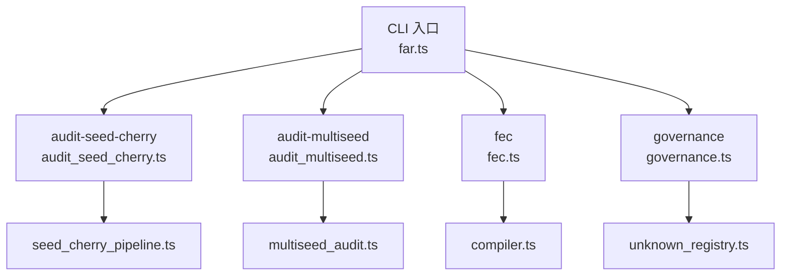
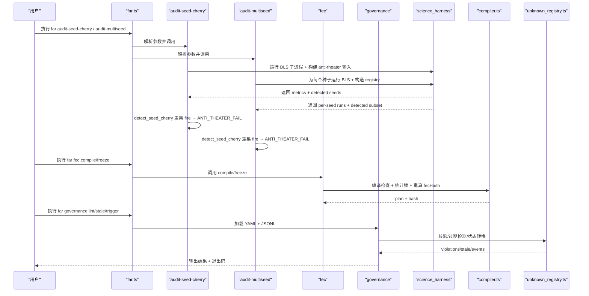
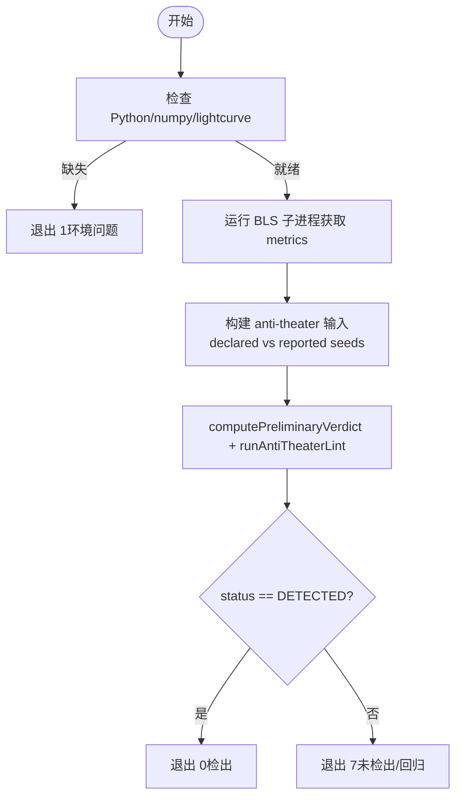
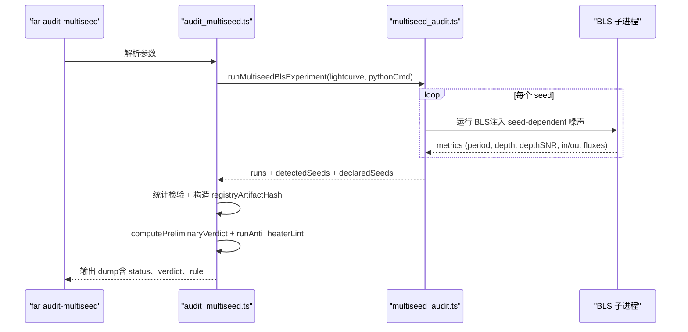
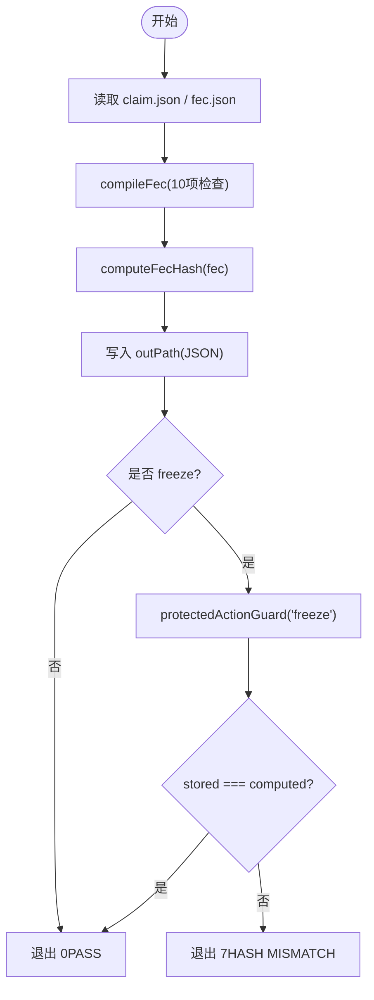
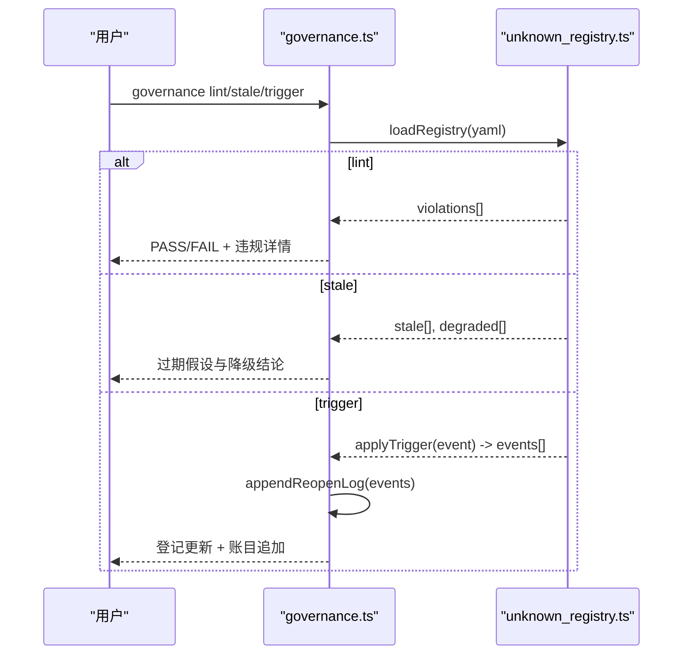
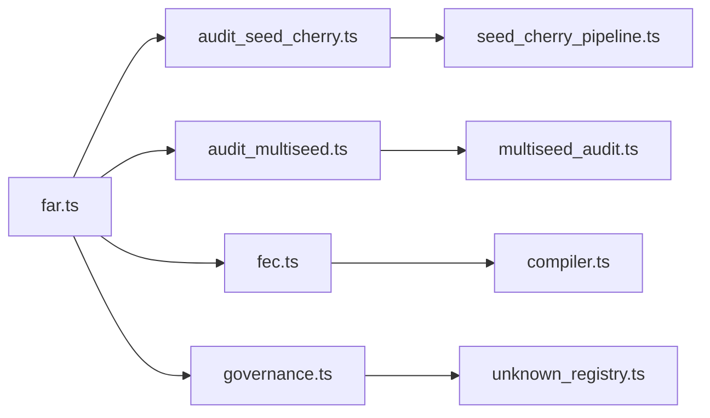

# 审计命令

<cite>
**本文引用的文件**
- [src/cli/far.ts](file://src/cli/far.ts)
- [src/cli/commands/audit_seed_cherry.ts](file://src/cli/commands/audit_seed_cherry.ts)
- [src/cli/commands/audit_multiseed.ts](file://src/cli/commands/audit_multiseed.ts)
- [src/cli/commands/fec.ts](file://src/cli/commands/fec.ts)
- [src/cli/commands/governance.ts](file://src/cli/commands/governance.ts)
- [src/science_harness/multiseed_audit.ts](file://src/science_harness/multiseed_audit.ts)
- [src/science_harness/seed_cherry_pipeline.ts](file://src/science_harness/seed_cherry_pipeline.ts)
- [src/fec/compiler.ts](file://src/fec/compiler.ts)
- [src/governance/unknown_registry.ts](file://src/governance/unknown_registry.ts)
- [tests/cli/audit_seed_cherry.test.ts](file://tests/cli/audit_seed_cherry.test.ts)
- [tests/cli/fec_compile_freeze.test.ts](file://tests/cli/fec_compile_freeze.test.ts)
- [tests/cli/governance.test.ts](file://tests/cli/governance.test.ts)
</cite>

## 目录
1. [简介](#简介)
2. [项目结构](#项目结构)
3. [核心组件](#核心组件)
4. [架构总览](#架构总览)
5. [详细组件分析](#详细组件分析)
6. [依赖关系分析](#依赖关系分析)
7. [性能与可观测性](#性能与可观测性)
8. [故障排查指南](#故障排查指南)
9. [结论](#结论)
10. [附录：参数与退出码速查](#附录参数与退出码速查)

## 简介
本文件面向系统审计与合规检查的 CLI 工具，覆盖以下命令与工作流：
- audit-multiseed：真实多子种子（multi-seed）BLS 实验 + cherry-pick 审计。通过为每个预注册种子注入噪声并独立运行 BLS，从“声明的种子集合”与“实际报告（检测到的）种子集合”的真实差集触发反剧场检测，进入裁决路径。
- audit-seed-cherry：基于 fixture 的反剧场检测展示，回放一个已知的 cherry-pick 场景，验证 detect_seed_cherry 在真实 runRegistry 差集上诚实触发，并产出 ANTI_THEATER_FAIL。
- fec：FEC V2 契约编译与冻结哈希重算，提供 compile 与 freeze 两个子命令，用于确保可证伪契约的完整性、可复现性与不可篡改。
- governance：治理登记与 reopen 传播账目，支持 lint/stale/trigger 子命令，对 Unknown/Assumption 登记进行机器级校验、过期检测与状态转换。

这些命令共同构成 FAR-Lab 的审计闭环：数据与代码可追溯、统计计划可冻结、反剧场行为可检测、治理事件可追踪。

## 项目结构
与审计相关的入口与实现分布如下：
- CLI 入口与路由：src/cli/far.ts
- 审计命令实现：
  - audit-seed-cherry：src/cli/commands/audit_seed_cherry.ts
  - audit-multiseed：src/cli/commands/audit_multiseed.ts
- 科学工作流（真实计算与流水线）：
  - seed-cherry pipeline：src/science_harness/seed_cherry_pipeline.ts
  - multi-seed audit：src/science_harness/multiseed_audit.ts
- FEC 编译与冻结：src/cli/commands/fec.ts 与 src/fec/compiler.ts
- 治理引擎与 CLI：src/governance/unknown_registry.ts 与 src/cli/commands/governance.ts
- 端到端测试：tests/cli/*（验证退出码、产物结构与关键断言）

图表来源
- [src/cli/far.ts:209-222](file://src/cli/far.ts#L209-L222)
- [src/cli/commands/audit_seed_cherry.ts:1-136](file://src/cli/commands/audit_seed_cherry.ts#L1-L136)
- [src/cli/commands/audit_multiseed.ts:1-138](file://src/cli/commands/audit_multiseed.ts#L1-L138)
- [src/cli/commands/fec.ts:1-242](file://src/cli/commands/fec.ts#L1-L242)
- [src/cli/commands/governance.ts:1-237](file://src/cli/commands/governance.ts#L1-L237)
- [src/science_harness/seed_cherry_pipeline.ts:1-291](file://src/science_harness/seed_cherry_pipeline.ts#L1-L291)
- [src/science_harness/multiseed_audit.ts:1-297](file://src/science_harness/multiseed_audit.ts#L1-L297)
- [src/fec/compiler.ts:1-558](file://src/fec/compiler.ts#L1-L558)
- [src/governance/unknown_registry.ts:1-374](file://src/governance/unknown_registry.ts#L1-L374)

章节来源
- [src/cli/far.ts:209-222](file://src/cli/far.ts#L209-L222)

## 核心组件
- audit-seed-cherry：以 fixture 驱动 cherry-pick 场景，调用真实 BLS 子进程与 anti-theater 管线，输出 DETECTED/MISSED 及机器裁决信息。
- audit-multiseed：为每个预注册种子执行真实 BLS 测量，构造 runRegistry，比较 declared vs reported 种子集合，触发 detect_seed_cherry 并进入裁决。
- fec compile/freeze：对 FEC V2 契约进行 10 项编译检查与统计锁构建；freeze 强制重算哈希并与存储值比对，防篡改。
- governance lint/stale/trigger：校验登记完整性、发现过期假设并降级结论、应用 reopen 触发器并追加不可变账目。

章节来源
- [src/cli/commands/audit_seed_cherry.ts:24-136](file://src/cli/commands/audit_seed_cherry.ts#L24-L136)
- [src/cli/commands/audit_multiseed.ts:25-138](file://src/cli/commands/audit_multiseed.ts#L25-L138)
- [src/cli/commands/fec.ts:16-242](file://src/cli/commands/fec.ts#L16-L242)
- [src/cli/commands/governance.ts:31-237](file://src/cli/commands/governance.ts#L31-L237)

## 架构总览
下图展示了四个命令如何协同完成“数据生成 → 审计检测 → 契约冻结 → 治理追踪”的闭环。

图表来源
- [src/cli/far.ts:1023-1059](file://src/cli/far.ts#L1023-L1059)
- [src/cli/commands/audit_seed_cherry.ts:98-136](file://src/cli/commands/audit_seed_cherry.ts#L98-L136)
- [src/cli/commands/audit_multiseed.ts:52-138](file://src/cli/commands/audit_multiseed.ts#L52-L138)
- [src/science_harness/seed_cherry_pipeline.ts:115-291](file://src/science_harness/seed_cherry_pipeline.ts#L115-L291)
- [src/science_harness/multiseed_audit.ts:94-297](file://src/science_harness/multiseed_audit.ts#L94-L297)
- [src/cli/commands/fec.ts:74-172](file://src/cli/commands/fec.ts#L74-L172)
- [src/fec/compiler.ts:67-150](file://src/fec/compiler.ts#L67-L150)
- [src/cli/commands/governance.ts:98-237](file://src/cli/commands/governance.ts#L98-L237)
- [src/governance/unknown_registry.ts:40-374](file://src/governance/unknown_registry.ts#L40-L374)

## 详细组件分析

### audit-seed-cherry（种子樱桃检测）
- 功能：回放一个 cherry-pick 场景，使用真实 BLS 子进程与 anti-theater 管线，验证 detect_seed_cherry 能在真实 runRegistry 差集上触发 HIDDEN_FAILED_RUN，导致 kernel 输出 ANTI_THEATER_FAIL。
- 工作原理：
  - 读取 lightcurve fixture，调用 prepareSeedCherryChain 构建证据与统计。
  - 将 declaredSeeds=[0,1,2,3,4] 与 reportedSeeds=[0,1,2] 传入 anti-theater 输入，computePreliminaryVerdict 后运行 runAntiTheaterLint。
  - 输出包含 status、machineVerdict、decisiveRuleId、sealedConclusion 等字段。
- 参数：
  - --lightcurve <path>：光变曲线 fixture 路径（默认 tests/fixtures/science_harness/tic_sample.cache）
  - --python <cmd>：Python 命令（自动发现 python3/python；需要 numpy）
  - --json：机器可读输出
- 退出码：0=DETECTED（攻击被阻断），7=MISSED（回归），2=参数错误，1=环境缺失（无 Python/numpy/fixture）。

图表来源
- [src/cli/commands/audit_seed_cherry.ts:98-136](file://src/cli/commands/audit_seed_cherry.ts#L98-L136)
- [src/science_harness/seed_cherry_pipeline.ts:115-291](file://src/science_harness/seed_cherry_pipeline.ts#L115-L291)

章节来源
- [src/cli/commands/audit_seed_cherry.ts:24-136](file://src/cli/commands/audit_seed_cherry.ts#L24-L136)
- [src/science_harness/seed_cherry_pipeline.ts:50-291](file://src/science_harness/seed_cherry_pipeline.ts#L50-L291)
- [tests/cli/audit_seed_cherry.test.ts:16-43](file://tests/cli/audit_seed_cherry.test.ts#L16-L43)

### audit-multiseed（多子种子审计）
- 功能：为每个预注册种子执行真实 BLS 测量（每种子独立 workingDir 与噪声注入），构造 runRegistry，比较 declared vs reported 种子集合，触发 detect_seed_cherry 并进入裁决路径。
- 工作原理：
  - 对每个 seed 调用 runBlsInSandbox，得到 metrics 与 detected 标志（depthSNR >= 阈值）。
  - 聚合 reported runs 的 in/out fluxes 做两样本 Welch t 检验，计算效应量与置信区间，调整 p 值。
  - 基于 reported runs 实算 registryArtifactHash，构造 FEC 与证据，运行 anti-theater 检测。
- 参数：
  - --lightcurve <path>：光变曲线 fixture 路径
  - --python <cmd>：Python 命令（需要 numpy）
  - --json：机器可读输出
- 退出码：0=DETECTED（cherry-pick 被检出），7=MISSED（回归），2=参数错误，1=环境缺失。

图表来源
- [src/cli/commands/audit_multiseed.ts:52-138](file://src/cli/commands/audit_multiseed.ts#L52-L138)
- [src/science_harness/multiseed_audit.ts:94-297](file://src/science_harness/multiseed_audit.ts#L94-L297)

章节来源
- [src/cli/commands/audit_multiseed.ts:25-138](file://src/cli/commands/audit_multiseed.ts#L25-L138)
- [src/science_harness/multiseed_audit.ts:46-297](file://src/science_harness/multiseed_audit.ts#L46-L297)

### fec（FEC 编译与冻结）
- 功能：
  - compile：对 FEC V2 契约执行 10 项编译检查，构建 falsification plan（stat_lock + verdict_mapping + proof_checks），并重算 fecHash。
  - freeze：受保护动作，必须人类显式发起；重算 fecHash 并与存储值比对，防止篡改。
- 工作原理：
  - compileFec 顺序执行检查（measurableImplication、scope、metric、threshold、evidence、statisticalPlan、multipleTesting、seedPolicy、deterministicFreezer、harkingTimeline、gitCommitShaBinding、powerPlanRequired），收集所有 HARD_FAIL 错误。
  - computeFecHash 对 VC 字段（排除 fecHash 自身）进行 canonical JSON 哈希。
  - freeze 通过 protectedActionGuard 限制非人类直接调用。
- 参数：
  - compile：--claimPath <path>, --outPath <path>
  - freeze：--fecPath <path>, [--actorPath <path>]
- 退出码：0=成功，7=编译失败或哈希不匹配，2=用法错误，1=JSON 解析失败。

图表来源
- [src/cli/commands/fec.ts:74-172](file://src/cli/commands/fec.ts#L74-L172)
- [src/fec/compiler.ts:67-150](file://src/fec/compiler.ts#L67-L150)

章节来源
- [src/cli/commands/fec.ts:16-242](file://src/cli/commands/fec.ts#L16-L242)
- [src/fec/compiler.ts:1-558](file://src/fec/compiler.ts#L1-L558)
- [tests/cli/fec_compile_freeze.test.ts:110-156](file://tests/cli/fec_compile_freeze.test.ts#L110-L156)

### governance（治理登记与 reopen 传播）
- 功能：
  - lint：校验 Unknown/Assumption 登记完整性（ID 唯一、生命周期字段完整、引用边不悬空）。
  - stale：发现过期的 ACTIVE 假设并列出受影响的结论降级。
  - trigger：应用 reopen 触发器（如 invalidated_assumption、new_evidence、regression 等），更新登记并追加不可变账目。
- 工作原理：
  - loadRegistry 读取 YAML 并通过 schema 校验；缺失源 fail-closed（exit 3）。
  - findStaleAssumptions 比较 reviewDate 与 today；degradedConclusions 列出受影响决策。
  - applyTrigger 处理九类触发器，深度 2 传播 impacted，appendReopenLog 保证 append-only 完整性。
- 参数：
  - lint：[--registry <yaml>] [--known <ids-file>]
  - stale：[--registry <yaml>] [--today <YYYY-MM-DD>]
  - trigger：<event-json> [--registry <yaml>] [--log <jsonl>] [--dry-run]
- 退出码：0=通过/已应用，7=门禁失败或非法转换，2=用法错误，3=源缺失。

图表来源
- [src/cli/commands/governance.ts:98-237](file://src/cli/commands/governance.ts#L98-L237)
- [src/governance/unknown_registry.ts:40-374](file://src/governance/unknown_registry.ts#L40-L374)

章节来源
- [src/cli/commands/governance.ts:31-237](file://src/cli/commands/governance.ts#L31-L237)
- [src/governance/unknown_registry.ts:1-374](file://src/governance/unknown_registry.ts#L1-L374)
- [tests/cli/governance.test.ts:94-204](file://tests/cli/governance.test.ts#L94-L204)

## 依赖关系分析
- CLI 层（far.ts）仅保留 parse_options 与 registry 静态依赖，命令实现 lazy import，减少启动开销。
- 审计命令依赖 science_harness 中的真实 BLS 子进程与 anti-theater 管线。
- FEC 命令依赖 compiler.ts 的确定性编译与哈希计算。
- 治理命令依赖 unknown_registry.ts 的纯函数引擎，IO 边界集中在 CLI 层。

图表来源
- [src/cli/far.ts:209-222](file://src/cli/far.ts#L209-L222)
- [src/cli/commands/audit_seed_cherry.ts:1-136](file://src/cli/commands/audit_seed_cherry.ts#L1-L136)
- [src/cli/commands/audit_multiseed.ts:1-138](file://src/cli/commands/audit_multiseed.ts#L1-L138)
- [src/cli/commands/fec.ts:1-242](file://src/cli/commands/fec.ts#L1-L242)
- [src/cli/commands/governance.ts:1-237](file://src/cli/commands/governance.ts#L1-L237)
- [src/science_harness/seed_cherry_pipeline.ts:1-291](file://src/science_harness/seed_cherry_pipeline.ts#L1-L291)
- [src/science_harness/multiseed_audit.ts:1-297](file://src/science_harness/multiseed_audit.ts#L1-L297)
- [src/fec/compiler.ts:1-558](file://src/fec/compiler.ts#L1-L558)
- [src/governance/unknown_registry.ts:1-374](file://src/governance/unknown_registry.ts#L1-L374)

章节来源
- [src/cli/far.ts:209-222](file://src/cli/far.ts#L209-L222)

## 性能与可观测性
- 多子种子审计为每个种子独立运行 BLS 子进程，避免共享状态冲突；临时工作目录在 finally 中清理。
- 统计检验使用真实两样本 Welch t 检验与 Bonferroni 校正，确保多重检验风险可控。
- FEC 编译收集全部 HARD_FAIL 错误，便于一次性修复；统计锁哈希确保统计计划冻结。
- 治理 reopen 账目不可变，序列号连续且拒绝重复 seq，保障审计轨迹完整性。

[本节为通用指导，无需特定文件来源]

## 故障排查指南
- 环境缺失：
  - audit-* 命令需要 Python 与 numpy；若缺失则退出 1。
  - lightcurve fixture 不存在则退出 1。
- 参数错误：
  - 所有命令对 --help 与未知子命令返回 2。
- 门禁失败：
  - governance lint/stale 命中违规或过期 → 退出 7。
  - fec compile 失败或 hash 不匹配 → 退出 7。
- 源缺失：
  - governance 登记源缺失 → 退出 3（fail-closed，不静默回退）。

章节来源
- [src/cli/commands/audit_seed_cherry.ts:98-136](file://src/cli/commands/audit_seed_cherry.ts#L98-L136)
- [src/cli/commands/audit_multiseed.ts:97-138](file://src/cli/commands/audit_multiseed.ts#L97-L138)
- [src/cli/commands/fec.ts:74-172](file://src/cli/commands/fec.ts#L74-L172)
- [src/cli/commands/governance.ts:98-237](file://src/cli/commands/governance.ts#L98-L237)

## 结论
本套审计命令覆盖了从数据生成到契约冻结再到治理追踪的完整链路：
- audit-seed-cherry 与 audit-multiseed 通过真实 BLS 与 anti-theater 检测，确保 cherry-pick 无法蒙混过关。
- fec compile/freeze 保证可证伪契约的完整性与不可篡改性。
- governance lint/stale/trigger 提供机器级的登记校验、过期检测与状态变更追踪。
结合定时任务与 CI 集成，可实现自动化审计、结果分析与合规报告生成，提升科研流程的可信度与可复现性。

[本节为总结，无需特定文件来源]

## 附录：参数与退出码速查
- audit-seed-cherry
  - 参数：--lightcurve <path>, --python <cmd>, --json
  - 退出码：0=DETECTED，7=MISSED，2=用法错误，1=环境缺失
- audit-multiseed
  - 参数：--lightcurve <path>, --python <cmd>, --json
  - 退出码：0=DETECTED，7=MISSED，2=用法错误，1=环境缺失
- fec
  - compile：--claimPath <path>, --outPath <path>
  - freeze：--fecPath <path>, [--actorPath <path>]
  - 退出码：0=成功，7=失败/不匹配，2=用法错误，1=解析失败
- governance
  - lint：[--registry <yaml>] [--known <ids-file>]
  - stale：[--registry <yaml>] [--today <YYYY-MM-DD>]
  - trigger：<event-json> [--registry <yaml>] [--log <jsonl>] [--dry-run]
  - 退出码：0=通过/已应用，7=门禁失败/非法转换，2=用法错误，3=源缺失

章节来源
- [src/cli/far.ts:1174-1185](file://src/cli/far.ts#L1174-L1185)
- [src/cli/commands/audit_seed_cherry.ts:24-136](file://src/cli/commands/audit_seed_cherry.ts#L24-L136)
- [src/cli/commands/audit_multiseed.ts:25-138](file://src/cli/commands/audit_multiseed.ts#L25-L138)
- [src/cli/commands/fec.ts:16-242](file://src/cli/commands/fec.ts#L16-L242)
- [src/cli/commands/governance.ts:31-237](file://src/cli/commands/governance.ts#L31-L237)