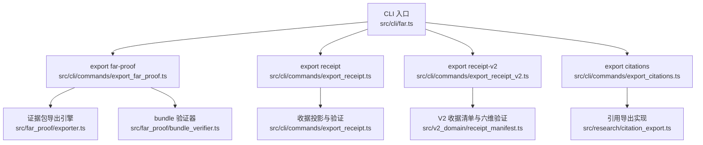
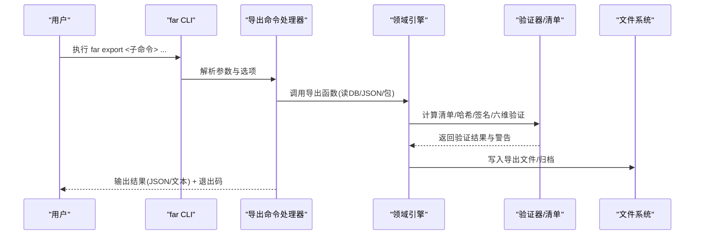
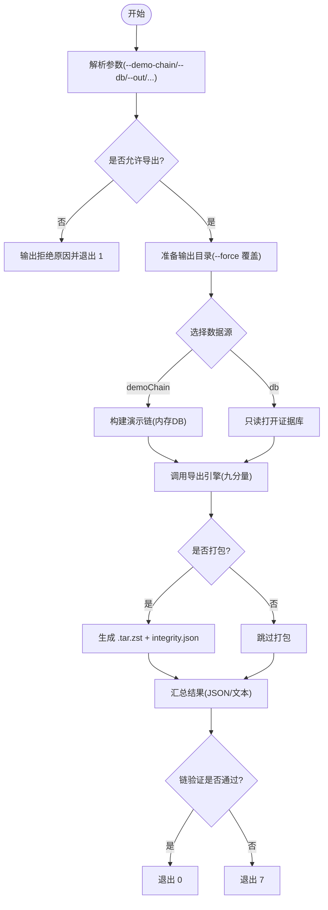
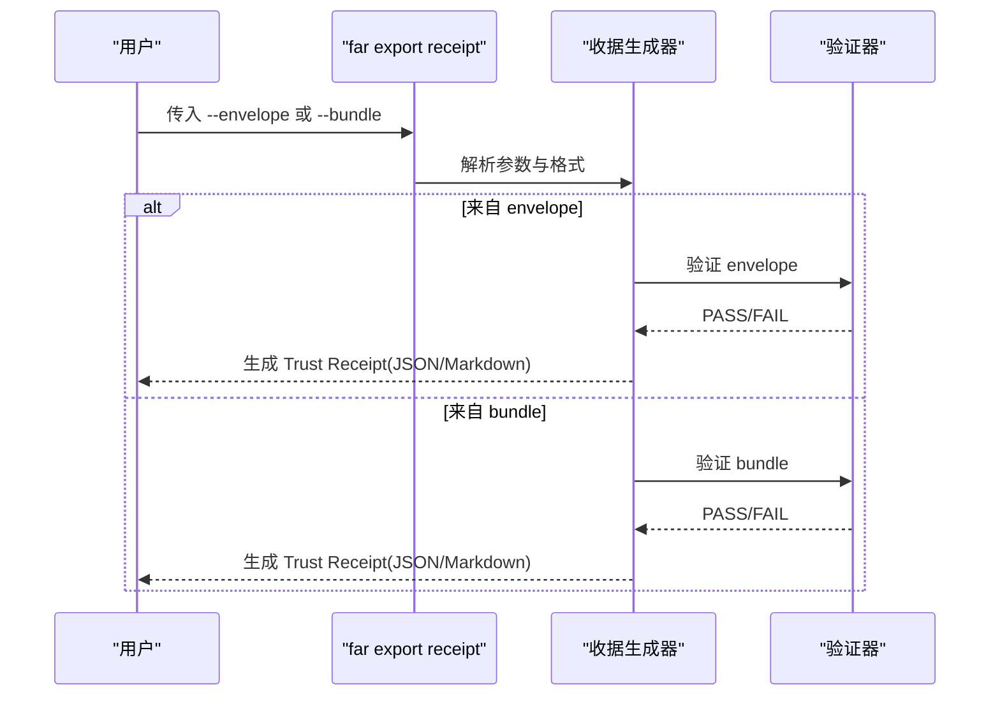
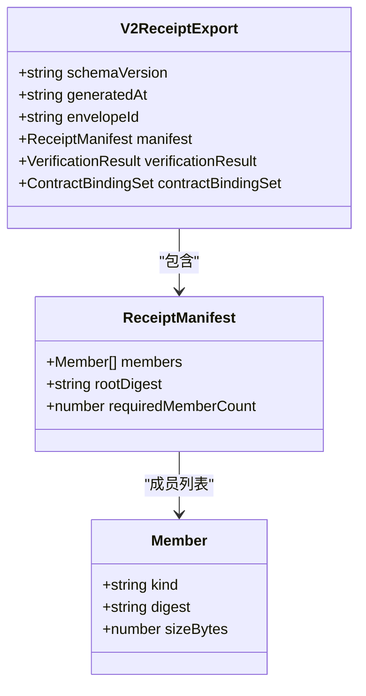
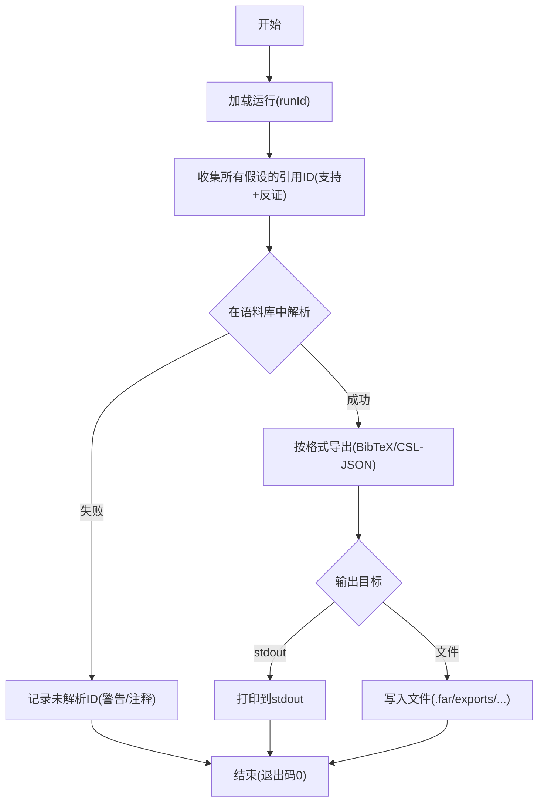
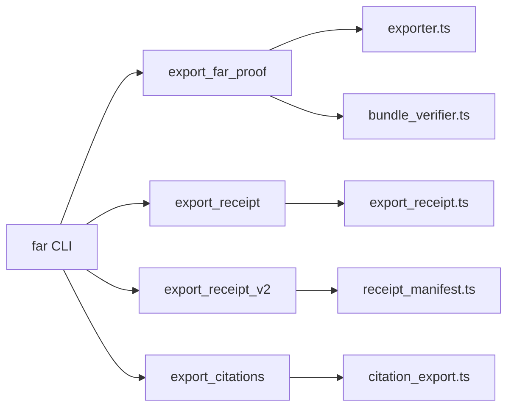

# 导出命令

<cite>
**本文引用的文件**
- [src/cli/commands/export_far_proof.ts](file://src/cli/commands/export_far_proof.ts)
- [src/cli/commands/export_receipt.ts](file://src/cli/commands/export_receipt.ts)
- [src/cli/commands/export_receipt_v2.ts](file://src/cli/commands/export_receipt_v2.ts)
- [src/cli/commands/export_citations.ts](file://src/cli/commands/export_citations.ts)
- [src/far_proof/exporter.ts](file://src/far_proof/exporter.ts)
- [src/far_proof/bundle_verifier.ts](file://src/far_proof/bundle_verifier.ts)
- [src/v2_domain/receipt_manifest.ts](file://src/v2_domain/receipt_manifest.ts)
- [src/cli/far.ts](file://src/cli/far.ts)
- [tests/cli/export_far_proof.test.ts](file://tests/cli/export_far_proof.test.ts)
- [tests/cli/export_receipt.test.ts](file://tests/cli/export_receipt.test.ts)
- [tests/cli/export_receipt_v2.test.ts](file://tests/cli/export_receipt_v2.test.ts)
</cite>

## 目录
1. [简介](#简介)
2. [项目结构](#项目结构)
3. [核心组件](#核心组件)
4. [架构总览](#架构总览)
5. [详细组件分析](#详细组件分析)
6. [依赖关系分析](#依赖关系分析)
7. [性能与可扩展性](#性能与可扩展性)
8. [故障排查指南](#故障排查指南)
9. [结论](#结论)
10. [附录：参数速查与使用示例](#附录参数速查与使用示例)

## 简介
本文件面向数据导出与证明生成的 CLI 工具，系统性说明以下命令的功能、参数、输出格式与适用场景：
- far export far-proof：导出可自验证的 .far-proof 证据包（V1），支持离线打包与完整性校验。
- far export receipt：从 ProofEnvelopeV2 JSON 或 V1 .far-proof bundle 生成“信任收据”DOC 投影（不进入 proofHash）。
- far export receipt-v2：从 ProofEnvelopeV2 JSON 生成 V2 收据（包含清单、六维验证结果与契约绑定集）。
- far export citations：将研究运行中引用的文献批量导出为 BibTeX 或 CSL-JSON，便于引用管理。

同时提供批量/选择性/自定义导出的实践方法，以及导出数据的验证与完整性检查流程。

## 项目结构
导出能力由 CLI 命令层与领域实现层共同构成：
- CLI 命令层：负责参数解析、IO 编排、错误处理与退出码约定。
- 领域实现层：负责证据包构建、收据生成、清单计算、签名与验证等核心逻辑。

图表来源
- [src/cli/far.ts:1373-1400](file://src/cli/far.ts#L1373-L1400)
- [src/cli/commands/export_far_proof.ts:64-119](file://src/cli/commands/export_far_proof.ts#L64-L119)
- [src/cli/commands/export_receipt.ts:77-213](file://src/cli/commands/export_receipt.ts#L77-L213)
- [src/cli/commands/export_receipt_v2.ts:71-183](file://src/cli/commands/export_receipt_v2.ts#L71-L183)
- [src/cli/commands/export_citations.ts:81-149](file://src/cli/commands/export_citations.ts#L81-L149)
- [src/far_proof/exporter.ts:102-172](file://src/far_proof/exporter.ts#L102-L172)
- [src/far_proof/bundle_verifier.ts:114-200](file://src/far_proof/bundle_verifier.ts#L114-L200)
- [src/v2_domain/receipt_manifest.ts:83-158](file://src/v2_domain/receipt_manifest.ts#L83-L158)

章节来源
- [src/cli/far.ts:1373-1400](file://src/cli/far.ts#L1373-L1400)

## 核心组件
- 证据包导出器：从证据库导出九分量证据包，并生成完整性清单与 README 重放指引。
- 信任收据生成器：基于 ProofEnvelopeV2 或 V1 bundle 生成人类可读的收据摘要，标注限制与下一步操作。
- V2 收据生成器：构建强制成员清单、六维保证维度判定与契约绑定集，输出 JSON/Markdown。
- 引用导出器：收集所有假设中的引用文档 ID，解析后导出为 BibTeX 或 CSL-JSON，并报告未解析项。

章节来源
- [src/far_proof/exporter.ts:102-172](file://src/far_proof/exporter.ts#L102-L172)
- [src/cli/commands/export_receipt.ts:77-213](file://src/cli/commands/export_receipt.ts#L77-L213)
- [src/cli/commands/export_receipt_v2.ts:71-183](file://src/cli/commands/export_receipt_v2.ts#L71-L183)
- [src/cli/commands/export_citations.ts:81-149](file://src/cli/commands/export_citations.ts#L81-L149)

## 架构总览
导出命令统一通过 CLI 入口分发到具体命令处理器，再调用领域服务完成数据读取、转换与写入。验证与完整性检查贯穿始终，确保导出产物可被独立复验。

图表来源
- [src/cli/far.ts:1373-1400](file://src/cli/far.ts#L1373-L1400)
- [src/cli/commands/export_far_proof.ts:64-119](file://src/cli/commands/export_far_proof.ts#L64-L119)
- [src/far_proof/exporter.ts:102-172](file://src/far_proof/exporter.ts#L102-L172)
- [src/far_proof/bundle_verifier.ts:114-200](file://src/far_proof/bundle_verifier.ts#L114-L200)

## 详细组件分析

### far export far-proof（FAR 证明包导出）
- 功能：从演示链或现有证据库导出 V1 .far-proof 证据包；可选生成离线归档包（含 verify.sh、integrity.json 与 .tar.zst）。
- 输入源：
  - --demo-chain：在内存中构建演示链并导出。
  - --db <path>：从已有 evidence_log DB 导出，需提供 run-id、model-snapshot、git-commit、env-hash。
- 关键选项：
  - --out <dir>：输出目录。
  - --package / --archive <path>：生成离线归档包。
  - --json：输出机器可读结果。
  - --force：覆盖非空输出目录。
  - --exported-at <iso>：固定导出时间戳（测试/重放用）。
- 输出内容：九分量证据包（RO-Crate 元数据、PROV-O、proof_envelopes、repro_runs、脱敏 call_records、claim_graph、otel-trace、data_manifest、README_REPLAY.md、code/figures 占位）、完整性清单 integrity.json。
- 退出码：0 成功；7 链验证失败；2 参数错误；1 运行时错误。
- 安全与合规：受保护动作（protectedActionGuard），仅允许人类显式触发；call_records 脱敏；SOURCES-ATTRIBUTION.txt 随包分发。

图表来源
- [src/cli/commands/export_far_proof.ts:64-119](file://src/cli/commands/export_far_proof.ts#L64-L119)
- [src/far_proof/exporter.ts:102-172](file://src/far_proof/exporter.ts#L102-L172)

章节来源
- [src/cli/commands/export_far_proof.ts:64-119](file://src/cli/commands/export_far_proof.ts#L64-L119)
- [src/far_proof/exporter.ts:102-172](file://src/far_proof/exporter.ts#L102-L172)
- [tests/cli/export_far_proof.test.ts:45-151](file://tests/cli/export_far_proof.test.ts#L45-L151)

### far export receipt（信任收据导出）
- 功能：从 ProofEnvelopeV2 JSON 或 V1 .far-proof bundle 生成“信任收据”DOC 投影（schemaVersion: far.trust_receipt.v1），用于快速审阅与审计。
- 输入：
  - --envelope <path>：ProofEnvelopeV2 JSON。
  - --bundle <path>：V1 .far-proof bundle 目录。
- 选项：
  - --format json|markdown：输出格式。
  - --out <path>：写入文件；省略则输出到 stdout。
  - --generated-at <iso>：固定生成时间。
- 行为要点：
  - 对 envelope 进行验证，若 tampered 则拒绝生成收据。
  - 从 bundle 投影时，明确声明 V1 minimal 边界与限制。
  - 输出包含 claimSummary、verdict、evidenceScope、proofHash、verifierCommand、tamperStatus、limitations、verification 状态等。
- 退出码：0 成功；7 输入校验失败；2 参数错误；1 运行时错误。

图表来源
- [src/cli/commands/export_receipt.ts:77-213](file://src/cli/commands/export_receipt.ts#L77-L213)
- [src/far_proof/bundle_verifier.ts:114-200](file://src/far_proof/bundle_verifier.ts#L114-L200)

章节来源
- [src/cli/commands/export_receipt.ts:77-213](file://src/cli/commands/export_receipt.ts#L77-L213)
- [tests/cli/export_receipt.test.ts:50-200](file://tests/cli/export_receipt.test.ts#L50-L200)

### far export receipt-v2（V2 收据导出）
- 功能：从 ProofEnvelopeV2 JSON 生成 V2 收据，包含：
  - ReceiptManifest（排序成员 + rootDigest）
  - 六维 VerificationResult（provenance、integrity、identity、processConformance、executionReproduction、scientificVerdict）
  - ContractBindingSet（冻结且 digest-bound）
- 输入：--envelope <path>
- 选项：--format json|markdown；--out <path>
- 行为要点：
  - 构建 manifest members → buildReceiptManifest → verifyReceiptManifest（fail-closed）。
  - 默认策略与算法 ID 通过标准策略注册表解析。
  - 科学结论维度标记为 WARN，强调协议一致性而非科学真理认证。
- 退出码：0 成功；2 参数错误；1 运行时错误。

图表来源
- [src/cli/commands/export_receipt_v2.ts:51-183](file://src/cli/commands/export_receipt_v2.ts#L51-L183)
- [src/v2_domain/receipt_manifest.ts:48-99](file://src/v2_domain/receipt_manifest.ts#L48-L99)

章节来源
- [src/cli/commands/export_receipt_v2.ts:71-183](file://src/cli/commands/export_receipt_v2.ts#L71-L183)
- [src/v2_domain/receipt_manifest.ts:83-158](file://src/v2_domain/receipt_manifest.ts#L83-L158)
- [tests/cli/export_receipt_v2.test.ts:1-200](file://tests/cli/export_receipt_v2.test.ts#L1-L200)

### far export citations（引用导出）
- 功能：将一次研究运行的全部假设中的引用文档导出为 BibTeX 或 CSL-JSON，供 Zotero/Mendeley 等引用管理器使用。
- 输入：runId（必需）
- 选项：
  - --format bibtex|csl-json
  - --output path|-：输出路径；'-' 表示输出到 stdout。
- 行为要点：
  - 收集所有假设的支持与反证引用 documentId，去重排序。
  - 在运行语料库中解析，无法解析的 documentId 会作为警告输出（BibTeX 中以注释形式保留）。
  - 至少成功导出一个引用才返回 0；否则非零退出码并给出原因。
- 默认输出：.far/exports/<runId>-citations.{bib|json}

图表来源
- [src/cli/commands/export_citations.ts:51-149](file://src/cli/commands/export_citations.ts#L51-L149)

章节来源
- [src/cli/commands/export_citations.ts:81-149](file://src/cli/commands/export_citations.ts#L81-L149)

## 依赖关系分析
- CLI 命令依赖各自领域的导出/验证模块。
- far-proof 导出依赖证据库与导出引擎，最终产出可验证的离线包。
- receipt/receipt-v2 依赖 envelope 解析、清单构建与六维验证。
- citations 依赖研究运行存储与引用导出实现。

图表来源
- [src/cli/far.ts:1373-1400](file://src/cli/far.ts#L1373-L1400)
- [src/cli/commands/export_far_proof.ts:64-119](file://src/cli/commands/export_far_proof.ts#L64-L119)
- [src/far_proof/exporter.ts:102-172](file://src/far_proof/exporter.ts#L102-L172)
- [src/far_proof/bundle_verifier.ts:114-200](file://src/far_proof/bundle_verifier.ts#L114-L200)
- [src/cli/commands/export_receipt.ts:77-213](file://src/cli/commands/export_receipt.ts#L77-L213)
- [src/cli/commands/export_receipt_v2.ts:71-183](file://src/cli/commands/export_receipt_v2.ts#L71-L183)
- [src/v2_domain/receipt_manifest.ts:83-158](file://src/v2_domain/receipt_manifest.ts#L83-L158)
- [src/cli/commands/export_citations.ts:81-149](file://src/cli/commands/export_citations.ts#L81-L149)

章节来源
- [src/cli/far.ts:1373-1400](file://src/cli/far.ts#L1373-L1400)

## 性能与可扩展性
- 批量导出：
  - far export far-proof 支持从 DB 批量导出九分量，适合整库归档与离线分发。
  - far export citations 一次性导出某运行全部引用，避免逐条查询。
- 选择性导出：
  - receipt/receipt-v2 支持按 envelope 粒度导出，适合单声明审计。
  - citations 可按 runId 限定范围。
- 自定义导出：
  - 通过 --format、--out、--json 等选项控制输出形态与位置。
  - receipt-v2 的六维验证结果可用于自动化流水线决策。
- 扩展点：
  - 新增导出字段可通过更新 exporter 与 manifest 构建逻辑，保持向后兼容。
  - 新收据格式可在 v2_domain 下扩展，遵循 fail-closed 原则。

[本节为通用指导，无需特定文件来源]

## 故障排查指南
- 常见错误与定位：
  - 参数错误（exit 2）：检查 --envelope/--bundle/--db 等必填项是否正确。
  - 运行时错误（exit 1）：查看 stderr 中的错误消息，确认文件路径、权限与依赖可用。
  - 链验证失败（exit 7）：使用 far verify --bundle 或 --envelope 进一步诊断。
- 完整性检查：
  - 使用 far verify --bundle 验证必要文件、哈希链、proof_envelopes 与 integrity.json。
  - 结合 --db 进行 DB↔导出锚比对，检测一致伪造。
  - 对 receipt-v2，检查 manifest 是否完整、rootDigest 是否有效、六维维度是否 PASS/WARN/FAIL。
- 调试建议：
  - 使用 --json 获取结构化输出，便于脚本化分析。
  - 对 citations 导出，关注未解析 documentId 的警告信息。

章节来源
- [src/far_proof/bundle_verifier.ts:114-200](file://src/far_proof/bundle_verifier.ts#L114-L200)
- [src/cli/commands/export_receipt.ts:77-213](file://src/cli/commands/export_receipt.ts#L77-L213)
- [src/cli/commands/export_receipt_v2.ts:71-183](file://src/cli/commands/export_receipt_v2.ts#L71-L183)
- [src/cli/commands/export_citations.ts:81-149](file://src/cli/commands/export_citations.ts#L81-L149)

## 结论
本仓库提供了完整的导出与证明生成工具链：
- far export far-proof 提供可自验证的证据包与离线归档，适合长期保存与第三方复核。
- far export receipt 与 receipt-v2 分别提供 DOC 投影与结构化 V2 收据，兼顾可读性与机器可验证性。
- far export citations 简化引用管理，确保引用完整性与可追溯性。
配合 far verify 与完整性清单，可实现端到端的导出—验证闭环。

[本节为总结，无需特定文件来源]

## 附录：参数速查与使用示例
- far export far-proof
  - 常用参数：--demo-chain | --db <path>；--out <dir>；--package / --archive <path>；--json；--force；--exported-at <iso>
  - 典型用法：
    - 从演示链导出并打包：far export far-proof --demo-chain --out .far-proof --archive proof.tar.zst --exported-at 2026-06-28T00:00:00Z --json
    - 从 DB 导出：far export far-proof --db evidence.sqlite --out .far-proof --run-id xxx --model-snapshot yyy --git-commit zzz --env-hash hhh
- far export receipt
  - 常用参数：--envelope <path> | --bundle <path>；--format json|markdown；--out <path>；--generated-at <iso>
  - 典型用法：
    - 从 envelope 导出 JSON：far export receipt --envelope env.json --format json --out receipt.json --generated-at 2026-07-03T00:00:00Z
    - 从 bundle 导出 Markdown：far export receipt --bundle .far-proof --format markdown --out receipt.md
- far export receipt-v2
  - 常用参数：--envelope <path>；--format json|markdown；--out <path>
  - 典型用法：
    - 生成 V2 收据：far export receipt-v2 --envelope env.json --format json --out v2-receipt.json
- far export citations
  - 常用参数：<runId>；--format bibtex|csl-json；--output path|-
  - 典型用法：
    - 导出 BibTeX：far export citations my-run --format bibtex --output refs.bib
    - 导出到 stdout：far export citations my-run --format csl-json --output -

章节来源
- [src/cli/far.ts:1373-1400](file://src/cli/far.ts#L1373-L1400)
- [tests/cli/export_far_proof.test.ts:69-134](file://tests/cli/export_far_proof.test.ts#L69-L134)
- [tests/cli/export_receipt.test.ts:94-200](file://tests/cli/export_receipt.test.ts#L94-L200)
- [tests/cli/export_receipt_v2.test.ts:1-200](file://tests/cli/export_receipt_v2.test.ts#L1-L200)