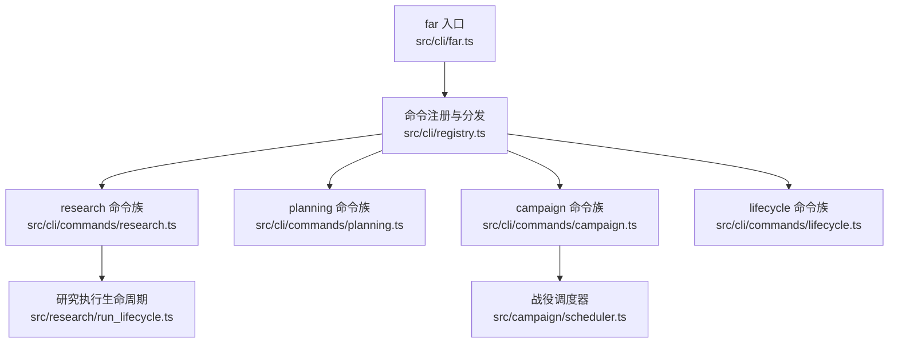
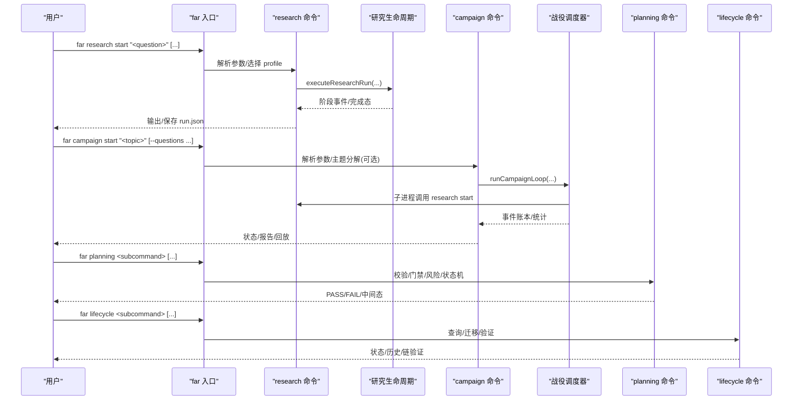
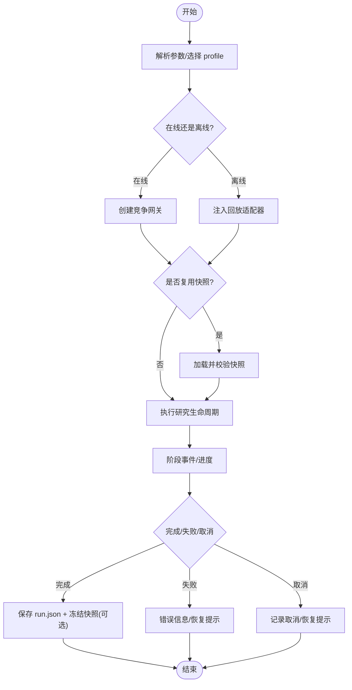
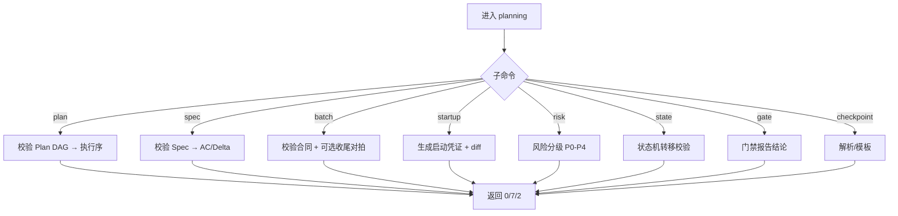
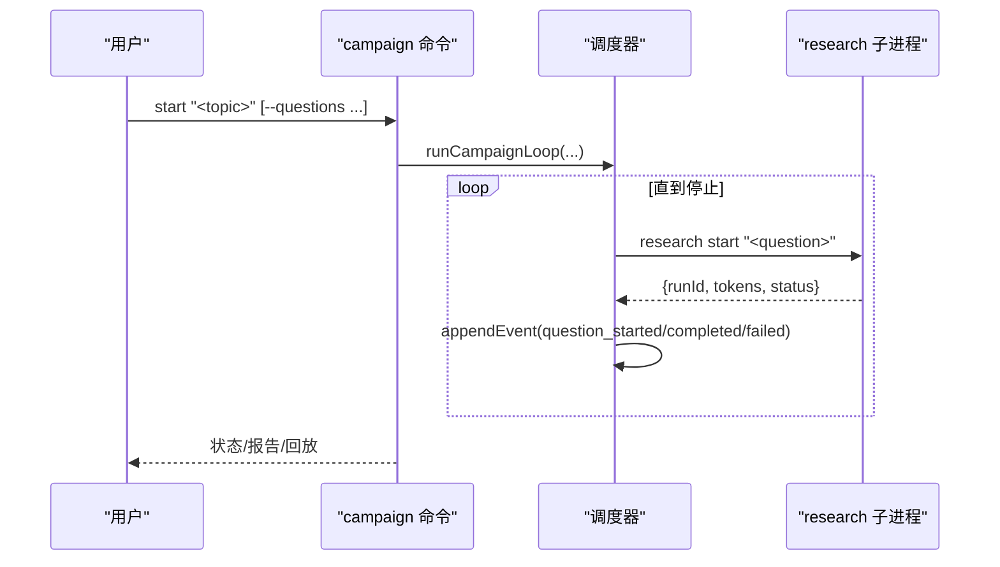
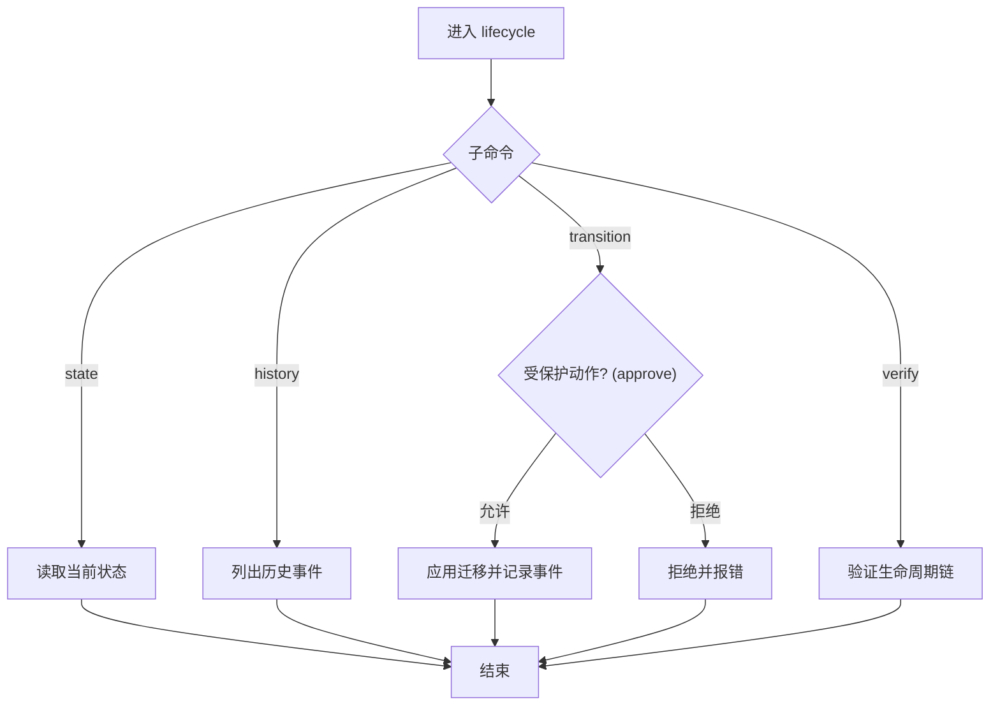
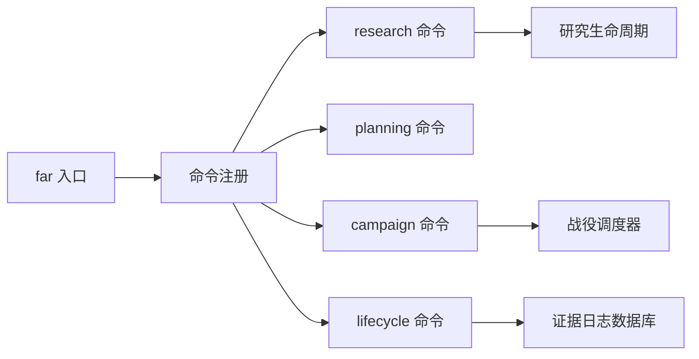

# 研究管理命令

<cite>
**本文引用的文件**
- [src/cli/far.ts](file://src/cli/far.ts)
- [src/cli/registry.ts](file://src/cli/registry.ts)
- [src/cli/commands/research.ts](file://src/cli/commands/research.ts)
- [src/cli/commands/planning.ts](file://src/cli/commands/planning.ts)
- [src/cli/commands/campaign.ts](file://src/cli/commands/campaign.ts)
- [src/cli/commands/lifecycle.ts](file://src/cli/commands/lifecycle.ts)
- [src/research/run_lifecycle.ts](file://src/research/run_lifecycle.ts)
- [src/campaign/scheduler.ts](file://src/campaign/scheduler.ts)
</cite>

## 目录
1. [简介](#简介)
2. [项目结构](#项目结构)
3. [核心组件](#核心组件)
4. [架构总览](#架构总览)
5. [详细组件分析](#详细组件分析)
6. [依赖关系分析](#依赖关系分析)
7. [性能与调度特性](#性能与调度特性)
8. [故障恢复与状态管理](#故障恢复与状态管理)
9. [结论](#结论)
10. [附录：参数速查](#附录参数速查)

## 简介
本文件面向“研究管理”相关 CLI，覆盖 research、planning、campaign、lifecycle 四大命令族。目标是帮助读者理解从研究规划到执行、监控、恢复与结果分析的完整工作流，包括批处理、调度、预算控制、事件账本、可恢复执行与审计追踪等能力。文档同时提供参数说明与最佳实践建议，便于在真实场景中稳定运行并产出可审计的研究证据链。

## 项目结构
FAR-Lab 的 CLI 入口为 far，通过表驱动注册与分发机制将子命令路由到具体实现。研究生命周期相关的四个命令族分别位于 src/cli/commands 下，并由远端模块（research、campaign、planning、evidence_log）提供核心逻辑。

图表来源
- [src/cli/far.ts:24-380](file://src/cli/far.ts#L24-L380)
- [src/cli/registry.ts:1-78](file://src/cli/registry.ts#L1-L78)
- [src/cli/commands/research.ts:1-120](file://src/cli/commands/research.ts#L1-L120)
- [src/cli/commands/planning.ts:1-105](file://src/cli/commands/planning.ts#L1-L105)
- [src/cli/commands/campaign.ts:1-40](file://src/cli/commands/campaign.ts#L1-L40)
- [src/cli/commands/lifecycle.ts:1-25](file://src/cli/commands/lifecycle.ts#L1-L25)
- [src/research/run_lifecycle.ts:1-24](file://src/research/run_lifecycle.ts#L1-L24)
- [src/campaign/scheduler.ts:1-41](file://src/campaign/scheduler.ts#L1-L41)

章节来源
- [src/cli/far.ts:24-380](file://src/cli/far.ts#L24-L380)
- [src/cli/registry.ts:1-78](file://src/cli/registry.ts#L1-L78)

## 核心组件
- far 入口与命令注册：集中声明所有子命令，支持懒加载与 --help 友好输出；统一退出码语义。
- research 命令族：端到端研究切片（ground → generate hypotheses → critique → score → plan），支持离线回放与在线模式、断点续跑、资源冻结快照复用、发现注册与记忆记录。
- planning 命令族：确定性门禁工具集（plan/spec/batch/startup/risk/state/gate/checkpoint），用于规范计划、规格、批量任务、启动凭证、风险分级、状态机转移与门禁报告。
- campaign 命令族：多问题战役编排，包含主题分解、预算守护、事件账本、崩溃恢复、报告生成与时间机器回放。
- lifecycle 命令族：针对证据/产物的撤回、纠正、替代（supersession）生命周期管理与验证。

章节来源
- [src/cli/far.ts:244-357](file://src/cli/far.ts#L244-L357)
- [src/cli/commands/research.ts:1-120](file://src/cli/commands/research.ts#L1-L120)
- [src/cli/commands/planning.ts:1-105](file://src/cli/commands/planning.ts#L1-L105)
- [src/cli/commands/campaign.ts:1-40](file://src/cli/commands/campaign.ts#L1-L40)
- [src/cli/commands/lifecycle.ts:1-25](file://src/cli/commands/lifecycle.ts#L1-L25)

## 架构总览
下图展示从 CLI 到执行引擎的关键交互路径，体现“规划→执行→监控→恢复→审计”的闭环。

图表来源
- [src/cli/far.ts:244-357](file://src/cli/far.ts#L244-L357)
- [src/cli/commands/research.ts:442-635](file://src/cli/commands/research.ts#L442-L635)
- [src/research/run_lifecycle.ts:1-24](file://src/research/run_lifecycle.ts#L1-L24)
- [src/cli/commands/campaign.ts:79-179](file://src/cli/commands/campaign.ts#L79-L179)
- [src/campaign/scheduler.ts:109-200](file://src/campaign/scheduler.ts#L109-L200)
- [src/cli/commands/planning.ts:63-105](file://src/cli/commands/planning.ts#L63-L105)
- [src/cli/commands/lifecycle.ts:90-157](file://src/cli/commands/lifecycle.ts#L90-L157)

## 详细组件分析

### research 命令族
- 功能要点
  - 支持 offline_replay 与 competition_aliyun_qwen 两种模式；auto 模式在有密钥时自动走在线模式，否则失败关闭并给出指引。
  - 支持多策略假设生成（multi_strategy）与策略子集选择；支持来源降级策略（degrade-on-source-failure）。
  - 支持冻结语料快照复用（--reuse-snapshot），避免重复检索且保证复现实验一致性。
  - 支持研究记忆（memory）记录与禁用（--no-memory / 环境变量）。
  - 支持 SIGINT 两阶段取消与断点续跑（status/resume）。
  - 成功运行后自动冻结 LIVE 语料快照，供后续复用。
- 关键流程
  - 参数解析 → 模式选择 → 构建 LLM Gateway/检索适配器 → 可选冻结快照 → 执行生命周期 → 输出/保存 → 摘要渲染（锦标赛、注册、记忆）。
- 典型用法
  - 开始：far research start "<question>" [--source openalex|arxiv|crossref] [--max-per-query N] [--profile auto|offline_replay|competition_aliyun_qwen] [--target 3..5] [--multi-strategy] [--strategies ...] [--degrade-on-source-failure] [--reuse-snapshot <id>] [--json] [--out file]
  - 状态：far research status <runId> [--json]
  - 恢复：far research resume <runId> [--profile ...] [--out file] [--json]
  - 其他：inspect/verify/export/compare/analyze/evaluate/baseline/feedback/memory/judge 等子命令由入口路由。

图表来源
- [src/cli/commands/research.ts:147-279](file://src/cli/commands/research.ts#L147-L279)
- [src/cli/commands/research.ts:442-635](file://src/cli/commands/research.ts#L442-L635)
- [src/research/run_lifecycle.ts:78-164](file://src/research/run_lifecycle.ts#L78-L164)

章节来源
- [src/cli/commands/research.ts:147-279](file://src/cli/commands/research.ts#L147-L279)
- [src/cli/commands/research.ts:442-635](file://src/cli/commands/research.ts#L442-L635)
- [src/research/run_lifecycle.ts:78-164](file://src/research/run_lifecycle.ts#L78-L164)

### planning 命令族
- 功能要点
  - plan：校验 Plan DAG，输出执行顺序与门禁报告。
  - spec：校验 Spec（含可验证标准、Delta、信任内核声明）。
  - batch：校验批量合同（十二字段），可选 closure 收尾对拍。
  - startup：生成启动凭证（资产哈希、基线、状态差异），并与上次对比。
  - risk：基于信号的风险分级（P0-P4）。
  - state：校验状态机转移（full/compressed）。
  - gate：综合门禁报告结论（DONE/IMPLEMENTED_UNVERIFIED/BLOCKED）。
  - checkpoint：解析检查点或生成模板。
- 退出码约定
  - 0 通过；7 门禁失败；3 中间态（IMPLEMENTED_UNVERIFIED）；2 用法/文件错误。
- 典型用法
  - far planning plan <file> [--json]
  - far planning spec <file> [--json]
  - far planning batch <contract> [--closure <closure>] [--json]
  - far planning startup --baseline <file> [--write] [--json]
  - far planning risk <signal...> [--json]
  - far planning state <from> <to> [--compress] [--json]
  - far planning gate <file> [--json]
  - far planning checkpoint <file|--template> [--json]

图表来源
- [src/cli/commands/planning.ts:63-105](file://src/cli/commands/planning.ts#L63-L105)
- [src/cli/commands/planning.ts:111-144](file://src/cli/commands/planning.ts#L111-L144)
- [src/cli/commands/planning.ts:150-183](file://src/cli/commands/planning.ts#L150-L183)
- [src/cli/commands/planning.ts:197-278](file://src/cli/commands/planning.ts#L197-L278)
- [src/cli/commands/planning.ts:292-378](file://src/cli/commands/planning.ts#L292-L378)
- [src/cli/commands/planning.ts:392-418](file://src/cli/commands/planning.ts#L392-L418)
- [src/cli/commands/planning.ts:424-450](file://src/cli/commands/planning.ts#L424-L450)
- [src/cli/commands/planning.ts:456-485](file://src/cli/commands/planning.ts#L456-L485)
- [src/cli/commands/planning.ts:491-539](file://src/cli/commands/planning.ts#L491-L539)

章节来源
- [src/cli/commands/planning.ts:63-105](file://src/cli/commands/planning.ts#L63-L105)
- [src/cli/commands/planning.ts:111-539](file://src/cli/commands/planning.ts#L111-L539)

### campaign 命令族
- 功能要点
  - start：支持显式问题列表或 LIVE LLM 主题分解（无 key 失败关闭）；记录 questionsSource；预算守护；事件账本持久化。
  - status：零网络重放事件账本，得到确定状态视图。
  - resume：崩溃恢复协议（running 残留先标记失败再重试一次）。
  - report：生成 Markdown/LaTeX/JSON 报告。
  - replay：时间机器回放，支持双回放 diff。
- 调度与恢复
  - 单写者假设；限流（429）诚实停机；预算熔断幂等记录；全部终态后记录完成。
  - 每个问题通过子进程调用 research start，继承其 checkpoint/退避能力。
- 典型用法
  - far campaign start "<topic>" [--questions "q1|q2|..."] [--budget-tokens N]
  - far campaign status <id>
  - far campaign resume <id>
  - far campaign report <id> [--format md|latex|json]
  - far campaign replay <id> [--diff <id2>]

图表来源
- [src/cli/commands/campaign.ts:79-179](file://src/cli/commands/campaign.ts#L79-L179)
- [src/campaign/scheduler.ts:109-200](file://src/campaign/scheduler.ts#L109-L200)

章节来源
- [src/cli/commands/campaign.ts:79-179](file://src/cli/commands/campaign.ts#L79-L179)
- [src/campaign/scheduler.ts:109-200](file://src/campaign/scheduler.ts#L109-L200)

### lifecycle 命令族
- 功能要点
  - 支持查询当前状态、历史事件、执行状态迁移、验证生命周期链。
  - transition 为受保护动作，需通过守卫（approve 场景）。
  - 目标类型与状态集合受约束，非法迁移将被拒绝。
- 典型用法
  - far lifecycle state --db <path> --target-kind <k> --target-id <id>
  - far lifecycle history --db <path> --target-kind <k> --target-id <id> [--json]
  - far lifecycle transition --db <path> --target-kind <k> --target-id <id> --to <state> --actor <a> --reason <r> [--audit-ref <ref>]
  - far lifecycle verify --db <path> --target-kind <k> --target-id <id>

图表来源
- [src/cli/commands/lifecycle.ts:90-157](file://src/cli/commands/lifecycle.ts#L90-L157)

章节来源
- [src/cli/commands/lifecycle.ts:90-157](file://src/cli/commands/lifecycle.ts#L90-L157)

## 依赖关系分析
- far 入口仅持有命令描述符与分发逻辑，命令实现按需懒加载，降低冷启动成本。
- research 命令依赖研究编排与生命周期存储，支持离线回放与在线模式切换。
- campaign 命令依赖调度器与事件账本，并通过子进程驱动 research 管线。
- planning 命令依赖确定性校验与门禁逻辑，不依赖外部模型。
- lifecycle 命令依赖证据日志数据库与受保护动作守卫。

图表来源
- [src/cli/far.ts:244-357](file://src/cli/far.ts#L244-L357)
- [src/cli/commands/research.ts:442-635](file://src/cli/commands/research.ts#L442-L635)
- [src/cli/commands/campaign.ts:79-179](file://src/cli/commands/campaign.ts#L79-L179)
- [src/cli/commands/planning.ts:63-105](file://src/cli/commands/planning.ts#L63-L105)
- [src/cli/commands/lifecycle.ts:90-157](file://src/cli/commands/lifecycle.ts#L90-L157)

章节来源
- [src/cli/far.ts:244-357](file://src/cli/far.ts#L244-L357)
- [src/cli/commands/research.ts:442-635](file://src/cli/commands/research.ts#L442-L635)
- [src/cli/commands/campaign.ts:79-179](file://src/cli/commands/campaign.ts#L79-L179)
- [src/cli/commands/planning.ts:63-105](file://src/cli/commands/planning.ts#L63-L105)
- [src/cli/commands/lifecycle.ts:90-157](file://src/cli/commands/lifecycle.ts#L90-L157)

## 性能与调度特性
- 懒加载与最小依赖：far 入口仅在需要时加载命令实现，减少 --help/未知命令路径的开销。
- 断点续跑与事件账本：research 与 campaign 均支持中断后可恢复，状态始终可从持久化数据推导。
- 预算守护与限流：campaign 使用 guardian 进行预算熔断，遇到限流诚实停机，避免硬撞。
- 快照复用：research 支持冻结语料快照，避免重复检索，提升复现性与效率。
- 确定性门禁：planning 命令族完全确定性，适合 CI 集成与合规审查。

[本节为通用指导，无需特定文件引用]

## 故障恢复与状态管理
- research
  - 支持 SIGINT 两阶段取消；失败/取消会保留已完成阶段与错误信息，可通过 status 查看，resume 继续未完成阶段。
  - 在线模式成功运行后自动冻结语料快照，供后续 --reuse-snapshot 复用。
- campaign
  - 崩溃恢复：running 残留问题会被补记失败并加入一次性重试集合；限流导致停机会记录原因，剩余问题保持 pending，等待操作者重启。
  - 预算熔断：当 guardian 判定不应继续且有未终态问题时，记录熔断事件（幂等）。
- lifecycle
  - 受保护动作（如 approve）需通过守卫；非法迁移被拒绝；支持链验证确保事件完整性。

章节来源
- [src/cli/commands/research.ts:442-541](file://src/cli/commands/research.ts#L442-L541)
- [src/research/run_lifecycle.ts:78-164](file://src/research/run_lifecycle.ts#L78-L164)
- [src/campaign/scheduler.ts:109-200](file://src/campaign/scheduler.ts#L109-L200)
- [src/cli/commands/lifecycle.ts:118-157](file://src/cli/commands/lifecycle.ts#L118-L157)

## 结论
FAR-Lab 的研究管理命令族提供了从规划、执行到监控、恢复与审计的全链路能力。research 聚焦单题研究切片，campaign 负责多题战役编排，planning 提供确定性门禁与规范，lifecycle 保障产物生命周期的可追溯与可审计。结合事件账本、预算守护、快照复用与断点续跑，可在复杂研究场景中实现高可靠、可复现、可审计的执行流程。

[本节为总结性内容，无需特定文件引用]

## 附录：参数速查
- research start
  - 必需：问题字符串（位置参数）
  - 可选：--source openalex|arxiv|crossref（可逗号/+分隔）、--max-per-query 1..25、--profile auto|offline_replay|competition_aliyun_qwen、--target 3..5、--multi-strategy、--strategies 策略ID列表、--degrade-on-source-failure、--no-memory、--reuse-snapshot <64位hex快照ID>、--json、--out 文件路径
- research status/resume/inspect/verify/export/compare/analyze/evaluate/baseline/feedback/memory/judge
  - 详见 far 入口中 research 子命令路由与 usage 提示
- planning
  - plan/spec/batch/startup/risk/state/gate/checkpoint 子命令，各自带 --json 开关与必要参数（见 planning 命令族章节）
- campaign
  - start: --questions "q1|q2|..." 或设置 FAR_DASHSCOPE_API_KEY 以启用 LIVE 分解；--budget-tokens N
  - status/resume/report/replay: 见 campaign 命令族章节
- lifecycle
  - state/history/transition/verify: 均需 --db、--target-kind、--target-id；transition 还需 --to、--actor、--reason，可选 --audit-ref；history 支持 --json

章节来源
- [src/cli/commands/research.ts:147-279](file://src/cli/commands/research.ts#L147-L279)
- [src/cli/far.ts:249-348](file://src/cli/far.ts#L249-L348)
- [src/cli/commands/planning.ts:63-105](file://src/cli/commands/planning.ts#L63-L105)
- [src/cli/commands/campaign.ts:79-179](file://src/cli/commands/campaign.ts#L79-L179)
- [src/cli/commands/lifecycle.ts:38-86](file://src/cli/commands/lifecycle.ts#L38-L86)