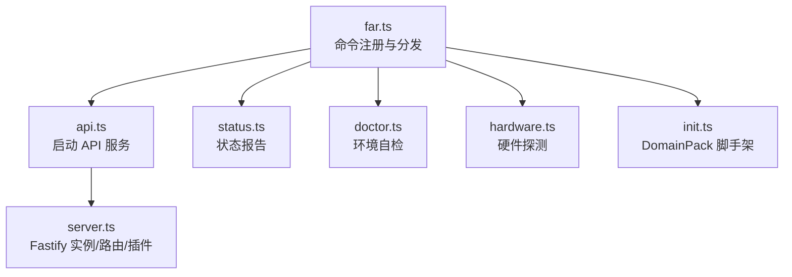
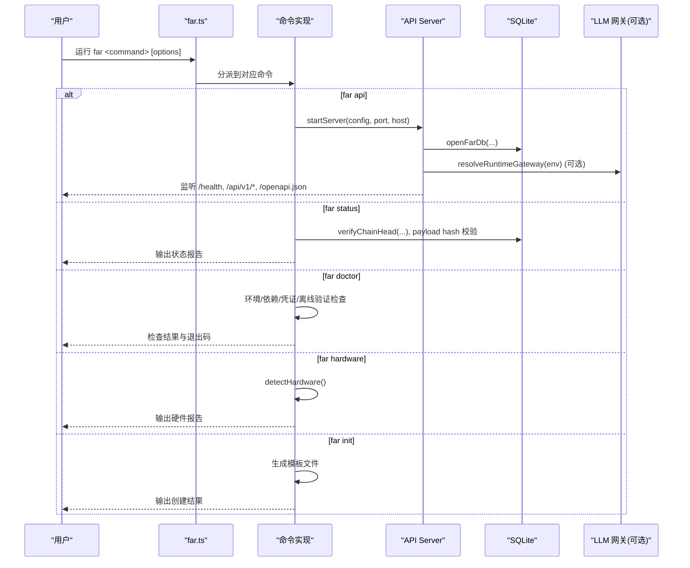
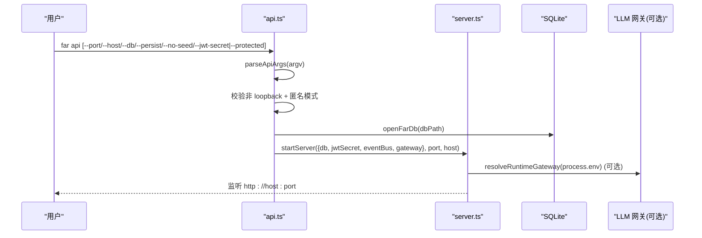
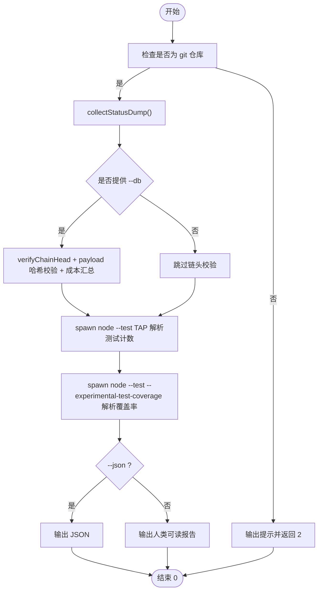
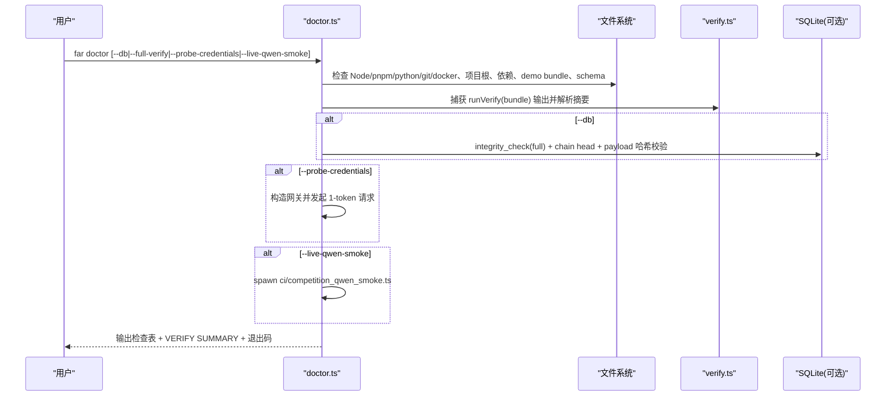
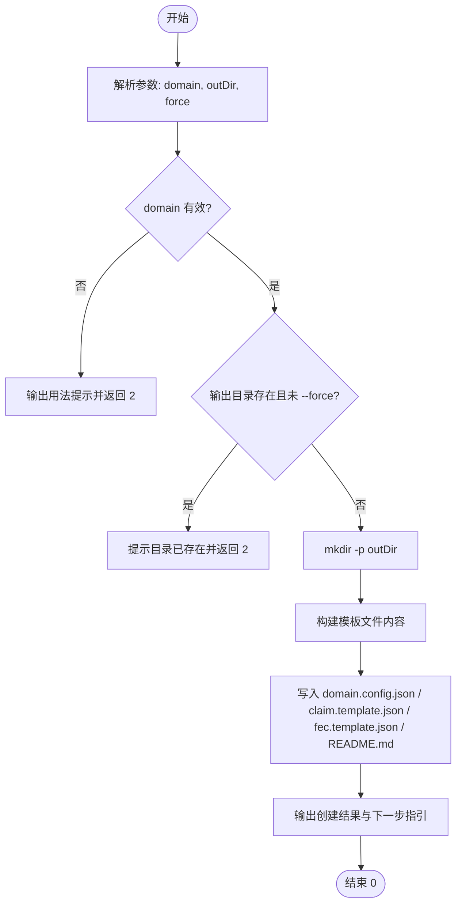
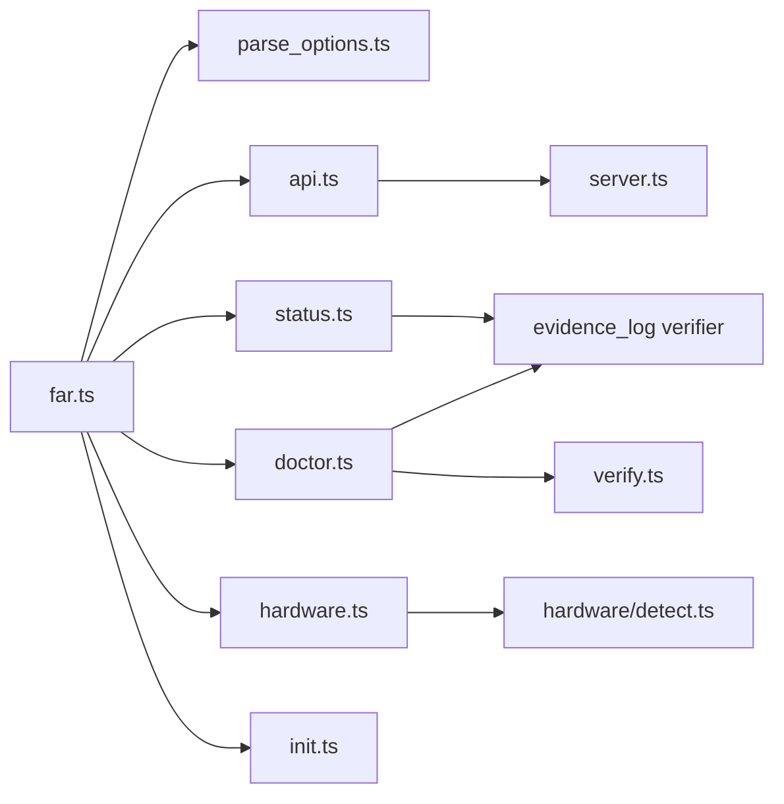

# 系统管理命令

<cite>
**本文引用的文件**
- [src/cli/far.ts](file://src/cli/far.ts)
- [src/cli/commands/api.ts](file://src/cli/commands/api.ts)
- [src/cli/commands/status.ts](file://src/cli/commands/status.ts)
- [src/cli/commands/doctor.ts](file://src/cli/commands/doctor.ts)
- [src/cli/commands/hardware.ts](file://src/cli/commands/hardware.ts)
- [src/cli/commands/init.ts](file://src/cli/commands/init.ts)
- [src/api/server.ts](file://src/api/server.ts)
- [src/cli/parse_options.ts](file://src/cli/parse_options.ts)
</cite>

## 目录
1. [简介](#简介)
2. [项目结构](#项目结构)
3. [核心组件](#核心组件)
4. [架构总览](#架构总览)
5. [详细组件分析](#详细组件分析)
6. [依赖关系分析](#依赖关系分析)
7. [性能与可观测性](#性能与可观测性)
8. [故障排除指南](#故障排除指南)
9. [结论](#结论)
10. [附录：命令速查表](#附录命令速查表)

## 简介
本文件面向系统运维与管理，系统化说明 FAR-Lab CLI 中的系统管理命令族，重点覆盖以下命令及其使用方法、参数选项、操作流程与最佳实践：
- far api：启动 REST API 服务（Fastify），支持本地/受保护模式、持久化数据库、演示数据注入、事件流等。
- far status：生成单一事实源（SSOT）的系统状态报告，包含仓库信息、链头校验、测试统计、覆盖率等。
- far doctor：环境自诊断，检查 Node/pnpm/python/git/docker、依赖、凭证形状、离线验证能力、可选 LIVE ping 等。
- far hardware：尽力而为的运行时硬件探测（CPU/GPU/加速器），输出人类可读或 JSON 结构化报告。
- far init：初始化 DomainPack 脚手架（domain.config.json、claim.template.json、fec.template.json、README.md）。

这些命令共同支撑系统部署、日常巡检、健康诊断、硬件适配与项目初始化，提供标准化的运维操作入口。

## 项目结构
FAR-Lab 的 CLI 入口位于 src/cli/far.ts，采用“声明式命令注册 + 懒加载实现”的分发模式；各子命令实现位于 src/cli/commands/*。API 服务由 src/api/server.ts 构建并启动，被 far api 命令调用。

图表来源
- [src/cli/far.ts:33-380](file://src/cli/far.ts#L33-L380)
- [src/cli/commands/api.ts:29-140](file://src/cli/commands/api.ts#L29-L140)
- [src/api/server.ts:112-255](file://src/api/server.ts#L112-L255)

章节来源
- [src/cli/far.ts:1-380](file://src/cli/far.ts#L1-L380)
- [src/cli/commands/api.ts:1-141](file://src/cli/commands/api.ts#L1-L141)
- [src/api/server.ts:1-291](file://src/api/server.ts#L1-L291)

## 核心组件
- 命令分发器：基于声明式 COMMANDS 数组，按 name 匹配后懒加载对应实现，避免冷启动开销。
- 参数解析：统一的 parseOptions 支持 --flag、--flag=value、布尔开关、枚举校验、必填项校验。
- API 服务：Fastify 应用，内置 helmet/cors/rate-limit/jwt/swagger，统一错误处理与 V1/V2 路由。
- 状态与诊断：status 聚合仓库元信息、链头校验、测试计数、覆盖率；doctor 执行环境/依赖/凭证/离线验证能力检查。
- 硬件探测：跨平台 CPU/GPU/加速器探测，仅用于展示与提示，不参与裁决输入。
- 初始化脚手架：生成领域模板与配置，降低接入成本。

章节来源
- [src/cli/far.ts:33-380](file://src/cli/far.ts#L33-L380)
- [src/cli/parse_options.ts:1-149](file://src/cli/parse_options.ts#L1-L149)
- [src/api/server.ts:112-255](file://src/api/server.ts#L112-L255)
- [src/cli/commands/status.ts:45-71](file://src/cli/commands/status.ts#L45-L71)
- [src/cli/commands/doctor.ts:609-667](file://src/cli/commands/doctor.ts#L609-L667)
- [src/cli/commands/hardware.ts:54-72](file://src/cli/commands/hardware.ts#L54-L72)
- [src/cli/commands/init.ts:208-240](file://src/cli/commands/init.ts#L208-L240)

## 架构总览
下图展示了远端用户通过 CLI 触发命令，进入具体实现模块，再调用底层服务（如 API Server、DB、LLM 网关）的整体流程。

图表来源
- [src/cli/far.ts:33-380](file://src/cli/far.ts#L33-L380)
- [src/cli/commands/api.ts:83-140](file://src/cli/commands/api.ts#L83-L140)
- [src/api/server.ts:265-291](file://src/api/server.ts#L265-L291)
- [src/cli/commands/status.ts:45-71](file://src/cli/commands/status.ts#L45-L71)
- [src/cli/commands/doctor.ts:609-667](file://src/cli/commands/doctor.ts#L609-L667)
- [src/cli/commands/hardware.ts:54-72](file://src/cli/commands/hardware.ts#L54-L72)
- [src/cli/commands/init.ts:208-240](file://src/cli/commands/init.ts#L208-L240)

## 详细组件分析

### far api：REST API 服务管理
- 功能概述
  - 启动 Fastify 服务器，默认监听 localhost:3000。
  - 支持匿名（offline）与受保护（JWT）两种模式；非 loopback 绑定且未启用 JWT 时拒绝启动，防止匿名写入信任账本。
  - 可选注入演示数据（默认开启），便于前端快速体验。
  - 可选注入 AgentEventBus，启用 /events/stream SSE 事件流。
  - 暴露 /health、/openapi.json、/api/v1/* 等端点。
- 关键参数
  - --port：端口号（也可通过 PORT 环境变量覆盖）。
  - --host：监听地址（默认 127.0.0.1）。
  - --db：数据库路径（默认内存 :memory:；--persist 使用 ./FAR-Lab.db）。
  - --no-seed：不注入演示数据。
  - --jwt-secret：显式设置 JWT 密钥。
  - --protected：从 FAR_JWT_SECRET 读取密钥以启用受保护模式（空值不会启用）。
- 安全要点
  - 非 loopback 绑定必须启用 JWT 鉴权，否则拒绝启动。
  - 匿名模式允许无认证写入，仅限本机开发场景。
- 启动流程（序列图）

图表来源
- [src/cli/commands/api.ts:29-140](file://src/cli/commands/api.ts#L29-L140)
- [src/api/server.ts:265-291](file://src/api/server.ts#L265-L291)

章节来源
- [src/cli/commands/api.ts:1-141](file://src/cli/commands/api.ts#L1-L141)
- [src/api/server.ts:1-291](file://src/api/server.ts#L1-L291)

### far status：系统状态检查
- 功能概述
  - 收集仓库元信息（commit、TS 文件数、迁移数量、文档数）、golden 向量计数、链头校验、测试计数、覆盖率等，形成 SSOT 报告。
  - 支持 --json 机器可读输出；始终返回退出码 0（只读报告，pending 字段不代表失败）。
- 关键参数
  - --json：输出 JSON。
  - --db：指定证据日志数据库路径，进行链头与 payload 哈希校验。
- 处理逻辑（流程图）

图表来源
- [src/cli/commands/status.ts:45-71](file://src/cli/commands/status.ts#L45-L71)
- [src/cli/commands/status.ts:73-146](file://src/cli/commands/status.ts#L73-L146)
- [src/cli/commands/status.ts:148-192](file://src/cli/commands/status.ts#L148-L192)

章节来源
- [src/cli/commands/status.ts:1-282](file://src/cli/commands/status.ts#L1-L282)

### far doctor：健康诊断与环境自检
- 功能概述
  - 检查 OS/Node/pnpm/python/git/docker、依赖安装、项目根位置、demo bundle、schema/migrations。
  - 核心能力自检：加载 better-sqlite3、离线验证 demo.far-proof、call payload 哈希覆盖自检。
  - 凭证健康检查：检查各类 provider key 的形状（前缀/长度/空白），仅 WARN 不 FAIL；可选 --probe-credentials 对 DashScope 进行 1-token LIVE ping（真实计费）。
  - 可选 --db 对指定数据库进行完整性检查与 payload 哈希校验。
  - 可选 --live-qwen-smoke 执行在线冒烟脚本。
  - 退出码：0 全绿；1 存在 FAIL；2 仅 WARN。
- 关键参数
  - --db：指定数据库路径进行完整性检查。
  - --full-verify：打印完整 far verify 报告。
  - --probe-credentials：触发 DashScope 1-token LIVE ping（需密钥）。
  - --live-qwen-smoke：执行在线冒烟脚本（需密钥）。
- 处理流程（序列图）

图表来源
- [src/cli/commands/doctor.ts:609-667](file://src/cli/commands/doctor.ts#L609-L667)
- [src/cli/commands/doctor.ts:183-209](file://src/cli/commands/doctor.ts#L183-L209)
- [src/cli/commands/doctor.ts:313-365](file://src/cli/commands/doctor.ts#L313-L365)
- [src/cli/commands/doctor.ts:486-520](file://src/cli/commands/doctor.ts#L486-L520)
- [src/cli/commands/doctor.ts:522-546](file://src/cli/commands/doctor.ts#L522-L546)

章节来源
- [src/cli/commands/doctor.ts:1-668](file://src/cli/commands/doctor.ts#L1-L668)

### far hardware：硬件检测
- 功能概述
  - 尽力而为探测 CPU/GPU/加速器（WebGPU/WASM），任何缺失均 UNKNOWN，绝不 crash。
  - 探测信息仅用于展示与提示，不参与 R0-R9 裁决核输入。
  - 支持 --json 输出结构化报告。
  - 零网络、零 API 调用。
- 关键参数
  - --json：输出 JSON。
- 输出示例（文本/JSON）
  - 文本：CPU 型号/核心/内存、GPU 设备列表、加速器平台与备注。
  - JSON：结构化报告供 CI/脚本消费。

章节来源
- [src/cli/commands/hardware.ts:1-73](file://src/cli/commands/hardware.ts#L1-L73)

### far init：初始化配置与脚手架
- 功能概述
  - 生成 DomainPack 脚手架目录，包含 domain.config.json、claim.template.json、fec.template.json、README.md。
  - 提供 wiring 指引与边界说明，降低新领域接入成本。
- 关键参数
  - <domain>：领域名称（必填）。
  - --out <dir>：输出目录（默认 ./domains/<domain>）。
  - --force：覆盖已存在的输出目录。
- 工作流程（流程图）

图表来源
- [src/cli/commands/init.ts:22-54](file://src/cli/commands/init.ts#L22-L54)
- [src/cli/commands/init.ts:61-203](file://src/cli/commands/init.ts#L61-L203)
- [src/cli/commands/init.ts:208-240](file://src/cli/commands/init.ts#L208-L240)

章节来源
- [src/cli/commands/init.ts:1-241](file://src/cli/commands/init.ts#L1-L241)

## 依赖关系分析
- far.ts 作为命令入口，通过 COMMANDS 数组声明式注册所有子命令，并在运行时懒加载实现，减少冷启动依赖。
- 各命令通过 src/cli/parse_options.ts 统一解析参数，保证一致的参数行为与错误报告。
- far api 依赖 server.ts 构建 Fastify 实例，注册中间件与路由，并可选择注入 LLM 网关与事件总线。
- far status 依赖 evidence_log 校验链头与 payload 哈希，并 spawn 测试与覆盖率工具。
- far doctor 依赖 better-sqlite3、verify 模块、以及可选的 LLM 网关进行 LIVE ping。
- far hardware 依赖 hardware/detect 模块进行跨平台硬件探测。
- far init 依赖文件系统 API 生成模板文件。

图表来源
- [src/cli/far.ts:33-380](file://src/cli/far.ts#L33-L380)
- [src/cli/parse_options.ts:1-149](file://src/cli/parse_options.ts#L1-L149)
- [src/cli/commands/api.ts:83-140](file://src/cli/commands/api.ts#L83-L140)
- [src/api/server.ts:112-255](file://src/api/server.ts#L112-L255)
- [src/cli/commands/status.ts:45-71](file://src/cli/commands/status.ts#L45-L71)
- [src/cli/commands/doctor.ts:609-667](file://src/cli/commands/doctor.ts#L609-L667)
- [src/cli/commands/hardware.ts:54-72](file://src/cli/commands/hardware.ts#L54-L72)
- [src/cli/commands/init.ts:208-240](file://src/cli/commands/init.ts#L208-L240)

章节来源
- [src/cli/far.ts:33-380](file://src/cli/far.ts#L33-L380)
- [src/cli/parse_options.ts:1-149](file://src/cli/parse_options.ts#L1-L149)
- [src/cli/commands/api.ts:83-140](file://src/cli/commands/api.ts#L83-L140)
- [src/api/server.ts:112-255](file://src/api/server.ts#L112-L255)
- [src/cli/commands/status.ts:45-71](file://src/cli/commands/status.ts#L45-L71)
- [src/cli/commands/doctor.ts:609-667](file://src/cli/commands/doctor.ts#L609-L667)
- [src/cli/commands/hardware.ts:54-72](file://src/cli/commands/hardware.ts#L54-L72)
- [src/cli/commands/init.ts:208-240](file://src/cli/commands/init.ts#L208-L240)

## 性能与可观测性
- API 服务
  - 请求超时与连接超时：requestTimeout=900s，connectionTimeout=60s，防止慢调用无限挂起。
  - 限流：默认 100 req/min，可通过 rateLimitMax 调整。
  - 指标：/metrics 暴露 Prometheus 文本格式指标。
  - 事件流：注入 AgentEventBus 后可用 /events/stream SSE 实时推送阶段事件。
- 状态与诊断
  - status 通过 spawn 子进程运行测试与覆盖率，失败降级为 pending，不影响整体成功。
  - doctor 在离线模式下进行核心能力自检，必要时可触发 LIVE ping（真实计费）。
- 硬件探测
  - 尽力而为策略，任何缺失均 UNKNOWN，确保命令稳定。

章节来源
- [src/api/server.ts:121-140](file://src/api/server.ts#L121-L140)
- [src/api/server.ts:171-174](file://src/api/server.ts#L171-L174)
- [src/api/server.ts:240-244](file://src/api/server.ts#L240-L244)
- [src/cli/commands/status.ts:73-146](file://src/cli/commands/status.ts#L73-L146)
- [src/cli/commands/doctor.ts:486-520](file://src/cli/commands/doctor.ts#L486-L520)
- [src/cli/commands/hardware.ts:1-73](file://src/cli/commands/hardware.ts#L1-L73)

## 故障排除指南
- far api 无法在非 loopback 上匿名启动
  - 现象：抛出错误并拒绝启动。
  - 原因：非 loopback 绑定且未启用 JWT 鉴权，匿名模式允许无认证写入信任账本。
  - 解决：绑定 127.0.0.1 或使用 --protected 设置 FAR_JWT_SECRET。
- far status 不在仓库中运行
  - 现象：提示不是仓库检出并返回 2。
  - 解决：在 FAR-Lab 源码根目录下运行，或使用 far doctor 做环境自检。
- far doctor 离线验证失败
  - 现象：verify 报告失败或核心能力不可用。
  - 解决：运行 far demo 生成 demo.far-proof 后再检查；必要时使用 --full-verify 查看完整报告。
- far doctor 凭证问题
  - 现象：凭证缺失或形状不匹配（WARN）。
  - 解决：根据提示设置正确的环境变量；如需 LIVE ping，使用 --probe-credentials。
- far hardware 未检测到 GPU
  - 现象：显示 none detected。
  - 解决：确认驱动/工具链可用；该信息仅用于展示，不影响确定性裁决。
- far init 输出目录已存在
  - 现象：提示目录已存在并返回 2。
  - 解决：使用 --force 覆盖或更换 --out 路径。

章节来源
- [src/cli/commands/api.ts:83-96](file://src/cli/commands/api.ts#L83-L96)
- [src/cli/commands/status.ts:45-54](file://src/cli/commands/status.ts#L45-L54)
- [src/cli/commands/doctor.ts:211-245](file://src/cli/commands/doctor.ts#L211-L245)
- [src/cli/commands/doctor.ts:439-479](file://src/cli/commands/doctor.ts#L439-L479)
- [src/cli/commands/hardware.ts:29-39](file://src/cli/commands/hardware.ts#L29-L39)
- [src/cli/commands/init.ts:219-224](file://src/cli/commands/init.ts#L219-L224)

## 结论
本文件系统化梳理了 FAR-Lab 的系统管理命令族，涵盖 API 服务管理、系统状态检查、健康诊断、硬件检测与初始化配置。通过统一的参数解析与健壮的错误处理，这些命令为系统部署、日常巡检、故障定位提供了标准化入口。建议在生产环境中：
- 使用 far api 时启用 JWT 鉴权并限制绑定地址。
- 定期运行 far status 与 far doctor，结合 --db 进行链头与 payload 哈希校验。
- 使用 far hardware 了解加速能力，但不依赖其进行裁决。
- 使用 far init 快速搭建领域模板，遵循模板指引完成 claim/FEC 配置。

## 附录：命令速查表
- far api
  - 用途：启动 REST API 服务。
  - 常用参数：--port、--host、--db、--persist、--no-seed、--jwt-secret、--protected。
  - 端点：/health、/openapi.json、/api/v1/*。
- far status
  - 用途：生成系统状态报告（SSOT）。
  - 常用参数：--json、--db。
- far doctor
  - 用途：环境自诊断与核心能力检查。
  - 常用参数：--db、--full-verify、--probe-credentials、--live-qwen-smoke。
- far hardware
  - 用途：运行时硬件探测。
  - 常用参数：--json。
- far init
  - 用途：初始化 DomainPack 脚手架。
  - 常用参数：<domain>、--out、--force。

章节来源
- [src/cli/commands/api.ts:29-78](file://src/cli/commands/api.ts#L29-L78)
- [src/cli/commands/status.ts:36-71](file://src/cli/commands/status.ts#L36-L71)
- [src/cli/commands/doctor.ts:26-38](file://src/cli/commands/doctor.ts#L26-L38)
- [src/cli/commands/hardware.ts:15-18](file://src/cli/commands/hardware.ts#L15-L18)
- [src/cli/commands/init.ts:12-54](file://src/cli/commands/init.ts#L12-L54)