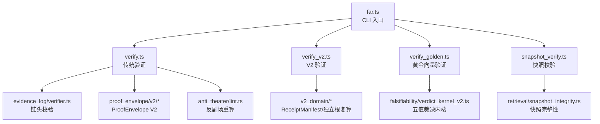
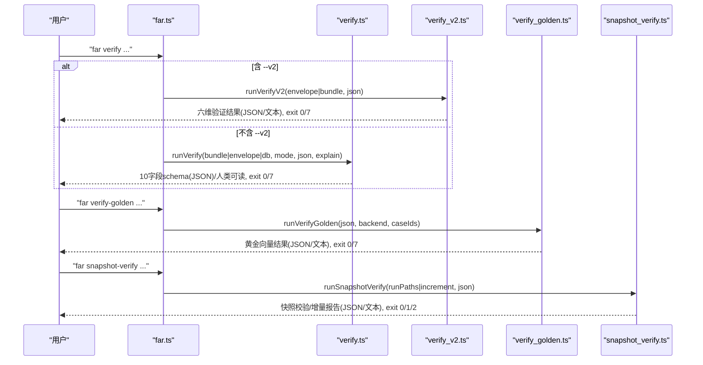
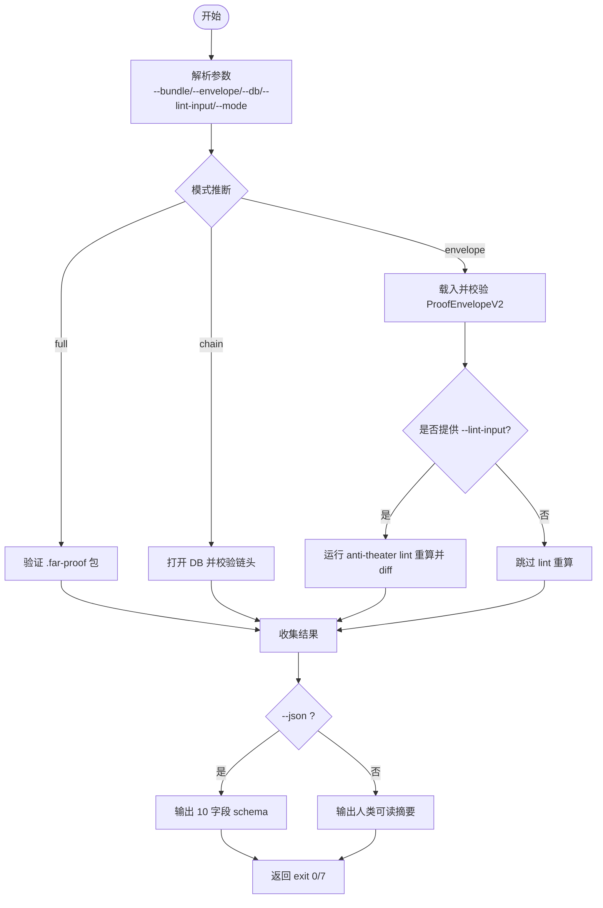
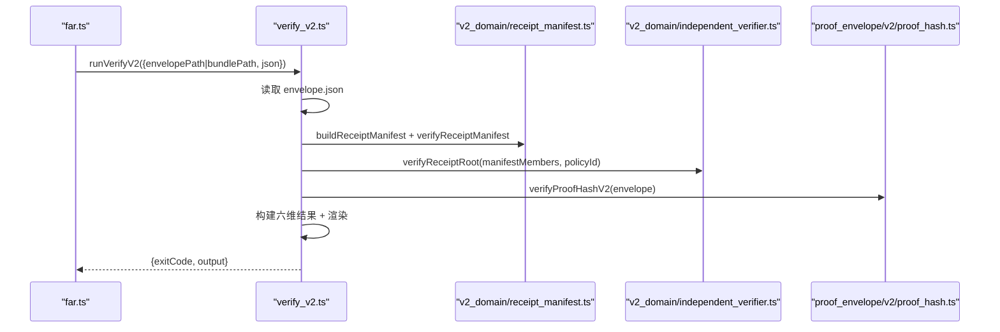
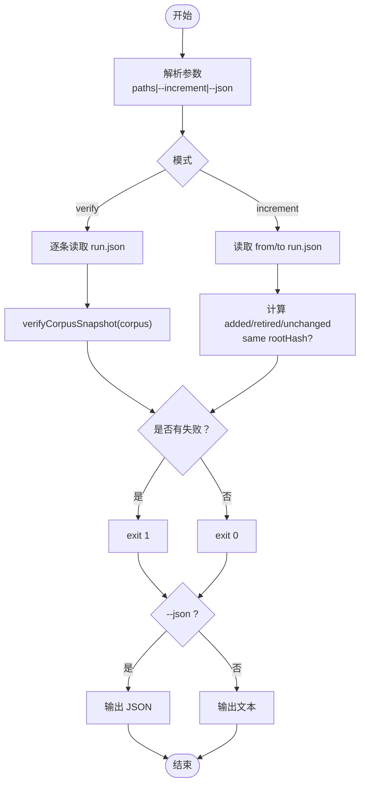
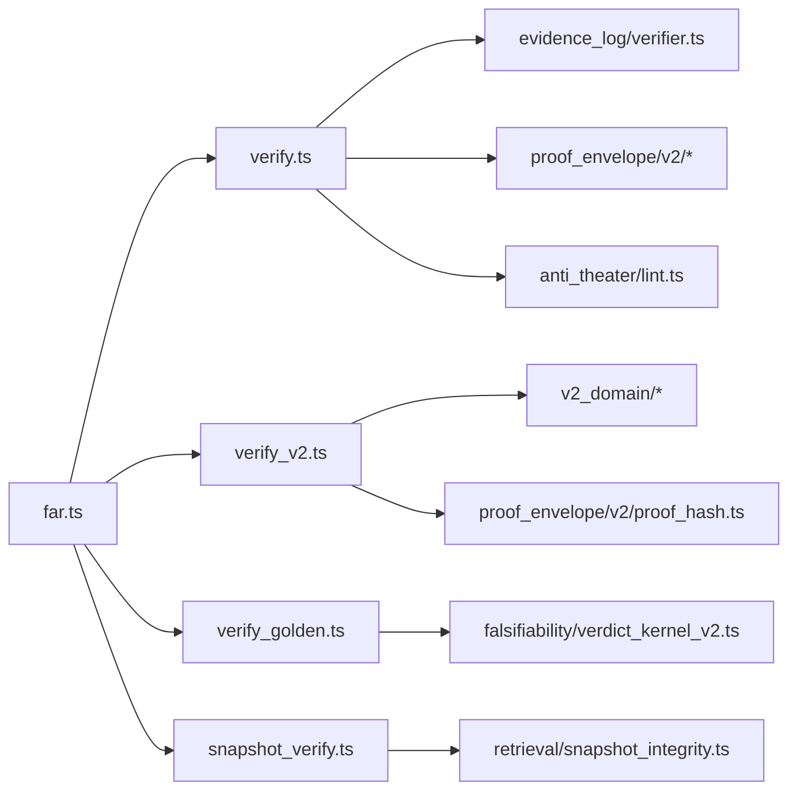

# 验证命令

<cite>
**本文引用的文件**
- [src/cli/far.ts](file://src/cli/far.ts)
- [src/cli/commands/verify.ts](file://src/cli/commands/verify.ts)
- [src/cli/commands/verify_v2.ts](file://src/cli/commands/verify_v2.ts)
- [src/cli/commands/verify_golden.ts](file://src/cli/commands/verify_golden.ts)
- [src/cli/commands/snapshot_verify.ts](file://src/cli/commands/snapshot_verify.ts)
- [tests/cli/verify.test.ts](file://tests/cli/verify.test.ts)
- [tests/cli/verify_golden.test.ts](file://tests/cli/verify_golden.test.ts)
</cite>

## 目录
1. [简介](#简介)
2. [项目结构](#项目结构)
3. [核心组件](#核心组件)
4. [架构总览](#架构总览)
5. [详细组件分析](#详细组件分析)
6. [依赖关系分析](#依赖关系分析)
7. [性能与调优](#性能与调优)
8. [故障排查](#故障排查)
9. [结论](#结论)
10. [附录：命令速查与示例](#附录命令速查与示例)

## 简介
本文件面向科学声明验证的 CLI 命令，覆盖以下命令：
- far verify：传统验证（V1 路径），支持 envelope、chain、full 模式，并可选 anti-theater lint 重算。
- far verify --v2：V2 验证路径，六维保障（provenance、integrity、identity、processConformance、executionReproduction、scientificVerdict）。
- far verify-golden：黄金向量验证，跨后端（node/python/browser）对预期结果进行一致性校验。
- far snapshot-verify：运行快照完整性校验与增量报告。

文档提供语法、参数说明、使用示例、错误处理、调试选项与性能建议，并给出复杂工作流组合方式（批量、条件分支等）。

## 项目结构
验证命令由 CLI 入口统一注册与分发，具体实现位于 commands 子模块中：
- far.ts：命令注册表与参数解析，负责将远端参数路由到 verify、verify_v2、verify_golden、snapshot-verify 等实现。
- verify.ts：传统验证（V1）实现，包含 envelope 校验、链头校验、anti-theater lint 重算、多轴 proofHash 复算（Node/Python/Browser）。
- verify_v2.ts：V2 验证路径，构建 ReceiptManifest，独立根复算，六维判定。
- verify_golden.ts：黄金向量验证，读取 cases/GV-*.json，按后端执行并对比期望。
- snapshot_verify.ts：快照完整性校验与增量报告。

图表来源
- [src/cli/far.ts:142-177](file://src/cli/far.ts#L142-L177)
- [src/cli/commands/verify.ts:1-12](file://src/cli/commands/verify.ts#L1-L12)
- [src/cli/commands/verify_v2.ts:1-11](file://src/cli/commands/verify_v2.ts#L1-L11)
- [src/cli/commands/verify_golden.ts:1-3](file://src/cli/commands/verify_golden.ts#L1-L3)
- [src/cli/commands/snapshot_verify.ts:1-21](file://src/cli/commands/snapshot_verify.ts#L1-L21)

章节来源
- [src/cli/far.ts:142-177](file://src/cli/far.ts#L142-L177)
- [src/cli/commands/verify.ts:1-12](file://src/cli/commands/verify.ts#L1-L12)
- [src/cli/commands/verify_v2.ts:1-11](file://src/cli/commands/verify_v2.ts#L1-L11)
- [src/cli/commands/verify_golden.ts:1-3](file://src/cli/commands/verify_golden.ts#L1-L3)
- [src/cli/commands/snapshot_verify.ts:1-21](file://src/cli/commands/snapshot_verify.ts#L1-L21)

## 核心组件
- 传统验证（verify）：支持三种模式（envelope、chain、full），可叠加 anti-theater lint 重算；输出 10 字段 schema；支持 JSON 与人类可读输出；exit code 约定 PASS=0、WARN=0、FAIL=7。
- V2 验证（verify --v2）：从 ProofEnvelopeV2 或 bundle 构建 manifest，独立根复算，六维判定；JSON 或表格化输出；exit code 约定 PASS=0、FAIL=7。
- 黄金向量验证（verify-golden）：遍历 golden_vectors/cases/GV-*.json，分别以 node/python/browser 后端执行五值裁决，并与期望比较；JSON 或文本输出；PASS=0、FAIL=7。
- 快照校验（snapshot-verify）：校验 run.json 的 corpus 快照一致性，或生成两个 run 之间的增量报告；JSON 或文本输出；exit code 约定 0/1/2。

章节来源
- [src/cli/commands/verify.ts:43-79](file://src/cli/commands/verify.ts#L43-L79)
- [src/cli/commands/verify_v2.ts:31-42](file://src/cli/commands/verify_v2.ts#L31-L42)
- [src/cli/commands/verify_golden.ts:26-55](file://src/cli/commands/verify_golden.ts#L26-L55)
- [src/cli/commands/snapshot_verify.ts:32-79](file://src/cli/commands/snapshot_verify.ts#L32-L79)

## 架构总览
下图展示四个命令在 CLI 层与领域层的交互关系，以及关键数据流。

图表来源
- [src/cli/far.ts:142-177](file://src/cli/far.ts#L142-L177)
- [src/cli/commands/verify.ts:643-769](file://src/cli/commands/verify.ts#L643-L769)
- [src/cli/commands/verify_v2.ts:47-153](file://src/cli/commands/verify_v2.ts#L47-L153)
- [src/cli/commands/verify_golden.ts:138-146](file://src/cli/commands/verify_golden.ts#L138-L146)
- [src/cli/commands/snapshot_verify.ts:131-215](file://src/cli/commands/snapshot_verify.ts#L131-L215)

## 详细组件分析

### 传统验证（far verify）
- 模式推断与约束
  - 当未显式指定 --mode 时：
    - 同时提供 --bundle 与 --db → full
    - 仅 --db → chain
    - 否则 → envelope（需 --envelope）
  - 若 --lint-input 存在则强制要求 --envelope（用于与内嵌 antiTheaterReport 对比）。
- 输入与输出
  - 输入：--bundle（.far-proof 包）、--envelope（ProofEnvelopeV2 JSON）、--db（evidence_log DB）、--lint-input（AntiTheaterLintInput JSON）、--pubkey（Ed25519 PEM，配合 --bundle）。
  - 输出：--json 输出 10 字段 schema；--explain 展开规则检查表；人类可读输出包含状态、证据级别、重算轴等。
- 重算轴
  - Node 轴：TS 实现 proofHash 重算。
  - Python 轴：调用 repro/far_chain_repro/proof_hash.py 镜像重算。
  - Browser 轴：加载 frontend/public/verify.html 内嵌脚本，通过 Web Crypto 独立复算。
- 退出码
  - 0：PASS/WARN；7：FAIL；2：参数错误；1：运行时错误。
- 典型用法
  - 验证单个 envelope：far verify --envelope path/to/envelope.json --json
  - 验证链头：far verify --db path/to/evidence.db --mode chain
  - 完整验证包：far verify --bundle path/to/bundle --mode full
  - 叠加 lint 重算：far verify --envelope ... --lint-input lint.json

图表来源
- [src/cli/far.ts:537-592](file://src/cli/far.ts#L537-L592)
- [src/cli/commands/verify.ts:643-769](file://src/cli/commands/verify.ts#L643-L769)

章节来源
- [src/cli/far.ts:537-592](file://src/cli/far.ts#L537-L592)
- [src/cli/commands/verify.ts:643-769](file://src/cli/commands/verify.ts#L643-L769)
- [tests/cli/verify.test.ts:448-663](file://tests/cli/verify.test.ts#L448-L663)

### V2 验证（far verify --v2）
- 功能概述
  - 从 ProofEnvelopeV2 JSON 或 .far-proof bundle 读取，构建 ReceiptManifest，独立根复算，六维保障判定。
  - 六维：provenance、integrity、identity、processConformance、executionReproduction、scientificVerdict。
- 输入与输出
  - 输入：--envelope <path> 或 --bundle <path>；--json 输出结构化结果。
  - 输出：JSON 或表格化文本，包含各维度 outcome、reasonCodes、detail。
- 退出码
  - 0：PASS（所有维度为 PASS/NOT_APPLICABLE/WARN）；7：FAIL（任一维度 FAIL）。
- 典型用法
  - 验证 envelope：far verify --v2 --envelope path/to/envelope.json --json
  - 验证 bundle：far verify --v2 --bundle path/to/bundle --json

图表来源
- [src/cli/far.ts:147-171](file://src/cli/far.ts#L147-L171)
- [src/cli/commands/verify_v2.ts:47-153](file://src/cli/commands/verify_v2.ts#L47-L153)

章节来源
- [src/cli/far.ts:147-171](file://src/cli/far.ts#L147-L171)
- [src/cli/commands/verify_v2.ts:47-153](file://src/cli/commands/verify_v2.ts#L47-L153)

### 黄金向量验证（far verify-golden）
- 功能概述
  - 读取 golden_vectors/cases/GV-*.json，分别以 node/python/browser 后端执行五值裁决，并与期望结果对比。
- 输入与输出
  - 输入：--all（默认，全部案例）、--case GV-XX（单例）、--case-dir（自定义目录）、--backend node|python|browser、--json。
  - 输出：JSON 或文本，包含每个案例的状态、裁决、决定性规则、原因代码等。
- 退出码
  - 0：PASS；7：FAIL。
- 典型用法
  - 全量验证：far verify-golden --json
  - 单例验证：far verify-golden --case GV-01 --backend python --json
  - 浏览器后端：far verify-golden --backend browser --all

```mermaid
flowchart TD
Start(["开始"]) --> LoadCases["扫描 cases/GV-*.json"]
LoadCases --> ForEach{"逐个案例"}
ForEach --> Backend{"选择后端"}
Backend --> |node| ExecNode["decideFiveValueVerdict(kernel)"]
Backend --> |python| ExecPy["spawnSync 调用 Python 模块"]
Backend --> |browser| ExecBr["加载 verify_golden.html 内联脚本"]
ExecNode --> Compare["与期望比较"]
ExecPy --> Compare
ExecBr --> Compare
Compare --> Next{"下一个案例？"}
Next --> |是| ForEach
Next --> |否| Summarize["汇总 PASS/FAIL"]
Summarize --> Output{"--json ?"}
Output --> |是| JsonOut["输出 JSON"]
Output --> |否| TextOut["输出文本"]
JsonOut --> Exit["返回 exit 0/7"]
TextOut --> Exit
```

图表来源
- [src/cli/commands/verify_golden.ts:104-146](file://src/cli/commands/verify_golden.ts#L104-L146)
- [src/cli/commands/verify_golden.ts:195-232](file://src/cli/commands/verify_golden.ts#L195-L232)

章节来源
- [src/cli/commands/verify_golden.ts:104-146](file://src/cli/commands/verify_golden.ts#L104-L146)
- [tests/cli/verify_golden.test.ts:69-111](file://tests/cli/verify_golden.test.ts#L69-L111)

### 快照校验（far snapshot-verify）
- 功能概述
  - 校验 run.json 的 corpus 快照一致性，或生成两个 run 之间的增量报告。
- 输入与输出
  - 输入：run.json 路径列表或 "-"（从 stdin 读取路径）；--increment A B（增量模式）；--json。
  - 输出：JSON 或文本，包含每份 run 的校验结果或增量报告（added/retired/unchanged 等）。
- 退出码
  - 0：全部 ok；1：任一 mismatch 或读取失败；2：用法错误。
- 典型用法
  - 批量校验：echo -e "a.json\nb.json" | far snapshot-verify - --json
  - 增量报告：far snapshot-verify --increment runA.json runB.json --json

图表来源
- [src/cli/commands/snapshot_verify.ts:87-120](file://src/cli/commands/snapshot_verify.ts#L87-L120)
- [src/cli/commands/snapshot_verify.ts:131-215](file://src/cli/commands/snapshot_verify.ts#L131-L215)

章节来源
- [src/cli/commands/snapshot_verify.ts:87-120](file://src/cli/commands/snapshot_verify.ts#L87-L120)
- [src/cli/commands/snapshot_verify.ts:131-215](file://src/cli/commands/snapshot_verify.ts#L131-L215)

## 依赖关系分析
- CLI 层
  - far.ts 作为入口，集中注册命令与参数解析，按需懒加载实现模块，避免冷启动开销。
- 传统验证（verify.ts）
  - 依赖 evidence_log/verifier.ts（链头校验）、proof_envelope/v2/*（ProofEnvelope V2 校验与 proofHash 重算）、anti_theater/lint.ts（反剧场重算）、前端 verify.html（Browser 轴）。
- V2 验证（verify_v2.ts）
  - 依赖 v2_domain/*（ReceiptManifest、独立根复算、策略注册表）、proof_envelope/v2/proof_hash.ts（proofHash 重算）。
- 黄金向量（verify_golden.ts）
  - 依赖 falsifiability/verdict_kernel_v2.ts（五值裁决内核）、frontend/public/verify_golden.html（Browser 后端）。
- 快照校验（snapshot_verify.ts）
  - 依赖 retrieval/snapshot_integrity.ts（readRunCorpus、verifyCorpusSnapshot、snapshotIncrement）。

图表来源
- [src/cli/far.ts:142-177](file://src/cli/far.ts#L142-L177)
- [src/cli/commands/verify.ts:15-31](file://src/cli/commands/verify.ts#L15-L31)
- [src/cli/commands/verify_v2.ts:13-29](file://src/cli/commands/verify_v2.ts#L13-L29)
- [src/cli/commands/verify_golden.ts:15-19](file://src/cli/commands/verify_golden.ts#L15-L19)
- [src/cli/commands/snapshot_verify.ts:23-30](file://src/cli/commands/snapshot_verify.ts#L23-L30)

章节来源
- [src/cli/far.ts:142-177](file://src/cli/far.ts#L142-L177)
- [src/cli/commands/verify.ts:15-31](file://src/cli/commands/verify.ts#L15-L31)
- [src/cli/commands/verify_v2.ts:13-29](file://src/cli/commands/verify_v2.ts#L13-L29)
- [src/cli/commands/verify_golden.ts:15-19](file://src/cli/commands/verify_golden.ts#L15-L19)
- [src/cli/commands/snapshot_verify.ts:23-30](file://src/cli/commands/snapshot_verify.ts#L23-L30)

## 性能与调优
- 传统验证（verify）
  - 多轴重算（Node/Python/Browser）会增加耗时；在 CI 环境中可优先启用 --json 以便快速解析；Python 轴受限于进程 spawn 与超时（默认 10s）。
  - 使用 --explain 仅在需要诊断时开启，避免额外渲染开销。
- V2 验证（verify --v2）
  - 独立根复算与 manifest 校验均为纯函数，适合并行批处理；注意策略注册表的 fail-closed 行为（策略废弃会抛错）。
- 黄金向量（verify-golden）
  - Python 后端通过子进程执行，批量运行时建议分片以避免内存溢出；Browser 后端无网络依赖，适合离线环境。
- 快照校验（snapshot-verify）
  - 批量校验时，stdin 模式（-）便于管道化；增量模式只比较差异，适合频繁迭代场景。

[本节为通用指导，不直接分析具体文件]

## 故障排查
- 传统验证（verify）
  - 常见错误：缺少必需参数（如 --mode envelope 但未提供 --envelope）、DB 无法打开、envelope JSON 解析失败、proofHash 失配、链头断裂、payload hash 不一致。
  - 诊断要点：查看 errors/warnings 列表；确认 verifiedLevels；检查 tamperStatus/scopeStatus。
- V2 验证（verify --v2）
  - 常见错误：manifest 缺失成员、proofHash 重算失败、策略不可用。
  - 诊断要点：检查各维度 outcome 与 reasonCodes；确认 receiptStanding/preservationStatus。
- 黄金向量（verify-golden）
  - 常见错误：case 文件不存在、后端执行失败、期望结果漂移。
  - 诊断要点：查看每个 case 的 errors；确认 decisiveRuleId/reasonCodes 是否与期望一致。
- 快照校验（snapshot-verify）
  - 常见错误：run.json 不可读、mismatch 列表非空、增量参数错误。
  - 诊断要点：检查 mismatches；增量报告中 added/retired/unchanged 计数与 same rootHash。

章节来源
- [src/cli/commands/verify.ts:643-769](file://src/cli/commands/verify.ts#L643-L769)
- [src/cli/commands/verify_v2.ts:47-153](file://src/cli/commands/verify_v2.ts#L47-L153)
- [src/cli/commands/verify_golden.ts:138-146](file://src/cli/commands/verify_golden.ts#L138-L146)
- [src/cli/commands/snapshot_verify.ts:131-215](file://src/cli/commands/snapshot_verify.ts#L131-L215)

## 结论
- 传统验证适用于独立第三方重算与审计，支持 envelope、chain、full 模式与 multi-axis proofHash 复算。
- V2 验证提供更强的六维保障，适合现代收据体系与策略驱动的场景。
- 黄金向量验证确保裁决内核在不同后端的一致性，是回归测试与跨语言对齐的关键。
- 快照校验保障运行数据的完整性与可比性，支持增量报告以追踪变更。

[本节为总结，不直接分析具体文件]

## 附录：命令速查与示例
- far verify
  - 语法：far verify [--bundle <dir>] [--envelope <path>] [--db <path>] [--lint-input <path>] [--pubkey <path>] [--mode chain|envelope|full] [--json] [--explain]
  - 示例：
    - far verify --envelope envelope.json --json
    - far verify --db evidence.db --mode chain
    - far verify --bundle bundle --mode full
    - far verify --envelope envelope.json --lint-input lint.json --json
- far verify --v2
  - 语法：far verify --v2 [--envelope <path>|--bundle <path>] [--json]
  - 示例：
    - far verify --v2 --envelope envelope.json --json
    - far verify --v2 --bundle bundle --json
- far verify-golden
  - 语法：far verify-golden [--all] [--case GV-XX] [--case-dir <path>] [--backend node|python|browser] [--json]
  - 示例：
    - far verify-golden --json
    - far verify-golden --case GV-01 --backend python --json
    - far verify-golden --backend browser --all
- far snapshot-verify
  - 语法：far snapshot-verify <run.json> [<run2.json> ...] [--json] | far snapshot-verify - [--json] | far snapshot-verify --increment <runA.json> <runB.json> [--json]
  - 示例：
    - echo -e "a.json\nb.json" | far snapshot-verify - --json
    - far snapshot-verify --increment runA.json runB.json --json

章节来源
- [src/cli/far.ts:485-519](file://src/cli/far.ts#L485-L519)
- [src/cli/far.ts:537-592](file://src/cli/far.ts#L537-L592)
- [src/cli/far.ts:742-763](file://src/cli/far.ts#L742-L763)
- [tests/cli/verify.test.ts:448-663](file://tests/cli/verify.test.ts#L448-L663)
- [tests/cli/verify_golden.test.ts:69-111](file://tests/cli/verify_golden.test.ts#L69-L111)