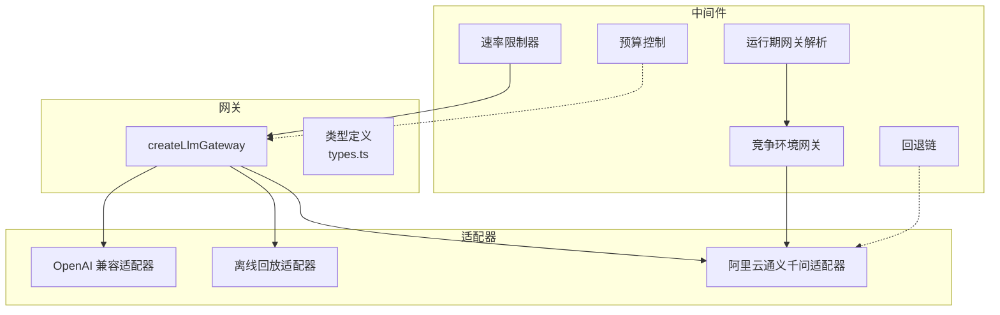
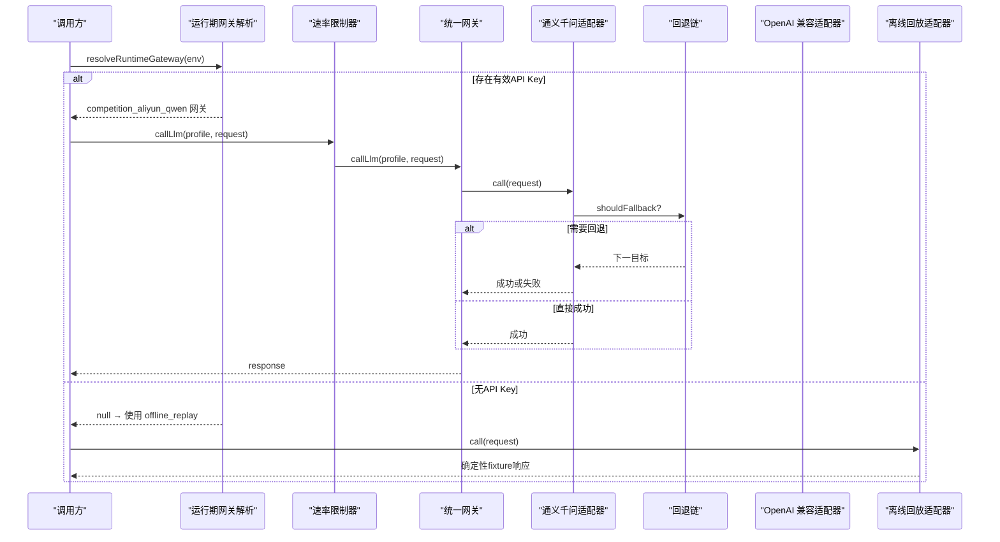
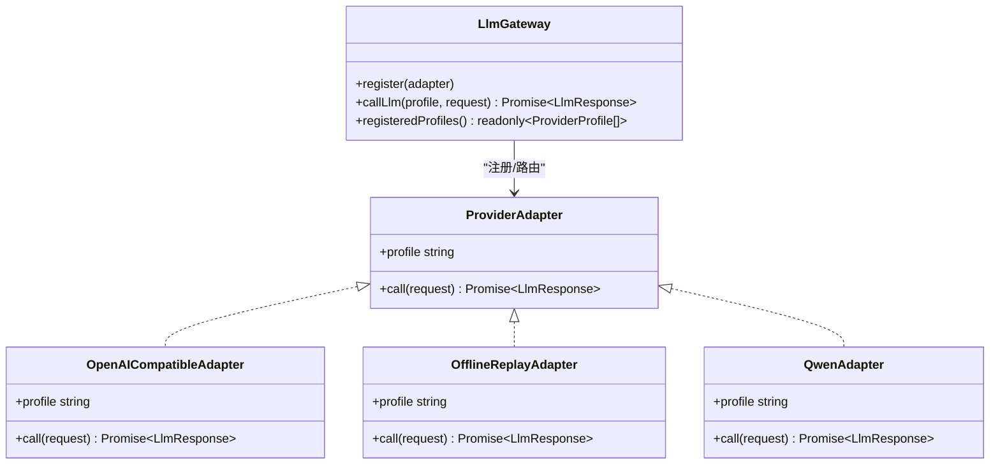
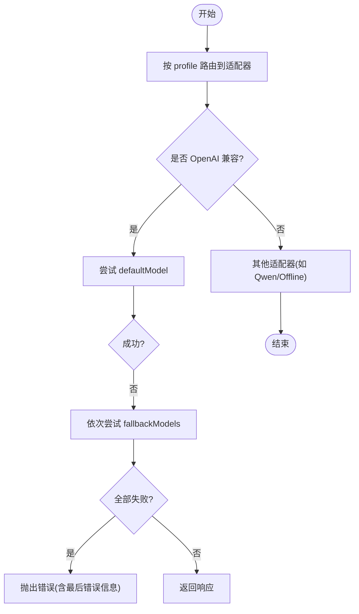
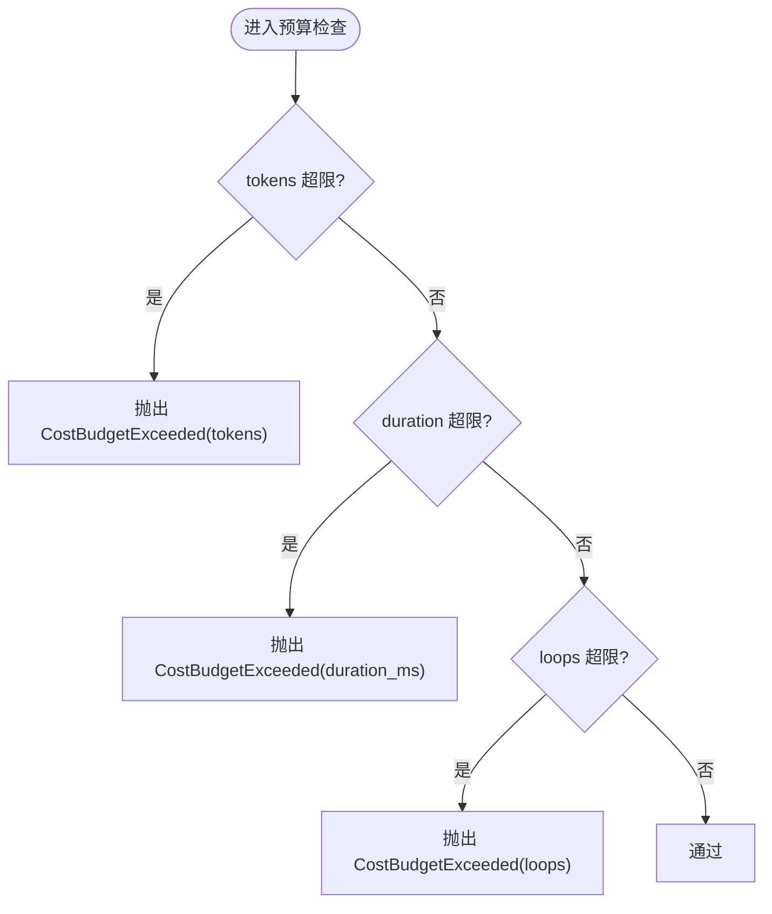
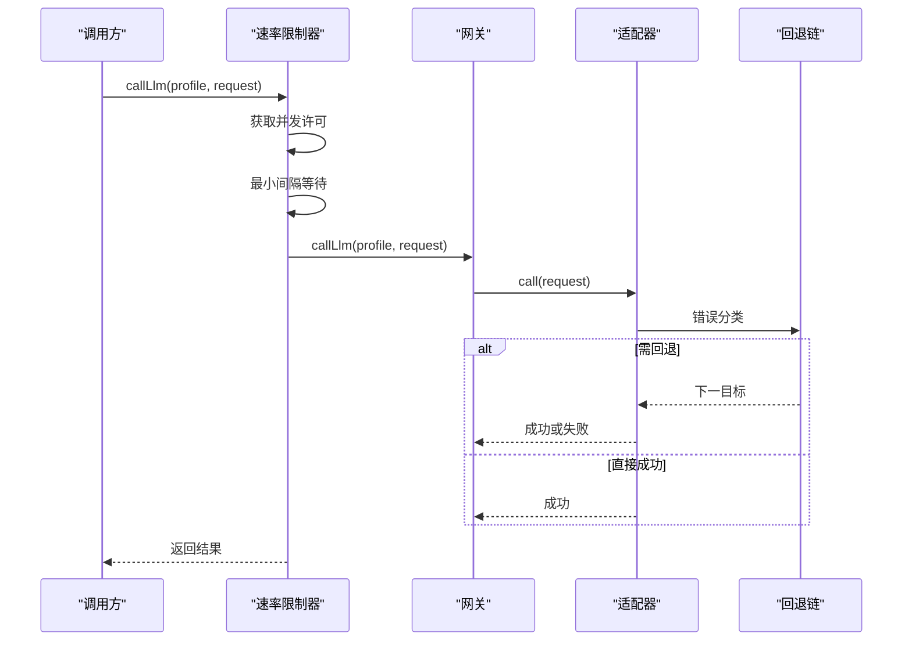
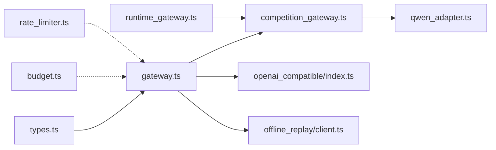

# LLM集成

<cite>
**本文引用的文件**
- [src/llm_gateway/index.ts](file://src/llm_gateway/index.ts)
- [src/llm_gateway/types.ts](file://src/llm_gateway/types.ts)
- [src/llm_gateway/gateway.ts](file://src/llm_gateway/gateway.ts)
- [src/llm_gateway/budget.ts](file://src/llm_gateway/budget.ts)
- [src/llm_gateway/rate_limiter.ts](file://src/llm_gateway/rate_limiter.ts)
- [src/llm_gateway/runtime_gateway.ts](file://src/llm_gateway/runtime_gateway.ts)
- [src/llm_gateway/competition_gateway.ts](file://src/llm_gateway/competition_gateway.ts)
- [src/llm_gateway/adapters/openai_compatible/index.ts](file://src/llm_gateway/adapters/openai_compatible/index.ts)
- [src/llm_gateway/adapters/openai_compatible/presets.ts](file://src/llm_gateway/adapters/openai_compatible/presets.ts)
- [src/llm_gateway/adapters/offline_replay/client.ts](file://src/llm_gateway/adapters/offline_replay/client.ts)
- [src/llm_gateway/fallback_chain/index.ts](file://src/llm_gateway/fallback_chain/index.ts)
</cite>

## 目录
1. [简介](#简介)
2. [项目结构](#项目结构)
3. [核心组件](#核心组件)
4. [架构总览](#架构总览)
5. [详细组件分析](#详细组件分析)
6. [依赖关系分析](#依赖关系分析)
7. [性能与成本考量](#性能与成本考量)
8. [故障排查指南](#故障排查指南)
9. [结论](#结论)
10. [附录：最佳实践与优化建议](#附录最佳实践与优化建议)

## 简介
本仓库实现了统一的 LLM 网关与适配器模式，屏蔽不同提供商（OpenAI、阿里云通义千问等）的接口差异，提供模型选择、路由、预算控制、限流重试、离线回放与测试支持。通过“统一请求/响应类型 + 适配器注册表”的方式，上层业务无需感知底层实现细节；同时内置结构化输出处理、错误恢复与降级策略，确保生产可用性与可观测性。

## 项目结构
LLM 相关代码集中在 src/llm_gateway 目录，采用“网关 + 适配器 + 中间件”的分层组织：
- 网关层：统一入口、注册与调度（gateway.ts、types.ts）
- 适配器层：各提供商适配（openai_compatible、aliyun_qwen、offline_replay）
- 中间件层：限流、运行期解析、竞争环境网关、预算控制、回退链
- 配置与预置：OpenAI 兼容预置 profile、运行时环境解析

图表来源
- [src/llm_gateway/gateway.ts:17-41](file://src/llm_gateway/gateway.ts#L17-L41)
- [src/llm_gateway/types.ts:1-129](file://src/llm_gateway/types.ts#L1-L129)
- [src/llm_gateway/adapters/openai_compatible/index.ts:78-154](file://src/llm_gateway/adapters/openai_compatible/index.ts#L78-L154)
- [src/llm_gateway/adapters/offline_replay/client.ts:86-128](file://src/llm_gateway/adapters/offline_replay/client.ts#L86-L128)
- [src/llm_gateway/competition_gateway.ts:40-53](file://src/llm_gateway/competition_gateway.ts#L40-L53)
- [src/llm_gateway/rate_limiter.ts:25-83](file://src/llm_gateway/rate_limiter.ts#L25-L83)
- [src/llm_gateway/runtime_gateway.ts:36-44](file://src/llm_gateway/runtime_gateway.ts#L36-L44)
- [src/llm_gateway/fallback_chain/index.ts:12-25](file://src/llm_gateway/fallback_chain/index.ts#L12-L25)

章节来源
- [src/llm_gateway/index.ts:1-42](file://src/llm_gateway/index.ts#L1-L42)
- [src/llm_gateway/types.ts:1-129](file://src/llm_gateway/types.ts#L1-L129)

## 核心组件
- 统一网关：基于 ProviderAdapter 注册表，按 profile 路由到具体适配器，屏蔽差异。
- 适配器：OpenAI 兼容（多厂商）、离线回放（确定性测试）、阿里云通义千问（竞争环境）。
- 中间件：速率限制（并发+最小间隔）、运行期网关解析（凭据门）、竞争环境网关（Qwen-only）、预算控制（硬断路）、回退链（错误分类与降级）。
- 配置与预置：OpenAI 兼容预置 profile 一键注册，环境变量驱动密钥管理。

章节来源
- [src/llm_gateway/gateway.ts:17-41](file://src/llm_gateway/gateway.ts#L17-L41)
- [src/llm_gateway/adapters/openai_compatible/index.ts:78-154](file://src/llm_gateway/adapters/openai_compatible/index.ts#L78-L154)
- [src/llm_gateway/adapters/openai_compatible/presets.ts:29-91](file://src/llm_gateway/adapters/openai_compatible/presets.ts#L29-L91)
- [src/llm_gateway/adapters/offline_replay/client.ts:86-128](file://src/llm_gateway/adapters/offline_replay/client.ts#L86-L128)
- [src/llm_gateway/competition_gateway.ts:40-53](file://src/llm_gateway/competition_gateway.ts#L40-L53)
- [src/llm_gateway/rate_limiter.ts:25-83](file://src/llm_gateway/rate_limiter.ts#L25-L83)
- [src/llm_gateway/runtime_gateway.ts:36-44](file://src/llm_gateway/runtime_gateway.ts#L36-L44)
- [src/llm_gateway/fallback_chain/index.ts:12-25](file://src/llm_gateway/fallback_chain/index.ts#L12-L25)

## 架构总览
下图展示了从调用方到适配器的完整链路，包括运行期解析、竞争环境网关、速率限制、预算检查、回退链与适配器调用。

图表来源
- [src/llm_gateway/runtime_gateway.ts:36-44](file://src/llm_gateway/runtime_gateway.ts#L36-L44)
- [src/llm_gateway/rate_limiter.ts:25-83](file://src/llm_gateway/rate_limiter.ts#L25-L83)
- [src/llm_gateway/gateway.ts:17-41](file://src/llm_gateway/gateway.ts#L17-L41)
- [src/llm_gateway/competition_gateway.ts:40-53](file://src/llm_gateway/competition_gateway.ts#L40-L53)
- [src/llm_gateway/fallback_chain/index.ts:12-25](file://src/llm_gateway/fallback_chain/index.ts#L12-L25)
- [src/llm_gateway/adapters/offline_replay/client.ts:86-128](file://src/llm_gateway/adapters/offline_replay/client.ts#L86-L128)

## 详细组件分析

### 统一网关与适配器模式
- 设计要点：
  - 通过 ProviderAdapter 接口抽象所有 LLM 调用，统一 LlmRequest/LlmResponse 类型。
  - createLlmGateway 维护 profile→adapter 映射，callLlm 按 profile 路由。
  - 新增提供商只需实现 ProviderAdapter 并注册。
- 关键流程：
  - 注册阶段：将适配器加入 Map。
  - 调用阶段：根据 profile 查找适配器，若不存在则抛错。

图表来源
- [src/llm_gateway/gateway.ts:17-41](file://src/llm_gateway/gateway.ts#L17-L41)
- [src/llm_gateway/types.ts:114-129](file://src/llm_gateway/types.ts#L114-L129)
- [src/llm_gateway/adapters/openai_compatible/index.ts:78-154](file://src/llm_gateway/adapters/openai_compatible/index.ts#L78-L154)
- [src/llm_gateway/adapters/offline_replay/client.ts:86-128](file://src/llm_gateway/adapters/offline_replay/client.ts#L86-L128)
- [src/llm_gateway/competition_gateway.ts:40-53](file://src/llm_gateway/competition_gateway.ts#L40-L53)

章节来源
- [src/llm_gateway/gateway.ts:17-41](file://src/llm_gateway/gateway.ts#L17-L41)
- [src/llm_gateway/types.ts:1-129](file://src/llm_gateway/types.ts#L1-L129)

### 支持的提供商与接入方式
- OpenAI 兼容适配器：
  - 支持 OpenAI、DeepSeek、智谱 GLM、本地 Ollama/vLLM 等任意 OpenAI 兼容端点。
  - 通过 baseURL + envVar + defaultModel 配置，支持 fallbackModels 列表自动降级。
  - 结构化输出：当 responseFormat='json_schema' 时透传 json_schema 参数。
  - 预置 profile：OPENAI_COMPATIBLE_PRESETS 提供开箱即用配置。
- 阿里云通义千问（竞争环境）：
  - 通过 createCompetitionQwenGateway 构造，内部使用 Qwen 适配器与回退链。
  - 仅用于 competition_aliyun_qwen profile，遵循模型中立红线。
- 离线回放适配器：
  - 用于测试与演示，按 stageId 匹配 fixture，严格模式下未命中即抛错。
  - token 计量标记 measured=false，避免混入真实成本统计。

章节来源
- [src/llm_gateway/adapters/openai_compatible/index.ts:78-154](file://src/llm_gateway/adapters/openai_compatible/index.ts#L78-L154)
- [src/llm_gateway/adapters/openai_compatible/presets.ts:29-91](file://src/llm_gateway/adapters/openai_compatible/presets.ts#L29-L91)
- [src/llm_gateway/competition_gateway.ts:40-53](file://src/llm_gateway/competition_gateway.ts#L40-L53)
- [src/llm_gateway/adapters/offline_replay/client.ts:86-128](file://src/llm_gateway/adapters/offline_replay/client.ts#L86-L128)

### 模型选择策略与路由算法
- 路由：
  - 统一网关依据 profile 精确路由到对应适配器。
  - 运行期网关解析根据环境变量决定使用 competition_aliyun_qwen 或降级到 offline_replay。
- 模型选择：
  - OpenAI 兼容适配器支持 defaultModel + fallbackModels 顺序尝试，任一成功即返回。
  - 通义千问适配器结合回退链进行错误分类与目标切换。
- 结构化输出：
  - 当请求携带 json_schema 时，能力标注为 structured，否则为 reasoning。

图表来源
- [src/llm_gateway/adapters/openai_compatible/index.ts:96-150](file://src/llm_gateway/adapters/openai_compatible/index.ts#L96-L150)
- [src/llm_gateway/runtime_gateway.ts:36-44](file://src/llm_gateway/runtime_gateway.ts#L36-L44)
- [src/llm_gateway/fallback_chain/index.ts:12-25](file://src/llm_gateway/fallback_chain/index.ts#L12-L25)

章节来源
- [src/llm_gateway/adapters/openai_compatible/index.ts:78-154](file://src/llm_gateway/adapters/openai_compatible/index.ts#L78-L154)
- [src/llm_gateway/runtime_gateway.ts:36-44](file://src/llm_gateway/runtime_gateway.ts#L36-L44)
- [src/llm_gateway/fallback_chain/index.ts:12-25](file://src/llm_gateway/fallback_chain/index.ts#L12-L25)

### 预算管理与成本控制
- 硬断路机制：
  - 默认预算配置包含 tokens/duration_ms/loops 上限，超限立即抛出 CostBudgetExceeded。
  - 预算校验 fail-closed，非法值（NaN/负数）会报错，显式 null 表示关闭该维度。
- 成本统计：
  - 基于 call_records 的真实 usage_tokens_total 汇总分阶段与总体成本。
  - offline_replay 的 measured=false 不计入真实成本口径。

图表来源
- [src/llm_gateway/budget.ts:61-71](file://src/llm_gateway/budget.ts#L61-L71)
- [src/llm_gateway/budget.ts:77-92](file://src/llm_gateway/budget.ts#L77-L92)
- [src/llm_gateway/budget.ts:102-124](file://src/llm_gateway/budget.ts#L102-L124)
- [src/llm_gateway/adapters/offline_replay/client.ts:107-114](file://src/llm_gateway/adapters/offline_replay/client.ts#L107-L114)

章节来源
- [src/llm_gateway/budget.ts:1-125](file://src/llm_gateway/budget.ts#L1-L125)
- [src/llm_gateway/adapters/offline_replay/client.ts:86-128](file://src/llm_gateway/adapters/offline_replay/client.ts#L86-L128)

### 限流与重试策略
- 限流：
  - createRateLimitedGateway 提供并发上限（信号量 FIFO 等待）与最小间隔节流。
  - 使用单调时钟避免 NTP 回拨导致的漂移累积。
- 重试与回退：
  - 通义千问适配器结合回退链进行错误分类（5xx/429/timeout/network → 回退；4xx/config → 致命）。
  - OpenAI 兼容适配器在 defaultModel 失败后自动尝试 fallbackModels。

图表来源
- [src/llm_gateway/rate_limiter.ts:25-83](file://src/llm_gateway/rate_limiter.ts#L25-L83)
- [src/llm_gateway/fallback_chain/index.ts:12-25](file://src/llm_gateway/fallback_chain/index.ts#L12-L25)
- [src/llm_gateway/adapters/openai_compatible/index.ts:96-150](file://src/llm_gateway/adapters/openai_compatible/index.ts#L96-L150)

章节来源
- [src/llm_gateway/rate_limiter.ts:1-83](file://src/llm_gateway/rate_limiter.ts#L1-L83)
- [src/llm_gateway/fallback_chain/index.ts:1-37](file://src/llm_gateway/fallback_chain/index.ts#L1-L37)
- [src/llm_gateway/adapters/openai_compatible/index.ts:78-154](file://src/llm_gateway/adapters/openai_compatible/index.ts#L78-L154)

### 离线回放与测试支持
- 离线回放适配器：
  - 按 stageId 匹配 fixture，支持自定义 fixtures 覆盖默认 demo。
  - 严格模式：未命中 fixture 即抛错，禁止静默 echo。
  - 提供 providerRequestId、now 注入点以增强可测性。
- 测试场景：
  - 通过 createOfflineReplayAdapter 构造确定性的 LLM 行为，便于端到端验证。
  - 与预算、限流、回退链组合测试，确保无网络下路径可达。

章节来源
- [src/llm_gateway/adapters/offline_replay/client.ts:1-128](file://src/llm_gateway/adapters/offline_replay/client.ts#L1-L128)

### 结构化输出处理与错误恢复
- 结构化输出：
  - 当 responseFormat='json_schema' 且携带 jsonSchema 时，适配器透传 json_schema 参数。
  - 能力标注为 structured，便于审计与统计。
- 错误恢复：
  - OpenAI 兼容适配器：defaultModel 失败后尝试 fallbackModels，全部失败抛错。
  - 通义千问适配器：通过回退链分类错误并切换到下一目标，记录 degraded_from。

章节来源
- [src/llm_gateway/types.ts:83-105](file://src/llm_gateway/types.ts#L83-L105)
- [src/llm_gateway/adapters/openai_compatible/index.ts:104-113](file://src/llm_gateway/adapters/openai_compatible/index.ts#L104-L113)
- [src/llm_gateway/adapters/openai_compatible/index.ts:96-150](file://src/llm_gateway/adapters/openai_compatible/index.ts#L96-L150)
- [src/llm_gateway/fallback_chain/index.ts:12-25](file://src/llm_gateway/fallback_chain/index.ts#L12-L25)

## 依赖关系分析
- 模块耦合：
  - gateway.ts 依赖 types.ts 的类型契约，保持内核与实现解耦。
  - runtime_gateway.ts 依赖 competition_gateway.ts，避免在 API 层出现模型字面量。
  - openai_compatible 适配器独立于 competition profile，可单独扩展。
- 外部依赖：
  - OpenAI SDK 用于通用兼容端点调用。
  - better-sqlite3 用于预算统计查询。

图表来源
- [src/llm_gateway/types.ts:1-129](file://src/llm_gateway/types.ts#L1-L129)
- [src/llm_gateway/gateway.ts:17-41](file://src/llm_gateway/gateway.ts#L17-L41)
- [src/llm_gateway/competition_gateway.ts:40-53](file://src/llm_gateway/competition_gateway.ts#L40-L53)
- [src/llm_gateway/adapters/openai_compatible/index.ts:78-154](file://src/llm_gateway/adapters/openai_compatible/index.ts#L78-L154)
- [src/llm_gateway/adapters/offline_replay/client.ts:86-128](file://src/llm_gateway/adapters/offline_replay/client.ts#L86-L128)
- [src/llm_gateway/runtime_gateway.ts:36-44](file://src/llm_gateway/runtime_gateway.ts#L36-L44)
- [src/llm_gateway/budget.ts:102-124](file://src/llm_gateway/budget.ts#L102-L124)
- [src/llm_gateway/rate_limiter.ts:25-83](file://src/llm_gateway/rate_limiter.ts#L25-L83)

章节来源
- [src/llm_gateway/types.ts:1-129](file://src/llm_gateway/types.ts#L1-L129)
- [src/llm_gateway/gateway.ts:17-41](file://src/llm_gateway/gateway.ts#L17-L41)
- [src/llm_gateway/competition_gateway.ts:40-53](file://src/llm_gateway/competition_gateway.ts#L40-L53)
- [src/llm_gateway/adapters/openai_compatible/index.ts:78-154](file://src/llm_gateway/adapters/openai_compatible/index.ts#L78-L154)
- [src/llm_gateway/adapters/offline_replay/client.ts:86-128](file://src/llm_gateway/adapters/offline_replay/client.ts#L86-L128)
- [src/llm_gateway/runtime_gateway.ts:36-44](file://src/llm_gateway/runtime_gateway.ts#L36-L44)
- [src/llm_gateway/budget.ts:102-124](file://src/llm_gateway/budget.ts#L102-L124)
- [src/llm_gateway/rate_limiter.ts:25-83](file://src/llm_gateway/rate_limiter.ts#L25-L83)

## 性能与成本考量
- 并发与节流：
  - 通过速率限制器控制并发与最小间隔，保护上游配额与本地算力。
- 预算硬断路：
  - 默认开启宽松预算，防止失控；超限立即停止，避免继续消耗。
- 结构化输出：
  - 合理设置 temperature=0 与 json_schema，提升稳定性与可解析性。
- 回退链：
  - 对 5xx/429/超时/网络错误自动回退，提高可用性。
- 成本统计：
  - 基于真实 usage_tokens_total 汇总，区分伪 token（measured=false）。

[本节为通用指导，不直接分析具体文件]

## 故障排查指南
- 常见错误：
  - 未注册 profile：网关找不到适配器，检查注册逻辑与 profile 名称。
  - 凭据缺失：运行期网关解析返回 null，导致走离线回放；检查环境变量。
  - 预算超限：抛出 CostBudgetExceeded，调整预算配置或优化调用。
  - 适配器全部失败：OpenAI 兼容适配器抛出包含最后错误的信息，检查 fallbackModels 与端点连通性。
- 调试建议：
  - 启用离线回放适配器，固定 fixture 验证链路。
  - 使用速率限制器降低并发，定位上游限流问题。
  - 查看 adapterMeta.usedFallbackModel 确认是否发生降级。

章节来源
- [src/llm_gateway/gateway.ts:24-30](file://src/llm_gateway/gateway.ts#L24-L30)
- [src/llm_gateway/runtime_gateway.ts:36-44](file://src/llm_gateway/runtime_gateway.ts#L36-L44)
- [src/llm_gateway/budget.ts:61-71](file://src/llm_gateway/budget.ts#L61-L71)
- [src/llm_gateway/adapters/openai_compatible/index.ts:139-150](file://src/llm_gateway/adapters/openai_compatible/index.ts#L139-L150)

## 结论
本方案通过统一网关与适配器模式，实现了多 LLM 提供商的无缝接入、智能路由、预算控制、限流重试与离线回放。结构化输出与错误恢复机制提升了系统的鲁棒性与可观测性。推荐在生产环境中结合运行期网关解析、竞争环境网关与预算硬断路，确保稳定可控的 LLM 调用体验。

[本节为总结性内容，不直接分析具体文件]

## 附录：最佳实践与优化建议
- 配置管理：
  - 使用 OPENAI_COMPATIBLE_PRESETS 快速注册多个兼容端点，密钥通过环境变量注入。
  - 竞争环境使用 competition_aliyun_qwen profile，遵循模型中立红线。
- 模型选择：
  - 优先使用 defaultModel，配置合理的 fallbackModels 提升容错。
  - 结构化输出场景设置 temperature=0 与 json_schema，提高稳定性。
- 成本控制：
  - 启用默认预算配置，监控 usage_tokens_total，避免超支。
  - 区分真实 token 与伪 token（measured），避免统计口径混淆。
- 性能优化：
  - 合理设置并发与最小间隔，避免上游限流。
  - 利用回退链减少失败率，记录 degraded_from 便于分析。
- 测试与回放：
  - 使用离线回放适配器进行端到端测试，严格模式下确保 fixture 完备。
  - 通过 now、providerRequestId 注入点增强可测性与可追踪性。

[本节为通用指导，不直接分析具体文件]