# 性能优化与基准测试

<cite>
**本文引用的文件**
- [gateway.ts](file://src/llm_gateway/gateway.ts)
- [sanitizer.ts](file://src/llm_gateway/sanitizer.ts)
- [repro_anchor.ts](file://src/llm_gateway/repro_anchor.ts)
- [rate_limiter.ts](file://src/llm_gateway/rate_limiter.ts)
- [budget.ts](file://src/llm_gateway/budget.ts)
- [competition_gateway.ts](file://src/llm_gateway/competition_gateway.ts)
- [cache.ts](file://src/retrieval/cache.ts)
- [generate_benchmark.ts](file://scripts/generate_benchmark.ts)
- [aggregator.ts](file://src/benchmark/aggregator.ts)
- [session_recorder.ts](file://src/trace/session_recorder.ts)
- [concurrency_inventory.ts](file://src/platform/concurrency_inventory.ts)
</cite>

## 目录
1. [简介](#简介)
2. [项目结构](#项目结构)
3. [核心组件](#核心组件)
4. [架构总览](#架构总览)
5. [详细组件分析](#详细组件分析)
6. [依赖关系分析](#依赖关系分析)
7. [性能考量](#性能考量)
8. [故障排查指南](#故障排查指南)
9. [结论](#结论)
10. [附录](#附录)

## 简介
本文件面向 LLM 性能优化，系统性说明以下主题：输入清理与安全过滤、可复现性锚点与确定性输出、竞争环境下的特殊优化策略、缓存机制与请求合并、性能基准测试结果与优化建议、并发控制与负载均衡策略、以及性能监控与调试工具使用。内容基于仓库中 llm_gateway、retrieval、benchmark、trace、platform 等模块的实现与测试契约进行提炼，确保可追溯与可验证。

## 项目结构
围绕 LLM 性能优化的关键代码分布在如下位置：
- LLM 网关与适配器：src/llm_gateway（网关、安全过滤、预算、速率限制、竞争入口）
- 检索缓存：src/retrieval/cache.ts（持久化内容寻址缓存、TTL、密钥检测）
- 基准测试：scripts/generate_benchmark.ts + src/benchmark（聚合器、报告模式、延迟统计）
- 运行时录制与审计：src/trace/session_recorder.ts（JSONL 会话录制、脱敏、回放）
- 并发治理清单：src/platform/concurrency_inventory.ts（十项并发能力盘点与报告）

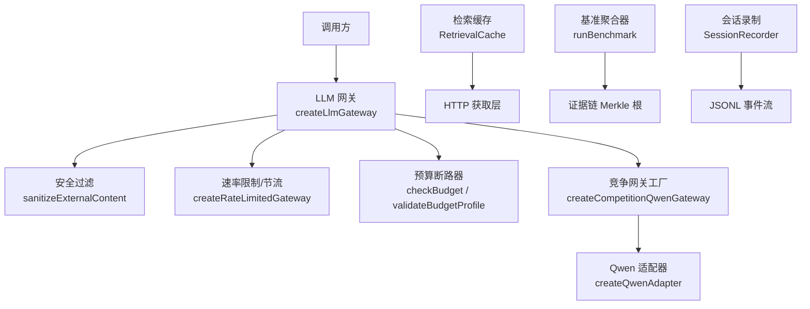

图表来源
- [gateway.ts:17-40](file://src/llm_gateway/gateway.ts#L17-L40)
- [sanitizer.ts:58-97](file://src/llm_gateway/sanitizer.ts#L58-L97)
- [rate_limiter.ts:25-82](file://src/llm_gateway/rate_limiter.ts#L25-L82)
- [budget.ts:61-92](file://src/llm_gateway/budget.ts#L61-L92)
- [competition_gateway.ts:40-53](file://src/llm_gateway/competition_gateway.ts#L40-L53)
- [cache.ts:100-166](file://src/retrieval/cache.ts#L100-L166)
- [aggregator.ts:159-249](file://src/benchmark/aggregator.ts#L159-L249)
- [session_recorder.ts:171-249](file://src/trace/session_recorder.ts#L171-L249)

章节来源
- [gateway.ts:17-40](file://src/llm_gateway/gateway.ts#L17-L40)
- [sanitizer.ts:58-97](file://src/llm_gateway/sanitizer.ts#L58-L97)
- [rate_limiter.ts:25-82](file://src/llm_gateway/rate_limiter.ts#L25-L82)
- [budget.ts:61-92](file://src/llm_gateway/budget.ts#L61-L92)
- [competition_gateway.ts:40-53](file://src/llm_gateway/competition_gateway.ts#L40-L53)
- [cache.ts:100-166](file://src/retrieval/cache.ts#L100-L166)
- [aggregator.ts:159-249](file://src/benchmark/aggregator.ts#L159-L249)
- [session_recorder.ts:171-249](file://src/trace/session_recorder.ts#L171-L249)

## 核心组件
- 输入清理与安全过滤：对外部文本统一包装为“不可信数据”，检测指令注入模式并中性化非数据字节，保留审计发现。
- 可复现性锚点：计算 LLM 调用环境锚（模型快照、活跃模型列表、Node 版本、git commit），提供 reproHashProvider 适配。
- 竞争环境优化：生产入口构造 competition_aliyun_qwen 网关，支持内层重试与退避注入，失败降级与致命错误区分。
- 缓存机制：持久化内容寻址的检索缓存，按主机 TTL 管理过期，写入前密钥形状检测，避免敏感信息落盘。
- 预算与断路器：按 tokens、时长、循环次数硬断路，超限即停；配置校验 fail-closed。
- 基准测试：串行执行种子，收集指标并生成确定性报告，包含延迟统计与套件完整性根。
- 并发控制：信号量并发上限 + FIFO 等待队列 + 最小间隔节流，保护上游配额与本地算力。
- 监控与调试：JSONL 会话录制、脱敏、回放；并发治理清单与报告。

章节来源
- [sanitizer.ts:58-97](file://src/llm_gateway/sanitizer.ts#L58-L97)
- [repro_anchor.ts:49-70](file://src/llm_gateway/repro_anchor.ts#L49-L70)
- [competition_gateway.ts:40-53](file://src/llm_gateway/competition_gateway.ts#L40-L53)
- [cache.ts:100-166](file://src/retrieval/cache.ts#L100-L166)
- [budget.ts:61-92](file://src/llm_gateway/budget.ts#L61-L92)
- [aggregator.ts:159-249](file://src/benchmark/aggregator.ts#L159-L249)
- [rate_limiter.ts:25-82](file://src/llm_gateway/rate_limiter.ts#L25-L82)
- [session_recorder.ts:171-249](file://src/trace/session_recorder.ts#L171-L249)

## 架构总览
下图展示从调用到 LLM 网关、安全过滤、速率限制、预算检查、竞争网关与适配器的完整链路，以及检索缓存与基准聚合、会话录制的旁路观测。

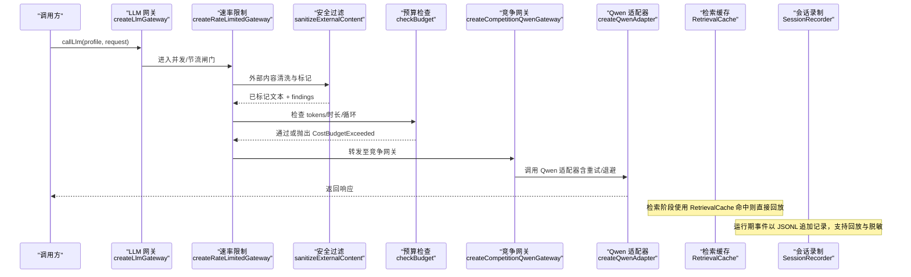

图表来源
- [gateway.ts:17-40](file://src/llm_gateway/gateway.ts#L17-L40)
- [rate_limiter.ts:25-82](file://src/llm_gateway/rate_limiter.ts#L25-L82)
- [sanitizer.ts:58-97](file://src/llm_gateway/sanitizer.ts#L58-L97)
- [budget.ts:61-92](file://src/llm_gateway/budget.ts#L61-L92)
- [competition_gateway.ts:40-53](file://src/llm_gateway/competition_gateway.ts#L40-L53)
- [cache.ts:100-166](file://src/retrieval/cache.ts#L100-L166)
- [session_recorder.ts:171-249](file://src/trace/session_recorder.ts#L171-L249)

## 详细组件分析

### 输入清理与安全过滤（G3 隔离）
- 设计要点：所有外部文本必须经 sanitizeExternalContent 处理，统一用不可信标记包裹，指令模式检测仅记录不删除，非数据字节（控制字符、零宽字符）被中性化。
- 对抗增强：大小写不敏感哨兵伪造转义，常见越狱句式与受保护动作需求匹配，Base64 大 blob 检测。
- 审计面：findings 暴露注入特征，便于后续审查与告警。

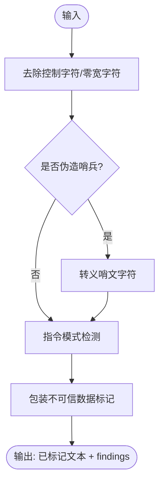

图表来源
- [sanitizer.ts:58-97](file://src/llm_gateway/sanitizer.ts#L58-L97)

章节来源
- [sanitizer.ts:58-97](file://src/llm_gateway/sanitizer.ts#L58-L97)

### 可复现性锚点与确定性输出
- 环境锚：computeLlmEnvironmentAnchor 对模型快照、活跃模型 ID（排序）、Node 版本、git commit SHA 做规范 JSON 哈希，得到 64-hex sha256。
- Provider 适配：createLlmEnvironmentAnchorProvider 返回固定锚函数，供 reproHashProvider 在 LLM 路径使用，保证同一 run 内一致且跨进程/平台可复现。
- 与实验路径互补：sandbox 执行指纹与 calc_bridge 用于实验计算；本锚专用于 LLM 调用环境，语义清晰不混淆。

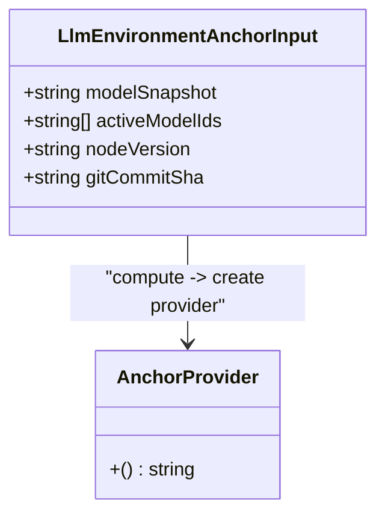

图表来源
- [repro_anchor.ts:28-70](file://src/llm_gateway/repro_anchor.ts#L28-L70)

章节来源
- [repro_anchor.ts:28-70](file://src/llm_gateway/repro_anchor.ts#L28-L70)

### 竞争环境下的特殊优化策略
- 生产入口：createCompetitionQwenGateway 将 Qwen 适配器注册到网关，支持超时、baseURL、内层重试上限与退避注入。
- 降级与致命错误：429/5xx/timeout/network 走 fallback 至下一目标并标记 degraded_from；4xx/config 为致命错误，绝不静默切换。
- 模型中立：工厂位于 llm_gateway 层，允许模型特定实现，上层 loop_runner 不出现模型字面量。

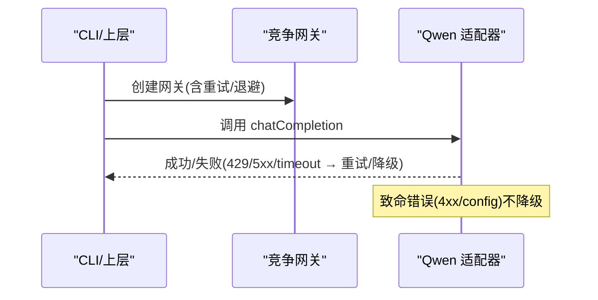

图表来源
- [competition_gateway.ts:40-53](file://src/llm_gateway/competition_gateway.ts#L40-L53)

章节来源
- [competition_gateway.ts:40-53](file://src/llm_gateway/competition_gateway.ts#L40-L53)

### 缓存机制与请求合并
- 内容寻址：文件名 = sha256(url)，用户查询文本不进入文件系统路径，防路径注入。
- TTL 策略：按主机设置不同 TTL（arXiv 7d、OpenAlex 24h、Crossref 48h），默认 24h；可覆盖。
- 密钥检测：写入前扫描响应/头部中的密钥形状，拒绝落盘并告警，避免常驻攻击面。
- 可靠性：损坏信封视为 miss，fail-open 到网络；Windows 重命名指数退避重试。

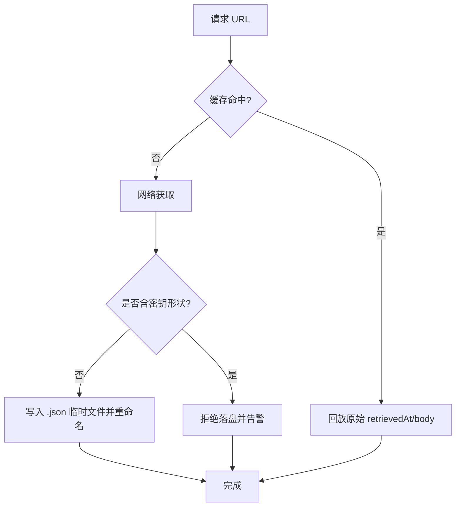

图表来源
- [cache.ts:100-166](file://src/retrieval/cache.ts#L100-L166)

章节来源
- [cache.ts:100-166](file://src/retrieval/cache.ts#L100-L166)

### 预算与断路器（G7 硬断路）
- 维度：tokens、duration_ms、loops；任一超限即抛 CostBudgetExceeded，fail-closed。
- 配置校验：NaN/undefined/负值非法，显式 null 表示关闭该维度。
- 计量：基于 call_records 真实记录汇总，分阶段与总体成本统计。

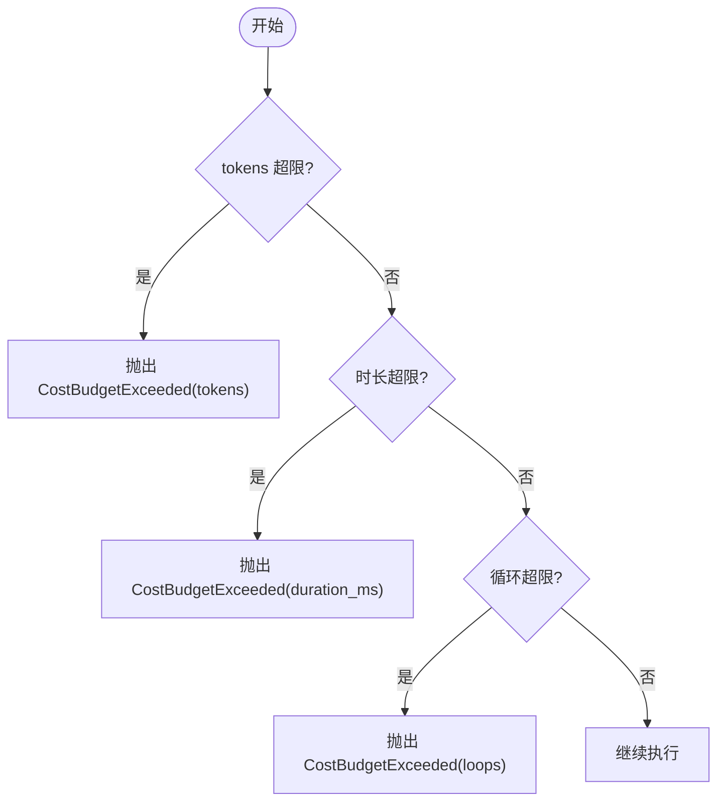

图表来源
- [budget.ts:61-92](file://src/llm_gateway/budget.ts#L61-L92)

章节来源
- [budget.ts:61-92](file://src/llm_gateway/budget.ts#L61-L92)

### 基准测试与结果
- 生成脚本：generate_benchmark 调用 runBenchmark，注入确定时间戳与可选 gitCommitSha，产出 benchmark_report.json。
- 聚合器：串行执行种子，计算每问题 integrityRoot，再折叠 suiteIntegrityRoot；统计 verdict/domain 分布与延迟统计（p50/p95/max）。
- 诚实声明：verdict 来自离线 fixture，无真实 LLM 调用；latencyMs 仅记录不参与 hash，保持确定性。

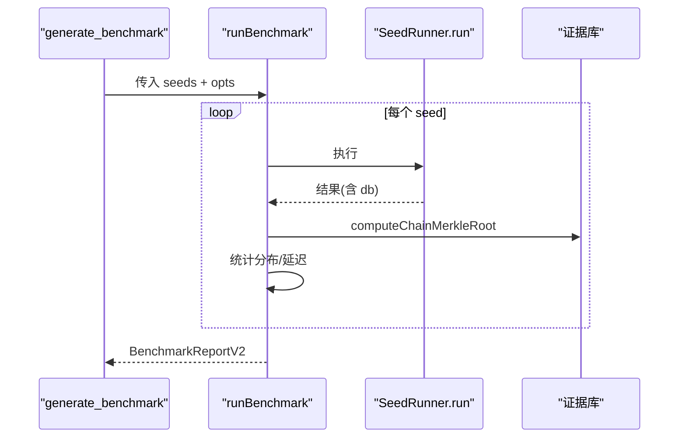

图表来源
- [generate_benchmark.ts:33-51](file://scripts/generate_benchmark.ts#L33-L51)
- [aggregator.ts:159-249](file://src/benchmark/aggregator.ts#L159-L249)

章节来源
- [generate_benchmark.ts:33-51](file://scripts/generate_benchmark.ts#L33-L51)
- [aggregator.ts:159-249](file://src/benchmark/aggregator.ts#L159-L249)

### 并发控制与负载均衡
- 并发上限：信号量控制 maxConcurrent，超限时先进先出排队等待，不丢弃。
- 节流：minIntervalMs 在并发闸内生效，整体速率 = 并发 × 1/间隔；使用 performance.now 单调时钟，避免 NTP 回拨影响。
- 组合性：可与 createResilientGateway 叠加；适用于多 provider/多任务并发调度。

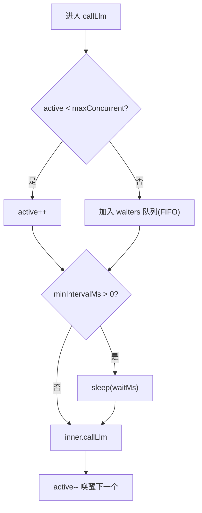

图表来源
- [rate_limiter.ts:25-82](file://src/llm_gateway/rate_limiter.ts#L25-L82)

章节来源
- [rate_limiter.ts:25-82](file://src/llm_gateway/rate_limiter.ts#L25-L82)

### 性能监控与调试工具
- 会话录制：SessionRecorder 以 JSONL 追加事件，支持采样率、脱敏、回放；runId/stageId 脱敏为稳定标识。
- 并发治理清单：buildConcurrencyReport 汇总十项并发能力成熟度与测试面，生成机读报告。
- 使用建议：开启 FAR_SESSION_RECORD（默认开启），按需设置 samplingRate；结合 session 回放定位瓶颈与异常。

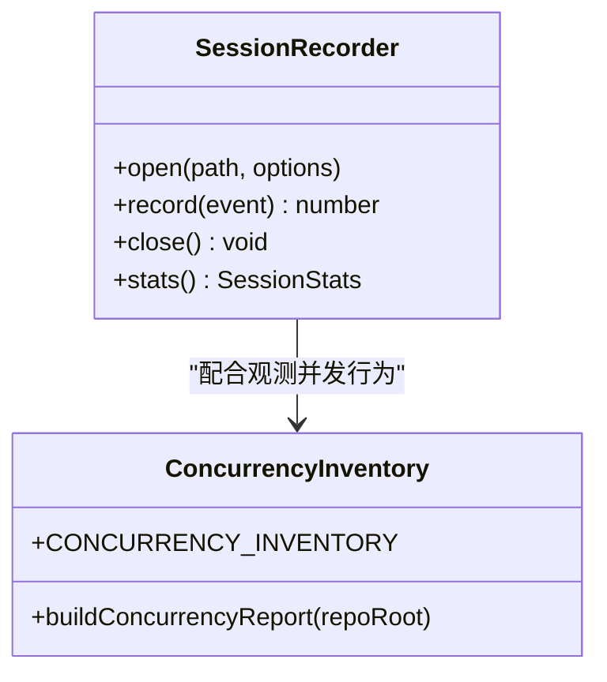

图表来源
- [session_recorder.ts:171-249](file://src/trace/session_recorder.ts#L171-L249)
- [concurrency_inventory.ts:41-143](file://src/platform/concurrency_inventory.ts#L41-L143)

章节来源
- [session_recorder.ts:171-249](file://src/trace/session_recorder.ts#L171-L249)
- [concurrency_inventory.ts:41-143](file://src/platform/concurrency_inventory.ts#L41-L143)

## 依赖关系分析
- 网关层依赖：gateway.ts 导出接口，sanitizer.ts 提供输入净化，rate_limiter.ts 提供并发/节流包装，budget.ts 提供预算检查，competition_gateway.ts 组装生产入口。
- 检索层依赖：cache.ts 提供持久化缓存，与 HTTP 获取层协作，避免重复网络开销。
- 基准层依赖：aggregator.ts 串联种子执行、证据链 Merkle 根计算与统计，generate_benchmark.ts 驱动报告生成。
- 监控层依赖：session_recorder.ts 提供运行时事件流，concurrency_inventory.ts 提供并发能力清单与报告。

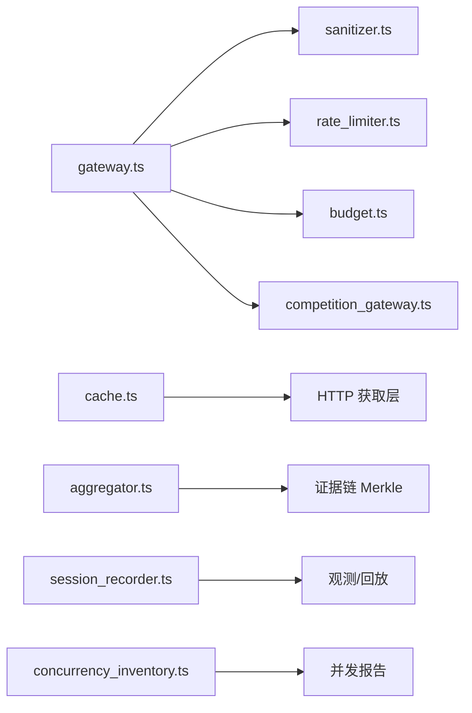

图表来源
- [gateway.ts:17-40](file://src/llm_gateway/gateway.ts#L17-L40)
- [sanitizer.ts:58-97](file://src/llm_gateway/sanitizer.ts#L58-L97)
- [rate_limiter.ts:25-82](file://src/llm_gateway/rate_limiter.ts#L25-L82)
- [budget.ts:61-92](file://src/llm_gateway/budget.ts#L61-L92)
- [competition_gateway.ts:40-53](file://src/llm_gateway/competition_gateway.ts#L40-L53)
- [cache.ts:100-166](file://src/retrieval/cache.ts#L100-L166)
- [aggregator.ts:159-249](file://src/benchmark/aggregator.ts#L159-L249)
- [session_recorder.ts:171-249](file://src/trace/session_recorder.ts#L171-L249)
- [concurrency_inventory.ts:41-143](file://src/platform/concurrency_inventory.ts#L41-L143)

章节来源
- [gateway.ts:17-40](file://src/llm_gateway/gateway.ts#L17-L40)
- [sanitizer.ts:58-97](file://src/llm_gateway/sanitizer.ts#L58-L97)
- [rate_limiter.ts:25-82](file://src/llm_gateway/rate_limiter.ts#L25-L82)
- [budget.ts:61-92](file://src/llm_gateway/budget.ts#L61-L92)
- [competition_gateway.ts:40-53](file://src/llm_gateway/competition_gateway.ts#L40-L53)
- [cache.ts:100-166](file://src/retrieval/cache.ts#L100-L166)
- [aggregator.ts:159-249](file://src/benchmark/aggregator.ts#L159-L249)
- [session_recorder.ts:171-249](file://src/trace/session_recorder.ts#L171-L249)
- [concurrency_inventory.ts:41-143](file://src/platform/concurrency_inventory.ts#L41-L143)

## 性能考量
- 输入清理：安全过滤增加少量 CPU 开销，但显著降低越狱风险；建议在生产开启并关注 findings 趋势。
- 缓存命中：检索缓存可大幅减少重复网络请求，注意 TTL 与密钥检测策略，避免误伤正常响应。
- 并发与节流：合理设置 maxConcurrent 与 minIntervalMs，平衡吞吐与上游配额；FIFO 排队避免丢请求。
- 预算断路器：根据实际负载调整 tokens/duration/loops 阈值，防止失控；超限立即停止，保障系统稳定性。
- 基准延迟：latencyMs 为 wall-clock 观测，不参与 hash；可用于横向对比不同配置下的端到端耗时。

[本节为通用指导，无需具体文件引用]

## 故障排查指南
- 预算超限：捕获 CostBudgetExceeded，检查对应维度消耗与配置；确认未误配 NaN/负值。
- 缓存失效：检查 FAR_RETRIEVAL_CACHE 环境变量与 rootDir；查看磁盘文件是否存在与 TTL 是否过期；关注密钥形状检测告警。
- 会话录制：确认 FAR_SESSION_RECORD 未设置为 off；检查采样率设置；回放时跳过损坏行并统计 skippedLines。
- 并发问题：通过 concurrency_inventory 报告定位薄弱项；结合 rate_limiter 日志与 SessionRecorder 事件序列分析排队与释放。

章节来源
- [budget.ts:61-92](file://src/llm_gateway/budget.ts#L61-L92)
- [cache.ts:100-166](file://src/retrieval/cache.ts#L100-L166)
- [session_recorder.ts:171-249](file://src/trace/session_recorder.ts#L171-L249)
- [concurrency_inventory.ts:41-143](file://src/platform/concurrency_inventory.ts#L41-L143)

## 结论
本方案通过安全过滤、可复现环境锚、竞争网关优化、持久化缓存、预算断路器、并发控制与节流、基准测试与监控录制，构建了端到端的 LLM 性能优化体系。建议在生产环境中启用全部防护与观测能力，并根据负载特性调优并发与节流参数，结合基准报告持续评估与改进。

[本节为总结，无需具体文件引用]

## 附录
- 关键配置与环境变量：
  - FAR_RETRIEVAL_CACHE=0 禁用检索缓存
  - FAR_RETRIEVAL_CACHE_DIR 指定缓存根目录
  - FAR_SESSION_RECORD=off 关闭会话录制
- 推荐实践：
  - 生产网关使用 createCompetitionQwenGateway，配置合理的 innerRetryMax 与 backoff
  - 设置合理的 maxConcurrent 与 minIntervalMs，避免上游限流
  - 定期生成 benchmark_report.json 并纳入 CI golden 比对
  - 使用 SessionRecorder 回放定位性能热点与异常路径

[本节为补充信息，无需具体文件引用]