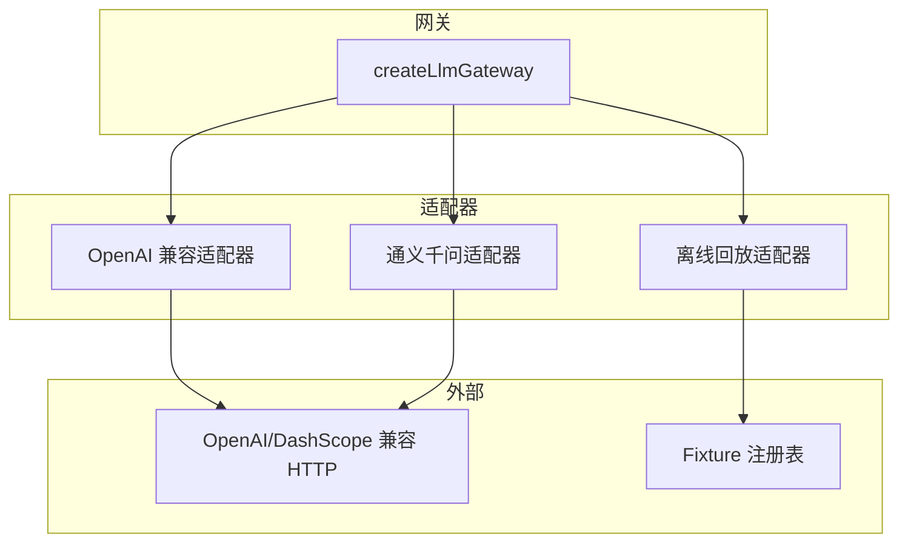
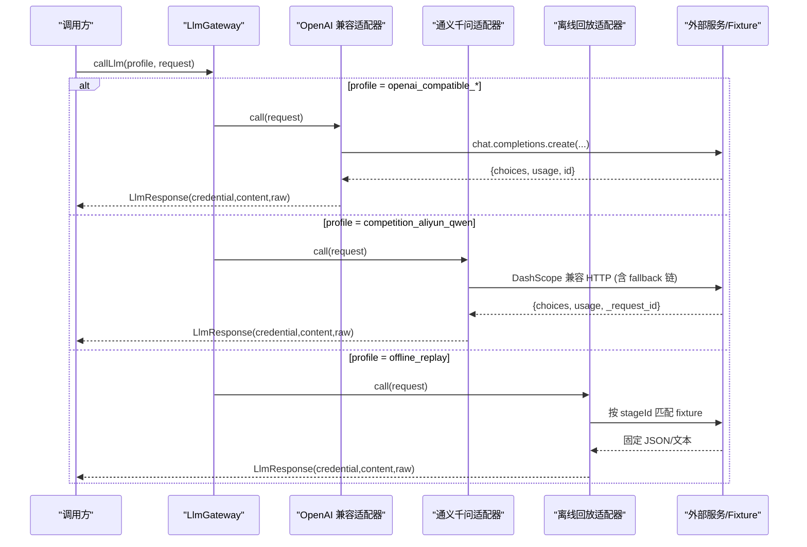
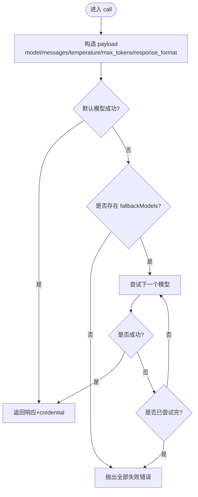
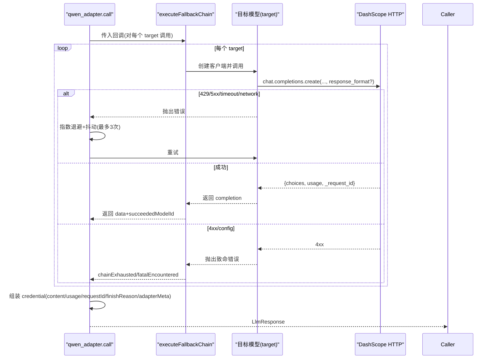
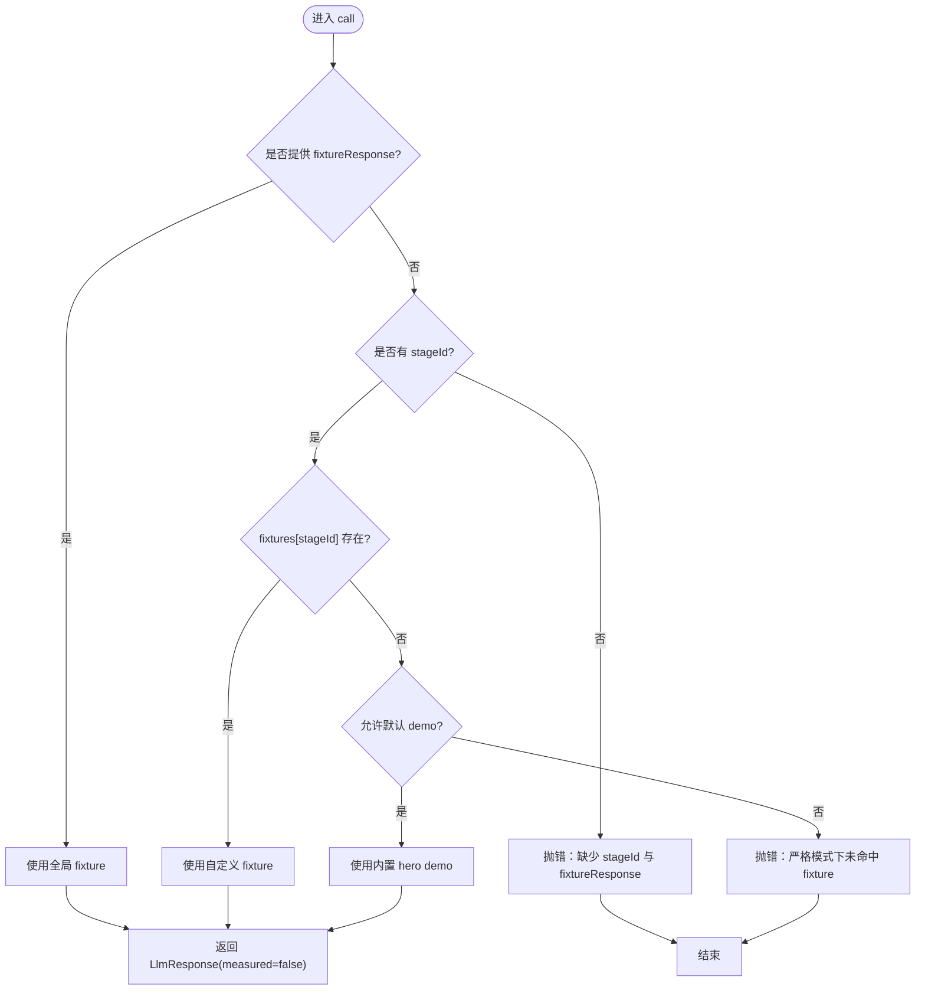
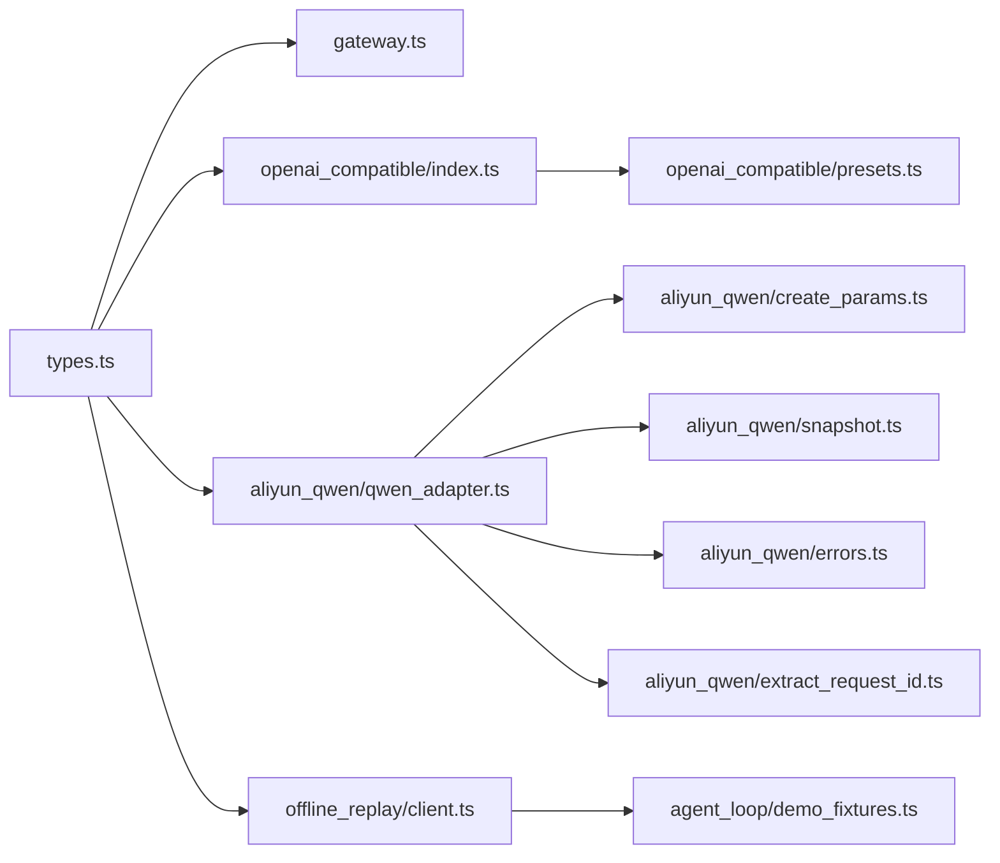

# 提供商适配器

<cite>
**本文引用的文件**
- [src/llm_gateway/types.ts](file://src/llm_gateway/types.ts)
- [src/llm_gateway/gateway.ts](file://src/llm_gateway/gateway.ts)
- [src/llm_gateway/adapters/openai_compatible/index.ts](file://src/llm_gateway/adapters/openai_compatible/index.ts)
- [src/llm_gateway/adapters/openai_compatible/presets.ts](file://src/llm_gateway/adapters/openai_compatible/presets.ts)
- [src/llm_gateway/adapters/aliyun_qwen/qwen_adapter.ts](file://src/llm_gateway/adapters/aliyun_qwen/qwen_adapter.ts)
- [src/llm_gateway/adapters/aliyun_qwen/create_params.ts](file://src/llm_gateway/adapters/aliyun_qwen/create_params.ts)
- [src/llm_gateway/adapters/aliyun_qwen/errors.ts](file://src/llm_gateway/adapters/aliyun_qwen/errors.ts)
- [src/llm_gateway/adapters/offline_replay/client.ts](file://src/llm_gateway/adapters/offline_replay/client.ts)
- [tests/llm_gateway/openai_compatible_adapter.test.ts](file://tests/llm_gateway/openai_compatible_adapter.test.ts)
- [tests/llm_gateway/aliyun_qwen_adapter.test.ts](file://tests/llm_gateway/aliyun_qwen_adapter.test.ts)
- [tests/llm_gateway/offline_replay.test.ts](file://tests/llm_gateway/offline_replay.test.ts)
</cite>

## 目录
1. [简介](#简介)
2. [项目结构](#项目结构)
3. [核心组件](#核心组件)
4. [架构总览](#架构总览)
5. [详细组件分析](#详细组件分析)
6. [依赖关系分析](#依赖关系分析)
7. [性能与可靠性](#性能与可靠性)
8. [故障排查指南](#故障排查指南)
9. [结论](#结论)
10. [附录：新适配器开发指南](#附录：新适配器开发指南)

## 简介
本文件面向 LLM 提供商适配层，系统性说明 OpenAI 兼容适配器、阿里云通义千问（DashScope）适配器以及离线回放适配器的实现细节。文档覆盖 API 差异、适配层设计、配置与认证、错误处理与重试策略、结构化输出处理与响应格式转换，并提供离线回放测试支持与新适配器开发指南。

## 项目结构
- 统一类型与网关
  - 类型契约：LlmRequest/LlmResponse/ProviderAdapter/LlmGateway 等定义在 types.ts。
  - 网关：gateway.ts 提供 createLlmGateway，负责注册与路由到具体 ProviderAdapter。
- 适配器
  - OpenAI 兼容适配器：openai_compatible/index.ts 与 presets.ts，通用适配 OpenAI 兼容端点。
  - 阿里云通义千问适配器：aliyun_qwen/*，包含参数构建、模型快照、错误类型、请求 ID 提取、主适配器 qwen_adapter.ts。
  - 离线回放适配器：offline_replay/client.ts，基于 stageId 或全局 fixture 返回确定性内容。
- 测试
  - tests/llm_gateway/* 覆盖各适配器的行为、降级、错误路径与结构化输出透传。

**图示来源**
- [src/llm_gateway/gateway.ts:17-41](file://src/llm_gateway/gateway.ts#L17-L41)
- [src/llm_gateway/adapters/openai_compatible/index.ts:78-153](file://src/llm_gateway/adapters/openai_compatible/index.ts#L78-L153)
- [src/llm_gateway/adapters/aliyun_qwen/qwen_adapter.ts:209-364](file://src/llm_gateway/adapters/aliyun_qwen/qwen_adapter.ts#L209-L364)
- [src/llm_gateway/adapters/offline_replay/client.ts:86-127](file://src/llm_gateway/adapters/offline_replay/client.ts#L86-L127)

**章节来源**
- [src/llm_gateway/types.ts:1-129](file://src/llm_gateway/types.ts#L1-L129)
- [src/llm_gateway/gateway.ts:17-41](file://src/llm_gateway/gateway.ts#L17-L41)

## 核心组件
- ProviderAdapter 接口：定义 profile 与 call(request) -> response 的统一调用契约。
- LlmGateway：维护已注册的适配器映射，按 profile 路由到对应 adapter.call。
- LlmRequest/LlmResponse：统一消息、温度、最大 token、结构化输出 schema、能力标记、token 用量、原始响应等。

关键要点
- 结构化输出：通过 LlmRequest.responseFormat='json_schema' 与 jsonSchema 对象传递；适配器将其转换为下游 SDK 的 response_format.json_schema。
- Token 计量：TokenUsage.measured 区分真实计量与离线字符估算（offline_replay 为 false）。
- 能力标记：structured vs reasoning 由 responseFormat 决定。

**章节来源**
- [src/llm_gateway/types.ts:26-129](file://src/llm_gateway/types.ts#L26-L129)
- [src/llm_gateway/gateway.ts:17-41](file://src/llm_gateway/gateway.ts#L17-L41)

## 架构总览
适配器层将上层 agent_loop 对 LLM 的抽象调用，透明地转译为不同提供商的具体 HTTP 调用，并统一封装 credential、usage、raw 等元数据。

**图示来源**
- [src/llm_gateway/gateway.ts:24-30](file://src/llm_gateway/gateway.ts#L24-L30)
- [src/llm_gateway/adapters/openai_compatible/index.ts:89-151](file://src/llm_gateway/adapters/openai_compatible/index.ts#L89-L151)
- [src/llm_gateway/adapters/aliyun_qwen/qwen_adapter.ts:213-360](file://src/llm_gateway/adapters/aliyun_qwen/qwen_adapter.ts#L213-L360)
- [src/llm_gateway/adapters/offline_replay/client.ts:93-124](file://src/llm_gateway/adapters/offline_replay/client.ts#L93-L124)

## 详细组件分析

### OpenAI 兼容适配器
职责
- 以 baseURL + envVar + defaultModel(+fallbackModels) 驱动，适配所有 OpenAI 兼容端点（OpenAI、DeepSeek、Zhipu、Ollama、vLLM、DashScope compatible-mode 等）。
- 透传 temperature、maxTokens、response_format.json_schema。
- 失败时尝试 fallbackModels；全部失败则抛出明确错误，绝不静默返回空内容。
- 记录 usedFallbackModel 于 adapterMeta，便于审计。

配置与认证
- 必填：baseURL、envVar、defaultModel。
- 密钥来源：process.env[envVar]；未设置时使用 'not-set'，调用时会失败并报错。
- 可选：temperature 覆盖、clientFactory（测试注入 mock）。

结构化输出
- 当 request.responseFormat==='json_schema' 且存在 jsonSchema 时，构造 response_format.type='json_schema'，并透传 name/schema/strict。

重试与降级
- 内置 fallbackModels 顺序尝试；任一成功即返回。
- 全链失败抛错，包含 lastError 信息。

**图示来源**
- [src/llm_gateway/adapters/openai_compatible/index.ts:89-151](file://src/llm_gateway/adapters/openai_compatible/index.ts#L89-L151)

**章节来源**
- [src/llm_gateway/adapters/openai_compatible/index.ts:18-153](file://src/llm_gateway/adapters/openai_compatible/index.ts#L18-L153)
- [src/llm_gateway/adapters/openai_compatible/presets.ts:29-90](file://src/llm_gateway/adapters/openai_compatible/presets.ts#L29-L90)
- [tests/llm_gateway/openai_compatible_adapter.test.ts:37-147](file://tests/llm_gateway/openai_compatible_adapter.test.ts#L37-L147)

### 阿里云通义千问适配器（DashScope 兼容）
职责
- 使用 DashScope 兼容模式（OpenAI SDK baseURL），执行竞争专用 fallback 链（仅 Qwen 家族模型）。
- 内层重试：针对同一模型的 429/5xx/timeout/network 进行指数退避+抖动+优先 Retry-After 的重试（上限 3 次尝试）。
- 外层降级：若内层耗尽仍失败，交由 fallback_chain 切换到下一 Qwen target；若三档均不可用，抛出 RETRY_EXHAUSTED。
- 结构化输出：当 request.responseFormat==='json_schema' 时，透传 response_format.json_schema；并通过 buildCreateParams 路由到 STRUCTURED_SAFE_MODEL。
- 互斥校验：enable_thinking 与 response_format 互斥，冲突时抛出 ThinkingJsonSchemaConflictError。
- 请求 ID：从响应头或 body 字段提取 x-request-id/_request_id/id。

配置与认证
- apiKey：优先 config.apiKey，否则读取 DASHSCOPE_API_KEY。
- baseURL：默认 COMPETITION_BASE_URL。
- timeoutMs：默认 180s（避免长生成被 SDK 超时中断）。
- innerRetryMax/backoff：可注入用于测试。

错误处理
- 4xx/config 错误视为 fatal，终止整链并抛出 BailianHttpError。
- 链路耗尽时抛出带 code='RETRY_EXHAUSTED' 的错误，供上层 verdict stage 消费。

**图示来源**
- [src/llm_gateway/adapters/aliyun_qwen/qwen_adapter.ts:24-64](file://src/llm_gateway/adapters/aliyun_qwen/qwen_adapter.ts#L24-L64)
- [src/llm_gateway/adapters/aliyun_qwen/qwen_adapter.ts:118-164](file://src/llm_gateway/adapters/aliyun_qwen/qwen_adapter.ts#L118-L164)
- [src/llm_gateway/adapters/aliyun_qwen/qwen_adapter.ts:213-360](file://src/llm_gateway/adapters/aliyun_qwen/qwen_adapter.ts#L213-L360)

**章节来源**
- [src/llm_gateway/adapters/aliyun_qwen/qwen_adapter.ts:68-364](file://src/llm_gateway/adapters/aliyun_qwen/qwen_adapter.ts#L68-L364)
- [src/llm_gateway/adapters/aliyun_qwen/create_params.ts:42-66](file://src/llm_gateway/adapters/aliyun_qwen/create_params.ts#L42-L66)
- [src/llm_gateway/adapters/aliyun_qwen/errors.ts:1-27](file://src/llm_gateway/adapters/aliyun_qwen/errors.ts#L1-L27)
- [tests/llm_gateway/aliyun_qwen_adapter.test.ts:34-88](file://tests/llm_gateway/aliyun_qwen_adapter.test.ts#L34-L88)

### 离线回放适配器
职责
- 无网络、无凭据，基于 stageId 或全局 fixtureResponse 返回确定性内容。
- 优先级：fixtureResponse > fixtures[stageId] > DEFAULT_DEMO_FIXTURES[stageId]（可禁用）。
- 严格模式：disableDefaultDemo=true 且未命中任何 fixture 时抛错，禁止静默 echo。
- 伪 token 口径：tokenUsage.measured=false，totalTokens 按输入/输出字符数估算。

测试支持
- 通过 stageId 精确匹配阶段 fixture，确保端到端 demo 无需云凭证即可运行。
- raw.stageId 回显命中的 stageId，便于审计。

**图示来源**
- [src/llm_gateway/adapters/offline_replay/client.ts:43-81](file://src/llm_gateway/adapters/offline_replay/client.ts#L43-L81)
- [src/llm_gateway/adapters/offline_replay/client.ts:86-127](file://src/llm_gateway/adapters/offline_replay/client.ts#L86-L127)

**章节来源**
- [src/llm_gateway/adapters/offline_replay/client.ts:4-127](file://src/llm_gateway/adapters/offline_replay/client.ts#L4-L127)
- [tests/llm_gateway/offline_replay.test.ts:13-148](file://tests/llm_gateway/offline_replay.test.ts#L13-L148)

## 依赖关系分析
- gateway.ts 依赖 types.ts 定义的 ProviderAdapter/LlmGateway。
- openai_compatible/index.ts 依赖 openai SDK（可通过 clientFactory 注入测试替身）。
- aliyun_qwen/qwen_adapter.ts 依赖：
  - create_params.ts（参数构建、结构化输出路由、thinking/json_schema 互斥）
  - snapshot.ts（COMPETITION_BASE_URL、STRUCTURED_SAFE_MODEL、MODEL_SNAPSHOT）
  - fallback_chain（跨模型降级）
  - extract_request_id.ts（请求 ID 提取）
  - errors.ts（领域错误类型）
- offline_replay/client.ts 依赖 agent_loop/demo_fixtures.ts（内置 hero demo）。

**图示来源**
- [src/llm_gateway/types.ts:114-129](file://src/llm_gateway/types.ts#L114-L129)
- [src/llm_gateway/gateway.ts:17-41](file://src/llm_gateway/gateway.ts#L17-L41)
- [src/llm_gateway/adapters/openai_compatible/index.ts:15-16](file://src/llm_gateway/adapters/openai_compatible/index.ts#L15-L16)
- [src/llm_gateway/adapters/openai_compatible/presets.ts:14-15](file://src/llm_gateway/adapters/openai_compatible/presets.ts#L14-L15)
- [src/llm_gateway/adapters/aliyun_qwen/qwen_adapter.ts:1-22](file://src/llm_gateway/adapters/aliyun_qwen/qwen_adapter.ts#L1-L22)
- [src/llm_gateway/adapters/offline_replay/client.ts:1-3](file://src/llm_gateway/adapters/offline_replay/client.ts#L1-L3)

**章节来源**
- [src/llm_gateway/adapters/openai_compatible/presets.ts:29-90](file://src/llm_gateway/adapters/openai_compatible/presets.ts#L29-L90)
- [src/llm_gateway/adapters/aliyun_qwen/qwen_adapter.ts:10-22](file://src/llm_gateway/adapters/aliyun_qwen/qwen_adapter.ts#L10-L22)

## 性能与可靠性
- 通义千问适配器
  - 内层重试：指数退避 + 随机抖动，优先使用 Retry-After 头部/字段；上限 3 次尝试，避免瞬时限流误判为模型不可用。
  - 超时保护：默认 180s，避免大 JSON 生成被 SDK 提前中断。
  - 降级可见：adapterMeta.degradedFrom/degradationCount/summary 记录降级轨迹；providerRetries 记录内层重试次数。
- OpenAI 兼容适配器
  - 多模型回退：defaultModel → fallbackModels 顺序尝试，任一成功即返回。
  - 失败可见：全部失败抛错，包含 lastError，杜绝静默回退。
- 离线回放适配器
  - 零网络、零延迟；tokenUsage.measured=false，避免混入真实成本统计。

**章节来源**
- [src/llm_gateway/adapters/aliyun_qwen/qwen_adapter.ts:24-64](file://src/llm_gateway/adapters/aliyun_qwen/qwen_adapter.ts#L24-L64)
- [src/llm_gateway/adapters/aliyun_qwen/qwen_adapter.ts:118-164](file://src/llm_gateway/adapters/aliyun_qwen/qwen_adapter.ts#L118-L164)
- [src/llm_gateway/adapters/aliyun_qwen/qwen_adapter.ts:246-281](file://src/llm_gateway/adapters/aliyun_qwen/qwen_adapter.ts#L246-L281)
- [src/llm_gateway/adapters/openai_compatible/index.ts:96-151](file://src/llm_gateway/adapters/openai_compatible/index.ts#L96-L151)
- [src/llm_gateway/adapters/offline_replay/client.ts:93-124](file://src/llm_gateway/adapters/offline_replay/client.ts#L93-L124)

## 故障排查指南
常见问题与定位
- 未注册 profile：gateway.callLlm 会抛出“no adapter registered”错误。请确认已在初始化时 register 对应适配器。
- OpenAI 兼容适配器缺失配置：baseURL/envVar/defaultModel 任一为空将抛错。检查环境变量与配置。
- 通义千问适配器缺少密钥：DASHSCOPE_API_KEY 未设置或未生效，将抛错提示需要密钥。
- thinking 与结构化输出冲突：buildCreateParams 检测到 enable_thinking:true 且 response_format 存在时抛出 ThinkingJsonSchemaConflictError。
- 离线回放未命中 fixture：未提供 fixtureResponse 且 stageId 未命中（或禁用默认 demo）时抛错，需补充 fixtures 或启用默认 demo。
- 请求 ID 缺失：通义千问适配器会从响应头/体提取 _request_id/x-request-id/id；若确实缺失，可在上游日志中排查。

建议步骤
- 开启 adapterMeta 观察：查看 degradedFrom/providerRetries/usedFallbackModel 等字段定位降级与重试情况。
- 使用离线回放：通过 createOfflineReplayAdapter 注入 fixtures 或启用默认 demo，快速验证流程而不依赖网络。
- 单元测试复用：参考 tests/llm_gateway/* 的 mock clientFactory 与断言方式，快速复现问题。

**章节来源**
- [src/llm_gateway/gateway.ts:24-30](file://src/llm_gateway/gateway.ts#L24-L30)
- [src/llm_gateway/adapters/openai_compatible/index.ts:78-81](file://src/llm_gateway/adapters/openai_compatible/index.ts#L78-L81)
- [src/llm_gateway/adapters/aliyun_qwen/qwen_adapter.ts:118-129](file://src/llm_gateway/adapters/aliyun_qwen/qwen_adapter.ts#L118-L129)
- [src/llm_gateway/adapters/aliyun_qwen/create_params.ts:49-51](file://src/llm_gateway/adapters/aliyun_qwen/create_params.ts#L49-L51)
- [src/llm_gateway/adapters/offline_replay/client.ts:43-81](file://src/llm_gateway/adapters/offline_replay/client.ts#L43-L81)
- [tests/llm_gateway/offline_replay.test.ts:35-44](file://tests/llm_gateway/offline_replay.test.ts#L35-L44)

## 结论
本适配层通过统一的 ProviderAdapter 与 LlmGateway，屏蔽了不同 LLM 提供商的差异，提供了稳定的结构化输出、可靠的错误处理与重试机制，以及完善的离线回放测试支持。OpenAI 兼容适配器适合多厂商通用场景；通义千问适配器面向竞争环境，具备严格的 Qwen-only 降级链与健壮的内层重试；离线回放适配器确保在无网络环境下仍可端到端验证流程。

## 附录：新适配器开发指南
步骤
1. 实现 ProviderAdapter
   - 定义 profile 标识。
   - 实现 call(request): Promise<LlmResponse>，返回 credential/content/raw。
   - 遵循 types.ts 的 LlmRequest/LlmResponse 约定。
2. 处理结构化输出
   - 当 request.responseFormat==='json_schema' 且存在 jsonSchema 时，构造下游 SDK 的 response_format.json_schema（name/schema/strict）。
3. 认证与配置
   - 通过环境变量获取密钥，避免硬编码。
   - 暴露必要配置项（如 baseURL、apiKey、timeout、重试策略等）。
4. 错误处理与重试
   - 区分瞬时错误（429/5xx/timeout）与致命错误（4xx/config）。
   - 实现内层重试（指数退避+抖动+Retry-After）与外层降级（如有多模型/多端点）。
   - 记录 adapterMeta（如 providerRetries、degradedFrom、usedFallbackModel）。
5. 测试
   - 使用 clientFactory 或 createChatCompletion 注入 mock，避免真实网络。
   - 覆盖正常路径、fallback、全链失败、结构化输出透传、错误路径。
   - 参考 tests/llm_gateway/* 的断言风格。

示例路径
- OpenAI 兼容适配器入口：[src/llm_gateway/adapters/openai_compatible/index.ts:78-153](file://src/llm_gateway/adapters/openai_compatible/index.ts#L78-L153)
- 通义千问适配器入口：[src/llm_gateway/adapters/aliyun_qwen/qwen_adapter.ts:209-364](file://src/llm_gateway/adapters/aliyun_qwen/qwen_adapter.ts#L209-L364)
- 离线回放适配器入口：[src/llm_gateway/adapters/offline_replay/client.ts:86-127](file://src/llm_gateway/adapters/offline_replay/client.ts#L86-L127)
- 预置适配器注册：[src/llm_gateway/adapters/openai_compatible/presets.ts:76-90](file://src/llm_gateway/adapters/openai_compatible/presets.ts#L76-L90)

**章节来源**
- [src/llm_gateway/types.ts:114-129](file://src/llm_gateway/types.ts#L114-L129)
- [src/llm_gateway/adapters/openai_compatible/index.ts:78-153](file://src/llm_gateway/adapters/openai_compatible/index.ts#L78-L153)
- [src/llm_gateway/adapters/aliyun_qwen/qwen_adapter.ts:209-364](file://src/llm_gateway/adapters/aliyun_qwen/qwen_adapter.ts#L209-L364)
- [src/llm_gateway/adapters/offline_replay/client.ts:86-127](file://src/llm_gateway/adapters/offline_replay/client.ts#L86-L127)
- [src/llm_gateway/adapters/openai_compatible/presets.ts:76-90](file://src/llm_gateway/adapters/openai_compatible/presets.ts#L76-L90)