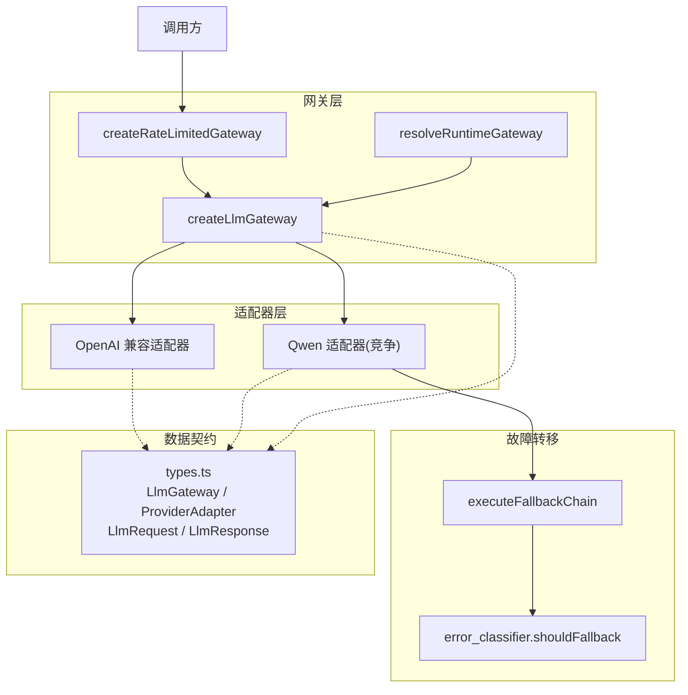
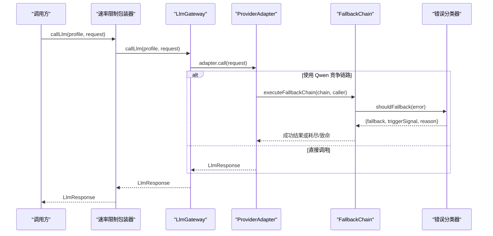
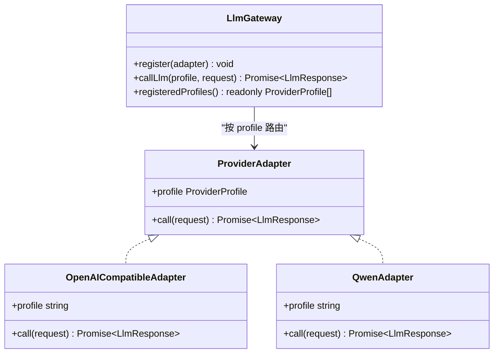
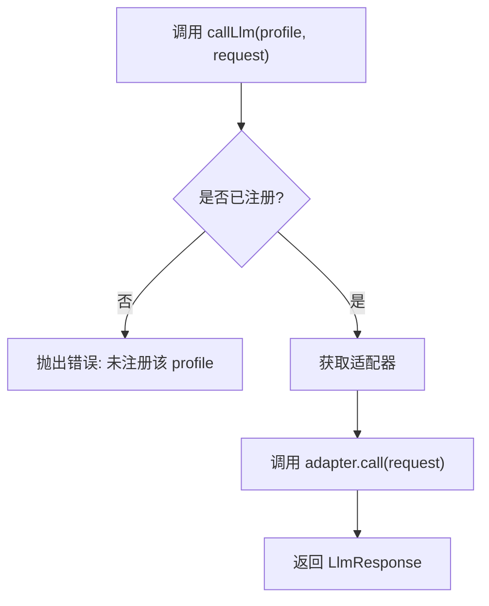
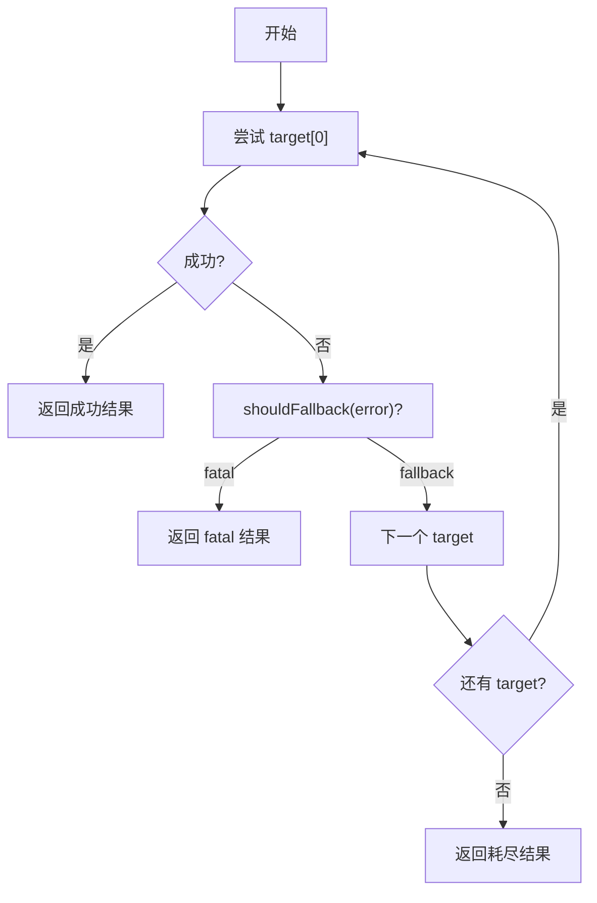
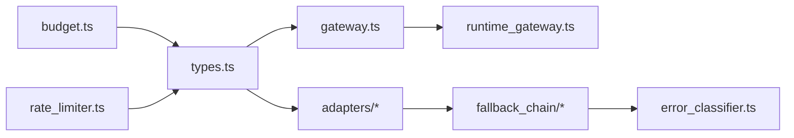

# 网关架构设计

<cite>
**本文引用的文件**
- [src/llm_gateway/index.ts](file://src/llm_gateway/index.ts)
- [src/llm_gateway/types.ts](file://src/llm_gateway/types.ts)
- [src/llm_gateway/gateway.ts](file://src/llm_gateway/gateway.ts)
- [src/llm_gateway/adapters/openai_compatible/index.ts](file://src/llm_gateway/adapters/openai_compatible/index.ts)
- [src/llm_gateway/adapters/openai_compatible/presets.ts](file://src/llm_gateway/adapters/openai_compatible/presets.ts)
- [src/llm_gateway/adapters/aliyun_qwen/index.ts](file://src/llm_gateway/adapters/aliyun_qwen/index.ts)
- [src/llm_gateway/competition_gateway.ts](file://src/llm_gateway/competition_gateway.ts)
- [src/llm_gateway/runtime_gateway.ts](file://src/llm_gateway/runtime_gateway.ts)
- [src/llm_gateway/fallback_chain/fallback_chain.ts](file://src/llm_gateway/fallback_chain/fallback_chain.ts)
- [src/llm_gateway/fallback_chain/types.ts](file://src/llm_gateway/fallback_chain/types.ts)
- [src/llm_gateway/fallback_chain/error_classifier.ts](file://src/llm_gateway/fallback_chain/error_classifier.ts)
- [src/llm_gateway/rate_limiter.ts](file://src/llm_gateway/rate_limiter.ts)
- [src/llm_gateway/budget.ts](file://src/llm_gateway/budget.ts)
</cite>

## 目录
1. [简介](#简介)
2. [项目结构](#项目结构)
3. [核心组件](#核心组件)
4. [架构总览](#架构总览)
5. [详细组件分析](#详细组件分析)
6. [依赖关系分析](#依赖关系分析)
7. [性能与资源管理](#性能与资源管理)
8. [故障排查指南](#故障排查指南)
9. [结论](#结论)
10. [附录：配置选项与扩展点](#附录：配置选项与扩展点)

## 简介
本文件面向 LLM 网关的架构设计与实现，重点说明统一网关接口、适配器模式、ProviderProfile 与 LlmRequest/LlmResponse 数据契约、适配器注册与动态路由、故障转移链（Fallback Chain）的设计与实现、网关生命周期与资源管理策略、以及配置项与扩展点。文档同时提供自定义适配器的开发指南与最佳实践，帮助读者在不侵入现有代码的前提下扩展新的 LLM 提供商或端点。

## 项目结构
LLM 网关位于 src/llm_gateway，采用“接口与实现分离 + 适配器模式”的组织方式：
- types.ts 定义统一接口与数据结构（LlmGateway、ProviderAdapter、LlmRequest、LlmResponse、ProviderProfile 等）。
- gateway.ts 提供最小实现的 createLlmGateway，负责适配器注册与按 profile 路由调用。
- adapters 下包含多种适配器：
  - openai_compatible：通用 OpenAI 兼容端点适配器，支持 baseURL/envVar/defaultModel/fallbackModels 配置化。
  - aliyun_qwen：面向竞争场景的阿里云百炼 Qwen 适配器（通过 competition_gateway 暴露生产入口）。
- fallback_chain：模型无关的降级执行引擎，结合 error_classifier 的触发矩阵决定何时降级或终止。
- runtime_gateway：运行期解析真实网关（根据环境变量决定是否构造 competition_aliyun_qwen）。
- rate_limiter：并发控制与最小间隔节流包装器。
- budget：成本硬预算断路器（tokens/duration/loops）。

图表来源
- [src/llm_gateway/gateway.ts:17-40](file://src/llm_gateway/gateway.ts#L17-L40)
- [src/llm_gateway/adapters/openai_compatible/index.ts:78-153](file://src/llm_gateway/adapters/openai_compatible/index.ts#L78-L153)
- [src/llm_gateway/competition_gateway.ts:40-53](file://src/llm_gateway/competition_gateway.ts#L40-L53)
- [src/llm_gateway/fallback_chain/fallback_chain.ts:78-156](file://src/llm_gateway/fallback_chain/fallback_chain.ts#L78-L156)
- [src/llm_gateway/fallback_chain/error_classifier.ts:141-172](file://src/llm_gateway/fallback_chain/error_classifier.ts#L141-L172)
- [src/llm_gateway/types.ts:83-128](file://src/llm_gateway/types.ts#L83-L128)

章节来源
- [src/llm_gateway/index.ts:1-42](file://src/llm_gateway/index.ts#L1-L42)
- [src/llm_gateway/types.ts:1-129](file://src/llm_gateway/types.ts#L1-L129)

## 核心组件
- 统一网关接口 LlmGateway：定义 register、callLlm、registeredProfiles，屏蔽具体适配器差异。
- 适配器 ProviderAdapter：每个 provider 实现一个 profile 标识与 call(request) 方法。
- 数据契约：
  - LlmRequest：消息、温度、最大 token、结构化输出 schema、阶段标签等。
  - LlmResponse：凭证元信息（含 providerProfile、modelId、capability、tokenUsage）、内容、原始响应。
- 运行时网关：根据环境变量返回真实网关或 null（走离线回放）。
- 速率限制：并发上限 + 最小间隔节流，保护上游配额与本地算力。
- 成本预算：基于 call_records 的真实计量进行硬断路。

章节来源
- [src/llm_gateway/types.ts:26-128](file://src/llm_gateway/types.ts#L26-L128)
- [src/llm_gateway/gateway.ts:17-40](file://src/llm_gateway/gateway.ts#L17-L40)
- [src/llm_gateway/runtime_gateway.ts:36-44](file://src/llm_gateway/runtime_gateway.ts#L36-L44)
- [src/llm_gateway/rate_limiter.ts:25-82](file://src/llm_gateway/rate_limiter.ts#L25-L82)
- [src/llm_gateway/budget.ts:61-71](file://src/llm_gateway/budget.ts#L61-L71)

## 架构总览
下图展示从调用方到适配器与故障转移链的完整流程，体现“接口抽象 + 适配器实现 + 可组合包装”的架构思想。

图表来源
- [src/llm_gateway/rate_limiter.ts:69-82](file://src/llm_gateway/rate_limiter.ts#L69-L82)
- [src/llm_gateway/gateway.ts:24-30](file://src/llm_gateway/gateway.ts#L24-L30)
- [src/llm_gateway/adapters/openai_compatible/index.ts:89-151](file://src/llm_gateway/adapters/openai_compatible/index.ts#L89-L151)
- [src/llm_gateway/fallback_chain/fallback_chain.ts:78-156](file://src/llm_gateway/fallback_chain/fallback_chain.ts#L78-L156)
- [src/llm_gateway/fallback_chain/error_classifier.ts:141-172](file://src/llm_gateway/fallback_chain/error_classifier.ts#L141-L172)

## 详细组件分析

### 统一网关接口与适配器模式
- 统一接口 LlmGateway：
  - register(adapter)：将适配器以 profile 为键注册到内部 Map。
  - callLlm(profile, request)：查找对应适配器并调用；未注册则抛错。
  - registeredProfiles()：返回已注册的 profile 列表。
- 适配器模式：
  - ProviderAdapter 抽象出 profile 与 call(request) 能力，屏蔽不同后端差异。
  - OpenAI 兼容适配器通过 baseURL/envVar/defaultModel/fallbackModels 配置化，支持结构化输出透传。
  - 预置注册表 OPENAI_COMPATIBLE_PRESETS 提供开箱即用的多个 profile。

图表来源
- [src/llm_gateway/types.ts:114-128](file://src/llm_gateway/types.ts#L114-L128)
- [src/llm_gateway/gateway.ts:17-40](file://src/llm_gateway/gateway.ts#L17-L40)
- [src/llm_gateway/adapters/openai_compatible/index.ts:78-153](file://src/llm_gateway/adapters/openai_compatible/index.ts#L78-L153)
- [src/llm_gateway/adapters/aliyun_qwen/index.ts:27-43](file://src/llm_gateway/adapters/aliyun_qwen/index.ts#L27-L43)

章节来源
- [src/llm_gateway/types.ts:114-128](file://src/llm_gateway/types.ts#L114-L128)
- [src/llm_gateway/gateway.ts:17-40](file://src/llm_gateway/gateway.ts#L17-L40)
- [src/llm_gateway/adapters/openai_compatible/presets.ts:28-90](file://src/llm_gateway/adapters/openai_compatible/presets.ts#L28-L90)

### ProviderProfile 与 LlmRequest/LlmResponse
- ProviderProfile：已知 profile 集合与字符串扩展类型，用于路由与审计。
- LlmRequest：
  - messages：系统/用户/助手/工具消息序列。
  - temperature/maxTokens：采样与长度控制。
  - responseFormat/jsonSchema：结构化输出（json_schema），由调用方将 zod schema 转为 plain JSON schema 后注入。
  - purposeTag/stageId：阶段与用途标记，便于离线回放与审计。
- LlmResponse：
  - credential：包含 providerProfile、providerRequestId、modelId、capability、isoTimestamp、tokenUsage、adapterMeta、finishReason 等。
  - content/raw：文本内容与原始响应。

章节来源
- [src/llm_gateway/types.ts:1-24](file://src/llm_gateway/types.ts#L1-L24)
- [src/llm_gateway/types.ts:26-112](file://src/llm_gateway/types.ts#L26-L112)

### 适配器注册机制与动态路由
- 注册机制：
  - createLlmGateway 内部维护 Map<ProviderProfile, ProviderAdapter>。
  - 支持初始适配器数组一次性注册，也可后续动态 register。
- 动态路由：
  - callLlm 根据传入 profile 精确匹配适配器；未命中则抛出明确错误。
  - 生产入口 createCompetitionQwenGateway 将 Qwen 适配器注册为 'competition_aliyun_qwen'。
  - 运行期 resolveRuntimeGateway 根据环境变量决定是否返回真实网关，否则返回 null（调用方可降级至离线回放）。

图表来源
- [src/llm_gateway/gateway.ts:24-30](file://src/llm_gateway/gateway.ts#L24-L30)
- [src/llm_gateway/competition_gateway.ts:40-53](file://src/llm_gateway/competition_gateway.ts#L40-L53)
- [src/llm_gateway/runtime_gateway.ts:36-44](file://src/llm_gateway/runtime_gateway.ts#L36-L44)

章节来源
- [src/llm_gateway/gateway.ts:17-40](file://src/llm_gateway/gateway.ts#L17-L40)
- [src/llm_gateway/competition_gateway.ts:40-53](file://src/llm_gateway/competition_gateway.ts#L40-L53)
- [src/llm_gateway/runtime_gateway.ts:36-44](file://src/llm_gateway/runtime_gateway.ts#L36-L44)

### 故障转移链（Fallback Chain）
- 设计目标：
  - 遍历降级目标序列，按触发矩阵在每个失败 target 上决定 fallback 或 fatal。
  - 全程留痕 attempts[] 与 degradationSummary，绝不静默换模型（F11）。
  - 不抛错策略：耗尽/致命返回结构化结果（data=null, chainExhausted/fatalEncountered=true），由调用方决定后续处理。
- 触发矩阵（error_classifier）：
  - 超时/网络/HTTP 429/5xx → 触发 fallback。
  - HTTP 4xx/非传输错误（配置/逻辑）→ 致命，立即终止整链。
- 执行流程：
  - 对每个 target 调用 caller(target)，捕获错误并分类。
  - 成功则返回结果并记录 succeededModelId、degradedFrom 等。
  - 若 fatal 则提前终止；若全部失败则返回耗尽结果。

图表来源
- [src/llm_gateway/fallback_chain/fallback_chain.ts:78-156](file://src/llm_gateway/fallback_chain/fallback_chain.ts#L78-L156)
- [src/llm_gateway/fallback_chain/error_classifier.ts:141-172](file://src/llm_gateway/fallback_chain/error_classifier.ts#L141-L172)

章节来源
- [src/llm_gateway/fallback_chain/types.ts:20-92](file://src/llm_gateway/fallback_chain/types.ts#L20-L92)
- [src/llm_gateway/fallback_chain/fallback_chain.ts:78-156](file://src/llm_gateway/fallback_chain/fallback_chain.ts#L78-L156)
- [src/llm_gateway/fallback_chain/error_classifier.ts:141-172](file://src/llm_gateway/fallback_chain/error_classifier.ts#L141-L172)

### 生命周期管理与资源管理策略
- 生命周期：
  - 启动时创建网关实例，注册适配器（可通过工厂函数集中装配）。
  - 运行期通过 resolveRuntimeGateway 根据环境变量选择真实网关或 null。
  - 请求结束时释放资源（适配器内部客户端由 SDK 管理，网关本身无长连接）。
- 资源管理：
  - 速率限制：并发上限（信号量 FIFO 等待）+ 最小间隔节流，避免上游限流与本地过载。
  - 成本预算：基于 call_records 的真实 token 计量进行硬断路，超限即抛 CostBudgetExceeded。
  - 适配器内重试与退避：Qwen 适配器支持 innerRetryMax/backoff，与 fallback 正交（retry 同模型瞬时错误，fallback 跨模型切换）。

章节来源
- [src/llm_gateway/runtime_gateway.ts:36-44](file://src/llm_gateway/runtime_gateway.ts#L36-L44)
- [src/llm_gateway/rate_limiter.ts:25-82](file://src/llm_gateway/rate_limiter.ts#L25-L82)
- [src/llm_gateway/budget.ts:61-71](file://src/llm_gateway/budget.ts#L61-L71)
- [src/llm_gateway/competition_gateway.ts:17-32](file://src/llm_gateway/competition_gateway.ts#L17-L32)

### 配置选项与扩展点
- 运行时环境：
  - FAR_DASHSCOPE_API_KEY / DASHSCOPE_API_KEY：存在且非空则构造 competition_aliyun_qwen 网关。
- OpenAI 兼容适配器：
  - baseURL/envVar/defaultModel/fallbackModels/temperature/clientFactory。
  - 预置注册表 OPENAI_COMPATIBLE_PRESETS 可直接批量创建适配器。
- 竞争网关：
  - apiKey/timeoutMs/baseURL/createChatCompletion/innerRetryMax/backoff。
- 速率限制：
  - maxConcurrent/minIntervalMs。
- 成本预算：
  - BudgetProfile{maxTokens,maxDurationMs,maxLoops}，默认开启宽松阈值。

章节来源
- [src/llm_gateway/runtime_gateway.ts:26-44](file://src/llm_gateway/runtime_gateway.ts#L26-L44)
- [src/llm_gateway/adapters/openai_compatible/index.ts:18-38](file://src/llm_gateway/adapters/openai_compatible/index.ts#L18-L38)
- [src/llm_gateway/adapters/openai_compatible/presets.ts:28-90](file://src/llm_gateway/adapters/openai_compatible/presets.ts#L28-L90)
- [src/llm_gateway/competition_gateway.ts:17-32](file://src/llm_gateway/competition_gateway.ts#L17-L32)
- [src/llm_gateway/rate_limiter.ts:14-20](file://src/llm_gateway/rate_limiter.ts#L14-L20)
- [src/llm_gateway/budget.ts:18-30](file://src/llm_gateway/budget.ts#L18-L30)

## 依赖关系分析
- 模块耦合：
  - gateway.ts 仅依赖 types.ts 的接口，保持低耦合。
  - adapters 实现 ProviderAdapter 接口，被 gateway 按 profile 路由。
  - fallback_chain 与 error_classifier 解耦于具体模型，通过 caller 注入实现可测试性。
- 外部依赖：
  - OpenAI SDK（openai）用于 OpenAI 兼容适配器。
  - better-sqlite3 用于预算统计（budget.ts）。
- 潜在循环依赖：
  - 当前结构清晰，未见循环导入；gateway 与 adapters 单向依赖 types。

图表来源
- [src/llm_gateway/types.ts:1-129](file://src/llm_gateway/types.ts#L1-L129)
- [src/llm_gateway/gateway.ts:1-40](file://src/llm_gateway/gateway.ts#L1-L40)
- [src/llm_gateway/adapters/openai_compatible/index.ts:1-154](file://src/llm_gateway/adapters/openai_compatible/index.ts#L1-L154)
- [src/llm_gateway/fallback_chain/fallback_chain.ts:1-157](file://src/llm_gateway/fallback_chain/fallback_chain.ts#L1-L157)
- [src/llm_gateway/fallback_chain/error_classifier.ts:1-173](file://src/llm_gateway/fallback_chain/error_classifier.ts#L1-L173)
- [src/llm_gateway/budget.ts:1-125](file://src/llm_gateway/budget.ts#L1-L125)
- [src/llm_gateway/rate_limiter.ts:1-83](file://src/llm_gateway/rate_limiter.ts#L1-L83)

章节来源
- [src/llm_gateway/types.ts:1-129](file://src/llm_gateway/types.ts#L1-L129)
- [src/llm_gateway/gateway.ts:1-40](file://src/llm_gateway/gateway.ts#L1-L40)
- [src/llm_gateway/adapters/openai_compatible/index.ts:1-154](file://src/llm_gateway/adapters/openai_compatible/index.ts#L1-L154)
- [src/llm_gateway/fallback_chain/fallback_chain.ts:1-157](file://src/llm_gateway/fallback_chain/fallback_chain.ts#L1-L157)
- [src/llm_gateway/fallback_chain/error_classifier.ts:1-173](file://src/llm_gateway/fallback_chain/error_classifier.ts#L1-L173)
- [src/llm_gateway/budget.ts:1-125](file://src/llm_gateway/budget.ts#L1-L125)
- [src/llm_gateway/rate_limiter.ts:1-83](file://src/llm_gateway/rate_limiter.ts#L1-L83)

## 性能与资源管理
- 并发与节流：
  - 通过 createRateLimitedGateway 设置 maxConcurrent 与 minIntervalMs，保护上游配额与本地算力。
  - 节流使用单调时钟（performance.now）避免系统时间回拨导致的漂移。
- 重试与降级：
  - 适配器内部 retry（如 Qwen 的 innerRetryMax/backoff）处理瞬时错误。
  - fallback_chain 在重试耗尽后触发跨模型降级，保证可用性。
- 成本预算：
  - 基于 call_records 的真实 token 计量，超限即停止（fail-closed），防止失控。

章节来源
- [src/llm_gateway/rate_limiter.ts:25-82](file://src/llm_gateway/rate_limiter.ts#L25-L82)
- [src/llm_gateway/competition_gateway.ts:17-32](file://src/llm_gateway/competition_gateway.ts#L17-L32)
- [src/llm_gateway/fallback_chain/fallback_chain.ts:78-156](file://src/llm_gateway/fallback_chain/fallback_chain.ts#L78-L156)
- [src/llm_gateway/budget.ts:61-71](file://src/llm_gateway/budget.ts#L61-L71)

## 故障排查指南
- 常见错误与定位：
  - 未注册 profile：检查是否正确调用 register 或通过工厂创建网关。
  - 环境变量缺失：确认 FAR_DASHSCOPE_API_KEY/DASHSCOPE_API_KEY 已设置。
  - 结构化输出冲突：Qwen 适配器会检测 ThinkingJsonSchemaConflictError 等配置错误，应修正 schema。
  - 网络/超时/限流：查看 error_classifier 的分类结果，确认是否进入 fallback 或 fatal。
- 调试建议：
  - 启用 adapterMeta.usedFallbackModel 观察是否发生降级。
  - 检查 attempts[] 与 degradationSummary 了解降级路径与触发原因。
  - 使用 createOpenAICompatiblePresetAdapters 快速验证多端点连通性。

章节来源
- [src/llm_gateway/gateway.ts:24-30](file://src/llm_gateway/gateway.ts#L24-L30)
- [src/llm_gateway/runtime_gateway.ts:36-44](file://src/llm_gateway/runtime_gateway.ts#L36-L44)
- [src/llm_gateway/adapters/openai_compatible/index.ts:119-138](file://src/llm_gateway/adapters/openai_compatible/index.ts#L119-L138)
- [src/llm_gateway/fallback_chain/fallback_chain.ts:44-67](file://src/llm_gateway/fallback_chain/fallback_chain.ts#L44-L67)
- [src/llm_gateway/fallback_chain/error_classifier.ts:141-172](file://src/llm_gateway/fallback_chain/error_classifier.ts#L141-L172)

## 结论
本网关通过统一的 LlmGateway 接口与 ProviderAdapter 适配器模式，实现了多提供商的统一接入与动态路由。OpenAI 兼容适配器提供了高扩展性的配置化方案，而 Qwen 竞争网关结合 fallback_chain 与 error_classifier 实现了健壮的降级与审计。配合速率限制与成本预算，系统在可用性与成本控制之间取得平衡。遵循本文档的开发指南与最佳实践，可安全地扩展新的适配器与配置项。

## 附录：配置选项与扩展点
- 运行时配置
  - 环境变量：FAR_DASHSCOPE_API_KEY、DASHSCOPE_API_KEY。
  - 解析函数：resolveRuntimeGateway(env) 返回真实网关或 null。
- OpenAI 兼容适配器
  - 配置项：baseURL、envVar、defaultModel、fallbackModels、temperature、clientFactory。
  - 预置注册表：OPENAI_COMPATIBLE_PRESETS，一键创建多个适配器。
- 竞争网关
  - 配置项：apiKey、timeoutMs、baseURL、createChatCompletion、innerRetryMax、backoff。
- 速率限制
  - 配置项：maxConcurrent、minIntervalMs。
- 成本预算
  - 配置项：BudgetProfile{maxTokens, maxDurationMs, maxLoops}，默认宽松阈值。

章节来源
- [src/llm_gateway/runtime_gateway.ts:26-44](file://src/llm_gateway/runtime_gateway.ts#L26-L44)
- [src/llm_gateway/adapters/openai_compatible/index.ts:18-38](file://src/llm_gateway/adapters/openai_compatible/index.ts#L18-L38)
- [src/llm_gateway/adapters/openai_compatible/presets.ts:28-90](file://src/llm_gateway/adapters/openai_compatible/presets.ts#L28-L90)
- [src/llm_gateway/competition_gateway.ts:17-32](file://src/llm_gateway/competition_gateway.ts#L17-L32)
- [src/llm_gateway/rate_limiter.ts:14-20](file://src/llm_gateway/rate_limiter.ts#L14-L20)
- [src/llm_gateway/budget.ts:18-30](file://src/llm_gateway/budget.ts#L18-L30)