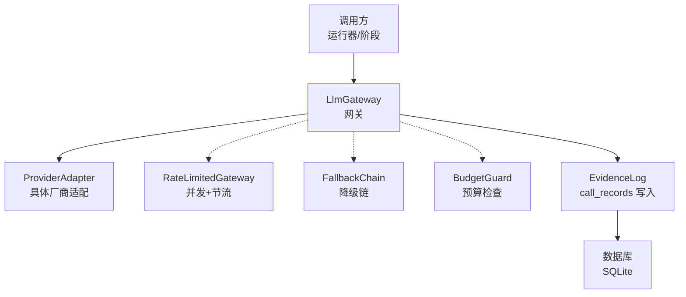
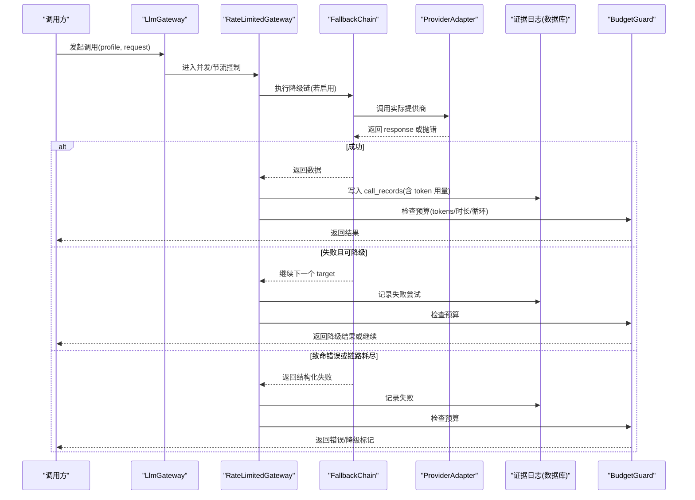
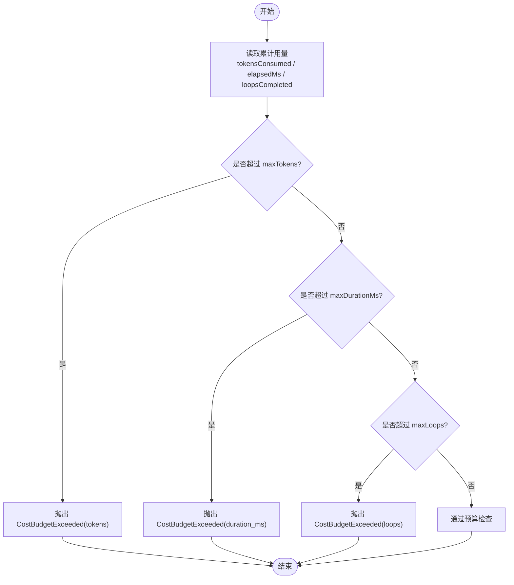
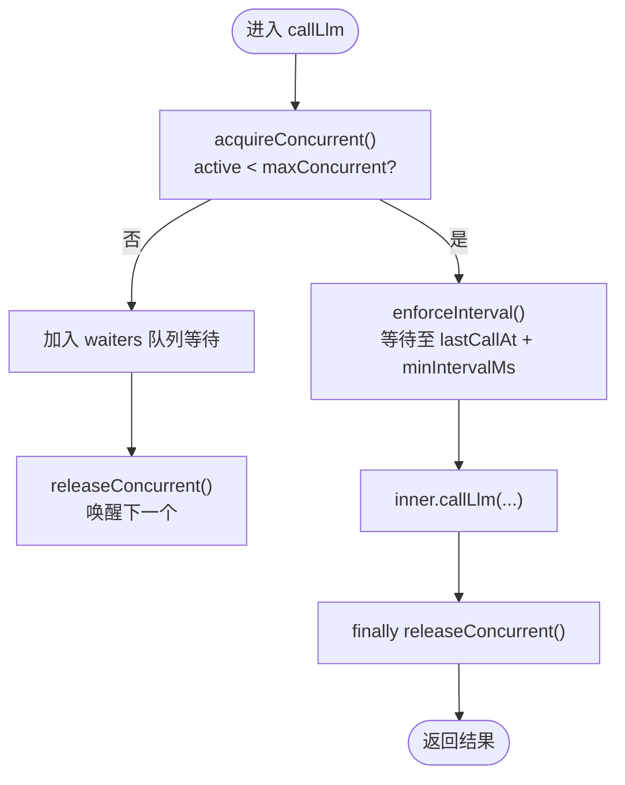
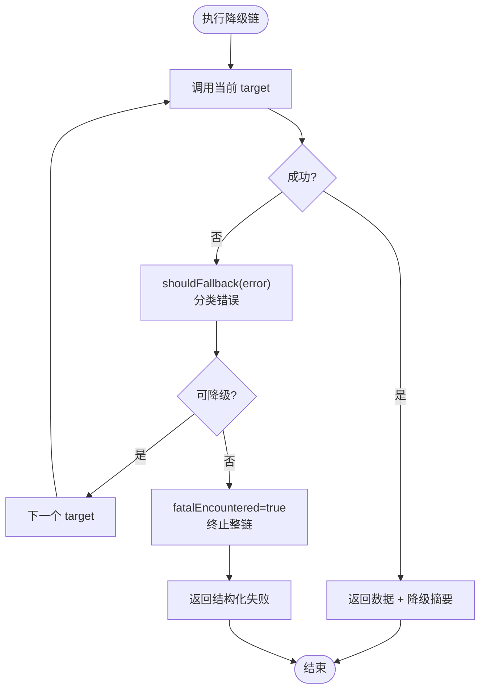
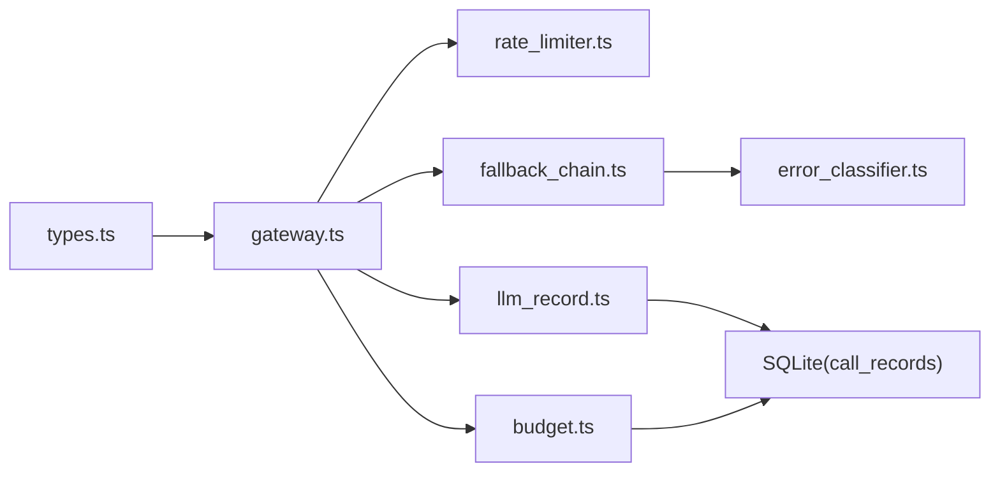

# 预算与成本管理

<cite>
**本文引用的文件**
- [budget.ts](file://src/llm_gateway/budget.ts)
- [rate_limiter.ts](file://src/llm_gateway/rate_limiter.ts)
- [gateway.ts](file://src/llm_gateway/gateway.ts)
- [types.ts](file://src/llm_gateway/types.ts)
- [fallback_chain.ts](file://src/llm_gateway/fallback_chain/fallback_chain.ts)
- [error_classifier.ts](file://src/llm_gateway/fallback_chain/error_classifier.ts)
- [llm_record.ts](file://src/evidence_log/llm_record.ts)
- [resume_budget_hardening.test.ts](file://tests/agent_loop/resume_budget_hardening.test.ts)
- [budget.test.ts](file://tests/llm_gateway/budget.test.ts)
</cite>

## 目录
1. [简介](#简介)
2. [项目结构](#项目结构)
3. [核心组件](#核心组件)
4. [架构总览](#架构总览)
5. [详细组件分析](#详细组件分析)
6. [依赖关系分析](#依赖关系分析)
7. [性能考量](#性能考量)
8. [故障排查指南](#故障排查指南)
9. [结论](#结论)
10. [附录](#附录)

## 简介
本文件面向 LLM 预算管理与成本控制的实现，系统性说明以下主题：
- 成本跟踪与累计统计机制（请求级计量、阶段汇总、全局汇总）
- 预算控制与硬断路策略（tokens、时长、循环次数三维度）
- 速率限制器设计（并发上限 + 最小间隔节流）
- 超时控制与资源保护（传输层超时、网络错误分类、降级链）
- 预算超出的处理策略与降级方案（fail-closed、降级链、可观测性）
- 成本优化建议与最佳实践
- 监控指标与告警配置指南

## 项目结构
围绕 LLM 网关的预算与限流能力，主要涉及如下模块：
- 预算与成本：预算配置校验、超限判定、分阶段与总体成本汇总
- 速率限制：并发信号量与最小调用间隔节流
- 网关与类型：统一 LLM 调用接口、请求/响应/凭证模型
- 降级链：错误分类与跨模型降级执行引擎
- 审计记录：将每次调用的 token 用量等写入持久化存储，作为成本依据

图示来源
- [gateway.ts:17-41](file://src/llm_gateway/gateway.ts#L17-L41)
- [rate_limiter.ts:25-82](file://src/llm_gateway/rate_limiter.ts#L25-L82)
- [fallback_chain.ts:78-156](file://src/llm_gateway/fallback_chain/fallback_chain.ts#L78-L156)
- [budget.ts:61-124](file://src/llm_gateway/budget.ts#L61-L124)
- [llm_record.ts:53-121](file://src/evidence_log/llm_record.ts#L53-L121)

章节来源
- [gateway.ts:17-41](file://src/llm_gateway/gateway.ts#L17-L41)
- [rate_limiter.ts:25-82](file://src/llm_gateway/rate_limiter.ts#L25-L82)
- [budget.ts:61-124](file://src/llm_gateway/budget.ts#L61-L124)
- [llm_record.ts:53-121](file://src/evidence_log/llm_record.ts#L53-L121)

## 核心组件
- 预算与成本
  - 预算配置与校验：定义 tokens、时长、循环次数上限；非法值拒绝，显式 null 表示关闭
  - 预算检查：在关键节点按当前累计用量与上限比较，超限抛出 CostBudgetExceeded
  - 成本汇总：从 call_records 表按 stage_id 聚合调用次数与 tokens；支持总体汇总
- 速率限制器
  - 并发上限：基于信号量 FIFO 排队，避免上游配额耗尽与本地过载
  - 最小间隔：基于单调时钟的最小调用间隔，防止突发流量
- 网关与类型
  - 统一 LLM 调用契约：注册适配器、发起调用、查询已注册配置
  - 请求/响应/凭证：包含 token 用量、模型信息、完成原因等
- 降级链
  - 错误分类：区分可恢复（超时/网络/429/5xx）与致命（4xx/配置/逻辑）错误
  - 执行引擎：遍历降级目标，记录尝试与摘要，不静默切换
- 审计记录
  - 将每次调用的请求/响应、token 用量、finish reason 等落库，形成可审计的成本依据

章节来源
- [budget.ts:19-124](file://src/llm_gateway/budget.ts#L19-L124)
- [rate_limiter.ts:15-82](file://src/llm_gateway/rate_limiter.ts#L15-L82)
- [gateway.ts:17-41](file://src/llm_gateway/gateway.ts#L17-L41)
- [types.ts:26-128](file://src/llm_gateway/types.ts#L26-L128)
- [fallback_chain.ts:78-156](file://src/llm_gateway/fallback_chain/fallback_chain.ts#L78-L156)
- [error_classifier.ts:141-172](file://src/llm_gateway/fallback_chain/error_classifier.ts#L141-L172)
- [llm_record.ts:53-121](file://src/evidence_log/llm_record.ts#L53-L121)

## 架构总览
下图展示一次 LLM 调用在预算、限流、降级与审计方面的整体流程。

图示来源
- [gateway.ts:24-30](file://src/llm_gateway/gateway.ts#L24-L30)
- [rate_limiter.ts:69-81](file://src/llm_gateway/rate_limiter.ts#L69-L81)
- [fallback_chain.ts:78-156](file://src/llm_gateway/fallback_chain/fallback_chain.ts#L78-L156)
- [error_classifier.ts:141-172](file://src/llm_gateway/fallback_chain/error_classifier.ts#L141-L172)
- [llm_record.ts:53-121](file://src/evidence_log/llm_record.ts#L53-L121)
- [budget.ts:61-71](file://src/llm_gateway/budget.ts#L61-L71)

## 详细组件分析

### 预算与成本：请求级计量与累计统计
- 请求级计量
  - 每次 LLM 调用通过证据日志写入 call_records，包含 totalTokens、finishReason、stageId、providerProfile 等
  - Token 用量来源标记 measured：true 为厂商真实计量，false 为字符估算（如离线回放），预算侧据此区分口径
- 累计统计
  - 分阶段汇总：按 stage_id 聚合 calls 与 tokens，便于定位高消耗阶段
  - 总体汇总：对全部 call_records 求和，得到总调用次数与总 tokens
- 预算检查
  - 三维度：maxTokens、maxDurationMs、maxLoops
  - 超限即抛 CostBudgetExceeded，fail-closed，不静默继续
  - 配置校验：NaN/undefined/负值视为非法；显式 null 表示关闭该维度

图示来源
- [budget.ts:61-71](file://src/llm_gateway/budget.ts#L61-L71)
- [budget.ts:77-92](file://src/llm_gateway/budget.ts#L77-L92)
- [budget.ts:102-124](file://src/llm_gateway/budget.ts#L102-L124)
- [types.ts:26-38](file://src/llm_gateway/types.ts#L26-L38)
- [llm_record.ts:94-102](file://src/evidence_log/llm_record.ts#L94-L102)

章节来源
- [budget.ts:19-124](file://src/llm_gateway/budget.ts#L19-L124)
- [types.ts:26-38](file://src/llm_gateway/types.ts#L26-L38)
- [llm_record.ts:53-121](file://src/evidence_log/llm_record.ts#L53-L121)

### 速率限制器：并发控制与最小间隔节流
- 并发上限
  - 使用信号量 active 计数，超出则入队等待（FIFO），释放时唤醒最早等待者
- 最小间隔
  - 基于 performance.now() 单调时钟计算 lastCallAt，确保下一调用不早于 lastCallAt + minIntervalMs
  - 使用 Math.ceil 向上取整，避免 libuv 定时器截断导致的提前唤醒
- 组合性
  - 可与重试/降级包装任意组合，不影响上层语义

图示来源
- [rate_limiter.ts:36-67](file://src/llm_gateway/rate_limiter.ts#L36-L67)
- [rate_limiter.ts:69-81](file://src/llm_gateway/rate_limiter.ts#L69-L81)

章节来源
- [rate_limiter.ts:15-82](file://src/llm_gateway/rate_limiter.ts#L15-L82)

### 超时控制与资源保护：降级链与错误分类
- 错误分类
  - 可恢复：超时、网络错误、HTTP 429/5xx → 触发 fallback
  - 致命：HTTP 4xx、配置/逻辑错误、未知错误 → 终止整链（F11）
- 执行引擎
  - 遍历降级目标序列，记录每次尝试 outcome、triggerSignal、reason
  - 成功返回结构化结果；耗尽或致命返回 data=null 并标注 chainExhausted/fatalEncountered
- 与重试策略正交
  - retry 用于同模型瞬时错误退避；fallback 用于跨模型切换

图示来源
- [fallback_chain.ts:78-156](file://src/llm_gateway/fallback_chain/fallback_chain.ts#L78-L156)
- [error_classifier.ts:141-172](file://src/llm_gateway/fallback_chain/error_classifier.ts#L141-L172)

章节来源
- [fallback_chain.ts:78-156](file://src/llm_gateway/fallback_chain/fallback_chain.ts#L78-L156)
- [error_classifier.ts:141-172](file://src/llm_gateway/fallback_chain/error_classifier.ts#L141-L172)

### 预算超出的处理策略与降级方案
- 预算超限
  - 立即抛出 CostBudgetExceeded，fail-closed，不继续后续 LLM 调用
  - 携带 dimension、consumed、limit 以便定位问题
- 降级策略
  - 当发生可恢复错误时，降级链自动切换到备用模型
  - 预算检查与降级链可组合：即使降级成功，仍需满足预算约束
- 审计与可观测性
  - 所有尝试与失败原因写入 call_records，便于事后分析与告警

章节来源
- [budget.ts:35-71](file://src/llm_gateway/budget.ts#L35-L71)
- [fallback_chain.ts:78-156](file://src/llm_gateway/fallback_chain/fallback_chain.ts#L78-L156)
- [llm_record.ts:94-102](file://src/evidence_log/llm_record.ts#L94-L102)

### 成本优化建议与最佳实践
- 合理设置预算
  - 根据业务规模设定 tokens、时长、循环上限；默认宽松但需结合生产压测调整
  - 显式 null 关闭某维度时需明确风险与审批
- 控制请求粒度
  - 拆分长对话为多轮短请求，降低单次 token 峰值
  - 使用结构化输出减少无效往返
- 利用降级链
  - 针对高频错误配置合理的降级顺序，缩短失败路径
- 节流与并发
  - 在高并发场景下调低 maxConcurrent，提高稳定性
  - 设置合适的 minIntervalMs，避免上游限流
- 审计与复盘
  - 定期查看分阶段成本汇总，识别高消耗阶段
  - 结合 finishReason 与 token 用量，优化提示词与模型选择

[本节为通用指导，不直接分析具体文件]

### 监控指标与告警配置指南
- 关键指标
  - 调用次数、总 tokens、各阶段 tokens、平均耗时、失败率、降级次数、预算超限次数
- 数据来源
  - call_records 中的 usage_tokens_total、finishReason、stageId、providerProfile
  - 预算检查抛错事件（CostBudgetExceeded）
  - 降级链尝试记录（attempts[]、degradationSummary）
- 告警建议
  - 预算超限：任一维度超限即触发 P1 告警
  - 高失败率：连续 N 次失败或 429/5xx 比例异常
  - 高延迟：P95/P99 延迟显著上升
  - 降级频繁：同一阶段多次降级，提示上游不稳定或配置不当

[本节为通用指导，不直接分析具体文件]

## 依赖关系分析
- 组件耦合
  - 网关 types.ts 提供统一契约，gateway.ts 实现基础路由
  - rate_limiter.ts 包装 LlmGateway，增强并发与节流
  - fallback_chain.ts 与 error_classifier.ts 解耦错误分类与执行
  - budget.ts 依赖数据库表 call_records 进行成本汇总
  - llm_record.ts 负责写入 call_records，为预算与监控提供数据源
- 外部依赖
  - better-sqlite3 用于持久化审计记录
  - performance.now() 用于单调时钟节流

图示来源
- [types.ts:120-128](file://src/llm_gateway/types.ts#L120-L128)
- [gateway.ts:17-41](file://src/llm_gateway/gateway.ts#L17-L41)
- [rate_limiter.ts:25-82](file://src/llm_gateway/rate_limiter.ts#L25-L82)
- [fallback_chain.ts:78-156](file://src/llm_gateway/fallback_chain/fallback_chain.ts#L78-L156)
- [error_classifier.ts:141-172](file://src/llm_gateway/fallback_chain/error_classifier.ts#L141-L172)
- [budget.ts:102-124](file://src/llm_gateway/budget.ts#L102-L124)
- [llm_record.ts:53-121](file://src/evidence_log/llm_record.ts#L53-L121)

章节来源
- [types.ts:120-128](file://src/llm_gateway/types.ts#L120-L128)
- [gateway.ts:17-41](file://src/llm_gateway/gateway.ts#L17-L41)
- [rate_limiter.ts:25-82](file://src/llm_gateway/rate_limiter.ts#L25-L82)
- [fallback_chain.ts:78-156](file://src/llm_gateway/fallback_chain/fallback_chain.ts#L78-L156)
- [error_classifier.ts:141-172](file://src/llm_gateway/fallback_chain/error_classifier.ts#L141-L172)
- [budget.ts:102-124](file://src/llm_gateway/budget.ts#L102-L124)
- [llm_record.ts:53-121](file://src/evidence_log/llm_record.ts#L53-L121)

## 性能考量
- 并发与节流
  - 合理设置 maxConcurrent 与 minIntervalMs，平衡吞吐与稳定性
  - FIFO 排队避免饥饿，保证公平性
- 降级链
  - 减少不必要的降级目标，降低失败路径长度
  - 将高频失败目标置于靠后位置，优先命中稳定模型
- 预算检查
  - 在关键节点检查预算，避免无谓的 LLM 调用
  - 使用单调时钟与向上取整，避免抖动导致的不稳定行为
- 审计写入
  - 批量写入与索引优化可降低数据库压力
  - 仅记录必要字段，减少 I/O 开销

[本节为通用指导，不直接分析具体文件]

## 故障排查指南
- 预算超限
  - 检查 cost budget exceeded 的 dimension、consumed、limit
  - 核对对应阶段的 call_records 与 token 用量
- 高失败率
  - 查看降级链 attempts 与 triggerSignal，定位超时/网络/429/5xx
  - 结合 finishReason 分析客户端/服务端问题
- 节流影响
  - 检查 minIntervalMs 是否过大导致吞吐下降
  - 观察并发队列长度与等待时间
- 配置错误
  - 确认预算配置合法（非 NaN/undefined/负值）
  - 显式 null 关闭维度需评估风险

章节来源
- [budget.ts:35-92](file://src/llm_gateway/budget.ts#L35-L92)
- [fallback_chain.ts:78-156](file://src/llm_gateway/fallback_chain/fallback_chain.ts#L78-L156)
- [error_classifier.ts:141-172](file://src/llm_gateway/fallback_chain/error_classifier.ts#L141-L172)
- [llm_record.ts:94-102](file://src/evidence_log/llm_record.ts#L94-L102)

## 结论
本系统通过“请求级计量 + 阶段/总体汇总”的成本跟踪，结合“tokens/时长/循环”三维度硬预算检查，实现了严格的 fail-closed 成本控制。配合并发与节流、错误分类与降级链，系统在保障稳定性的同时提供了可观测性与可审计性。建议在生产环境中结合业务特征调优预算与限流参数，并建立完善的监控与告警体系。

[本节为总结，不直接分析具体文件]

## 附录
- 测试覆盖
  - 预算硬加固：验证预算检查在恢复场景下的健壮性
  - 预算单元测试：覆盖配置校验、超限判定、汇总统计
- 参考路径
  - 预算测试：tests/llm_gateway/budget.test.ts
  - 恢复预算加固：tests/agent_loop/resume_budget_hardening.test.ts

章节来源
- [budget.test.ts](file://tests/llm_gateway/budget.test.ts)
- [resume_budget_hardening.test.ts](file://tests/agent_loop/resume_budget_hardening.test.ts)