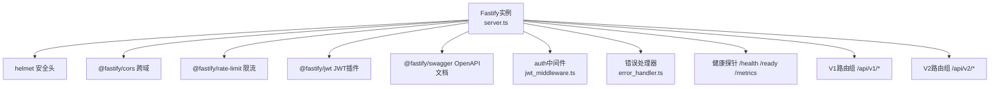
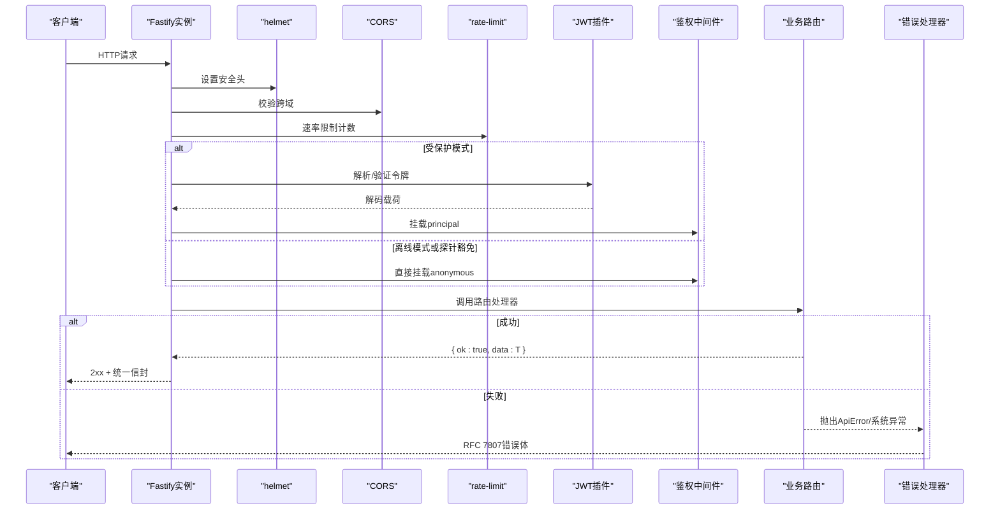
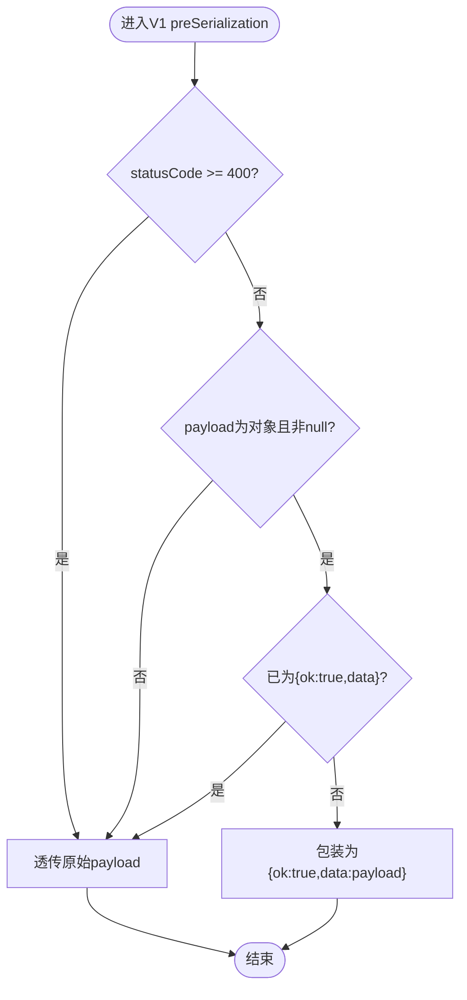
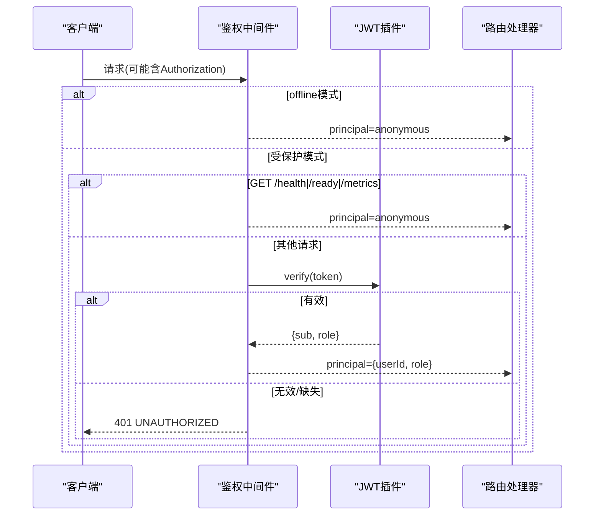
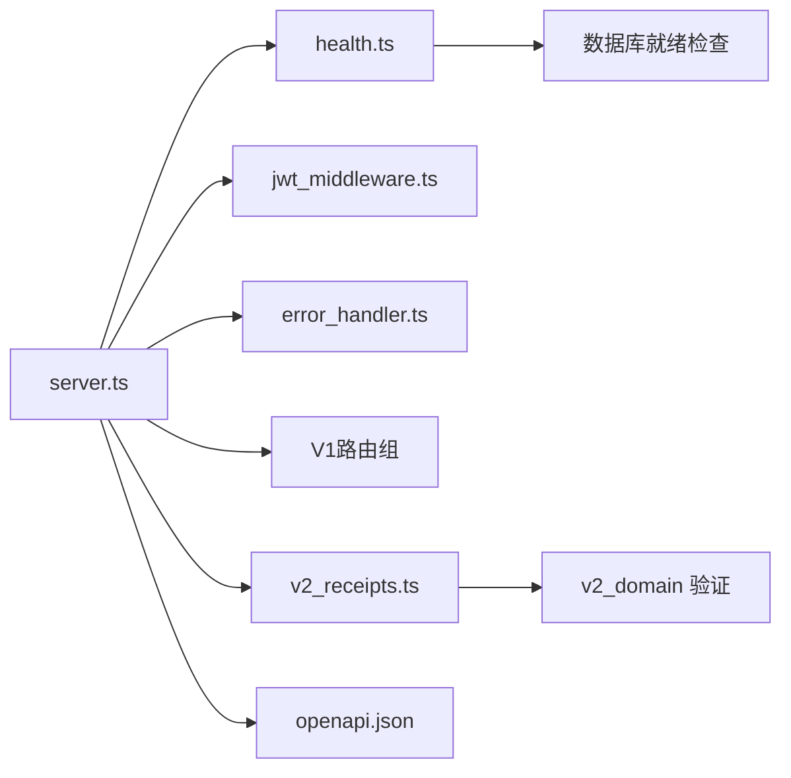

# API概览与认证

<cite>
**本文引用的文件**
- [server.ts](file://src/api/server.ts)
- [jwt_middleware.ts](file://src/api/auth/jwt_middleware.ts)
- [require_role.ts](file://src/api/auth/require_role.ts)
- [error_handler.ts](file://src/api/errors/error_handler.ts)
- [types.ts](file://src/api/types.ts)
- [health.ts](file://src/api/routes/health.ts)
- [v2_receipts.ts](file://src/api/routes/v2_receipts.ts)
- [openapi.json](file://schema/openapi.json)
</cite>

## 目录
1. [简介](#简介)
2. [项目结构](#项目结构)
3. [核心组件](#核心组件)
4. [架构总览](#架构总览)
5. [详细组件分析](#详细组件分析)
6. [依赖关系分析](#依赖关系分析)
7. [性能考虑](#性能考虑)
8. [故障排查指南](#故障排查指南)
9. [结论](#结论)
10. [附录](#附录)

## 简介
本文件面向FAR-Lab对外HTTP API的集成与维护，聚焦以下目标：
- 说明Fastify服务器配置与插件注册顺序（安全头、跨域、限流、JWT、OpenAPI/Swagger）。
- 解释统一响应信封{ ok: true, data: T }的设计原理与实现机制。
- 详述JWT认证流程（签发、验证、权限控制）与离线匿名模式的安全边界。
- 说明API版本管理策略（V1与V2端点差异及迁移建议）。
- 给出基于RFC 7807的错误处理规范。
- 提供客户端集成示例与最佳实践。

## 项目结构
FAR-Lab API以Fastify为核心，采用“插件+中间件+路由”的分层组织：
- 服务器构建与插件注册：在服务器入口中按固定顺序注册helmet、cors、rate-limit、jwt、swagger，并挂载鉴权中间件与错误处理器。
- 路由分组：/health、/ready、/metrics为裸根探针；业务路由按版本前缀划分（/api/v1/*、/api/v2/*）。
- 类型与契约：集中定义API请求/响应类型与错误格式，保证前后端契约一致。

图表来源
- [server.ts:112-170](file://src/api/server.ts#L112-L170)
- [health.ts:62-105](file://src/api/routes/health.ts#L62-L105)

章节来源
- [server.ts:112-255](file://src/api/server.ts#L112-L255)
- [health.ts:62-105](file://src/api/routes/health.ts#L62-L105)

## 核心组件
- Fastify服务器与插件链：负责创建实例、注册插件、挂载中间件与路由、暴露OpenAPI JSON。
- 鉴权中间件：支持offline匿名模式与受保护模式（fail-closed），对三探针豁免。
- 授权策略：基于角色与对象归属的细粒度访问控制。
- 统一错误处理：遵循RFC 7807 Problem Details子集，包含source_anchor定位信息。
- 统一响应信封：V1成功响应统一包装为{ ok: true, data: T }，通过preSerialization钩子实现。

章节来源
- [server.ts:112-194](file://src/api/server.ts#L112-L194)
- [jwt_middleware.ts:55-111](file://src/api/auth/jwt_middleware.ts#L55-L111)
- [require_role.ts:24-56](file://src/api/auth/require_role.ts#L24-L56)
- [error_handler.ts:117-193](file://src/api/errors/error_handler.ts#L117-L193)
- [types.ts:94-136](file://src/api/types.ts#L94-L136)

## 架构总览
下图展示从请求进入Fastify到返回响应的完整链路，包括插件、中间件、路由与错误处理。

图表来源
- [server.ts:112-170](file://src/api/server.ts#L112-L170)
- [jwt_middleware.ts:55-111](file://src/api/auth/jwt_middleware.ts#L55-L111)
- [error_handler.ts:117-193](file://src/api/errors/error_handler.ts#L117-L193)

## 详细组件分析

### 服务器与插件注册顺序
- 安全头：启用helmet，关闭CSP以避免默认策略影响前端。
- 跨域：允许指定origin并携带凭证。
- 限流：默认每分钟100次，可配置上限。
- JWT：仅在配置了非空密钥时注册，避免弱密钥兜底。
- OpenAPI：暴露/openapi.json与/documentation/json作为SSOT契约源。
- 鉴权中间件：全局onRequest钩子，支持offline匿名与三探针豁免。
- 错误处理器：全局setErrorHandler，统一RFC 7807错误响应。
- 路由：/health、/ready、/metrics裸根；/api/v1/*与/api/v2/*按版本分组。

章节来源
- [server.ts:112-170](file://src/api/server.ts#L112-L170)
- [server.ts:175-255](file://src/api/server.ts#L175-L255)

### 统一响应信封 { ok: true, data: T }
- 设计动机：统一V1成功响应形态，便于客户端解包与类型推断，屏蔽内部数据结构变化。
- 实现机制：在V1路由组上注册preSerialization钩子，在Fastify序列化前将非对象、null、已包裹的成功信封原样返回，其他对象自动包装为{ ok: true, data: payload }。
- 边界条件：
  - 状态码≥400不包装（由错误处理器输出RFC 7807错误体）。
  - 字符串/Buffer/Stream/null等原始响应保持原样（SSE/HTML/流式不受影响）。
  - 已手工包装的成功信封不会二次包装。
- 前端对接：客户端统一解析器只关注data字段，忽略ok标志位。

图表来源
- [server.ts:175-194](file://src/api/server.ts#L175-L194)

章节来源
- [server.ts:175-194](file://src/api/server.ts#L175-L194)

### JWT认证流程与权限控制
- 离线模式（jwtSecret为空）：所有请求挂载anonymous主体，不阻断任何路径，适合单机科研工具场景。
- 受保护模式（jwtSecret非空）：
  - 三探针GET /health、/ready、/metrics豁免JWT，直接挂载anonymous。
  - 其他请求必须携带Authorization: Bearer <token>，否则返回401。
  - 使用@fastify/jwt验证签名与有效期，解码后挂载principal（userId、role）。
  - 验证失败记录诊断日志，但对外仅返回统一401错误体。
- 权限控制：
  - 角色维度：viewer只读，researcher/admin可写。
  - 对象维度：BOLA模型下，owner为null表示公开资源；否则仅owner本人可访问。
  - 归属解析：受保护模式下写入owner=principal.userId；离线匿名模式写入owner=null（公开）。

图表来源
- [jwt_middleware.ts:55-111](file://src/api/auth/jwt_middleware.ts#L55-L111)
- [require_role.ts:24-56](file://src/api/auth/require_role.ts#L24-L56)

章节来源
- [jwt_middleware.ts:55-111](file://src/api/auth/jwt_middleware.ts#L55-L111)
- [require_role.ts:24-56](file://src/api/auth/require_role.ts#L24-L56)

### 错误处理规范（RFC 7807）
- 统一错误体：包含error_code、message、source_anchor三元定位，可选detail。
- 分类映射：
  - ApiError：直接使用其statusCode与errorCode。
  - ZodError/Schema校验失败：400 VALIDATION_FAILED，附带issues。
  - 429限流：RATE_LIMITED。
  - 其他未捕获异常：500 INTERNAL_ERROR。
- Content-Type：application/problem+json。
- source_anchor：用于快速定位问题来源（fileId/stageId/callRecordId）。

章节来源
- [error_handler.ts:117-193](file://src/api/errors/error_handler.ts#L117-L193)
- [types.ts:94-107](file://src/api/types.ts#L94-L107)

### V1与V2端点差异与迁移指南
- V1（/api/v1/*）：
  - 成功响应统一信封{ ok: true, data: T }，由preSerialization钩子自动包装。
  - 包含假设生成、证据查询、裁决、报告、完整性、基准测试、法庭/竞技场、生命周期事件等能力。
- V2（/api/v2/*）：
  - 收据验证与持久化能力，显式返回{ ok: true, data: {...} }，无需额外包装。
  - 面向六维收据验证与展示，便于前端消费。
- 迁移建议：
  - 新接入优先使用V2收据相关接口；历史功能逐步迁移至V2。
  - 客户端需兼容V1信封解析逻辑，并在切换至V2后按新契约消费data字段。
  - 使用/openapi.json作为契约SSOT进行代码生成与Mock。

章节来源
- [server.ts:175-255](file://src/api/server.ts#L175-L255)
- [v2_receipts.ts:24-73](file://src/api/routes/v2_receipts.ts#L24-L73)
- [openapi.json:1-200](file://schema/openapi.json#L1-L200)

### 离线模式下的匿名访问与安全考虑
- 行为：当未配置JWT密钥时，所有请求视为anonymous，不阻断任何路径。
- 适用场景：单机科研工具、本地开发、离线回放。
- 安全建议：
  - 生产环境务必启用受保护模式（传入非空jwtSecret），使鉴权fail-closed。
  - 公开部署时，结合网络隔离与最小权限原则，避免暴露敏感端点。
  - 审计日志应记录关键操作，便于事后追溯。

章节来源
- [jwt_middleware.ts:55-69](file://src/api/auth/jwt_middleware.ts#L55-L69)
- [server.ts:141-146](file://src/api/server.ts#L141-L146)

## 依赖关系分析
- server.ts依赖：
  - @fastify/helmet、@fastify/cors、@fastify/rate-limit、@fastify/jwt、@fastify/swagger。
  - 自定义模块：auth中间件、错误处理器、各版本路由注册。
- 路由与领域：
  - V2收据路由依赖v2_domain验证与展示格式化。
  - 健康探针依赖数据库连接进行就绪检查。
- 类型与契约：
  - types.ts集中定义API错误、健康/就绪响应、鉴权主体等共享类型。
  - openapi.json作为外部契约源，供前端与工具链使用。

图表来源
- [server.ts:112-255](file://src/api/server.ts#L112-L255)
- [v2_receipts.ts:24-73](file://src/api/routes/v2_receipts.ts#L24-L73)
- [health.ts:62-105](file://src/api/routes/health.ts#L62-L105)
- [openapi.json:1-200](file://schema/openapi.json#L1-L200)

章节来源
- [server.ts:112-255](file://src/api/server.ts#L112-L255)
- [v2_receipts.ts:24-73](file://src/api/routes/v2_receipts.ts#L24-L73)
- [health.ts:62-105](file://src/api/routes/health.ts#L62-L105)
- [openapi.json:1-200](file://schema/openapi.json#L1-L200)

## 性能考虑
- 请求超时与连接回收：设置合理的requestTimeout与connectionTimeout，防止慢调用拖垮服务。
- 限流策略：根据业务峰值调整rateLimit上限与时间窗口，避免误伤正常流量。
- 日志开关：测试环境可关闭logger以减少噪音；生产环境开启以支撑观测。
- 流式响应：SSE/HTML/流式响应绕过preSerialization包装，确保低延迟传输。

[本节为通用指导，不直接分析具体文件]

## 故障排查指南
- 401未授权：
  - 检查是否处于受保护模式且缺少或无效的Authorization头。
  - 确认JWT签名与过期时间正确。
- 400校验失败：
  - 查看错误体中的detail字段（Zod或AJV issues），修正请求参数。
- 429限流：
  - 降低请求频率或调整服务端rateLimit配置。
- 503不可用：
  - 检查数据库连通性（/ready探针），确认依赖就绪。
- 统一错误体：
  - 所有错误均包含source_anchor，便于快速定位问题来源。

章节来源
- [error_handler.ts:117-193](file://src/api/errors/error_handler.ts#L117-L193)
- [health.ts:75-105](file://src/api/routes/health.ts#L75-L105)

## 结论
FAR-Lab API以Fastify为核心，通过严格的插件顺序与中间件机制，实现了安全、可观测、可扩展的HTTP服务。统一响应信封与RFC 7807错误处理提升了客户端集成体验与可维护性。JWT认证支持离线匿名与受保护双轨模式，满足多场景需求。V1/V2分层清晰，便于渐进式迁移。建议在生产环境启用受保护模式，并结合OpenAPI契约进行自动化集成与测试。

[本节为总结性内容，不直接分析具体文件]

## 附录

### 客户端集成示例与最佳实践
- 获取OpenAPI契约：
  - 通过GET /openapi.json或/documentation/json获取最新契约，用于代码生成与Mock。
- 认证：
  - 受保护模式需在请求头携带Authorization: Bearer <token>。
  - 三探针GET /health、/ready、/metrics无需认证。
- 响应解析：
  - V1：解析data字段，忽略ok标志位；错误响应遵循RFC 7807。
  - V2：直接消费data字段。
- 重试与退避：
  - 对429与503实施指数退避重试；对400/401不进行重试。
- 安全建议：
  - 生产环境启用HTTPS与最小权限网络策略。
  - 定期轮换JWT密钥，监控鉴权失败日志。

章节来源
- [server.ts:147-165](file://src/api/server.ts#L147-L165)
- [jwt_middleware.ts:66-111](file://src/api/auth/jwt_middleware.ts#L66-L111)
- [error_handler.ts:117-193](file://src/api/errors/error_handler.ts#L117-L193)