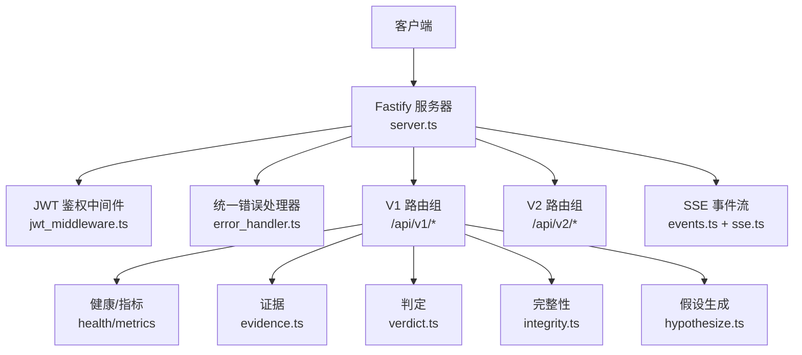
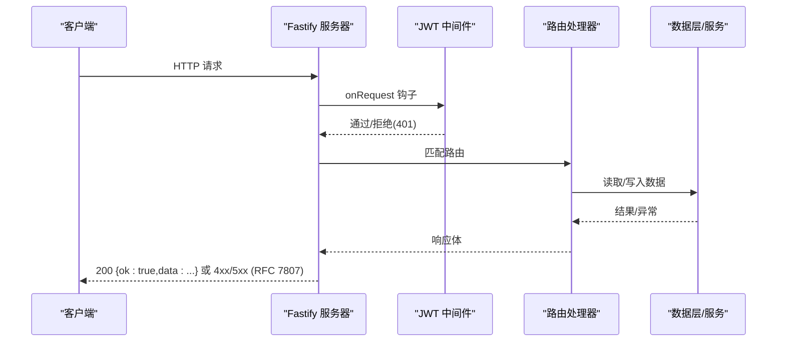
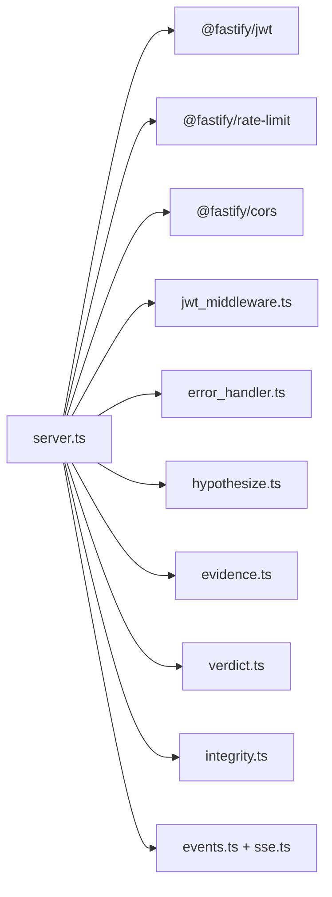

# REST API文档

<cite>
**本文引用的文件**
- [server.ts](file://src/api/server.ts)
- [jwt_middleware.ts](file://src/api/auth/jwt_middleware.ts)
- [error_handler.ts](file://src/api/errors/error_handler.ts)
- [openapi.json](file://schema/openapi.json)
- [hypothesize.ts](file://src/api/routes/hypothesize.ts)
- [evidence.ts](file://src/api/routes/evidence.ts)
- [verdict.ts](file://src/api/routes/verdict.ts)
- [integrity.ts](file://src/api/routes/integrity.ts)
- [events.ts](file://src/api/routes/events.ts)
- [sse.ts](file://src/api/routes/sse.ts)
</cite>

## 目录
1. [简介](#简介)
2. [项目结构](#项目结构)
3. [核心组件](#核心组件)
4. [架构总览](#架构总览)
5. [详细端点说明](#详细端点说明)
6. [依赖关系分析](#依赖关系分析)
7. [性能与限流](#性能与限流)
8. [故障排查指南](#故障排查指南)
9. [结论](#结论)
10. [附录：客户端集成与调试](#附录客户端集成与调试)

## 简介
本文件基于仓库中的 OpenAPI 规范与路由实现，系统化描述 FAR-Lab 对外 HTTP API。内容按功能域组织，覆盖健康检查、证据管理、研究编排（假设生成）、判定查询、完整性证明、指标监控、事件流等模块；并详细说明认证机制（JWT）、权限控制、速率限制、错误响应格式、版本策略与兼容性保证，以及 WebSocket/SSE 实时订阅方式。

## 项目结构
- 服务器入口与插件注册：Fastify 实例创建、安全头、CORS、限流、JWT、Swagger、统一错误处理、路由挂载。
- 路由分组：
  - 健康与可观测性：/health、/ready、/metrics
  - V1 业务：/api/v1/*（假设生成、证据、判定、报告、完整性、基准测试、法庭/竞技场、生命周期、规划）
  - V2 收据：/api/v2/*（六维收据校验与持久化）
  - 事件流：/api/v1/events/stream（SSE）
- 鉴权中间件：可选 JWT 模式，匿名探针豁免 GET /health、/ready、/metrics。
- 错误处理：统一 RFC 7807 Problem Details 子集，包含 source_anchor。

图表来源
- [server.ts:112-255](file://src/api/server.ts#L112-L255)
- [jwt_middleware.ts:55-111](file://src/api/auth/jwt_middleware.ts#L55-L111)
- [error_handler.ts:117-194](file://src/api/errors/error_handler.ts#L117-L194)
- [events.ts:71-139](file://src/api/routes/events.ts#L71-L139)
- [sse.ts:16-31](file://src/api/routes/sse.ts#L16-L31)

章节来源
- [server.ts:1-291](file://src/api/server.ts#L1-L291)

## 核心组件
- 服务器构建与插件链：按顺序注册 helmet、cors、rate-limit、jwt（受保护模式）、swagger、auth 中间件、错误处理器、路由。
- 统一成功信封：V1 路由在 preSerialization 阶段将非错误对象包装为 { ok: true, data: T }，已存在信封或错误不二次包装。
- 鉴权中间件：
  - offline 模式（无 jwtSecret）：所有请求挂载 anonymous 主体。
  - 受保护模式：GET /health、/ready、/metrics 精确豁免；其余需 Authorization: Bearer <token>，失败返回 401。
- 错误处理：
  - ApiError、ZodError、ajv 校验失败、429 限流均映射到统一的 application/problem+json 响应体。
  - 标准字段：error_code、message、source_anchor{fileId, stageId, callRecordId}，可选 detail。

章节来源
- [server.ts:102-194](file://src/api/server.ts#L102-L194)
- [jwt_middleware.ts:18-132](file://src/api/auth/jwt_middleware.ts#L18-L132)
- [error_handler.ts:17-194](file://src/api/errors/error_handler.ts#L17-L194)

## 架构总览
- 请求进入 Fastify 后先经 CORS、限流、JWT 鉴权（受保护模式），再进入路由。
- 路由内部调用领域服务（证据日志、判定、完整性计算等），并通过统一错误处理器输出标准化错误。
- 可选注入 AgentEventBus 以提供 SSE 事件流；SSE 使用 hijack 直写 raw 响应并附加 CORS 头。

图表来源
- [server.ts:112-194](file://src/api/server.ts#L112-L194)
- [jwt_middleware.ts:55-111](file://src/api/auth/jwt_middleware.ts#L55-L111)
- [error_handler.ts:117-194](file://src/api/errors/error_handler.ts#L117-L194)

## 详细端点说明

### 健康与可观测性
- GET /health
  - 用途：存活探针
  - 响应：{ status:"ok", service:"far-chain-api", timestamp }
- GET /ready
  - 用途：就绪探针（含数据库检查）
  - 响应：{ status:"ready"/"not_ready", service, checks:{ database:"ok"/"fail" }, timestamp }
- GET /metrics
  - 用途：Prometheus 文本格式指标
  - 响应：text/plain

章节来源
- [openapi.json:12-184](file://schema/openapi.json#L12-L184)

### 证据管理（Evidence）
- GET /api/v1/evidence/:id
  - 路径参数：id（字符串）
  - 响应：证据条目 DTO（含证据ID、调用记录序号、阶段ID、负载类型、负载内容、来源锚、创建时间、关联判定节点）
- GET /api/v1/evidence/chain/:headHash
  - 路径参数：headHash（64位十六进制）
  - 响应：证据链头信息 + 图子树

章节来源
- [openapi.json:194-231](file://schema/openapi.json#L194-L231)
- [evidence.ts:74-165](file://src/api/routes/evidence.ts#L74-L165)

### 判定查询（Verdict）
- GET /api/v1/verdict/:id
  - 路径参数：id（安全字符集，长度限制）
  - 响应：判定节点 DTO（含判定ID、证据ID、父节点、节点类型、决策、证伪规格、阈值规格、度量值、冲突证据数、范围漂移文本、未测试原因、来源锚、哈希链、时间戳、决策追踪）
- GET /api/v1/verdict/by_hypothesis/:hypoId
  - 路径参数：hypoId（安全字符集，长度限制）
  - 响应：同判定节点 DTO
- GET /api/v1/verdict
  - 查询参数：limit（默认100，上限1000）、offset（默认0）、verdict（枚举过滤）
  - 响应：{ items[], count, limit, offset, verdict? }

章节来源
- [openapi.json:232-284](file://schema/openapi.json#L232-L284)
- [verdict.ts:89-162](file://src/api/routes/verdict.ts#L89-L162)

### 研究编排（Hypothesize）
- POST /api/v1/hypothesize
  - 请求体：researchInput（必填）、mode（full|quick 可选）、dialogueMode（disabled|enabled 可选）、idempotencyKey（幂等键，可选）
  - 行为：
    - 受保护模式下仅 researcher/admin 可写；offline 模式全放行
    - 无 LLM 网关时返回 503 fail-closed
    - 支持幂等键：pending 并发冲突返回 409；命中缓存直接返回
  - 响应：loopState、graphSubtree、honestVerdict、reproHash、traceGrade、datasetSource、providerProfile

章节来源
- [openapi.json:185-193](file://schema/openapi.json#L185-L193)
- [hypothesize.ts:91-226](file://src/api/routes/hypothesize.ts#L91-L226)

### 完整性证明（Integrity）
- GET /api/v1/integrity/root
  - 响应：{ merkleRoot, leafCount, chainHeadSeq, chainHeadHash }
- GET /api/v1/integrity/proof/:seq
  - 路径参数：seq（正整数 safe integer）
  - 响应：{ seq, leafIndex, leaf, siblings[], expectedRoot, leafCount }
- GET /api/v1/integrity/receipt
  - 响应：Repro Receipt（含 schemaVersion、merkleRoot、leafCount、chainHeadSeq、chainHeadHash、gitCommitSha、generatedAt）

章节来源
- [openapi.json:323-800](file://schema/openapi.json#L323-L800)
- [integrity.ts:99-167](file://src/api/routes/integrity.ts#L99-L167)

### 事件流（SSE）
- GET /api/v1/events/stream?runId=<runId>&replay=true|false
  - 协议：Server-Sent Events（text/event-stream）
  - 能力：按 runId 过滤、连接后重放历史快照、心跳注释行保持连接
  - 注意：跨域需携带正确 Origin；服务端对 hijacked 响应手动附加 CORS 头

章节来源
- [events.ts:1-140](file://src/api/routes/events.ts#L1-L140)
- [sse.ts:1-32](file://src/api/routes/sse.ts#L1-L32)

### 其他 V1 路由（概览）
- /api/v1/report/:runId、/api/v1/report/:runId/paper
- /api/v1/benchmark
- /api/v1/court、/api/v1/arena
- /api/v1/lifecycle
- /api/v1/planning
- /api/v1/llm-status
以上路由由 server.ts 统一挂载，具体契约参见 OpenAPI 文档与服务端实现。

章节来源
- [server.ts:175-253](file://src/api/server.ts#L175-L253)

## 依赖关系分析
- 服务器依赖：
  - 插件：helmet、cors、rate-limit、jwt、swagger
  - 中间件：registerAuthMiddleware
  - 错误处理：errorHandler
  - 路由：health、metrics、hypothesize、evidence、verdict、report、integrity、benchmark、court、arena、lifecycle、planning、events（可选）
- 鉴权依赖：
  - @fastify/jwt（受保护模式）
  - 三探针 GET /health、/ready、/metrics 豁免
- 事件流依赖：
  - AgentEventBus（可选注入）
  - sse.ts 提供 CORS 兼容的原始响应头

图表来源
- [server.ts:112-255](file://src/api/server.ts#L112-L255)
- [jwt_middleware.ts:55-111](file://src/api/auth/jwt_middleware.ts#L55-L111)
- [error_handler.ts:117-194](file://src/api/errors/error_handler.ts#L117-L194)
- [events.ts:71-139](file://src/api/routes/events.ts#L71-L139)
- [sse.ts:16-31](file://src/api/routes/sse.ts#L16-L31)

章节来源
- [server.ts:112-255](file://src/api/server.ts#L112-L255)

## 性能与限流
- 请求超时：requestTimeout=900s，connectionTimeout=60s，防止慢调用无限挂起。
- 限流：默认 100 次/分钟（可通过 rateLimitMax 配置）。
- 响应封装：preSerialization 阶段统一包裹 { ok:true,data }，避免重复包装与错误误包。
- 指标：/metrics 暴露 Prometheus 文本格式指标。

章节来源
- [server.ts:121-140](file://src/api/server.ts#L121-L140)
- [server.ts:186-194](file://src/api/server.ts#L186-L194)
- [openapi.json:158-184](file://schema/openapi.json#L158-L184)

## 故障排查指南
- 常见状态码与错误码：
  - 401 UNAUTHORIZED：缺少或无效 Authorization Bearer 头
  - 403 FORBIDDEN：角色不足（如 viewer 尝试写操作）
  - 400 BAD_REQUEST/VALIDATION_FAILED：参数或请求体验证失败
  - 404 NOT_FOUND：资源不存在
  - 409 CONFLICT：幂等键 pending 冲突
  - 429 RATE_LIMITED：超过速率限制
  - 500 INTERNAL_ERROR：内部错误
  - 503 SERVICE_UNAVAILABLE：依赖未就绪（如无 LLM key）
- 错误体结构（RFC 7807 子集）：
  - error_code、message、source_anchor{fileId, stageId, callRecordId}、detail（可选）
- 定位建议：
  - 关注 source_anchor 三元定位
  - 查看 /metrics 与 /health、/ready 确认服务状态
  - 对 SSE 连接问题检查浏览器控制台 CORS 错误与代理超时

章节来源
- [error_handler.ts:17-194](file://src/api/errors/error_handler.ts#L17-L194)
- [jwt_middleware.ts:71-111](file://src/api/auth/jwt_middleware.ts#L71-L111)
- [hypothesize.ts:116-166](file://src/api/routes/hypothesize.ts#L116-L166)

## 结论
本 API 采用 Fastify 构建，遵循统一信封与 RFC 7807 错误规范，提供健康检查、证据与判定查询、假设生成、完整性证明、指标与事件流等能力。鉴权支持离线与受保护双轨模式，限流与超时策略保障稳定性。通过 OpenAPI 文档与类型化路由，便于前端与多语言 SDK 集成。

## 附录：客户端集成与调试
- 认证与权限
  - 受保护模式需在请求头携带 Authorization: Bearer <JWT>
  - 角色：viewer（只读）、researcher（读写）、admin（管理员）
  - 三探针 GET /health、/ready、/metrics 无需鉴权
- 速率限制
  - 默认 100 次/分钟；超限返回 429
- 版本管理与兼容性
  - OpenAPI 版本：2026-06-27
  - 统一信封 { ok:true,data } 作为 wire 契约；错误响应遵循 RFC 7807
  - 向后兼容：新增字段通常可选，删除字段需谨慎；变更应通过版本前缀或迁移策略
- 客户端示例（概念性步骤）
  - Node.js/TypeScript：使用 fetch 或 axios 发送请求，解析 { ok,data } 信封；处理 401/429/503
  - Python：requests 库设置 headers，重试策略处理 429，超时与重试退避
  - Go：net/http 设置 Header，解码 JSON 响应，处理错误码
- SSE 实时订阅
  - 使用 EventSource 连接 /api/v1/events/stream?runId=...&replay=true
  - 处理 event 与 data，忽略心跳注释行
  - 跨域开发环境确保 Origin 一致，服务端会回显 Access-Control-Allow-Origin
- 调试技巧
  - 使用 /documentation/json 或 /openapi.json 获取最新 OpenAPI 规范
  - 开启服务日志观察请求链路；关注 source_anchor 定位
  - 对幂等键场景，优先使用 idempotencyKey 避免重复执行

章节来源
- [jwt_middleware.ts:55-111](file://src/api/auth/jwt_middleware.ts#L55-L111)
- [server.ts:147-165](file://src/api/server.ts#L147-L165)
- [events.ts:71-139](file://src/api/routes/events.ts#L71-L139)
- [sse.ts:16-31](file://src/api/routes/sse.ts#L16-L31)
- [openapi.json:1-10](file://schema/openapi.json#L1-L10)