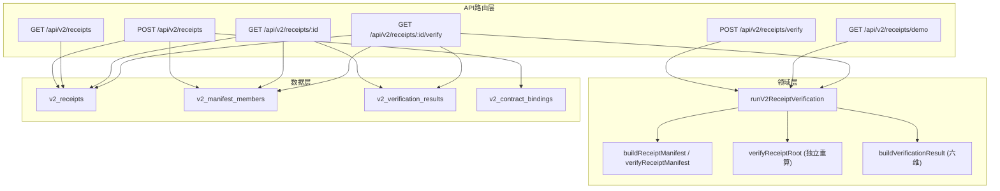
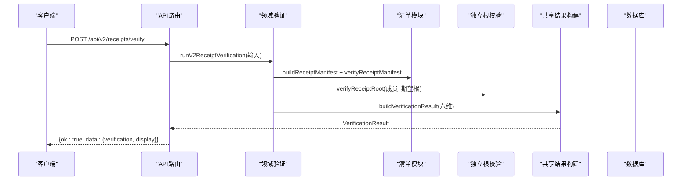
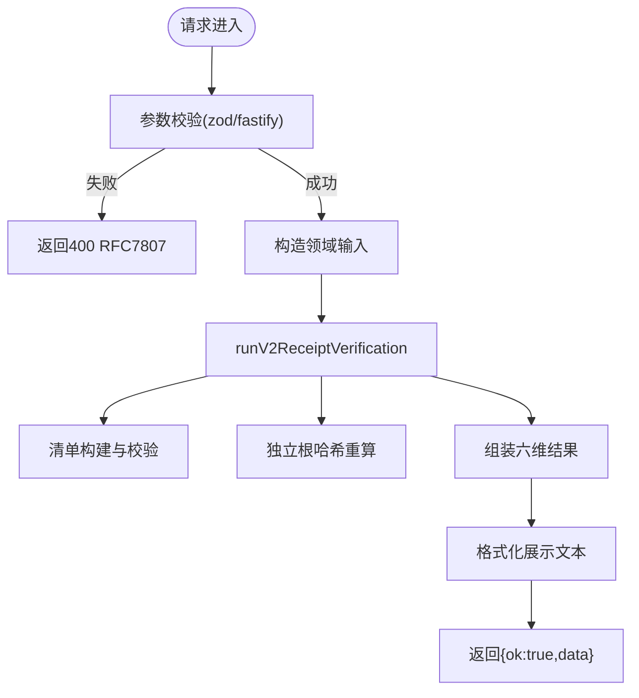
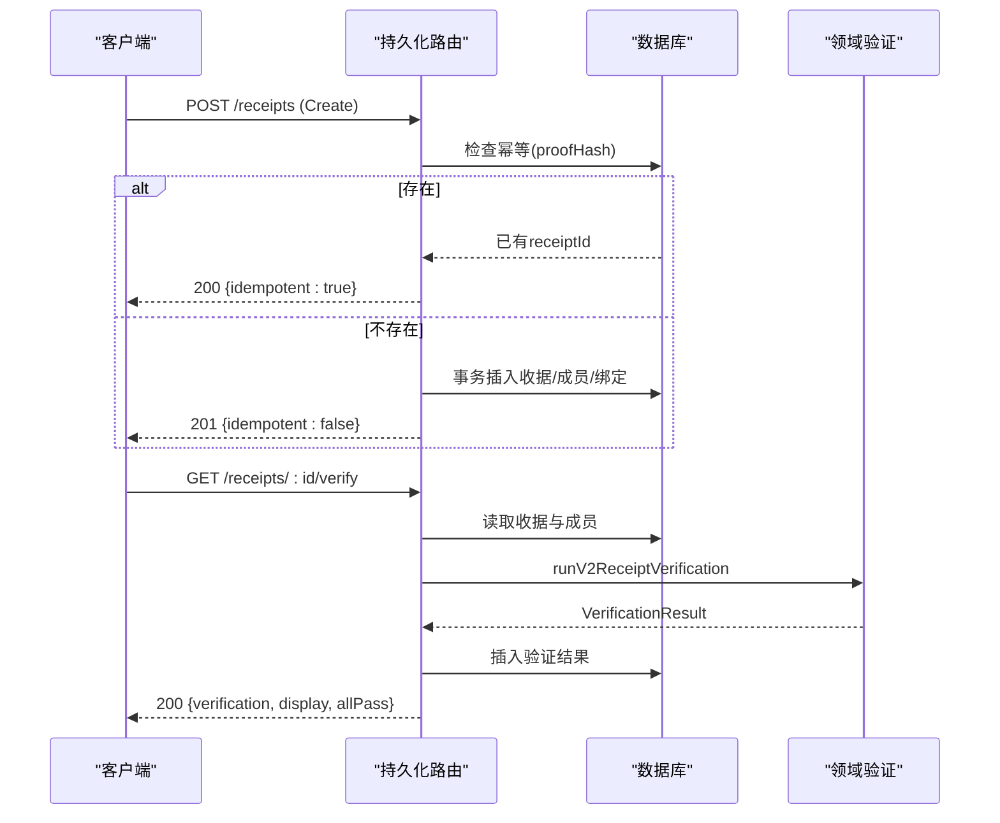
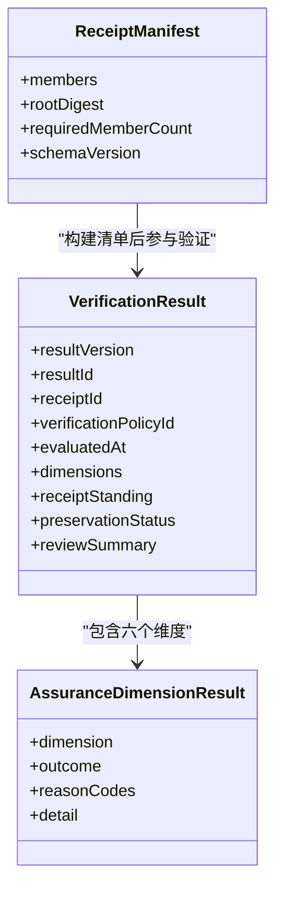
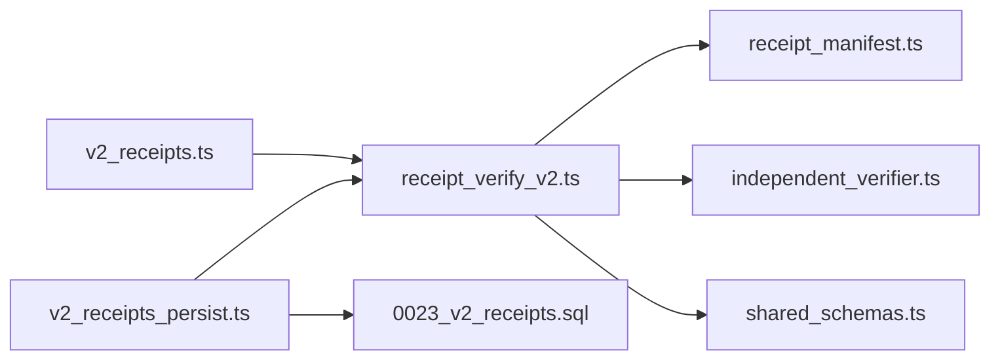

# V2收据验证API

<cite>
**本文引用的文件**
- [v2_receipts.ts](file://src/api/routes/v2_receipts.ts)
- [v2_receipts_persist.ts](file://src/api/routes/v2_receipts_persist.ts)
- [v2_receipts_schemas.ts](file://src/api/routes/v2_receipts_schemas.ts)
- [receipt_verify_v2.ts](file://src/v2_domain/receipt_verify_v2.ts)
- [receipt_manifest.ts](file://src/v2_domain/receipt_manifest.ts)
- [independent_verifier.ts](file://src/v2_domain/independent_verifier.ts)
- [shared_schemas.ts](file://src/v2_domain/shared_schemas.ts)
- [0023_v2_receipts.sql](file://schema/migrations/0023_v2_receipts.sql)
- [openapi.json](file://schema/openapi.json)
</cite>

## 目录
1. [简介](#简介)
2. [项目结构](#项目结构)
3. [核心组件](#核心组件)
4. [架构总览](#架构总览)
5. [详细组件分析](#详细组件分析)
6. [依赖关系分析](#依赖关系分析)
7. [性能考虑](#性能考虑)
8. [故障排查指南](#故障排查指南)
9. [结论](#结论)
10. [附录](#附录)

## 简介
本文件为V2收据验证系统的REST API文档，聚焦以下能力：
- 六维收据验证端点：提供可证伪性、证据充分性、统计显著性、范围覆盖、反剧场检测、数学验证等六个独立保障维度的验证接口（以“来源与完整性”“过程一致性”“科学裁决”等维度呈现）。
- 收据持久化接口：支持收据的创建、分页列表、详情查询、以及针对已存储收据的复检并持久化结果。
- 版本比较与差异分析：通过链头哈希加载裁决时间线，对比不同版本的断言与裁决变更。
- 签名与数字签名：在信封中携带签名字段，服务端侧进行结构校验；签名验证由上层证明包机制负责。
- 批量验证与处理：通过幂等创建与分页检索实现大规模收据的高效管理；服务端按策略评估并持久化结果。
- 生命周期管理与归档：收据具备状态（ACTIVE/SUPERSEDED/WITHDRAWN）与保存状态（AVAILABLE/ARCHIVED），支持后续归档策略扩展。
- 安全存储与访问控制：受保护模式下基于角色的对象级访问控制（BOLA），匿名模式保持向后兼容。
- 性能优化与缓存：统一Schema校验、事务写入、最小化DB往返、结果持久化避免重复计算。

## 项目结构
V2收据相关代码主要分布在三层：
- API路由层：定义HTTP端点、请求/响应契约、鉴权与错误格式。
- 领域层：实现六维验证的核心逻辑、清单构建与根校验、共享结果结构。
- 数据层：SQLite迁移脚本定义收据、清单成员、验证结果、合同绑定表结构。

图表来源
- [v2_receipts.ts:24-73](file://src/api/routes/v2_receipts.ts#L24-L73)
- [v2_receipts_persist.ts:76-357](file://src/api/routes/v2_receipts_persist.ts#L76-L357)
- [receipt_verify_v2.ts:81-161](file://src/v2_domain/receipt_verify_v2.ts#L81-L161)
- [receipt_manifest.ts:83-157](file://src/v2_domain/receipt_manifest.ts#L83-L157)
- [independent_verifier.ts:174-212](file://src/v2_domain/independent_verifier.ts#L174-L212)
- [0023_v2_receipts.sql:9-45](file://schema/migrations/0023_v2_receipts.sql#L9-L45)

章节来源
- [v2_receipts.ts:1-105](file://src/api/routes/v2_receipts.ts#L1-L105)
- [v2_receipts_persist.ts:1-388](file://src/api/routes/v2_receipts_persist.ts#L1-L388)
- [0023_v2_receipts.sql:1-46](file://schema/migrations/0023_v2_receipts.sql#L1-L46)

## 核心组件
- 六维验证入口：POST /api/v2/receipts/verify 接收ProofEnvelopeV2，调用领域层生成六维结果与可读展示文本。
- 演示端点：GET /api/v2/receipts/demo 返回合成收据及六维验证结果，便于前端集成与演示。
- 收据持久化：
  - POST /api/v2/receipts：幂等创建收据（基于proofHash），同时持久化清单成员与合同绑定。
  - GET /api/v2/receipts：分页列出收据（limit/offset），支持按claimId过滤。
  - GET /api/v2/receipts/:id：获取收据详情，包含清单成员与最新验证结果。
  - GET /api/v2/receipts/:id/verify：对已存储收据执行复检，持久化结果并返回allPass标志。
- 数据结构：
  - 清单成员：kind/digest/sizeBytes，要求11类必需成员。
  - 验证结果：始终包含全部六个维度，每个维度独立评估，不塌缩为单一“已验证”。

章节来源
- [v2_receipts.ts:24-73](file://src/api/routes/v2_receipts.ts#L24-L73)
- [v2_receipts_persist.ts:89-357](file://src/api/routes/v2_receipts_persist.ts#L89-L357)
- [receipt_manifest.ts:28-40](file://src/v2_domain/receipt_manifest.ts#L28-L40)
- [shared_schemas.ts:38-48](file://src/v2_domain/shared_schemas.ts#L38-L48)

## 架构总览
V2收据验证采用“路由层—领域层—数据层”分层架构：
- 路由层负责参数校验、鉴权、统一信封响应与错误格式（RFC 7807）。
- 领域层实现不可变、独立的验证流程：清单构建与校验、根哈希独立重算、六维结果组装。
- 数据层使用SQLite持久化收据、清单成员、验证结果与合同绑定，支持幂等创建与分页查询。

图表来源
- [v2_receipts.ts:45-73](file://src/api/routes/v2_receipts.ts#L45-L73)
- [receipt_verify_v2.ts:81-161](file://src/v2_domain/receipt_verify_v2.ts#L81-L161)
- [receipt_manifest.ts:83-157](file://src/v2_domain/receipt_manifest.ts#L83-L157)
- [independent_verifier.ts:174-212](file://src/v2_domain/independent_verifier.ts#L174-L212)
- [shared_schemas.ts:175-201](file://src/v2_domain/shared_schemas.ts#L175-L201)

## 详细组件分析

### 六维验证端点（POST /api/v2/receipts/verify）
- 功能：接收ProofEnvelopeV2，转换为领域输入，运行六维验证，返回结构化结果与可读展示。
- 输入：schemaVersion/proofHash必填；claim/verdictTrace等为可选对象或数组；envelope其他字段允许透传。
- 输出：{ ok: true, data: { verification, display } }。
- 错误：400 VALIDATION_FAILED（RFC 7807）。

图表来源
- [v2_receipts.ts:45-73](file://src/api/routes/v2_receipts.ts#L45-L73)
- [v2_receipts_schemas.ts:115-135](file://src/api/routes/v2_receipts_schemas.ts#L115-L135)
- [receipt_verify_v2.ts:81-161](file://src/v2_domain/receipt_verify_v2.ts#L81-L161)

章节来源
- [v2_receipts.ts:45-73](file://src/api/routes/v2_receipts.ts#L45-L73)
- [v2_receipts_schemas.ts:258-269](file://src/api/routes/v2_receipts_schemas.ts#L258-L269)

### 演示端点（GET /api/v2/receipts/demo）
- 功能：返回合成收据及其六维验证结果，用于前端演示与集成测试。
- 输出：{ ok: true, data: { receipt, verification } }。

章节来源
- [v2_receipts.ts:26-35](file://src/api/routes/v2_receipts.ts#L26-L35)
- [v2_receipts_schemas.ts:272-279](file://src/api/routes/v2_receipts_schemas.ts#L272-L279)

### 收据持久化接口
- 创建收据（POST /api/v2/receipts）
  - 幂等：相同proofHash返回已有receiptId与idempotent=true。
  - 权限：受保护模式下需写角色；否则返回403。
  - 事务：插入收据、清单成员、合同绑定在同一事务中。
  - 输出：201新建或200幂等，{ ok: true, data: { receiptId, idempotent } }。
- 列表收据（GET /api/v2/receipts）
  - 分页：limit(1..100)/offset(>=0)，默认limit=20, offset=0。
  - 过滤：可选claimId精确匹配。
  - 权限：受保护模式下仅返回本人+公开收据。
  - 输出：{ ok: true, data: { receipts, total, limit, offset } }。
- 详情收据（GET /api/v2/receipts/:id）
  - 权限：对象级授权（BOLA），非本人且非公开返回403。
  - 输出：收据、清单成员、最新验证结果（latestVerification可为空）。
- 复检收据（GET /api/v2/receipts/:id/verify）
  - 行为：读取收据与清单成员，运行六维验证，持久化结果，返回allPass。
  - 输出：{ ok: true, data: { verification, display, allPass } }。

图表来源
- [v2_receipts_persist.ts:89-161](file://src/api/routes/v2_receipts_persist.ts#L89-L161)
- [v2_receipts_persist.ts:171-223](file://src/api/routes/v2_receipts_persist.ts#L171-L223)
- [v2_receipts_persist.ts:232-280](file://src/api/routes/v2_receipts_persist.ts#L232-L280)
- [v2_receipts_persist.ts:289-357](file://src/api/routes/v2_receipts_persist.ts#L289-L357)

章节来源
- [v2_receipts_persist.ts:89-357](file://src/api/routes/v2_receipts_persist.ts#L89-L357)
- [v2_receipts_schemas.ts:149-169](file://src/api/routes/v2_receipts_schemas.ts#L149-L169)
- [v2_receipts_schemas.ts:282-336](file://src/api/routes/v2_receipts_schemas.ts#L282-L336)

### 六维验证领域逻辑
- 清单构建与校验：
  - 必需成员种类：claim、fecSnapshot、protocolFreeze、datasetBindings、workflowBindings、experimentRuns、measurementResults、statisticalResults、verdictTrace、antiTheaterReport、ledgerRoot。
  - 缺失/无效/重复将导致清单校验失败。
- 独立根校验：
  - 独立于生产路径重新排序、规范化JSON、计算sha256，确保无共同模式缺陷。
- 六维结果：
  - provenance：清单存在且根可重算则PASS，否则FAIL。
  - integrity：成员digest格式有效则PASS，否则FAIL。
  - identity：keyless v0 → NOT_APPLICABLE。
  - processConformance：清单完整则PASS，否则FAIL。
  - executionReproduction：未请求回放 → NOT_APPLICABLE。
  - scientificVerdict：fixture-only → WARN（诚实边界）。

图表来源
- [receipt_manifest.ts:55-61](file://src/v2_domain/receipt_manifest.ts#L55-L61)
- [shared_schemas.ts:38-48](file://src/v2_domain/shared_schemas.ts#L38-L48)
- [shared_schemas.ts:26-32](file://src/v2_domain/shared_schemas.ts#L26-L32)

章节来源
- [receipt_manifest.ts:28-40](file://src/v2_domain/receipt_manifest.ts#L28-L40)
- [receipt_manifest.ts:83-157](file://src/v2_domain/receipt_manifest.ts#L83-L157)
- [independent_verifier.ts:174-212](file://src/v2_domain/independent_verifier.ts#L174-L212)
- [receipt_verify_v2.ts:81-161](file://src/v2_domain/receipt_verify_v2.ts#L81-L161)

### 版本比较与差异分析
- 通过链头哈希加载裁决时间线，对比不同版本的断言与裁决变更。
- 前端界面提供版本卡片、裁决变更标记、范围与未测试原因说明。
- 后端通过完整性接口提供链头与叶子信息，支撑版本比较。

章节来源
- [openapi.json:323-575](file://schema/openapi.json#L323-L575)
- [openapi.json:576-800](file://schema/openapi.json#L576-L800)

### 签名与数字签名
- 信封中包含signatures字段，服务端进行结构校验（zod schema允许数组）。
- 签名验证由上层证明包机制负责；本API侧重收据结构与清单完整性。
- 建议：在生产环境中结合证明包验证与离线打包工具进行端到端签名校验。

章节来源
- [v2_receipts_schemas.ts:115-135](file://src/api/routes/v2_receipts_schemas.ts#L115-L135)

### 批量验证与处理
- 幂等创建：相同proofHash多次提交返回同一receiptId，避免重复写入。
- 分页列表：limit/offset统一分页，支持claimId过滤，便于批量浏览与定位。
- 复检持久化：对已存储收据执行复检并记录结果，减少重复计算成本。

章节来源
- [v2_receipts_persist.ts:89-161](file://src/api/routes/v2_receipts_persist.ts#L89-L161)
- [v2_receipts_persist.ts:171-223](file://src/api/routes/v2_receipts_persist.ts#L171-L223)
- [v2_receipts_persist.ts:289-357](file://src/api/routes/v2_receipts_persist.ts#L289-L357)

### 生命周期管理与归档策略
- 收据状态：ACTIVE/SUPERSEDED/WITHDRAWN，表示收据当前有效性。
- 保存状态：AVAILABLE/ARCHIVED，表示是否归档。
- 建议在业务层根据策略更新这些字段，以支持长期保留与合规审计。

章节来源
- [0023_v2_receipts.sql:9-19](file://schema/migrations/0023_v2_receipts.sql#L9-L19)

### 安全存储与访问控制
- 受保护模式：基于角色的对象级访问控制（BOLA），viewer只读，researcher/admin可写。
- 匿名模式：保持向后兼容，允许全量访问。
- 错误响应：统一RFC 7807格式，便于客户端处理。

章节来源
- [v2_receipts_persist.ts:92-100](file://src/api/routes/v2_receipts_persist.ts#L92-L100)
- [v2_receipts_persist.ts:181-186](file://src/api/routes/v2_receipts_persist.ts#L181-L186)
- [v2_receipts_persist.ts:240-250](file://src/api/routes/v2_receipts_persist.ts#L240-L250)

## 依赖关系分析
- 路由依赖领域层：
  - v2_receipts.ts 调用 receipt_verify_v2.ts 的 runV2ReceiptVerification。
  - v2_receipts_persist.ts 同样调用该函数，并读写数据库。
- 领域层依赖清单与独立校验：
  - receipt_manifest.ts 提供清单构建与校验。
  - independent_verifier.ts 提供独立根校验。
  - shared_schemas.ts 提供六维结果构建与NOT_APPLICABLE占位。
- 数据层依赖迁移脚本：
  - 0023_v2_receipts.sql 定义收据、清单成员、验证结果、合同绑定表。

图表来源
- [v2_receipts.ts:12-19](file://src/api/routes/v2_receipts.ts#L12-L19)
- [v2_receipts_persist.ts:23-34](file://src/api/routes/v2_receipts_persist.ts#L23-L34)
- [receipt_verify_v2.ts:16-32](file://src/v2_domain/receipt_verify_v2.ts#L16-L32)
- [0023_v2_receipts.sql:1-46](file://schema/migrations/0023_v2_receipts.sql#L1-L46)

章节来源
- [v2_receipts.ts:12-19](file://src/api/routes/v2_receipts.ts#L12-L19)
- [v2_receipts_persist.ts:23-34](file://src/api/routes/v2_receipts_persist.ts#L23-L34)
- [receipt_verify_v2.ts:16-32](file://src/v2_domain/receipt_verify_v2.ts#L16-L32)

## 性能考虑
- 统一Schema校验：使用zod/fastify/ajv进行请求/响应校验，减少手写校验分支。
- 事务写入：创建收据时一次性插入收据、清单成员、合同绑定，降低DB往返。
- 结果持久化：复检结果写入数据库，避免重复计算。
- 分页查询：limit/offset限制返回规模，提升列表性能。
- 独立根校验：从Node crypto直接计算sha256，避免共享依赖带来的共同模式缺陷。

[本节提供通用指导，无需特定文件引用]

## 故障排查指南
- 400 VALIDATION_FAILED：请求体/参数不符合zod schema，检查必填字段与类型。
- 403 FORBIDDEN：受保护模式下角色不足或对象级访问被拒，确认principal.role与owner。
- 404 NOT_FOUND：收据不存在，检查id是否正确。
- 清单校验失败：缺少必需成员、digest格式无效或重复kind，检查manifestMembers。
- 根校验失败：成员digest无效或根不匹配，检查digest与排序规范化。

章节来源
- [v2_receipts_schemas.ts:39-50](file://src/api/routes/v2_receipts_schemas.ts#L39-L50)
- [v2_receipts_persist.ts:92-100](file://src/api/routes/v2_receipts_persist.ts#L92-L100)
- [v2_receipts_persist.ts:232-238](file://src/api/routes/v2_receipts_persist.ts#L232-L238)
- [receipt_manifest.ts:112-157](file://src/v2_domain/receipt_manifest.ts#L112-L157)
- [independent_verifier.ts:174-212](file://src/v2_domain/independent_verifier.ts#L174-L212)

## 结论
V2收据验证系统通过清晰的分层架构与严格的契约校验，提供了六维独立保障的收据验证能力。持久化接口支持幂等创建、分页检索与复检结果存储，满足大规模收据管理需求。版本比较与签名机制为证据链的可追溯性与可信性提供基础。未来可扩展归档策略与更多维度评估，以增强科学验证与合规审计能力。

[本节总结内容，无需特定文件引用]

## 附录
- OpenAPI规范：参考schema/openapi.json中的路径与响应定义。
- 数据库迁移：参考schema/migrations/0023_v2_receipts.sql中的表结构。
- 前端集成：参考frontend/src/lib/types.ts中的类型定义与i18n文案。

章节来源
- [openapi.json:1-800](file://schema/openapi.json#L1-L800)
- [0023_v2_receipts.sql:1-46](file://schema/migrations/0023_v2_receipts.sql#L1-L46)