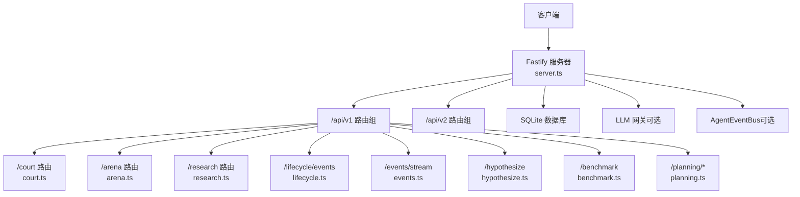
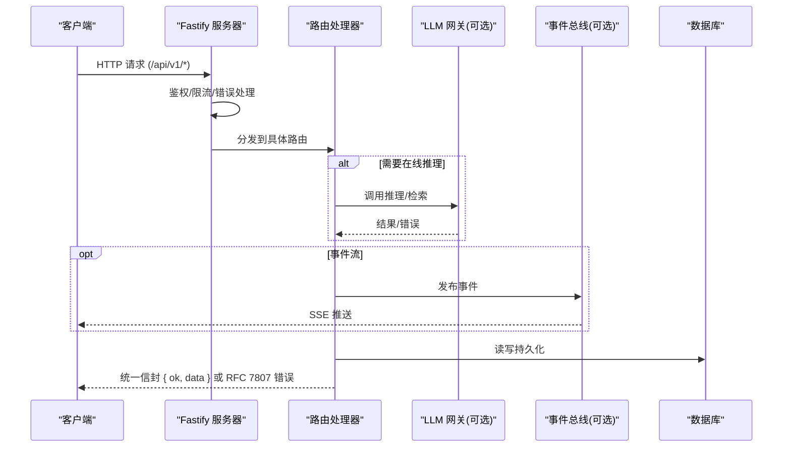
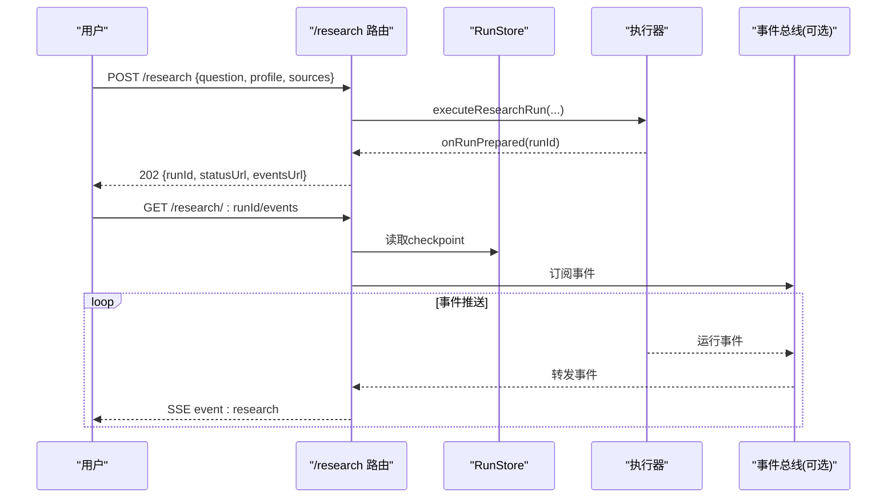
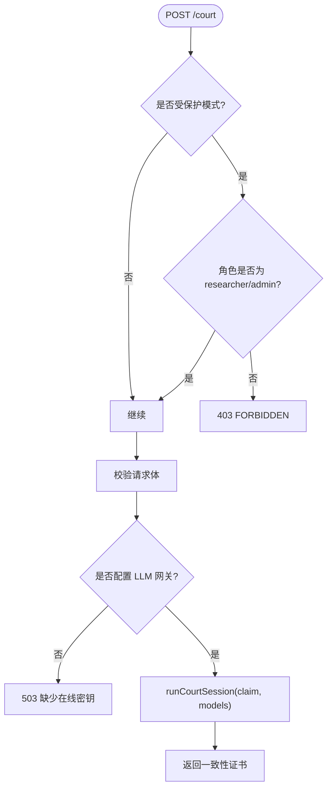
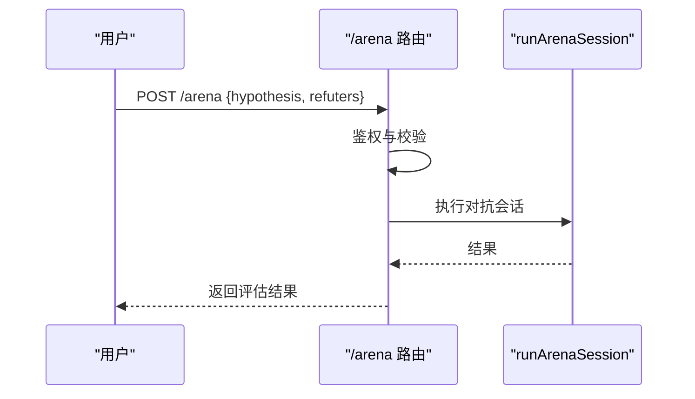
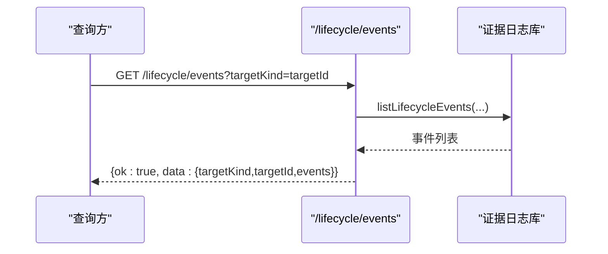
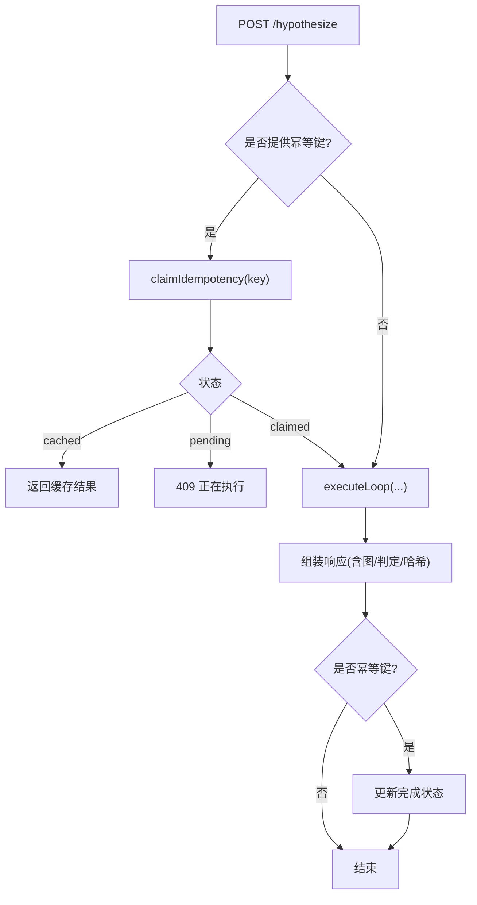
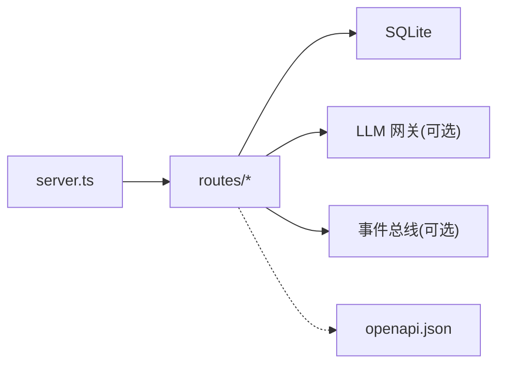

# 研究编排API

<cite>
**本文引用的文件**
- [server.ts](file://src/api/server.ts)
- [court.ts](file://src/api/routes/court.ts)
- [arena.ts](file://src/api/routes/arena.ts)
- [research.ts](file://src/api/routes/research.ts)
- [lifecycle.ts](file://src/api/routes/lifecycle.ts)
- [events.ts](file://src/api/routes/events.ts)
- [hypothesize.ts](file://src/api/routes/hypothesize.ts)
- [benchmark.ts](file://src/api/routes/benchmark.ts)
- [planning.ts](file://src/api/routes/planning.ts)
- [openapi.json](file://schema/openapi.json)
</cite>

## 目录
1. [简介](#简介)
2. [项目结构](#项目结构)
3. [核心组件](#核心组件)
4. [架构总览](#架构总览)
5. [详细组件分析](#详细组件分析)
6. [依赖关系分析](#依赖关系分析)
7. [性能与可用性](#性能与可用性)
8. [故障排查指南](#故障排查指南)
9. [结论](#结论)
10. [附录：端点清单与数据模型](#附录端点清单与数据模型)

## 简介
本文件为“研究编排与管理”系统的 REST API 文档，覆盖以下能力：
- 研究计划管理：创建、执行、监控、结果分析与反馈闭环。
- 法庭辩论接口（/api/v1/court）：多方观点收集、辩论流程管理与共识达成机制。
- 竞技场功能（/api/v1/arena）：模型对比、基准测试与性能评估。
- 生命周期事件接口：只读查询与实时事件订阅（SSE）。
- 批量执行与管理：规划门禁与批处理校验。
- 可视化与导出：报告与证据链完整性、基准报告。
- 多用户协作与权限控制：基于 JWT 的角色访问控制。
- 自动化编排与调度：确定性规划与门禁引擎。

## 项目结构
系统以 Fastify 作为 HTTP 服务框架，统一注册插件（安全头、CORS、限流、JWT、OpenAPI），并在 /api/v1 前缀下挂载各业务路由；/api/v2 提供收据验证与持久化。服务器支持可选的 LLM 网关注入与 SSE 事件总线注入，实现“在线模式”和“离线回放模式”双轨运行。

图表来源
- [server.ts:112-255](file://src/api/server.ts#L112-L255)

章节来源
- [server.ts:1-291](file://src/api/server.ts#L1-L291)

## 核心组件
- 服务器装配与中间件：安全头、跨域、限流、JWT、错误处理器、OpenAPI 文档。
- 统一信封：V1 成功响应统一包装为 { ok: true, data: T }，错误遵循 RFC 7807。
- 运行时能力：
  - LLM 网关：在线模式需要配置密钥，否则关键写端点返回 503 fail-closed。
  - 事件总线：可选注入，用于 /events/stream SSE 推送。
- 路由模块：按职责拆分 court、arena、research、lifecycle、events、hypothesize、benchmark、planning。

章节来源
- [server.ts:112-255](file://src/api/server.ts#L112-L255)
- [openapi.json:1-200](file://schema/openapi.json#L1-L200)

## 架构总览
下图展示请求从客户端到路由再到后端服务的调用路径，以及可选的 LLM 网关与事件总线参与方式。

图表来源
- [server.ts:112-255](file://src/api/server.ts#L112-L255)
- [events.ts:71-139](file://src/api/routes/events.ts#L71-L139)

## 详细组件分析

### 研究计划管理（/api/v1/research）
- 功能要点
  - 创建后台运行：POST /research 异步启动，返回 runId 与状态/事件 URL。
  - 列表与状态：GET /research 列出所有运行；GET /research/:runId/status 获取 checkpoint 摘要。
  - 实时监控：GET /research/:runId/events 通过 SSE 推送状态快照与运行事件，终态自动关闭。
  - 取消与冻结：POST /research/:runId/cancel 请求取消；GET /research/:runId 仅当 COMPLETED 时返回冻结产物。
  - 反馈与分析：POST /research/:runId/feedback 提交结构化反馈生成不可变修订；POST /research/:runId/analyze 触发真实数据分析并回写。
  - 指标与验证：GET /research/:runId/evaluate 计算程序化指标与可重复性验证。
- 权限与安全
  - 受保护模式下，写操作需 researcher/admin；offline 模式匿名放行。
  - LIVE 运行对变更操作强制要求在线密钥，避免模式混淆。
- 数据流
  - 使用文件型 RunStore 作为权威存储，内存 registry 仅作写穿透缓存。
  - SSE 心跳防代理超时，连接关闭自动退订。

图表来源
- [research.ts:212-308](file://src/api/routes/research.ts#L212-L308)
- [research.ts:340-396](file://src/api/routes/research.ts#L340-L396)

章节来源
- [research.ts:1-562](file://src/api/routes/research.ts#L1-L562)

### 法庭辩论接口（/api/v1/court）
- 端点
  - POST /api/v1/court：提交 claim + models 列表，进行跨模型可靠性法庭会话。
- 行为约束
  - 无 LLM 网关时返回 503 fail-closed，绝不静默回放冒充证书。
  - 每个模型的 verdict 由确定性内核给出，非 LLM 裁决。
  - 受保护模式下需 researcher/admin 角色。
- 输入输出
  - 输入：claim（字符串）、models（数组，长度限制）。
  - 输出：跨模型一致性证书（由内部服务生成）。

图表来源
- [court.ts:39-80](file://src/api/routes/court.ts#L39-L80)

章节来源
- [court.ts:1-81](file://src/api/routes/court.ts#L1-L81)

### 竞技场功能（/api/v1/arena）
- 端点
  - POST /api/v1/arena：提交 hypothesis + refuters 列表，进行对抗式评估。
- 行为约束
  - 无 LLM 网关时返回 503 fail-closed。
  - 仲裁器为确定性规则（verdict 分歧检测），非 LLM。
  - 受保护模式下需 researcher/admin 角色。
- 输入输出
  - 输入：hypothesis（字符串）、refuters（标签数组，长度限制）。
  - 输出：对抗评估结果。

图表来源
- [arena.ts:48-92](file://src/api/routes/arena.ts#L48-L92)

章节来源
- [arena.ts:1-93](file://src/api/routes/arena.ts#L1-L93)

### 生命周期事件接口
- 只读查询
  - GET /api/v1/lifecycle/events?targetKind=...&targetId=...：查询目标实体的生命周期事件（撤回/纠正/替代等），返回事件哈希链。
- 实时订阅
  - GET /api/v1/events/stream?runId=...&replay=true：SSE 推送 AgentLoop 事件，支持历史重放与心跳保活。
- 权限
  - 生命周期查询为公开只读；事件流为运行时推送，不暴露敏感内容。

图表来源
- [lifecycle.ts:31-79](file://src/api/routes/lifecycle.ts#L31-L79)

章节来源
- [lifecycle.ts:1-80](file://src/api/routes/lifecycle.ts#L1-L80)
- [events.ts:71-139](file://src/api/routes/events.ts#L71-L139)

### 假设生成与幂等执行（/api/v1/hypothesize）
- 端点
  - POST /api/v1/hypothesize：接收研究输入与模式，执行六阶段科研循环，返回图子树、诚实判定、可复现哈希等。
- 幂等键
  - 可选 idempotencyKey：并发同 key 去重，已完成直接返回缓存；进行中返回 409。
- 失败策略
  - 无 LLM 网关时 503 fail-closed；失败时清理占位记录允许重试。

图表来源
- [hypothesize.ts:91-225](file://src/api/routes/hypothesize.ts#L91-L225)

章节来源
- [hypothesize.ts:1-226](file://src/api/routes/hypothesize.ts#L1-L226)

### 基准与完整性（/api/v1/benchmark）
- 端点
  - GET /api/v1/benchmark：返回预生成的 Science-125 套件级完整性报告（构建时生成，运行时只读）。
- 行为
  - 未生成则 503；损坏则 500；模块级缓存按 mtime 失效。

章节来源
- [benchmark.ts:1-135](file://src/api/routes/benchmark.ts#L1-L135)

### 规划与门禁（/api/v1/planning）
- 端点
  - POST /planning/risk：风险分级 P0-P4。
  - POST /planning/plan：Plan DAG 校验与拓扑序。
  - POST /planning/spec：Spec 可验证规格校验。
  - POST /planning/gate：四步门函数报告。
- 特点
  - 全部确定性、无 LLM；统一信封返回。

章节来源
- [planning.ts:1-72](file://src/api/routes/planning.ts#L1-L72)

## 依赖关系分析
- 服务器层依赖
  - 插件：helmet、cors、rate-limit、jwt、swagger。
  - 路由：health、metrics、hypothesize、evidence、verdict、report、integrity、benchmark、court、arena、research、lifecycle、events、planning。
  - 外部：SQLite、可选 LLM 网关、可选事件总线。
- 路由间耦合
  - research 与 lifecycle/events 通过 RunStore 与事件总线解耦。
  - court/arena 依赖 LLM 网关进行在线推理，但裁决逻辑为确定性内核。
  - benchmark 独立于运行时，仅读取预生成 JSON。

图表来源
- [server.ts:112-255](file://src/api/server.ts#L112-L255)
- [openapi.json:1-200](file://schema/openapi.json#L1-L200)

章节来源
- [server.ts:112-255](file://src/api/server.ts#L112-L255)

## 性能与可用性
- 限流与超时
  - 默认 100 次/分钟限流；请求超时 900s，空闲连接 60s 回收。
- 缓存与只读优化
  - benchmark 报告模块级缓存，按文件 mtime 失效。
  - research 列表跳过损坏条目，避免单点故障影响整体。
- 高可用建议
  - 启用 CORS 白名单与限流；生产部署开启 JWT 保护。
  - 合理设置 SSE 心跳间隔，避免代理/负载均衡超时。
  - 对 LIVE 运行确保在线密钥稳定，避免 503 抖动。

[本节为通用指导，无需特定文件引用]

## 故障排查指南
- 常见错误码
  - 400 VALIDATION_FAILED：请求体或参数校验失败（如 court/arena/research 输入）。
  - 403 FORBIDDEN：受保护模式下角色不足（viewer 无法写）。
  - 409 IDEMPOTENCY_PENDING：幂等键冲突（hypothesize）。
  - 503 SERVICE_UNAVAILABLE：缺少在线密钥或未生成报告（hypothesize/court/arena/benchmark）。
  - 500 INTERNAL_ERROR：内部错误或数据损坏（如 checkpoint 不可读）。
- 定位步骤
  - 检查 /health 与 /ready 探针。
  - 查看 /metrics 指标。
  - 对于 research 运行，通过 /research/:runId/events 观察事件流与终态。
  - 对于 court/arena，确认环境变量已配置在线密钥。
  - 对于 benchmark，确认已运行生成脚本并重启服务。

章节来源
- [hypothesize.ts:91-225](file://src/api/routes/hypothesize.ts#L91-L225)
- [court.ts:39-80](file://src/api/routes/court.ts#L39-L80)
- [arena.ts:48-92](file://src/api/routes/arena.ts#L48-L92)
- [benchmark.ts:71-125](file://src/api/routes/benchmark.ts#L71-L125)

## 结论
本 API 将研究编排的核心能力以 RESTful 形式暴露，并通过统一信封、确定性门禁、在线/离线双轨、SSE 事件流与审计链路，保障科学产物的可重复性与可追溯性。建议在生产环境启用 JWT 保护、合理配置限流与超时，并结合事件流与生命周期查询实现端到端的可观测性。

[本节为总结，无需特定文件引用]

## 附录：端点清单与数据模型
- 健康与就绪
  - GET /health：服务存活探针。
  - GET /ready：就绪探针（含数据库检查）。
- 指标
  - GET /metrics：Prometheus 文本格式指标。
- 假设生成
  - POST /api/v1/hypothesize：创建假设与研究循环，支持幂等键。
- 证据与判决
  - 证据与判决相关端点由 server 注册（详见 openapi.json）。
- 报告与完整性
  - 报告与完整性端点由 server 注册（详见 openapi.json）。
- 基准
  - GET /api/v1/benchmark：套件级完整性报告。
- 法庭与竞技场
  - POST /api/v1/court：跨模型可靠性法庭。
  - POST /api/v1/arena：对抗式评估。
- 研究计划
  - POST /api/v1/research：创建后台运行。
  - GET /api/v1/research：列出运行。
  - GET /api/v1/research/:runId/status：状态摘要。
  - GET /api/v1/research/:runId/events：SSE 事件流。
  - POST /api/v1/research/:runId/cancel：请求取消。
  - GET /api/v1/research/:runId：冻结产物（COMPLETED）。
  - POST /api/v1/research/:runId/feedback：提交反馈。
  - POST /api/v1/research/:runId/analyze：数据分析。
  - GET /api/v1/research/:runId/evaluate：指标与验证。
- 生命周期事件
  - GET /api/v1/lifecycle/events：查询目标实体事件链。
- 事件流
  - GET /api/v1/events/stream：SSE 推送 AgentLoop 事件。
- 规划与门禁
  - POST /api/v1/planning/risk：风险分级。
  - POST /api/v1/planning/plan：Plan DAG 校验。
  - POST /api/v1/planning/spec：Spec 校验。
  - POST /api/v1/planning/gate：门函数报告。

章节来源
- [openapi.json:1-200](file://schema/openapi.json#L1-L200)
- [server.ts:112-255](file://src/api/server.ts#L112-L255)