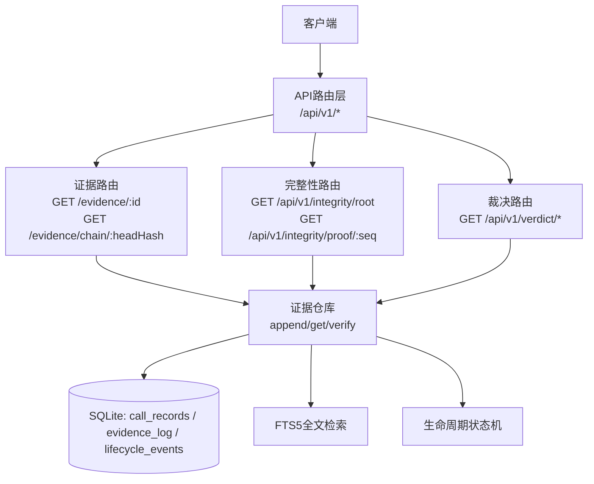
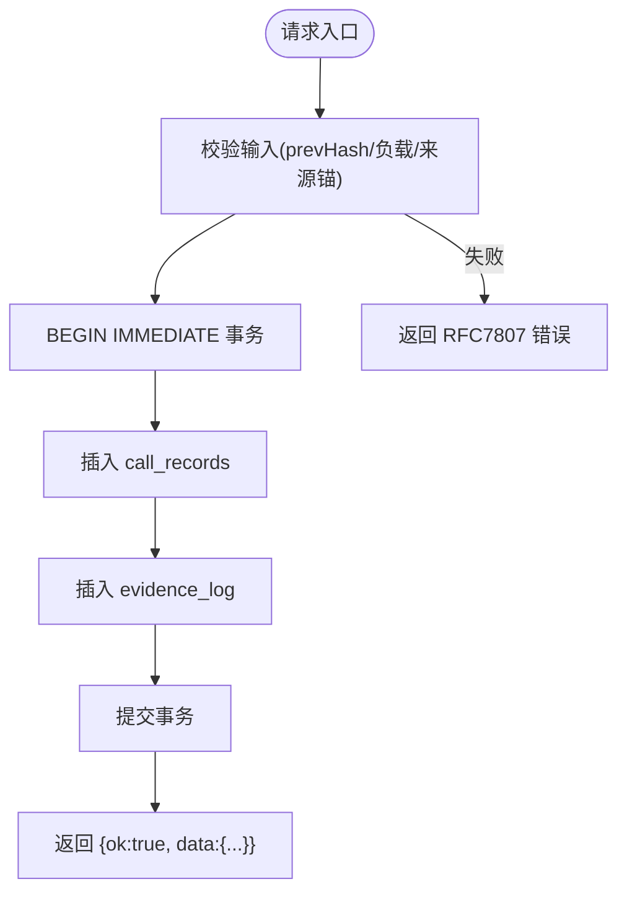
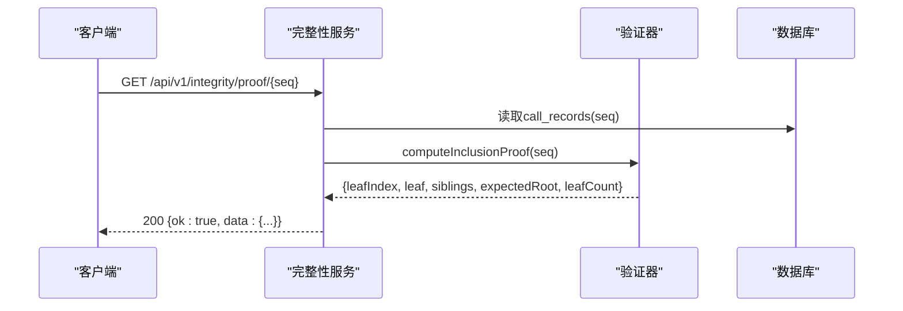
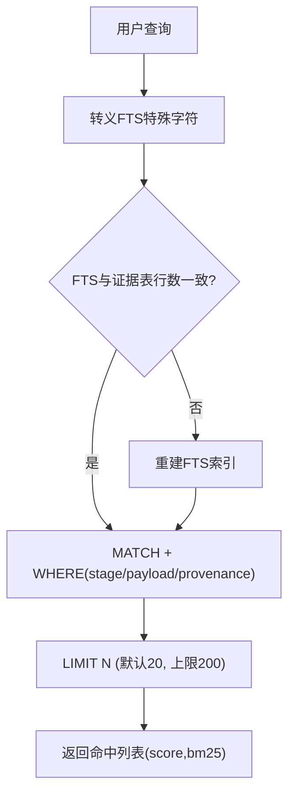
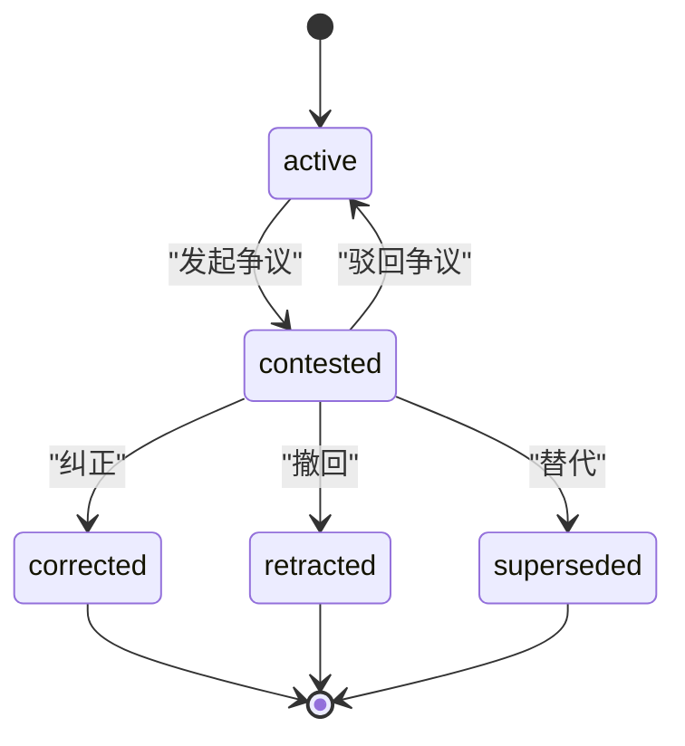
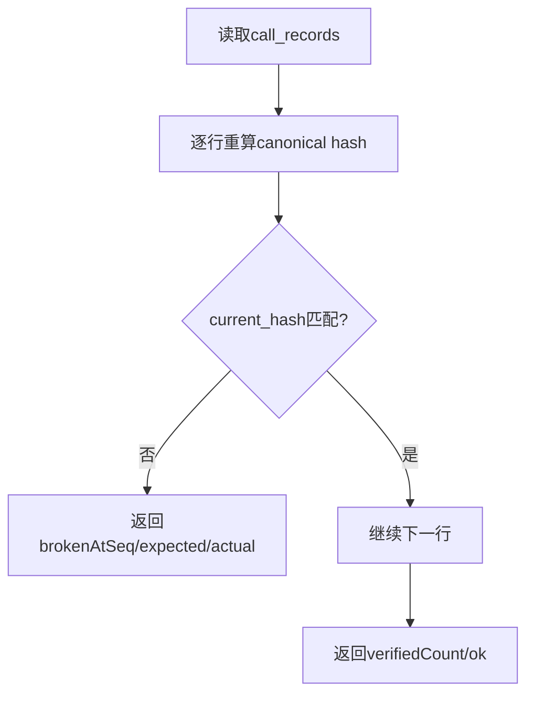
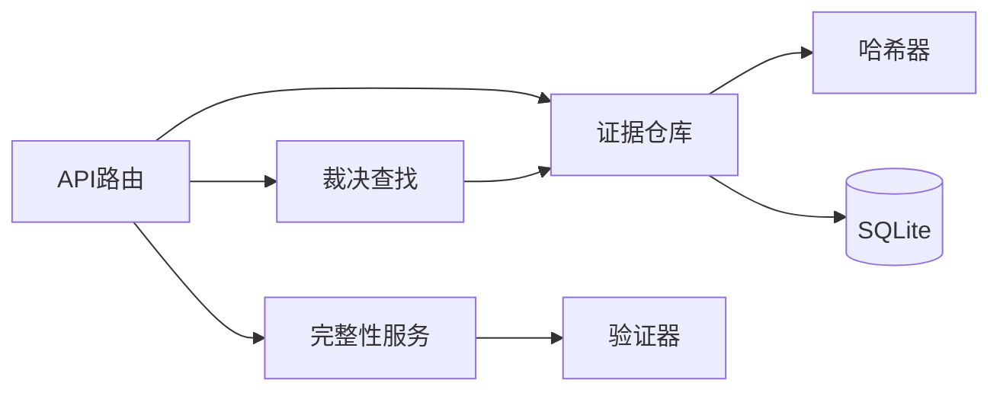

# 证据管理API

<cite>
**本文引用的文件**
- [openapi.json](file://schema/openapi.json)
- [evidence.ts](file://src/api/routes/evidence.ts)
- [integrity.ts](file://src/api/routes/integrity.ts)
- [verdict.ts](file://src/api/routes/verdict.ts)
- [repository.ts](file://src/evidence_log/repository.ts)
- [search.ts](file://src/evidence_log/search.ts)
- [verifier.ts](file://src/evidence_log/verifier.ts)
- [lifecycle.ts](file://src/evidence_log/lifecycle.ts)
- [index.ts](file://src/evidence_log/index.ts)
</cite>

## 目录
1. [简介](#简介)
2. [项目结构](#项目结构)
3. [核心组件](#核心组件)
4. [架构总览](#架构总览)
5. [详细组件分析](#详细组件分析)
6. [依赖关系分析](#依赖关系分析)
7. [性能考虑](#性能考虑)
8. [故障排查指南](#故障排查指南)
9. [结论](#结论)
10. [附录](#附录)

## 简介
本文件为“证据管理系统”的REST API文档，聚焦证据记录的CRUD、证据链追加与不可变日志写入、Merkle树完整性验证、证据搜索与过滤、导出能力、元数据管理与版本控制（生命周期）、以及大规模数据的存储优化与查询调优建议。系统采用OpenAPI 3.0规范对外暴露接口，统一信封响应格式与RFC 7807错误体，保障跨语言一致性与可审计性。

## 项目结构
- API层：Fastify路由定义证据、完整性、裁决等端点；统一错误处理与认证中间件。
- 证据日志层：append-only哈希链（call_records）+ 证据表（evidence_log），提供追加、读取、校验、全文检索。
- 完整性层：Merkle根计算与包含证明，支持离线验证整链完整性。
- 生命周期层：针对证据/声明/裁决等的撤回、纠正、替代等状态迁移，事件级哈希链保证不可篡改。



图表来源
- [evidence.ts:74-164](file://src/api/routes/evidence.ts#L74-L164)
- [integrity.ts:1-200](file://src/api/routes/integrity.ts#L1-L200)
- [repository.ts:94-258](file://src/evidence_log/repository.ts#L94-L258)
- [search.ts:43-180](file://src/evidence_log/search.ts#L43-L180)
- [lifecycle.ts:188-329](file://src/evidence_log/lifecycle.ts#L188-L329)

章节来源
- [openapi.json:1-800](file://schema/openapi.json#L1-L800)
- [evidence.ts:1-165](file://src/api/routes/evidence.ts#L1-L165)

## 核心组件
- 证据追加与链式哈希：通过事务化追加调用记录（call_records），并基于前序哈希生成当前哈希，形成不可变链。
- 证据条目持久化：将证据载荷以规范化JSON落库，可选内容寻址哈希绑定，确保可验证性。
- 完整性验证：提供整链Merkle根与单条证据的包含证明，支持浏览器端独立验证。
- 搜索与过滤：基于FTS5全文检索，支持按阶段、类型、来源等维度过滤。
- 生命周期管理：对证据/声明/裁决等进行状态迁移，事件级哈希链防篡改。

章节来源
- [repository.ts:94-258](file://src/evidence_log/repository.ts#L94-L258)
- [verifier.ts:17-123](file://src/evidence_log/verifier.ts#L17-L123)
- [search.ts:106-180](file://src/evidence_log/search.ts#L106-L180)
- [lifecycle.ts:188-329](file://src/evidence_log/lifecycle.ts#L188-L329)

## 架构总览
系统以“不可变证据链 + Merkle树”为核心，所有写操作均进入事务，保证并发安全与一致性；读操作提供多粒度查询与导出；完整性端点暴露信任根与包含证明，便于外部审计。

```mermaid
sequenceDiagram
participant C as "客户端"
participant R as "证据路由"
participant W as "仓库(追加/读取)"
participant V as "验证器"
participant I as "完整性服务"
participant D as "数据库"
C->>R : POST /api/v1/evidence/append
R->>W : appendRecord()
W->>D : BEGIN IMMEDIATE; INSERT call_records
W-->>R : {seq, currentHash}
R->>W : appendEvidenceLog()
W->>D : INSERT evidence_log
R-->>C : 200 {ok : true, data : {...}}
C->>I : GET /api/v1/integrity/root
I->>W : getChainHead()
W->>D : SELECT seq,current_hash ORDER BY seq DESC LIMIT 1
I->>V : verifyChainHead()
V->>D : 遍历call_records重算哈希链
I-->>C : 200 {ok : true, data : {merkleRoot,...}}
```

图表来源
- [evidence.ts:74-164](file://src/api/routes/evidence.ts#L74-L164)
- [repository.ts:94-258](file://src/evidence_log/repository.ts#L94-L258)
- [verifier.ts:17-65](file://src/evidence_log/verifier.ts#L17-L65)
- [openapi.json:323-575](file://schema/openapi.json#L323-L575)

## 详细组件分析

### 证据记录CRUD与链式追加
- 创建（追加）证据链记录
  - 端点：POST /api/v1/evidence/append
  - 行为：在IMMEDIATE事务中追加一条call_record，校验prev_hash等于链头或创世哈希，计算current_hash并落库；随后追加evidence_log条目，支持derivable模式的内容寻址哈希绑定。
  - 返回：统一信封{ ok:true, data:{...} }，含seq、currentHash、prevHash等。
- 查询证据记录
  - 端点：GET /api/v1/evidence/{id}
  - 行为：按evidenceId获取证据条目，并附带关联的裁决节点（如有）。
  - 返回：证据DTO（含payload、sourceAnchor、createdAt、verdictNode）。
- 更新/删除
  - 说明：证据日志为append-only设计，不支持直接UPDATE/DELETE；任何变更通过新增事件表达（见生命周期）。
- 证据链查询
  - 端点：GET /api/v1/evidence/chain/{headHash}
  - 行为：根据链头哈希获取对应call_record及子图片段。



图表来源
- [repository.ts:94-258](file://src/evidence_log/repository.ts#L94-L258)
- [evidence.ts:74-164](file://src/api/routes/evidence.ts#L74-L164)

章节来源
- [repository.ts:94-258](file://src/evidence_log/repository.ts#L94-L258)
- [evidence.ts:74-164](file://src/api/routes/evidence.ts#L74-L164)
- [openapi.json:194-231](file://schema/openapi.json#L194-L231)

### 不可变日志写入机制与Merkle树验证
- 不可变日志
  - 每条call_record包含prev_hash/current_hash，形成链式哈希；append使用IMMEDIATE事务防止TOCTOU竞争。
  - evidence_log支持derivable=1时存储evidence_payload_hash，用于内容寻址校验。
- Merkle根与包含证明
  - 端点：GET /api/v1/integrity/root
  - 端点：GET /api/v1/integrity/proof/{seq}
  - 行为：从call_records构建Merkle树，返回根与指定seq的包含证明（叶哈希、兄弟路径、期望根、叶数）。
  - 验证：客户端可用Web Crypto独立重算根并与期望根比对，实现零信任验证。



图表来源
- [openapi.json:576-800](file://schema/openapi.json#L576-L800)
- [verifier.ts:17-65](file://src/evidence_log/verifier.ts#L17-L65)

章节来源
- [openapi.json:323-800](file://schema/openapi.json#L323-L800)
- [verifier.ts:17-123](file://src/evidence_log/verifier.ts#L17-L123)

### 证据搜索与过滤
- 能力
  - FTS5全文检索，支持短语匹配与BM25相关性排序。
  - 过滤维度：stage_id、payload_kind、provenance_class。
  - 懒同步：首次搜索前比较证据表与FTS索引行数，不一致则重建索引。
- 限制
  - limit默认20，最大200，防止全表扫描。
  - 空查询会抛错，避免FTS5异常。



图表来源
- [search.ts:43-180](file://src/evidence_log/search.ts#L43-L180)

章节来源
- [search.ts:106-180](file://src/evidence_log/search.ts#L106-L180)

### 证据导出（批量）
- 说明
  - 系统提供CLI导出能力（如far export far-proof），可将证据链打包为可离线验证的包（含verify脚本、完整性JSON、归档）。
  - 服务端侧可通过内部接口或CLI对接导出流程；对外REST未直接暴露导出端点，但完整性根与包含证明可用于验证导出产物。
- 建议
  - 对外可提供导出任务端点（异步），返回任务ID，再轮询下载结果；支持JSON/CSV/PDF等多格式输出。

章节来源
- [openapi.json:323-800](file://schema/openapi.json#L323-L800)
- [verifier.ts:196-279](file://src/evidence_log/verifier.ts#L196-L279)

### 证据元数据管理（标签、分类、权限）
- 现状
  - 证据条目包含payload_kind、provenance_class、source_anchor等元数据；生命周期表维护目标对象的状态迁移历史。
  - 未直接暴露“标签/权限”管理的REST端点；可在上层应用扩展元数据表并通过API封装。
- 建议
  - 新增元数据表（tags、categories、permissions），通过事务与证据条目关联；提供CRUD端点并在审计链中记录变更事件。

章节来源
- [repository.ts:193-258](file://src/evidence_log/repository.ts#L193-L258)
- [lifecycle.ts:188-329](file://src/evidence_log/lifecycle.ts#L188-L329)

### 版本控制与历史追溯（生命周期）
- 能力
  - 支持active → contested → corrected/retracted/superseded等状态迁移，终态不可逆。
  - 每次迁移产生事件，事件级哈希链接到前一事件，支持verifyLifecycleChain校验。
- 用途
  - 对证据/声明/裁决进行撤回、纠正、替代，保留完整历史，满足审计与合规要求。



图表来源
- [lifecycle.ts:41-47](file://src/evidence_log/lifecycle.ts#L41-L47)
- [lifecycle.ts:188-329](file://src/evidence_log/lifecycle.ts#L188-L329)

章节来源
- [lifecycle.ts:188-329](file://src/evidence_log/lifecycle.ts#L188-L329)

### 数据完整性验证与防篡改保证
- 链式哈希验证：verifyChainHead逐条重算call_records哈希链，定位断链位置。
- 载荷内容寻址：verifyEvidencePayloadHashes与verifyCallRecordPayloadHashes分别校验evidence与call payload的哈希一致性。
- 导出锚比对：verifyCallRecordExportAnchor将DB与既有导出锚逐seq比对，检测一致伪造与锚漂移。



图表来源
- [verifier.ts:17-65](file://src/evidence_log/verifier.ts#L17-L65)
- [verifier.ts:83-123](file://src/evidence_log/verifier.ts#L83-L123)
- [verifier.ts:145-187](file://src/evidence_log/verifier.ts#L145-L187)
- [verifier.ts:212-279](file://src/evidence_log/verifier.ts#L212-L279)

章节来源
- [verifier.ts:17-279](file://src/evidence_log/verifier.ts#L17-L279)

## 依赖关系分析
- API路由依赖证据仓库、完整性服务、裁决查找模块。
- 证据仓库依赖哈希器、枚举、类型定义，以及与SQLite交互的事务逻辑。
- 完整性服务依赖仓库与验证器，提供Merkle根与包含证明。
- 生命周期模块独立于证据日志，但可与证据条目关联（targetKind=evidence）。



图表来源
- [evidence.ts:74-164](file://src/api/routes/evidence.ts#L74-L164)
- [repository.ts:94-258](file://src/evidence_log/repository.ts#L94-L258)
- [verifier.ts:17-279](file://src/evidence_log/verifier.ts#L17-L279)

章节来源
- [evidence.ts:74-164](file://src/api/routes/evidence.ts#L74-L164)
- [repository.ts:94-258](file://src/evidence_log/repository.ts#L94-L258)
- [verifier.ts:17-279](file://src/evidence_log/verifier.ts#L17-L279)

## 性能考虑
- 追加写入
  - 使用IMMEDIATE事务减少并发冲突，避免TOCTOU分叉。
  - 大负载建议拆分批次提交，降低单次事务大小。
- 全文检索
  - FTS5索引懒重建，仅在首次搜索且行数不一致时触发；大数据量下评估增量策略（NOT IN物化或游标跟踪）。
  - 合理设置limit（默认20，上限200），避免深度分页。
- 完整性计算
  - Merkle根计算复杂度O(n)，n为call_records数量；可缓存根并按批增量更新。
  - 包含证明查询需读取兄弟节点，注意IO放大，建议按页拉取。
- 存储优化
  - 对频繁查询字段建立索引（如stage_id、payload_kind、created_at）。
  - 定期VACUUM与统计信息更新，保持查询计划稳定。
- 导出性能
  - 导出任务异步化，后台流式写出，避免阻塞在线服务。

[本节为通用指导，不直接分析具体文件]

## 故障排查指南
- 常见错误
  - prev_hash不匹配：检查链头是否正确，确认追加顺序与并发控制。
  - 载荷哈希失配：检查evidence_payload是否被篡改，或JSON规范化不一致。
  - FTS索引不同步：触发reindexEvidenceFts重建索引。
  - 生命周期非法迁移：检查状态机允许表与当前状态。
- 诊断工具
  - 使用verifyChainHead、verifyEvidencePayloadHashes、verifyCallRecordPayloadHashes定位问题。
  - 使用verifyCallRecordExportAnchor比对导出锚与DB一致性。

章节来源
- [verifier.ts:17-279](file://src/evidence_log/verifier.ts#L17-L279)
- [search.ts:106-180](file://src/evidence_log/search.ts#L106-L180)
- [lifecycle.ts:188-329](file://src/evidence_log/lifecycle.ts#L188-L329)

## 结论
本系统以不可变证据链与Merkle树为核心，提供完整的证据CRUD、完整性验证、搜索过滤、生命周期管理与导出能力。通过事务化追加、内容寻址哈希与事件级哈希链，确保数据不可篡改与可审计。面向大规模场景，建议在索引、缓存、导出与查询策略上持续优化，以满足高吞吐与低延迟需求。

## 附录
- OpenAPI契约参考：健康检查、就绪检查、指标、证据与完整性端点定义。
- 统一信封与错误体：成功响应{ ok:true, data:T }，错误遵循RFC 7807。

章节来源
- [openapi.json:1-800](file://schema/openapi.json#L1-L800)