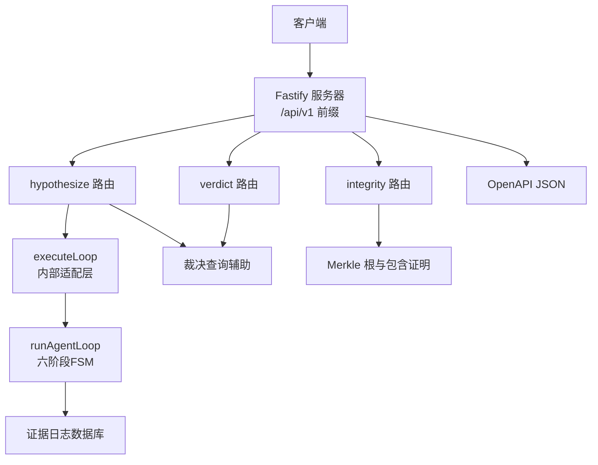
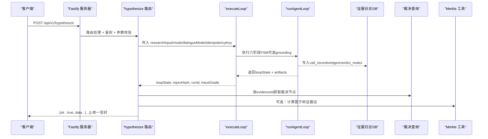
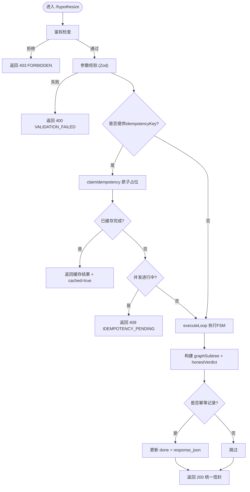
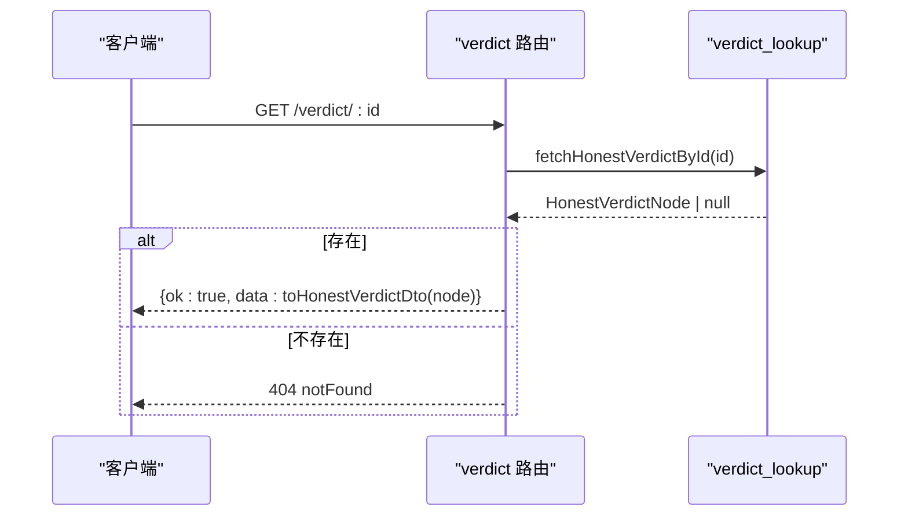
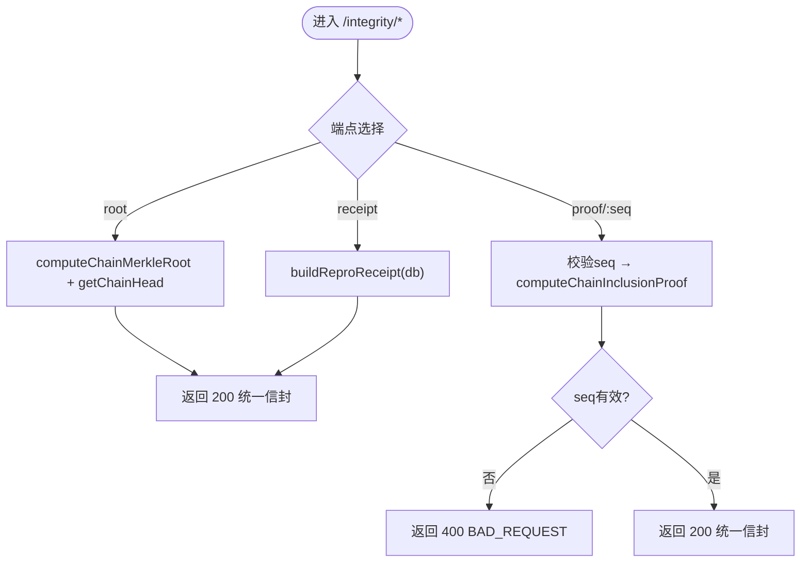
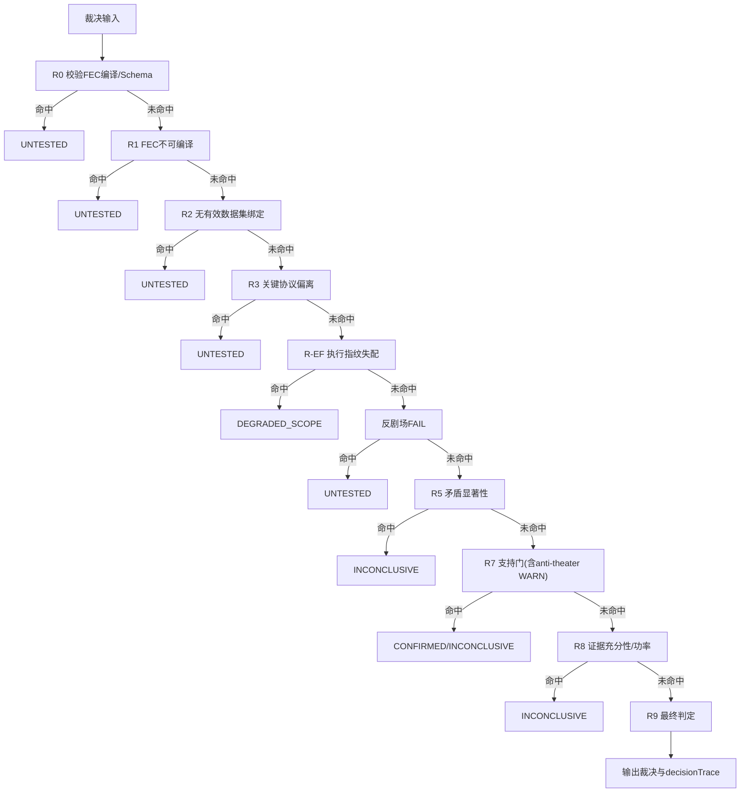
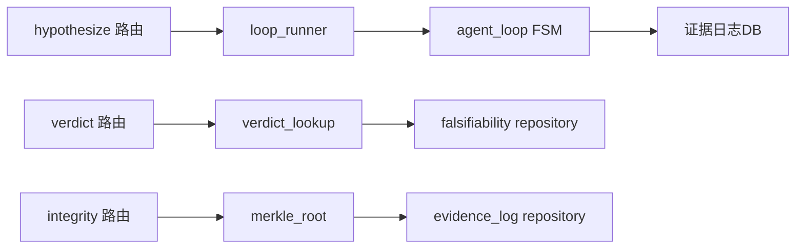

# 验证服务API

<cite>
**本文引用的文件**
- [src/api/server.ts](file://src/api/server.ts)
- [src/api/routes/hypothesize.ts](file://src/api/routes/hypothesize.ts)
- [src/api/routes/verdict.ts](file://src/api/routes/verdict.ts)
- [src/api/routes/integrity.ts](file://src/api/routes/integrity.ts)
- [src/api/routes/integrity_schemas.ts](file://src/api/routes/integrity_schemas.ts)
- [src/api/internal/loop_runner.ts](file://src/api/internal/loop_runner.ts)
- [src/api/internal/verdict_lookup.ts](file://src/api/internal/verdict_lookup.ts)
- [src/api/types.ts](file://src/api/types.ts)
- [src/evidence_log/merkle_root.ts](file://src/evidence_log/merkle_root.ts)
- [schema/openapi.json](file://schema/openapi.json)
</cite>

## 目录
1. [简介](#简介)
2. [项目结构](#项目结构)
3. [核心组件](#核心组件)
4. [架构总览](#架构总览)
5. [详细组件分析](#详细组件分析)
6. [依赖关系分析](#依赖关系分析)
7. [性能与批量处理建议](#性能与批量处理建议)
8. [故障排查指南](#故障排查指南)
9. [结论](#结论)
10. [附录：请求响应示例与JSON Schema](#附录请求响应示例与json-schema)

## 简介
本文件为科学声明验证服务的REST API文档，聚焦以下能力：
- 假设生成端点 POST /api/v1/hypothesize：输入校验、LLM网关调用、异步事件流（可选）、幂等键保护。
- 裁决查询端点 GET /api/v1/verdict 及其变体：按ID或假设ID查询裁决节点，支持分页与过滤；说明R0-R9裁决规则执行流程与结果解析。
- 完整性检查端点 GET /api/v1/integrity/*：整链Merkle根、单条证据包含证明、可移植复现收据（Repro Receipt）。
- 统一信封与错误规范：V1成功响应统一包装 { ok: true, data: T }；错误遵循RFC 7807 Problem Details风格。
- 异步任务状态跟踪与轮询策略：通过幂等键与可选SSE事件流实现。
- 错误处理场景：LLM超时、数据库连接失败、参数非法、资源不存在等。
- 批量处理与性能优化建议：限流、分页、快速模式、缓存与幂等。

## 项目结构
服务基于Fastify构建，统一在 /api/v1 前缀下注册路由，并通过preSerialization钩子将成功响应包装为统一信封。关键文件职责：
- server.ts：构建并启动服务器，注册插件、鉴权中间件、路由与OpenAPI文档。
- routes/hypothesize.ts：假设生成入口，含输入校验、幂等键、LLM网关调用、图子树与裁决组装。
- routes/verdict.ts：裁决查询接口，含按ID、按假设ID、列表分页与过滤。
- routes/integrity.ts：证据链完整性根、包含证明、复现收据。
- internal/loop_runner.ts：封装runAgentLoop，注入离线回放或生产环境锚，输出reproHash与traceGrade。
- internal/verdict_lookup.ts：裁决节点查询辅助（按evidenceId、verdictId、列表）。
- types.ts：共享类型定义（GraphSubtree、HypothesizeResponse、错误响应等）。
- evidence_log/merkle_root.ts：Merkle树计算与包含证明。
- schema/openapi.json：OpenAPI 3.0描述（由服务动态生成，此处保留契约快照）。

图表来源
- [src/api/server.ts:112-245](file://src/api/server.ts#L112-L245)
- [src/api/routes/hypothesize.ts:91-225](file://src/api/routes/hypothesize.ts#L91-L225)
- [src/api/routes/verdict.ts:89-161](file://src/api/routes/verdict.ts#L89-L161)
- [src/api/routes/integrity.ts:99-166](file://src/api/routes/integrity.ts#L99-L166)
- [src/api/internal/loop_runner.ts:214-313](file://src/api/internal/loop_runner.ts#L214-L313)
- [src/evidence_log/merkle_root.ts:1-200](file://src/evidence_log/merkle_root.ts#L1-L200)

章节来源
- [src/api/server.ts:112-245](file://src/api/server.ts#L112-L245)
- [schema/openapi.json:1-200](file://schema/openapi.json#L1-L200)

## 核心组件
- 假设生成器（hypothesize）：负责接收研究问题、运行六阶段FSM、提取证据子图与裁决节点、返回reproHash与traceGrade，支持幂等键与可选SSE事件流。
- 裁决查询（verdict）：提供按ID、按假设ID、列表分页与过滤的裁决节点查询，DTO映射到camelCase字段。
- 完整性检查（integrity）：提供整链Merkle根、单条证据包含证明、可移植复现收据（含链头、git commit、时间戳）。
- 循环执行器（loop_runner）：封装runAgentLoop，注入离线回放或生产环境锚，确保reproHash来自证据链头current_hash。
- 裁决查找（verdict_lookup）：从verdict_nodes表查询活跃裁决，复用falsifiability模块解析。
- Merkle工具（merkle_root）：跨语言一致的Merkle根计算与包含证明推导。

章节来源
- [src/api/routes/hypothesize.ts:45-225](file://src/api/routes/hypothesize.ts#L45-L225)
- [src/api/routes/verdict.ts:28-161](file://src/api/routes/verdict.ts#L28-L161)
- [src/api/routes/integrity.ts:41-166](file://src/api/routes/integrity.ts#L41-L166)
- [src/api/internal/loop_runner.ts:35-313](file://src/api/internal/loop_runner.ts#L35-L313)
- [src/api/internal/verdict_lookup.ts:20-83](file://src/api/internal/verdict_lookup.ts#L20-L83)
- [src/evidence_log/merkle_root.ts:1-200](file://src/evidence_log/merkle_root.ts#L1-L200)

## 架构总览
服务采用分层架构：HTTP路由层 → 业务适配层 → 领域逻辑（FSM、裁决内核、证据链）→ 数据持久化（SQLite证据日志）。统一信封在preSerialization阶段对成功响应进行包装，错误响应保持RFC 7807风格。

图表来源
- [src/api/server.ts:175-245](file://src/api/server.ts#L175-L245)
- [src/api/routes/hypothesize.ts:91-225](file://src/api/routes/hypothesize.ts#L91-L225)
- [src/api/internal/loop_runner.ts:214-313](file://src/api/internal/loop_runner.ts#L214-L313)
- [src/api/internal/verdict_lookup.ts:20-83](file://src/api/internal/verdict_lookup.ts#L20-L83)
- [src/evidence_log/merkle_root.ts:1-200](file://src/evidence_log/merkle_root.ts#L1-L200)

## 详细组件分析

### 假设生成端点 POST /api/v1/hypothesize
- 功能概述
  - 接收研究问题与可选模式（full/quick）、对话模式（disabled/enabled）、幂等键。
  - 若未配置LLM网关则fail-closed（503），避免静默回放冒充。
  - 幂等键机制：并发同key请求防重入，已完成请求直接返回缓存结果。
  - 执行六阶段FSM，产出loopState、reproHash、traceGrade；提取证据子图与裁决节点。
  - 响应包含datasetSource与providerProfile，透明区分replay与real。
- 输入参数
  - researchInput：字符串，长度限制与必填校验。
  - mode：枚举 full/quick，可选。
  - dialogueMode：枚举 disabled/enabled，可选。
  - idempotencyKey：安全字符集+长度限制，可选。
- 处理流程
  - 鉴权：受保护模式下需researcher/admin角色。
  - 参数校验：Zod schema校验失败返回400。
  - 幂等键占位：INSERT OR IGNORE标记pending；已完成的直接返回缓存；并发进行中返回409。
  - 执行循环：executeLoop → runAgentLoop → 落库证据链。
  - 组装响应：graphSubtree、honestVerdict、reproHash、traceGrade、datasetSource、providerProfile。
  - 幂等记录更新：done状态与response_json规范化存储。
- 错误处理
  - 400 参数校验失败。
  - 403 权限不足。
  - 409 幂等键冲突（进行中）。
  - 503 LLM网关未配置（fail-closed）。
  - 其他异常：删除pending占位，抛出错误。

图表来源
- [src/api/routes/hypothesize.ts:45-225](file://src/api/routes/hypothesize.ts#L45-L225)
- [src/api/internal/loop_runner.ts:214-313](file://src/api/internal/loop_runner.ts#L214-L313)

章节来源
- [src/api/routes/hypothesize.ts:45-225](file://src/api/routes/hypothesize.ts#L45-L225)
- [src/api/internal/loop_runner.ts:214-313](file://src/api/internal/loop_runner.ts#L214-L313)
- [src/api/types.ts:65-91](file://src/api/types.ts#L65-L91)

### 裁决查询端点 GET /api/v1/verdict
- 功能概述
  - 按verdictId查询单个裁决节点。
  - 按假设evidenceId查询关联裁决节点（最新活跃）。
  - 列表查询支持limit/offset分页与verdict值过滤。
- 输入参数
  - 路径参数：id、hypoId（安全字符集+长度限制）。
  - 查询参数：limit（1-1000）、offset（>=0）、verdict（枚举过滤）。
- 处理流程
  - 参数校验：Fastify schema校验路径参数。
  - 查询裁决：fetchHonestVerdictById / fetchHonestVerdictByEvidenceId / listHonestVerdicts。
  - DTO映射：toHonestVerdictDto转换为camelCase字段。
  - 返回：200 统一信封。
- 错误处理
  - 404 资源不存在。
  - 400 非法limit/offset或verdict值不在允许集合。

图表来源
- [src/api/routes/verdict.ts:89-161](file://src/api/routes/verdict.ts#L89-L161)
- [src/api/internal/verdict_lookup.ts:20-83](file://src/api/internal/verdict_lookup.ts#L20-L83)

章节来源
- [src/api/routes/verdict.ts:89-161](file://src/api/routes/verdict.ts#L89-L161)
- [src/api/internal/verdict_lookup.ts:20-83](file://src/api/internal/verdict_lookup.ts#L20-L83)

### 完整性检查端点 GET /api/v1/integrity/*
- 功能概述
  - /integrity/root：计算整链Merkle根与链头定位。
  - /integrity/proof/:seq：为指定seq生成Merkle包含证明（audit path）。
  - /integrity/receipt：生成可移植复现收据（merkleRoot、leafCount、chainHeadSeq/Hash、gitCommitSha、generatedAt）。
- 输入参数
  - seq：正整数且为安全整数（canonical positive safe integer）。
- 处理流程
  - root：computeChainMerkleRoot + getChainHead，空链与非空链分别处理。
  - proof：computeChainInclusionProof(seq)，捕获MERKLE_SEQ_NOT_FOUND转为404。
  - receipt：buildReproReceipt(db)，now注入保证测试确定性。
- 错误处理
  - 400 seq格式非法。
  - 404 seq不存在。
  - 500 完整性计算失败。

图表来源
- [src/api/routes/integrity.ts:99-166](file://src/api/routes/integrity.ts#L99-L166)
- [src/api/routes/integrity_schemas.ts:94-116](file://src/api/routes/integrity_schemas.ts#L94-L116)
- [src/evidence_log/merkle_root.ts:1-200](file://src/evidence_log/merkle_root.ts#L1-L200)

章节来源
- [src/api/routes/integrity.ts:99-166](file://src/api/routes/integrity.ts#L99-L166)
- [src/api/routes/integrity_schemas.ts:94-116](file://src/api/routes/integrity_schemas.ts#L94-L116)
- [src/evidence_log/merkle_root.ts:1-200](file://src/evidence_log/merkle_root.ts#L1-L200)

### 裁决规则R0-R9执行流程与结果解析
- 规则优先级（固定）：DEGRADED_SCOPE > REFUTED > INCONCLUSIVE > CONFIRMED > UNTESTED。
- 首条决定性规则胜出，tie-break排序依据(evidenceId, sourceHash)、testId。
- 浮点容差1e-7用于裁决关键数值比较。
- decisionTrace：记录firedRuleId、R7门评估、关键数值快照、totalRulesInTree与cannotProveStatement。
- 结果字段：verdict、reasonCodes、ruleTrace、decisiveRuleId、scopeReport、statisticalReport、evidenceSufficiency、untestedReason、integrityFlags、boundedSupport、decisionTrace。

图表来源
- [src/falsifiability/verdict_kernel_v2.ts:290-864](file://src/falsifiability/verdict_kernel_v2.ts#L290-L864)

章节来源
- [src/falsifiability/verdict_kernel_v2.ts:290-864](file://src/falsifiability/verdict_kernel_v2.ts#L290-L864)

## 依赖关系分析
- 路由层依赖：
  - hypothesize → loop_runner → agent_loop FSM → evidence_log DB。
  - verdict → verdict_lookup → falsifiability repository。
  - integrity → merkle_root → evidence_log repository。
- 外部依赖：
  - Fastify插件：helmet、cors、rate-limit、jwt、swagger。
  - 数据库：better-sqlite3。
  - LLM网关：运行时解析（gateway/profile），未配置时fail-closed。
- 耦合与内聚：
  - 路由层仅做参数校验、编排与DTO映射，业务逻辑下沉至internal与domain层。
  - 裁决规则与证据链计算独立于路由，便于测试与复用。

图表来源
- [src/api/routes/hypothesize.ts:91-225](file://src/api/routes/hypothesize.ts#L91-L225)
- [src/api/internal/loop_runner.ts:214-313](file://src/api/internal/loop_runner.ts#L214-L313)
- [src/api/routes/verdict.ts:89-161](file://src/api/routes/verdict.ts#L89-L161)
- [src/api/routes/integrity.ts:99-166](file://src/api/routes/integrity.ts#L99-L166)

章节来源
- [src/api/server.ts:112-245](file://src/api/server.ts#L112-L245)
- [src/api/routes/hypothesize.ts:91-225](file://src/api/routes/hypothesize.ts#L91-L225)
- [src/api/routes/verdict.ts:89-161](file://src/api/routes/verdict.ts#L89-L161)
- [src/api/routes/integrity.ts:99-166](file://src/api/routes/integrity.ts#L99-L166)

## 性能与批量处理建议
- 限流：默认100 req/min，可通过rateLimitMax调整。
- 分页：verdict列表支持limit/offset，建议前端按需分页。
- 快速模式：hypothesize mode=quick，单轮即终止，适合探索性查询。
- 幂等键：重复提交使用相同idempotencyKey，避免重复执行与写库。
- 缓存：服务端已缓存已完成幂等请求结果，客户端可结合ETag/Last-Modified策略减少轮询。
- 事件流：可选SSE事件流（eventBus注入），实时观察阶段事件，降低轮询压力。
- 批处理：建议客户端分批提交多个假设，利用快速模式与幂等键控制并发与重试。

[本节为通用指导，不直接分析具体文件]

## 故障排查指南
- LLM超时或未配置
  - 现象：POST /hypothesize返回503，提示需要API key。
  - 处理：检查环境变量配置LLM网关；如需离线演示，使用显式offline_replay profile（测试/演示用途）。
- 数据库连接失败
  - 现象：/ready返回not_ready，checks.database=fail。
  - 处理：检查SQLite文件路径与权限；重启服务后重试。
- 参数非法
  - 现象：400 VALIDATION_FAILED或BAD_REQUEST。
  - 处理：核对请求体字段类型与范围（如limit/offset、verdict枚举、seq正整数）。
- 资源不存在
  - 现象：404 notFound（verdict或call_record seq）。
  - 处理：确认ID或seq是否正确；检查证据链是否已生成。
- 幂等键冲突
  - 现象：409 IDEMPOTENCY_PENDING。
  - 处理：等待当前请求完成或使用新idempotencyKey重试。

章节来源
- [src/api/routes/hypothesize.ts:116-189](file://src/api/routes/hypothesize.ts#L116-L189)
- [src/api/routes/verdict.ts:110-150](file://src/api/routes/verdict.ts#L110-L150)
- [src/api/routes/integrity.ts:131-159](file://src/api/routes/integrity.ts#L131-L159)
- [src/api/server.ts:137-146](file://src/api/server.ts#L137-L146)

## 结论
本服务提供完整的科学声明验证REST API，涵盖假设生成、裁决查询与证据链完整性检查。通过统一信封、严格参数校验、幂等键与可选事件流，保障可靠性与可观测性。裁决内核R0-R9提供确定性五值裁决与决策追踪，Merkle工具提供跨语言一致的完整性证明。建议在生产环境中启用限流、分页与事件流，结合幂等键与快速模式提升吞吐与用户体验。

[本节为总结，不直接分析具体文件]

## 附录：请求响应示例与JSON Schema
- 统一信封
  - 成功响应：{ ok: true, data: T }
  - 错误响应：RFC 7807 Problem Details风格（error_code、message、source_anchor、detail）
- 假设生成响应字段
  - loopState：六阶段FSM终态
  - graphSubtree：证据图子树（rootId、nodes、edges）
  - honestVerdict：裁决节点（可能为空）
  - reproHash：证据链头hash
  - traceGrade：轨迹质量等级
  - datasetSource：replay或real
  - providerProfile：运行时提供者profile
- 裁决查询响应字段
  - verdictId、evidenceId、parentNodeId、nodeKind、decision、falsificationSpec、thresholdSpec、metricValue、conflictingEvidenceCount、scopeSlipText、untestedReason、sourceAnchor、prevHash、currentHash、createdAt、updatedAt、decisionTrace
- 完整性检查响应字段
  - root：merkleRoot、leafCount、chainHeadSeq、chainHeadHash
  - proof：seq、leafIndex、leaf、siblings、expectedRoot、leafCount
  - receipt：schemaVersion、merkleRoot、leafCount、chainHeadSeq、chainHeadHash、gitCommitSha、generatedAt

章节来源
- [src/api/types.ts:65-107](file://src/api/types.ts#L65-L107)
- [src/api/routes/verdict.ts:32-81](file://src/api/routes/verdict.ts#L32-L81)
- [src/api/routes/integrity_schemas.ts:34-77](file://src/api/routes/integrity_schemas.ts#L34-L77)
- [schema/openapi.json:185-193](file://schema/openapi.json#L185-L193)