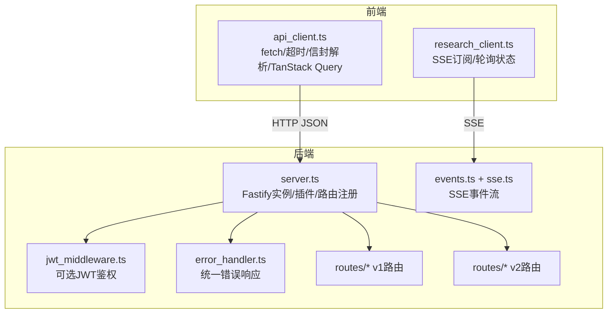
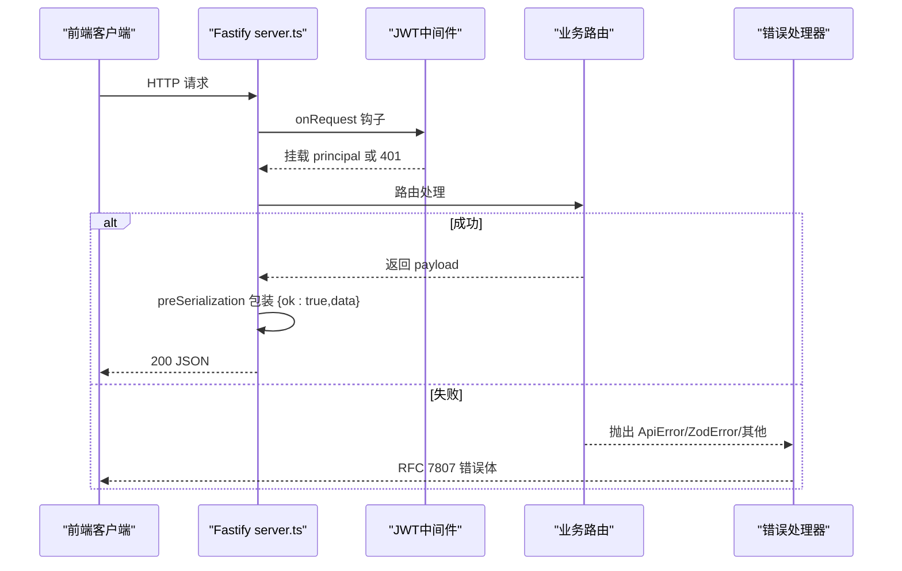
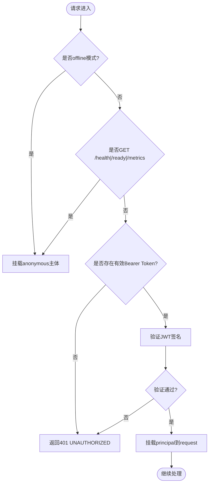
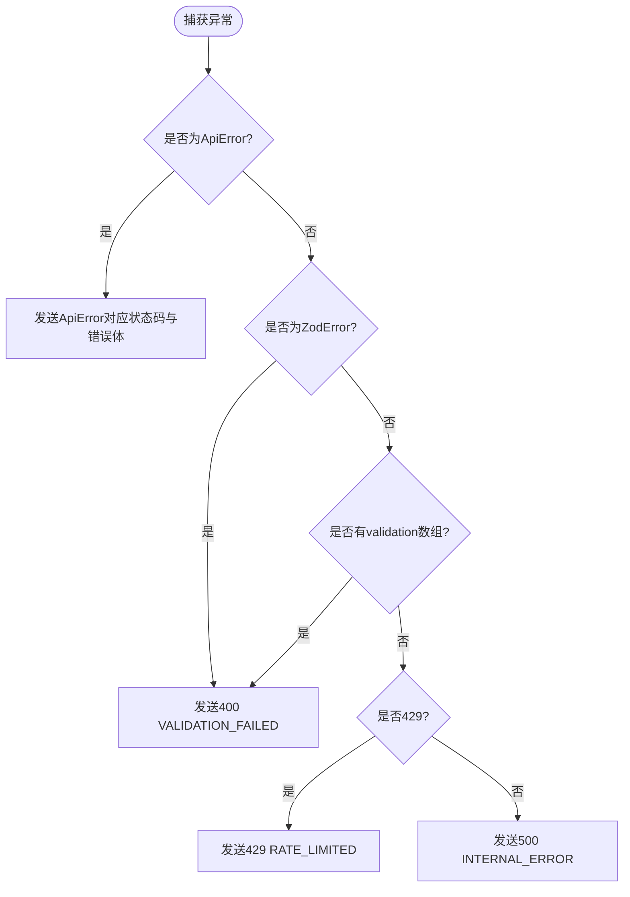
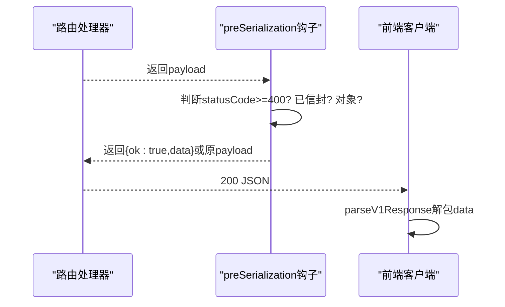
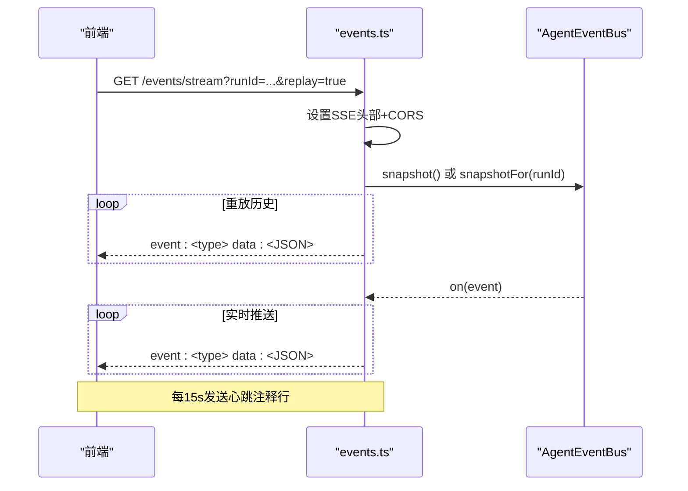
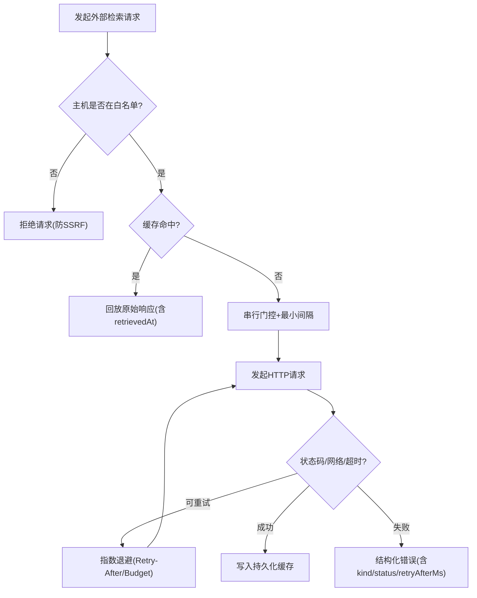
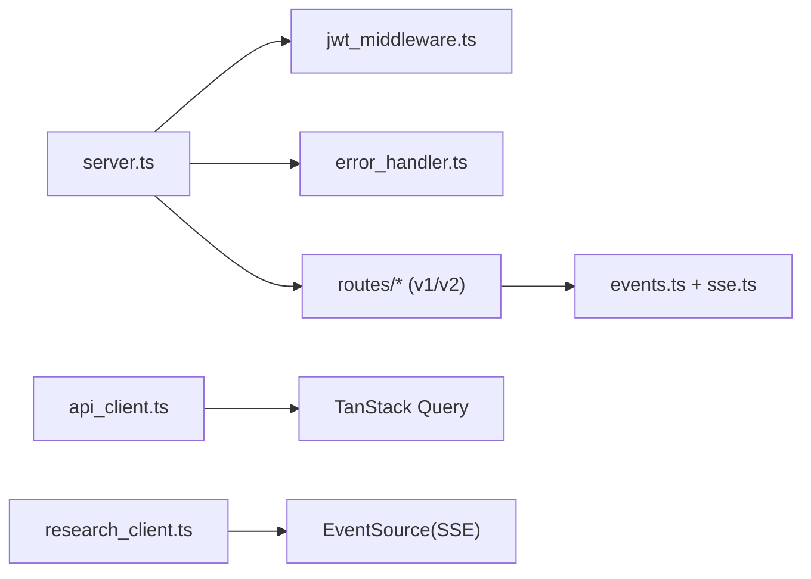

# API集成

<cite>
**本文引用的文件**
- [server.ts](file://src/api/server.ts)
- [types.ts](file://src/api/types.ts)
- [jwt_middleware.ts](file://src/api/auth/jwt_middleware.ts)
- [error_handler.ts](file://src/api/errors/error_handler.ts)
- [events.ts](file://src/api/routes/events.ts)
- [sse.ts](file://src/api/routes/sse.ts)
- [v2_receipts.ts](file://src/api/routes/v2_receipts.ts)
- [openapi.json](file://schema/openapi.json)
- [api_client.ts](file://frontend/src/lib/api_client.ts)
- [research_client.ts](file://frontend/src/lib/research_client.ts)
- [http.ts](file://src/retrieval/http.ts)
</cite>

## 目录
1. [简介](#简介)
2. [项目结构](#项目结构)
3. [核心组件](#核心组件)
4. [架构总览](#架构总览)
5. [详细组件分析](#详细组件分析)
6. [依赖关系分析](#依赖关系分析)
7. [性能与可观测性](#性能与可观测性)
8. [故障排查指南](#故障排查指南)
9. [结论](#结论)
10. [附录](#附录)

## 简介
本文件面向后端 REST API 与前端集成的完整说明，覆盖通信机制、数据交换格式、认证授权、错误重试、WebSocket/SSE 实时通信、缓存与离线策略、API 版本管理与向后兼容、以及性能优化与监控方案。文档基于仓库中的服务端 Fastify 应用、路由与中间件、OpenAPI 规范、以及前端 TanStack Query 客户端实现进行系统化梳理。

## 项目结构
后端采用 Fastify 构建 HTTP 服务，统一注册安全、跨域、限流、JWT 鉴权、Swagger/OpenAPI、错误处理与路由；V1 与 V2 路由分别挂载于 /api/v1 与 /api/v2。前端通过统一的 API 客户端封装 fetch、超时控制、响应信封解析、TanStack Query 钩子，并提供 SSE 事件订阅能力。

**图示来源**
- [server.ts:112-255](file://src/api/server.ts#L112-L255)
- [jwt_middleware.ts:55-110](file://src/api/auth/jwt_middleware.ts#L55-L110)
- [error_handler.ts:117-193](file://src/api/errors/error_handler.ts#L117-L193)
- [events.ts:71-139](file://src/api/routes/events.ts#L71-L139)
- [sse.ts:16-31](file://src/api/routes/sse.ts#L16-L31)
- [api_client.ts:225-245](file://frontend/src/lib/api_client.ts#L225-L245)
- [research_client.ts:448-459](file://frontend/src/lib/research_client.ts#L448-L459)

**章节来源**
- [server.ts:112-255](file://src/api/server.ts#L112-L255)
- [openapi.json:1-200](file://schema/openapi.json#L1-L200)

## 核心组件
- 服务器与路由：Fastify 实例创建、插件注册（helmet/cors/rate-limit/jwt/swagger）、错误处理器、健康检查与指标端点、/api/v1 与 /api/v2 路由挂载、SSE 事件流（可选）。
- 认证与授权：可选 JWT 鉴权中间件，支持 offline 模式（匿名）与受保护模式（fail-closed），对探针路径精确豁免。
- 错误处理：统一 RFC 7807 Problem Details 子集响应体，包含 error_code、message、source_anchor、detail。
- 数据契约：V1 成功响应统一信封 { ok: true, data: T }；V2 receipts 同样采用统一信封并配合 zod 运行时校验。
- 前端客户端：统一 URL 构造、超时中止、非 JSON 文本获取、V1/V2 信封解析、TanStack Query 钩子、SSE 订阅。

**章节来源**
- [server.ts:112-255](file://src/api/server.ts#L112-L255)
- [jwt_middleware.ts:55-110](file://src/api/auth/jwt_middleware.ts#L55-L110)
- [error_handler.ts:117-193](file://src/api/errors/error_handler.ts#L117-L193)
- [v2_receipts.ts:24-73](file://src/api/routes/v2_receipts.ts#L24-L73)
- [api_client.ts:184-245](file://frontend/src/lib/api_client.ts#L184-L245)
- [api_client.ts:281-368](file://frontend/src/lib/api_client.ts#L281-L368)

## 架构总览
后端以 Fastify 为入口，按顺序注册安全与可观测性插件，随后注册鉴权中间件与错误处理器，再挂载业务路由。V1 路由在 preSerialization 钩子中统一包装成功响应为信封；V2 receipts 路由直接返回信封并通过 zod 在前端边界校验。SSE 事件流通过 hijack 原始响应头并注入 CORS 头，确保跨域可用。

**图示来源**
- [server.ts:112-194](file://src/api/server.ts#L112-L194)
- [jwt_middleware.ts:55-110](file://src/api/auth/jwt_middleware.ts#L55-L110)
- [error_handler.ts:117-193](file://src/api/errors/error_handler.ts#L117-L193)

**章节来源**
- [server.ts:112-194](file://src/api/server.ts#L112-L194)

## 详细组件分析

### 认证与授权（JWT）
- 行为：
  - offline 模式（jwtSecret 为空）：所有请求挂载 anonymous 主体，不阻断。
  - 受保护模式：仅 GET /health、/ready、/metrics 精确豁免；其余请求必须携带有效 Bearer Token，否则返回 401。
  - 验证失败记录诊断日志但不泄露 token 细节。
- 类型扩展：request.principal 挂载 AuthPrincipal（userId、role）。

**图示来源**
- [jwt_middleware.ts:55-110](file://src/api/auth/jwt_middleware.ts#L55-L110)

**章节来源**
- [jwt_middleware.ts:55-110](file://src/api/auth/jwt_middleware.ts#L55-L110)
- [types.ts:131-136](file://src/api/types.ts#L131-L136)

### 统一错误处理（RFC 7807）
- 统一错误体字段：error_code、message、source_anchor（fileId/stageId/callRecordId）、detail（可选）。
- 分类处理：
  - ApiError：使用其 statusCode + errorCode + sourceAnchor。
  - ZodError：转 400 VALIDATION_FAILED，附带 issues。
  - Fastify/ajv 校验失败：转 400 VALIDATION_FAILED，附带 validation issues。
  - 429：RATE_LIMITED。
  - 其他：INTERNAL_ERROR。

**图示来源**
- [error_handler.ts:117-193](file://src/api/errors/error_handler.ts#L117-L193)

**章节来源**
- [error_handler.ts:117-193](file://src/api/errors/error_handler.ts#L117-L193)
- [types.ts:94-107](file://src/api/types.ts#L94-L107)

### 数据信封与版本管理
- V1 成功响应统一信封：{ ok: true, data: T }，由 preSerialization 钩子在序列化前包装，避免裸 handler 被二次包装或 schema 校验失败。
- V2 receipts 端点直接返回信封，并在前端通过 zod 做运行时校验，确保契约一致。
- OpenAPI 暴露 /documentation/json 与 /openapi.json 作为契约 SSOT 入口。

**图示来源**
- [server.ts:175-194](file://src/api/server.ts#L175-L194)
- [api_client.ts:344-368](file://frontend/src/lib/api_client.ts#L344-L368)

**章节来源**
- [server.ts:175-194](file://src/api/server.ts#L175-L194)
- [openapi.json:1-200](file://schema/openapi.json#L1-L200)

### 实时通信（SSE）
- 事件流端点：GET /api/v1/events/stream?runId=<id>&replay=true/false。
- 特性：
  - 心跳注释行保持连接存活（默认每 15 秒）。
  - replay=true 时先重放历史快照，再推送实时事件。
  - 通过 hijack 原始响应并注入 CORS 头，解决跨域开发场景下的 EventSource 阻塞问题。
- 前端订阅：EventSource 原生支持，提供 unsubscribe 清理资源；不可用时降级为轮询。

**图示来源**
- [events.ts:71-139](file://src/api/routes/events.ts#L71-L139)
- [sse.ts:16-31](file://src/api/routes/sse.ts#L16-L31)
- [research_client.ts:448-459](file://frontend/src/lib/research_client.ts#L448-L459)

**章节来源**
- [events.ts:71-139](file://src/api/routes/events.ts#L71-L139)
- [sse.ts:16-31](file://src/api/routes/sse.ts#L16-L31)
- [research_client.ts:448-459](file://frontend/src/lib/research_client.ts#L448-L459)

### 数据缓存与离线支持
- 外部检索缓存：retrieval/http.ts 维护持久化缓存（内容寻址），TTL 内命中则回放原始 retrievedAt，保证 corpus snapshot id 稳定。
- 速率预算与退避：跟踪 X-RateLimit-Remaining/-Reset，本地拒绝超预算请求；429/503/504/网络/超时等错误采用指数退避与最大重试次数。
- 前端离线策略：SSE 不可用时自动降级为轮询；查询结果由 TanStack Query 缓存与失效策略管理。

**图示来源**
- [http.ts:188-200](file://src/retrieval/http.ts#L188-L200)
- [http.ts:101-145](file://src/retrieval/http.ts#L101-L145)

**章节来源**
- [http.ts:101-145](file://src/retrieval/http.ts#L101-L145)
- [http.ts:188-200](file://src/retrieval/http.ts#L188-L200)

### 认证授权与安全传输
- 认证：可选 JWT 鉴权，支持 offline 模式与受保护模式；探针路径精确豁免。
- 安全头：启用 helmet（CSP 关闭），CORS 允许凭据；SSE 端点手动注入 CORS 头。
- 传输：生产环境建议通过反向代理启用 HTTPS；前端 fetch 默认 Content-Type: application/json。

**章节来源**
- [server.ts:132-146](file://src/api/server.ts#L132-L146)
- [jwt_middleware.ts:55-110](file://src/api/auth/jwt_middleware.ts#L55-L110)
- [sse.ts:16-31](file://src/api/routes/sse.ts#L16-L31)

### WebSocket 与事件订阅
- 当前实现采用 SSE（Server-Sent Events）而非 WebSocket；适用于只读事件流场景。
- 前端通过 EventSource 订阅 /api/v1/research/:runId/events，并在不可用时降级为轮询。

**章节来源**
- [research_client.ts:448-459](file://frontend/src/lib/research_client.ts#L448-L459)

### API 版本管理与向后兼容
- V1：/api/v1/* 路由，成功响应统一信封；错误响应遵循 RFC 7807。
- V2：/api/v2/* 路由，receipts 相关端点采用统一信封 + zod 运行时校验。
- OpenAPI：/documentation/json 与 /openapi.json 暴露契约，便于前端 mock 与生成代码。

**章节来源**
- [server.ts:175-253](file://src/api/server.ts#L175-L253)
- [openapi.json:1-200](file://schema/openapi.json#L1-L200)

## 依赖关系分析
- 服务器层依赖：
  - 插件：helmet、cors、rate-limit、jwt、swagger。
  - 中间件：auth（可选）、error handler。
  - 路由：health、metrics、v1（hypothesize/evidence/verdict/report/integrity/benchmark/court/arena/lifecycle/planning）、v2（receipts/persist）。
- 前端依赖：
  - api_client.ts：URL 构造、超时、信封解析、TanStack Query 钩子。
  - research_client.ts：SSE 订阅、轮询状态、生命周期事件处理。

**图示来源**
- [server.ts:112-255](file://src/api/server.ts#L112-L255)
- [api_client.ts:225-245](file://frontend/src/lib/api_client.ts#L225-L245)
- [research_client.ts:448-459](file://frontend/src/lib/research_client.ts#L448-L459)

**章节来源**
- [server.ts:112-255](file://src/api/server.ts#L112-L255)
- [api_client.ts:225-245](file://frontend/src/lib/api_client.ts#L225-L245)
- [research_client.ts:448-459](file://frontend/src/lib/research_client.ts#L448-L459)

## 性能与可观测性
- 限流：默认 100 req/min，可通过配置调整。
- 超时：请求超时 900s（后端），前端 fetch 默认 60s 超时；空闲连接 60s 回收。
- 指标：/metrics 暴露 Prometheus 文本格式指标。
- 可观测性：默认开启 logger；SSE 心跳保持连接活跃；错误响应包含 source_anchor 便于定位。

**章节来源**
- [server.ts:121-140](file://src/api/server.ts#L121-L140)
- [server.ts:171-173](file://src/api/server.ts#L171-L173)
- [events.ts:122-126](file://src/api/routes/events.ts#L122-L126)

## 故障排查指南
- 401 未授权：检查 Authorization Bearer 头是否正确；确认是否处于受保护模式且目标路径未被豁免。
- 400 校验失败：查看错误体 detail 中的 issues（Zod/ajv 校验信息）。
- 429 限流：降低请求频率或等待 Retry-After；检查后端 rate limit 配置。
- 500 内部错误：检查 source_anchor 与日志；确认依赖服务就绪（如数据库）。
- SSE 连接失败：确认浏览器支持 EventSource；检查 CORS 头；必要时降级为轮询。

**章节来源**
- [jwt_middleware.ts:71-109](file://src/api/auth/jwt_middleware.ts#L71-L109)
- [error_handler.ts:135-193](file://src/api/errors/error_handler.ts#L135-L193)
- [events.ts:100-139](file://src/api/routes/events.ts#L100-L139)

## 结论
该 API 集成方案以 Fastify 为核心，结合统一信封、RFC 7807 错误、可选 JWT 鉴权、SSE 实时事件流与前端 TanStack Query 客户端，提供了健壮、可观测、易维护的 HTTP 接口体系。通过严格的版本管理、缓存与离线策略、限流与超时控制，确保了在高并发与不稳定网络环境下的稳定性与用户体验。

## 附录
- 健康检查：/health、/ready 用于 liveness 与 readiness 探测。
- 指标端点：/metrics 提供 Prometheus 文本格式指标。
- OpenAPI：/documentation/json 与 /openapi.json 暴露契约，便于前端开发与测试。

**章节来源**
- [server.ts:171-173](file://src/api/server.ts#L171-L173)
- [openapi.json:1-200](file://schema/openapi.json#L1-L200)