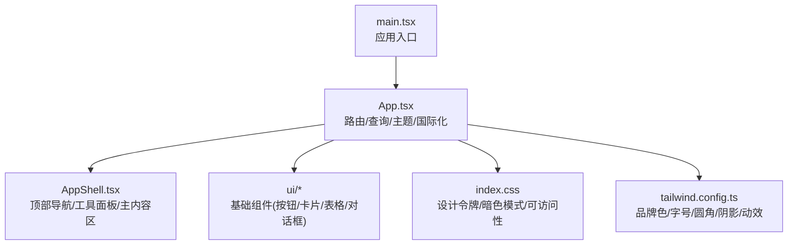
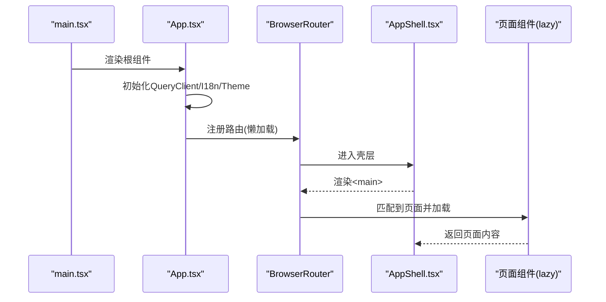
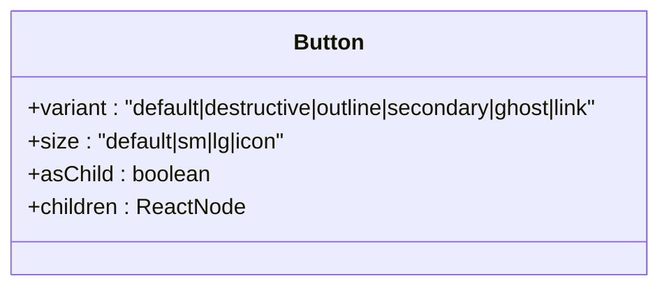
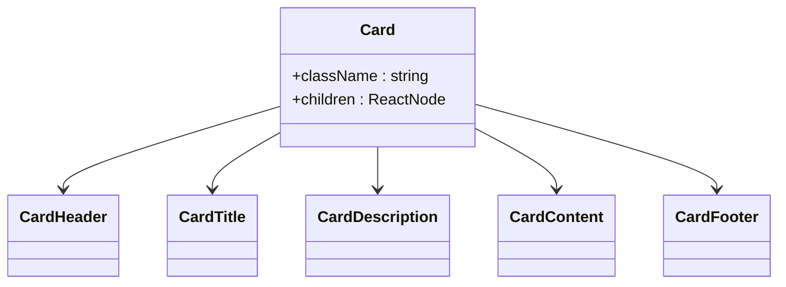
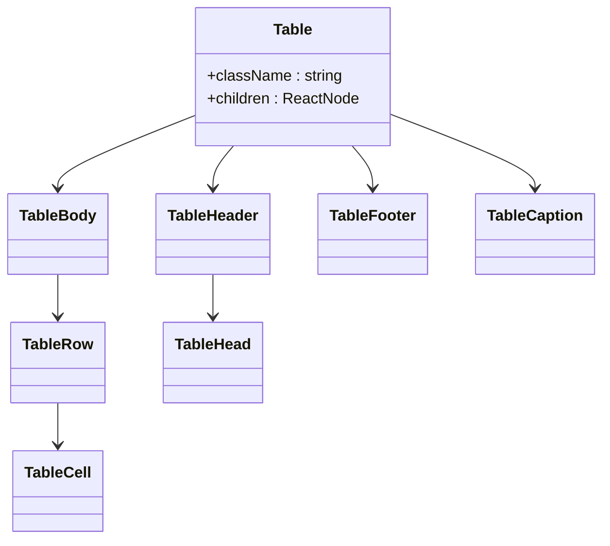
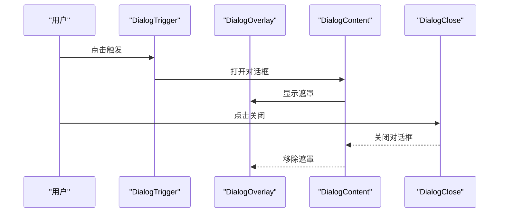
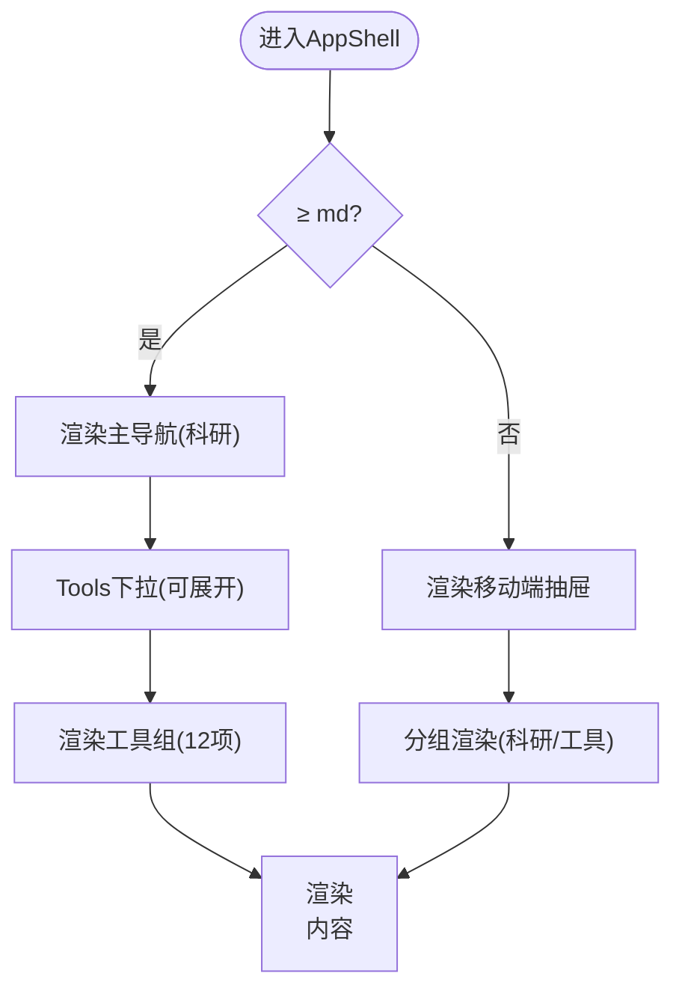
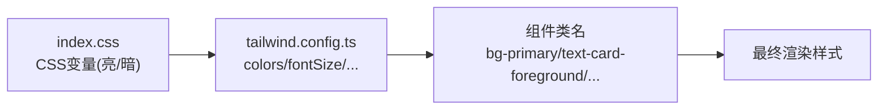
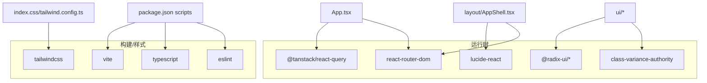

# UI组件系统

<cite>
**本文引用的文件**
- [frontend/src/App.tsx](file://frontend/src/App.tsx)
- [frontend/src/main.tsx](file://frontend/src/main.tsx)
- [frontend/src/index.css](file://frontend/src/index.css)
- [frontend/tailwind.config.ts](file://frontend/tailwind.config.ts)
- [frontend/package.json](file://frontend/package.json)
- [frontend/src/components/ui/button.tsx](file://frontend/src/components/ui/button.tsx)
- [frontend/src/components/ui/card.tsx](file://frontend/src/components/ui/card.tsx)
- [frontend/src/components/ui/table.tsx](file://frontend/src/components/ui/table.tsx)
- [frontend/src/components/ui/dialog.tsx](file://frontend/src/components/ui/dialog.tsx)
- [frontend/src/components/layout/AppShell.tsx](file://frontend/src/components/layout/AppShell.tsx)
</cite>

## 目录
1. [简介](#简介)
2. [项目结构](#项目结构)
3. [核心组件](#核心组件)
4. [架构总览](#架构总览)
5. [详细组件分析](#详细组件分析)
6. [依赖关系分析](#依赖关系分析)
7. [性能考量](#性能考量)
8. [故障排查指南](#故障排查指南)
9. [结论](#结论)
10. [附录](#附录)

## 简介
本文件系统化梳理前端UI组件体系，覆盖基础组件（按钮、卡片、表格、对话框）、布局与页面框架、主题系统与样式定制、响应式与移动端适配、组件接口与事件、可访问性与国际化、以及自定义扩展规范。目标是帮助开发者快速理解并正确使用该UI系统，同时提供最佳实践与排错指引。

## 项目结构
前端采用React + Vite构建，使用Tailwind CSS进行样式管理，并通过Radix UI提供无障碍的底层交互原语。应用入口在main.tsx中挂载App，App内通过路由、主题、国际化等Provider包裹全局能力，并使用AppShell作为统一外壳承载导航与内容区。

图表来源
- [frontend/src/main.tsx:1-16](file://frontend/src/main.tsx#L1-L16)
- [frontend/src/App.tsx:1-100](file://frontend/src/App.tsx#L1-L100)
- [frontend/src/components/layout/AppShell.tsx:1-423](file://frontend/src/components/layout/AppShell.tsx#L1-L423)
- [frontend/src/index.css:1-175](file://frontend/src/index.css#L1-L175)
- [frontend/tailwind.config.ts:1-172](file://frontend/tailwind.config.ts#L1-L172)

章节来源
- [frontend/src/main.tsx:1-16](file://frontend/src/main.tsx#L1-L16)
- [frontend/src/App.tsx:1-100](file://frontend/src/App.tsx#L1-L100)

## 核心组件
- 按钮(Button)：基于class-variance-authority定义多变体与尺寸，支持asChild透传，具备焦点环与禁用态。
- 卡片(Card)：包含CardHeader/CardTitle/CardDescription/CardContent/CardFooter，语义化区块组合。
- 表格(Table)：Table/TableHeader/TableBody/TableFooter/TableRow/TableHead/TableCell/TableCaption，含滚动容器与选中态。
- 对话框(Dialog)：基于@radix-ui/react-dialog封装Overlay/Content/Header/Footer/Title/Description，内置关闭按钮与动画。

章节来源
- [frontend/src/components/ui/button.tsx:1-45](file://frontend/src/components/ui/button.tsx#L1-L45)
- [frontend/src/components/ui/card.tsx:1-56](file://frontend/src/components/ui/card.tsx#L1-L56)
- [frontend/src/components/ui/table.tsx:1-101](file://frontend/src/components/ui/table.tsx#L1-L101)
- [frontend/src/components/ui/dialog.tsx:1-100](file://frontend/src/components/ui/dialog.tsx#L1-L100)

## 架构总览
应用以Provider分层组织能力：数据请求(QueryClient)、国际化(I18nProvider)、主题(ThemeProvider)、路由(BrowserRouter)，并在AppShell中实现信息架构与导航。页面级路由通过React.lazy拆分，首屏仅加载必要代码。

图表来源
- [frontend/src/main.tsx:1-16](file://frontend/src/main.tsx#L1-L16)
- [frontend/src/App.tsx:1-100](file://frontend/src/App.tsx#L1-L100)
- [frontend/src/components/layout/AppShell.tsx:1-423](file://frontend/src/components/layout/AppShell.tsx#L1-L423)

## 详细组件分析

### 按钮 Button
- 设计要点：使用cva声明variant(size, variant)与默认值；focus-visible聚焦环、disabled不可交互；asChild允许被包装为a/link等。
- 可访问性：继承原生button语义，确保键盘可达；建议配合aria-label用于图标按钮。
- 使用建议：优先使用语义化变体（default/secondary/outline/ghost/link/destructive），尺寸按场景选择sm/lg/icon。

图表来源
- [frontend/src/components/ui/button.tsx:7-44](file://frontend/src/components/ui/button.tsx#L7-L44)

章节来源
- [frontend/src/components/ui/button.tsx:1-45](file://frontend/src/components/ui/button.tsx#L1-L45)

### 卡片 Card
- 设计要点：将标题、描述、内容与页脚解耦为子组件，便于复用与组合。
- 可访问性：遵循HTML语义，标题使用合适层级；内容区域保持可读对比度。
- 使用建议：在复杂信息块中使用，避免过度嵌套导致视觉噪音。

图表来源
- [frontend/src/components/ui/card.tsx:5-55](file://frontend/src/components/ui/card.tsx#L5-L55)

章节来源
- [frontend/src/components/ui/card.tsx:1-56](file://frontend/src/components/ui/card.tsx#L1-L56)

### 表格 Table
- 设计要点：外层容器支持横向滚动；行hover与选中态；表头/表尾/说明文案分离。
- 可访问性：caption提供表格说明；th明确列含义；可选role=checkbox时调整间距。
- 使用建议：大数据量表格建议分页或虚拟滚动；结合筛选/排序在业务层实现。

图表来源
- [frontend/src/components/ui/table.tsx:5-100](file://frontend/src/components/ui/table.tsx#L5-L100)

章节来源
- [frontend/src/components/ui/table.tsx:1-101](file://frontend/src/components/ui/table.tsx#L1-L101)

### 对话框 Dialog
- 设计要点：基于Radix Dialog，提供Overlay/Content/Header/Footer/Title/Description；右上角关闭按钮带sr-only提示。
- 可访问性：自动焦点管理、Esc关闭、点击遮罩外关闭（由上层控制）；动画过渡提升体验。
- 使用建议：重要确认/表单编辑使用；长内容建议内部滚动。

图表来源
- [frontend/src/components/ui/dialog.tsx:7-99](file://frontend/src/components/ui/dialog.tsx#L7-L99)

章节来源
- [frontend/src/components/ui/dialog.tsx:1-100](file://frontend/src/components/ui/dialog.tsx#L1-L100)

### 布局与页面框架 AppShell
- 信息架构：将“科研主流程”常驻单行，“信任与验证工具”折叠进Tools下拉，保证导航不溢出。
- 响应式：桌面端展示主导航+Tools面板；移动端使用抽屉菜单；所有链接保留且可访问。
- 可访问性：跳过到内容链接、焦点陷阱、Escape关闭、aria-expanded/controls联动。
- 国际化：导航项与按钮文案通过i18n注入，支持中英文切换。

图表来源
- [frontend/src/components/layout/AppShell.tsx:54-413](file://frontend/src/components/layout/AppShell.tsx#L54-L413)

章节来源
- [frontend/src/components/layout/AppShell.tsx:1-423](file://frontend/src/components/layout/AppShell.tsx#L1-L423)

### 主题系统与样式定制
- 设计令牌：通过CSS变量(--brand-*、--primary、--verdict-*等)集中管理颜色、圆角、阴影、字体族与字号阶。
- 亮暗主题：在base层定义:root与.dark两套变量，Tailwind通过darkMode: 'class'切换。
- Tailwind扩展：品牌色系、裁决色阶、字体族、字号、圆角、阴影、动效曲线与时长均集中配置。
- 可访问性：尊重prefers-reduced-motion，降低动画强度；确保对比度达标。

图表来源
- [frontend/src/index.css:20-134](file://frontend/src/index.css#L20-L134)
- [frontend/tailwind.config.ts:14-166](file://frontend/tailwind.config.ts#L14-L166)

章节来源
- [frontend/src/index.css:1-175](file://frontend/src/index.css#L1-L175)
- [frontend/tailwind.config.ts:1-172](file://frontend/tailwind.config.ts#L1-L172)

### 响应式设计与移动端适配策略
- 断点与容器：container居中并限制最大宽度；导航在md断点切换为桌面布局。
- 导航优化：Tools从平铺改为下拉，避免小屏横向滚动；移动端使用抽屉收纳全部链接。
- 文本与间距：使用Tailwind响应式前缀与clamp排版，保证不同屏幕可读性。

章节来源
- [frontend/src/components/layout/AppShell.tsx:285-413](file://frontend/src/components/layout/AppShell.tsx#L285-L413)
- [frontend/tailwind.config.ts:14-19](file://frontend/tailwind.config.ts#L14-L19)

### 组件接口、事件处理与状态管理
- 组件Props：各组件暴露标准HTML属性与自身扩展字段（如Button.variant/size/asChild）。
- 事件处理：按钮/开关等通过onClick等事件回调；对话框由Radix管理打开/关闭状态。
- 状态管理：页面级数据通过@tanstack/react-query缓存与重试；主题与语言通过Context提供。

章节来源
- [frontend/src/components/ui/button.tsx:30-44](file://frontend/src/components/ui/button.tsx#L30-L44)
- [frontend/src/components/ui/dialog.tsx:7-99](file://frontend/src/components/ui/dialog.tsx#L7-L99)
- [frontend/src/App.tsx:35-99](file://frontend/src/App.tsx#L35-L99)

### 可访问性与国际化
- 可访问性：
  - 跳过到内容链接、焦点管理、键盘操作（Esc关闭、Tab循环）。
  - 图标使用aria-hidden，按钮提供aria-label或可见文本。
  - 尊重减少动效偏好。
- 国际化：
  - 导航文案与按钮标签通过useI18n获取，支持zh/en切换。
  - 路由标题与面包屑可由导航映射推导，避免重复维护。

章节来源
- [frontend/src/components/layout/AppShell.tsx:119-156](file://frontend/src/components/layout/AppShell.tsx#L119-L156)
- [frontend/src/components/layout/AppShell.tsx:168-266](file://frontend/src/components/layout/AppShell.tsx#L168-L266)
- [frontend/src/index.css:161-174](file://frontend/src/index.css#L161-L174)

### 自定义组件开发规范与扩展方式
- 命名与导出：组件文件以小写下划线命名，导出具名组件与variants（如有）。
- 样式策略：优先使用Tailwind原子类与语义化token；新增样式通过tailwind.config.ts扩展。
- 可访问性：遵循ARIA最佳实践，提供必要的role/aria-*与键盘行为。
- 类型安全：使用TypeScript定义Props接口，必要时使用VariantProps。
- 组合原则：将复杂组件拆分为小组件（如CardHeader/CardContent），提高复用性。

章节来源
- [frontend/src/components/ui/button.tsx:1-45](file://frontend/src/components/ui/button.tsx#L1-L45)
- [frontend/src/components/ui/card.tsx:1-56](file://frontend/src/components/ui/card.tsx#L1-L56)
- [frontend/tailwind.config.ts:14-166](file://frontend/tailwind.config.ts#L14-L166)

## 依赖关系分析
- 运行时依赖：
  - @radix-ui/*：提供对话框、标签页等无障碍原语。
  - @tanstack/react-query：数据请求与缓存。
  - react-router-dom：路由与懒加载。
  - lucide-react：图标库。
  - class-variance-authority / clsx / tailwind-merge：样式组合与变体。
  - d3：可视化（按需懒加载）。
- 构建与样式：
  - vite、typescript、eslint、postcss、tailwindcss、autoprefixer、tailwindcss-animate。

图表来源
- [frontend/package.json:17-55](file://frontend/package.json#L17-L55)
- [frontend/src/App.tsx:1-100](file://frontend/src/App.tsx#L1-L100)
- [frontend/src/components/layout/AppShell.tsx:1-423](file://frontend/src/components/layout/AppShell.tsx#L1-L423)

章节来源
- [frontend/package.json:1-58](file://frontend/package.json#L1-L58)

## 性能考量
- 路由级代码分割：页面组件使用React.lazy，首屏仅加载必要模块，大体积库（如d3）隔离到对应页面。
- 供应商分包：通过Vite手动分块，独立缓存第三方库。
- 骨架与降级：路由懒加载期间显示轻量占位，减少感知延迟。
- 样式生成：Tailwind按需生成，减少冗余CSS。

章节来源
- [frontend/src/App.tsx:11-33](file://frontend/src/App.tsx#L11-L33)
- [frontend/src/App.tsx:45-56](file://frontend/src/App.tsx#L45-L56)

## 故障排查指南
- 路由未生效：检查App中Routes配置与NavLink路径是否一致；确认懒加载组件路径正确。
- 主题不生效：确认根节点存在.dark类；检查CSS变量是否正确定义；Tailwind darkMode设置为class。
- 对话框无法关闭：确认使用了DialogClose或外部状态控制；检查焦点与键盘事件是否被拦截。
- 表格溢出：确保外层容器有滚动；检查列宽与最小宽度设置。
- 国际化缺失：确认i18n键是否存在；导航文案需与NAV_TITLE_BY_PATH保持一致。

章节来源
- [frontend/src/App.tsx:68-93](file://frontend/src/App.tsx#L68-L93)
- [frontend/src/components/ui/dialog.tsx:7-99](file://frontend/src/components/ui/dialog.tsx#L7-L99)
- [frontend/src/components/ui/table.tsx:5-10](file://frontend/src/components/ui/table.tsx#L5-L10)
- [frontend/src/components/layout/AppShell.tsx:99-106](file://frontend/src/components/layout/AppShell.tsx#L99-L106)

## 结论
该UI组件系统以Tailwind与Radix为核心，结合严谨的设计令牌与可访问性保障，提供了稳定、可扩展的基础组件与布局框架。通过路由懒加载与合理的样式组织，兼顾了性能与可维护性。遵循本文档的规范与实践，可高效构建一致的科研与验证工具界面。

## 附录
- 常用Token参考：
  - 颜色：--background/--foreground/--primary/--card/--border/--ring/--verdict-*
  - 字体：font-sans/font-display/font-mono
  - 字号：display/h1-h6/body/caption
  - 圆角：sm/md/lg/xl/2xl/full
  - 阴影：xs/sm/md/lg/xl/2xl/inner
- 推荐实践：
  - 优先使用语义化组件与Tailwind原子类，避免手写样式。
  - 对交互组件补充aria属性与键盘支持。
  - 通过i18n管理所有用户可见文案。
  - 在大页面中使用懒加载与骨架屏提升体验。