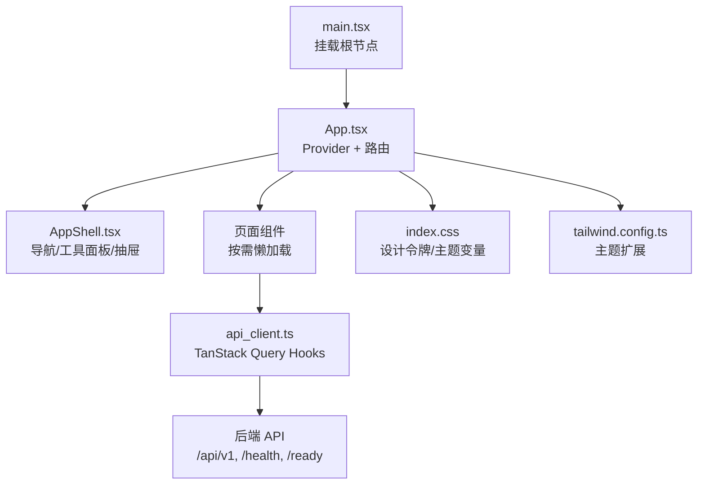
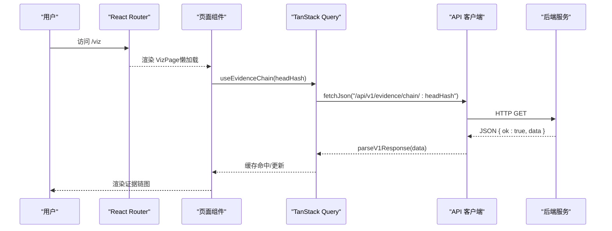
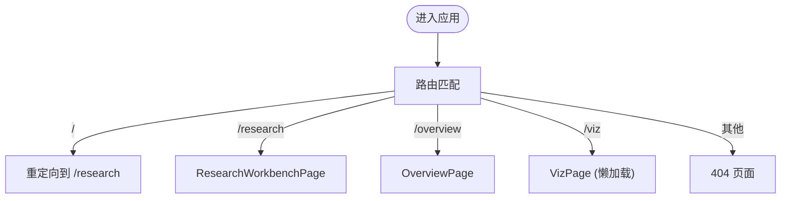
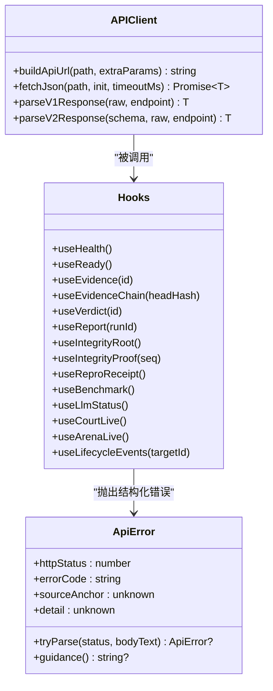
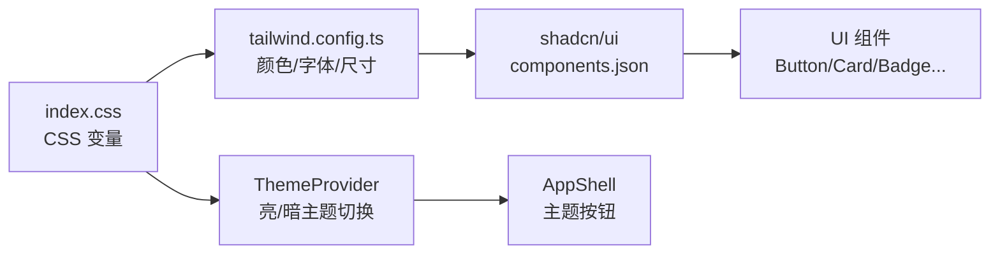
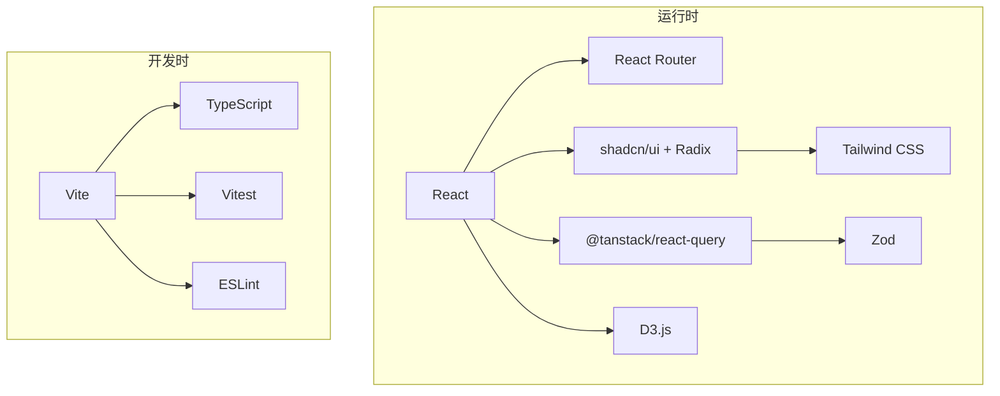

# 前端应用

<cite>
**本文引用的文件**
- [frontend/package.json](file://frontend/package.json)
- [frontend/README.md](file://frontend/README.md)
- [frontend/vite.config.ts](file://frontend/vite.config.ts)
- [frontend/tailwind.config.ts](file://frontend/tailwind.config.ts)
- [frontend/src/index.css](file://frontend/src/index.css)
- [frontend/src/main.tsx](file://frontend/src/main.tsx)
- [frontend/src/App.tsx](file://frontend/src/App.tsx)
- [frontend/src/components/layout/AppShell.tsx](file://frontend/src/components/layout/AppShell.tsx)
- [frontend/src/lib/api_client.ts](file://frontend/src/lib/api_client.ts)
- [frontend/components.json](file://frontend/components.json)
</cite>

## 目录
1. [简介](#简介)
2. [项目结构](#项目结构)
3. [核心组件](#核心组件)
4. [架构总览](#架构总览)
5. [详细组件分析](#详细组件分析)
6. [依赖关系分析](#依赖关系分析)
7. [性能与构建优化](#性能与构建优化)
8. [故障排查指南](#故障排查指南)
9. [结论](#结论)
10. [附录](#附录)

## 简介
本仓库的前端是一个基于 React 18 + Vite 的单页应用，面向“可证伪、可审计的研究链”仪表盘。它采用 React Router 进行页面路由，TanStack Query 管理数据获取与缓存，Tailwind CSS + shadcn/ui 提供一致的 UI 组件与设计令牌，D3.js 用于复杂可视化，并内置国际化（中/英）与主题切换能力。应用通过统一的 API 客户端与后端服务交互，支持开发代理与生产同源部署。

## 项目结构
- 入口与装配
  - main.tsx：React 根挂载点，严格模式包裹 App。
  - App.tsx：全局 Provider（QueryClient、I18n、Theme）、路由表、懒加载页面、错误边界与 Suspense 骨架。
- 布局与导航
  - AppShell：顶部导航、工具面板折叠、移动端抽屉、语言/主题切换、无障碍支持。
- 样式与主题
  - index.css：设计令牌（品牌色、裁决色、明暗主题变量）。
  - tailwind.config.ts：扩展 Tailwind 主题、字体、字号、圆角、阴影、动效曲线等。
  - components.json：shadcn/ui 配置与别名映射。
- 构建与开发
  - vite.config.ts：插件、目标 ES 版本、手动分包、路径别名、开发代理、Vitest 环境。
  - package.json：脚本、依赖、类型检查与测试命令。
- 数据层
  - api_client.ts：统一 fetch、超时中止、结构化错误、v1/v2 响应信封校验、TanStack Query hooks。

图表来源
- [frontend/src/main.tsx:1-16](file://frontend/src/main.tsx#L1-L16)
- [frontend/src/App.tsx:1-110](file://frontend/src/App.tsx#L1-L110)
- [frontend/src/components/layout/AppShell.tsx:1-423](file://frontend/src/components/layout/AppShell.tsx#L1-L423)
- [frontend/src/lib/api_client.ts:1-800](file://frontend/src/lib/api_client.ts#L1-L800)
- [frontend/src/index.css:1-175](file://frontend/src/index.css#L1-L175)
- [frontend/tailwind.config.ts:1-172](file://frontend/tailwind.config.ts#L1-L172)

章节来源
- [frontend/src/main.tsx:1-16](file://frontend/src/main.tsx#L1-L16)
- [frontend/src/App.tsx:1-110](file://frontend/src/App.tsx#L1-L110)
- [frontend/src/components/layout/AppShell.tsx:1-423](file://frontend/src/components/layout/AppShell.tsx#L1-L423)
- [frontend/src/index.css:1-175](file://frontend/src/index.css#L1-L175)
- [frontend/tailwind.config.ts:1-172](file://frontend/tailwind.config.ts#L1-L172)
- [frontend/vite.config.ts:1-66](file://frontend/vite.config.ts#L1-L66)
- [frontend/package.json:1-58](file://frontend/package.json#L1-L58)
- [frontend/README.md:1-161](file://frontend/README.md#L1-L161)
- [frontend/components.json:1-22](file://frontend/components.json#L1-L22)

## 核心组件
- 应用外壳（AppShell）
  - 信息架构：科研主流程（工作台、规划、版本比较、事件流、报告）常驻；信任与验证工具折叠进 Tools 面板。
  - 响应式：桌面横向导航 + 工具下拉；移动端汉堡抽屉，点击导航自动关闭。
  - 无障碍：跳过到内容链接、焦点陷阱、Escape 关闭、ARIA 属性。
  - 国际化与主题：语言切换（中/英）、亮/暗主题切换。
- 路由与页面
  - 使用 React Router 定义路由，首页重定向至 /research。
  - 所有页面通过 React.lazy 懒加载，Suspense 显示加载骨架。
  - 未匹配路由返回 404 页面。
- 数据与状态
  - TanStack Query 提供查询与变更 Hook，集中管理缓存键、重试策略、过期时间。
  - 统一 API 客户端封装 fetch、超时、错误解析、v1/v2 信封校验。
- 样式与主题
  - 设计令牌以 CSS 变量形式在 index.css 定义，Tailwind 通过 hsl(var(--x)) 引用。
  - 明暗主题分别精调背景、前景、边框、聚焦环与裁决色。

章节来源
- [frontend/src/components/layout/AppShell.tsx:1-423](file://frontend/src/components/layout/AppShell.tsx#L1-L423)
- [frontend/src/App.tsx:1-110](file://frontend/src/App.tsx#L1-L110)
- [frontend/src/lib/api_client.ts:1-800](file://frontend/src/lib/api_client.ts#L1-L800)
- [frontend/src/index.css:1-175](file://frontend/src/index.css#L1-L175)
- [frontend/tailwind.config.ts:1-172](file://frontend/tailwind.config.ts#L1-L172)

## 架构总览
前端采用“壳 + 页面 + 数据层”的分层架构：
- 壳层：AppShell 负责导航、工具面板、主题与国际化。
- 页面层：各业务页面按需懒加载，专注展示与交互。
- 数据层：api_client.ts 暴露 typed hooks，统一请求、错误与缓存。
- 构建层：Vite 负责打包、分包、开发代理与测试环境。

图表来源
- [frontend/src/App.tsx:1-110](file://frontend/src/App.tsx#L1-L110)
- [frontend/src/lib/api_client.ts:424-558](file://frontend/src/lib/api_client.ts#L424-L558)

章节来源
- [frontend/src/App.tsx:1-110](file://frontend/src/App.tsx#L1-L110)
- [frontend/src/lib/api_client.ts:1-800](file://frontend/src/lib/api_client.ts#L1-L800)

## 详细组件分析

### 路由与导航（AppShell + App）
- 路由表集中在 App.tsx，首页重定向至 /research，其余页面按功能划分。
- AppShell 维护导航分组（科研主流程 vs 工具），桌面端 Tools 下拉，移动端抽屉。
- 导航项与标题映射集中管理，避免标题与架构不一致。

图表来源
- [frontend/src/App.tsx:58-110](file://frontend/src/App.tsx#L58-L110)
- [frontend/src/components/layout/AppShell.tsx:54-106](file://frontend/src/components/layout/AppShell.tsx#L54-L106)

章节来源
- [frontend/src/App.tsx:1-110](file://frontend/src/App.tsx#L1-L110)
- [frontend/src/components/layout/AppShell.tsx:1-423](file://frontend/src/components/layout/AppShell.tsx#L1-L423)

### 数据获取与同步（TanStack Query + API 客户端）
- 统一 fetch：带超时中止、结构化错误、JSON/文本两种响应处理。
- v1 响应：统一解包 { ok:true, data }，失败走 RFC 7807 错误分支。
- v2 收据：边界 zod 校验 data 字段，确保契约一致。
- 查询键：为每个资源定义稳定 queryKey，便于失效与去重。
- 常用 Hook：健康/就绪探针、证据链、裁决、报告、基准、生命周期事件、LLM 状态、法庭/竞技场提交等。

图表来源
- [frontend/src/lib/api_client.ts:65-135](file://frontend/src/lib/api_client.ts#L65-L135)
- [frontend/src/lib/api_client.ts:147-261](file://frontend/src/lib/api_client.ts#L147-L261)
- [frontend/src/lib/api_client.ts:263-368](file://frontend/src/lib/api_client.ts#L263-L368)
- [frontend/src/lib/api_client.ts:370-800](file://frontend/src/lib/api_client.ts#L370-L800)

章节来源
- [frontend/src/lib/api_client.ts:1-800](file://frontend/src/lib/api_client.ts#L1-L800)

### 主题系统与样式定制
- 设计令牌：品牌色（ink-blue 11 阶）、裁决色（确认/反驳/不确定/降级/未测试）、语义色（背景/前景/边框/聚焦环）。
- 明暗主题：通过 .dark 类切换变量值，保证对比度与可读性。
- Tailwind 扩展：字体族、字号阶梯、圆角、阴影、动效曲线与时长。
- shadcn/ui：通过 components.json 配置别名与图标库（lucide）。

图表来源
- [frontend/src/index.css:1-175](file://frontend/src/index.css#L1-L175)
- [frontend/tailwind.config.ts:1-172](file://frontend/tailwind.config.ts#L1-L172)
- [frontend/components.json:1-22](file://frontend/components.json#L1-L22)
- [frontend/src/components/layout/AppShell.tsx:119-156](file://frontend/src/components/layout/AppShell.tsx#L119-L156)

章节来源
- [frontend/src/index.css:1-175](file://frontend/src/index.css#L1-L175)
- [frontend/tailwind.config.ts:1-172](file://frontend/tailwind.config.ts#L1-L172)
- [frontend/components.json:1-22](file://frontend/components.json#L1-L22)

### 国际化与多语言
- 语言切换：AppShell 提供语言切换按钮，切换 zh/en。
- 文案来源：导航标签、提示文案通过 i18n 钩子获取，保持界面一致性。
- 类型安全：i18n 键值由类型约束，避免拼写错误。

章节来源
- [frontend/src/components/layout/AppShell.tsx:140-156](file://frontend/src/components/layout/AppShell.tsx#L140-L156)
- [frontend/README.md:141-149](file://frontend/README.md#L141-L149)

### 响应式设计与移动端适配
- 导航：桌面端横向导航 + Tools 下拉；移动端汉堡菜单抽屉，点击后自动关闭。
- 容器与间距：container 居中与 padding，min-w-0 防止溢出。
- 可访问性：跳过到内容、焦点陷阱、ARIA 属性、减少动画偏好。

章节来源
- [frontend/src/components/layout/AppShell.tsx:158-423](file://frontend/src/components/layout/AppShell.tsx#L158-L423)
- [frontend/src/index.css:161-175](file://frontend/src/index.css#L161-L175)

### 与后端 API 集成与数据同步
- 基址策略：默认相对路径（同源），可通过环境变量覆盖为绝对 URL。
- 开发代理：/api/v1、/health、/ready 转发至本地后端。
- 数据同步：TanStack Query 控制缓存、重试、过期与失效；变更成功后主动失效相关列表。
- 错误处理：结构化错误携带状态码、错误码、源锚点与可选指引。

章节来源
- [frontend/vite.config.ts:47-58](file://frontend/vite.config.ts#L47-L58)
- [frontend/src/lib/api_client.ts:139-217](file://frontend/src/lib/api_client.ts#L139-L217)
- [frontend/src/lib/api_client.ts:370-800](file://frontend/src/lib/api_client.ts#L370-L800)
- [frontend/README.md:119-133](file://frontend/README.md#L119-L133)

### 构建流程与部署配置
- 构建目标：ES2022，避免 esbuild 对 destructuring 的降级问题。
- 分包策略：vendor-react、vendor-d3、vendor-query 独立缓存，d3 仅在被需要时加载。
- 路径别名：@/ → src/，提升导入可读性与稳定性。
- 测试环境：Vitest 使用 jsdom，禁用 CSS 以减少噪声。

章节来源
- [frontend/vite.config.ts:1-66](file://frontend/vite.config.ts#L1-L66)
- [frontend/package.json:8-15](file://frontend/package.json#L8-L15)

### 用户体验优化与性能调优
- 路由级代码分割：页面懒加载，首屏体积更小。
- 大依赖隔离：d3 放入 vendor-d3 chunk，仅在图表页面加载。
- 缓存与失效：TanStack Query 合理设置 staleTime、refetchOnWindowFocus、重试次数。
- 错误恢复：全局错误边界捕获渲染/lazy-chunk 错误，提供重试/重载。
- 无动画偏好：尊重系统减少动画设置，避免触发前庭障碍。

章节来源
- [frontend/src/App.tsx:11-16](file://frontend/src/App.tsx#L11-L16)
- [frontend/src/App.tsx:35-43](file://frontend/src/App.tsx#L35-L43)
- [frontend/src/App.tsx:45-56](file://frontend/src/App.tsx#L45-L56)
- [frontend/src/index.css:161-175](file://frontend/src/index.css#L161-L175)
- [frontend/README.md:141-149](file://frontend/README.md#L141-L149)

### 前端开发规范与代码质量标准
- 红线约束：源码不含特定 literal；禁止 any/ts-ignore/as unknown as/空 catch。
- 类型安全：Zod 运行时校验 v2 收据响应；TS 强类型约束 i18n 键。
- 命名与契约：遵循 spec 24 API 路径与字段命名；URL 路径豁免于源码命名规则。
- 测试：Vitest + Testing Library，jsdom 环境，CSS 关闭。

章节来源
- [frontend/README.md:134-156](file://frontend/README.md#L134-L156)
- [frontend/src/lib/api_client.ts:263-368](file://frontend/src/lib/api_client.ts#L263-L368)
- [frontend/vite.config.ts:59-64](file://frontend/vite.config.ts#L59-L64)

## 依赖关系分析
- 运行时依赖
  - React、React DOM、React Router：UI 框架与路由。
  - TanStack Query：数据获取与缓存。
  - Tailwind CSS、shadcn/ui、Radix UI：样式与基础组件。
  - D3.js：可视化。
  - Lucide React：图标。
  - Zod：运行时校验。
- 开发依赖
  - Vite、TypeScript、Vitest、ESLint、PostCSS、Autoprefixer。

图表来源
- [frontend/package.json:17-56](file://frontend/package.json#L17-L56)

章节来源
- [frontend/package.json:17-56](file://frontend/package.json#L17-L56)

## 性能与构建优化
- 目标与兼容性：构建目标 ES2022，避免 esbuild 降级导致的构建错误。
- 分包策略：将大型稳定依赖拆分为独立 chunk，提高缓存命中率与并行加载。
- 懒加载：页面级代码分割，按需引入 d3 等大依赖。
- 缓存策略：QueryClient 默认 staleTime、refetchOnWindowFocus=false、重试次数=1，降低重复请求。
- 开发体验：Vite 预构建优化依赖，端口 5173，代理后端接口。

章节来源
- [frontend/vite.config.ts:10-41](file://frontend/vite.config.ts#L10-L41)
- [frontend/src/App.tsx:35-43](file://frontend/src/App.tsx#L35-L43)
- [frontend/README.md:141-149](file://frontend/README.md#L141-L149)

## 故障排查指南
- 网络与代理
  - 开发环境：确认 Vite 代理是否生效（/api/v1、/health、/ready）。
  - 生产环境：确认反向代理或 CORS 配置正确，必要时设置 VITE_API_BASE_URL。
- API 错误
  - 结构化错误：查看 httpStatus、errorCode、sourceAnchor、detail.guidance。
  - 响应格式：v1/v2 信封校验失败会抛出 RESPONSE_SCHEMA_MISMATCH，检查后端契约。
- 路由与页面
  - 懒加载失败：Suspense fallback 显示加载中，检查网络与 chunk 可用性。
  - 404：未匹配路由返回 404 页面，检查路由表与跳转逻辑。
- 主题与样式
  - 明暗主题：确认 .dark 类是否正确应用，CSS 变量是否覆盖。
  - 对比度：裁决色与文字对比度需满足 WCAG AA。

章节来源
- [frontend/src/lib/api_client.ts:65-135](file://frontend/src/lib/api_client.ts#L65-L135)
- [frontend/src/lib/api_client.ts:263-368](file://frontend/src/lib/api_client.ts#L263-L368)
- [frontend/src/App.tsx:45-56](file://frontend/src/App.tsx#L45-L56)
- [frontend/src/App.tsx:102-110](file://frontend/src/App.tsx#L102-L110)
- [frontend/src/index.css:85-133](file://frontend/src/index.css#L85-L133)

## 结论
该前端应用以清晰的层次化架构、严格的类型与契约校验、完善的主题与国际化支持，以及高效的构建与缓存策略，提供了稳定、可维护且可扩展的研究链仪表盘。通过路由级代码分割与大依赖隔离，保证了首屏性能；通过 TanStack Query 与结构化错误处理，提升了数据交互的可靠性与可观测性。整体设计兼顾学术严谨与工程实践，适合持续演进与团队协作。

## 附录
- 快速开始与脚本
  - dev/build/preview/test/typecheck/lint 等命令见 package.json。
- 环境变量
  - VITE_API_BASE_URL 可覆盖后端地址，实现跨域或同源部署。
- 技术栈概览
  - React、Vite、TypeScript、Tailwind、shadcn/ui、D3、TanStack Query、React Router、Vitest。

章节来源
- [frontend/package.json:8-15](file://frontend/package.json#L8-L15)
- [frontend/README.md:24-46](file://frontend/README.md#L24-L46)
- [frontend/README.md:47-60](file://frontend/README.md#L47-L60)