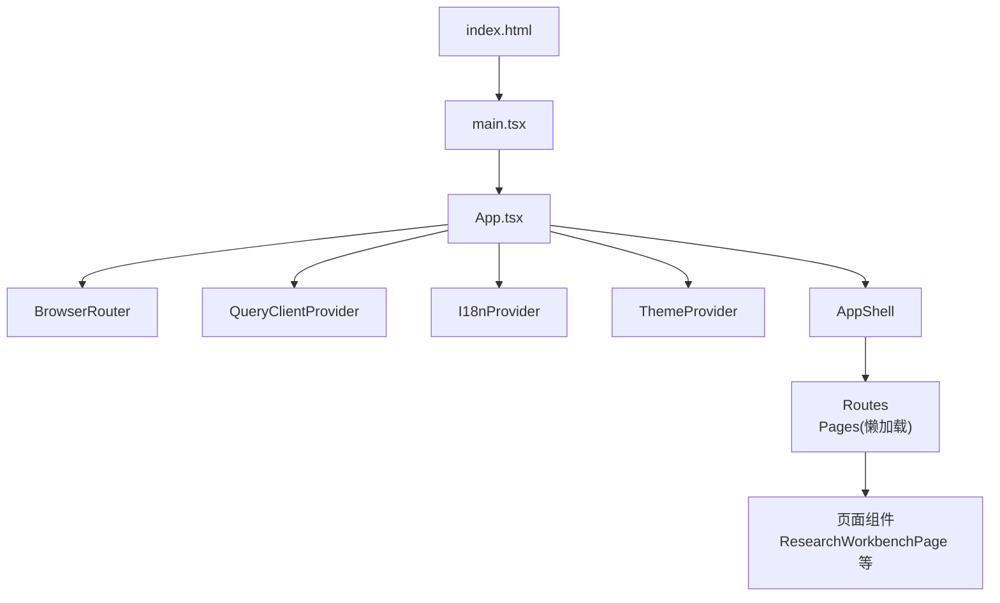
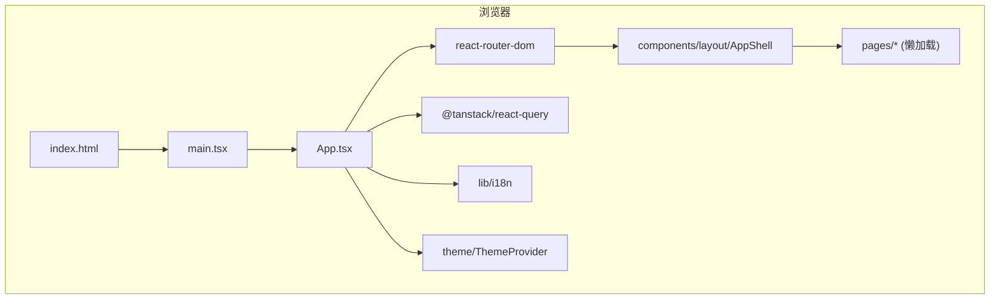
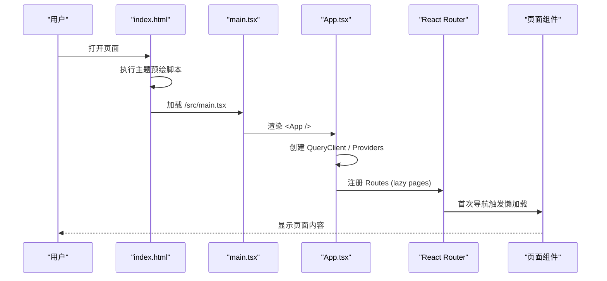
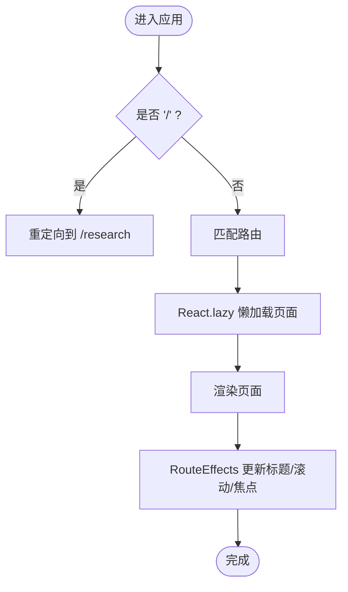
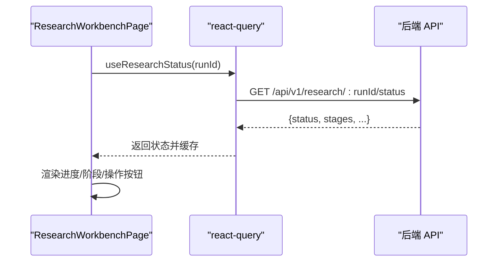
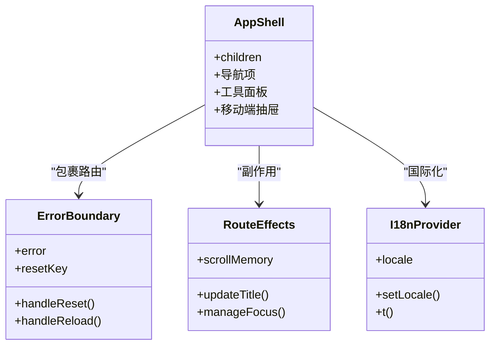
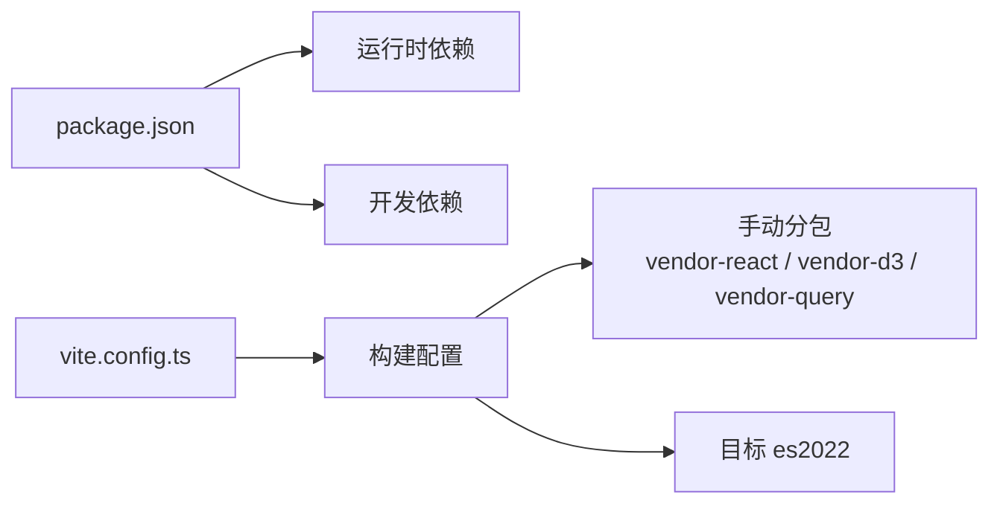

# 应用架构设计

<cite>
**本文引用的文件**
- [frontend/package.json](file://frontend/package.json)
- [frontend/vite.config.ts](file://frontend/vite.config.ts)
- [frontend/index.html](file://frontend/index.html)
- [frontend/tsconfig.json](file://frontend/tsconfig.json)
- [frontend/tailwind.config.ts](file://frontend/tailwind.config.ts)
- [frontend/src/main.tsx](file://frontend/src/main.tsx)
- [frontend/src/App.tsx](file://frontend/src/App.tsx)
- [frontend/src/components/layout/AppShell.tsx](file://frontend/src/components/layout/AppShell.tsx)
- [frontend/src/components/ErrorBoundary.tsx](file://frontend/src/components/ErrorBoundary.tsx)
- [frontend/src/components/RouteEffects.tsx](file://frontend/src/components/RouteEffects.tsx)
- [frontend/src/lib/i18n/index.tsx](file://frontend/src/lib/i18n/index.tsx)
- [frontend/src/pages/ResearchWorkbenchPage.tsx](file://frontend/src/pages/ResearchWorkbenchPage.tsx)
</cite>

## 目录
1. [简介](#简介)
2. [项目结构](#项目结构)
3. [核心组件](#核心组件)
4. [架构总览](#架构总览)
5. [详细组件分析](#详细组件分析)
6. [依赖分析](#依赖分析)
7. [性能考虑](#性能考虑)
8. [故障排查指南](#故障排查指南)
9. [结论](#结论)
10. [附录](#附录)

## 简介
本文件面向基于 React + Vite 的前端单页应用，系统性说明整体架构、模块划分与依赖管理；详述应用启动流程与初始化过程；解释路由配置与页面导航机制；阐述状态管理与数据流设计；描述组件层次结构与复用模式；介绍构建配置与优化策略；并给出开发环境配置与生产部署方案，以及性能监控与错误处理机制。

## 项目结构
前端位于 frontend 子目录，采用功能与层级混合的组织方式：
- src/pages：按业务域划分的页面组件（如 ResearchWorkbenchPage、OverviewPage、VizPage 等），通过懒加载按需引入。
- src/components：通用 UI 与布局组件（AppShell、ErrorBoundary、RouteEffects 等）及主题、布局、UI 原子组件。
- src/lib：跨领域能力封装（i18n、API 客户端、工具函数等）。
- 根级配置：vite.config.ts、tailwind.config.ts、tsconfig.json、package.json 等。

图表来源
- [frontend/index.html:1-54](file://frontend/index.html#L1-L54)
- [frontend/src/main.tsx:1-16](file://frontend/src/main.tsx#L1-L16)
- [frontend/src/App.tsx:1-110](file://frontend/src/App.tsx#L1-L110)

章节来源
- [frontend/package.json:1-58](file://frontend/package.json#L1-L58)
- [frontend/vite.config.ts:1-66](file://frontend/vite.config.ts#L1-L66)
- [frontend/tsconfig.json:1-33](file://frontend/tsconfig.json#L1-L33)

## 核心组件
- 入口与渲染：index.html 提供 #root 挂载点与首屏主题预绘脚本；main.tsx 创建 React 根节点并以 StrictMode 渲染 App。
- 应用壳层：App.tsx 装配 QueryClientProvider、I18nProvider、ThemeProvider、BrowserRouter，并通过 Suspense + lazy 实现路由级代码分割；定义全局路由表与默认重定向。
- 导航壳层：AppShell 提供顶部导航、工具折叠面板、移动端抽屉、语言与主题切换，维护信息架构分组（科研主流程 vs 信任与验证工具）。
- 路由副作用：RouteEffects 统一处理滚动记忆、标题更新、焦点管理，提升可访问性与用户体验。
- 错误边界：ErrorBoundary 捕获渲染期与懒加载失败，提供“重试”和“重载”恢复路径，并在路由切换时自动重置。
- 国际化：I18nProvider 提供 zh/en 双语，持久化到 localStorage，同步 <html lang>，并提供 useT/useI18n Hook。

章节来源
- [frontend/src/main.tsx:1-16](file://frontend/src/main.tsx#L1-L16)
- [frontend/src/App.tsx:1-110](file://frontend/src/App.tsx#L1-L110)
- [frontend/src/components/layout/AppShell.tsx:1-423](file://frontend/src/components/layout/AppShell.tsx#L1-L423)
- [frontend/src/components/RouteEffects.tsx:1-102](file://frontend/src/components/RouteEffects.tsx#L1-L102)
- [frontend/src/components/ErrorBoundary.tsx:1-135](file://frontend/src/components/ErrorBoundary.tsx#L1-L135)
- [frontend/src/lib/i18n/index.tsx:1-118](file://frontend/src/lib/i18n/index.tsx#L1-L118)

## 架构总览
应用以 React 为视图层，Vite 作为构建与开发服务器；使用 react-router-dom 进行 SPA 路由；使用 @tanstack/react-query 管理服务端状态与缓存；Tailwind CSS 提供样式系统；i18n 提供多语言支持。

图表来源
- [frontend/index.html:1-54](file://frontend/index.html#L1-L54)
- [frontend/src/main.tsx:1-16](file://frontend/src/main.tsx#L1-L16)
- [frontend/src/App.tsx:1-110](file://frontend/src/App.tsx#L1-L110)
- [frontend/src/components/layout/AppShell.tsx:1-423](file://frontend/src/components/layout/AppShell.tsx#L1-L423)

## 详细组件分析

### 应用启动与初始化流程
- index.html 在首屏执行内联脚本，根据本地存储与 prefers-color-scheme 设置 .dark 类与 theme-color，避免 FOUC。
- main.tsx 查找 #root 并创建 React 根，严格模式下渲染 App。
- App 中创建 QueryClient（配置重试次数、窗口聚焦不自动 refetch、staleTime），包裹 i18n、主题、路由与错误边界。
- 路由通过 lazy 导入各页面，Suspense 提供加载态占位。

图表来源
- [frontend/index.html:18-38](file://frontend/index.html#L18-L38)
- [frontend/src/main.tsx:6-15](file://frontend/src/main.tsx#L6-L15)
- [frontend/src/App.tsx:35-99](file://frontend/src/App.tsx#L35-L99)

章节来源
- [frontend/index.html:1-54](file://frontend/index.html#L1-L54)
- [frontend/src/main.tsx:1-16](file://frontend/src/main.tsx#L1-L16)
- [frontend/src/App.tsx:1-110](file://frontend/src/App.tsx#L1-L110)

### 路由配置与页面导航机制
- 路由集中声明于 App.tsx，包含重定向（/ → /research）、业务路由与 404 兜底。
- 所有页面通过 React.lazy 懒加载，减少初始包体；配合 Suspense 展示加载指示器。
- AppShell 维护导航信息架构（科研主流程常驻，工具组折叠），提供桌面下拉与移动端抽屉，保持可访问性（键盘焦点、Escape 关闭、点击外部关闭）。
- RouteEffects 统一处理文档标题、滚动位置记忆与焦点管理，确保导航体验一致。

图表来源
- [frontend/src/App.tsx:68-99](file://frontend/src/App.tsx#L68-L99)
- [frontend/src/components/layout/AppShell.tsx:54-106](file://frontend/src/components/layout/AppShell.tsx#L54-L106)
- [frontend/src/components/RouteEffects.tsx:39-101](file://frontend/src/components/RouteEffects.tsx#L39-L101)

章节来源
- [frontend/src/App.tsx:1-110](file://frontend/src/App.tsx#L1-L110)
- [frontend/src/components/layout/AppShell.tsx:1-423](file://frontend/src/components/layout/AppShell.tsx#L1-L423)
- [frontend/src/components/RouteEffects.tsx:1-102](file://frontend/src/components/RouteEffects.tsx#L1-L102)

### 状态管理策略与数据流设计
- 服务端状态：使用 @tanstack/react-query 的 QueryClient 管理查询缓存与重试策略；页面通过 hooks（如 useResearchStatus、useStartResearch 等）发起请求与消费数据。
- 客户端状态：主题、语言、导航展开状态由各自 Provider/Hook 管理（ThemeProvider、I18nProvider、AppShell 内部 state）。
- 数据流：页面组件通过 react-query hooks 获取数据，结合本地 UI 状态渲染；SSE 事件用于实时进度，当不可用时降级为轮询，保证诚实降级。

图表来源
- [frontend/src/pages/ResearchWorkbenchPage.tsx:34-53](file://frontend/src/pages/ResearchWorkbenchPage.tsx#L34-L53)
- [frontend/src/App.tsx:35-43](file://frontend/src/App.tsx#L35-L43)

章节来源
- [frontend/src/pages/ResearchWorkbenchPage.tsx:1-200](file://frontend/src/pages/ResearchWorkbenchPage.tsx#L1-L200)
- [frontend/src/App.tsx:35-43](file://frontend/src/App.tsx#L35-L43)

### 组件层次结构与复用模式
- 顶层容器：AppShell 提供全局导航与内容区，封装信息架构分组与可访问性交互。
- 页面组件：每个路由对应一个页面组件，职责单一，通过懒加载隔离大依赖（如 d3）。
- 通用 UI：ui 目录下基础控件（Button、Card、Badge、Input 等）被页面与复杂组件复用。
- 主题与国际化：ThemeProvider 与 I18nProvider 作为上下文提供者，贯穿全应用。
- 错误边界：ErrorBoundary 包裹路由区域，捕获渲染异常并提供恢复手段。

图表来源
- [frontend/src/components/layout/AppShell.tsx:1-423](file://frontend/src/components/layout/AppShell.tsx#L1-L423)
- [frontend/src/components/ErrorBoundary.tsx:1-135](file://frontend/src/components/ErrorBoundary.tsx#L1-L135)
- [frontend/src/components/RouteEffects.tsx:1-102](file://frontend/src/components/RouteEffects.tsx#L1-L102)
- [frontend/src/lib/i18n/index.tsx:1-118](file://frontend/src/lib/i18n/index.tsx#L1-L118)

章节来源
- [frontend/src/components/layout/AppShell.tsx:1-423](file://frontend/src/components/layout/AppShell.tsx#L1-L423)
- [frontend/src/components/ErrorBoundary.tsx:1-135](file://frontend/src/components/ErrorBoundary.tsx#L1-L135)
- [frontend/src/components/RouteEffects.tsx:1-102](file://frontend/src/components/RouteEffects.tsx#L1-L102)
- [frontend/src/lib/i18n/index.tsx:1-118](file://frontend/src/lib/i18n/index.tsx#L1-L118)

## 依赖分析
- 运行时依赖：react、react-dom、react-router-dom、@tanstack/react-query、d3、lucide-react、zod、tailwind-merge、class-variance-authority、clsx。
- 构建与开发依赖：vite、@vitejs/plugin-react、typescript、eslint、vitest、tailwindcss、autoprefixer、postcss、testing-library 系列。
- 构建目标：es2022，避免 esbuild 对解构语法的降级问题；vendor chunk 拆分（react、d3、react-query）以提升缓存命中与并行加载。

图表来源
- [frontend/package.json:17-56](file://frontend/package.json#L17-L56)
- [frontend/vite.config.ts:24-41](file://frontend/vite.config.ts#L24-L41)

章节来源
- [frontend/package.json:1-58](file://frontend/package.json#L1-L58)
- [frontend/vite.config.ts:1-66](file://frontend/vite.config.ts#L1-L66)

## 性能考虑
- 首屏优化：
  - 路由级代码分割：所有页面使用 React.lazy，仅导航到对应路由时才下载。
  - Vendor 分包：将 react、d3、react-query 拆分为独立 chunk，提高缓存命中率与并行加载。
  - 字体与资源：使用 preconnect 与 display=swap，避免阻塞首帧。
  - 主题预绘：内联脚本在 React 挂载前设置 .dark 与 theme-color，消除 FOUC。
- 运行时优化：
  - react-query 缓存与 staleTime 控制，减少重复请求。
  - SSE 实时事件不可用时降级为轮询，避免长时间等待或假实时。
  - Tailwind 按需生成样式，减少 CSS 体积。
- 构建优化：
  - esbuild target 设置为 es2022，避免不必要的降级。
  - optimizeDeps 的 esbuild target 保持一致，防止预打包阶段报错。

[本节为通用指导，无需特定文件引用]

## 故障排查指南
- 懒加载失败或网络中断：
  - 现象：路由懒加载失败导致白屏或卡住。
  - 处理：ErrorBoundary 捕获错误并提供“重试”与“重载”按钮；导航离开会自动重置错误边界。
- 路由标题与焦点不一致：
  - 现象：切换页面后标题未更新或焦点不在主内容区。
  - 处理：RouteEffects 负责标题与焦点管理，检查是否正确挂载与 pathname 变化。
- 主题闪烁或暗色未生效：
  - 现象：冷启动出现短暂亮色闪烁。
  - 处理：确认 index.html 中的主题预绘脚本执行成功，localStorage 可用且值正确。
- 国际化文本缺失：
  - 现象：某些文案显示 key 而非文本。
  - 处理：检查 i18n messages 是否包含对应键；无 provider 时会回退到默认语言。

章节来源
- [frontend/src/components/ErrorBoundary.tsx:1-135](file://frontend/src/components/ErrorBoundary.tsx#L1-L135)
- [frontend/src/components/RouteEffects.tsx:1-102](file://frontend/src/components/RouteEffects.tsx#L1-L102)
- [frontend/index.html:18-38](file://frontend/index.html#L18-L38)
- [frontend/src/lib/i18n/index.tsx:1-118](file://frontend/src/lib/i18n/index.tsx#L1-L118)

## 结论
该前端应用采用清晰的分层与模块化组织：入口与壳层负责基础设施，页面组件按业务域划分并通过懒加载隔离依赖；状态管理以 react-query 为核心，结合本地上下文（主题、语言）形成稳定的数据流；构建配置针对现代浏览器目标与分包策略优化性能；错误边界与路由副作用保障可访问性与健壮性。整体架构兼顾可扩展性、可维护性与用户体验。

[本节为总结，无需特定文件引用]

## 附录

### 构建与开发环境配置
- 开发服务器：端口 5173，代理 /api/v1、/health、/ready 至后端 localhost:3000；可通过环境变量 VITE_API_BASE_URL 覆盖。
- TypeScript：target ES2022，strict 模式，路径别名 @/* -> src/*。
- 样式：Tailwind 扩展品牌色、字号、圆角、阴影与动效；启用 darkMode class。
- 测试：Vitest 全局模式，jsdom 环境，CSS 禁用。

章节来源
- [frontend/vite.config.ts:47-64](file://frontend/vite.config.ts#L47-L64)
- [frontend/tsconfig.json:1-33](file://frontend/tsconfig.json#L1-L33)
- [frontend/tailwind.config.ts:1-172](file://frontend/tailwind.config.ts#L1-L172)

### 生产环境部署方案
- 产物：静态资源（JS/CSS/图片）由 Vite 构建输出，建议部署到 CDN 或静态托管服务。
- 缓存策略：利用 vendor 分包提升长期缓存命中率；开启 gzip/brotli 压缩。
- 安全：确保 CSP 与 HTTPS；如需跨域，调整代理或后端 CORS。
- 监控：可在 ErrorBoundary 中接入错误上报服务（当前为 console.error），并结合前端埋点收集性能指标。

[本节为通用指导，无需特定文件引用]