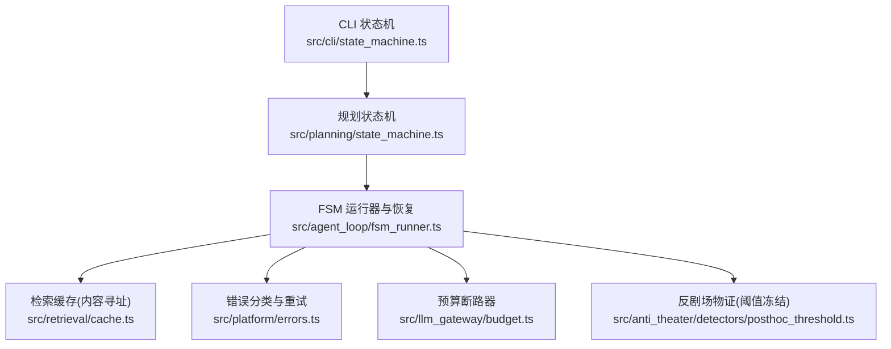
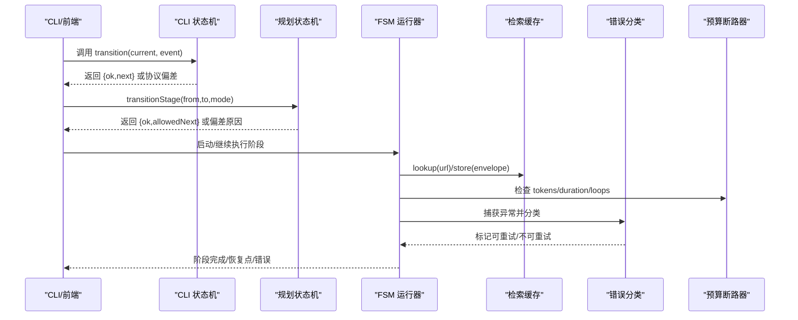
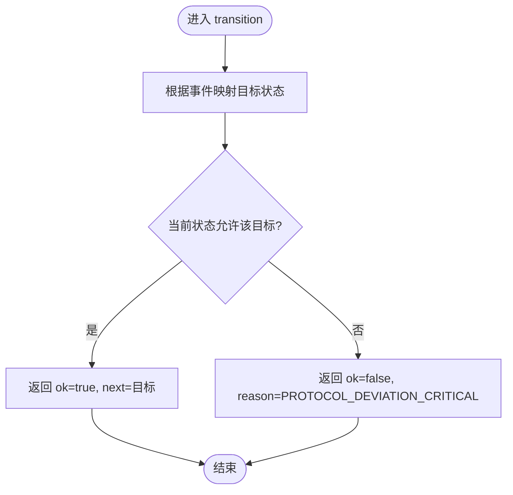
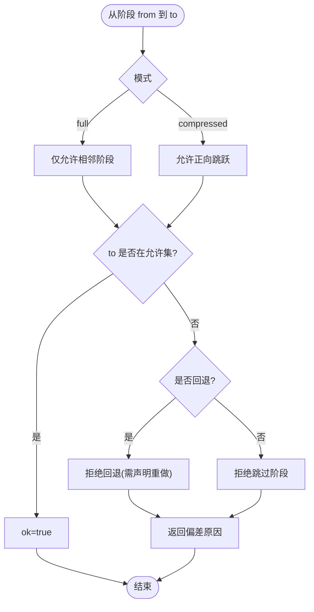
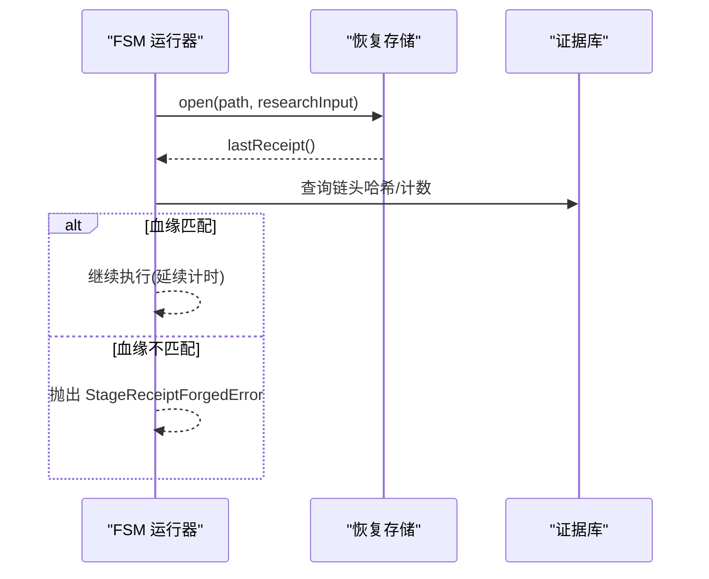
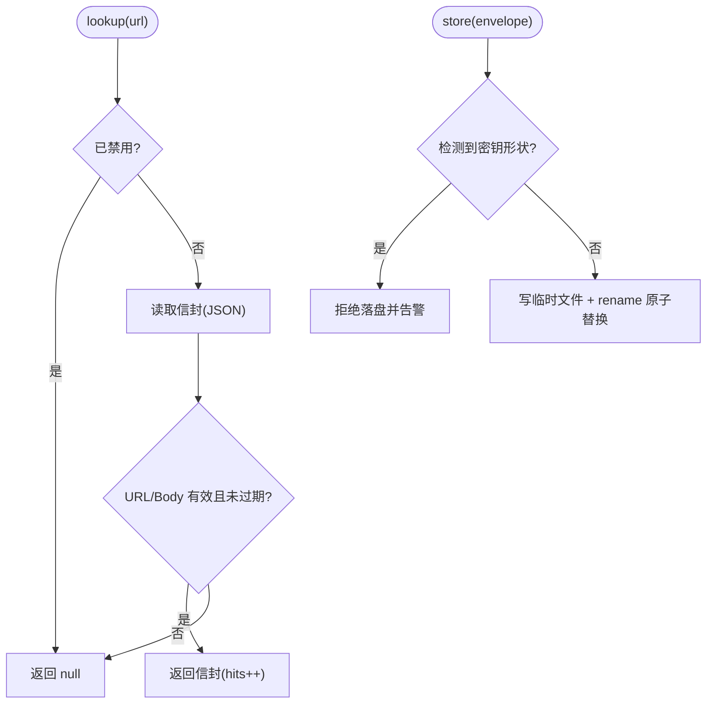
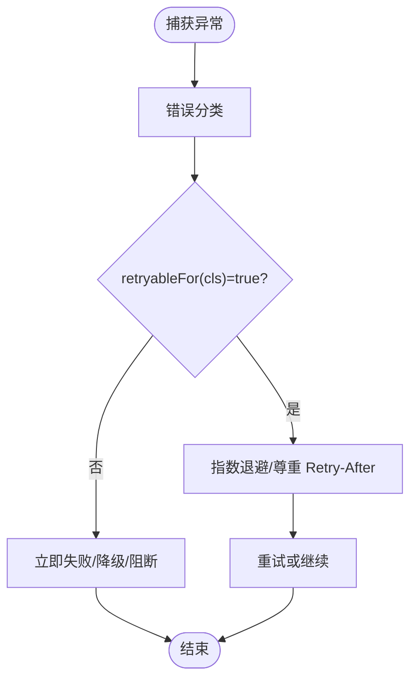
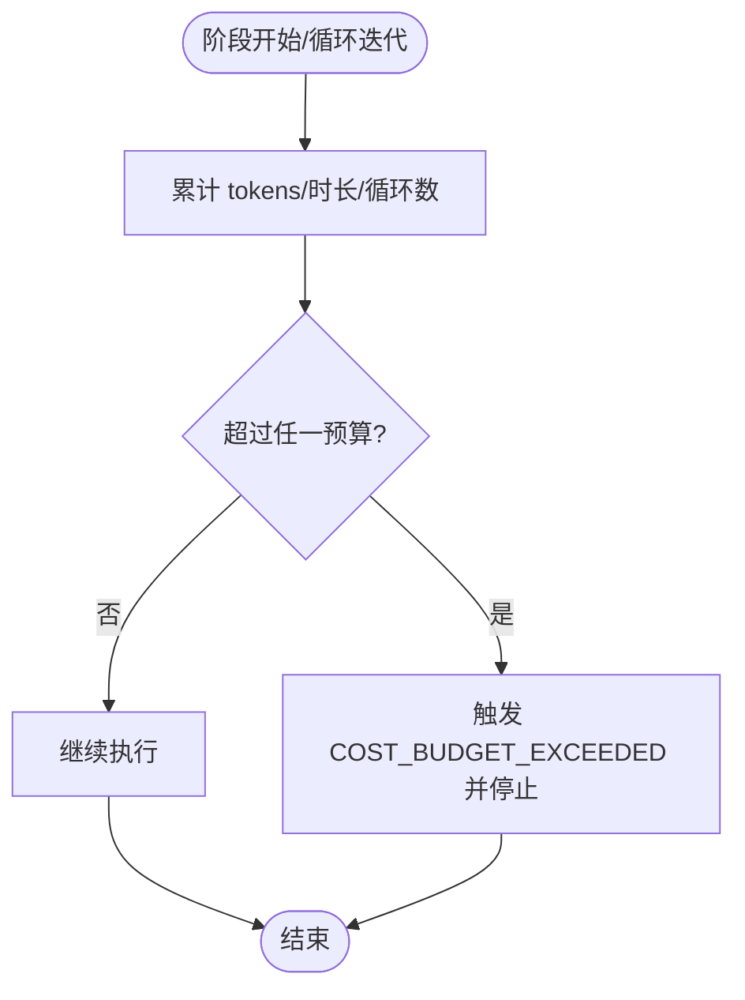
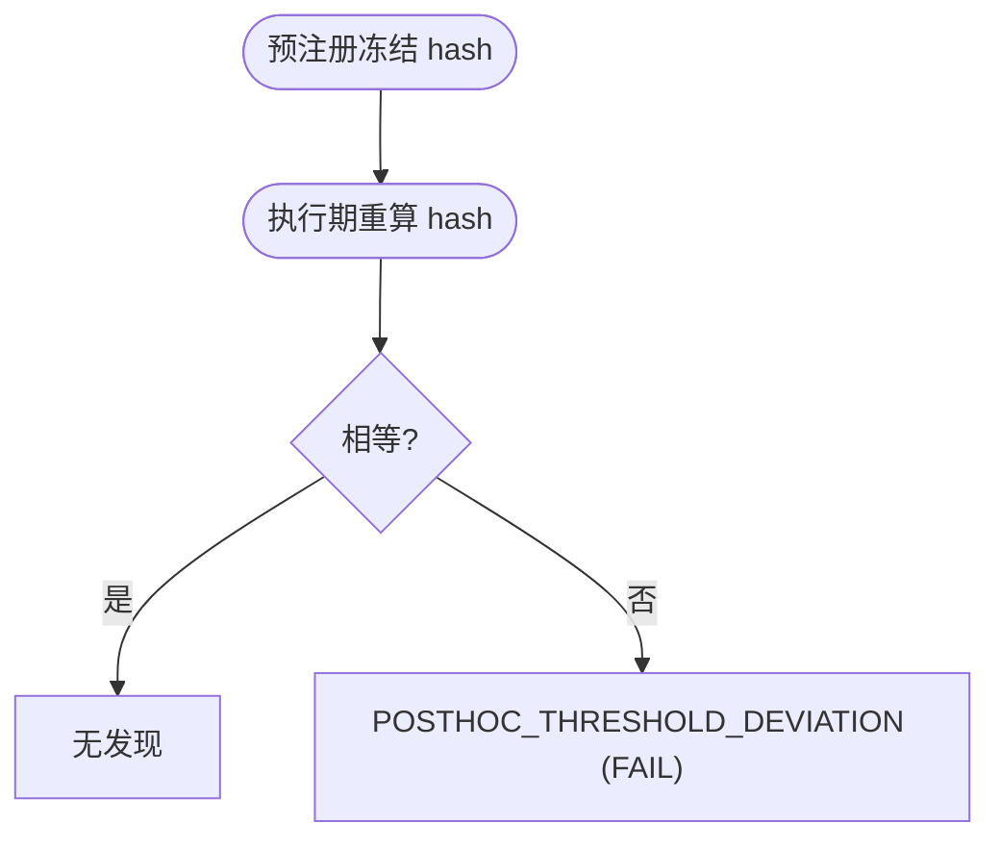
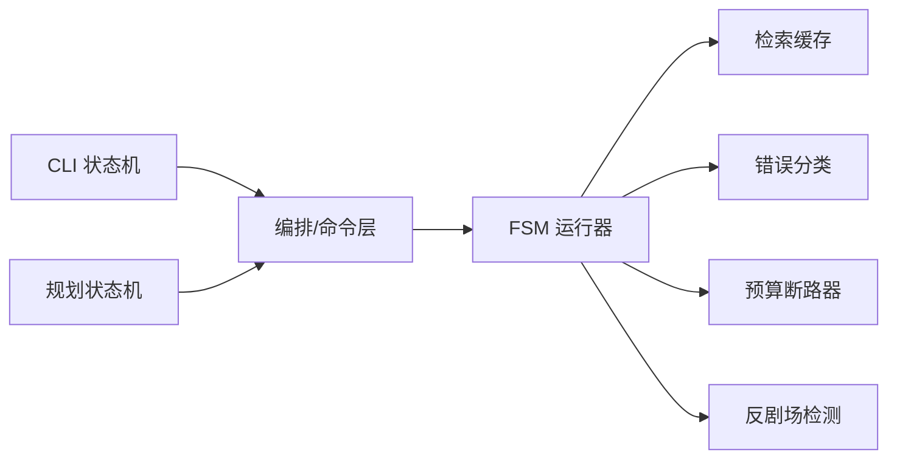

# 状态管理

<cite>
**本文引用的文件**
- [src/cli/state_machine.ts](file://src/cli/state_machine.ts)
- [src/planning/state_machine.ts](file://src/planning/state_machine.ts)
- [src/agent_loop/fsm_runner.ts](file://src/agent_loop/fsm_runner.ts)
- [src/retrieval/cache.ts](file://src/retrieval/cache.ts)
- [src/platform/errors.ts](file://src/platform/errors.ts)
- [src/llm_gateway/budget.ts](file://src/llm_gateway/budget.ts)
- [src/anti_theater/detectors/posthoc_threshold.ts](file://src/anti_theater/detectors/posthoc_threshold.ts)
- [tests/retrieval/http_hardening.test.ts](file://tests/retrieval/http_hardening.test.ts)
- [tests/db/dr.test.ts](file://tests/db/dr.test.ts)
- [tests/evidence_log/append_verify.test.ts](file://tests/evidence_log/append_verify.test.ts)
- [tests/campaign/checkpoint_recovery.test.ts](file://tests/campaign/checkpoint_recovery.test.ts)
</cite>

## 目录
1. [简介](#简介)
2. [项目结构](#项目结构)
3. [核心组件](#核心组件)
4. [架构总览](#架构总览)
5. [详细组件分析](#详细组件分析)
6. [依赖关系分析](#依赖关系分析)
7. [性能考量](#性能考量)
8. [故障排查指南](#故障排查指南)
9. [结论](#结论)
10. [附录](#附录)

## 简介
本文件围绕仓库中的“状态管理系统”进行系统化说明，覆盖全局状态与本地状态的管理策略、数据类型与接口规范、状态更新模式与数据流设计、异步处理与错误边界、持久化与缓存机制、同步与冲突解决策略，以及调试监控工具与最佳实践。该系统的核心由两部分组成：
- 确定性状态机（CLI 与规划阶段）：以纯函数定义合法转移，确保协议一致性与可审计性。
- 运行时状态与资源控制：通过收据链、预算断路器、恢复存储与缓存等机制，保障长流程的可靠性、可恢复性与安全性。

## 项目结构
状态管理相关代码主要分布在以下模块：
- CLI 状态机：定义 9 阶段 CLI 协议的状态与事件，提供转移判定。
- 规划状态机：定义分析→计划→执行→验证→评审→报告的生命周期，支持 full/compressed 两种模式。
- 运行器与恢复：在 FSM 运行过程中维护收据链、血缘校验与跨进程恢复。
- 缓存与持久化：检索响应按内容寻址持久化，带 TTL、密钥检测与原子写入。
- 错误分类与重试：统一错误类别与可重试判定，配合网络层退避与速率限制。
- 预算控制：对 tokens、时长、循环次数进行硬断路，超限即停。

图表来源
- [src/cli/state_machine.ts:6-105](file://src/cli/state_machine.ts#L6-L105)
- [src/planning/state_machine.ts:16-92](file://src/planning/state_machine.ts#L16-L92)
- [src/agent_loop/fsm_runner.ts:319-344](file://src/agent_loop/fsm_runner.ts#L319-L344)
- [src/retrieval/cache.ts:99-165](file://src/retrieval/cache.ts#L99-L165)
- [src/platform/errors.ts:24-52](file://src/platform/errors.ts#L24-L52)
- [src/llm_gateway/budget.ts:18-33](file://src/llm_gateway/budget.ts#L18-L33)
- [src/anti_theater/detectors/posthoc_threshold.ts:1-22](file://src/anti_theater/detectors/posthoc_threshold.ts#L1-L22)

章节来源
- [src/cli/state_machine.ts:6-105](file://src/cli/state_machine.ts#L6-L105)
- [src/planning/state_machine.ts:16-92](file://src/planning/state_machine.ts#L16-L92)
- [src/agent_loop/fsm_runner.ts:319-344](file://src/agent_loop/fsm_runner.ts#L319-L344)
- [src/retrieval/cache.ts:99-165](file://src/retrieval/cache.ts#L99-L165)
- [src/platform/errors.ts:24-52](file://src/platform/errors.ts#L24-L52)
- [src/llm_gateway/budget.ts:18-33](file://src/llm_gateway/budget.ts#L18-L33)
- [src/anti_theater/detectors/posthoc_threshold.ts:1-22](file://src/anti_theater/detectors/posthoc_threshold.ts#L1-L22)

## 核心组件
- CLI 状态机：定义 9 个状态与事件集合，提供 isCliState/isCliEvent 校验与 transition(current, event) 转移函数；非法转移返回协议偏差错误并附带上下文。
- 规划状态机：定义 ANALYZE→PLAN→EXECUTE→VERIFY→REVIEW→REPORT 的阶段链，支持 full（仅相邻推进）与 compressed（允许正向跳跃但禁止回退）两种模式；提供 allowedNextStages 与 isValidStageChain。
- 运行器与恢复：在运行中打开恢复存储，校验收据链头与证据库一致性，防止“空心续跑”；跨 resume 延续墙钟计时，避免重置导致预算误判。
- 检索缓存：基于 URL 的 sha256 文件名，持久化响应信封（含原始 retrievedAt），按主机 TTL 过期；写入前检测密钥形状，失败时回退到网络请求。
- 错误分类：将错误分为 transient/permanent/degraded/policy_blocked/invalid_input/unsupported_version/budget_exhausted/fatal_integrity，并提供 retryableFor 推导是否可重试。
- 预算断路器：以 BudgetProfile 约束 tokens、duration_ms、loops；默认开启宽松预算，超限 fail-closed 并上报 COST_BUDGET_EXCEEDED。

章节来源
- [src/cli/state_machine.ts:6-150](file://src/cli/state_machine.ts#L6-L150)
- [src/planning/state_machine.ts:16-104](file://src/planning/state_machine.ts#L16-L104)
- [src/agent_loop/fsm_runner.ts:319-344](file://src/agent_loop/fsm_runner.ts#L319-L344)
- [src/retrieval/cache.ts:99-165](file://src/retrieval/cache.ts#L99-L165)
- [src/platform/errors.ts:24-52](file://src/platform/errors.ts#L24-L52)
- [src/llm_gateway/budget.ts:18-33](file://src/llm_gateway/budget.ts#L18-L33)

## 架构总览
下图展示了状态机驱动的运行流程：CLI 与规划状态机作为“协议层”，FSM 运行器作为“控制层”，结合缓存、错误分类与预算控制形成“运行时层”。

图表来源
- [src/cli/state_machine.ts:122-150](file://src/cli/state_machine.ts#L122-L150)
- [src/planning/state_machine.ts:55-92](file://src/planning/state_machine.ts#L55-L92)
- [src/agent_loop/fsm_runner.ts:319-344](file://src/agent_loop/fsm_runner.ts#L319-L344)
- [src/retrieval/cache.ts:117-165](file://src/retrieval/cache.ts#L117-L165)
- [src/platform/errors.ts:24-52](file://src/platform/errors.ts#L24-L52)
- [src/llm_gateway/budget.ts:18-33](file://src/llm_gateway/budget.ts#L18-L33)

## 详细组件分析

### CLI 状态机（9 阶段协议）
- 状态与事件：明确定义 CLI_STATES 与 CLI_EVENTS，包含前进与回退（seal 前）事件。
- 转移规则：通过 legalTransitions Map 限定合法目标；transition 函数实现 fail-closed，非法转移返回 PROTOCOL_DEVIATION_CRITICAL 并携带 from/attempted。
- 类型安全：isCliState/isCliEvent 用于输入校验，避免非法字符串进入状态机。

图表来源
- [src/cli/state_machine.ts:72-105](file://src/cli/state_machine.ts#L72-L105)
- [src/cli/state_machine.ts:122-150](file://src/cli/state_machine.ts#L122-L150)

章节来源
- [src/cli/state_machine.ts:6-150](file://src/cli/state_machine.ts#L6-L150)

### 规划状态机（生命周期压缩与校验）
- 阶段链：ANALYZE→PLAN→EXECUTE→VERIFY→REVIEW→REPORT，支持 REPORT→ANALYZE 循环。
- 模式：full 仅允许相邻推进；compressed 允许正向跳跃但禁止回退。
- 辅助：allowedNextStages 输出决策树可用去向；isValidStageChain 校验整条阶段序列合法性。

图表来源
- [src/planning/state_machine.ts:29-92](file://src/planning/state_machine.ts#L29-L92)

章节来源
- [src/planning/state_machine.ts:16-104](file://src/planning/state_machine.ts#L16-L104)

### 运行器与恢复（收据链与血缘校验）
- 恢复存储：可选打开 resumeStore，读取 lastReceipt，校验 lineageHead 与证据库链一致性，防止“空心裁决攻击”。
- 跨 resume 延续：墙钟计时不清零，保证 duration 预算跨进程连续计算。
- 失败闭合：血缘不符直接抛出伪造收据错误，拒绝续跑。

图表来源
- [src/agent_loop/fsm_runner.ts:319-344](file://src/agent_loop/fsm_runner.ts#L319-L344)

章节来源
- [src/agent_loop/fsm_runner.ts:319-344](file://src/agent_loop/fsm_runner.ts#L319-L344)

### 检索缓存（内容寻址与 TTL）
- 内容寻址：文件名 = sha256(url)，用户文本不进入路径，防注入。
- 信封结构：记录 url/host/status/body/retrievedAt/storedAt，命中时回放原始 retrievedAt，保证 idempotent grounding。
- TTL：按主机配置不同过期时间；过期视为 miss。
- 安全：写入前检测密钥形状，发现则拒绝落盘并告警。
- 原子写入：先写临时文件再 rename，兼容 Windows 锁竞争。

图表来源
- [src/retrieval/cache.ts:99-165](file://src/retrieval/cache.ts#L99-L165)

章节来源
- [src/retrieval/cache.ts:99-165](file://src/retrieval/cache.ts#L99-L165)
- [tests/retrieval/http_hardening.test.ts:184-231](file://tests/retrieval/http_hardening.test.ts#L184-L231)

### 错误分类与重试策略
- 错误类别：transient、permanent、degraded、policy_blocked、invalid_input、unsupported_version、budget_exhausted、fatal_integrity。
- 可重试推导：retryableFor 根据类别决定；degraded/transient 可重试，其余通常不可重试。
- 网络层集成：测试覆盖 429/503 的 Retry-After 与全抖动退避；永久错误（如 404）不重试；速率限制剩余为 0 时本地拒绝后续请求。

图表来源
- [src/platform/errors.ts:24-52](file://src/platform/errors.ts#L24-L52)
- [tests/retrieval/http_hardening.test.ts:65-181](file://tests/retrieval/http_hardening.test.ts#L65-L181)

章节来源
- [src/platform/errors.ts:24-52](file://src/platform/errors.ts#L24-L52)
- [tests/retrieval/http_hardening.test.ts:65-181](file://tests/retrieval/http_hardening.test.ts#L65-L181)

### 预算断路器（tokens/时长/循环）
- 预算配置：BudgetProfile 包含 maxTokens/maxDurationMs/maxLoops；默认宽松值，显式传 null 关闭。
- 计量来源：基于 call_records.usage_tokens_total 真实记录；与循环侧 tokensConsumed 同口径。
- 行为：超限必停（fail-closed），上报 COST_BUDGET_EXCEEDED，不静默继续。

图表来源
- [src/llm_gateway/budget.ts:18-33](file://src/llm_gateway/budget.ts#L18-L33)

章节来源
- [src/llm_gateway/budget.ts:18-33](file://src/llm_gateway/budget.ts#L18-L33)

### 反剧场物证（阈值冻结）
- 威胁模型：假设封存后篡改阈值方向/语义以“刚好通过”。
- 防线：预注册时冻结 thresholdHash；执行期用 FEC 当前声明重新计算并比对，不等则发出 POSTHOC_THRESHOLD_DEVIATION（FAIL）。
- 确定性：纯函数、不读 FS/网络、不修改输入。

图表来源
- [src/anti_theater/detectors/posthoc_threshold.ts:1-22](file://src/anti_theater/detectors/posthoc_threshold.ts#L1-L22)

章节来源
- [src/anti_theater/detectors/posthoc_threshold.ts:1-22](file://src/anti_theater/detectors/posthoc_threshold.ts#L1-L22)

## 依赖关系分析
- CLI 状态机与规划状态机相互独立，分别负责 CLI 协议与任务生命周期；两者共同被上层编排调用。
- FSM 运行器依赖恢复存储、证据库、预算与错误分类；同时使用缓存减少外部 API 消耗。
- 缓存与网络层通过错误分类协同，实现退避与速率限制；预算断路器在运行器内横向切面保护。
- 反剧场检测在证据生成链路中作为质量门控，影响最终裁决可信度。

图表来源
- [src/cli/state_machine.ts:6-150](file://src/cli/state_machine.ts#L6-L150)
- [src/planning/state_machine.ts:16-104](file://src/planning/state_machine.ts#L16-L104)
- [src/agent_loop/fsm_runner.ts:319-344](file://src/agent_loop/fsm_runner.ts#L319-L344)
- [src/retrieval/cache.ts:99-165](file://src/retrieval/cache.ts#L99-L165)
- [src/platform/errors.ts:24-52](file://src/platform/errors.ts#L24-L52)
- [src/llm_gateway/budget.ts:18-33](file://src/llm_gateway/budget.ts#L18-L33)
- [src/anti_theater/detectors/posthoc_threshold.ts:1-22](file://src/anti_theater/detectors/posthoc_threshold.ts#L1-L22)

章节来源
- [src/cli/state_machine.ts:6-150](file://src/cli/state_machine.ts#L6-L150)
- [src/planning/state_machine.ts:16-104](file://src/planning/state_machine.ts#L16-L104)
- [src/agent_loop/fsm_runner.ts:319-344](file://src/agent_loop/fsm_runner.ts#L319-L344)
- [src/retrieval/cache.ts:99-165](file://src/retrieval/cache.ts#L99-L165)
- [src/platform/errors.ts:24-52](file://src/platform/errors.ts#L24-L52)
- [src/llm_gateway/budget.ts:18-33](file://src/llm_gateway/budget.ts#L18-L33)
- [src/anti_theater/detectors/posthoc_threshold.ts:1-22](file://src/anti_theater/detectors/posthoc_threshold.ts#L1-L22)

## 性能考量
- 状态机判定为 O(1) 查找（Map/Set），开销极低。
- 缓存命中可显著降低外部 API 调用与预算消耗；TTL 按源差异化设置，平衡新鲜度与成本。
- 预算断路器在关键路径上快速短路，避免无效计算。
- 恢复存储与血缘校验仅在 resume 路径触发，避免常态开销。
- 网络层退避与速率限制保护后端并减少重试风暴。

[本节为通用指导，不直接分析具体文件]

## 故障排查指南
- 非法状态转移：检查 CLI/规划状态机的 allowedNext 与 mode；确认事件与阶段命名正确。
- 恢复失败/血缘不符：核对 resumeStore.lastReceipt 的 lineageHead 与证据库链是否一致；若不一致，拒绝续跑。
- 缓存命中异常：确认 URL 一致、TTL 未过期、磁盘可读；检查密钥形状拦截导致的拒绝落盘。
- 预算耗尽：查看 tokens/duration/loops 累计与阈值；必要时调整 BudgetProfile 或缩减范围。
- 网络错误与限流：关注 429/503 的 Retry-After 与 jitter；当速率限制剩余为 0 时本地拒绝后续请求。
- 备份与恢复：DR receipt 的 sha256 与表计数锚点必须匹配；保留策略清理需成对删除备份与 receipt。

章节来源
- [src/cli/state_machine.ts:122-150](file://src/cli/state_machine.ts#L122-L150)
- [src/planning/state_machine.ts:55-92](file://src/planning/state_machine.ts#L55-L92)
- [src/agent_loop/fsm_runner.ts:319-344](file://src/agent_loop/fsm_runner.ts#L319-L344)
- [src/retrieval/cache.ts:117-165](file://src/retrieval/cache.ts#L117-L165)
- [src/platform/errors.ts:24-52](file://src/platform/errors.ts#L24-L52)
- [tests/retrieval/http_hardening.test.ts:65-181](file://tests/retrieval/http_hardening.test.ts#L65-L181)
- [tests/db/dr.test.ts:43-156](file://tests/db/dr.test.ts#L43-L156)

## 结论
本状态管理系统以“确定性状态机 + 运行时护栏”为核心：通过严格定义的转移规则与错误分类，确保流程可审计、可恢复、可控；借助内容寻址缓存与预算断路器，在保证正确性的前提下优化成本与性能；通过收据链与反剧场检测，强化证据链可信度。建议在生产环境中启用默认预算、合理配置缓存 TTL，并结合 DR 备份与恢复演练提升韧性。

[本节为总结，不直接分析具体文件]

## 附录
- 全局状态 vs 本地状态
  - 全局状态：CLI/规划状态、收据链头、预算累计、缓存命中率等，跨组件共享并由状态机与运行器维护。
  - 本地状态：单阶段内部中间结果、临时变量，生命周期短且不暴露到外部。
- 数据类型与接口规范
  - CLI 状态/事件常量与 TransitionResult；规划阶段与 StateMachineMode；CacheEnvelope；BudgetProfile；错误类别与 retryableFor。
- 状态更新模式与数据流
  - 事件驱动的状态转移；阶段推进后的收据写入与血缘校验；缓存存取与 TTL 管理；预算累计与熔断。
- 异步处理与错误边界
  - 网络层退避与速率限制；错误分类驱动的 retryableFor；预算超限 fail-closed；血缘不符拒绝续跑。
- 持久化与缓存
  - 内容寻址缓存、原子写入、密钥检测；DR 备份与 receipt 校验、保留策略。
- 同步与冲突解决
  - 收据链头校验防止并发/重放；缓存 TTL 避免陈旧数据；预算维度避免资源争用。
- 调试与监控
  - 通过 allowedNextStages 渲染决策树；观察缓存 hits 与网络调用次数；检查预算累计与错误类别分布；DR receipt 校验。
- 最佳实践与优化
  - 始终使用状态机校验转移；启用默认预算；合理设置缓存 TTL；定期备份与恢复演练；利用错误分类统一处理。

[本节为概念性补充，不直接分析具体文件]