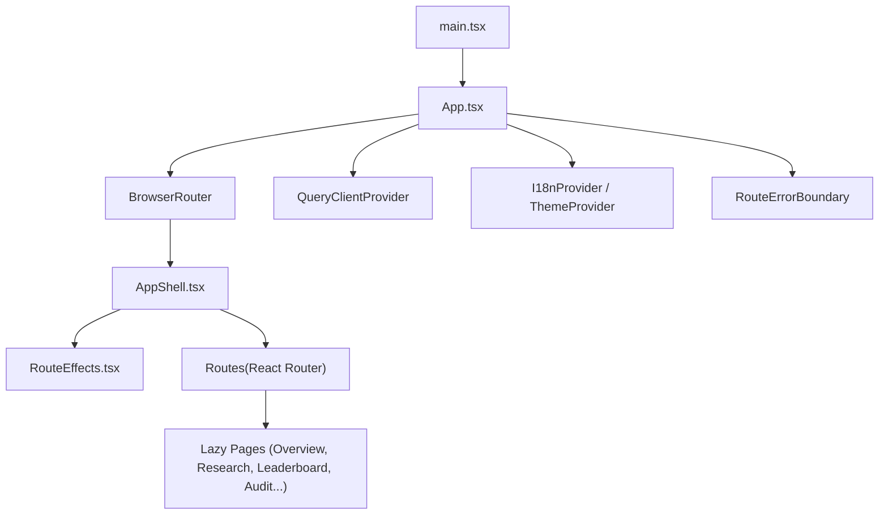
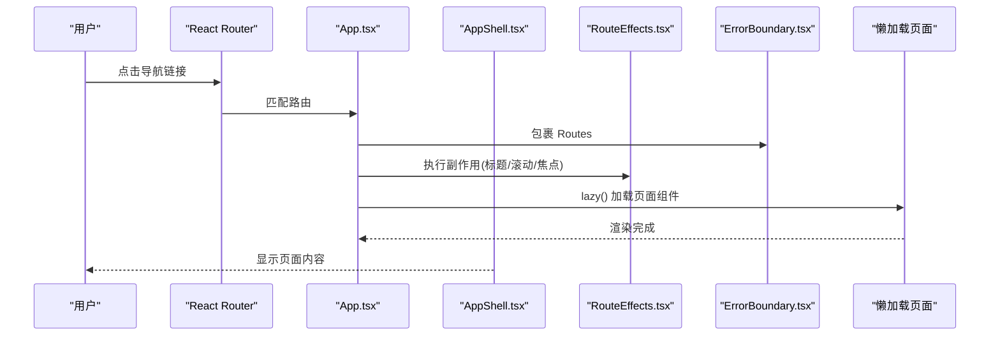
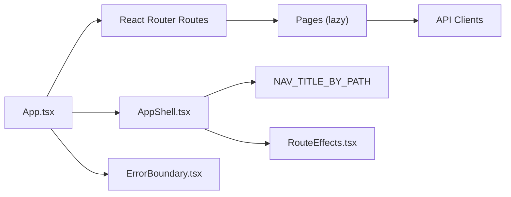

# 页面与路由

<cite>
**本文引用的文件**
- [App.tsx](file://frontend/src/App.tsx)
- [main.tsx](file://frontend/src/main.tsx)
- [AppShell.tsx](file://frontend/src/components/layout/AppShell.tsx)
- [RouteEffects.tsx](file://frontend/src/components/RouteEffects.tsx)
- [ErrorBoundary.tsx](file://frontend/src/components/ErrorBoundary.tsx)
- [OverviewPage.tsx](file://frontend/src/pages/OverviewPage.tsx)
- [ResearchWorkbenchPage.tsx](file://frontend/src/pages/ResearchWorkbenchPage.tsx)
- [LeaderboardPage.tsx](file://frontend/src/pages/LeaderboardPage.tsx)
- [AuditTracePage.tsx](file://frontend/src/pages/AuditTracePage.tsx)
</cite>

## 目录
1. [简介](#简介)
2. [项目结构](#项目结构)
3. [核心组件](#核心组件)
4. [架构总览](#架构总览)
5. [详细组件分析](#详细组件分析)
6. [依赖关系分析](#依赖关系分析)
7. [性能考虑](#性能考虑)
8. [故障排查指南](#故障排查指南)
9. [结论](#结论)
10. [附录](#附录)

## 简介
本文件聚焦前端“页面与路由系统”，覆盖以下目标：
- 所有页面的功能与用途（概览、验证、审计、排行榜等）
- 路由配置与页面切换逻辑
- 页面间数据传递与状态同步机制
- 页面加载优化与懒加载策略
- 页面级错误处理与用户反馈
- 页面权限控制与访问控制
- 页面 SEO 优化与元数据管理
- 页面测试策略与调试方法

该应用基于 React + React Router v7，采用按路由拆分代码的懒加载模式，配合全局错误边界、滚动记忆、标题同步等跨切面能力，提供稳定、可访问、可维护的前端体验。

## 项目结构
- 入口与根容器
  - main.tsx 挂载 React 根节点并渲染 App
  - App.tsx 定义路由表、懒加载各页面、全局 QueryClient、I18n/Theme 上下文、错误边界与 Shell
- 布局与导航
  - AppShell.tsx 提供顶部导航、工具下拉、移动端抽屉、主题与语言切换，集中信息架构分组（科研主流程 vs 信任与验证工具）
- 路由效果
  - RouteEffects.tsx 统一处理滚动到顶、滚动记忆恢复、焦点管理、文档标题设置
- 错误边界
  - ErrorBoundary.tsx 捕获未处理的渲染/懒加载错误，提供重试与重载恢复
- 页面集合
  - pages/* 包含全部业务页面（概览、工作台、排行榜、审计追溯等），均通过 React.lazy 按需加载

图表来源
- [main.tsx:1-16](file://frontend/src/main.tsx#L1-L16)
- [App.tsx:1-110](file://frontend/src/App.tsx#L1-L110)
- [AppShell.tsx:1-423](file://frontend/src/components/layout/AppShell.tsx#L1-L423)
- [RouteEffects.tsx:1-102](file://frontend/src/components/RouteEffects.tsx#L1-L102)
- [ErrorBoundary.tsx:1-135](file://frontend/src/components/ErrorBoundary.tsx#L1-L135)

章节来源
- [main.tsx:1-16](file://frontend/src/main.tsx#L1-L16)
- [App.tsx:1-110](file://frontend/src/App.tsx#L1-L110)

## 核心组件
- 路由与懒加载
  - 使用 React.lazy 对每个页面进行代码分割，首屏仅加载必要资源；Suspense 提供加载占位
  - 根路由 / 重定向到 /research，确保单一规范 URL
- 全局上下文
  - QueryClientProvider 提供请求缓存与失效策略
  - I18nProvider 提供多语言支持
  - ThemeProvider 提供明暗主题
- 错误边界
  - RouteErrorBoundary 绑定当前路由路径，导航时自动重置错误状态，避免单页崩溃影响其他页面
- 导航壳层
  - AppShell 将导航分为“科研主流程”和“信任与验证工具”两组，桌面端工具折叠为下拉面板，移动端为抽屉，保证在任何视口下无横向滚动

章节来源
- [App.tsx:1-110](file://frontend/src/App.tsx#L1-L110)
- [AppShell.tsx:1-423](file://frontend/src/components/layout/AppShell.tsx#L1-L423)
- [ErrorBoundary.tsx:1-135](file://frontend/src/components/ErrorBoundary.tsx#L1-L135)

## 架构总览
下图展示路由、Shell、错误边界与懒加载页面的协作关系，以及跨切面效果（标题、滚动、焦点）。

图表来源
- [App.tsx:1-110](file://frontend/src/App.tsx#L1-L110)
- [AppShell.tsx:1-423](file://frontend/src/components/layout/AppShell.tsx#L1-L423)
- [RouteEffects.tsx:1-102](file://frontend/src/components/RouteEffects.tsx#L1-L102)
- [ErrorBoundary.tsx:1-135](file://frontend/src/components/ErrorBoundary.tsx#L1-L135)

## 详细组件分析

### 路由配置与页面切换
- 路由表
  - 根路径 / 重定向至 /research
  - 主要页面路由包括 /research、/overview、/viz、/integrity、/leaderboard、/court、/arena、/honesty、/ablation、/report、/about、/planning、/versions、/wizard、/v2-receipt、/events、/audit
  - 未知路由 * 指向 404 页面
- 懒加载
  - 所有页面通过 React.lazy 引入，首次进入才下载对应 chunk
  - Suspense 提供统一的加载态 UI
- 切换行为
  - RouteEffects 在每次 PUSH/REPLACE 导航时将滚动位置复位到顶部；POP 导航（前进/后退）恢复上次滚动位置
  - 焦点管理：当由导航触发且目标路径变化时，将焦点移动到 #main-content，提升键盘与读屏体验
  - 标题管理：根据 NAV_TITLE_BY_PATH 映射生成带 i18n 的文档标题，避免多维护导致漂移

章节来源
- [App.tsx:1-110](file://frontend/src/App.tsx#L1-L110)
- [RouteEffects.tsx:1-102](file://frontend/src/components/RouteEffects.tsx#L1-L102)
- [AppShell.tsx:1-423](file://frontend/src/components/layout/AppShell.tsx#L1-L423)

### 页面清单与用途
- 概览页 /overview
  - 快速入口卡片（工作台、向导、V2 收据、可视化、完整性）
  - 系统健康卡（调用 /health）
  - 最近收据列表（调用 /api/v1/receipts）
  - 空态引导与样例卡片，引导用户开始验证
- 研究工作台 /research
  - 新建研究（POST /api/v1/research，202 异步契约）
  - 实时进度面板（SSE 事件 + 轮询降级，诚实标注 liveDegraded）
  - 冻结运行视图（运行摘要、假设比较、计划、分析、修订时间线、评估指标）
  - 取消进行中运行、失败与取消状态提示
- 排行榜 /leaderboard
  - 套件级 Merkle 根展示与浏览器侧独立重算校验
  - 裁决分布、领域分布、问题明细表
  - 诚实声明区（非科学排名，工程完整性广度）
- 审计追溯 /audit
  - 输入 hypothesis/claim ID，三路 API 消费：裁决节点、证据链、生命周期事件
  - 血缘流程可视化（Hypothesis → Evidence Chain → Verdict → Lifecycle）
  - 无数据时明确“未找到”，不伪造演示数据

章节来源
- [OverviewPage.tsx:1-211](file://frontend/src/pages/OverviewPage.tsx#L1-L211)
- [ResearchWorkbenchPage.tsx:1-800](file://frontend/src/pages/ResearchWorkbenchPage.tsx#L1-L800)
- [LeaderboardPage.tsx:1-612](file://frontend/src/pages/LeaderboardPage.tsx#L1-L612)
- [AuditTracePage.tsx:1-244](file://frontend/src/pages/AuditTracePage.tsx#L1-L244)

### 页面间数据传递与状态同步
- 查询缓存与失效
  - 使用 @tanstack/react-query 的 QueryClient 统一管理请求缓存、重试、staleTime 等
  - 关键场景：研究终态事件后主动 invalidateQueries，确保轮询通道立即刷新最新状态
- 路由参数共享
  - 通过 useSearchParams 读取 runId 等参数，实现“分享链接直达进行中运行”的能力
- SSE 与轮询协同
  - 研究进度优先使用 SSE 实时事件；连续两次出错则降级为仅轮询，并在界面诚实标注
- 跨页面一致性
  - 导航时统一滚动与焦点管理，避免状态不一致导致的体验问题

章节来源
- [App.tsx:35-43](file://frontend/src/App.tsx#L35-L43)
- [ResearchWorkbenchPage.tsx:376-489](file://frontend/src/pages/ResearchWorkbenchPage.tsx#L376-L489)
- [RouteEffects.tsx:50-98](file://frontend/src/components/RouteEffects.tsx#L50-L98)

### 页面加载优化与懒加载策略
- 路由级代码分割
  - 每个页面单独 lazy()，大依赖（如 d3）隔离到具体页面，不进入初始包
- 供应商库拆分
  - 通过构建配置 manualChunks 进一步拆分第三方库，提高缓存命中率
- 加载态与回退
  - Suspense fallback 提供轻量旋转指示器，避免白屏
- 首屏最小化
  - 默认路由 / 重定向到 /research，减少无关首屏资源

章节来源
- [App.tsx:11-33](file://frontend/src/App.tsx#L11-L33)
- [App.tsx:45-56](file://frontend/src/App.tsx#L45-L56)

### 页面级错误处理与用户反馈
- 错误边界
  - 捕获懒加载失败、渲染异常、事件处理器抛出的未处理错误
  - 提供“重试”与“重新加载”两种恢复方式；导航离开自动清除错误，避免全局冻结
- 页面内错误展示
  - 健康检查、收据列表、研究运行、排行榜等均提供 loading/error/empty 状态
  - 研究进度面板诚实标注 SSE 降级、失败原因、取消提示
- 无障碍与可读性
  - 错误区域使用 alert role，图标 aria-hidden，按钮具备 aria-label

章节来源
- [ErrorBoundary.tsx:1-135](file://frontend/src/components/ErrorBoundary.tsx#L1-L135)
- [OverviewPage.tsx:43-80](file://frontend/src/pages/OverviewPage.tsx#L43-L80)
- [ResearchWorkbenchPage.tsx:186-350](file://frontend/src/pages/ResearchWorkbenchPage.tsx#L186-L350)
- [LeaderboardPage.tsx:566-612](file://frontend/src/pages/LeaderboardPage.tsx#L566-L612)

### 页面权限控制与访问控制
- 当前路由与页面未实现显式鉴权拦截（如角色/令牌校验）
- 建议实践
  - 在路由层增加守卫（例如高阶组件或自定义 RouteWrapper），在进入敏感页面前校验身份/权限
  - 结合后端接口返回的 401/403 做统一跳转与提示
  - 对需要认证的路由，在未登录时重定向到登录页并记录原目标地址

[本节为通用建议，不直接引用具体源码]

### 页面 SEO 优化与元数据管理
- 文档标题
  - RouteEffects 根据导航表动态设置 document.title，支持 i18n，避免多维护导致标题漂移
- 语义化与可访问性
  - 页面头部使用 h1/h2 层级清晰，导航使用 nav，主要内容区域有 id="main-content" 便于焦点定位
- 建议补充
  - 在 index.html 中配置 meta 描述、关键词、Open Graph 标签
  - 为重要页面添加结构化数据（JSON-LD）以提升搜索引擎理解

章节来源
- [RouteEffects.tsx:94-98](file://frontend/src/components/RouteEffects.tsx#L94-L98)
- [AppShell.tsx:274-288](file://frontend/src/components/layout/AppShell.tsx#L274-L288)

### 页面测试策略与调试方法
- 测试策略
  - 使用 Testing Library 对页面交互进行断言（按钮点击、表单提交、状态切换）
  - 利用 data-testid 定位关键元素（如 quick-research、run-progress、leaderboard-page）
  - 对懒加载页面，确保 Suspense 与路由切换在测试环境中正确模拟
- 调试方法
  - 开发阶段开启 React StrictMode 以尽早发现潜在问题
  - 关注控制台错误输出（ErrorBoundary 会打印堆栈）
  - 使用浏览器网络面板观察懒加载 chunk 与 API 请求
  - 针对研究进度，检查 SSE 连接与轮询降级逻辑

章节来源
- [ErrorBoundary.tsx:52-57](file://frontend/src/components/ErrorBoundary.tsx#L52-L57)
- [OverviewPage.tsx:144-211](file://frontend/src/pages/OverviewPage.tsx#L144-L211)
- [ResearchWorkbenchPage.tsx:427-463](file://frontend/src/pages/ResearchWorkbenchPage.tsx#L427-L463)
- [LeaderboardPage.tsx:566-612](file://frontend/src/pages/LeaderboardPage.tsx#L566-L612)

## 依赖关系分析
- 路由与页面
  - App.tsx 集中声明路由与懒加载依赖
  - AppShell.tsx 提供导航项与标题映射，供 RouteEffects 使用
- 跨切面
  - RouteEffects 依赖 react-router-dom 的 location/navigationType
  - ErrorBoundary 依赖 react-router-dom 的 useLocation 以感知路由变化
- 页面与数据
  - OverviewPage 依赖 api_client 的健康与收据接口
  - ResearchWorkbenchPage 依赖 research_client 的研究工作流接口与 SSE
  - LeaderboardPage 依赖 benchmark 接口与 merkle 计算
  - AuditTracePage 依赖 verdict/evidence/lifecycle 接口

图表来源
- [App.tsx:1-110](file://frontend/src/App.tsx#L1-L110)
- [AppShell.tsx:94-106](file://frontend/src/components/layout/AppShell.tsx#L94-L106)
- [RouteEffects.tsx:1-102](file://frontend/src/components/RouteEffects.tsx#L1-L102)
- [ErrorBoundary.tsx:1-135](file://frontend/src/components/ErrorBoundary.tsx#L1-L135)

章节来源
- [App.tsx:1-110](file://frontend/src/App.tsx#L1-L110)
- [AppShell.tsx:1-423](file://frontend/src/components/layout/AppShell.tsx#L1-L423)
- [RouteEffects.tsx:1-102](file://frontend/src/components/RouteEffects.tsx#L1-L102)
- [ErrorBoundary.tsx:1-135](file://frontend/src/components/ErrorBoundary.tsx#L1-L135)

## 性能考虑
- 首屏体积
  - 路由级懒加载隔离大依赖（d3 等），降低初始包大小
- 缓存策略
  - 通过 manualChunks 拆分 vendor 库，提升浏览器缓存命中
- 运行时性能
  - 研究进度使用 SSE 实时推送，失败时降级为轮询，避免阻塞 UI
  - QueryClient 配置合理的 staleTime 与 refetchOnWindowFocus，减少不必要请求
- 可访问性
  - 滚动记忆与焦点管理提升长页面体验，符合 WCAG 相关原则

[本节为通用指导，不直接引用具体源码]

## 故障排查指南
- 懒加载失败
  - 现象：路由切换后出现错误边界提示
  - 处理：点击“Reload page”获取最新资源；检查部署版本与 chunk 是否一致
- 研究进度无更新
  - 现象：SSE 连接失败，界面显示降级提示
  - 处理：确认网络与后端事件服务；等待轮询刷新；查看 statusError 行
- 排行榜校验失败
  - 现象：SuiteVerifier 显示不匹配
  - 处理：检查 entries 与 suiteIntegrityRoot；可使用“篡改剧场”按钮复现差异
- 审计追溯无结果
  - 现象：输入 ID 后显示“未找到追溯数据”
  - 处理：确认 hypothesis/claim ID 是否正确；检查后端是否存在对应数据

章节来源
- [ErrorBoundary.tsx:80-123](file://frontend/src/components/ErrorBoundary.tsx#L80-L123)
- [ResearchWorkbenchPage.tsx:427-463](file://frontend/src/pages/ResearchWorkbenchPage.tsx#L427-L463)
- [LeaderboardPage.tsx:164-284](file://frontend/src/pages/LeaderboardPage.tsx#L164-L284)
- [AuditTracePage.tsx:104-112](file://frontend/src/pages/AuditTracePage.tsx#L104-L112)

## 结论
该前端通过 React Router 与 React.lazy 实现了清晰的页面与路由体系，配合全局错误边界、滚动记忆、标题同步等跨切面能力，提供了稳定、可访问、易维护的用户体验。页面职责明确，数据流清晰，错误处理诚实透明。建议在后续迭代中补充路由级权限控制与更完善的 SEO 元数据，进一步提升安全性与可发现性。

## 附录
- 常用测试标识
  - overview-page、quick-research、recent-receipts、run-progress、leaderboard-page、suite-verifier、entry-*、error-boundary-fallback
- 关键路由
  - /research（研究工作台）、/overview（概览）、/leaderboard（排行榜）、/audit（审计追溯）、/viz（可视化）、/integrity（完整性）、/court（法庭）、/arena（竞技场）、/honesty（诚信墙）、/ablation（消融）、/report（报告）、/about（关于）、/planning（规划）、/versions（版本比较）、/wizard（向导）、/v2-receipt（V2 收据）、/events（事件流）

[本节为参考信息，不直接引用具体源码]