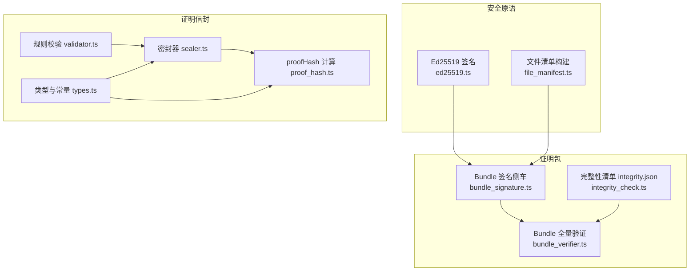
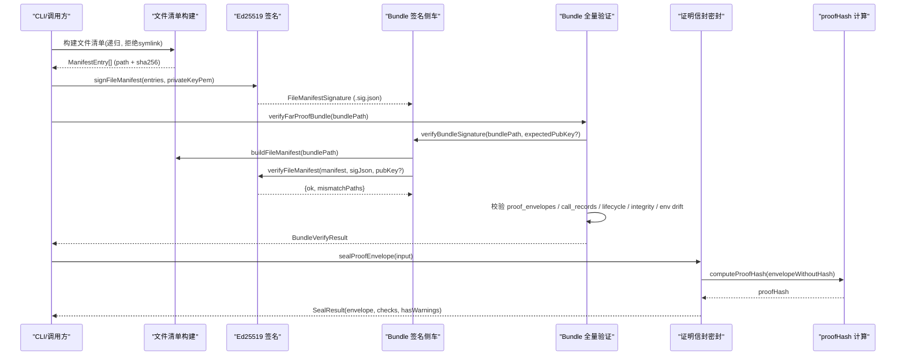
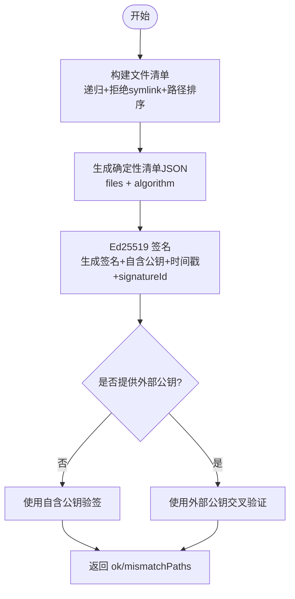
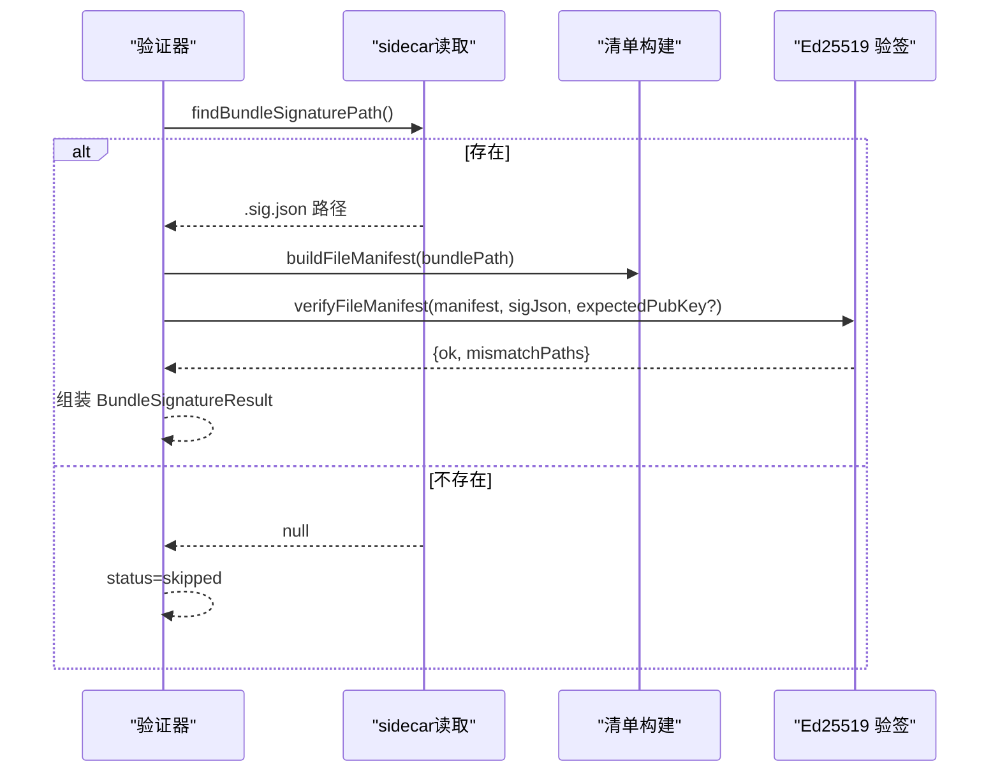
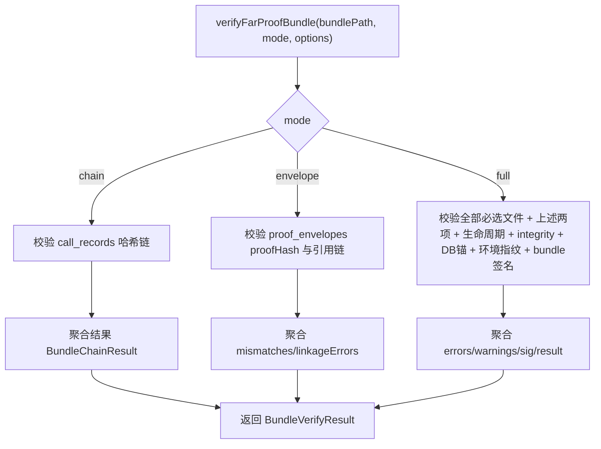
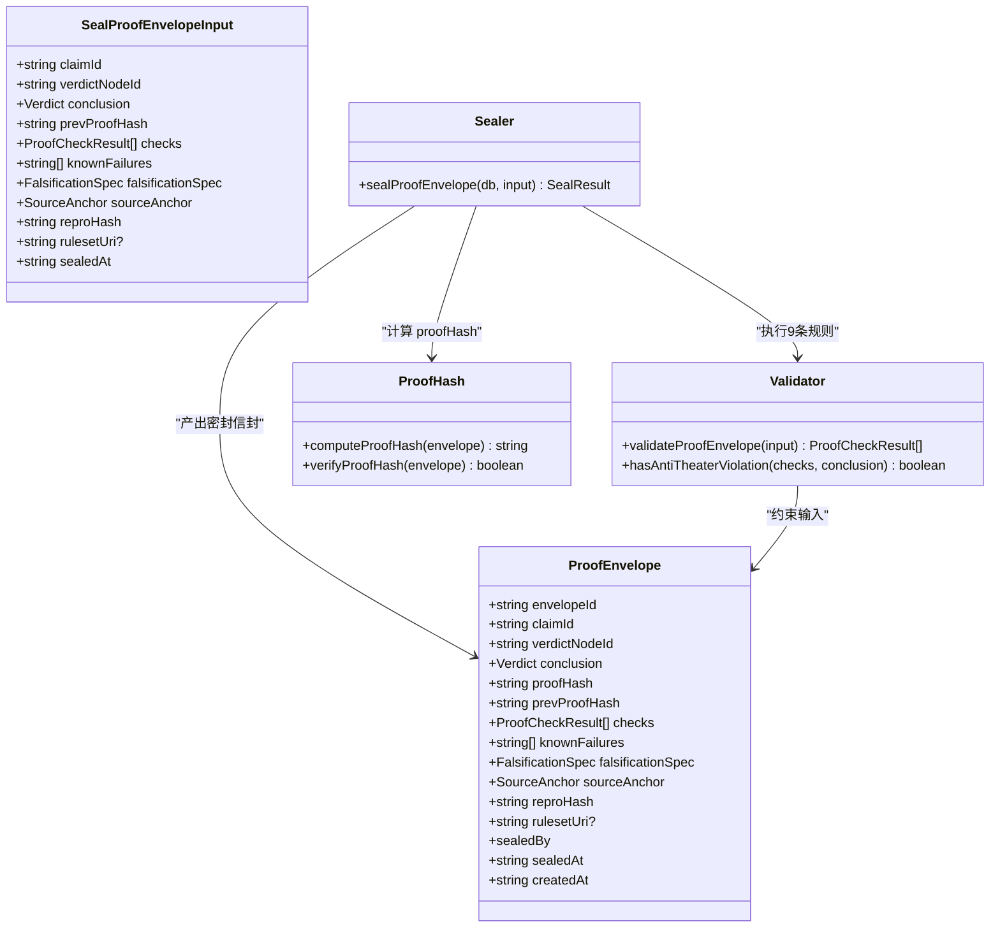
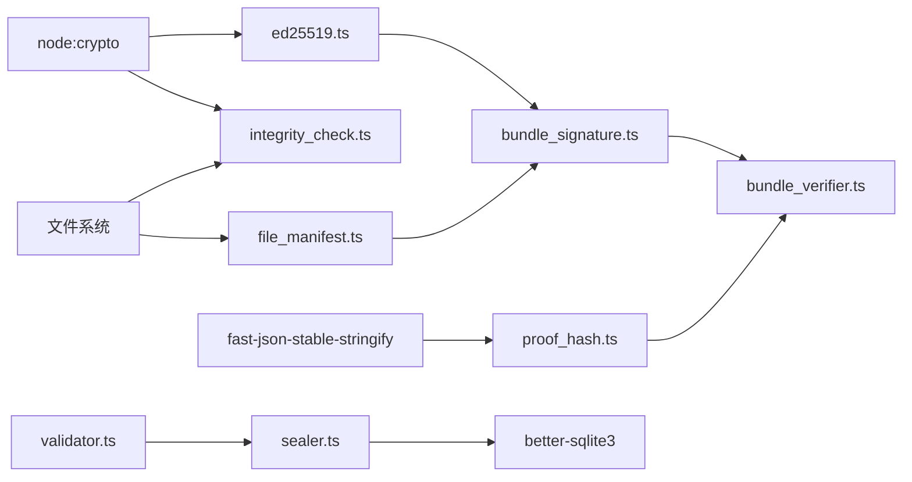

# 加密安全机制

<cite>
**本文引用的文件**
- [src/security/ed25519.ts](file://src/security/ed25519.ts)
- [src/security/file_manifest.ts](file://src/security/file_manifest.ts)
- [src/far_proof/bundle_signature.ts](file://src/far_proof/bundle_signature.ts)
- [src/far_proof/bundle_verifier.ts](file://src/far_proof/bundle_verifier.ts)
- [src/far_proof/integrity_check.ts](file://src/far_proof/integrity_check.ts)
- [src/proof_envelope/sealer.ts](file://src/proof_envelope/sealer.ts)
- [src/proof_envelope/types.ts](file://src/proof_envelope/types.ts)
- [src/proof_envelope/validator.ts](file://src/proof_envelope/validator.ts)
- [src/proof_envelope/proof_hash.ts](file://src/proof_envelope/proof_hash.ts)
</cite>

## 目录
1. [简介](#简介)
2. [项目结构](#项目结构)
3. [核心组件](#核心组件)
4. [架构总览](#架构总览)
5. [详细组件分析](#详细组件分析)
6. [依赖关系分析](#依赖关系分析)
7. [性能考量](#性能考量)
8. [故障排查指南](#故障排查指南)
9. [结论](#结论)
10. [附录](#附录)

## 简介
本文件系统性梳理 FAR-Lab 中的加密与安全机制，重点覆盖：
- Ed25519 数字签名算法的实现原理与安全特性
- 证明包（bundle）签名的生成与验证流程，含密钥管理与证书链验证边界说明
- 机器信封（ProofEnvelope）的密封机制与数据完整性保证
- 哈希算法选择依据与碰撞抗性分析
- 加密参数配置选项与安全强度评估
- 密钥轮换策略与密钥泄露应急响应方案
- 加密操作的性能优化建议与最佳实践
- 与其他安全组件的集成方式与依赖关系

## 项目结构
围绕“可审计、可复现、可验证”的目标，安全相关代码主要分布在以下模块：
- 安全原语与清单构建：security/ed25519.ts、security/file_manifest.ts
- 证明包签名与验证：far_proof/bundle_signature.ts、far_proof/bundle_verifier.ts、far_proof/integrity_check.ts
- 证明信封密封与校验：proof_envelope/sealer.ts、proof_envelope/validator.ts、proof_envelope/types.ts、proof_envelope/proof_hash.ts

图表来源
- [src/security/ed25519.ts:1-154](file://src/security/ed25519.ts#L1-L154)
- [src/security/file_manifest.ts:1-59](file://src/security/file_manifest.ts#L1-L59)
- [src/far_proof/bundle_signature.ts:1-125](file://src/far_proof/bundle_signature.ts#L1-L125)
- [src/far_proof/bundle_verifier.ts:1-305](file://src/far_proof/bundle_verifier.ts#L1-L305)
- [src/far_proof/integrity_check.ts:1-217](file://src/far_proof/integrity_check.ts#L1-L217)
- [src/proof_envelope/sealer.ts:1-172](file://src/proof_envelope/sealer.ts#L1-L172)
- [src/proof_envelope/validator.ts:1-201](file://src/proof_envelope/validator.ts#L1-L201)
- [src/proof_envelope/proof_hash.ts:1-74](file://src/proof_envelope/proof_hash.ts#L1-L74)
- [src/proof_envelope/types.ts:1-92](file://src/proof_envelope/types.ts#L1-L92)

章节来源
- [src/security/ed25519.ts:1-154](file://src/security/ed25519.ts#L1-L154)
- [src/far_proof/bundle_verifier.ts:1-305](file://src/far_proof/bundle_verifier.ts#L1-L305)

## 核心组件
- Ed25519 签名与清单：提供密钥对生成、确定性清单 canonicalization、签名与验签；清单条目为相对路径+SHA-256，按路径排序确保跨平台一致。
- Bundle 签名侧车：在 bundle 根目录外生成 .sig.json，包含签名、自含公钥、时间戳、清单与唯一签名ID；验证时重建清单并验签。
- Bundle 全量验证：综合检查必选文件、proof_envelopes.jsonl 的 proofHash 重算与引用链、call_records.redacted.jsonl 的哈希链、lifecycle_events.jsonl 事件链、integrity.json 全分量内容、可选 DB↔导出锚比对、环境指纹漂移告警、以及 Ed25519 bundle 签名维度。
- 证明信封密封：执行9条规则校验、防剧场阻断、禁止机器签发 CONFIRMED、确定性地计算 proofHash 并落库。
- 证明信封校验：独立重算 proofHash，校验信封间 prev_proof_hash 引用完整性。

章节来源
- [src/security/ed25519.ts:57-148](file://src/security/ed25519.ts#L57-L148)
- [src/far_proof/bundle_signature.ts:55-125](file://src/far_proof/bundle_signature.ts#L55-L125)
- [src/far_proof/bundle_verifier.ts:114-305](file://src/far_proof/bundle_verifier.ts#L114-L305)
- [src/proof_envelope/sealer.ts:31-126](file://src/proof_envelope/sealer.ts#L31-L126)
- [src/proof_envelope/validator.ts:176-189](file://src/proof_envelope/validator.ts#L176-L189)
- [src/proof_envelope/proof_hash.ts:38-73](file://src/proof_envelope/proof_hash.ts#L38-L73)

## 架构总览
下图展示从“文件清单→Ed25519 签名→Bundle 签名侧车→Bundle 全量验证→证明信封密封/校验”的整体数据流与控制流。

图表来源
- [src/security/file_manifest.ts:27-58](file://src/security/file_manifest.ts#L27-L58)
- [src/security/ed25519.ts:83-148](file://src/security/ed25519.ts#L83-L148)
- [src/far_proof/bundle_signature.ts:68-125](file://src/far_proof/bundle_signature.ts#L68-L125)
- [src/far_proof/bundle_verifier.ts:114-305](file://src/far_proof/bundle_verifier.ts#L114-L305)
- [src/proof_envelope/sealer.ts:31-126](file://src/proof_envelope/sealer.ts#L31-L126)
- [src/proof_envelope/proof_hash.ts:38-73](file://src/proof_envelope/proof_hash.ts#L38-L73)

## 详细组件分析

### Ed25519 数字签名与清单
- 密钥管理：使用 node:crypto 原生 Ed25519 生成 PEM 私钥/公钥；私钥由调用方保管，不内置默认密钥。
- 清单构建：递归收集常规文件，拒绝符号链接，按相对路径 code-unit 序排序，计算每个文件的 SHA-256，形成确定性清单。
- 签名过程：将清单进行 canonical JSON（含算法声明），用私钥签名，产物包含算法、清单算法、base64 签名、自含公钥、ISO-8601 时间戳、清单副本与唯一 signatureId。
- 验证过程：双向比对当前清单与签名内清单（防止删文件逃逸），再对签名内清单做 canonical 后验签；支持外部公钥交叉校验。

图表来源
- [src/security/file_manifest.ts:27-58](file://src/security/file_manifest.ts#L27-L58)
- [src/security/ed25519.ts:66-148](file://src/security/ed25519.ts#L66-L148)

章节来源
- [src/security/ed25519.ts:57-148](file://src/security/ed25519.ts#L57-L148)
- [src/security/file_manifest.ts:27-58](file://src/security/file_manifest.ts#L27-L58)

### 证明包（Bundle）签名侧车
- 定位 sidecar：<bundlePath>.sig.json 若存在则执行验签，否则跳过（零回归）。
- 重建清单：复用同一份清单构建逻辑，确保签名/验证一致性。
- 验签结果：包含 ran/status/ok/signer/signatureId/fileCount/mismatchPaths/reason 等字段，便于审计与排障。

图表来源
- [src/far_proof/bundle_signature.ts:55-125](file://src/far_proof/bundle_signature.ts#L55-L125)
- [src/security/file_manifest.ts:50-58](file://src/security/file_manifest.ts#L50-L58)
- [src/security/ed25519.ts:114-148](file://src/security/ed25519.ts#L114-L148)

章节来源
- [src/far_proof/bundle_signature.ts:55-125](file://src/far_proof/bundle_signature.ts#L55-L125)

### Bundle 全量验证
- 模式控制：chain/envelope/full 三种模式，分别侧重不同验证范围。
- 必选文件白名单：full 模式要求多项关键文件存在。
- 证明信封链：逐行重算 proofHash，校验 prev_proof_hash 引用完整性（非 GENESIS 必须指向在先信封）。
- 调用记录链：逐行校验 prev_hash 链接与 current_hash 重算，空账本在 full 模式下视为破坏。
- 生命周期事件链：独立重算 hash 链、状态连续性、迁移表合法性，并与 claim_graph 终态交叉一致。
- 完整性清单：当存在 integrity.json 时，全分量内容校验（排除自引用），检测静默组篡改。
- DB↔导出锚：传入 dbAnchor 时，对比导出中 payload hash 与 DB 落库值，检测一致伪造。
- 环境指纹：data_manifest.envFingerprint 存在则比对当前运行环境，差异仅告警。
- Ed25519 bundle 签名：存在且失效则进入 errors，导致整体失败。

图表来源
- [src/far_proof/bundle_verifier.ts:114-305](file://src/far_proof/bundle_verifier.ts#L114-L305)
- [src/far_proof/bundle_verifier.ts:325-419](file://src/far_proof/bundle_verifier.ts#L325-L419)
- [src/far_proof/bundle_verifier.ts:514-613](file://src/far_proof/bundle_verifier.ts#L514-L613)
- [src/far_proof/integrity_check.ts:48-139](file://src/far_proof/integrity_check.ts#L48-L139)

章节来源
- [src/far_proof/bundle_verifier.ts:114-305](file://src/far_proof/bundle_verifier.ts#L114-L305)

### 证明信封密封与校验
- 密封流程：
  - 执行9条规则校验（claim/verdict/spec/sourceAnchor/reproHash/prevProofHash/反剧场/deterministic sealedBy/knownFailures 透明）。
  - 防剧场阻断：WARN/FAIL 结论不得为 CONFIRMED。
  - 机器禁令：禁止机器密封产生 CONFIRMED（需人类背书）。
  - 规则集版本：默认当前 URI，显式指定须合法且主版本受支持。
  - 计算 proofHash：对除 proofHash 外的字段 canonical_json → sha256；checks/knownFailures 主动排序保证顺序无关。
  - 落库：写入数据库，sealedBy 固定为 deterministic_sealer。
- 校验流程：
  - 独立重算 proofHash 并与存储值比对。
  - 校验信封间 prev_proof_hash 引用完整性（非 GENESIS 必须指向在先信封）。

图表来源
- [src/proof_envelope/sealer.ts:31-126](file://src/proof_envelope/sealer.ts#L31-L126)
- [src/proof_envelope/validator.ts:34-189](file://src/proof_envelope/validator.ts#L34-L189)
- [src/proof_envelope/proof_hash.ts:38-73](file://src/proof_envelope/proof_hash.ts#L38-L73)
- [src/proof_envelope/types.ts:49-92](file://src/proof_envelope/types.ts#L49-L92)

章节来源
- [src/proof_envelope/sealer.ts:31-126](file://src/proof_envelope/sealer.ts#L31-L126)
- [src/proof_envelope/validator.ts:176-189](file://src/proof_envelope/validator.ts#L176-L189)
- [src/proof_envelope/proof_hash.ts:38-73](file://src/proof_envelope/proof_hash.ts#L38-L73)
- [src/proof_envelope/types.ts:49-92](file://src/proof_envelope/types.ts#L49-L92)

## 依赖关系分析
- 安全原语层：node:crypto 提供 Ed25519、SHA-256；fast-json-stable-stringify 用于确定性序列化。
- 清单与完整性：file_manifest.ts 与 integrity_check.ts 均使用 SHA-256 与确定性排序，避免 locale/ICU 漂移。
- Bundle 验证：依赖 evidence_log/hasher.ts、evidence_log/lifecycle.ts、proof_envelope/proof_hash.ts、ruleset_version.ts 等。
- 信封密封：依赖 validator.ts 与 proof_hash.ts，并通过 better-sqlite3 落库。

图表来源
- [src/security/ed25519.ts:26-34](file://src/security/ed25519.ts#L26-L34)
- [src/far_proof/integrity_check.ts:9-13](file://src/far_proof/integrity_check.ts#L9-L13)
- [src/proof_envelope/proof_hash.ts:24-27](file://src/proof_envelope/proof_hash.ts#L24-L27)
- [src/far_proof/bundle_signature.ts:27-31](file://src/far_proof/bundle_signature.ts#L27-L31)
- [src/far_proof/bundle_verifier.ts:9-23](file://src/far_proof/bundle_verifier.ts#L9-L23)
- [src/proof_envelope/sealer.ts:8-13](file://src/proof_envelope/sealer.ts#L8-L13)

章节来源
- [src/far_proof/bundle_verifier.ts:9-23](file://src/far_proof/bundle_verifier.ts#L9-L23)
- [src/proof_envelope/sealer.ts:8-13](file://src/proof_envelope/sealer.ts#L8-L13)

## 性能考量
- 哈希与序列化：
  - 使用 SHA-256 作为统一哈希算法，避免引入新算法带来的维护成本与兼容性风险。
  - 通过 fast-json-stable-stringify 实现确定性序列化，减少因键顺序或空格导致的哈希漂移。
- 清单构建：
  - 递归遍历目录并按路径排序，拒绝符号链接，避免额外开销与安全风险。
- 批量处理：
  - 对 JSONL 文件逐行解析与校验，内存占用可控；必要时可结合流式处理降低峰值内存。
- 并行与缓存：
  - 对于大 bundle，可考虑并行计算文件哈希（注意线程安全与 I/O 竞争）；对重复文件可使用缓存。
- 最佳实践：
  - 优先使用系统级 crypto API（node:crypto）以获得硬件加速。
  - 避免不必要的字符串拼接与大对象复制；尽量使用 Buffer 与流式读写。
  - 对频繁调用的函数（如 computeProofHash）进行基准测试与热点优化。

[本节为通用指导，不直接分析具体文件]

## 故障排查指南
- Bundle 签名无效：
  - 检查 .sig.json 是否可读、清单重建是否成功、是否存在预期公钥交叉校验失败。
  - 关注 mismatchPaths 列表以定位被篡改或缺失的文件。
- 证明信封 proofHash 不匹配：
  - 确认 checks/knownFailures 是否已排序；确认 ruleset_uri 是否影响 canonical 输入。
  - 检查 prev_proof_hash 引用链是否完整（非 GENESIS 必须指向在先信封）。
- 调用记录链断裂：
  - 核对 prev_hash 与 current_hash 的重算结果；确认首条记录的 prev_hash 是否为 GENESIS_PREV_HASH。
- 生命周期事件异常：
  - 检查 from_state/to_state 是否符合 ALLOWED_TRANSITIONS；确认事件链与 claim_graph.lifecycleStates 终态一致。
- integrity.json 不一致：
  - 核对 generatedAt 是否被篡改；检查 files 列表与字节数是否一致；确认 excludes 正确排除自身。
- 环境指纹漂移：
  - 若 data_manifest.envFingerprint 存在但与环境不符，仅告警；建议在记录环境下重新计算以保证比特级复现。

章节来源
- [src/far_proof/bundle_signature.ts:77-125](file://src/far_proof/bundle_signature.ts#L77-L125)
- [src/far_proof/bundle_verifier.ts:325-419](file://src/far_proof/bundle_verifier.ts#L325-L419)
- [src/far_proof/bundle_verifier.ts:514-613](file://src/far_proof/bundle_verifier.ts#L514-L613)
- [src/far_proof/integrity_check.ts:80-139](file://src/far_proof/integrity_check.ts#L80-L139)

## 结论
该安全机制通过 Ed25519 签名、多层次的哈希链与完整性清单、以及证明信封的规则化密封与校验，构建了从文件到证据链的可审计、可复现、可验证的安全体系。其设计强调：
- 确定性：清单与序列化严格排序，避免运行时漂移。
- 可验证：多处独立重算与交叉校验，降低信任面。
- 可扩展：模块化设计便于扩展新的验证维度与算法注册。
- 稳健性：fail-closed 的错误处理与明确的错误码，便于自动化治理。

[本节为总结，不直接分析具体文件]

## 附录

### 哈希算法选择与碰撞抗性
- 选择 SHA-256：统一算法、广泛支持、无新增依赖；适用于清单、完整性清单、proofHash 等场景。
- 碰撞抗性：SHA-256 具备强抗碰撞性，适合用于完整性校验与签名消息摘要。
- 注意事项：canonical 序列化必须稳定（键顺序、空格、Unicode 处理），否则会导致哈希漂移。

章节来源
- [src/proof_envelope/proof_hash.ts:1-22](file://src/proof_envelope/proof_hash.ts#L1-L22)
- [src/far_proof/integrity_check.ts:48-75](file://src/far_proof/integrity_check.ts#L48-L75)

### 加密参数配置与安全强度评估
- Ed25519：使用 node:crypto 原生实现，密钥长度固定，安全性高；私钥由调用方保管，不内置默认密钥。
- 清单算法：manifestAlgorithm 固定为 sha256；签名算法固定为 ed25519。
- 规则集版本：rulesetUri 默认当前 URI，显式指定须合法且主版本受支持；影响 proofHash 的 canonical 输入。
- 安全强度：Ed25519 提供约 128 位安全强度；SHA-256 提供 128 位抗碰撞强度；组合满足当前安全需求。

章节来源
- [src/security/ed25519.ts:57-103](file://src/security/ed25519.ts#L57-L103)
- [src/proof_envelope/sealer.ts:63-88](file://src/proof_envelope/sealer.ts#L63-L88)

### 密钥轮换与泄露应急
- 密钥轮换：
  - 定期轮换 Ed25519 私钥；旧签名仍可用对应公钥验证，新签名使用新公钥。
  - 在 Bundle 验证时支持传入 expectedPubKeyPem 进行归属交叉校验，防止“换公钥自签”绕过。
- 泄露应急：
  - 立即撤销受影响公钥的信任锚；发布新密钥并更新验证端点。
  - 对已生成的 Bundle 进行重新签名；对历史 Bundle 增加“过期”标记。
  - 审计日志：利用 signatureId 追踪签名来源与时间，配合 TSA（未来项）增强时间可信度。

章节来源
- [src/far_proof/bundle_signature.ts:68-125](file://src/far_proof/bundle_signature.ts#L68-L125)
- [src/security/ed25519.ts:83-148](file://src/security/ed25519.ts#L83-L148)

### 与其他安全组件的集成
- 证据日志：与 evidence_log/hasher.ts、lifecycle.ts 集成，确保 call_records 与 lifecycle_events 的哈希链一致。
- 规则集版本：通过 ruleset_version.ts 派发规则集验证器，确保兼容性与演进。
- 数据库：通过 better-sqlite3 持久化 proof_envelopes，DB trigger 作为物理兜底。
- 前端验证：前端可使用 Web Crypto 本地重算 Merkle 根与包含证明，实现离线验证。

章节来源
- [src/far_proof/bundle_verifier.ts:9-23](file://src/far_proof/bundle_verifier.ts#L9-L23)
- [src/proof_envelope/sealer.ts:96-119](file://src/proof_envelope/sealer.ts#L96-L119)