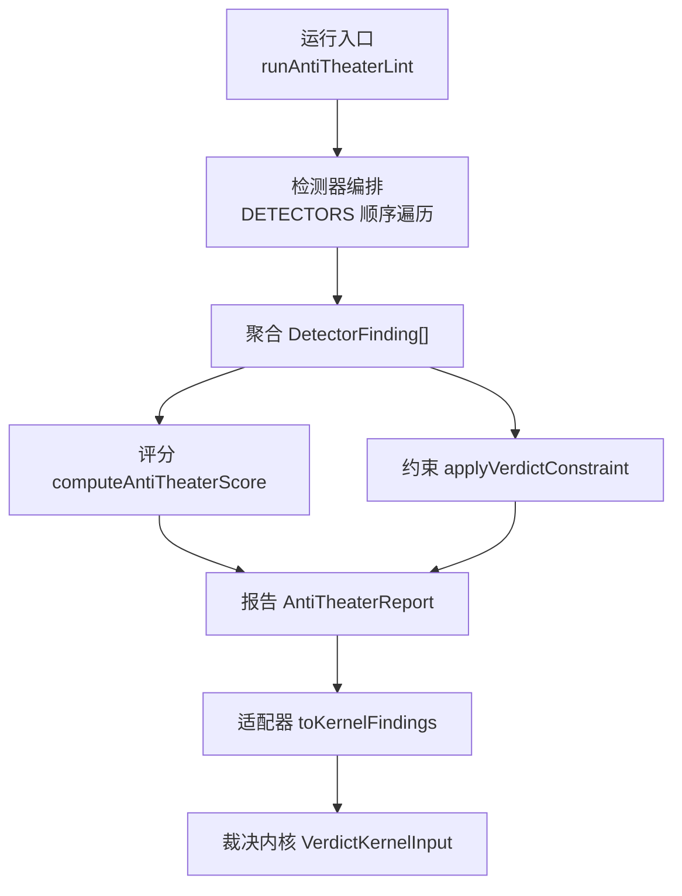
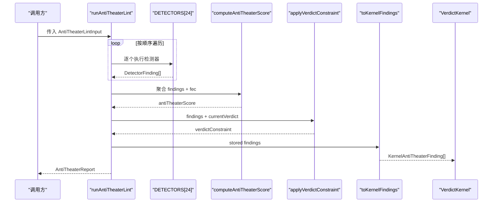
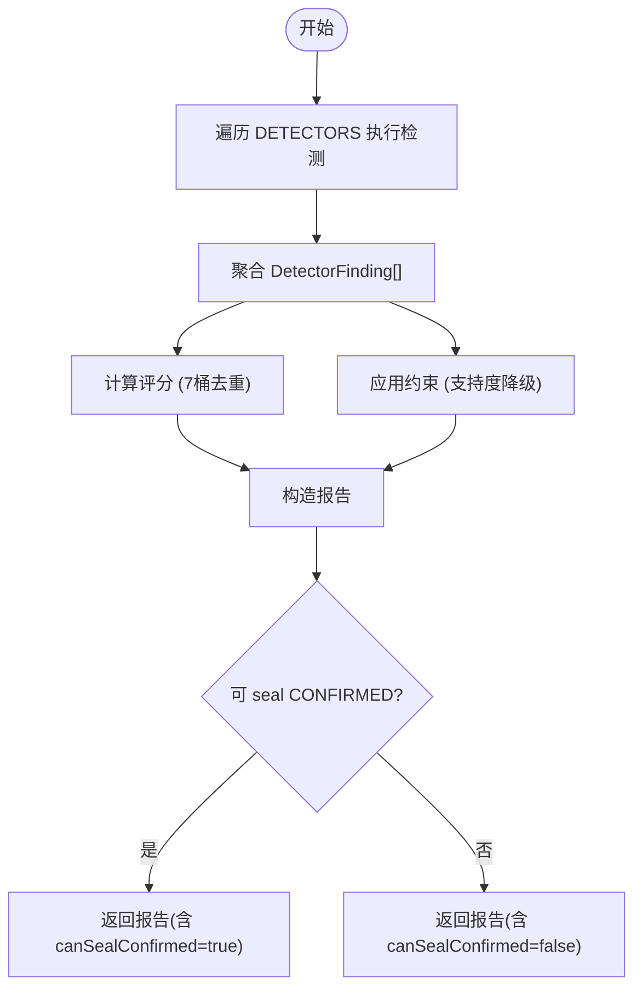
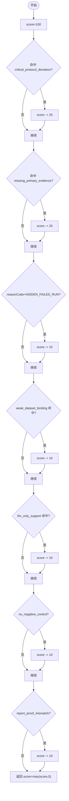
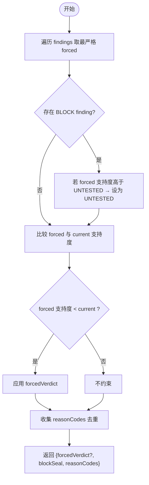
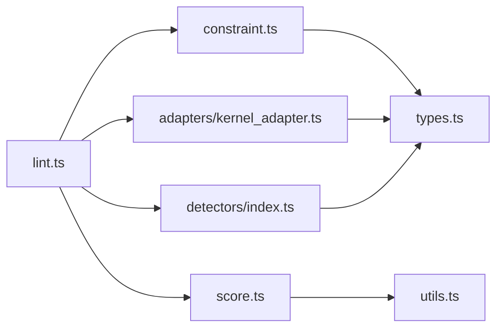

# 反剧场攻击检测系统

<cite>
**本文引用的文件**
- [src/anti_theater/index.ts](file://src/anti_theater/index.ts)
- [src/anti_theater/types.ts](file://src/anti_theater/types.ts)
- [src/anti_theater/lint.ts](file://src/anti_theater/lint.ts)
- [src/anti_theater/score.ts](file://src/anti_theater/score.ts)
- [src/anti_theater/constraint.ts](file://src/anti_theater/constraint.ts)
- [src/anti_theater/detectors/index.ts](file://src/anti_theater/detectors/index.ts)
- [src/anti_theater/adapters/kernel_adapter.ts](file://src/anti_theater/adapters/kernel_adapter.ts)
- [src/anti_theater/trap_taxonomy.ts](file://src/anti_theater/trap_taxonomy.ts)
- [src/anti_theater/utils.ts](file://src/anti_theater/utils.ts)
- [src/anti_theater/detectors/data_hash_fake.ts](file://src/anti_theater/detectors/data_hash_fake.ts)
- [src/anti_theater/detectors/dataset_drift.ts](file://src/anti_theater/detectors/dataset_drift.ts)
- [src/anti_theater/detectors/phack_alpha.ts](file://src/anti_theater/detectors/phack_alpha.ts)
- [src/anti_theater/detectors/effect_p_consistency.ts](file://src/anti_theater/detectors/effect_p_consistency.ts)
- [src/anti_theater/detectors/fake_pass.ts](file://src/anti_theater/detectors/fake_pass.ts)
- [src/anti_theater/detectors/scope_launder.ts](file://src/anti_theater/detectors/scope_launder.ts)
- [src/anti_theater/detectors/seed_cherry.ts](file://src/anti_theater/detectors/seed_cherry.ts)
</cite>

## 目录
1. [简介](#简介)
2. [项目结构](#项目结构)
3. [核心组件](#核心组件)
4. [架构总览](#架构总览)
5. [详细组件分析](#详细组件分析)
6. [依赖关系分析](#依赖关系分析)
7. [性能与误报控制](#性能与误报控制)
8. [故障排查指南](#故障排查指南)
9. [结论](#结论)
10. [附录：24种检测器分类与工作原理](#附录24种检测器分类与工作原理)

## 简介
本系统提供“反剧场攻击”（Anti-Theater）检测能力，用于在研究证据链封签前，对数据、统计、工作流、报告等层面的操纵行为进行确定性检测。系统通过编排执行24个检测器，产出结构化发现（finding），并基于评分与约束规则影响最终裁决（verdict）与封签（seal）决策。其设计强调模型中立、零容忍合规、纯函数与可复现性，确保检测结果不依赖大模型判断，且能稳定进入证明信封与哈希计算。

## 项目结构
反剧场子系统位于 src/anti_theater，采用分层组织：
- 类型与入口：types.ts、index.ts 定义权威类型、公开 API、导出 DETECTORS 与 runAntiTheaterLint。
- 编排与评分：lint.ts 负责按固定顺序遍历检测器、聚合结果、计算评分、应用约束、生成报告。
- 检测器集合：detectors/index.ts 维护24个检测器的确定顺序；每个 detector 实现单一攻击类型的检测逻辑。
- 适配层：adapters/kernel_adapter.ts 将存储型 finding 投影为裁决内核输入。
- 评分与约束：score.ts 实现7桶去重扣分；constraint.ts 实现支持度降级模型与取严策略。
- 工具与元数据：utils.ts 提供浮点比较、交集、负对照近似判定；trap_taxonomy.ts 提供陷阱分类与解释元数据。

**图表来源**
- [src/anti_theater/lint.ts:37-81](file://src/anti_theater/lint.ts#L37-L81)
- [src/anti_theater/detectors/index.ts:55-79](file://src/anti_theater/detectors/index.ts#L55-L79)
- [src/anti_theater/score.ts:56-95](file://src/anti_theater/score.ts#L56-L95)
- [src/anti_theater/constraint.ts:105-152](file://src/anti_theater/constraint.ts#L105-L152)
- [src/anti_theater/adapters/kernel_adapter.ts:43-59](file://src/anti_theater/adapters/kernel_adapter.ts#L43-L59)

**章节来源**
- [src/anti_theater/index.ts:11-97](file://src/anti_theater/index.ts#L11-L97)
- [src/anti_theater/lint.ts:1-82](file://src/anti_theater/lint.ts#L1-L82)

## 核心组件
- 类型体系：types.ts 定义了攻击类别枚举、发现对象、报告、约束、执行痕迹、预注册记录、绑定追踪等权威类型，统一存储轴与展示轴。
- 编排器：lint.ts 按 DETECTORS 顺序执行检测器，聚合 findings，计算评分，应用约束，生成报告，并决定 canSealConfirmed。
- 评分系统：score.ts 以7桶去重扣分，阈值 <70 不可 seal CONFIRMED。
- 约束系统：constraint.ts 以支持度降级模型取严 forcedVerdict，并处理 blockSeal 与 reasonCodes。
- 适配器：kernel_adapter.ts 将存储型 finding 映射为裁决内核输入，保持顺序与确定性。
- 陷阱分类：trap_taxonomy.ts 为每种 attackKind 提供分类、名称、原因、修复建议与现实案例，便于报告与可视化。

**章节来源**
- [src/anti_theater/types.ts:21-392](file://src/anti_theater/types.ts#L21-L392)
- [src/anti_theater/lint.ts:37-81](file://src/anti_theater/lint.ts#L37-L81)
- [src/anti_theater/score.ts:1-96](file://src/anti_theater/score.ts#L1-L96)
- [src/anti_theater/constraint.ts:1-153](file://src/anti_theater/constraint.ts#L1-L153)
- [src/anti_theater/adapters/kernel_adapter.ts:1-60](file://src/anti_theater/adapters/kernel_adapter.ts#L1-L60)
- [src/anti_theater/trap_taxonomy.ts:19-339](file://src/anti_theater/trap_taxonomy.ts#L19-L339)

## 架构总览
系统以 lint 编排为核心，串联检测器、评分、约束与适配器，形成从输入到裁决的完整流水线。所有检测器均为纯函数、无副作用、确定性输出，保证 golden vector 对拍与 CI 稳定性。

**图表来源**
- [src/anti_theater/lint.ts:37-81](file://src/anti_theater/lint.ts#L37-L81)
- [src/anti_theater/detectors/index.ts:55-79](file://src/anti_theater/detectors/index.ts#L55-L79)
- [src/anti_theater/score.ts:56-95](file://src/anti_theater/score.ts#L56-L95)
- [src/anti_theater/constraint.ts:105-152](file://src/anti_theater/constraint.ts#L105-L152)
- [src/anti_theater/adapters/kernel_adapter.ts:43-59](file://src/anti_theater/adapters/kernel_adapter.ts#L43-L59)

## 详细组件分析

### 编排器 runAntiTheaterLint
- 职责：按 DETECTORS 顺序遍历执行，聚合 DetectorFinding[]，计算评分，应用约束，构造报告，决定 canSealConfirmed。
- 关键规则：
  - 三重条件可 seal CONFIRMED：score ≥ 70、无 BLOCK finding、forcedVerdict 为 undefined。
  - llmOverrideRejected 恒 true（确定性内核拒绝 LLM-as-judge）。
- 确定性保障：AST 结构门自检、固定顺序遍历、纯函数。

**图表来源**
- [src/anti_theater/lint.ts:37-81](file://src/anti_theater/lint.ts#L37-L81)

**章节来源**
- [src/anti_theater/lint.ts:1-82](file://src/anti_theater/lint.ts#L1-L82)

### 评分系统 computeAntiTheaterScore
- 规则：100 基准，7 桶命中即扣，去重计分。
- 桶定义：
  - critical_protocol_deviation（-25）：AT-POSTHOC-THRESHOLD、AT-METRIC-SWAP、AT-PHACK-ALPHA、AT-HARK、AT-STOPPING-RULE、AT-OPTIONAL-STOPPING。
  - missing_primary_evidence（-20）：AT-FAKE-PASS、AT-LABEL-ONLY、AT-MISSING-RAW。
  - hidden_failed_run（-15）：reasonCode=HIDDEN_FAILED_RUN。
  - weak_dataset_binding（-10）：AT-DATA-DRIFT(WARN)、AT-DATA-HASH-FAKE。
  - llm_only_support（-10）：AT-JUDGE-OVERRIDE、AT-LABEL-ONLY。
  - no_negative_control（-10）：FEC 未声明 negative control（近似判定）。
  - report_proof_mismatch（-10）：AT-REPORT-MISMATCH。
- 阈值：SEAL_BLOCK_SCORE_THRESHOLD=70；低于该值不可 seal CONFIRMED。

**图表来源**
- [src/anti_theater/score.ts:23-95](file://src/anti_theater/score.ts#L23-L95)
- [src/anti_theater/utils.ts:29-47](file://src/anti_theater/utils.ts#L29-L47)

**章节来源**
- [src/anti_theater/score.ts:1-96](file://src/anti_theater/score.ts#L1-L96)
- [src/anti_theater/utils.ts:1-48](file://src/anti_theater/utils.ts#L1-L48)

### 约束系统 applyVerdictConstraint
- 支持度降级模型：CONFIRMED(4) > DEGRADED_SCOPE(3) > INCONCLUSIVE(2) > UNTESTED(1) > REFUTED(0)。
- 规则：
  - 只降级：forced 支持度必须小于 current 才约束。
  - 多 forced 取最否定（支持度最低）。
  - 任一 BLOCK finding → blockSeal=true，且 forced 至少 UNTESTED。
  - reasonCode 映射优先于 attackId：REFUTATION_HIDDEN_BY_SCOPE→REFUTED。
- 输出：forcedVerdict（可选）、blockSeal、reasonCodes（去重并保持首次出现顺序）。

**图表来源**
- [src/anti_theater/constraint.ts:44-152](file://src/anti_theater/constraint.ts#L44-L152)

**章节来源**
- [src/anti_theater/constraint.ts:1-153](file://src/anti_theater/constraint.ts#L1-L153)

### 适配器 toKernelFindings
- 投影规则：attackKind 透传；outcome→severity（FAIL→fail、WARN→warn、PASS/SKIP→pass）；message→details。
- 目的：分离存储型与内核输入型，避免内核依赖存储细节，保持类型契约清晰。

**章节来源**
- [src/anti_theater/adapters/kernel_adapter.ts:1-60](file://src/anti_theater/adapters/kernel_adapter.ts#L1-L60)

### 陷阱分类 trap_taxonomy
- 提供每种 attackKind 的分类、名称、原因、修复建议与现实案例，便于报告与可视化。
- 覆盖全集由测试对拍保证，键与 ATTACK_ID_TO_KIND 一致。

**章节来源**
- [src/anti_theater/trap_taxonomy.ts:19-339](file://src/anti_theater/trap_taxonomy.ts#L19-L339)

## 依赖关系分析
- 编排器依赖 DETECTORS 数组顺序，确保确定性。
- 评分依赖 utils.hasNegativeControl 近似判定与 findings.attackId/reasonCode。
- 约束依赖 findings.ext.reasonCode/ext.attackId/ext.severity 与 currentVerdict。
- 适配器依赖 types 与 kernel 类型，单向投影。
- 检测器之间相互独立，仅共享 makeFinding 与 utils。

**图表来源**
- [src/anti_theater/lint.ts:25-29](file://src/anti_theater/lint.ts#L25-L29)
- [src/anti_theater/score.ts:19-21](file://src/anti_theater/score.ts#L19-L21)
- [src/anti_theater/constraint.ts:33-34](file://src/anti_theater/constraint.ts#L33-L34)
- [src/anti_theater/adapters/kernel_adapter.ts:15-20](file://src/anti_theater/adapters/kernel_adapter.ts#L15-L20)
- [src/anti_theater/detectors/index.ts:17-43](file://src/anti_theater/detectors/index.ts#L17-L43)

**章节来源**
- [src/anti_theater/lint.ts:25-29](file://src/anti_theater/lint.ts#L25-L29)
- [src/anti_theater/score.ts:19-21](file://src/anti_theater/score.ts#L19-L21)
- [src/anti_theater/constraint.ts:33-34](file://src/anti_theater/constraint.ts#L33-L34)
- [src/anti_theater/adapters/kernel_adapter.ts:15-20](file://src/anti_theater/adapters/kernel_adapter.ts#L15-L20)
- [src/anti_theater/detectors/index.ts:17-43](file://src/anti_theater/detectors/index.ts#L17-L43)

## 性能与误报控制
- 确定性：所有检测器为纯函数，无 I/O，固定顺序执行，golden vector 对拍稳定。
- 误报率控制：
  - 退化路径维持误报率=0：如 dataset_drift 在无 freeze 基准时跳过；data_hash_fake 在无 chunkHashes 时跳过。
  - 精确比较：alpha 使用 tol=0 精确比较；hash 字符串严格相等。
  - 语义守卫：effect_p_consistency 仅在 effectiveDirection='supports' 且方向非 two_sided 时检查符号矛盾，避免误报。
- 性能：线性遍历检测器与 findings，集合操作 O(n)，整体开销低。

**章节来源**
- [src/anti_theater/detectors/dataset_drift.ts:22-31](file://src/anti_theater/detectors/dataset_drift.ts#L22-L31)
- [src/anti_theater/detectors/data_hash_fake.ts:15-23](file://src/anti_theater/detectors/data_hash_fake.ts#L15-L23)
- [src/anti_theater/detectors/phack_alpha.ts:9-19](file://src/anti_theater/detectors/phack_alpha.ts#L9-L19)
- [src/anti_theater/detectors/effect_p_consistency.ts:12-38](file://src/anti_theater/detectors/effect_p_consistency.ts#L12-L38)

## 故障排查指南
- 常见触发与修复：
  - AT-DATA-HASH-FAKE：Merkle root 重算与 contentHash 不一致 → 重新冻结数据集或恢复原始数据块。
  - AT-DATA-DRIFT：content/schema/stats 漂移 → 重新冻结或恢复冻结数据；stats 漂移需人工核验。
  - AT-PHACK-ALPHA：alpha 偏离 → 冻结 alpha 并在假设封存前调整。
  - AT-EFFECT-P-MISMATCH：统计报告内部矛盾 → 重算 CI/p，确保方向与区间一致。
  - AT-FAKE-PASS：必需证据缺失 → 补充 measurement.requirementId 对应条目。
  - AT-SCOPE-LAUNDER：范围收窄掩盖反证 → 扩大证据覆盖或显式承认反证。
  - AT-SEED-CHERRY：隐藏失败 run 或 seedPolicy 篡改 → 全量登记 runs，恢复 seedPolicy。
- 诊断步骤：
  - 查看 findings.attackKind 与 reasonCode 定位问题。
  - 检查 affectedProofHashInputs 确认受影响字段。
  - 根据 remediation 指导修复后重新运行 lint。

**章节来源**
- [src/anti_theater/detectors/data_hash_fake.ts:55-70](file://src/anti_theater/detectors/data_hash_fake.ts#L55-L70)
- [src/anti_theater/detectors/dataset_drift.ts:79-133](file://src/anti_theater/detectors/dataset_drift.ts#L79-L133)
- [src/anti_theater/detectors/phack_alpha.ts:52-63](file://src/anti_theater/detectors/phack_alpha.ts#L52-L63)
- [src/anti_theater/detectors/effect_p_consistency.ts:87-178](file://src/anti_theater/detectors/effect_p_consistency.ts#L87-L178)
- [src/anti_theater/detectors/fake_pass.ts:63-73](file://src/anti_theater/detectors/fake_pass.ts#L63-L73)
- [src/anti_theater/detectors/scope_launder.ts:61-101](file://src/anti_theater/detectors/scope_launder.ts#L61-L101)
- [src/anti_theater/detectors/seed_cherry.ts:67-106](file://src/anti_theater/detectors/seed_cherry.ts#L67-L106)

## 结论
反剧场检测系统通过严格的类型体系、确定的编排流程、科学的评分与约束机制，有效识别数据、统计、工作流与报告层面的操纵行为。其设计确保零误报承诺、模型中立与可复现性，并为裁决内核提供高质量的结构化输入。未来可通过扩展冻结记录、增强统计明细与完善负对照字段进一步提升检测能力。

## 附录：24种检测器分类与工作原理
以下按大类组织24种检测器，说明攻击类型、工作原理、触发条件与误报控制要点。

- 数据操纵类
  - AT-DATA-DRIFT（dataset_drift.ts）：对比 binding 与冻结记录的三层 hash（content/schema/stats），内容/模式漂移 FAIL，统计指纹漂移 WARN。退化：无冻结基准则跳过，维持误报率=0。
  - AT-DATA-HASH-FAKE（data_hash_fake.ts）：重算 chunkHashes 的 Merkle root 与 contentHash 比对，不一致 FAIL。退化：缺 chunkHashes 则跳过。

- 统计操纵类
  - AT-PHACK-ALPHA（phack_alpha.ts）：冻结 alpha 与执行端 alpha 精确比较（tol=0），偏离 FAIL。
  - AT-PHACK-CORRECTION（未展开）：多重比较未校正检测。
  - AT-PHACK-MARGINAL-P（未展开）：主 p 值边缘显著风险信号检测。
  - AT-EFFECT-P-MISMATCH（effect_p_consistency.ts）：CI-p 数学恒等、方向-effectSize 符号、方向-CI 一致性三层检测，FAIL。

- 工作流操纵类
  - AT-WORKFLOW-DIGEST（未展开）：工作流/容器/环境 hash 与冻结不一致检测。
  - AT-DEP-FLOAT-DRIFT（未展开）：依赖版本浮动导致结果漂移检测。

- 证据与产物完整性
  - AT-FAKE-PASS（fake_pass.ts）：FEC.requiredEvidence 未被 measurements.resolve 则 FAIL，blockSeal=true。
  - AT-LABEL-ONLY（未展开）：仅有标签无实际证据。
  - AT-MISSING-RAW（未展开）：原始产物缺失。

- 范围与降级
  - AT-SCOPE-LAUNDER（scope_launder.ts）：coverage 非全量且 overclaim（CONFIRMED）或隐藏同 scope 反证 → FAIL；honest degrade 放行。
  - AT-FAKE-DEGRADED（未展开）：假降级包装失败为 null result 但未进 proofHash。

- 方法与过程
  - AT-POSTHOC-THRESHOLD（未展开）：事后阈值调整。
  - AT-METRIC-SWAP（未展开）：主指标更换。
  - AT-HARK（未展开）：假设后设。
  - AT-STOPPING-RULE（未展开）：停止规则违规。
  - AT-OPTIONAL-STOPPING（未展开）：可选停止无花费。
  - AT-SEED-CHERRY（seed_cherry.ts）：隐藏失败 run 或 seedPolicy 篡改 → FAIL。
  - AT-OVERFIT（未展开）：基准过拟合。

- 报告与过程完整性
  - AT-REPORT-MISMATCH（未展开）：人类摘要与裁决强度不一致。
  - AT-JUDGE-OVERRIDE（未展开）：LLM 裁判覆盖。

- 溯源与证据充分性
  - AT-PROVENANCE-UNBOUND（未展开）：执行-产物绑定缺失。
  - AT-LABEL-ONLY（重复归类）：证据充分性不足。

注：上述“未展开”项在 detectors/index.ts 中已注册并按顺序执行，具体逻辑参见对应文件。

**章节来源**
- [src/anti_theater/detectors/index.ts:55-79](file://src/anti_theater/detectors/index.ts#L55-L79)
- [src/anti_theater/detectors/dataset_drift.ts:1-139](file://src/anti_theater/detectors/dataset_drift.ts#L1-L139)
- [src/anti_theater/detectors/data_hash_fake.ts:1-77](file://src/anti_theater/detectors/data_hash_fake.ts#L1-L77)
- [src/anti_theater/detectors/phack_alpha.ts:1-67](file://src/anti_theater/detectors/phack_alpha.ts#L1-L67)
- [src/anti_theater/detectors/effect_p_consistency.ts:1-184](file://src/anti_theater/detectors/effect_p_consistency.ts#L1-L184)
- [src/anti_theater/detectors/fake_pass.ts:1-77](file://src/anti_theater/detectors/fake_pass.ts#L1-L77)
- [src/anti_theater/detectors/scope_launder.ts:1-107](file://src/anti_theater/detectors/scope_launder.ts#L1-L107)
- [src/anti_theater/detectors/seed_cherry.ts:1-112](file://src/anti_theater/detectors/seed_cherry.ts#L1-L112)