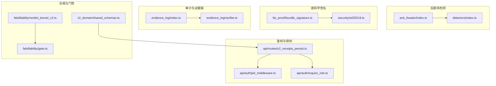
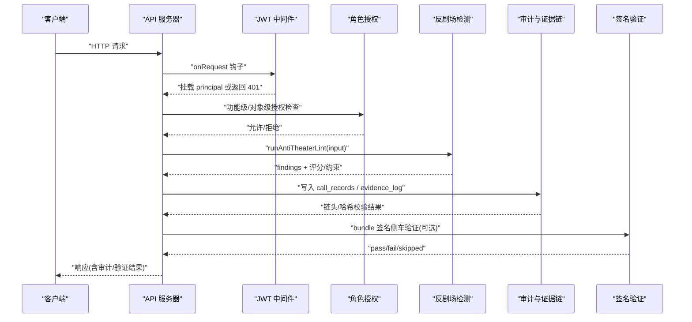
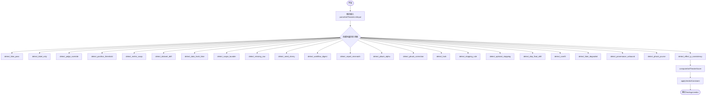
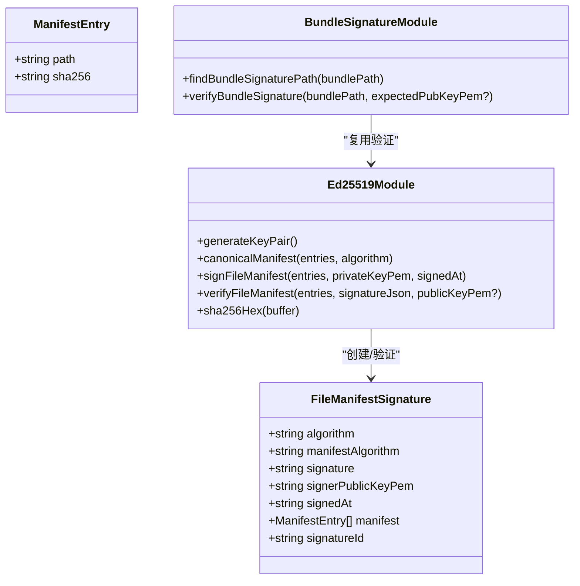
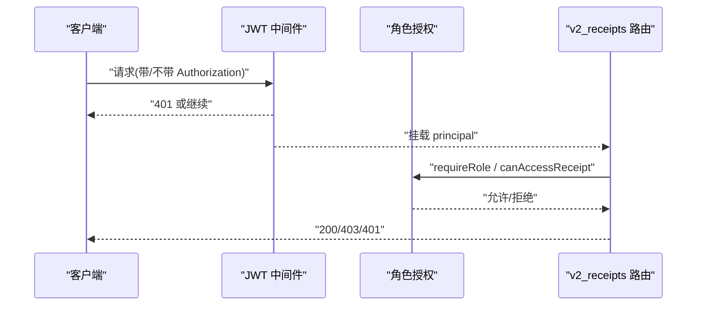
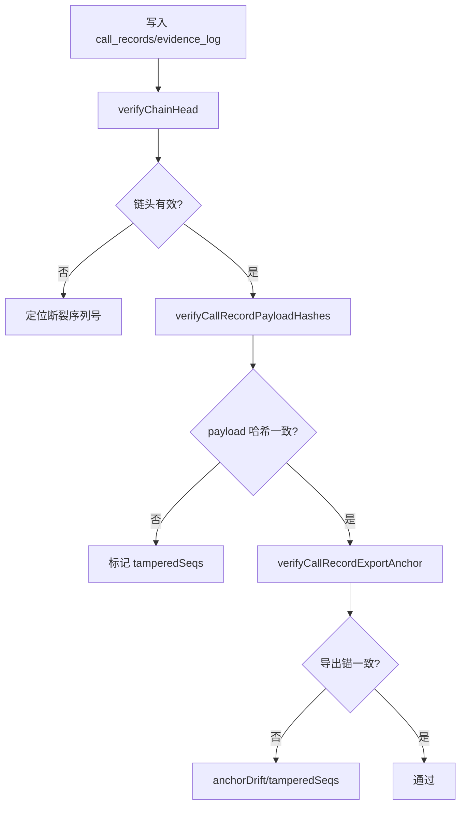
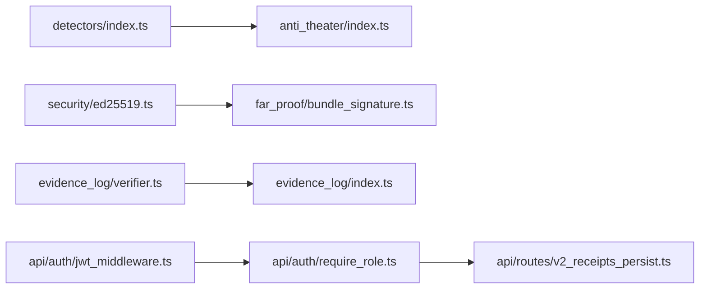

# 安全与防护

<cite>
**本文引用的文件**
- [src/anti_theater/index.ts](file://src/anti_theater/index.ts)
- [src/anti_theater/detectors/index.ts](file://src/anti_theater/detectors/index.ts)
- [src/security/ed25519.ts](file://src/security/ed25519.ts)
- [src/far_proof/bundle_signature.ts](file://src/far_proof/bundle_signature.ts)
- [src/evidence_log/index.ts](file://src/evidence_log/index.ts)
- [src/evidence_log/verifier.ts](file://src/evidence_log/verifier.ts)
- [src/api/auth/jwt_middleware.ts](file://src/api/auth/jwt_middleware.ts)
- [src/api/auth/require_role.ts](file://src/api/auth/require_role.ts)
- [src/api/routes/v2_receipts_persist.ts](file://src/api/routes/v2_receipts_persist.ts)
- [SECURITY.md](file://SECURITY.md)
- [src/agent_loop/guards.ts](file://src/agent_loop/guards.ts)
- [src/falsifiability/gate.ts](file://src/falsifiability/gate.ts)
- [src/falsifiability/verdict_kernel_v2.ts](file://src/falsifiability/verdict_kernel_v2.ts)
- [src/v2_domain/shared_schemas.ts](file://src/v2_domain/shared_schemas.ts)
</cite>

## 目录
1. [简介](#简介)
2. [项目结构](#项目结构)
3. [核心组件](#核心组件)
4. [架构总览](#架构总览)
5. [详细组件分析](#详细组件分析)
6. [依赖关系分析](#依赖关系分析)
7. [性能与安全考量](#性能与安全考量)
8. [故障排查指南](#故障排查指南)
9. [结论](#结论)
10. [附录](#附录)

## 简介
本文件系统性阐述 FAR-Lab 的安全与防护体系，覆盖多层防御机制：反剧场攻击检测、威胁模型与攻击向量识别、数字签名与加密（Ed25519）、权限控制与访问策略、审计日志与合规校验、配置最佳实践、漏洞检测修复流程、第三方依赖治理以及应急响应预案。文档以代码级事实为依据，配合可视化图示帮助读者理解各模块如何协同保障系统可信运行。

## 项目结构
FAR-Lab 的安全能力分布在多个子系统中：
- 反剧场检测：集中位于 anti_theater 模块，提供 24 类检测器编排与评分约束。
- 密码学签名：security/ed25519.ts 提供 Ed25519 签名与验证；far_proof/bundle_signature.ts 将签名应用于 .far-proof bundle。
- 审计与证据链：evidence_log 模块维护可验证调用记录与证据哈希链，并提供完整性校验。
- 鉴权与授权：api/auth 提供可选 JWT 中间件与功能级/对象级授权函数。
- 合规与门禁：falsifiability 门控与裁决内核确保假设、阈值与统计计划合法，并产出确定性裁决。
- 安全策略与流程：SECURITY.md 定义密钥管理、依赖审计、披露流程等组织级规则。

**图表来源**
- [src/anti_theater/index.ts:1-97](file://src/anti_theater/index.ts#L1-L97)
- [src/anti_theater/detectors/index.ts:1-107](file://src/anti_theater/detectors/index.ts#L1-L107)
- [src/security/ed25519.ts:1-154](file://src/security/ed25519.ts#L1-L154)
- [src/far_proof/bundle_signature.ts:1-125](file://src/far_proof/bundle_signature.ts#L1-L125)
- [src/evidence_log/index.ts:1-92](file://src/evidence_log/index.ts#L1-L92)
- [src/evidence_log/verifier.ts:1-280](file://src/evidence_log/verifier.ts#L1-L280)
- [src/api/auth/jwt_middleware.ts:1-132](file://src/api/auth/jwt_middleware.ts#L1-L132)
- [src/api/auth/require_role.ts:1-57](file://src/api/auth/require_role.ts#L1-L57)
- [src/api/routes/v2_receipts_persist.ts:20-124](file://src/api/routes/v2_receipts_persist.ts#L20-L124)
- [src/falsifiability/gate.ts:1-78](file://src/falsifiability/gate.ts#L1-L78)
- [src/falsifiability/verdict_kernel_v2.ts:376-414](file://src/falsifiability/verdict_kernel_v2.ts#L376-L414)
- [src/v2_domain/shared_schemas.ts:34-111](file://src/v2_domain/shared_schemas.ts#L34-L111)

**章节来源**
- [src/anti_theater/index.ts:1-97](file://src/anti_theater/index.ts#L1-L97)
- [src/anti_theater/detectors/index.ts:1-107](file://src/anti_theater/detectors/index.ts#L1-L107)
- [src/security/ed25519.ts:1-154](file://src/security/ed25519.ts#L1-L154)
- [src/far_proof/bundle_signature.ts:1-125](file://src/far_proof/bundle_signature.ts#L1-L125)
- [src/evidence_log/index.ts:1-92](file://src/evidence_log/index.ts#L1-L92)
- [src/evidence_log/verifier.ts:1-280](file://src/evidence_log/verifier.ts#L1-L280)
- [src/api/auth/jwt_middleware.ts:1-132](file://src/api/auth/jwt_middleware.ts#L1-L132)
- [src/api/auth/require_role.ts:1-57](file://src/api/auth/require_role.ts#L1-L57)
- [src/api/routes/v2_receipts_persist.ts:20-124](file://src/api/routes/v2_receipts_persist.ts#L20-L124)
- [src/falsifiability/gate.ts:1-78](file://src/falsifiability/gate.ts#L1-L78)
- [src/falsifiability/verdict_kernel_v2.ts:376-414](file://src/falsifiability/verdict_kernel_v2.ts#L376-L414)
- [src/v2_domain/shared_schemas.ts:34-111](file://src/v2_domain/shared_schemas.ts#L34-L111)

## 核心组件
- 反剧场攻击检测系统：提供统一输入解析、24 项检测器顺序执行、评分与裁决约束，输出标准化 findings 并映射到内核输入。
- 数字签名与完整性：基于 Ed25519 的文件清单签名与 bundle 侧车签名验证，结合内容寻址哈希实现防篡改。
- 审计日志与证据链：可追加的 call_records 与 evidence_log，支持链头校验、payload 哈希校验与导出锚比对。
- 鉴权与授权：可选 JWT 中间件 + 功能级/对象级授权函数，受保护模式 fail-closed，匿名模式保持兼容。
- 合规门禁与裁决：假设与阈值合法性检查，关键协议偏差触发严格裁决，保证统计与范围一致性。

**章节来源**
- [src/anti_theater/index.ts:1-97](file://src/anti_theater/index.ts#L1-L97)
- [src/security/ed25519.ts:1-154](file://src/security/ed25519.ts#L1-L154)
- [src/far_proof/bundle_signature.ts:1-125](file://src/far_proof/bundle_signature.ts#L1-L125)
- [src/evidence_log/index.ts:1-92](file://src/evidence_log/index.ts#L1-L92)
- [src/evidence_log/verifier.ts:1-280](file://src/evidence_log/verifier.ts#L1-L280)
- [src/api/auth/jwt_middleware.ts:1-132](file://src/api/auth/jwt_middleware.ts#L1-L132)
- [src/api/auth/require_role.ts:1-57](file://src/api/auth/require_role.ts#L1-L57)
- [src/falsifiability/gate.ts:1-78](file://src/falsifiability/gate.ts#L1-L78)
- [src/falsifiability/verdict_kernel_v2.ts:376-414](file://src/falsifiability/verdict_kernel_v2.ts#L376-L414)

## 架构总览
下图展示请求从 API 进入后，鉴权、授权、反剧场检测、审计与签名验证的整体交互路径。

**图表来源**
- [src/api/auth/jwt_middleware.ts:55-111](file://src/api/auth/jwt_middleware.ts#L55-L111)
- [src/api/auth/require_role.ts:24-56](file://src/api/auth/require_role.ts#L24-L56)
- [src/anti_theater/index.ts:63-88](file://src/anti_theater/index.ts#L63-L88)
- [src/evidence_log/index.ts:13-37](file://src/evidence_log/index.ts#L13-L37)
- [src/far_proof/bundle_signature.ts:55-124](file://src/far_proof/bundle_signature.ts#L55-L124)

## 详细组件分析

### 反剧场攻击检测系统（24 种检测器）
- 分类与职责：涵盖假通过、标签仅用、裁判覆盖、事后阈值、指标替换、数据集漂移、数据哈希伪造、作用域清洗、缺失原始数据、种子挑选、工作流摘要、报告不匹配、p-hacking（alpha/correction/pcurve）、HARK、停止规则、可选停止、依赖浮点漂移、过拟合、假降级、溯源未绑定、效应-p 一致性等。
- 工作原理：按固定顺序遍历 DETECTORS 数组，对每个 detector 输入 AntiTheaterLintInput，收集 DetectorFinding[]，随后进行评分与裁决约束应用。
- 触发条件：由各 detector 内部逻辑决定（如 p-hacking 信号、阈值异常、数据不一致、溯源缺失等），并通过 constraint.ts 将 findings 映射为 forcedVerdict/blockSeal 等强约束。

**图表来源**
- [src/anti_theater/detectors/index.ts:17-79](file://src/anti_theater/detectors/index.ts#L17-L79)
- [src/anti_theater/index.ts:69-88](file://src/anti_theater/index.ts#L69-L88)

**章节来源**
- [src/anti_theater/detectors/index.ts:1-107](file://src/anti_theater/detectors/index.ts#L1-L107)
- [src/anti_theater/index.ts:1-97](file://src/anti_theater/index.ts#L1-L97)

### 威胁模型分析与攻击向量识别
- 一致伪造（DEF-18/V-04）：keyless SHA-256 链仅能检测朴素篡改；拥有写权限的攻击者可重算全部哈希使 bundle 自洽。引入 Ed25519 签名将“重算一致伪造”窗口收窄至“同时持有私钥”。
- 审计链一致伪造：DB 内 payload 哈希不在 canonical 链输入中，需借助导出锚（call_records.redacted.jsonl）与当前 DB 逐 seq 比对，检测导出后的一致重算伪造。
- 作用域与统计偏差：R3 关键协议偏差（事后 alpha 重写、指标替换、后期排除、停止规则违反）直接导致 UNTESTED 裁决，并标记完整性标志。

**章节来源**
- [src/far_proof/bundle_signature.ts:1-25](file://src/far_proof/bundle_signature.ts#L1-L25)
- [src/evidence_log/verifier.ts:196-279](file://src/evidence_log/verifier.ts#L196-L279)
- [src/falsifiability/verdict_kernel_v2.ts:376-414](file://src/falsifiability/verdict_kernel_v2.ts#L376-L414)

### 数字签名与加密算法（Ed25519）
- 密钥生成：使用 node:crypto 原生 Ed25519 生成 PEM 私钥/公钥。
- 清单签名：对按 path 排序的 ManifestEntry 列表计算确定性 canonical JSON，再签名；产物包含 algorithm、manifestAlgorithm、signature、signerPublicKeyPem、signedAt、manifest、signatureId。
- 清单验证：独立重算 manifest 条目哈希并与签名内 manifest 双向比对（防止删文件逃逸），再用公钥验证签名有效性。
- Bundle 签名：查找 sidecar（.sig.json），重建清单并调用 verifyFileManifest，输出 ran/status/ok/signer/signatureId/mismatchPaths/reason/fileCount。

**图表来源**
- [src/security/ed25519.ts:36-154](file://src/security/ed25519.ts#L36-L154)
- [src/far_proof/bundle_signature.ts:32-124](file://src/far_proof/bundle_signature.ts#L32-L124)

**章节来源**
- [src/security/ed25519.ts:1-154](file://src/security/ed25519.ts#L1-L154)
- [src/far_proof/bundle_signature.ts:1-125](file://src/far_proof/bundle_signature.ts#L1-L125)

### 权限控制模型与访问控制策略
- JWT 中间件：offline 模式（jwtSecret=null）放行并挂载 anonymous；受保护模式下 fail-closed，缺/畸形 Authorization 或无效 token 一律 401；精确豁免 GET /health /ready /metrics。
- 功能级授权：requireRole(principal, allowed) 判定角色是否在允许集合（viewer 只读，researcher/admin 可写）。
- 对象级授权：canAccessReceipt(principal, owner) 实现 BOLA（owner 为 null 或等于 principal.userId 才允许）；ownerOf(principal) 在受保护模式写入 owner 列。
- 收据持久化路由：在创建 receipt 前进行角色检查，幂等分支避免 owner 泄露面。

**图表来源**
- [src/api/auth/jwt_middleware.ts:55-111](file://src/api/auth/jwt_middleware.ts#L55-L111)
- [src/api/auth/require_role.ts:24-56](file://src/api/auth/require_role.ts#L24-L56)
- [src/api/routes/v2_receipts_persist.ts:92-124](file://src/api/routes/v2_receipts_persist.ts#L92-L124)

**章节来源**
- [src/api/auth/jwt_middleware.ts:1-132](file://src/api/auth/jwt_middleware.ts#L1-L132)
- [src/api/auth/require_role.ts:1-57](file://src/api/auth/require_role.ts#L1-L57)
- [src/api/routes/v2_receipts_persist.ts:20-124](file://src/api/routes/v2_receipts_persist.ts#L20-L124)

### 安全审计日志与合规性检查
- 审计日志：appendRecord/appendEvidenceLog 写入 call_records 与 evidence_log，支持 LLM 调用记录与生命周期事件。
- 链头校验：verifyChainHead 逐行校验 prev_hash/current_hash 链式完整性。
- Payload 哈希校验：verifyCallRecordPayloadHashes 重算 request/response payload 的 canonical JSON 哈希并比对落库值。
- 导出锚比对：verifyCallRecordExportAnchor 将导出中的 payload hash 与 DB 落库值逐 seq 比对，检测一致伪造与锚漂移。
- 合规门禁：falsifiabilityGate 校验假设、预测、指标、阈值及范围语义；verdict_kernel_v2 对关键协议偏差强制 UNTESTED 裁决。

**图表来源**
- [src/evidence_log/index.ts:13-37](file://src/evidence_log/index.ts#L13-L37)
- [src/evidence_log/verifier.ts:17-65](file://src/evidence_log/verifier.ts#L17-L65)
- [src/evidence_log/verifier.ts:145-187](file://src/evidence_log/verifier.ts#L145-L187)
- [src/evidence_log/verifier.ts:212-279](file://src/evidence_log/verifier.ts#L212-L279)
- [src/falsifiability/gate.ts:27-49](file://src/falsifiability/gate.ts#L27-L49)
- [src/falsifiability/verdict_kernel_v2.ts:376-414](file://src/falsifiability/verdict_kernel_v2.ts#L376-L414)

**章节来源**
- [src/evidence_log/index.ts:1-92](file://src/evidence_log/index.ts#L1-L92)
- [src/evidence_log/verifier.ts:1-280](file://src/evidence_log/verifier.ts#L1-L280)
- [src/falsifiability/gate.ts:1-78](file://src/falsifiability/gate.ts#L1-L78)
- [src/falsifiability/verdict_kernel_v2.ts:376-414](file://src/falsifiability/verdict_kernel_v2.ts#L376-L414)

### 安全配置指南与最佳实践
- 密钥管理：严禁将 API Key、Token、连接串、私钥等提交至仓库；CI 扫描与 pre-commit 钩子强制执行；若误提交立即轮换并清理历史。
- 依赖安全：pnpm audit 每 CI 运行；Python 依赖在 pyproject.toml 中固定版本范围；发布前审计已知 CVE。
- 模型中立：核心不得硬编码特定提供商；适配器隔离于专用目录。
- 公开安装边界：install 脚本与 doctor 不读写密钥；demo/verify 零网络零密钥。
- 截图脱敏：DashScope/Bailian 截图必须脱敏敏感字段后再提交。

**章节来源**
- [SECURITY.md:44-153](file://SECURITY.md#L44-L153)

### 安全漏洞检测与修复流程
- 报告渠道：优先使用 GitHub Private Vulnerability Reporting；备用邮箱（占位符）。
- SLA：48 小时确认、7 天初步评估、修复时间依严重性而定。
- 披露流程：确认后私有分支修复 → 发布安全公告 → 致谢报告者。
- 建议：在 PR 中加入依赖审计、密钥扫描、签名验证用例；对关键路径增加 fail-closed 测试。

**章节来源**
- [SECURITY.md:10-41](file://SECURITY.md#L10-L41)

### 第三方依赖的安全评估与管理策略
- 包管理器：使用 pnpm 并启用 audit；锁定依赖版本。
- Python 生态：pyproject.toml 固定版本范围；CI 中执行依赖审计。
- SBOM/许可证：脚本生成 SBOM 与许可证审计，确保合规。

**章节来源**
- [SECURITY.md:111-116](file://SECURITY.md#L111-L116)

### 应急响应预案与安全事件处理程序
- 事件分级：依据影响面与恢复难度划分 P0-P4。
- 处置步骤：隔离受影响服务 → 回滚到已知安全基线 → 补充签名/校验 → 通知相关方 → 复盘与加固。
- 演练：定期演练密钥轮换、导出锚恢复、审计链修复。

[本节为通用流程说明，无需具体文件引用]

## 依赖关系分析
- 反剧场检测依赖 detectors 数组顺序，确保确定性输出与 golden vector 对拍。
- 签名模块依赖 node:crypto 原生 Ed25519，无新增外部依赖。
- 审计模块依赖 better-sqlite3，通过 trigger 与哈希链保证不可变性与可验证性。
- API 鉴权依赖 Fastify JWT 插件与自定义 require_role 纯函数，确保可测与可审计。

**图表来源**
- [src/anti_theater/detectors/index.ts:17-79](file://src/anti_theater/detectors/index.ts#L17-L79)
- [src/security/ed25519.ts:26-154](file://src/security/ed25519.ts#L26-L154)
- [src/far_proof/bundle_signature.ts:27-124](file://src/far_proof/bundle_signature.ts#L27-L124)
- [src/evidence_log/verifier.ts:1-280](file://src/evidence_log/verifier.ts#L1-L280)
- [src/api/auth/jwt_middleware.ts:15-132](file://src/api/auth/jwt_middleware.ts#L15-L132)
- [src/api/auth/require_role.ts:22-56](file://src/api/auth/require_role.ts#L22-L56)
- [src/api/routes/v2_receipts_persist.ts:20-124](file://src/api/routes/v2_receipts_persist.ts#L20-L124)

**章节来源**
- [src/anti_theater/detectors/index.ts:1-107](file://src/anti_theater/detectors/index.ts#L1-L107)
- [src/security/ed25519.ts:1-154](file://src/security/ed25519.ts#L1-L154)
- [src/far_proof/bundle_signature.ts:1-125](file://src/far_proof/bundle_signature.ts#L1-L125)
- [src/evidence_log/verifier.ts:1-280](file://src/evidence_log/verifier.ts#L1-L280)
- [src/api/auth/jwt_middleware.ts:1-132](file://src/api/auth/jwt_middleware.ts#L1-L132)
- [src/api/auth/require_role.ts:1-57](file://src/api/auth/require_role.ts#L1-L57)
- [src/api/routes/v2_receipts_persist.ts:20-124](file://src/api/routes/v2_receipts_persist.ts#L20-L124)

## 性能与安全考量
- 反剧场检测：固定顺序遍历，O(n) 复杂度；评分与约束为纯函数，开销可控。
- 签名验证：清单构建与哈希计算为 O(m)，m 为文件数；Ed25519 验签开销低。
- 审计校验：链头与 payload 哈希校验为 O(k)，k 为记录数；导出锚比对为 O(k)。
- 鉴权：JWT 验签与角色判断为常数时间；fail-closed 设计减少误放行风险。

[本节提供一般性指导，无需具体文件引用]

## 故障排查指南
- 签名失败：检查 sidecar 是否存在、manifest 是否完整、公钥是否匹配；查看 mismatchPaths 定位篡改物证。
- 审计链断裂：verifyChainHead 返回 brokenAtSeq，定位破坏位置；verifyCallRecordPayloadHashes 返回 tamperedSeqs。
- 导出锚漂移：verifyCallRecordExportAnchor 返回 anchorDrift 与 tamperedSeqs，核对导出与 DB 一致性。
- 鉴权失败：确认 Authorization 头格式、token 有效性；受保护模式下禁止匿名静默放行。

**章节来源**
- [src/far_proof/bundle_signature.ts:55-124](file://src/far_proof/bundle_signature.ts#L55-L124)
- [src/evidence_log/verifier.ts:17-65](file://src/evidence_log/verifier.ts#L17-L65)
- [src/evidence_log/verifier.ts:145-187](file://src/evidence_log/verifier.ts#L145-L187)
- [src/evidence_log/verifier.ts:212-279](file://src/evidence_log/verifier.ts#L212-L279)
- [src/api/auth/jwt_middleware.ts:71-109](file://src/api/auth/jwt_middleware.ts#L71-L109)

## 结论
FAR-Lab 通过反剧场检测、数字签名、审计链、鉴权授权与合规门禁的多层协同，构建了面向研究可证伪性与证据可信性的安全体系。关键特性包括：确定性的检测顺序与评分、Ed25519 签名与 bundle 侧车验证、可验证的审计链与导出锚、fail-closed 的鉴权与授权、以及对关键协议偏差的严格裁决。配合组织级安全策略与应急流程，可有效降低篡改、伪造与越权风险。

[本节为总结性内容，无需具体文件引用]

## 附录
- 机器信封与能力声明：V2 收据验证结果包含六个维度，系统能力声明暴露 signatureSuitabilities 等元信息，便于集成方评估。
- 受保护动作闸门：冻结/批准/seal/导出/迁移/删除等操作由确定性代码判定，LLM 建议或外部内容永不许可。

**章节来源**
- [src/v2_domain/shared_schemas.ts:34-111](file://src/v2_domain/shared_schemas.ts#L34-L111)
- [src/agent_loop/guards.ts:1-25](file://src/agent_loop/guards.ts#L1-L25)