# 安全审计与监控

<cite>
**本文引用的文件**
- [session_recorder.ts](file://src/trace/session_recorder.ts)
- [fsm_runner.ts](file://src/agent_loop/fsm_runner.ts)
- [verify_chain.py](file://repro/far_chain_repro/verify_chain.py)
- [index.ts (evidence_log)](file://src/evidence_log/index.ts)
- [auditor.ts](file://src/falsifiability/auditor.ts)
- [zero_tolerance_scan.mjs](file://scripts/zero_tolerance_scan.mjs)
- [generator.ts](file://src/report/generator.ts)
- [server.ts](file://src/api/server.ts)
- [types.ts (前端类型)](file://frontend/src/lib/types.ts)
- [metrics.ts](file://src/research/evaluation/metrics.ts)
- [EvidenceTimeline.tsx](file://frontend/src/components/EvidenceTimeline.tsx)
- [ResearchWorkbenchPage.tsx](file://frontend/src/pages/ResearchWorkbenchPage.tsx)
</cite>

## 目录
1. [简介](#简介)
2. [项目结构](#项目结构)
3. [核心组件](#核心组件)
4. [架构总览](#架构总览)
5. [详细组件分析](#详细组件分析)
6. [依赖关系分析](#依赖关系分析)
7. [性能考量](#性能考量)
8. [故障排查指南](#故障排查指南)
9. [结论](#结论)
10. [附录](#附录)

## 简介
本文件面向“安全审计与监控系统”的构建、使用与维护，围绕以下目标展开：不可变证据链的审计追踪与数据完整性验证；会话记录器的实时事件捕获与分析；零容忍扫描工具的安全检查流程与违规检测规则；安全指标的收集与可视化展示；异常行为检测与告警机制；审计报告生成与合规性检查自动化；安全事件响应预案与处理流程；与外部安全工具的集成方式与数据交换格式。文档以仓库中的实际实现为依据，提供代码级图示与可追溯来源。

## 项目结构
与安全审计和监控相关的关键模块分布在如下位置：
- 证据链与审计追踪：证据日志、哈希链校验、裁决审计事件
- 实时会话录制：运行时 JSONL 会话录制与回放
- 零容忍扫描：源码级静态安全检查（反模式、幻觉源、模型中立红线等）
- 报告与指标：从数据库聚合证据与裁决，生成结构化报告与指标
- API 与服务：统一信封、SSE 事件流、健康与指标端点
- 前端可视化：证据时间线、完整性信任根、实时事件面板

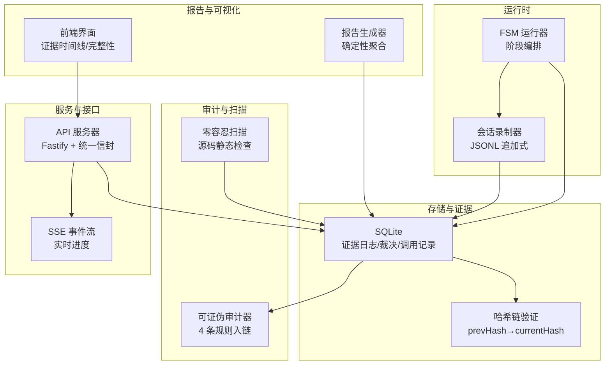

图表来源
- [fsm_runner.ts:228-271](file://src/agent_loop/fsm_runner.ts#L228-L271)
- [session_recorder.ts:171-249](file://src/trace/session_recorder.ts#L171-L249)
- [index.ts (evidence_log):1-92](file://src/evidence_log/index.ts#L1-L92)
- [auditor.ts:156-232](file://src/falsifiability/auditor.ts#L156-L232)
- [zero_tolerance_scan.mjs:486-507](file://scripts/zero_tolerance_scan.mjs#L486-L507)
- [server.ts:112-256](file://src/api/server.ts#L112-L256)
- [generator.ts:285-333](file://src/report/generator.ts#L285-L333)

章节来源
- [fsm_runner.ts:228-271](file://src/agent_loop/fsm_runner.ts#L228-L271)
- [session_recorder.ts:171-249](file://src/trace/session_recorder.ts#L171-L249)
- [index.ts (evidence_log):1-92](file://src/evidence_log/index.ts#L1-L92)
- [auditor.ts:156-232](file://src/falsifiability/auditor.ts#L156-L232)
- [zero_tolerance_scan.mjs:486-507](file://scripts/zero_tolerance_scan.mjs#L486-L507)
- [server.ts:112-256](file://src/api/server.ts#L112-L256)
- [generator.ts:285-333](file://src/report/generator.ts#L285-L333)

## 核心组件
- 不可变证据链与完整性验证：通过证据日志与调用记录的 prevHash/currentHash 形成哈希链，支持跨语言复验与 Merkle 根聚合，确保篡改可检测。
- 会话记录器：运行时将关键事件以 JSONL 追加写入，支持采样、脱敏、回放与统计，作为审计观察层独立于证据哈希链。
- 零容忍扫描：对源码进行多通道静态检查（反模式、幻觉源、模型中立红线、过度声称等），输出分节汇总并退出码控制 CI 门禁。
- 报告生成与指标：从数据库读取证据、裁决、调用记录，聚合为结构化报告，包含执行摘要、阶段输出、裁决节点、证据图、哈希链校验与限制声明。
- API 与事件流：统一成功/失败信封，暴露健康、指标、证据、裁决、报告、完整性、基准、法庭、竞技场等路由；可选 SSE 事件流用于实时进度。
- 前端可视化：证据时间线、完整性信任根、实时事件面板，支持浏览器本地重算与包含证明验证。

章节来源
- [verify_chain.py:1-56](file://repro/far_chain_repro/verify_chain.py#L1-L56)
- [session_recorder.ts:23-49](file://src/trace/session_recorder.ts#L23-L49)
- [zero_tolerance_scan.mjs:45-61](file://scripts/zero_tolerance_scan.mjs#L45-L61)
- [generator.ts:285-333](file://src/report/generator.ts#L285-L333)
- [server.ts:112-256](file://src/api/server.ts#L112-L256)
- [EvidenceTimeline.tsx:387-415](file://frontend/src/components/EvidenceTimeline.tsx#L387-L415)
- [ResearchWorkbenchPage.tsx:427-489](file://frontend/src/pages/ResearchWorkbenchPage.tsx#L427-L489)

## 架构总览
系统采用“运行时采集—持久化—审计—报告—可视化”的分层架构：
- 运行时：FSM 运行器驱动各阶段，会话录制器实时落盘 JSONL 事件。
- 存储：SQLite 保存证据日志、调用记录、裁决节点、证据边、生命周期事件等。
- 审计：可证伪审计器对契约执行规则并写入审计事件链；哈希链验证保证数据完整性。
- 扫描：零容忍扫描在 CI 中执行，阻断不合规代码进入分支。
- 服务：API 服务器提供统一信封与 SSE 事件流，供前端与外部工具消费。
- 报告：报告生成器从数据库聚合数据，输出结构化报告与指标。
- 可视化：前端展示证据时间线、完整性信任根、实时事件面板。

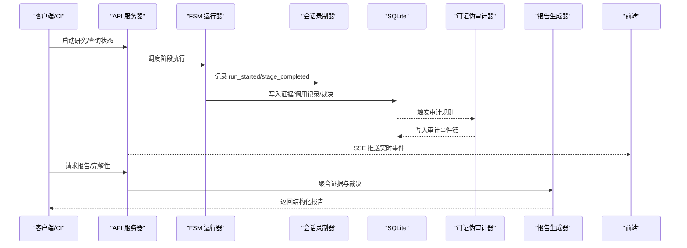

图表来源
- [server.ts:112-256](file://src/api/server.ts#L112-L256)
- [fsm_runner.ts:228-271](file://src/agent_loop/fsm_runner.ts#L228-L271)
- [session_recorder.ts:171-249](file://src/trace/session_recorder.ts#L171-L249)
- [auditor.ts:156-232](file://src/falsifiability/auditor.ts#L156-L232)
- [generator.ts:285-333](file://src/report/generator.ts#L285-L333)

## 详细组件分析

### 不可变证据链与数据完整性验证
- 设计要点：每条证据/调用记录包含 prevHash 与 currentHash，按顺序链接；支持跨语言复验（TS/Python）与 Merkle 根聚合，外部审计方可仅凭根验证整链完整性。
- 验证流程：计算 canonical hash，比较 stored currentHash，验证 prevHash 链从创世到当前头是否连续。
- 前端能力：选择任意证据 seq，拉取包含证明，浏览器本地用 Web Crypto 重算根并与期望根比对，无需下载全部记录。

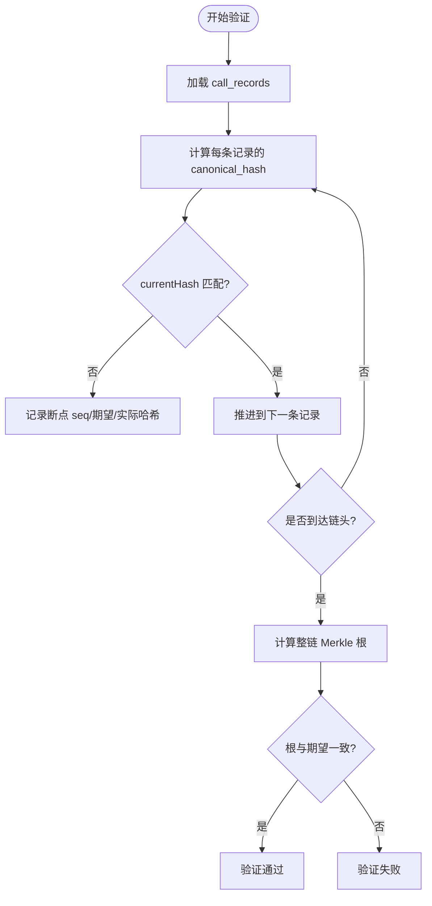

图表来源
- [verify_chain.py:1-56](file://repro/far_chain_repro/verify_chain.py#L1-L56)
- [index.ts (evidence_log):1-92](file://src/evidence_log/index.ts#L1-L92)

章节来源
- [verify_chain.py:1-56](file://repro/far_chain_repro/verify_chain.py#L1-L56)
- [index.ts (evidence_log):1-92](file://src/evidence_log/index.ts#L1-L92)

### 会话记录器的实时事件捕获与分析
- 功能：运行时以 JSONL 追加式记录事件（run_started、stage_completed 等），支持采样率控制、敏感信息脱敏、回放与统计。
- 集成：FSM 运行器在阶段开始/完成时记录事件；前端通过 SSE 订阅实时事件，两次出错自动降级为轮询。
- 安全性：payload 深度脱敏，runId/stageId 做标识脱敏，避免密钥与 PII 泄露。

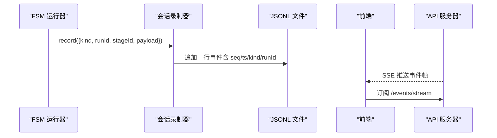

图表来源
- [fsm_runner.ts:228-271](file://src/agent_loop/fsm_runner.ts#L228-L271)
- [session_recorder.ts:171-249](file://src/trace/session_recorder.ts#L171-L249)
- [ResearchWorkbenchPage.tsx:427-489](file://frontend/src/pages/ResearchWorkbenchPage.tsx#L427-L489)

章节来源
- [fsm_runner.ts:228-271](file://src/agent_loop/fsm_runner.ts#L228-L271)
- [session_recorder.ts:171-249](file://src/trace/session_recorder.ts#L171-L249)
- [ResearchWorkbenchPage.tsx:427-489](file://frontend/src/pages/ResearchWorkbenchPage.tsx#L427-L489)

### 零容忍扫描工具的安全检查流程与违规检测规则
- 扫描范围：src、repro、schema、scripts、tests、ci 及配置文件；跳过二进制与缓存。
- 检查项：类型反模式（any、双重断言）、抑制指令（@ts-ignore/@ts-nocheck）、TODO/FIXME、空 catch、HTML 注入、环境变量引用、硬编码密钥形状、百炼 SDK 幻觉参数与头部、模型中立红线、过度声称、对话层红线、N3 反幻觉。
- 输出：分节汇总（零容忍、API 中立、F4 诚实、对话红线、N3 反幻觉），任一命中则 exit(1)。

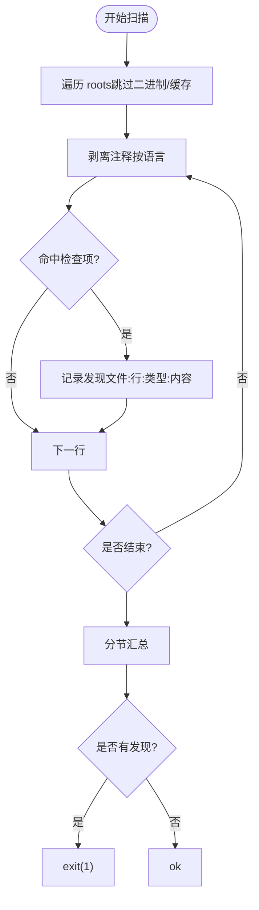

图表来源
- [zero_tolerance_scan.mjs:177-205](file://scripts/zero_tolerance_scan.mjs#L177-L205)
- [zero_tolerance_scan.mjs:211-251](file://scripts/zero_tolerance_scan.mjs#L211-L251)
- [zero_tolerance_scan.mjs:279-331](file://scripts/zero_tolerance_scan.mjs#L279-L331)
- [zero_tolerance_scan.mjs:333-484](file://scripts/zero_tolerance_scan.mjs#L333-L484)
- [zero_tolerance_scan.mjs:486-507](file://scripts/zero_tolerance_scan.mjs#L486-L507)

章节来源
- [zero_tolerance_scan.mjs:45-61](file://scripts/zero_tolerance_scan.mjs#L45-L61)
- [zero_tolerance_scan.mjs:177-205](file://scripts/zero_tolerance_scan.mjs#L177-L205)
- [zero_tolerance_scan.mjs:211-251](file://scripts/zero_tolerance_scan.mjs#L211-L251)
- [zero_tolerance_scan.mjs:279-331](file://scripts/zero_tolerance_scan.mjs#L279-L331)
- [zero_tolerance_scan.mjs:333-484](file://scripts/zero_tolerance_scan.mjs#L333-L484)
- [zero_tolerance_scan.mjs:486-507](file://scripts/zero_tolerance_scan.mjs#L486-L507)

### 安全指标的收集与可视化展示方案
- 指标来源：观测数量、收据完整性、人工审批门计数、研究性门禁裁决、运行模式、新颖度维度、可证伪多样性等。
- 可视化：证据时间线展示关键数值快照（alpha、MDE、调整 p 值、效应量等）；前端排行榜显示问题完整性、裁决分布、领域覆盖。
- 可信性：所有密码学指标真实可用，边界如实标注，避免夸大。

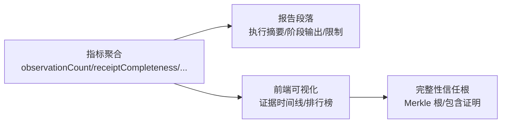

图表来源
- [metrics.ts:189-207](file://src/research/evaluation/metrics.ts#L189-L207)
- [EvidenceTimeline.tsx:387-415](file://frontend/src/components/EvidenceTimeline.tsx#L387-L415)

章节来源
- [metrics.ts:189-207](file://src/research/evaluation/metrics.ts#L189-L207)
- [EvidenceTimeline.tsx:387-415](file://frontend/src/components/EvidenceTimeline.tsx#L387-L415)

### 异常行为的检测与告警机制
- 审计规则：可证伪审计器对契约执行 4 条规则（可证伪性、可观测谓词、可测量性、可实现性），结果入链并统计 PASS/FAIL/WARN/SKIP。
- 扫描告警：零容忍扫描发现违规即中断 CI，防止不合规代码进入主分支。
- 前端提示：完整性页面在篡改剧场中模拟攻击，展示根失效与包含证明失败，增强透明度。

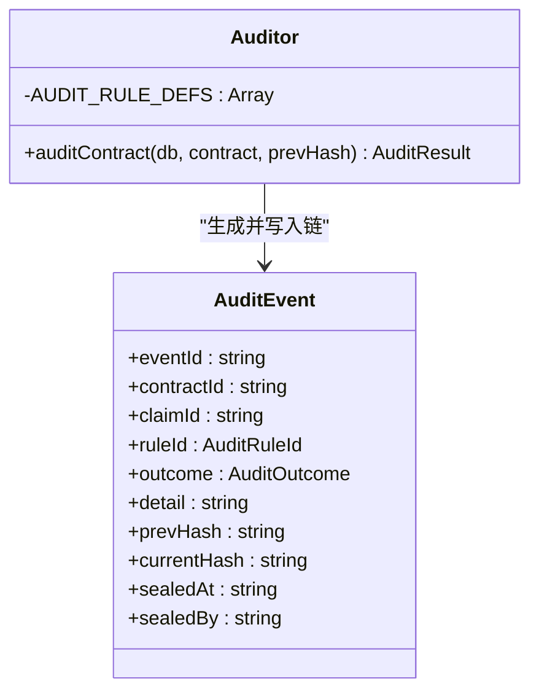

图表来源
- [auditor.ts:156-232](file://src/falsifiability/auditor.ts#L156-L232)

章节来源
- [auditor.ts:156-232](file://src/falsifiability/auditor.ts#L156-L232)

### 审计报告生成与合规性检查自动化流程
- 报告生成：从数据库读取裁决节点、证据日志、调用记录、证据边、最新 repro hash，验证哈希链，组装报告段落（执行摘要、阶段输出、裁决节点、证据图、哈希链校验、限制声明）。
- 合规检查：零容忍扫描在 CI 中执行，阻断不合规代码；报告生成器无 LLM 调用，完全确定性。
- 自动化：CLI 命令支持审计种子樱桃、多种子审计、状态报告、备份与恢复等。

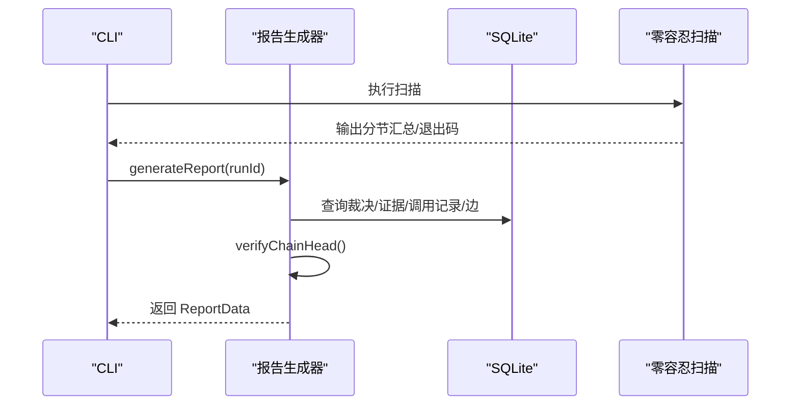

图表来源
- [generator.ts:285-333](file://src/report/generator.ts#L285-L333)
- [zero_tolerance_scan.mjs:486-507](file://scripts/zero_tolerance_scan.mjs#L486-L507)
- [far.ts:1317-1328](file://src/cli/far.ts#L1317-L1328)

章节来源
- [generator.ts:285-333](file://src/report/generator.ts#L285-L333)
- [zero_tolerance_scan.mjs:486-507](file://scripts/zero_tolerance_scan.mjs#L486-L507)
- [far.ts:1317-1328](file://src/cli/far.ts#L1317-L1328)

### 安全事件的响应预案和处理流程
- 事件来源：SSE 实时事件、API 错误信封（RFC 7807）、扫描器发现、审计规则 FAIL/WARN。
- 处理策略：前端在 SSE 两次出错后降级为轮询并如实标注；API 层统一错误响应；报告生成器在哈希链断裂时将对应段落标记为 UNCOMPLETED。
- 响应动作：CI 门禁阻断（零容忍扫描）；审计事件入链（可证伪审计器）；前端展示完整性信任根与包含证明。

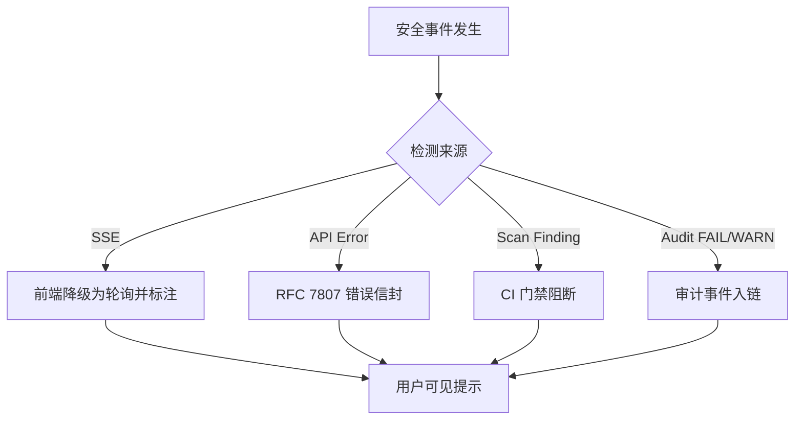

图表来源
- [ResearchWorkbenchPage.tsx:427-489](file://frontend/src/pages/ResearchWorkbenchPage.tsx#L427-L489)
- [types.ts (前端类型):533-571](file://frontend/src/lib/types.ts#L533-L571)
- [zero_tolerance_scan.mjs:486-507](file://scripts/zero_tolerance_scan.mjs#L486-L507)
- [auditor.ts:156-232](file://src/falsifiability/auditor.ts#L156-L232)

章节来源
- [ResearchWorkbenchPage.tsx:427-489](file://frontend/src/pages/ResearchWorkbenchPage.tsx#L427-L489)
- [types.ts (前端类型):533-571](file://frontend/src/lib/types.ts#L533-L571)
- [zero_tolerance_scan.mjs:486-507](file://scripts/zero_tolerance_scan.mjs#L486-L507)
- [auditor.ts:156-232](file://src/falsifiability/auditor.ts#L156-L232)

### 与外部安全工具的集成方式和数据交换格式
- 集成点：API 服务器暴露健康、指标、证据、裁决、报告、完整性、基准、法庭、竞技场等路由；OpenAPI 文档位于 /openapi.json；统一信封 { ok: true, data: T } 与 RFC 7807 错误响应。
- 数据格式：V2 收据验证与持久化端点采用统一信封；前端类型定义 ApiResponse<T> 与 ApiErrorResponse；指标与报告数据结构明确。
- 外部工具：Crossref 适配器用于 DOI 解析与验证，遵循礼貌池约定；LLM 网关提供速率限制与成本估算。

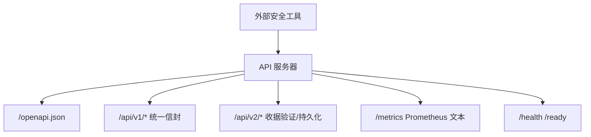

图表来源
- [server.ts:112-256](file://src/api/server.ts#L112-L256)
- [types.ts (前端类型):533-571](file://frontend/src/lib/types.ts#L533-L571)

章节来源
- [server.ts:112-256](file://src/api/server.ts#L112-L256)
- [types.ts (前端类型):533-571](file://frontend/src/lib/types.ts#L533-L571)

## 依赖关系分析
- 组件耦合：FSM 运行器依赖会话录制器与数据库；报告生成器依赖证据日志、裁决节点、调用记录；API 服务器依赖数据库与可选事件总线。
- 直接依赖：证据日志模块导出哈希、验证、搜索、生命周期等功能；可证伪审计器依赖证据日志哈希函数。
- 外部依赖：Fastify 插件（helmet、cors、rate-limit、jwt、swagger）；SQLite（better-sqlite3）；Node 文件系统与加密模块。

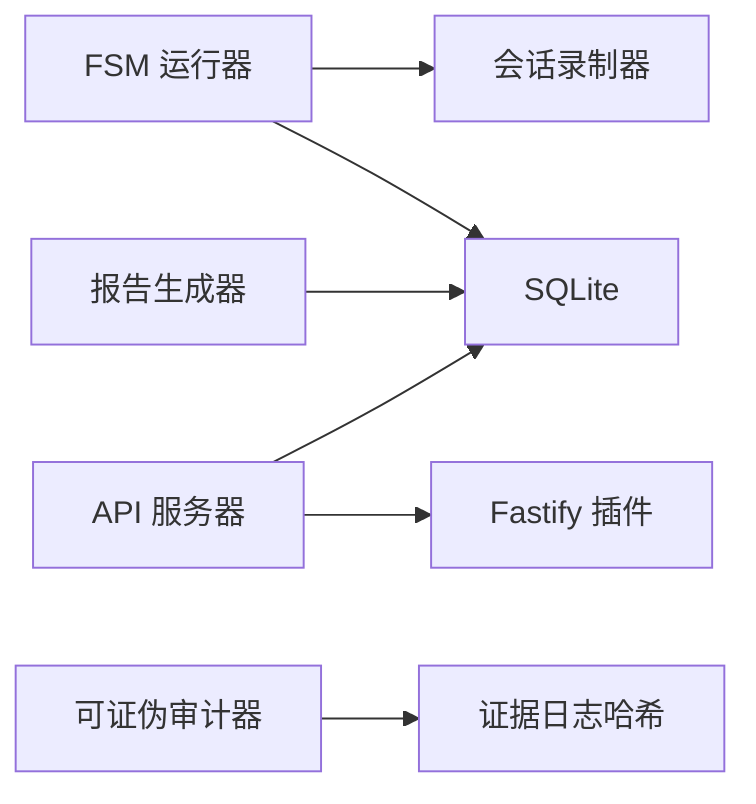

图表来源
- [fsm_runner.ts:228-271](file://src/agent_loop/fsm_runner.ts#L228-L271)
- [session_recorder.ts:171-249](file://src/trace/session_recorder.ts#L171-L249)
- [generator.ts:285-333](file://src/report/generator.ts#L285-L333)
- [server.ts:112-256](file://src/api/server.ts#L112-L256)
- [auditor.ts:156-232](file://src/falsifiability/auditor.ts#L156-L232)

章节来源
- [fsm_runner.ts:228-271](file://src/agent_loop/fsm_runner.ts#L228-L271)
- [session_recorder.ts:171-249](file://src/trace/session_recorder.ts#L171-L249)
- [generator.ts:285-333](file://src/report/generator.ts#L285-L333)
- [server.ts:112-256](file://src/api/server.ts#L112-L256)
- [auditor.ts:156-232](file://src/falsifiability/auditor.ts#L156-L232)

## 性能考量
- 会话录制：追加式 JSONL 写入，支持采样率控制以减少 I/O 压力；损坏行跳过不影响整体回放。
- 哈希链验证：按序计算 canonical hash 并比较，复杂度 O(n)，n 为记录数；Merkle 根聚合降低外部审计带宽。
- 报告生成：纯数据库查询与确定性聚合，无网络与 LLM 调用，适合离线与批量场景。
- 扫描性能：跳过二进制与缓存，剥离注释减少误报；分节汇总避免短路掩盖。

[本节提供一般性指导，无需特定文件分析]

## 故障排查指南
- 哈希链断裂：报告生成器在哈希链验证失败时将对应段落标记为 UNCOMPLETED，并输出断点 seq、期望与实际哈希。
- SSE 连接失败：前端在两次出错后降级为轮询，并如实标注“实时事件不可用”。
- 扫描失败：零容忍扫描输出具体文件、行号与违规类型，依据退出码判断 CI 门禁状态。
- 审计规则 FAIL/WARN：审计事件入链，报告段落包含陷阱审计摘要与触发类别。

章节来源
- [generator.ts:696-762](file://src/report/generator.ts#L696-L762)
- [ResearchWorkbenchPage.tsx:427-489](file://frontend/src/pages/ResearchWorkbenchPage.tsx#L427-L489)
- [zero_tolerance_scan.mjs:486-507](file://scripts/zero_tolerance_scan.mjs#L486-L507)
- [auditor.ts:156-232](file://src/falsifiability/auditor.ts#L156-L232)

## 结论
本系统通过不可变证据链、实时会话录制、零容忍扫描、结构化报告与可视化界面，构建了端到端的安全审计与监控能力。哈希链与 Merkle 根确保数据完整性，审计规则与扫描器提供主动防御，API 与 SSE 支持实时交互，报告与指标支撑决策与合规。建议在生产环境中启用完整审计与扫描门禁，并结合外部工具进行持续集成与监控。

[本节总结性内容，无需特定文件分析]

## 附录
- 术语：证据链、哈希链、Merkle 根、会话录制、零容忍扫描、审计规则、统一信封、RFC 7807。
- 参考：OpenAPI 文档位于 /openapi.json；指标端点 /metrics；健康探针 /health /ready。

[本节为补充说明，无需特定文件分析]