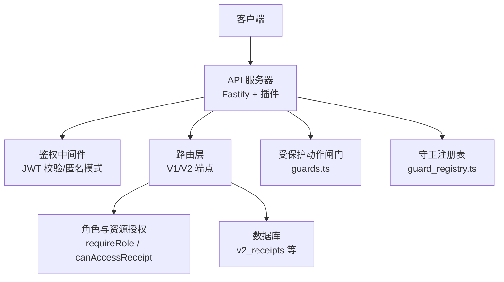
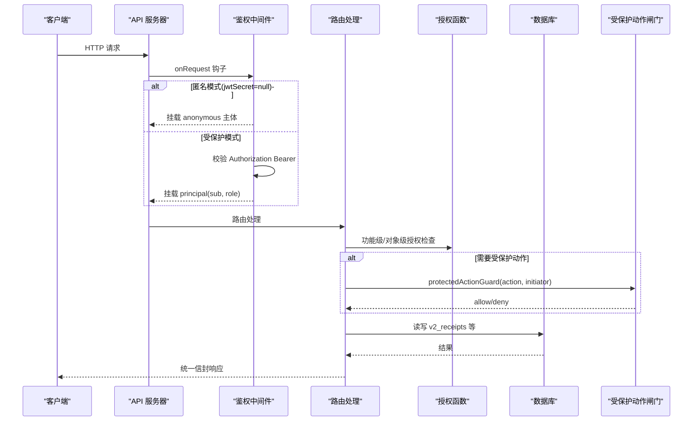
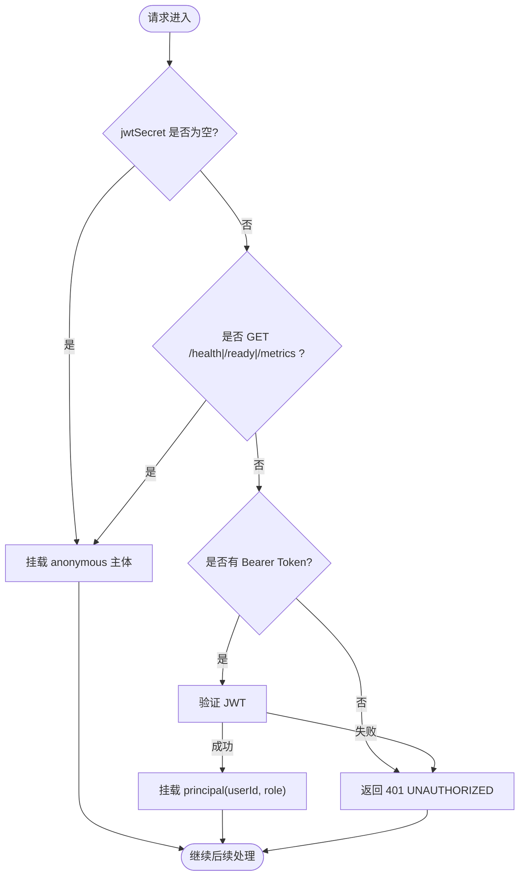
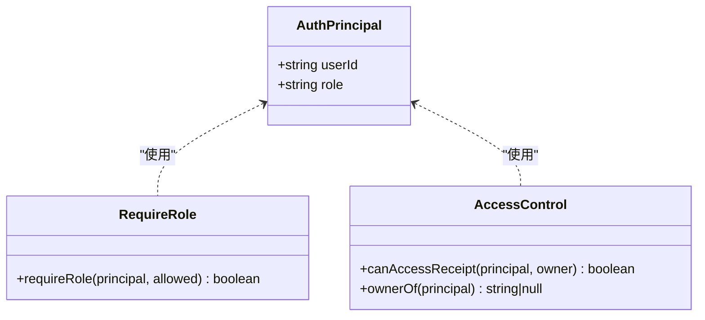
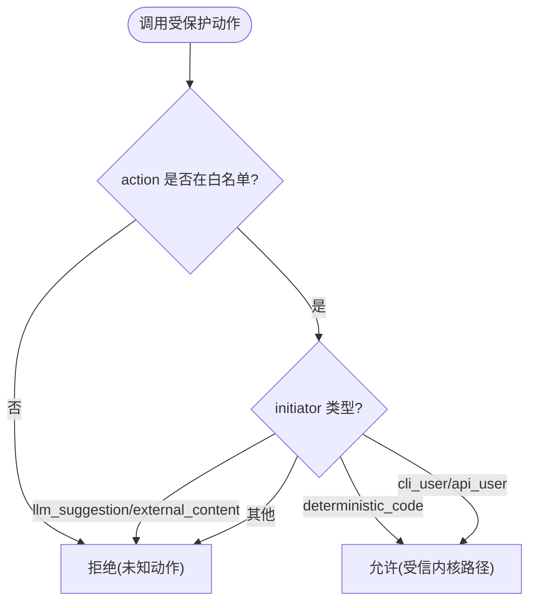
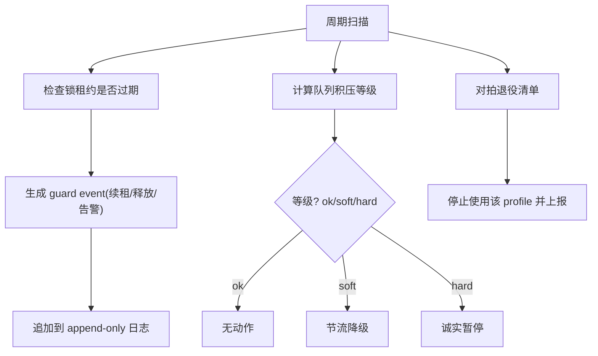
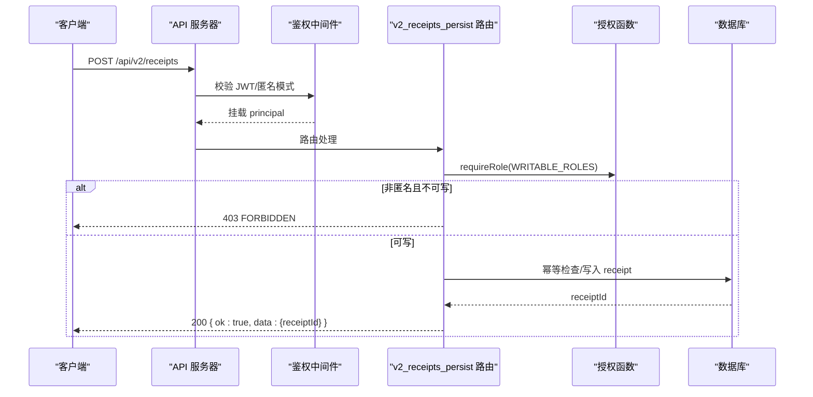
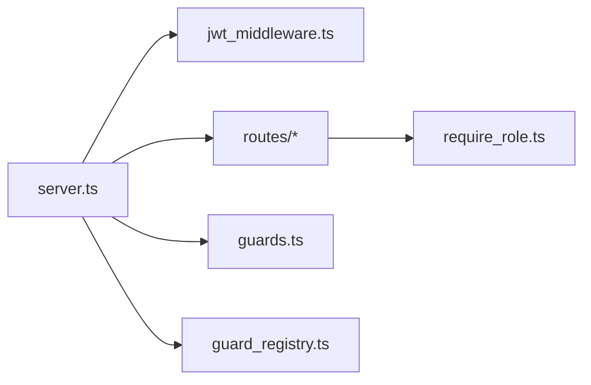

# 权限控制与访问管理

<cite>
**本文引用的文件**
- [src/api/server.ts](file://src/api/server.ts)
- [src/api/auth/jwt_middleware.ts](file://src/api/auth/jwt_middleware.ts)
- [src/api/auth/require_role.ts](file://src/api/auth/require_role.ts)
- [src/api/routes/v2_receipts_persist.ts](file://src/api/routes/v2_receipts_persist.ts)
- [src/agent_loop/guards.ts](file://src/agent_loop/guards.ts)
- [src/campaign/guard_registry.ts](file://src/campaign/guard_registry.ts)
- [src/cli/commands/api.ts](file://src/cli/commands/api.ts)
- [tests/api/server_fail_closed.test.ts](file://tests/api/server_fail_closed.test.ts)
- [tests/cli/api_non_loopback_guard.test.ts](file://tests/cli/api_non_loopback_guard.test.ts)
</cite>

## 目录
1. [简介](#简介)
2. [项目结构](#项目结构)
3. [核心组件](#核心组件)
4. [架构总览](#架构总览)
5. [详细组件分析](#详细组件分析)
6. [依赖关系分析](#依赖关系分析)
7. [性能与安全考量](#性能与安全考量)
8. [故障排查指南](#故障排查指南)
9. [结论](#结论)
10. [附录：配置模板与最佳实践](#附录配置模板与最佳实践)

## 简介
本文件面向“权限控制与访问管理系统”，聚焦以下目标：
- 基于角色的访问控制（RBAC）模型与权限层级结构
- API 端点的认证机制（JWT 令牌验证、会话/匿名模式）
- 资源级访问控制与细粒度权限分配策略（BOLA）
- 守卫注册表与条件检查的执行流程
- 权限继承与委派机制的实现方式
- 权限审计日志与合规性报告生成
- 权限配置模板与最佳实践建议
- 与外部身份提供商集成与单点登录（SSO）支持方案

## 项目结构
系统采用 Fastify 构建 HTTP API，通过中间件实现可选的 JWT 鉴权；路由层在功能与对象两个层面执行授权；内核侧通过“受保护动作闸门”和“写路径清单”确保关键状态转换与写入的最小化与可审计。

图表来源
- [src/api/server.ts:112-170](file://src/api/server.ts#L112-L170)
- [src/api/auth/jwt_middleware.ts:55-110](file://src/api/auth/jwt_middleware.ts#L55-L110)
- [src/api/auth/require_role.ts:24-56](file://src/api/auth/require_role.ts#L24-L56)
- [src/agent_loop/guards.ts:11-80](file://src/agent_loop/guards.ts#L11-L80)
- [src/campaign/guard_registry.ts:24-64](file://src/campaign/guard_registry.ts#L24-L64)

章节来源
- [src/api/server.ts:112-170](file://src/api/server.ts#L112-L170)
- [src/api/auth/jwt_middleware.ts:55-110](file://src/api/auth/jwt_middleware.ts#L55-L110)

## 核心组件
- 鉴权中间件：根据是否配置 JWT 密钥选择“匿名模式”或“受保护模式”，对请求进行 Bearer Token 校验并挂载主体 principal。
- 角色与资源授权：提供 requireRole（功能级）、canAccessReceipt（对象级/BOLA）、ownerOf（归属解析）。
- 受保护动作闸门：冻结/批准/seal/导出/迁移/删除等关键操作需经确定性代码判定，拒绝来自 LLM 建议或外部内容的触发。
- 守卫注册表：维护监控清单、租约过期检测、队列积压三档阈值、退役清单对拍及事件日志。
- 服务器启动与插件链：按顺序注册安全头、CORS、限流、JWT、Swagger、鉴权中间件、错误处理器与路由。

章节来源
- [src/api/auth/jwt_middleware.ts:55-110](file://src/api/auth/jwt_middleware.ts#L55-L110)
- [src/api/auth/require_role.ts:24-56](file://src/api/auth/require_role.ts#L24-L56)
- [src/agent_loop/guards.ts:11-80](file://src/agent_loop/guards.ts#L11-L80)
- [src/campaign/guard_registry.ts:24-64](file://src/campaign/guard_registry.ts#L24-L64)
- [src/api/server.ts:112-170](file://src/api/server.ts#L112-L170)

## 架构总览
下图展示从请求进入、鉴权、授权到数据持久化的完整链路，以及受保护动作闸门如何拦截高风险操作。

图表来源
- [src/api/server.ts:112-170](file://src/api/server.ts#L112-L170)
- [src/api/auth/jwt_middleware.ts:55-110](file://src/api/auth/jwt_middleware.ts#L55-L110)
- [src/api/auth/require_role.ts:24-56](file://src/api/auth/require_role.ts#L24-L56)
- [src/agent_loop/guards.ts:11-80](file://src/agent_loop/guards.ts#L11-L80)
- [src/api/routes/v2_receipts_persist.ts:92-124](file://src/api/routes/v2_receipts_persist.ts#L92-L124)

## 详细组件分析

### 组件一：JWT 鉴权中间件与匿名模式
- 行为要点
  - 当未配置 jwtSecret 时，所有请求挂载 anonymous 主体（离线单机信任模式）。
  - 配置了 jwtSecret 时，仅 GET /health、/ready、/metrics 豁免鉴权，其余请求必须携带有效 Bearer Token。
  - 失败一律返回 401，不泄露内部信息（fail-closed）。
- 主体结构
  - principal.userId、principal.role（viewer/researcher/admin/anonymous）。

图表来源
- [src/api/auth/jwt_middleware.ts:55-110](file://src/api/auth/jwt_middleware.ts#L55-L110)

章节来源
- [src/api/auth/jwt_middleware.ts:55-110](file://src/api/auth/jwt_middleware.ts#L55-L110)
- [src/api/server.ts:141-146](file://src/api/server.ts#L141-L146)

### 组件二：RBAC 与资源级授权（BOLA）
- 角色与权限
  - viewer：只读
  - researcher/admin：可写
  - anonymous：离线模式下全部放行
- 资源级授权
  - 公开资源（owner 为 null）允许读取
  - 私有资源仅 owner 本人可访问（水平越权拒绝）
- 归属解析
  - 受保护模式写入 owner=principal.userId；匿名模式 owner=null（公开创建）

图表来源
- [src/api/auth/require_role.ts:24-56](file://src/api/auth/require_role.ts#L24-L56)

章节来源
- [src/api/auth/require_role.ts:24-56](file://src/api/auth/require_role.ts#L24-L56)
- [src/api/routes/v2_receipts_persist.ts:92-124](file://src/api/routes/v2_receipts_persist.ts#L92-L124)
- [src/api/routes/v2_receipts_persist.ts:236-250](file://src/api/routes/v2_receipts_persist.ts#L236-L250)
- [src/api/routes/v2_receipts_persist.ts:293-305](file://src/api/routes/v2_receipts_persist.ts#L293-L305)

### 组件三：受保护动作闸门与写路径最小化
- 受保护动作：freeze、approve、seal、export、migrate、delete
- 发起方限制：仅人类通道（cli_user/api_user）与受信确定性代码可放行；LLM 建议/外部内容一律拒绝
- 写路径清单：仅允许有限的数据库/文件系统写入，新增写路径需登记

图表来源
- [src/agent_loop/guards.ts:11-80](file://src/agent_loop/guards.ts#L11-L80)

章节来源
- [src/agent_loop/guards.ts:11-80](file://src/agent_loop/guards.ts#L11-L80)

### 组件四：守卫注册表与条件检查执行流程
- 监控清单：预算熔断、速率限制、资源压力、队列积压、进程存活、提供者退役、语料配置漂移、锁租约过期、重复失败、不安全输出、审计日志失败
- 新机制
  - 锁租约过期：TTL 到期强制释放并记录事件
  - 队列积压：ok/soft/hard 三档深度，对应 none/degrade/pause
  - 提供者退役：机器可读退役清单对拍活跃 profile，命中即停用
- 事件日志：seq 连续、append-only，支持恢复事件显式入账

图表来源
- [src/campaign/guard_registry.ts:24-64](file://src/campaign/guard_registry.ts#L24-L64)
- [src/campaign/guard_registry.ts:88-126](file://src/campaign/guard_registry.ts#L88-L126)
- [src/campaign/guard_registry.ts:142-150](file://src/campaign/guard_registry.ts#L142-L150)
- [src/campaign/guard_registry.ts:170-180](file://src/campaign/guard_registry.ts#L170-L180)
- [src/campaign/guard_registry.ts:186-243](file://src/campaign/guard_registry.ts#L186-L243)

章节来源
- [src/campaign/guard_registry.ts:24-64](file://src/campaign/guard_registry.ts#L24-L64)
- [src/campaign/guard_registry.ts:88-126](file://src/campaign/guard_registry.ts#L88-L126)
- [src/campaign/guard_registry.ts:142-150](file://src/campaign/guard_registry.ts#L142-L150)
- [src/campaign/guard_registry.ts:170-180](file://src/campaign/guard_registry.ts#L170-L180)
- [src/campaign/guard_registry.ts:186-243](file://src/campaign/guard_registry.ts#L186-L243)

### 组件五：API 端点认证与授权执行序列
以 V2 Receipt 持久化为例，展示认证→授权→落库的完整流程。

图表来源
- [src/api/auth/jwt_middleware.ts:55-110](file://src/api/auth/jwt_middleware.ts#L55-L110)
- [src/api/auth/require_role.ts:24-56](file://src/api/auth/require_role.ts#L24-L56)
- [src/api/routes/v2_receipts_persist.ts:92-124](file://src/api/routes/v2_receipts_persist.ts#L92-L124)

章节来源
- [src/api/routes/v2_receipts_persist.ts:92-124](file://src/api/routes/v2_receipts_persist.ts#L92-L124)

## 依赖关系分析
- server.ts 负责插件链与路由注册，依赖 jwt_middleware、require_role、各路由模块
- jwt_middleware 依赖 Fastify 的 jwt 插件与统一错误响应
- 路由层依赖 require_role 进行功能级与对象级授权
- agent_loop/guards.ts 与 campaign/guard_registry.ts 提供内核侧的安全闸门与运行时守卫

图表来源
- [src/api/server.ts:112-170](file://src/api/server.ts#L112-L170)
- [src/api/auth/jwt_middleware.ts:55-110](file://src/api/auth/jwt_middleware.ts#L55-L110)
- [src/api/auth/require_role.ts:24-56](file://src/api/auth/require_role.ts#L24-L56)
- [src/agent_loop/guards.ts:11-80](file://src/agent_loop/guards.ts#L11-L80)
- [src/campaign/guard_registry.ts:24-64](file://src/campaign/guard_registry.ts#L24-L64)

章节来源
- [src/api/server.ts:112-170](file://src/api/server.ts#L112-L170)

## 性能与安全考量
- 默认开启请求超时与连接回收，防止慢调用与连接泄漏
- 限流插件默认 100 req/min，可按需调整
- 匿名模式与受保护模式双轨运行，避免误伤本地开发场景
- 空 secret 被拒绝，防止 HS256 空 key 伪造 admin 的风险
- 健康探针精确豁免，避免在生产环境引入额外负载

章节来源
- [src/api/server.ts:121-146](file://src/api/server.ts#L121-L146)
- [tests/api/server_fail_closed.test.ts:19-46](file://tests/api/server_fail_closed.test.ts#L19-L46)
- [tests/api/server_fail_closed.test.ts:80-109](file://tests/api/server_fail_closed.test.ts#L80-L109)

## 故障排查指南
- 401 未授权
  - 检查是否配置了 jwtSecret；若已配置，确认 Authorization 头格式为 Bearer <token>
  - 确认 token 未过期且签名有效
- 403 禁止访问
  - 检查当前 principal.role 是否具备所需权限（viewer 只读）
  - 对象级访问需满足 owner 匹配或资源公开
- 启动异常
  - 空 secret 会被拒绝为 null（离线模式），不会启用 JWT 鉴权
  - 非 loopback 主机在匿名模式下可正常启动；受保护模式需显式传入有效 jwtSecret

章节来源
- [src/api/auth/jwt_middleware.ts:71-109](file://src/api/auth/jwt_middleware.ts#L71-L109)
- [src/api/auth/require_role.ts:24-56](file://src/api/auth/require_role.ts#L24-L56)
- [tests/api/server_fail_closed.test.ts:80-109](file://tests/api/server_fail_closed.test.ts#L80-L109)
- [tests/cli/api_non_loopback_guard.test.ts:68-91](file://tests/cli/api_non_loopback_guard.test.ts#L68-L91)

## 结论
本系统通过“可选 JWT 鉴权 + 明确的角色与资源授权 + 内核受保护动作闸门 + 运行时守卫注册表”的组合，实现了从网络入口到数据落盘的全链路可控与可审计。匿名模式保障本地开发与演示便利，受保护模式提供生产级安全基线；RBAC 与 BOLA 共同构成细粒度权限体系；守卫注册表将运行时风险可视化并可自动降级或暂停，提升整体可靠性与合规性。

## 附录：配置模板与最佳实践

- 环境变量与启动参数
  - FAR_JWT_SECRET：设置后启用受保护模式；为空或缺失则进入匿名模式
  - --protected：配合 FAR_JWT_SECRET 启用强鉴权
  - --host：默认 127.0.0.1；生产部署可设为 0.0.0.0（需配合受保护模式）
  - --port：服务监听端口

- 角色与权限映射
  - viewer：只读（查询类接口）
  - researcher/admin：可写（创建/更新/删除资源）
  - anonymous：离线模式全放行

- 资源级访问控制
  - 公开资源（owner=null）：允许读取
  - 私有资源：仅 owner 可访问（BOLA）

- 审计与合规
  - 受保护动作闸门：关键状态变更需确定性代码许可
  - 写路径清单：仅允许最小集写入，新增需登记
  - 守卫事件日志：append-only、seq 连续，支持恢复事件显式入账

- 与外部身份提供商集成与 SSO
  - 鉴权中间件仅验证 JWT 签名与载荷中的 sub/role，不关心签发者
  - 集成步骤
    - 配置外部 IdP 签发 RS256/HS256 JWT，包含 sub（用户标识）与 role（viewer/researcher/admin）
    - 将 IdP 公钥或共享密钥注入到服务器的 jwtSecret（或公钥配置，取决于框架实现）
    - 前端获取 IdP 令牌后，在请求头中附加 Authorization: Bearer <token>
  - 注意
    - 健康探针 /health、/ready、/metrics 在受保护模式下仍匿名可访问
    - 空 secret 将被拒绝，避免弱密钥风险

- 最佳实践
  - 生产环境务必启用受保护模式，并定期轮换密钥
  - 遵循最小权限原则：尽量授予 viewer，仅在必要时授予 researcher/admin
  - 对敏感资源启用 BOLA，避免 ID 枚举与水平越权
  - 启用限流与超时，结合守卫注册表的队列积压与健康探针，形成闭环防护
  - 保留完整的审计日志与守卫事件，便于事后追溯与合规审查

章节来源
- [src/cli/commands/api.ts:101-123](file://src/cli/commands/api.ts#L101-L123)
- [src/api/auth/jwt_middleware.ts:55-110](file://src/api/auth/jwt_middleware.ts#L55-L110)
- [src/api/auth/require_role.ts:24-56](file://src/api/auth/require_role.ts#L24-L56)
- [src/agent_loop/guards.ts:11-80](file://src/agent_loop/guards.ts#L11-L80)
- [src/campaign/guard_registry.ts:186-243](file://src/campaign/guard_registry.ts#L186-L243)