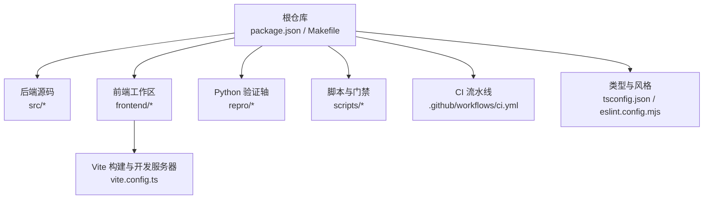
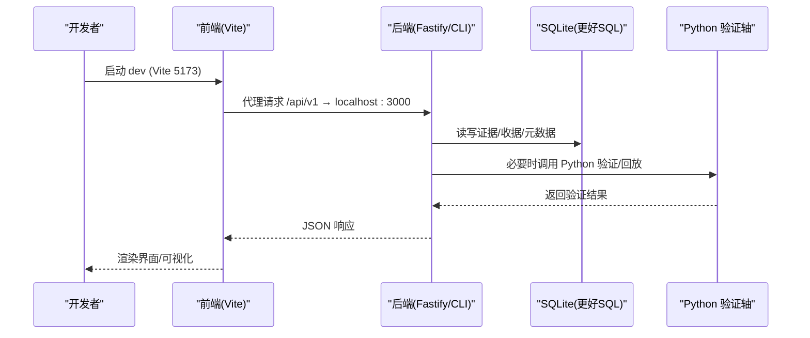
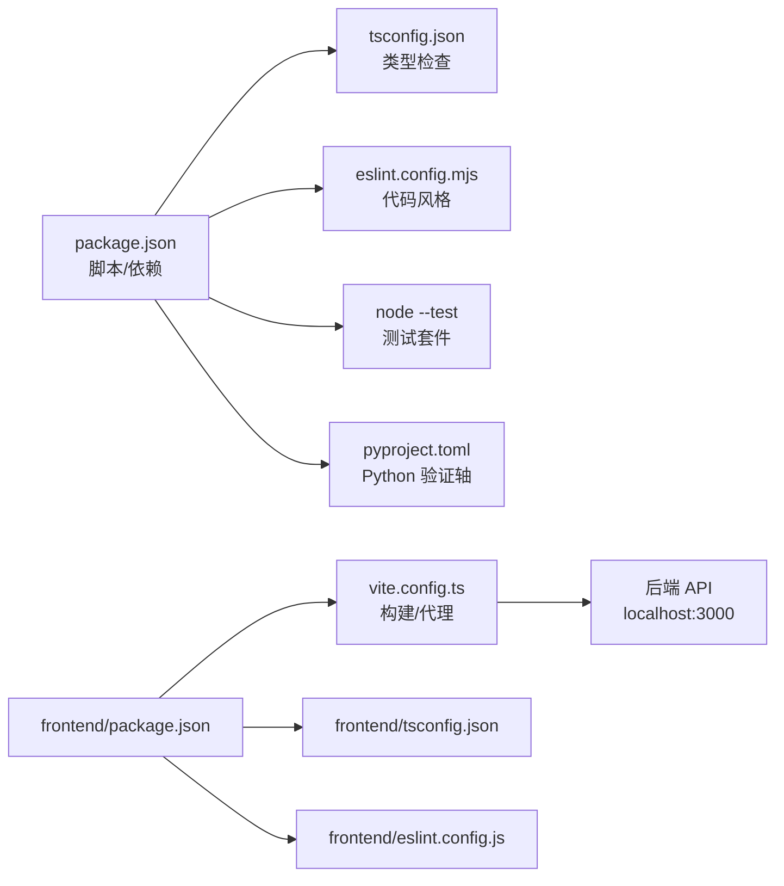

# 开发者指南

<cite>
**本文引用的文件**
- [README.md](file://README.md)
- [CONTRIBUTING.md](file://CONTRIBUTING.md)
- [package.json](file://package.json)
- [Makefile](file://Makefile)
- [eslint.config.mjs](file://eslint.config.mjs)
- [tsconfig.json](file://tsconfig.json)
- [.github/workflows/ci.yml](file://.github/workflows/ci.yml)
- [SECURITY.md](file://SECURITY.md)
- [CODE_OF_CONDUCT.md](file://CODE_OF_CONDUCT.md)
- [pyproject.toml](file://pyproject.toml)
- [frontend/package.json](file://frontend/package.json)
- [frontend/eslint.config.js](file://frontend/eslint.config.js)
- [frontend/tsconfig.json](file://frontend/tsconfig.json)
- [frontend/vite.config.ts](file://frontend/vite.config.ts)
</cite>

## 目录
1. [简介](#简介)
2. [项目结构](#项目结构)
3. [核心组件](#核心组件)
4. [架构总览](#架构总览)
5. [详细组件分析](#详细组件分析)
6. [依赖关系分析](#依赖关系分析)
7. [性能考虑](#性能考虑)
8. [故障排除指南](#故障排除指南)
9. [结论](#结论)
10. [附录](#附录)

## 简介
本指南面向新贡献者，提供从环境搭建、依赖管理到代码规范、Git 工作流、Pull Request 流程与审查标准、调试技巧、文档编写、持续集成与自动化测试、常见问题与排障、社区参与方式以及性能分析与内存泄漏检测方法的完整说明。FAR-Lab 是一个证据约束、可证伪、可迭代、可追溯的开源 AI Scientist 研究系统，后端以 TypeScript/Node.js 为主，前端为 React+Vite 仪表盘，Python 用于确定性回放与验证轴。

## 项目结构
仓库采用多语言、多工作区组织：
- 根目录：TypeScript/Node 后端 CLI、API、核心逻辑与脚本；pnpm 包管理与 CI 配置。
- frontend：React + Vite 前端应用，独立 npm 工作区（非 pnpm workspace），包含构建、类型检查、ESLint 与 Vitest 测试。
- repro：Python 确定性回放与验证工具链。
- scripts：质量门禁、生成脚本、发布与审计等辅助脚本。
- ci：CI 中的轻量冒烟脚本。
- schema：JSON Schema、OpenAPI 与数据库迁移。

图表来源
- [package.json:45-82](file://package.json#L45-L82)
- [frontend/vite.config.ts:8-65](file://frontend/vite.config.ts#L8-L65)
- [Makefile:14-40](file://Makefile#L14-L40)

章节来源
- [README.md:337-360](file://README.md#L337-L360)
- [package.json:45-82](file://package.json#L45-L82)
- [frontend/package.json:8-15](file://frontend/package.json#L8-L15)
- [Makefile:14-40](file://Makefile#L14-L40)

## 核心组件
- 开发与运行入口
  - 根命令：通过 package.json 暴露 far、api、dev 等脚本，统一调用 src/cli/far.ts。
  - 快速启动：pnpm install 后使用 pnpm dev 同时启动 API 与前端开发服务器。
- 前端工作区
  - 技术栈：React + Vite + TypeScript + Tailwind + Vitest。
  - 构建与预览：npm run build、preview；类型检查 tsc -b；ESLint 校验。
- Python 验证轴
  - 依赖：SymPy/Z3 等用于数学验证与确定性回放；可选科学数据依赖 lightkurve/astroquery。
- 质量门禁
  - 类型检查：tsc --noEmit。
  - 代码风格：ESLint 零容忍规则。
  - 测试：node --test 全量分片执行；Python unittest。
  - 跨语言一致性：TS 与 Python 哈希一致。
  - OpenAPI/JSON Schema 契约稳定。

章节来源
- [package.json:45-82](file://package.json#L45-L82)
- [frontend/package.json:8-15](file://frontend/package.json#L8-L15)
- [pyproject.toml:1-22](file://pyproject.toml#L1-L22)
- [.github/workflows/ci.yml:194-273](file://.github/workflows/ci.yml#L194-L273)

## 架构总览
下图展示本地开发时前后端交互与关键工具链：

图表来源
- [frontend/vite.config.ts:47-58](file://frontend/vite.config.ts#L47-L58)
- [package.json:74-76](file://package.json#L74-L76)
- [pyproject.toml:10-15](file://pyproject.toml#L10-L15)

## 详细组件分析

### 环境与依赖管理
- Node/Python 版本要求
  - Node ≥ 24；Python 3.11/3.12；pnpm 10.x。
- 安装步骤
  - 克隆仓库后执行 pnpm install；如需 Python 验证轴，执行 ensure_py_deps 或 pip install -e .。
  - 使用 make bootstrap 或 pnpm install 完成依赖安装。
- 依赖锁定与缓存
  - 根仓库使用 pnpm lockfile；前端使用 npm lockfile；CI 中分别缓存 pnpm/npm/pip。
- 常用命令
  - 类型检查：pnpm typecheck
  - 代码风格：pnpm lint
  - 测试：pnpm test；Python 测试：pnpm run test:py
  - 构建前端：pnpm build 或 pnpm --dir frontend run build

章节来源
- [CONTRIBUTING.md:6-24](file://CONTRIBUTING.md#L6-L24)
- [Makefile:14-40](file://Makefile#L14-L40)
- [package.json:45-82](file://package.json#L45-L82)
- [pyproject.toml:1-22](file://pyproject.toml#L1-L22)

### 代码规范与风格指南
- TypeScript 严格模式
  - tsconfig.json 启用 strict、noUncheckedIndexedAccess、exactOptionalPropertyTypes、noUnusedLocals/Parameters 等。
- ESLint 规则（后端）
  - 零容忍：禁止 any、禁止 @ts-ignore/@ts-nocheck、禁止空 catch、安全相关规则（eval/new Function）、禁用 debugger、prefer-const/no-var。
  - 忽略范围：dist、node_modules、frontend、repro、*.config.*、scripts、tests。
- ESLint 规则（前端）
  - 启用 React/Hooks 插件，同样禁止 any、@ts-ignore、空 catch。
- 命名约定
  - TypeScript 内存字段使用 camelCase；SQLite 物理列使用 snake_case。

章节来源
- [tsconfig.json:1-18](file://tsconfig.json#L1-L18)
- [eslint.config.mjs:1-54](file://eslint.config.mjs#L1-L54)
- [frontend/eslint.config.js:1-26](file://frontend/eslint.config.js#L1-L26)
- [CONTRIBUTING.md:87-92](file://CONTRIBUTING.md#L87-L92)

### Git 工作流与分支管理
- 分支策略
  - 基于默认分支创建功能分支，命名建议 feat/<short-slug>；一个分支对应一个逻辑变更。
- 提交信息
  - 遵循 Conventional Commits（feat/fix/refactor/docs/test/chore/ci），主题 ≤ 72 字符。
- 合并前自检
  - 在本地先跑 pnpm typecheck、pnpm lint、pnpm test、pnpm run test:py，确保全部通过再提交 PR。

章节来源
- [CONTRIBUTING.md:26-46](file://CONTRIBUTING.md#L26-L46)

### Pull Request 流程与代码审查标准
- PR 要求
  - 描述变更驱动的真实依赖与生产调用点；必须通过所有质量门禁。
- 质量门禁（本地与 CI）
  - TypeScript 类型检查、ESLint 零警告、全量测试、Python 测试、跨语言一致性、OpenAPI/JSON Schema 契约稳定、覆盖率与复杂度预算、反剧场扫描、供应链加固、机密扫描等。
- 审查要点
  - 是否引入 any/@ts-ignore、空 catch、硬编码密钥/URL、innerHTML/dangerouslySetInnerHTML、可变参数、删除参数修复函数签名等“零容忍”问题。
  - 是否将模型特定逻辑限制在适配器边界内。

章节来源
- [CONTRIBUTING.md:47-77](file://CONTRIBUTING.md#L47-L77)
- [.github/workflows/ci.yml:117-157](file://.github/workflows/ci.yml#L117-L157)
- [.github/workflows/ci.yml:311-331](file://.github/workflows/ci.yml#L311-L331)
- [.github/workflows/ci.yml:587-651](file://.github/workflows/ci.yml#L587-L651)

### 调试技巧与开发工具推荐
- 本地开发
  - 使用 pnpm dev 同时启动 API 与前端开发服务器；前端通过 Vite 代理转发 /api/v1 到后端。
  - 使用 pnpm api 单独启动后端服务。
- 诊断与环境自测
  - 使用 far doctor 进行环境自检（不读取密钥值）。
- 日志与追踪
  - 避免在生产路径使用 console.log；ESLint 仅允许 warn/error。
- 前端调试
  - 使用浏览器开发者工具与 Vitest 单测；Vite 支持热重载与错误堆栈定位。

章节来源
- [frontend/vite.config.ts:47-58](file://frontend/vite.config.ts#L47-L58)
- [package.json:74-76](file://package.json#L74-L76)
- [eslint.config.mjs:35-38](file://eslint.config.mjs#L35-L38)
- [README.md:337-346](file://README.md#L337-L346)

### 文档编写规范与更新流程
- 文档位置
  - README 为用户文档主入口；内部扩展文档不在仓库分发。
- 命令参考
  - 通过 far --help 与各子命令 --help 获取最新 CLI 参考。
- 文档与 CLI 一致性
  - CI 包含 doc_command_check 门禁，确保文档与 CLI 行为一致。

章节来源
- [README.md:330-334](file://README.md#L330-L334)
- [.github/workflows/ci.yml:634-635](file://.github/workflows/ci.yml#L634-L635)

### 持续集成流程与自动化测试执行
- CI 阶段概览
  - 安装依赖 → 前端门禁 → 类型检查 → Lint → Python 语法门 → TS 测试分片 → Python 测试 → 注册表兜底 → 复现检查 → 跨语言一致性 → 条件性竞争冒烟 → 链式自验 → Merkle 完整性 → 离线发布冒烟 → 阻断性门禁（覆盖率/复杂度/反剧场/机密扫描/供应链/文档一致性等）。
- 关键特性
  - 分片执行提升稳定性；性能预算门（墙钟计时）；OpenAPI/JSON Schema 字节稳定检查；cross_lang 最高优先闸门。
- 本地等效命令
  - 使用 Makefile 的 verify/targets 或 pnpm 脚本组合实现相同门禁。

章节来源
- [.github/workflows/ci.yml:19-651](file://.github/workflows/ci.yml#L19-L651)
- [Makefile:14-40](file://Makefile#L14-L40)
- [package.json:45-82](file://package.json#L45-L82)

### 常见问题解答与故障排除
- 常见环境问题
  - Node 版本过低导致 native 模块编译失败：需 Node ≥ 24；或使用 Docker 镜像。
  - Windows 长路径与实时杀毒干扰：启用 longpaths 并加入排除列表。
  - Python 依赖缺失：执行 ensure_py_deps 或 pip install -e .。
- 测试失败
  - 若 CI 卡住，检查 node --test 分片超时与 spawn 超时；确认 Python 环境可用。
- 密钥与凭据
  - 严禁提交任何密钥；使用 .env.example 模板；far doctor 仅检查是否存在且非空。
- 前端构建
  - esbuild 目标需匹配现代浏览器；Vite 已配置 es2022 目标以避免降级错误。

章节来源
- [README.md:293-327](file://README.md#L293-L327)
- [SECURITY.md:44-72](file://SECURITY.md#L44-L72)
- [frontend/vite.config.ts:10-25](file://frontend/vite.config.ts#L10-L25)
- [.github/workflows/ci.yml:194-273](file://.github/workflows/ci.yml#L194-L273)

### 社区参与方式与沟通渠道
- 讨论与安全
  - 使用 GitHub Discussions 进行讨论；安全问题通过 Private Vulnerability Reporting 报告。
- 行为准则
  - 遵守 Code of Conduct；科学诚信高于个人立场；伪造测试结果零容忍。

章节来源
- [CONTRIBUTING.md:122-127](file://CONTRIBUTING.md#L122-L127)
- [SECURITY.md:10-28](file://SECURITY.md#L10-L28)
- [CODE_OF_CONDUCT.md:78-87](file://CODE_OF_CONDUCT.md#L78-L87)

### 性能分析与内存泄漏检测方法
- 性能预算与监控
  - CI 包含 perf_budget 门禁，测量 CLI 冷启动、demo 墙钟与测试链墙钟，超阈即失败。
  - 本地可通过 pnpm run perf:budget 触发预算检查。
- 内存与资源
  - 使用 Node 内置堆快照与 Chrome DevTools 对前端进行分析；关注大依赖（如 d3）的分块加载。
- 并发与 I/O
  - 注意 SQLite 写入并发限制；高并发场景建议使用 PostgreSQL（当前为单进程 SQLite）。
- 回归与冒烟
  - 利用 smoke-core 与 offline_release_smoke 保障发布形态可用性。

章节来源
- [.github/workflows/ci.yml:261-273](file://.github/workflows/ci.yml#L261-L273)
- [package.json:81-82](file://package.json#L81-L82)
- [frontend/vite.config.ts:24-40](file://frontend/vite.config.ts#L24-L40)
- [README.md:445-453](file://README.md#L445-L453)

## 依赖关系分析
下图展示根仓库与前端工作区的依赖与构建关系：

图表来源
- [package.json:45-82](file://package.json#L45-L82)
- [tsconfig.json:1-18](file://tsconfig.json#L1-L18)
- [eslint.config.mjs:1-54](file://eslint.config.mjs#L1-L54)
- [pyproject.toml:1-22](file://pyproject.toml#L1-L22)
- [frontend/package.json:8-15](file://frontend/package.json#L8-L15)
- [frontend/vite.config.ts:8-65](file://frontend/vite.config.ts#L8-L65)
- [frontend/tsconfig.json:1-33](file://frontend/tsconfig.json#L1-L33)
- [frontend/eslint.config.js:1-26](file://frontend/eslint.config.js#L1-L26)

章节来源
- [package.json:45-82](file://package.json#L45-L82)
- [frontend/package.json:8-15](file://frontend/package.json#L8-L15)

## 性能考虑
- 构建优化
  - 前端通过 manualChunks 拆分大依赖（d3、react 生态、查询库），减少首屏体积。
- 运行时优化
  - 避免不必要的 console.log；使用结构化日志；合理设置超时与重试。
- 测试性能
  - 使用分片测试与超时保护；关注 CI 墙钟预算。
- 存储与并发
  - SQLite 适合低并发；高并发场景迁移至 PostgreSQL。

章节来源
- [frontend/vite.config.ts:24-40](file://frontend/vite.config.ts#L24-L40)
- [eslint.config.mjs:35-38](file://eslint.config.mjs#L35-L38)
- [.github/workflows/ci.yml:261-273](file://.github/workflows/ci.yml#L261-L273)
- [README.md:445-453](file://README.md#L445-L453)

## 故障排除指南
- 安装失败
  - 确认 Node 版本≥24；Windows 启用 longpaths；必要时使用 Docker。
- 测试不稳定
  - 检查 Python 依赖与网络限流；确认 spawn 超时与线程数限制。
- 前端构建报错
  - 检查 esbuild 目标与依赖兼容性；确保 vite.config.ts 中 target 设置为 es2022。
- 密钥泄露
  - 立即轮换密钥并从历史中清除；使用 secret_scan 门禁预防。

章节来源
- [README.md:293-327](file://README.md#L293-L327)
- [SECURITY.md:44-72](file://SECURITY.md#L44-L72)
- [frontend/vite.config.ts:10-25](file://frontend/vite.config.ts#L10-L25)
- [.github/workflows/ci.yml:630-631](file://.github/workflows/ci.yml#L630-L631)

## 结论
本指南总结了 FAR-Lab 的开发环境搭建、依赖管理、代码规范、Git 工作流、PR 流程与审查标准、调试技巧、文档规范、CI 与自动化测试、常见问题与排障、社区参与方式以及性能分析与内存泄漏检测方法。遵循这些实践可显著提升贡献效率与代码质量，并确保跨语言一致性与可复现性。

## 附录
- 快速命令速查
  - 安装：pnpm install
  - 类型检查：pnpm typecheck
  - 代码风格：pnpm lint
  - 测试：pnpm test；Python 测试：pnpm run test:py
  - 构建前端：pnpm build
  - 开发：pnpm dev；API：pnpm api
  - 环境自检：far doctor
- 参考文件
  - 贡献指南：CONTRIBUTING.md
  - 安全策略：SECURITY.md
  - 行为准则：CODE_OF_CONDUCT.md

章节来源
- [package.json:45-82](file://package.json#L45-L82)
- [CONTRIBUTING.md:6-24](file://CONTRIBUTING.md#L6-L24)
- [SECURITY.md:44-72](file://SECURITY.md#L44-L72)
- [CODE_OF_CONDUCT.md:78-87](file://CODE_OF_CONDUCT.md#L78-L87)