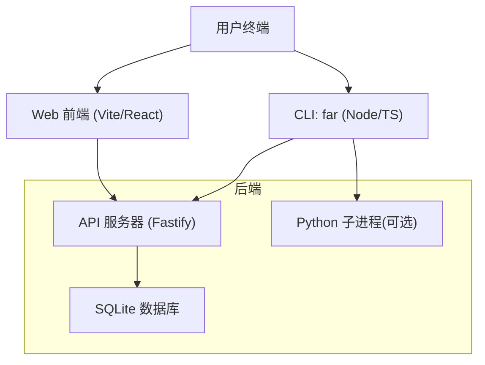
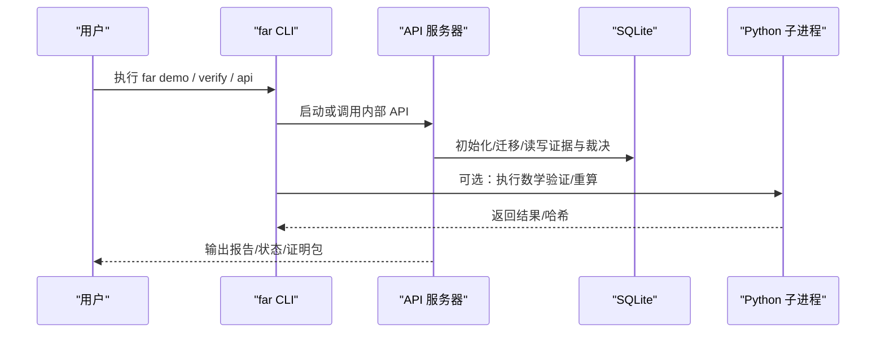
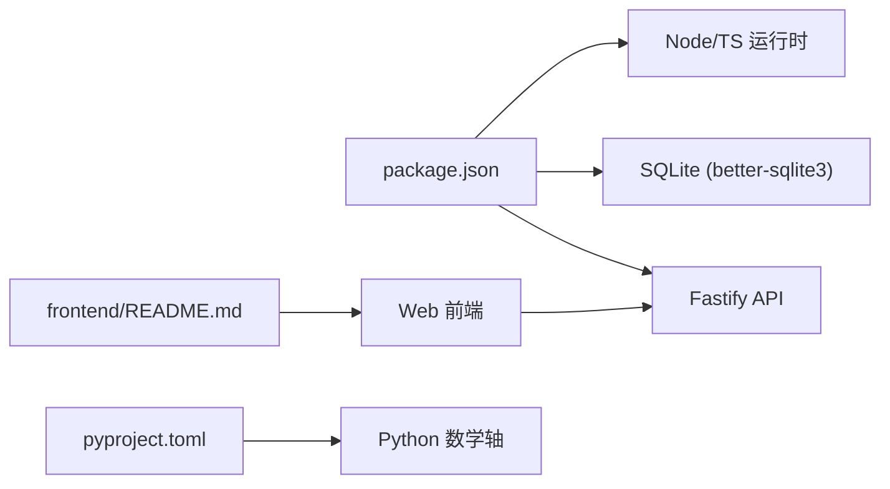

# 快速开始

<cite>
**本文引用的文件**
- [README.md](file://README.md)
- [package.json](file://package.json)
- [pyproject.toml](file://pyproject.toml)
- [scripts/install.sh](file://scripts/install.sh)
- [scripts/install.ps1](file://scripts/install.ps1)
- [src/cli/far.ts](file://src/cli/far.ts)
- [docker-compose.yml](file://docker-compose.yml)
- [frontend/README.md](file://frontend/README.md)
- [schema/migrations/0001_initial.sql](file://schema/migrations/0001_initial.sql)
- [src/science_harness/sandbox_runner.ts](file://src/science_harness/sandbox_runner.ts)
</cite>

## 目录
1. [简介](#简介)
2. [项目结构](#项目结构)
3. [核心组件](#核心组件)
4. [架构总览](#架构总览)
5. [详细组件分析](#详细组件分析)
6. [依赖关系分析](#依赖关系分析)
7. [性能注意事项](#性能注意事项)
8. [故障排除指南](#故障排除指南)
9. [结论](#结论)
10. [附录](#附录)

## 简介
本指南面向首次接触 FAR-Lab 的用户，目标是在 30 分钟内完成从零到第一个科学声明验证的完整流程。内容涵盖：系统要求、跨平台安装脚本使用、基础环境配置（含 API 密钥与数据库初始化）、首个离线演示与验证、CLI 常用命令、Web 界面访问与基本操作、常见问题排查以及开发环境搭建。FAR-Lab 的核心是“证据约束 + 可证伪 + 可追溯”的研究链，默认提供无需 API Key 的离线演示能力，确保新手也能顺利运行并理解其工作流。

## 项目结构
仓库采用多语言混合工程：
- Node.js/TypeScript 为主运行时与 CLI/API
- Python 用于确定性重算轴（SymPy/Z3）
- SQLite 作为本地证据日志与裁决存储
- 前端基于 React/Vite 提供 Web 工作台
- Docker Compose 一键启动离线演示或 API 服务

图表来源
- [src/cli/far.ts:67-74](file://src/cli/far.ts#L67-L74)
- [docker-compose.yml:12-28](file://docker-compose.yml#L12-L28)
- [frontend/README.md:105-117](file://frontend/README.md#L105-L117)

章节来源
- [README.md:37-65](file://README.md#L37-L65)
- [package.json:28-44](file://package.json#L28-L44)
- [docker-compose.yml:1-28](file://docker-compose.yml#L1-L28)

## 核心组件
- CLI 入口与命令注册表：统一暴露 far 命令族，支持 demo、verify、export、research、api 等。
- API 服务器：Fastify 构建的 REST 服务，默认离线模式自动种子示例数据。
- 数据库：SQLite，内置迁移脚本，维护证据链、裁决节点、复现记录等。
- Python 科研轴：可选，用于 SymPy/Z3 等数学验证；缺失时仅警告不阻塞离线体验。
- Web 前端：Vite + React，默认代理至 localhost:3000 的后端 API。

章节来源
- [src/cli/far.ts:33-380](file://src/cli/far.ts#L33-L380)
- [src/cli/far.ts:67-74](file://src/cli/far.ts#L67-L74)
- [schema/migrations/0001_initial.sql:1-245](file://schema/migrations/0001_initial.sql#L1-L245)
- [pyproject.toml:1-35](file://pyproject.toml#L1-L35)
- [frontend/README.md:105-117](file://frontend/README.md#L105-L117)

## 架构总览
下图展示从 CLI 到 API、数据库、Python 子进程的调用关系，以及前端如何联调后端。

图表来源
- [src/cli/far.ts:67-74](file://src/cli/far.ts#L67-L74)
- [src/science_harness/sandbox_runner.ts:180-274](file://src/science_harness/sandbox_runner.ts#L180-L274)
- [schema/migrations/0001_initial.sql:1-245](file://schema/migrations/0001_initial.sql#L1-L245)

## 详细组件分析

### 安装与环境准备
- 系统要求
  - Node.js ≥ 24.0.0（必需）
  - pnpm（推荐，安装器会自动尝试启用 corepack 或 npm 安装）
  - Python 3.11+（可选，用于数学验证轴；缺失仅警告）
  - Git（安装器需要）
- 跨平台安装脚本
  - macOS/Linux/WSL：使用 install.sh
  - Windows PowerShell：使用 install.ps1
  - 两者均会克隆固定 tag 的源码、校验发布资产、安装 Node 依赖、可选安装 Python 依赖、注册 far 命令并执行 far doctor
- 开发者直接安装
  - git clone 后 pnpm install，然后 pnpm far doctor

章节来源
- [scripts/install.sh:1-160](file://scripts/install.sh#L1-L160)
- [scripts/install.ps1:1-153](file://scripts/install.ps1#L1-L153)
- [README.md:37-65](file://README.md#L37-L65)
- [package.json:42-44](file://package.json#L42-L44)
- [pyproject.toml:1-15](file://pyproject.toml#L1-L15)

### 基础环境配置
- API 密钥（可选）
  - 若需真实推理（如 Qwen/百炼），设置环境变量 DASHSCOPE_API_KEY；离线演示不需要任何密钥
  - 通过 docker compose 或 .env 显式传入，避免默认读取宿主机 .env
- 数据库初始化
  - 首次运行会自动执行迁移脚本创建表结构与触发器（WAL、外键、追加只写等）
  - 可通过 far doctor 进行环境自检（零网络、零密钥）

章节来源
- [README.md:279-289](file://README.md#L279-L289)
- [docker-compose.yml:1-28](file://docker-compose.yml#L1-L28)
- [schema/migrations/0001_initial.sql:1-245](file://schema/migrations/0001_initial.sql#L1-L245)
- [src/cli/far.ts:41-55](file://src/cli/far.ts#L41-L55)

### 第一个科学声明验证（离线演示）
- 一键离线演示
  - 运行 far demo 或 far demo tess-offline，将执行 R0–R9 判定内核与端到端 TESS 案例，全程无需 API Key
- 导出与验证
  - 导出证明包：far export far-proof --demo-chain --force
  - 独立重算验证：far verify <bundle-dir>，篡改检测失败将返回特定退出码
- 金向量验证
  - 运行 far verify-golden --all 对 14 个金向量进行重算验证

章节来源
- [README.md:69-112](file://README.md#L69-L112)
- [README.md:268-276](file://README.md#L268-L276)
- [src/cli/far.ts:77-89](file://src/cli/far.ts#L77-L89)
- [src/cli/far.ts:147-171](file://src/cli/far.ts#L147-L171)
- [src/cli/far.ts:485-519](file://src/cli/far.ts#L485-L519)

### CLI 工具基本用法
- 常用命令
  - far version：打印版本与提交信息
  - far doctor：环境自检（可选探针真实 LLM）
  - far demo：离线演示（含金向量与端到端案例）
  - far verify：第三方独立重算验证（支持 bundle/envelope/db 模式）
  - far verify-golden：重算金向量
  - far export far-proof：导出可验证的证明包
  - far research start/status/resume/export/verify：研究流水线
  - far api：启动 REST API 服务
- 参数选项
  - 多数命令支持 --json 机器可读输出
  - far verify 支持 --mode chain|envelope|full、--explain、--pubkey 等
  - far verify-golden 支持 --backend node|python|browser、--case/--case-dir

章节来源
- [src/cli/far.ts:33-380](file://src/cli/far.ts#L33-L380)
- [src/cli/far.ts:537-592](file://src/cli/far.ts#L537-L592)
- [src/cli/far.ts:485-519](file://src/cli/far.ts#L485-L519)

### Web 界面访问与基本操作
- 启动方式
  - 后端：pnpm api（或 docker compose up far-api）
  - 前端：cd frontend && npm run dev（默认 http://localhost:5173）
- 前后端联调
  - 前端默认通过绝对 URL 访问后端 http://localhost:3000
  - 可在 frontend/.env.local 中设置 VITE_API_BASE_URL 覆盖
- 健康检查与 OpenAPI
  - 后端健康探针：/health、/ready
  - OpenAPI JSON：http://localhost:3000/documentation/json

章节来源
- [frontend/README.md:7-22](file://frontend/README.md#L7-L22)
- [frontend/README.md:105-117](file://frontend/README.md#L105-L117)
- [docker-compose.yml:19-28](file://docker-compose.yml#L19-L28)

### 开发环境搭建
- 安装依赖
  - pnpm install --frozen-lockfile
  - 可选：node scripts/ensure_py_deps.mjs 探测 Python 轴
- 类型检查与测试
  - pnpm typecheck && pnpm lint && pnpm test
  - Python 测试：pnpm run test:py（跳过缺失环境）
- Docker 快速体验
  - docker compose up far-demo（一次性离线演示）
  - docker compose up far-api（长驻 API 服务）

章节来源
- [README.md:337-359](file://README.md#L337-L359)
- [docker-compose.yml:1-28](file://docker-compose.yml#L1-L28)

## 依赖关系分析
- Node.js 与 pnpm
  - engines.node >= 24.0.0，bin 指向 src/cli/far.ts
  - 依赖 fastify、better-sqlite3、zod 等
- Python 轴
  - requires-python >= 3.11，依赖 threadpoolctl、numpy、sympy、z3-solver
  - 可选 science 扩展（lightkurve、astroquery）
- 数据库
  - SQLite WAL、外键开启、追加只写触发器保护关键表
- 前端
  - React 18、Vite 5、Tailwind、shadcn/ui、D3.js、React Flow、TanStack Query

图表来源
- [package.json:28-44](file://package.json#L28-L44)
- [package.json:84-98](file://package.json#L84-L98)
- [pyproject.toml:1-35](file://pyproject.toml#L1-L35)
- [frontend/README.md:47-60](file://frontend/README.md#L47-L60)

章节来源
- [package.json:28-44](file://package.json#L28-L44)
- [package.json:84-98](file://package.json#L84-L98)
- [pyproject.toml:1-35](file://pyproject.toml#L1-L35)
- [schema/migrations/0001_initial.sql:1-245](file://schema/migrations/0001_initial.sql#L1-L245)

## 性能注意事项
- 单节点 SQLite：适合单机实验与演示；高并发写入建议使用 PostgreSQL
- Python 子进程隔离：通过白名单与敏感环境变量剥离保障安全与可复现性
- 前端按需加载：路由级代码分割减少首屏体积

章节来源
- [README.md:445-463](file://README.md#L445-L463)
- [src/science_harness/sandbox_runner.ts:180-274](file://src/science_harness/sandbox_runner.ts#L180-L274)
- [frontend/README.md:141-150](file://frontend/README.md#L141-L150)

## 故障排除指南
- Node 版本不匹配
  - 症状：native 模块安装失败或崩溃
  - 处理：升级 Node 至 ≥24；或使用 Docker 镜像
- pnpm 未找到
  - 处理：安装器会尝试 corepack 或 npm 安装；也可手动全局安装 pnpm@10
- Python 缺失或依赖安装失败
  - 影响：数学验证轴 skip；离线演示不受阻
  - 处理：安装 Python 3.11+ 并 pip install -e . 或 pip install -e .[science]
- 路径与权限（Windows）
  - 建议启用 long path 支持；必要时添加杀毒软件排除
- 数据库忙锁
  - 已显式设置 busy_timeout=5000ms；如遇仍频繁 BUSY，检查并发写入场景

章节来源
- [scripts/install.sh:46-61](file://scripts/install.sh#L46-L61)
- [scripts/install.ps1:34-52](file://scripts/install.ps1#L34-L52)
- [scripts/install.sh:112-125](file://scripts/install.sh#L112-L125)
- [scripts/install.ps1:104-114](file://scripts/install.ps1#L104-L114)
- [tests/db/db_open_pragma.test.ts:1-30](file://tests/db/db_open_pragma.test.ts#L1-L30)
- [README.md:308-327](file://README.md#L308-L327)

## 结论
通过本指南，你可以在 30 分钟内完成 FAR-Lab 的安装、环境配置、首次离线演示与验证，并了解 CLI 与 Web 界面的基本用法。FAR-Lab 以“证据约束 + 可证伪 + 可追溯”为核心，提供无需 API Key 的离线能力与可独立重算的证明包，便于初学者快速上手并逐步探索更复杂的在线研究与验证流程。

## 附录
- 快速参考
  - 离线演示：far demo / far demo tess-offline
  - 导出证明包：far export far-proof --demo-chain --force
  - 独立验证：far verify <bundle-dir>
  - 金向量重算：far verify-golden --all
  - 启动 API：pnpm api 或 docker compose up far-api
  - 启动前端：cd frontend && npm run dev
- 环境变量
  - DASHSCOPE_API_KEY（可选，启用真实推理）
  - VITE_API_BASE_URL（前端代理后端地址）

章节来源
- [README.md:69-112](file://README.md#L69-L112)
- [README.md:268-289](file://README.md#L268-L289)
- [frontend/README.md:24-34](file://frontend/README.md#L24-L34)
- [docker-compose.yml:1-28](file://docker-compose.yml#L1-L28)