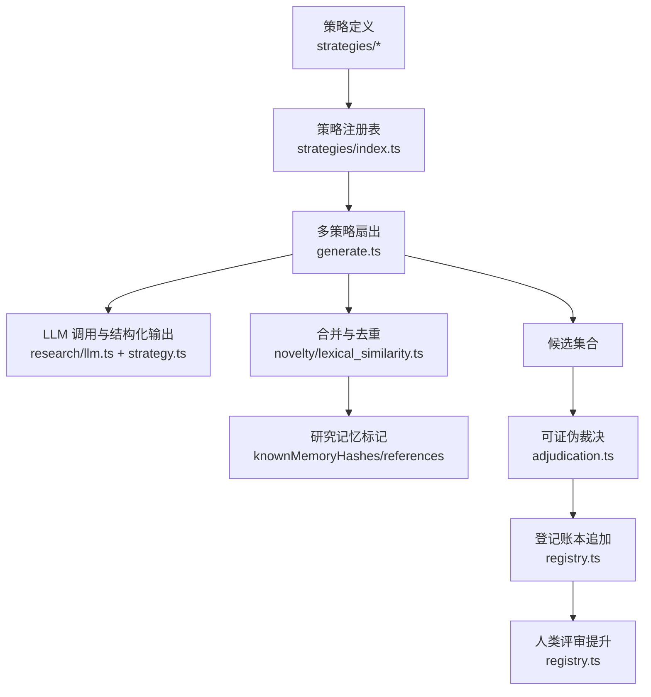
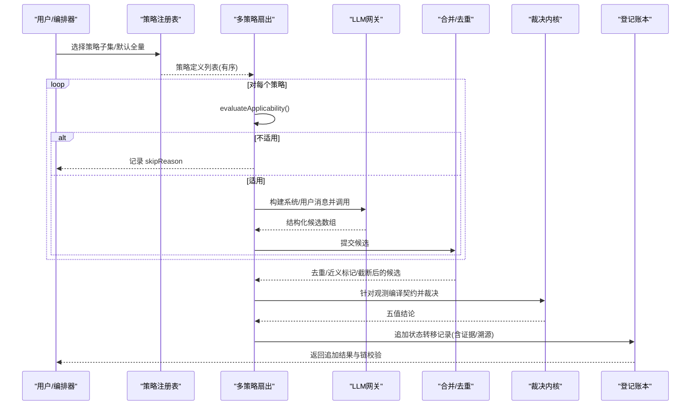
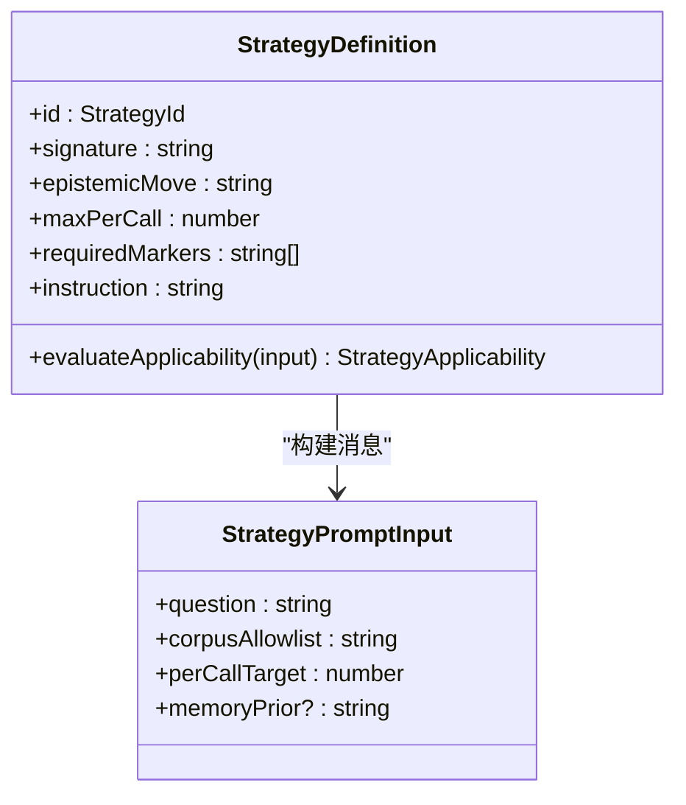
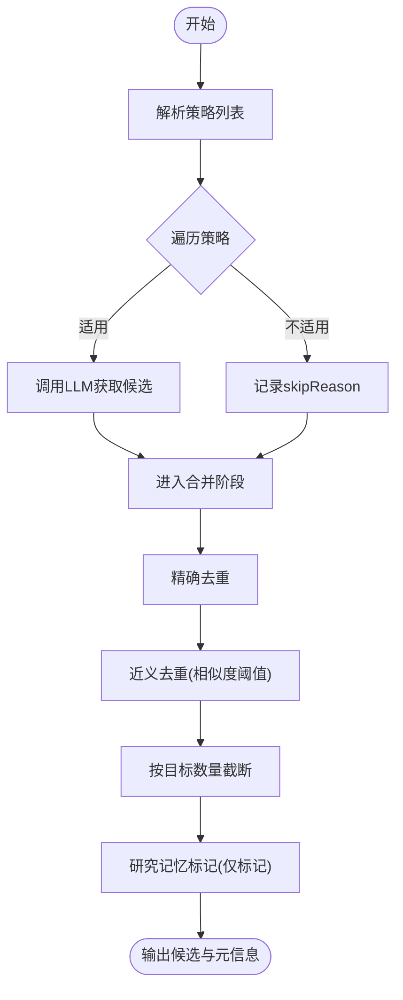
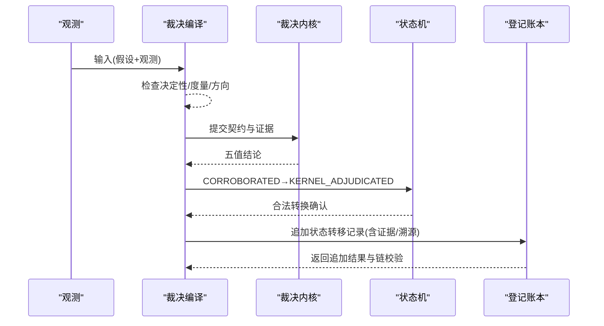
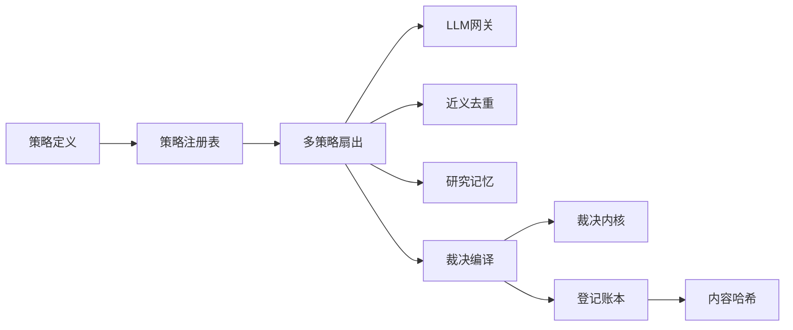

# 发现策略扩展

<cite>
**本文引用的文件**
- [src/discovery/registry.ts](file://src/discovery/registry.ts)
- [src/discovery/types.ts](file://src/discovery/types.ts)
- [src/discovery/generate.ts](file://src/discovery/generate.ts)
- [src/discovery/adjudication.ts](file://src/discovery/adjudication.ts)
- [src/discovery/content_hash.ts](file://src/discovery/content_hash.ts)
- [src/discovery/strategies/index.ts](file://src/discovery/strategies/index.ts)
- [src/discovery/strategies/strategy.ts](file://src/discovery/strategies/strategy.ts)
- [src/discovery/strategies/induction.ts](file://src/discovery/strategies/induction.ts)
- [src/discovery/strategies/analogy.ts](file://src/discovery/strategies/analogy.ts)
- [src/discovery/strategies/counterfactual.ts](file://src/discovery/strategies/counterfactual.ts)
- [src/discovery/strategies/failure_mining.ts](file://src/discovery/strategies/failure_mining.ts)
- [src/discovery/strategies/constraint_relaxation.ts](file://src/discovery/strategies/constraint_relaxation.ts)
</cite>

## 目录
1. [简介](#简介)
2. [项目结构](#项目结构)
3. [核心组件](#核心组件)
4. [架构总览](#架构总览)
5. [详细组件分析](#详细组件分析)
6. [依赖关系分析](#依赖关系分析)
7. [性能与可扩展性](#性能与可扩展性)
8. [故障排查指南](#故障排查指南)
9. [结论](#结论)
10. [附录：自定义策略开发模板与示例路径](#附录自定义策略开发模板与示例路径)

## 简介
本指南面向希望在 FAR-Lab 平台中开发“自定义科学发现策略”的研究工程师。内容涵盖：
- 发现策略的核心概念、算法框架与执行管道
- 策略注册机制与多策略扇出（fan-out）流程
- 与 LLM 集成的模式与提示工程要点
- 现有策略（归纳、类比、反事实等）的实现剖析
- 自定义策略的开发模板与参考实现路径
- 评估指标与基准测试建议
- 策略组合与元策略设计思路
- 调试工具与可视化分析方法

## 项目结构
FAR-Lab 的发现子系统位于 src/discovery，围绕“策略定义—扇出生成—合并去重—可证伪裁决—登记上链”的流水线组织代码。关键目录与职责：
- strategies：策略定义与注册表，每个策略声明其认知操作、适用性判断、指令与输出约束
- generate：多策略扇出编排，调用各策略并执行确定性合并与截断
- registry：发现登记账本（不可变哈希链），记录假设从结构化到被佐证、裁决、人类评审的完整生命周期
- adjudication：将实验观测编译为可证伪契约，驱动五值裁决内核，并将结果回写至登记账本
- types：状态机（猜想置信阶梯）、策略 ID 目录、转换规则
- content_hash：基于假设的可证伪内容哈希，用于跨模块去重与审计

图表来源
- [src/discovery/strategies/index.ts:1-55](file://src/discovery/strategies/index.ts#L1-L55)
- [src/discovery/generate.ts:1-452](file://src/discovery/generate.ts#L1-L452)
- [src/discovery/strategies/strategy.ts:1-185](file://src/discovery/strategies/strategy.ts#L1-L185)
- [src/discovery/adjudication.ts:1-495](file://src/discovery/adjudication.ts#L1-L495)
- [src/discovery/registry.ts:1-647](file://src/discovery/registry.ts#L1-L647)

章节来源
- [src/discovery/strategies/index.ts:1-55](file://src/discovery/strategies/index.ts#L1-L55)
- [src/discovery/generate.ts:1-452](file://src/discovery/generate.ts#L1-L452)
- [src/discovery/strategies/strategy.ts:1-185](file://src/discovery/strategies/strategy.ts#L1-L185)
- [src/discovery/adjudication.ts:1-495](file://src/discovery/adjudication.ts#L1-L495)
- [src/discovery/registry.ts:1-647](file://src/discovery/registry.ts#L1-L647)

## 核心组件
- 策略定义与注册
  - 策略接口包含 id、签名、认知动作描述、最大候选数、必需结构标记、适用性判断、指令等
  - 注册表按固定顺序维护，保证确定性扇出与排序
- 多策略扇出与合并
  - 依次评估适用性，调用 LLM 获取结构化候选
  - 执行精确去重、近义去重（词法相似度）、目标数量截断，并记录负结果
- 可证伪裁决与登记
  - 将观测编译为契约，调用裁决内核得到五值结论
  - 通过状态机推进假设状态，写入不可变登记账本
- 人类评审提升
  - 允许人工将已登记的假设提升至“再发现”或“新颖验证”终态，要求证据字段完备

章节来源
- [src/discovery/strategies/strategy.ts:1-185](file://src/discovery/strategies/strategy.ts#L1-L185)
- [src/discovery/strategies/index.ts:1-55](file://src/discovery/strategies/index.ts#L1-L55)
- [src/discovery/generate.ts:1-452](file://src/discovery/generate.ts#L1-L452)
- [src/discovery/adjudication.ts:1-495](file://src/discovery/adjudication.ts#L1-L495)
- [src/discovery/registry.ts:1-647](file://src/discovery/registry.ts#L1-L647)

## 架构总览
下图展示从策略到登记的全链路数据流与控制流。

图表来源
- [src/discovery/strategies/index.ts:1-55](file://src/discovery/strategies/index.ts#L1-L55)
- [src/discovery/generate.ts:1-452](file://src/discovery/generate.ts#L1-L452)
- [src/discovery/strategies/strategy.ts:1-185](file://src/discovery/strategies/strategy.ts#L1-L185)
- [src/discovery/adjudication.ts:1-495](file://src/discovery/adjudication.ts#L1-L495)
- [src/discovery/registry.ts:1-647](file://src/discovery/registry.ts#L1-L647)

## 详细组件分析

### 策略定义与提示工程
- 策略接口约定了认知操作、指令与输出结构约束，确保不同策略在语义与结构上真正正交
- 共享规则包括：可证伪方法必须自洽、仅引用允许的语料文档、不分配 id/评分、输出 JSON 数组等
- 新世代结构化可裁决字段（direction/metricShape）强制模型显式承诺方向与度量形状，便于后续自动裁决
- 提示组装分为系统提示（身份+指令+共享规则+结构化要求）与用户消息（问题+语料清单+可选历史先验）

图表来源
- [src/discovery/strategies/strategy.ts:1-185](file://src/discovery/strategies/strategy.ts#L1-L185)

章节来源
- [src/discovery/strategies/strategy.ts:1-185](file://src/discovery/strategies/strategy.ts#L1-L185)

### 多策略扇出与合并
- 策略列表解析：支持 CLI 子集、目录顺序、预算上限裁剪；空列表会报错
- 逐策略调用：先评估适用性，再构造消息并调用 LLM；失败隔离，错误记录但不中断整体流程
- 合并门控：
  - 精确去重：相同内容哈希优先保留低索引策略
  - 近义去重：词法相似度超过阈值则标记并丢弃后者，同时给保留者打上风险标记
  - 目标数量截断：按（策略索引, 候选 id）排序后截取，多余项记录为负结果
  - 研究记忆标记：与历史运行进行精确/近义匹配，仅标记不影响选择
- 产出：最终候选与详尽元信息（策略计划、每策略结果、去重/截断计数、配额缺口等）

图表来源
- [src/discovery/generate.ts:1-452](file://src/discovery/generate.ts#L1-L452)
- [src/discovery/strategies/strategy.ts:1-185](file://src/discovery/strategies/strategy.ts#L1-L185)

章节来源
- [src/discovery/generate.ts:1-452](file://src/discovery/generate.ts#L1-L452)

### 可证伪裁决与登记账本
- 裁决编译：检查观测是否决定性、度量覆盖、方向一致性（结构化优先，文本兜底），构造证据与阈值语义
- 裁决决策：调用五值内核，得到支持/反驳/不确定等结论
- 登记回写：若满足条件，追加“CORROBORATED → KERNEL_ADJUDICATED”的状态转移记录，携带裁决证据与溯源
- 人类评审提升：可将已登记假设提升至“REDISCOVERY”或“NOVEL_VALIDATED”，需满足相应证据字段（文献匹配/人类评审引用）
- 账本特性：每条记录带内容哈希与链前向哈希，支持完整性校验；追加具备并发锁与原子写入；非 LIVE/MIXED 模式跳过写入

图表来源
- [src/discovery/adjudication.ts:1-495](file://src/discovery/adjudication.ts#L1-L495)
- [src/discovery/registry.ts:1-647](file://src/discovery/registry.ts#L1-L647)
- [src/discovery/types.ts:1-149](file://src/discovery/types.ts#L1-L149)

章节来源
- [src/discovery/adjudication.ts:1-495](file://src/discovery/adjudication.ts#L1-L495)
- [src/discovery/registry.ts:1-647](file://src/discovery/registry.ts#L1-L647)
- [src/discovery/types.ts:1-149](file://src/discovery/types.ts#L1-L149)

### 现有策略实现分析
- 归纳（induction）
  - 认知动作：统一多个独立规律为一个机制，并外推预测
  - 结构标记：要求枚举至少两个规律来源，明确统一机制与外推
  - 适用性：需要至少两份语料以避免复述单一论文
- 类比（analogy）
  - 认知动作：从远域引入同构问题结构作为解释
  - 结构标记：明确源域、映射关系与失效条件
- 反事实（counterfactual）
  - 认知动作：移除或反转关键变量，绘制崩溃面以暴露隐式因果结构
  - 结构标记：指定变量与崩溃后果，聚焦可测边缘
- 失败挖掘（failure_mining）
  - 认知动作：从限制/未来工作/负面结果中提取已知未知，直接转化为假设种子
  - 结构标记：必须指向承认该未知的原始文献
- 约束松弛（constraint_relaxation）
  - 认知动作：扰动领域默认假设（放松或收紧），观察结论变化或矛盾
  - 结构标记：明确使用哪个方向，另一个方向留占位符

章节来源
- [src/discovery/strategies/induction.ts:1-47](file://src/discovery/strategies/induction.ts#L1-L47)
- [src/discovery/strategies/analogy.ts:1-39](file://src/discovery/strategies/analogy.ts#L1-L39)
- [src/discovery/strategies/counterfactual.ts:1-40](file://src/discovery/strategies/counterfactual.ts#L1-L40)
- [src/discovery/strategies/failure_mining.ts:1-47](file://src/discovery/strategies/failure_mining.ts#L1-L47)
- [src/discovery/strategies/constraint_relaxation.ts:1-48](file://src/discovery/strategies/constraint_relaxation.ts#L1-L48)

## 依赖关系分析
- 策略层依赖
  - 策略定义依赖共享提示构建与结构化输出校验
  - 注册表提供确定性的调用顺序与 CLI 子集过滤
- 扇出层依赖
  - 依赖策略注册表、LLM 网关、词法相似度计算、研究记忆
- 裁决与登记层依赖
  - 裁决依赖可证伪内核、观测类型、研究记忆回写
  - 登记依赖内容哈希、状态机、链校验与并发控制

图表来源
- [src/discovery/strategies/index.ts:1-55](file://src/discovery/strategies/index.ts#L1-L55)
- [src/discovery/generate.ts:1-452](file://src/discovery/generate.ts#L1-L452)
- [src/discovery/adjudication.ts:1-495](file://src/discovery/adjudication.ts#L1-L495)
- [src/discovery/registry.ts:1-647](file://src/discovery/registry.ts#L1-L647)
- [src/discovery/content_hash.ts:1-21](file://src/discovery/content_hash.ts#L1-L21)

章节来源
- [src/discovery/strategies/index.ts:1-55](file://src/discovery/strategies/index.ts#L1-L55)
- [src/discovery/generate.ts:1-452](file://src/discovery/generate.ts#L1-L452)
- [src/discovery/adjudication.ts:1-495](file://src/discovery/adjudication.ts#L1-L495)
- [src/discovery/registry.ts:1-647](file://src/discovery/registry.ts#L1-L647)
- [src/discovery/content_hash.ts:1-21](file://src/discovery/content_hash.ts#L1-L21)

## 性能与可扩展性
- 确定性优先：策略顺序、去重与截断均严格确定，避免随机性影响复现
- 失败隔离：单策略失败不影响其他策略贡献，零产出时才会失败关闭
- 预算可控：可通过 maxStrategies 限制策略数量，保持降级路径确定
- 并发安全：登记账本追加采用文件级独占锁与原子写入，防止竞争与损坏
- 可扩展点：新增策略只需实现接口并在注册表末尾追加，不影响既有确定性

[本节为通用指导，无需特定文件来源]

## 故障排查指南
- 多策略扇出全部失败
  - 现象：所有策略均报错，抛出“全部策略失败”的错误
  - 排查：查看 perStrategy 中的 error 字段，定位具体策略与错误原因
- 近义去重过多
  - 现象：大量候选被标记为近义重复
  - 排查：检查 PARAPHRASE_THRESHOLD 与候选 statement/mechanism 区分度
- 裁决拒绝
  - 常见原因：观测非决定性、度量未覆盖、方向未知、结构化与文本冲突
  - 排查：查看 AdjudicationCompilation.reason 与结构化字段 direction/metricShape
- 登记失败
  - 可能原因：账本链损坏、非法状态转移、缺少必要证据
  - 排查：使用链校验函数验证账本完整性，检查状态机转换与证据字段

章节来源
- [src/discovery/generate.ts:1-452](file://src/discovery/generate.ts#L1-L452)
- [src/discovery/adjudication.ts:1-495](file://src/discovery/adjudication.ts#L1-L495)
- [src/discovery/registry.ts:1-647](file://src/discovery/registry.ts#L1-L647)

## 结论
FAR-Lab 的发现子系统通过“策略正交化—扇出并行—确定性合并—可证伪裁决—不可变登记”的闭环，实现了高可信的科学发现流程。开发者可按本指南新增策略，借助结构化提示与强约束输出，使 AI 生成的假设具备可审计、可裁决、可追溯的特性。

[本节为总结性内容，无需特定文件来源]

## 附录：自定义策略开发模板与示例路径
- 步骤概览
  - 新建策略文件：实现 StrategyDefinition（id、signature、epistemicMove、maxPerCall、requiredMarkers、evaluateApplicability、instruction）
  - 注册策略：在注册表中追加（保持 append-only）
  - 编写提示：遵循共享规则与新世代结构化字段要求
  - 单元测试：验证适用性边界、输出结构标记、近义去重行为
- 参考实现路径
  - 策略接口与提示构建：[src/discovery/strategies/strategy.ts:1-185](file://src/discovery/strategies/strategy.ts#L1-L185)
  - 注册表与顺序：[src/discovery/strategies/index.ts:1-55](file://src/discovery/strategies/index.ts#L1-L55)
  - 扇出与合并：[src/discovery/generate.ts:1-452](file://src/discovery/generate.ts#L1-L452)
  - 内容哈希与去重：[src/discovery/content_hash.ts:1-21](file://src/discovery/content_hash.ts#L1-L21)
  - 裁决与登记：[src/discovery/adjudication.ts:1-495](file://src/discovery/adjudication.ts#L1-L495), [src/discovery/registry.ts:1-647](file://src/discovery/registry.ts#L1-L647)
  - 状态机与策略目录：[src/discovery/types.ts:1-149](file://src/discovery/types.ts#L1-L149)
- 提示工程技巧
  - 明确认知动作与输出结构标记，避免自由文本漂移
  - 强制结构化可裁决字段（direction/metricShape），提高裁决成功率
  - 将历史先验以明确区块注入，避免污染策略签名
- 评估指标与基准建议
  - 覆盖率：策略实际尝试数 vs 计划数
  - 产出质量：候选通过率、近义去重率、截断率
  - 裁决通过率：编译成功比例、五值分布
  - 登记成功率：追加成功与链校验通过率
  - 稳定性：多次运行的确定性一致性与失败隔离表现
- 策略组合与元策略设计
  - 组合：在同一问题下并行多种策略，利用合并门控择优
  - 元策略：根据问题/语料特征动态选择策略子集或调整参数（如 perCallTarget、阈值）
- 调试与可视化
  - 查看 FanoutMeta：记录策略计划、每策略结果、去重与截断详情
  - 审查 AdjudicationCompilation：诊断裁决拒绝原因
  - 审计登记账本：验证链完整性与状态迁移轨迹

[本节为实践指引，无需特定文件来源]