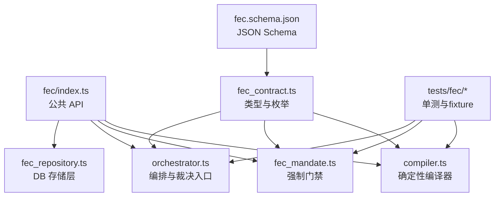
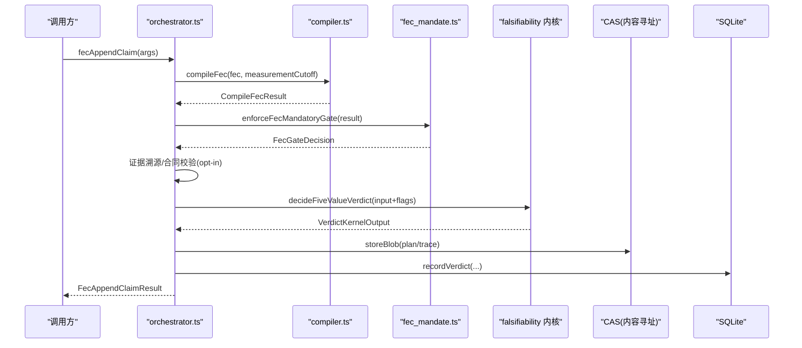
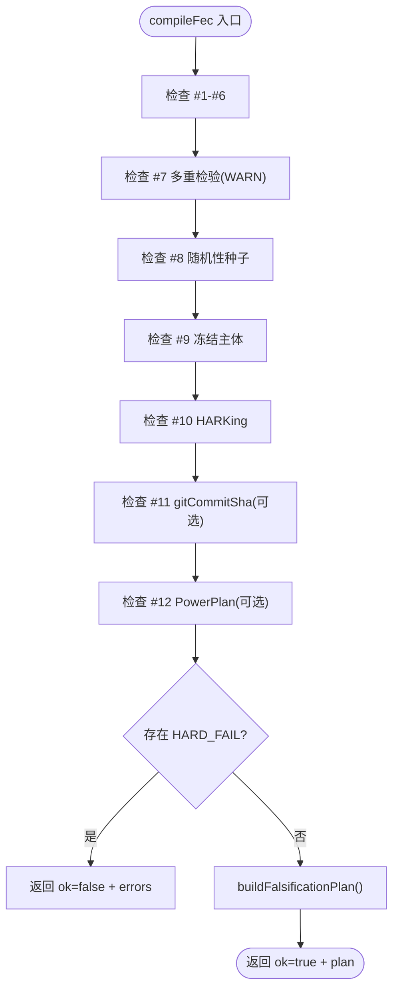
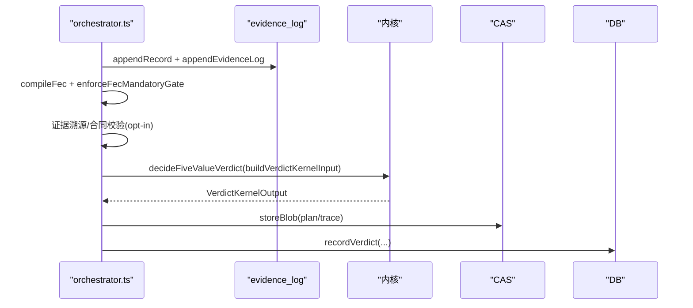
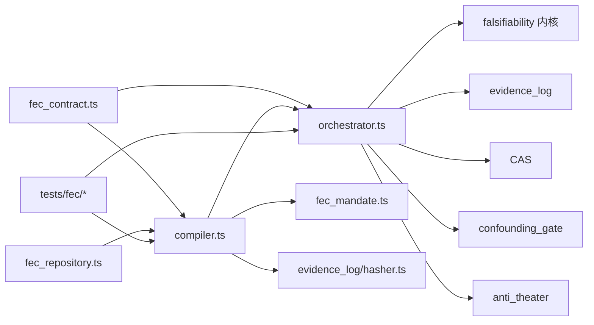

# 可证伪性合约开发

<cite>
**本文引用的文件**
- [src/fec/index.ts](file://src/fec/index.ts)
- [src/fec/compiler.ts](file://src/fec/compiler.ts)
- [src/fec/fec_contract.ts](file://src/fec/fec_contract.ts)
- [src/fec/orchestrator.ts](file://src/fec/orchestrator.ts)
- [src/fec/fec_mandate.ts](file://src/fec/fec_mandate.ts)
- [src/fec/fec_repository.ts](file://src/fec/fec_repository.ts)
- [schema/json/fec.schema.json](file://schema/json/fec.schema.json)
- [tests/fec/compiler.test.ts](file://tests/fec/compiler.test.ts)
- [tests/fec/fixtures.ts](file://tests/fec/fixtures.ts)
</cite>

## 目录
1. [简介](#简介)
2. [项目结构](#项目结构)
3. [核心组件](#核心组件)
4. [架构总览](#架构总览)
5. [详细组件分析](#详细组件分析)
6. [依赖关系分析](#依赖关系分析)
7. [性能与资源限制](#性能与资源限制)
8. [故障排查指南](#故障排查指南)
9. [结论](#结论)
10. [附录：语法规范、语义定义与版本管理](#附录：语法规范语义定义与版本管理)

## 简介
本指南面向在 FAR-Lab 平台开发自定义“可证伪性合约（FEC）”的工程师，目标是帮助你：
- 理解 FEC V2 的语法与语义（契约字段、约束与判定路径）。
- 掌握编译过程与验证机制（确定性编译器、门禁策略、裁决内核集成）。
- 了解执行环境与沙箱隔离（证据来源绑定、反剧场检测、CAS 内容寻址）。
- 编写自定义验证规则与测试策略（覆盖错误码、降级路径、CI 阻断）。
- 实现复杂业务逻辑的合约示例（多重检验、随机性控制、幂等与幂等冻结）。
- 管理合约版本与向后兼容（V1/V2 共存、opt-in 开关、迁移策略）。
- 进行性能优化与安全审计（资源预算、漏洞扫描、审计日志）。

## 项目结构
FAR-Lab 的 FEC 子系统位于 src/fec，提供从类型定义、编译器、强制门禁、编排到存储的全链路能力；schema/json 下维护 JSON Schema 以约束契约结构；tests/fec 提供完备的单测与 fixture。

图表来源
- [src/fec/index.ts:1-65](file://src/fec/index.ts#L1-L65)
- [src/fec/compiler.ts:1-558](file://src/fec/compiler.ts#L1-L558)
- [src/fec/fec_mandate.ts:1-81](file://src/fec/fec_mandate.ts#L1-L81)
- [src/fec/orchestrator.ts:1-494](file://src/fec/orchestrator.ts#L1-L494)
- [src/fec/fec_repository.ts:1-146](file://src/fec/fec_repository.ts#L1-L146)
- [src/fec/fec_contract.ts:1-438](file://src/fec/fec_contract.ts#L1-L438)
- [schema/json/fec.schema.json:1-523](file://schema/json/fec.schema.json#L1-L523)
- [tests/fec/compiler.test.ts:1-200](file://tests/fec/compiler.test.ts#L1-L200)
- [tests/fec/fixtures.ts:1-113](file://tests/fec/fixtures.ts#L1-L113)

章节来源
- [src/fec/index.ts:1-65](file://src/fec/index.ts#L1-L65)
- [schema/json/fec.schema.json:1-523](file://schema/json/fec.schema.json#L1-L523)

## 核心组件
- 类型与枚举（fec_contract.ts）：定义 FecContractV2、统计计划、阈值规格、种子策略、冻结快照等，并集中声明编译期错误码与严重级别。
- 编译器（compiler.ts）：对 FEC 进行确定性校验，产出 FalsificationPlan（statLock、verdictMapping、proofChecks），并计算 fecHash。
- 强制门禁（fec_mandate.ts）：fail-closed 策略，LLM_FROZEN 直接 CI 阻断，其他 HARD_FAIL 降级为 UNTESTED。
- 编排器（orchestrator.ts）：串联记录、注册契约、编译、门禁、证据溯源/合同校验、裁决内核、CAS 落盘与结果持久化。
- 存储层（fec_repository.ts）：将冻结后的 FEC 以 canonical JSON 写入 DB，并提供按 fecId/claimId 查询。
- JSON Schema（fec.schema.json）：机器生成的契约结构约束，确保跨语言一致性。

章节来源
- [src/fec/fec_contract.ts:1-438](file://src/fec/fec_contract.ts#L1-L438)
- [src/fec/compiler.ts:1-558](file://src/fec/compiler.ts#L1-L558)
- [src/fec/fec_mandate.ts:1-81](file://src/fec/fec_mandate.ts#L1-L81)
- [src/fec/orchestrator.ts:1-494](file://src/fec/orchestrator.ts#L1-L494)
- [src/fec/fec_repository.ts:1-146](file://src/fec/fec_repository.ts#L1-L146)
- [schema/json/fec.schema.json:1-523](file://schema/json/fec.schema.json#L1-L523)

## 架构总览
FEC 的工作流如下：
- 输入：FecContractV2（冻结后）、可选 measurementCutoff（用于 HARKing 检查）。
- 编译：compileFec 执行 12 项检查，收集所有 HARD_FAIL 错误，构建 FalsificationPlan。
- 门禁：enforceFecMandatoryGate 决定 allowed/ciBlocked/verdict。
- 前置闸：证据溯源绑定、完整证据合同校验（opt-in）。
- 裁决：decideFiveValueVerdict 基于统计结果与完整性标志输出五值裁决。
- 落盘：CAS 存储 plan 与 kernel trace，DB 记录 verdict 节点。

图表来源
- [src/fec/orchestrator.ts:153-301](file://src/fec/orchestrator.ts#L153-L301)
- [src/fec/compiler.ts:67-103](file://src/fec/compiler.ts#L67-L103)
- [src/fec/fec_mandate.ts:37-70](file://src/fec/fec_mandate.ts#L37-L70)

## 详细组件分析

### 编译器（compiler.ts）
- 职责：对 FecContractV2 执行 12 项编译期检查，收集全部 HARD_FAIL 错误，生成 FalsificationPlan 与 fecHash。
- 关键函数：
  - compileFec：主入口，顺序执行各项检查，任一 HARD_FAIL → ok=false，否则构建 plan。
  - buildFalsificationPlan：构造 statLock（统计参数哈希）、verdictMapping（固定映射表）、proofChecks（4 类检查模板）。
  - computeFecHash：对 VC 字段做 canonical JSON 哈希，支持 gitCommitSha 可选参与。
  - isDescriptivePhrase / involvesRandomness / mapCompileErrorToSeverity：辅助工具。
- 检查要点（节选）：
  - #1 measurableImplication 非空；#2 scope 三要素非空；#3 metricKey 稳定 key；#4 threshold.value 有限且单位一致；#5 证据要求至少各一项；#6 StatisticalPlan 必填字段与 alpha 范围；#7 多重检验未校正仅 WARN 并追加 integrityFlag；#8 涉及随机须 fixed seed；#9 frozenBy 必须为 deterministic_freezer（CI 阻断）；#10 freeze.timestamp ≤ earliest measurement（HARKing）；#11 可选强制 git commit SHA 绑定；#12 可选强制 powerPlan 合法。
- 复杂度：O(n) 检查次数，n 为字段数量；纯函数无 I/O。

图表来源
- [src/fec/compiler.ts:67-103](file://src/fec/compiler.ts#L67-L103)
- [src/fec/compiler.ts:191-249](file://src/fec/compiler.ts#L191-L249)
- [src/fec/compiler.ts:253-551](file://src/fec/compiler.ts#L253-L551)

章节来源
- [src/fec/compiler.ts:1-558](file://src/fec/compiler.ts#L1-L558)

### 强制门禁（fec_mandate.ts）
- 职责：根据编译结果决定允许继续或阻断。
- 行为：
  - ok=true → allowed=true，交由内核裁决。
  - 存在 LLM_FROZEN → ciBlocked=true，CI 直接阻断（禁止静默降级）。
  - 其他 HARD_FAIL → allowed=false，verdict=UNTESTED（fail-closed）。
- 断言：assertFecGate 在 CI 场景下遇到 ciBlocked 抛错，阻止后续流程。

章节来源
- [src/fec/fec_mandate.ts:1-81](file://src/fec/fec_mandate.ts#L1-L81)

### 编排器（orchestrator.ts）
- 职责：编排单条 claim 的完整裁决流程，保证原子性与可审计性。
- 关键步骤：
  - 记录调用与证据日志（appendRecord/appendEvidenceLog）。
  - 注册预登记契约（V1，可选）。
  - 编译 FEC 并执行强制门禁。
  - 前置闸：证据溯源绑定（requireExecutionProvenance）、完整证据合同（requireFullEvidenceContract）。
  - 构建内核输入（statistics、antiTheaterFindings、identifierClaims 重算等）。
  - 调用内核决策，存储 plan/trace 至 CAS，记录 verdict 节点。
- 事务：使用 IMMEDIATE 事务保证链写原子性，避免 TOCTOU 窗口。

图表来源
- [src/fec/orchestrator.ts:153-301](file://src/fec/orchestrator.ts#L153-L301)
- [src/fec/orchestrator.ts:328-381](file://src/fec/orchestrator.ts#L328-L381)

章节来源
- [src/fec/orchestrator.ts:1-494](file://src/fec/orchestrator.ts#L1-L494)

### 存储层（fec_repository.ts）
- 职责：将冻结的 FecContractV2 以 canonical JSON 写入 fec_contracts_v2，fec_hash 由 computeFecHash 计算。
- 能力：
  - registerFecV2：写入并返回 StoredFecContractV2。
  - getFecV2ByFecId/getFecV2ByClaim：读取并按 type guard 解析回 FecContractV2。
- 安全：rowToStored 使用 isFecContractV2 严格校验结构，防止非法数据入库。

章节来源
- [src/fec/fec_repository.ts:1-146](file://src/fec/fec_repository.ts#L1-L146)

### 类型与 Schema（fec_contract.ts 与 fec.schema.json）
- 类型层：集中定义 FecContractV2 及其子类型（ScopeSpec、MetricSpec、StatisticalPlan、PowerPlan、MultipleTestingPlan、SeedPolicy、DeviationPolicy、ProtocolFreeze 等），以及编译期错误码与严重级别。
- Schema：机器生成的 JSON Schema，约束契约字段、必填项与枚举值，保障跨语言一致性。

章节来源
- [src/fec/fec_contract.ts:1-438](file://src/fec/fec_contract.ts#L1-L438)
- [schema/json/fec.schema.json:1-523](file://schema/json/fec.schema.json#L1-L523)

## 依赖关系分析
- compiler.ts 依赖 fec_contract.ts 的类型与常量，依赖 evidence_log/hasher.ts 进行 canonical JSON 哈希。
- orchestrator.ts 依赖 compiler.ts、fec_mandate.ts、falsifiability 内核、evidence_log、CAS、confounding_gate、anti_theater 等。
- fec_repository.ts 依赖 compiler.ts 的 computeFecHash 与 evidence_log 的 canonicalJson。
- tests/fec/* 通过 fixtures.ts 构造合法 FEC，驱动编译器、门禁与编排器的分支覆盖。

图表来源
- [src/fec/compiler.ts:20-34](file://src/fec/compiler.ts#L20-L34)
- [src/fec/orchestrator.ts:1-67](file://src/fec/orchestrator.ts#L1-L67)
- [src/fec/fec_repository.ts:13-16](file://src/fec/fec_repository.ts#L13-L16)
- [tests/fec/compiler.test.ts:16-31](file://tests/fec/compiler.test.ts#L16-L31)

章节来源
- [src/fec/compiler.ts:1-558](file://src/fec/compiler.ts#L1-L558)
- [src/fec/orchestrator.ts:1-494](file://src/fec/orchestrator.ts#L1-L494)
- [src/fec/fec_repository.ts:1-146](file://src/fec/fec_repository.ts#L1-L146)
- [tests/fec/compiler.test.ts:1-200](file://tests/fec/compiler.test.ts#L1-L200)

## 性能与资源限制
- 编译器为纯函数，时间复杂度线性于字段数，空间复杂度常数级（错误列表与 flags）。
- 编排器使用 IMMEDIATE 事务减少锁竞争与并发问题，避免长事务。
- 资源限制建议：
  - 限制单次编译的契约规模（字段数量与嵌套深度）。
  - 对 statistics 数组长度设置上限，避免内存膨胀。
  - 对 anti_theater findings 数量与大小做限流。
  - 对 CAS 写入的 plan/trace 大小做上限校验。
- 性能优化建议：
  - 复用已计算的 canonical JSON 与哈希，避免重复序列化。
  - 批量注册 FEC 时合并事务边界。
  - 对频繁访问的统计计划字段建立索引（如 primaryMetric、alpha）。

[本节为通用指导，不直接分析具体文件]

## 故障排查指南
常见编译错误与处理：
- FEC_NOT_COMPILABLE：measurableImplication 为空 → 补充可测蕴含。
- SCOPE_UNBOUNDED：scope 三要素缺失 → 补全 population/timeWindow/domainConstraint。
- METRIC_MISSING：metricKey 为空或描述性短语 → 使用稳定 key（snake_case/dotted）。
- THRESHOLD_MISSING：threshold.value 非有限或 unit 不一致 → 修正数值与单位。
- EVIDENCE_REQUIREMENT_MISSING：证据/数据集/工作流要求为空 → 至少各一项。
- STAT_PLAN_MISSING：统计计划缺必填字段或 alpha 不在 (0,1) → 补齐字段与范围。
- MULTIPLE_TESTING_UNCORRECTED：familySize>1 且 correction=none → 添加校正或降低 familySize（WARN，降级 INCONCLUSIVE）。
- PROTOCOL_INCOMPLETE：涉及随机但未固定种子 → 设置 seedPolicy.fixed=true。
- LLM_FROZEN：frozenBy 非 deterministic_freezer → 使用确定性冻结器（CI 阻断）。
- HARKING_REVISION_AFTER_RESULT：freeze.timestamp 晚于最早测量 → 调整冻结时间或提前冻结。
- GIT_COMMIT_SHA_UNBOUND：requireGitCommitShaBinding=true 但 gitCommitSha 非法 → 填入合法 40-hex sha1。
- POWER_PLAN_REQUIRED：requirePowerPlan=true 但 powerPlan 缺失或无效 → 提供有效 sampleSize 与 targetPower≥0.5。

调试建议：
- 查看 compileFec 返回的 errors[] 与 severity，定位具体字段。
- 检查 integrityFlags 是否包含 p_hacking_risk 或其他风险标记。
- 在 CI 中启用 assertFecGate，确保 LLM_FROZEN 不被静吞。
- 使用 tests/fec/compiler.test.ts 中的 fixture 快速复现与回归。

章节来源
- [src/fec/compiler.ts:253-551](file://src/fec/compiler.ts#L253-L551)
- [src/fec/fec_mandate.ts:37-81](file://src/fec/fec_mandate.ts#L37-L81)
- [tests/fec/compiler.test.ts:1-200](file://tests/fec/compiler.test.ts#L1-L200)

## 结论
FEC V2 通过严格的编译期检查、fail-closed 门禁、证据溯源与 CAS 内容寻址，构建了可证伪、可审计、可复现的科学验证闭环。开发者应遵循稳定 key、有界 scope、完整统计计划、合理阈值与方向、随机性控制与幂等冻结等原则，结合 opt-in 开关逐步提升契约强度（git 锚定、power analysis、证据合同完整度）。在工程实践中，利用单测与 golden vectors 持续回归，确保契约演进不影响既有流程。

[本节为总结，不直接分析具体文件]

## 附录：语法规范、语义定义与版本管理

### 语法规范（契约字段与约束）
- 顶层字段：fecId、contractVersion='FEC/2.0'、claimId、measurableImplication、scope、requiredEvidence、datasetRequirements、workflowRequirements、metric、threshold、direction、statisticalPlan、seedPolicy、deviationPolicy、freeze、integrityFlags。
- 可选字段：powerPlan、multipleTestingPlan、requireExecutionProvenance、requireFullEvidenceContract、requireGitCommitShaBinding、requirePowerPlan。
- 约束要点：
  - metricKey 必须为稳定 key（蛇形或点分），禁止描述性短语。
  - threshold.unit 必须与 metric.unit 一致；value 须为有限数。
  - statisticalPlan 的 alpha ∈ (0,1)，effectDirection 与 direction 协同。
  - 涉及随机时 seedPolicy.fixed=true 且提供 seedValue。
  - freeze.frozenBy 必须为 'deterministic_freezer'。
  - 多重检验：familySize>1 且 correction=none → 追加 p_hacking_risk 并降级 INCONCLUSIVE。

章节来源
- [src/fec/fec_contract.ts:100-373](file://src/fec/fec_contract.ts#L100-L373)
- [schema/json/fec.schema.json:8-523](file://schema/json/fec.schema.json#L8-L523)

### 语义定义（判定路径与内核交互）
- verdict_mapping 静态映射：all_pass→CONFIRMED，any_refute→REFUTED，data_missing→UNTESTED，scope_narrow→DEGRADED_SCOPE，mixed→INCONCLUSIVE。
- proof_checks：falsification_sufficiency、threshold、statistical_plan_lock、seed_policy（涉及随机时 expected=PASS，否则 SKIP）。
- integrityFlags：p_hacking_risk、EVIDENCE_PROVENANCE_UNBOUND、EVIDENCE_CONTRACT_INCOMPLETE 等影响内核 R7/R8 等门。

章节来源
- [src/fec/compiler.ts:42-48](file://src/fec/compiler.ts#L42-L48)
- [src/fec/compiler.ts:206-249](file://src/fec/compiler.ts#L206-L249)
- [src/fec/orchestrator.ts:197-228](file://src/fec/orchestrator.ts#L197-L228)

### 版本管理与向后兼容
- V1/V2 共存：V1 保留历史路径（fecAppendClaim 仍支持），V2 为强制新路径（W2-A）。
- opt-in 开关：
  - requireExecutionProvenance：默认 false，V2 真实研究路径强制 true。
  - requireFullEvidenceContract：默认 false，V2 真实研究路径强制 true。
  - requireGitCommitShaBinding：默认 false，V2 真实研究路径强制 true。
  - requirePowerPlan：默认 false，V2 真实研究路径强制 true。
- 迁移策略：先 opt-in 开启强约束，再逐步收紧；保持 demo seed 与 hero pipeline 兼容。

章节来源
- [src/fec/fec_contract.ts:296-373](file://src/fec/fec_contract.ts#L296-L373)
- [src/fec/orchestrator.ts:197-228](file://src/fec/orchestrator.ts#L197-L228)

### 自定义验证规则与测试策略
- 规则设计：
  - 明确 measurableImplication 的可测性与可证伪性。
  - 限定 scope 的 population/timeWindow/domainConstraint，必要时声明 knownNarrowing。
  - 选择稳定的 metricKey 与合理的 thresholdSemantics（gt/lt/range）。
  - 配置 statisticalPlan 的 alpha、effectDirection、missingData/outlier/stopping 策略。
  - 若 implication>1，配置 multipleTestingPlan 的 correction 与 familySize。
  - 涉及随机时设置 seedPolicy.fixed=true 并固定 seedValue。
- 测试策略：
  - 使用 tests/fec/fixtures.ts 构造合法 FEC，覆盖全部 12 项检查。
  - 针对每个 reasonCode 编写失败用例，验证 severity 与 fail-closed 行为。
  - 验证 verdict_mapping 与 proofChecks 的预期输出。
  - 在 CI 中启用 assertFecGate，确保 LLM_FROZEN 被阻断。
  - 使用 golden vectors 与 cross-lang roundtrip 保证一致性。

章节来源
- [tests/fec/compiler.test.ts:1-200](file://tests/fec/compiler.test.ts#L1-L200)
- [tests/fec/fixtures.ts:1-113](file://tests/fec/fixtures.ts#L1-L113)

### 复杂业务逻辑示例（思路）
- 多重检验场景：familySize>1 且 correction≠none，adjustedAlpha 与 alpha 一致，避免 p_hacking_risk。
- 随机性控制：isDeterministic=false 且 workflow requireFixedSeed=true，seedPolicy.fixed=true 并固定 seedValue。
- 幂等冻结：computeFecHash 包含 freeze 字段（含 gitCommitSha 可选），确保冻结后不可篡改。
- 证据溯源绑定：requireExecutionProvenance=true，primary 证据必须携带 executionProvenanceHash。
- 完整证据合同：requireFullEvidenceContract=true，primary 证据必须满足 16 字段合同。

[本节为概念性说明，不直接分析具体文件]

### 安全审计与漏洞检测
- 审计要点：
  - 冻结主体必须为 deterministic_freezer，禁用 LLM 作为裁决。
  - 证据来源必须可追溯（sandbox stdoutHash/artifactTreeHash）。
  - 契约变更需通过 git 锚定与 CAS 内容寻址，防篡改。
- 漏洞检测：
  - 使用 zero_tolerance_scan、secret_scan、license_audit 等脚本。
  - 对契约字段进行 schema 校验与类型守卫。
  - 对统计计划与阈值进行范围校验，防止宽松 spec 绕过证伪。

章节来源
- [src/fec/compiler.ts:404-417](file://src/fec/compiler.ts#L404-L417)
- [src/fec/orchestrator.ts:197-228](file://src/fec/orchestrator.ts#L197-L228)
- [scripts/zero_tolerance_scan.mjs](file://scripts/zero_tolerance_scan.mjs)
- [scripts/secret_scan.mjs](file://scripts/secret_scan.mjs)
- [scripts/license_audit.mjs](file://scripts/license_audit.mjs)