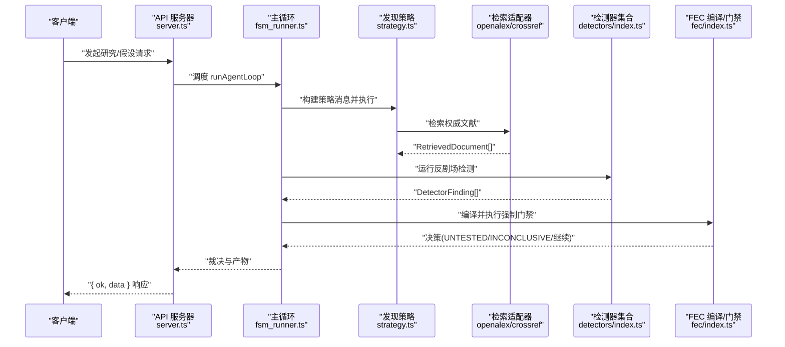
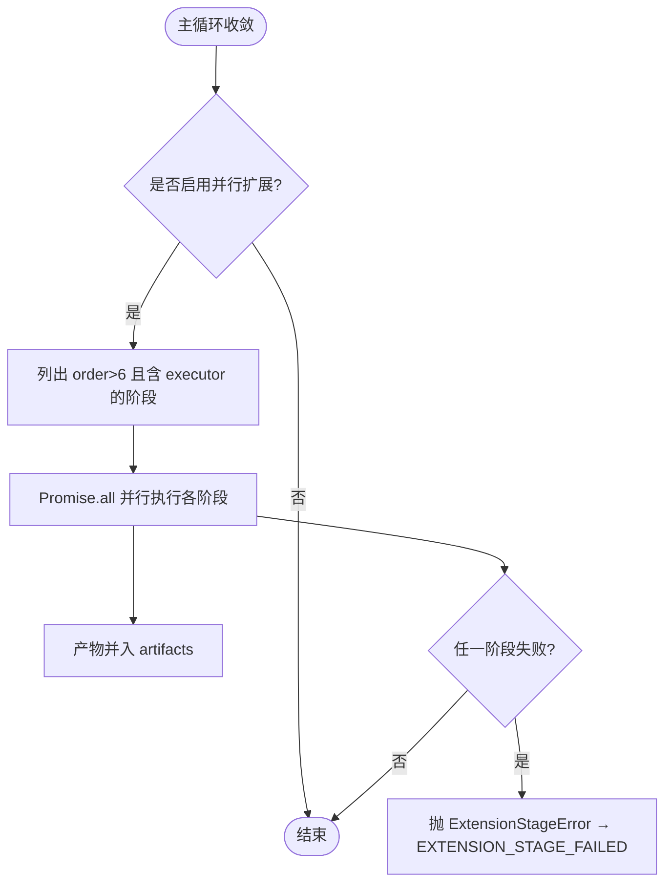
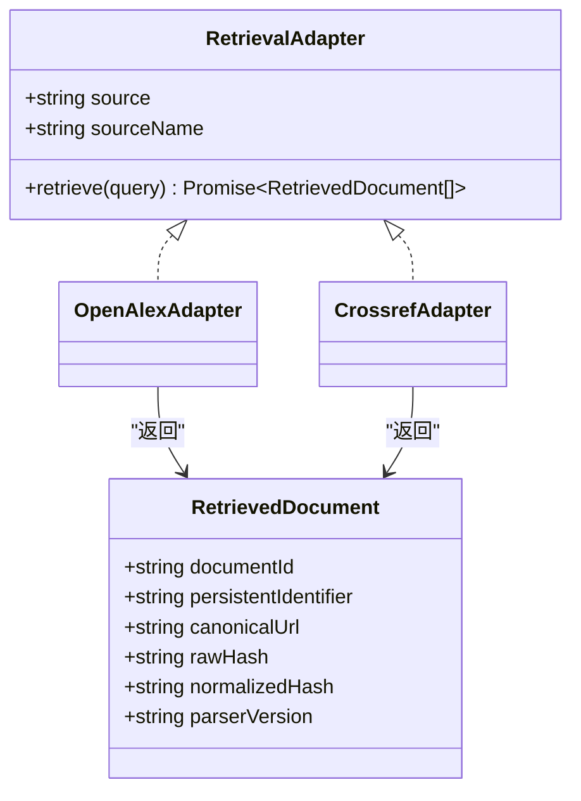
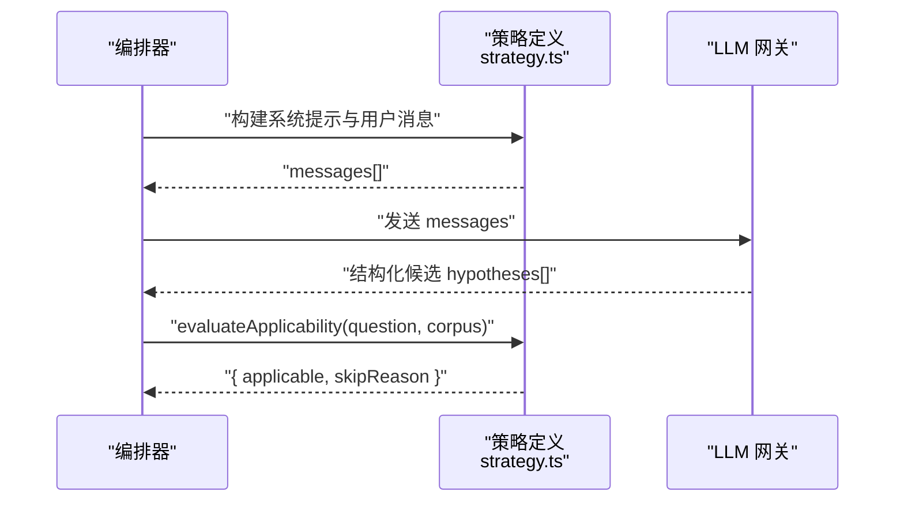
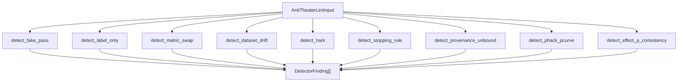
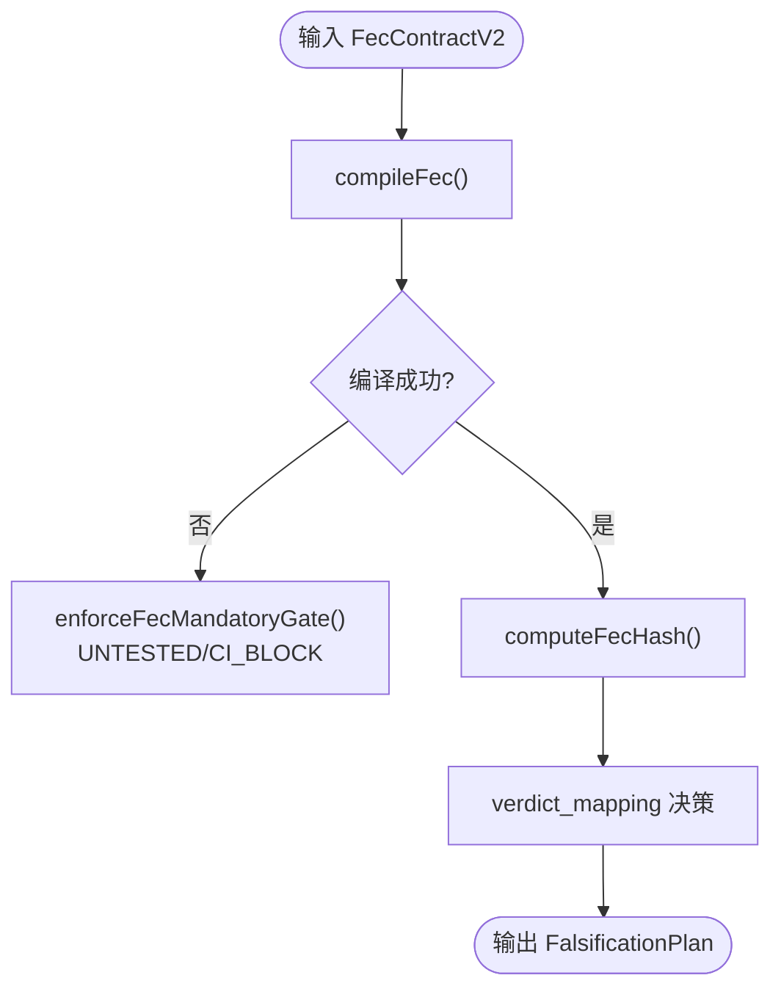
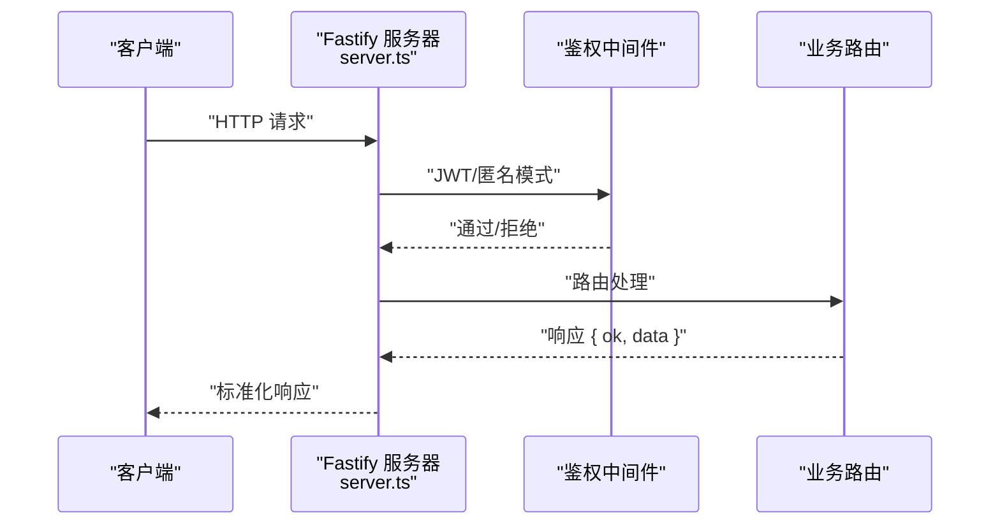
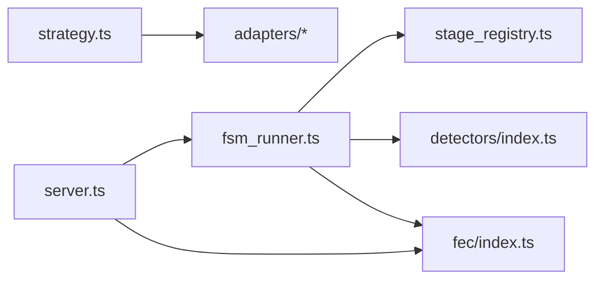

# 扩展开发

<cite>
**本文引用的文件**
- [src/agent_loop/fsm_runner.ts](file://src/agent_loop/fsm_runner.ts)
- [src/api/server.ts](file://src/api/server.ts)
- [src/retrieval/types.ts](file://src/retrieval/types.ts)
- [src/retrieval/adapters/openalex.ts](file://src/retrieval/adapters/openalex.ts)
- [src/retrieval/adapters/crossref.ts](file://src/retrieval/adapters/crossref.ts)
- [src/discovery/registry.ts](file://src/discovery/registry.ts)
- [src/discovery/strategies/strategy.ts](file://src/discovery/strategies/strategy.ts)
- [src/anti_theater/index.ts](file://src/anti_theater/index.ts)
- [src/anti_theater/detectors/index.ts](file://src/anti_theater/detectors/index.ts)
- [src/fec/index.ts](file://src/fec/index.ts)
- [src/fec/fec_contract.ts](file://src/fec/fec_contract.ts)
- [package.json](file://package.json)
</cite>

## 目录
1. [简介](#简介)
2. [项目结构](#项目结构)
3. [核心组件](#核心组件)
4. [架构总览](#架构总览)
5. [详细组件分析](#详细组件分析)
6. [依赖关系分析](#依赖关系分析)
7. [性能考虑](#性能考虑)
8. [故障排查指南](#故障排查指南)
9. [结论](#结论)
10. [附录](#附录)

## 简介
本指南面向希望在 FAR-Lab 平台上开发自定义扩展与插件的工程师，覆盖以下主题：
- 插件架构与扩展点设计（阶段扩展、检索适配器、发现策略、反剧场检测器、FEC 契约）
- 自定义检测器的开发与注册机制
- 检索适配器的实现模式与数据源集成
- 发现策略的扩展开发与算法集成
- FEC（可证伪性执行契约）的自定义实现与强制门禁
- API 扩展与中间件开发指南
- 扩展包的打包与分发机制
- 扩展生命周期管理与依赖注入
- 扩展模板与示例代码指引
- 扩展测试与质量保证策略

## 项目结构
FAR-Lab 采用“核心内核 + 可插拔扩展”的分层架构。关键扩展点包括：
- 运行期阶段扩展：在智能体主循环收敛后并行执行扩展阶段
- 检索适配器：对接权威学术数据源（OpenAlex、Crossref 等）
- 发现策略：以声明式策略定义驱动假设生成
- 反剧场检测器：对证据链与流程进行一致性/完整性检测
- FEC 契约：冻结统计计划、阈值与验证路径，驱动裁决门禁
- API 服务：Fastify 路由与中间件注册，支持事件流与 V2 收据端点

```mermaid
graph TB
subgraph "运行时"
FSM["智能体主循环<br/>fsm_runner.ts"]
REG["发现登记簿<br/>discovery/registry.ts"]
end
subgraph "扩展点"
STRAT["发现策略<br/>discovery/strategies/strategy.ts"]
RETA["检索适配器<br/>retrieval/adapters/*"]
DET["反剧场检测器<br/>anti_theater/detectors/*"]
FEC["FEC 契约与编译<br/>fec/*"]
end
subgraph "API"
API["Fastify 服务器<br/>api/server.ts"]
end
FSM --> STRAT
FSM --> DET
FSM --> FEC
STRAT --> RETA
API --> FSM
API --> FEC
```

**图表来源**
- [src/agent_loop/fsm_runner.ts:189-196](file://src/agent_loop/fsm_runner.ts#L189-L196)
- [src/discovery/strategies/strategy.ts:64-78](file://src/discovery/strategies/strategy.ts#L64-L78)
- [src/retrieval/types.ts:118-122](file://src/retrieval/types.ts#L118-L122)
- [src/anti_theater/detectors/index.ts:55-79](file://src/anti_theater/detectors/index.ts#L55-L79)
- [src/fec/index.ts:17-31](file://src/fec/index.ts#L17-L31)
- [src/api/server.ts:112-255](file://src/api/server.ts#L112-L255)

**章节来源**
- [src/agent_loop/fsm_runner.ts:189-196](file://src/agent_loop/fsm_runner.ts#L189-L196)
- [src/api/server.ts:112-255](file://src/api/server.ts#L112-L255)

## 核心组件
- 运行期阶段扩展：在主链收敛并产出裁决后，按 order>6 并发执行已注册的扩展阶段，产物并入 artifacts，失败显式抛出错误，不静默吞错。
- 检索适配器：统一接口 RetrievalAdapter，source/sourceName/retrieve，返回带完整溯源信息的 RetrievedDocument。
- 发现策略：StrategyDefinition 描述认知操作、适用性评估、指令与输出约束；通过 buildStrategyMessages 组装系统提示与用户消息。
- 反剧场检测器：固定顺序的 DETECTORS 数组，每个 detector 接收 AntiTheaterLintInput 并返回 DetectorFinding[]，用于质量与安全门。
- FEC 契约：FecContractV2 描述统计计划、阈值、范围、随机种子策略、偏离处置与协议冻结；编译器产出 FalsificationPlan，门禁强制 fail-closed。
- API 服务：Fastify 实例注册安全、限流、JWT、Swagger、鉴权中间件与路由，提供 /api/v1 与 /api/v2 端点，支持可选事件流 SSE。

**章节来源**
- [src/agent_loop/fsm_runner.ts:189-196](file://src/agent_loop/fsm_runner.ts#L189-L196)
- [src/retrieval/types.ts:118-122](file://src/retrieval/types.ts#L118-L122)
- [src/discovery/strategies/strategy.ts:64-78](file://src/discovery/strategies/strategy.ts#L64-L78)
- [src/anti_theater/detectors/index.ts:55-79](file://src/anti_theater/detectors/index.ts#L55-L79)
- [src/fec/fec_contract.ts:258-373](file://src/fec/fec_contract.ts#L258-L373)
- [src/api/server.ts:112-255](file://src/api/server.ts#L112-L255)

## 架构总览
下图展示扩展点在平台中的位置与交互：
- 运行期阶段扩展由 fsm_runner 触发，调用 stage_registry 中注册的 executor
- 检索适配器被策略或研究管线调用，产出带哈希与溯源的文档
- 发现策略通过 StrategyDefinition 暴露能力，供编排器选择与执行
- 反剧场检测器在 lint 阶段按序执行，产出 findings 影响评分与裁决
- FEC 编译与门禁在证据追加前校验，决定 UNTESTED/INCONCLUSIVE/阻断 CI
- API 层将上述能力暴露为 HTTP 端点，并可接入事件总线



**图表来源**
- [src/api/server.ts:112-255](file://src/api/server.ts#L112-L255)
- [src/agent_loop/fsm_runner.ts:419-592](file://src/agent_loop/fsm_runner.ts#L419-L592)
- [src/discovery/strategies/strategy.ts:140-181](file://src/discovery/strategies/strategy.ts#L140-L181)
- [src/retrieval/adapters/openalex.ts:174-189](file://src/retrieval/adapters/openalex.ts#L174-L189)
- [src/retrieval/adapters/crossref.ts:219-234](file://src/retrieval/adapters/crossref.ts#L219-L234)
- [src/anti_theater/detectors/index.ts:55-79](file://src/anti_theater/detectors/index.ts#L55-L79)
- [src/fec/index.ts:17-31](file://src/fec/index.ts#L17-L31)

## 详细组件分析

### 运行期阶段扩展（并行扩展阶段）
- 扩展点：runParallelExtensionStages 启用后，主链收敛并产出裁决后，并发执行 stage_registry 中 order>6 且带有 executor 的阶段
- 行为契约：扩展失败抛 ExtensionStageError，外层捕获并设置 LoopState.error.code='EXTENSION_STAGE_FAILED'，确保反剧场 F11 不静默吞错
- 产物合并：扩展产物并入 artifacts，复用证据链/收据/事件语义



**图表来源**
- [src/agent_loop/fsm_runner.ts:189-196](file://src/agent_loop/fsm_runner.ts#L189-L196)
- [src/agent_loop/fsm_runner.ts:578-592](file://src/agent_loop/fsm_runner.ts#L578-L592)

**章节来源**
- [src/agent_loop/fsm_runner.ts:189-196](file://src/agent_loop/fsm_runner.ts#L189-L196)
- [src/agent_loop/fsm_runner.ts:578-592](file://src/agent_loop/fsm_runner.ts#L578-L592)

### 检索适配器（数据源集成）
- 统一接口：RetrievalAdapter{ source, sourceName, retrieve(query) }
- 数据模型：RetrievedDocument 包含 documentId、persistentIdentifier、canonicalUrl、rawHash、normalizedHash、parserVersion 等，确保可追溯与防篡改
- 实现示例：
  - OpenAlex 适配器：构建 URL、允许白名单网络访问、解析结果、计算哈希、返回文档列表
  - Crossref 适配器：DOI 解析与全文搜索，缓存命中标记 retrievedFrom='cache'



**图表来源**
- [src/retrieval/types.ts:118-122](file://src/retrieval/types.ts#L118-L122)
- [src/retrieval/types.ts:37-89](file://src/retrieval/types.ts#L37-L89)
- [src/retrieval/adapters/openalex.ts:174-189](file://src/retrieval/adapters/openalex.ts#L174-L189)
- [src/retrieval/adapters/crossref.ts:219-234](file://src/retrieval/adapters/crossref.ts#L219-L234)

**章节来源**
- [src/retrieval/types.ts:118-122](file://src/retrieval/types.ts#L118-L122)
- [src/retrieval/adapters/openalex.ts:174-189](file://src/retrieval/adapters/openalex.ts#L174-L189)
- [src/retrieval/adapters/crossref.ts:219-234](file://src/retrieval/adapters/crossref.ts#L219-L234)

### 发现策略（扩展开发与算法集成）
- 策略定义：StrategyDefinition 包含 id、signature、epistemicMove、maxPerCall、requiredMarkers、evaluateApplicability、instruction
- 消息构建：buildStrategySystemPrompt 与 buildStrategyUserMessage 组合系统提示与用户消息，注入共享规则与结构化可裁决字段要求
- 应用性评估：策略可诚实跳过不适用的问题/语料，记录 skipReason，避免伪造候选



**图表来源**
- [src/discovery/strategies/strategy.ts:64-78](file://src/discovery/strategies/strategy.ts#L64-L78)
- [src/discovery/strategies/strategy.ts:140-181](file://src/discovery/strategies/strategy.ts#L140-L181)

**章节来源**
- [src/discovery/strategies/strategy.ts:64-78](file://src/discovery/strategies/strategy.ts#L64-L78)
- [src/discovery/strategies/strategy.ts:140-181](file://src/discovery/strategies/strategy.ts#L140-L181)

### 反剧场检测器（自定义检测器与注册）
- 检测器签名：AntiTheaterDetector(input) => DetectorFinding[]
- 注册机制：DETECTORS 数组固定顺序，新增检测器需追加至末尾以保持 golden vector 稳定性
- 典型检测：假阳性、标签仅用、指标替换、数据集漂移、HARKing、停止规则、工作流摘要不一致等
- 扩展建议：新增检测器应纯函数、无副作用、零容忍合规（无 any/桩/空 catch），并在 index 中导出与聚合



**图表来源**
- [src/anti_theater/detectors/index.ts:55-79](file://src/anti_theater/detectors/index.ts#L55-L79)

**章节来源**
- [src/anti_theater/detectors/index.ts:55-79](file://src/anti_theater/detectors/index.ts#L55-L79)
- [src/anti_theater/index.ts:85-91](file://src/anti_theater/index.ts#L85-L91)

### FEC（可证伪性执行契约）自定义实现
- 契约类型：FecContractV2 包含 scope、metric、threshold、statisticalPlan、powerPlan、multipleTestingPlan、seedPolicy、deviationPolicy、freeze、integrityFlags 等
- 编译器：compileFec 输入 CompileFecInput，输出 FalsificationPlan（statLock、verdictMapping、proofChecks、integrityFlags）
- 门禁：enforceFecMandatoryGate 缺 FEC 或编译失败 → UNTESTED；LLM_FROZEN → CI 阻断
- 哈希互验：computeFecHash 基于 VC 字段的规范 JSON 计算，供验证器互验



**图表来源**
- [src/fec/index.ts:17-31](file://src/fec/index.ts#L17-L31)
- [src/fec/fec_contract.ts:377-438](file://src/fec/fec_contract.ts#L377-L438)

**章节来源**
- [src/fec/index.ts:17-31](file://src/fec/index.ts#L17-L31)
- [src/fec/fec_contract.ts:258-373](file://src/fec/fec_contract.ts#L258-L373)
- [src/fec/fec_contract.ts:377-438](file://src/fec/fec_contract.ts#L377-L438)

### API 扩展与中间件开发
- 服务器构建：buildServer 创建 Fastify 实例，注册 helmet、cors、rate-limit、jwt、swagger、鉴权中间件与错误处理器
- 路由注册：/api/v1 下注册 hypothesize/evidence/verdict/report/integrity/benchmark/court/arena/lifecycle/planning 等；/api/v2 提供收据验证与持久化
- 事件流：可选 eventBus 注入后注册 /events/stream SSE 端点
- 中间件扩展：可在 registerAuthMiddleware 前后插入自定义鉴权/审计逻辑，遵循模型中立与零容忍合规



**图表来源**
- [src/api/server.ts:112-255](file://src/api/server.ts#L112-L255)

**章节来源**
- [src/api/server.ts:112-255](file://src/api/server.ts#L112-L255)

### 扩展包打包与分发机制
- 依赖管理：使用 pnpm 工作区与 package.json 声明依赖（fastify、better-sqlite3、zod 等）
- 构建脚本：提供 build、test、lint、openapi 生成等命令，便于扩展包集成 CI
- 分发建议：将扩展作为独立 npm 包发布，通过 peerDependencies 声明与 FAR-Lab 核心版本的兼容关系；在宿主应用中通过 require/import 注册扩展（如检索适配器、检测器、策略）

**章节来源**
- [package.json:84-97](file://package.json#L84-L97)

### 扩展生命周期管理与依赖注入
- 生命周期：
  - 启动：API 服务器构建时注册插件与路由
  - 运行：主循环执行阶段，扩展阶段在裁决后并行执行
  - 终止：优雅关闭，释放资源（DB close）
- 依赖注入：
  - LLM 网关：通过 config.gateway 或 resolveRuntimeGateway 注入
  - 数据库：config.db 注入到各路由与模块
  - 事件总线：可选 eventBus 注入以启用 SSE 事件流
  - 配置项：appendOptions、profile、jwtSecret、corsOrigins、rateLimitMax 等

**章节来源**
- [src/api/server.ts:112-255](file://src/api/server.ts#L112-L255)
- [src/agent_loop/fsm_runner.ts:189-196](file://src/agent_loop/fsm_runner.ts#L189-L196)

### 扩展模板与示例代码指引
- 检索适配器模板：实现 RetrievalAdapter，参考 openalex.ts/crossref.ts 的结构与哈希计算
- 发现策略模板：定义 StrategyDefinition，实现 evaluateApplicability 与 instruction，使用 buildStrategyMessages 组装提示
- 检测器模板：实现 AntiTheaterDetector，返回 DetectorFinding[]，并在 DETECTORS 中注册
- FEC 契约模板：构造 FecContractV2，使用 compileFec 与 enforceFecMandatoryGate 完成编译与门禁

**章节来源**
- [src/retrieval/adapters/openalex.ts:174-189](file://src/retrieval/adapters/openalex.ts#L174-L189)
- [src/retrieval/adapters/crossref.ts:219-234](file://src/retrieval/adapters/crossref.ts#L219-L234)
- [src/discovery/strategies/strategy.ts:64-78](file://src/discovery/strategies/strategy.ts#L64-L78)
- [src/anti_theater/detectors/index.ts:55-79](file://src/anti_theater/detectors/index.ts#L55-L79)
- [src/fec/fec_contract.ts:377-438](file://src/fec/fec_contract.ts#L377-L438)

### 扩展测试与质量保证策略
- 单元测试：针对检索适配器解析、策略消息构建、检测器逻辑、FEC 编译分支进行断言
- 集成测试：端到端验证主循环阶段扩展、FEC 门禁、API 路由响应格式
- 质量门禁：零容忍合规（无 any/桩/空 catch）、模型中立、确定性输出（golden vector 对拍）
- 回归保护：固定 DETECTORS 顺序、策略 requiredMarkers 契约测试、FEC 编译错误码与严重性映射

**章节来源**
- [src/anti_theater/detectors/index.ts:55-79](file://src/anti_theater/detectors/index.ts#L55-L79)
- [src/discovery/strategies/strategy.ts:140-181](file://src/discovery/strategies/strategy.ts#L140-L181)
- [src/fec/fec_contract.ts:30-64](file://src/fec/fec_contract.ts#L30-L64)

## 依赖关系分析
- 耦合度：
  - fsm_runner 与 stage_registry 松耦合，通过 order 与 executor 解耦扩展实现
  - 检索适配器与策略通过统一接口交互，降低数据源差异带来的耦合
  - 检测器与 lint 编排器通过固定顺序与纯函数接口解耦
  - FEC 编译与门禁与 orchestrator 通过类型与错误码解耦
- 外部依赖：
  - Fastify 生态（helmet、cors、rate-limit、jwt、swagger）
  - better-sqlite3 用于本地存储
  - zod 用于运行时类型校验
- 潜在循环依赖：通过 barrel 导出与分层导入避免（如 fec/index.ts 集中导出类型与函数）



**图表来源**
- [src/agent_loop/fsm_runner.ts:189-196](file://src/agent_loop/fsm_runner.ts#L189-L196)
- [src/anti_theater/detectors/index.ts:55-79](file://src/anti_theater/detectors/index.ts#L55-L79)
- [src/fec/index.ts:17-31](file://src/fec/index.ts#L17-L31)
- [src/discovery/strategies/strategy.ts:140-181](file://src/discovery/strategies/strategy.ts#L140-L181)
- [src/api/server.ts:112-255](file://src/api/server.ts#L112-L255)

**章节来源**
- [src/agent_loop/fsm_runner.ts:189-196](file://src/agent_loop/fsm_runner.ts#L189-L196)
- [src/anti_theater/detectors/index.ts:55-79](file://src/anti_theater/detectors/index.ts#L55-L79)
- [src/fec/index.ts:17-31](file://src/fec/index.ts#L17-L31)
- [src/discovery/strategies/strategy.ts:140-181](file://src/discovery/strategies/strategy.ts#L140-L181)
- [src/api/server.ts:112-255](file://src/api/server.ts#L112-L255)

## 性能考虑
- 并行扩展：使用 Promise.all 并发执行扩展阶段，提升吞吐；注意资源竞争与错误传播
- 检索缓存：适配器支持 cacheHit 标记，减少重复网络请求
- 预算控制：主循环内置成本硬预算断路器，超限即停，防止无限循环
- 压缩视图：可选 E-compaction 减少上下文大小，提升 LLM 调用效率

[本节为通用性能指导，无需特定文件来源]

## 故障排查指南
- 扩展阶段失败：检查 ExtensionStageError 与 LoopState.error.code='EXTENSION_STAGE_FAILED'，定位具体阶段
- 检索适配器异常：确认 allowlisted host 配置、网络可达性与解析逻辑；检查 rawHash/normalizedHash 一致性
- 策略输出无效：验证 requiredMarkers 与结构化字段（direction/metricShape）；检查 applicability 评估
- 检测器误报/漏报：核对输入数据结构与检测逻辑；确认 DETECTORS 顺序与条件触发
- FEC 编译失败：查看 CompileErrorCode 与 severity，修正 statisticalPlan、threshold、scope 等字段

**章节来源**
- [src/agent_loop/fsm_runner.ts:578-592](file://src/agent_loop/fsm_runner.ts#L578-L592)
- [src/retrieval/adapters/openalex.ts:174-189](file://src/retrieval/adapters/openalex.ts#L174-L189)
- [src/discovery/strategies/strategy.ts:140-181](file://src/discovery/strategies/strategy.ts#L140-L181)
- [src/anti_theater/detectors/index.ts:55-79](file://src/anti_theater/detectors/index.ts#L55-L79)
- [src/fec/fec_contract.ts:30-64](file://src/fec/fec_contract.ts#L30-L64)

## 结论
FAR-Lab 提供了丰富且严谨的扩展点，涵盖运行期阶段、检索适配器、发现策略、反剧场检测器与 FEC 契约。通过统一接口、固定顺序与 fail-closed 门禁，平台在保证科学严谨性的同时，支持高度可插拔的扩展生态。开发者可依据本指南快速实现自定义扩展，并通过测试与质量门禁确保可靠性。

[本节为总结性内容，无需特定文件来源]

## 附录
- 术语表：
  - 检索适配器：实现 RetrievalAdapter 的数据源接入模块
  - 发现策略：以 StrategyDefinition 描述的认知操作与输出约束
  - 反剧场检测器：按固定顺序执行的证据与流程质量检测
  - FEC：可证伪性执行契约，冻结统计计划与阈值，驱动裁决门禁
- 最佳实践：
  - 保持纯函数与零副作用
  - 严格遵循类型与 schema 校验
  - 使用哈希与溯源字段保证可验证性
  - 通过单元测试与集成测试覆盖边界与异常路径

[本节为补充信息，无需特定文件来源]