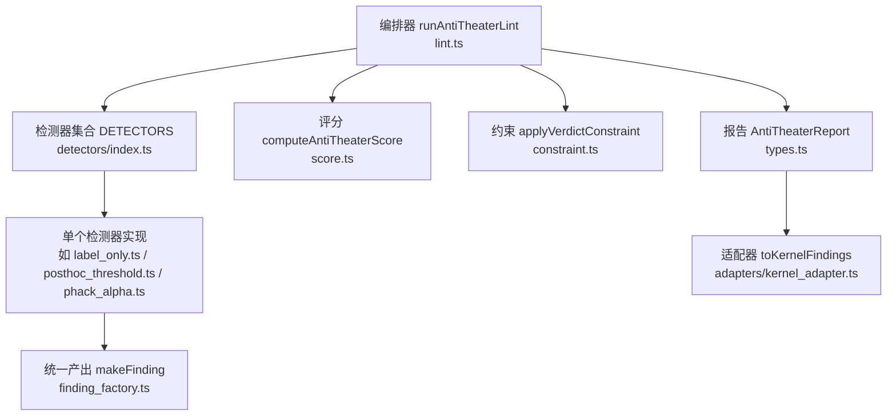
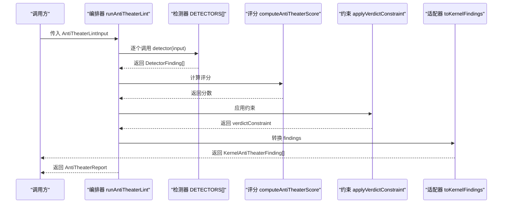
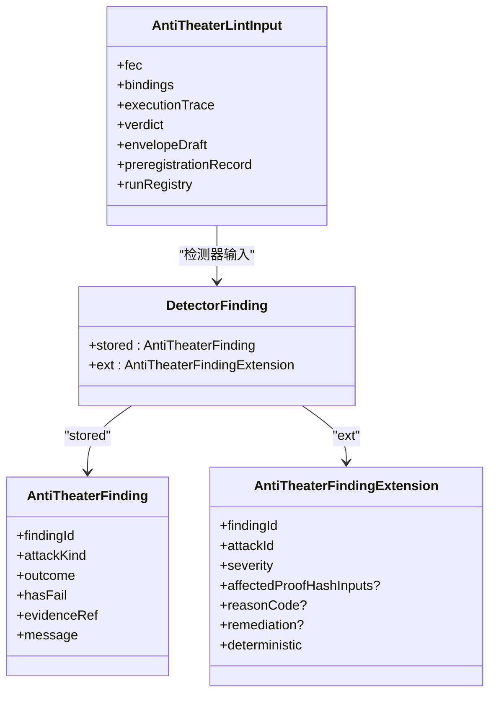
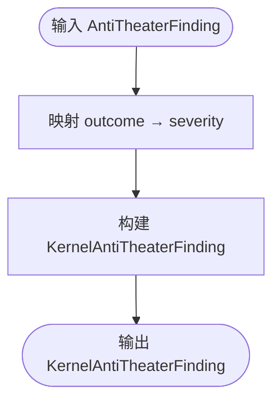
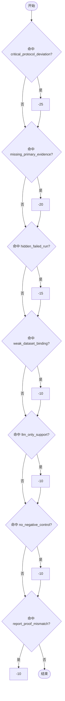
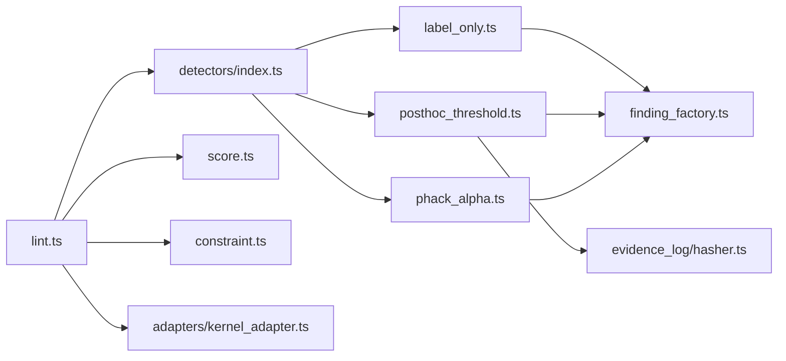

# 检测器扩展开发

<cite>
**本文引用的文件**
- [src/anti_theater/index.ts](file://src/anti_theater/index.ts)
- [src/anti_theater/types.ts](file://src/anti_theater/types.ts)
- [src/anti_theater/lint.ts](file://src/anti_theater/lint.ts)
- [src/anti_theater/score.ts](file://src/anti_theater/score.ts)
- [src/anti_theater/constraint.ts](file://src/anti_theater/constraint.ts)
- [src/anti_theater/finding_factory.ts](file://src/anti_theater/finding_factory.ts)
- [src/anti_theater/adapters/kernel_adapter.ts](file://src/anti_theater/adapters/kernel_adapter.ts)
- [src/anti_theater/detectors/index.ts](file://src/anti_theater/detectors/index.ts)
- [src/anti_theater/detectors/label_only.ts](file://src/anti_theater/detectors/label_only.ts)
- [src/anti_theater/detectors/posthoc_threshold.ts](file://src/anti_theater/detectors/posthoc_threshold.ts)
- [src/anti_theater/detectors/phack_alpha.ts](file://src/anti_theater/detectors/phack_alpha.ts)
</cite>

## 目录
1. [简介](#简介)
2. [项目结构](#项目结构)
3. [核心组件](#核心组件)
4. [架构总览](#架构总览)
5. [详细组件分析](#详细组件分析)
6. [依赖关系分析](#依赖关系分析)
7. [性能与错误处理最佳实践](#性能与错误处理最佳实践)
8. [测试策略与质量保证](#测试策略与质量保证)
9. [结论](#结论)
10. [附录：完整开发示例与步骤清单](#附录：完整开发示例与步骤清单)

## 简介
本指南面向希望在 FAR-Lab 平台中开发自定义“反剧场攻击检测器”的工程师。内容覆盖检测器的核心接口、输入验证、分析逻辑、结果输出格式、注册机制与生命周期管理；详解 kernel_adapter 适配器模式；提供从数据预处理到评分计算的完整示例路径；并给出测试策略、性能优化与错误处理的工程化建议。

## 项目结构
FAR-Lab 的反剧场检测子系统位于 src/anti_theater，采用“编排器 + 检测器集合 + 类型/工厂/评分/约束 + 适配器”的分层组织：
- 编排器 lint.ts：按固定顺序遍历 DETECTORS，聚合 findings，计算评分，应用 verdict 约束，生成报告。
- 检测器集合 detectors/index.ts：集中声明所有检测器函数及执行顺序（确定性）。
- 类型 types.ts：权威存储类型、Lint 输入、证据绑定、预注册记录等。
- 工厂 finding_factory.ts：统一构造 DetectorFinding（stored + ext），校验不变量。
- 评分 score.ts：基于桶去重的评分模型。
- 约束 constraint.ts：取严后的 verdict 约束（支持度降级模型）。
- 适配器 adapters/kernel_adapter.ts：将存储型 finding 投影为内核输入。
- 入口 index.ts：对外导出 API（types、errors、factory、utils、adapters、score、constraint、lint、detectors）。

**图表来源**
- [src/anti_theater/lint.ts:37-81](file://src/anti_theater/lint.ts#L37-L81)
- [src/anti_theater/detectors/index.ts:55-79](file://src/anti_theater/detectors/index.ts#L55-L79)
- [src/anti_theater/score.ts:56-95](file://src/anti_theater/score.ts#L56-L95)
- [src/anti_theater/constraint.ts:105-152](file://src/anti_theater/constraint.ts#L105-L152)
- [src/anti_theater/adapters/kernel_adapter.ts:43-58](file://src/anti_theater/adapters/kernel_adapter.ts#L43-L58)

**章节来源**
- [src/anti_theater/index.ts:1-97](file://src/anti_theater/index.ts#L1-L97)
- [src/anti_theater/lint.ts:1-82](file://src/anti_theater/lint.ts#L1-L82)
- [src/anti_theater/detectors/index.ts:1-107](file://src/anti_theater/detectors/index.ts#L1-L107)

## 核心组件
- 检测器函数签名：AntiTheaterDetector = (input: AntiTheaterLintInput) => readonly DetectorFinding[]
- 输入 AntiTheaterLintInput：包含 fec、bindings、executionTrace、verdict、envelopeDraft、preregistrationRecord、runRegistry
- 输出 DetectorFinding：包含 stored（AntiTheaterFinding）与 ext（AntiTheaterFindingExtension）
- 工厂 makeFinding：自动派生 findingId、hasFail、severity，校验 attackId 映射与 blockSeal 一致性
- 评分 computeAntiTheaterScore：7 桶去重扣分，阈值 SEAL_BLOCK_SCORE_THRESHOLD=70
- 约束 applyVerdictConstraint：支持度降级模型，reasonCode 优先于 attackId 映射，blockSeal 强制至少 UNTESTED
- 适配器 toKernelFinding(s)：outcome→severity 投影，供裁决内核消费

**章节来源**
- [src/anti_theater/types.ts:117-202](file://src/anti_theater/types.ts#L117-L202)
- [src/anti_theater/types.ts:351-367](file://src/anti_theater/types.ts#L351-L367)
- [src/anti_theater/finding_factory.ts:23-97](file://src/anti_theater/finding_factory.ts#L23-L97)
- [src/anti_theater/score.ts:23-95](file://src/anti_theater/score.ts#L23-L95)
- [src/anti_theater/constraint.ts:36-152](file://src/anti_theater/constraint.ts#L36-L152)
- [src/anti_theater/adapters/kernel_adapter.ts:22-58](file://src/anti_theater/adapters/kernel_adapter.ts#L22-L58)

## 架构总览
检测器运行流程（确定性、无 LLM）：
1. 编排器加载期进行 AST 结构门自检，确保内核纯净。
2. 按 DETECTORS 顺序依次调用每个检测器，收集 DetectorFinding[]。
3. 计算评分（7 桶去重扣分）。
4. 应用 verdict 约束（取严后 forcedVerdict + blockSeal）。
5. 统计 findings 的 outcome 分布，生成 AntiTheaterReport（含 hasFail/failCount/warnCount/llmOverrideRejected/score/canSealConfirmed/verdictConstraint）。
6. 通过适配器将 findings 投影为内核输入，供后续裁决使用。

**图表来源**
- [src/anti_theater/lint.ts:37-81](file://src/anti_theater/lint.ts#L37-L81)
- [src/anti_theater/detectors/index.ts:55-79](file://src/anti_theater/detectors/index.ts#L55-L79)
- [src/anti_theater/score.ts:56-95](file://src/anti_theater/score.ts#L56-L95)
- [src/anti_theater/constraint.ts:105-152](file://src/anti_theater/constraint.ts#L105-L152)
- [src/anti_theater/adapters/kernel_adapter.ts:43-58](file://src/anti_theater/adapters/kernel_adapter.ts#L43-L58)

## 详细组件分析

### 检测器接口与实现模式
- 输入：AntiTheaterLintInput（fec/bindings/executionTrace/verdict/envelopeDraft/preregistrationRecord/runRegistry）
- 输出：DetectorFinding[]（每条包含 stored 与 ext）
- 模式：纯函数、确定性、不 mutate input、不读 FS/网络
- 工厂：统一通过 makeFinding 产出，自动派生 findingId、hasFail、severity，并校验不变量

**图表来源**
- [src/anti_theater/types.ts:117-202](file://src/anti_theater/types.ts#L117-L202)
- [src/anti_theater/types.ts:351-367](file://src/anti_theater/types.ts#L351-L367)

**章节来源**
- [src/anti_theater/types.ts:117-202](file://src/anti_theater/types.ts#L117-L202)
- [src/anti_theater/finding_factory.ts:23-97](file://src/anti_theater/finding_factory.ts#L23-L97)

### 注册机制与生命周期管理
- 注册：在 detectors/index.ts 的 DETECTORS 数组中追加新检测器函数，保持顺序稳定（golden vector 对拍要求）
- 生命周期：
  - 加载期：AST 结构门自检（确保内核纯净）
  - 运行期：按序调用检测器，聚合 findings
  - 聚合期：评分、约束、报告生成
  - 输出期：适配器投影至内核输入
- 扩展点：新增检测器只需实现函数并加入 DETECTORS 数组，无需修改其他模块

**章节来源**
- [src/anti_theater/detectors/index.ts:1-107](file://src/anti_theater/detectors/index.ts#L1-L107)
- [src/anti_theater/lint.ts:37-81](file://src/anti_theater/lint.ts#L37-L81)

### kernel_adapter 适配器模式
- 目的：将存储型 AntiTheaterFinding 转换为轻量级 KernelAntiTheaterFinding（kind/severity/details）
- 规则：
  - kind：透传 attackKind
  - severity：FAIL→fail，WARN→warn，PASS/SKIP→pass
  - details：透传 message
- 批量转换：toKernelFindings 保持顺序（确定性）

**图表来源**
- [src/anti_theater/adapters/kernel_adapter.ts:22-58](file://src/anti_theater/adapters/kernel_adapter.ts#L22-L58)

**章节来源**
- [src/anti_theater/adapters/kernel_adapter.ts:1-60](file://src/anti_theater/adapters/kernel_adapter.ts#L1-L60)

### 典型检测器实现示例

#### 标签证据检测（AT-LABEL-ONLY）
- 语义：primary measurement 必须携带 rawArtifactHashes；否则视为“标签证据”
- 逻辑：
  - 若无 primary measurement → NO_PRIMARY_RAW_ARTIFACT（FAIL）
  - 若 primary 的 rawArtifactHashes 为空 → LABEL_ONLY_EVIDENCE（FAIL）
- 影响：affectedProofHashInputs 指向 measurementResults 对应字段

**章节来源**
- [src/anti_theater/detectors/label_only.ts:1-71](file://src/anti_theater/detectors/label_only.ts#L1-L71)

#### 事后阈值篡改检测（AT-POSTHOC-THRESHOLD）
- 语义：比较冻结的 thresholdHash 与执行端重算的 canonical hash
- 逻辑：
  - frozen = preregistrationRecord.thresholdHash
  - executed = hashCanonicalJson({threshold, direction, thresholdSemantics})
  - 不等 → POSTHOC_THRESHOLD_DEVIATION（FAIL）
- 影响：affectedProofHashInputs 指向 fec.threshold、fec.direction、fec.threshold.thresholdSemantics

**章节来源**
- [src/anti_theater/detectors/posthoc_threshold.ts:1-79](file://src/anti_theater/detectors/posthoc_threshold.ts#L1-L79)

#### p-hacking alpha 膨胀检测（AT-PHACK-ALPHA）
- 语义：比较冻结 alpha 与执行端 statisticalPlan.alpha（tol=0 精确比较）
- 逻辑：
  - 不相等 → ALPHA_INFLATION_DEVIATION（FAIL）
- 影响：affectedProofHashInputs 指向 fec.statisticalPlan.alpha 与 preregistrationRecord.alpha

**章节来源**
- [src/anti_theater/detectors/phack_alpha.ts:1-67](file://src/anti_theater/detectors/phack_alpha.ts#L1-L67)

### 评分与约束
- 评分：7 桶去重扣分，阈值 70（低于该值不可 seal CONFIRMED）
- 约束：支持度降级模型，reasonCode 优先映射，BLOCK 类强制至少 UNTESTED

**图表来源**
- [src/anti_theater/score.ts:23-95](file://src/anti_theater/score.ts#L23-L95)

**章节来源**
- [src/anti_theater/score.ts:1-96](file://src/anti_theater/score.ts#L1-L96)
- [src/anti_theater/constraint.ts:1-153](file://src/anti_theater/constraint.ts#L1-L153)

## 依赖关系分析
- 编排器依赖：
  - 检测器集合（顺序固定）
  - 评分模块（桶规则）
  - 约束模块（支持度降级）
  - 适配器（输出内核输入）
- 检测器依赖：
  - 类型定义（types.ts）
  - 工厂（finding_factory.ts）
  - 工具（utils.ts，如 floatsEqual）
  - 哈希（hashCanonicalJson，用于阈值比对）

**图表来源**
- [src/anti_theater/lint.ts:37-81](file://src/anti_theater/lint.ts#L37-L81)
- [src/anti_theater/detectors/index.ts:55-79](file://src/anti_theater/detectors/index.ts#L55-L79)
- [src/anti_theater/detectors/posthoc_threshold.ts:35-79](file://src/anti_theater/detectors/posthoc_threshold.ts#L35-L79)

**章节来源**
- [src/anti_theater/lint.ts:1-82](file://src/anti_theater/lint.ts#L1-L82)
- [src/anti_theater/detectors/index.ts:1-107](file://src/anti_theater/detectors/index.ts#L1-L107)

## 性能与错误处理最佳实践
- 性能
  - 检测器为纯函数，避免 I/O，保证可并行化与缓存友好
  - 评分与约束为 O(n) 聚合，使用 Set 去重减少重复扣分
  - 哈希计算仅用于关键比对（如阈值），注意输入序列化确定性
- 错误处理
  - 工厂 makeFinding 校验 attackId 映射与 blockSeal 一致性，违反时抛出不变量错误
  - 哈希函数对非有限数进行断言，防止静默放行异常数值
  - 适配阶段 outcome→severity 映射覆盖 SKIP→pass，避免未处理分支

**章节来源**
- [src/anti_theater/finding_factory.ts:53-97](file://src/anti_theater/finding_factory.ts#L53-L97)
- [src/anti_theater/score.ts:56-95](file://src/anti_theater/score.ts#L56-L95)
- [src/anti_theater/adapters/kernel_adapter.ts:22-58](file://src/anti_theater/adapters/kernel_adapter.ts#L22-L58)

## 测试策略与质量保证
- 单元测试
  - 针对每个检测器编写用例，覆盖 PASS/WARN/FAIL/SKIP 分支
  - 使用 golden vector 对拍，确保 findings 顺序与内容稳定
- 集成测试
  - 端到端验证 runAntiTheaterLint 输出 AntiTheaterReport 与 canSealConfirmed
  - 验证适配器 toKernelFindings 输出符合内核输入契约
- 质量门禁
  - 加载期 AST 结构门自检，确保内核纯净
  - 零容忍合规：无 any/@ts-ignore/桩/空 catch
- 回归测试
  - 新增检测器时，保持 DETECTORS 顺序稳定，避免破坏既有 golden vector

**章节来源**
- [src/anti_theater/lint.ts:37-81](file://src/anti_theater/lint.ts#L37-L81)
- [src/anti_theater/detectors/index.ts:1-107](file://src/anti_theater/detectors/index.ts#L1-L107)

## 结论
FAR-Lab 的反剧场检测系统以“编排器 + 检测器集合 + 类型/工厂/评分/约束 + 适配器”的分层架构，提供了可扩展、确定性、高内聚的检测能力。开发者只需遵循统一接口与工厂规范，即可快速实现自定义检测器并通过评分与约束机制融入整体流水线。通过严格的测试与质量门禁，确保检测结果的稳定性与可信度。

## 附录：完整开发示例与步骤清单
- 步骤
  1. 定义检测逻辑：读取 AntiTheaterLintInput 中的相关字段（如 executionTrace.measurements、preregistrationRecord、fec）
  2. 实现检测函数：返回 DetectorFinding[]，使用 makeFinding 统一产出
  3. 注册检测器：在 DETECTORS 数组末尾追加函数，保持顺序稳定
  4. 验证评分与约束：确认是否命中相应桶与约束映射
  5. 适配器输出：确保 findings 可被 toKernelFindings 正确投影
- 示例路径
  - 数据预处理：参考 label_only.ts 对 measurements 的过滤与校验
  - 特征提取：参考 posthoc_threshold.ts 使用 hashCanonicalJson 提取特征
  - 规则匹配：参考 phack_alpha.ts 进行精确比较与分支判断
  - 评分计算：参考 score.ts 的桶规则与阈值
  - 约束应用：参考 constraint.ts 的支持度降级模型

**章节来源**
- [src/anti_theater/detectors/label_only.ts:1-71](file://src/anti_theater/detectors/label_only.ts#L1-L71)
- [src/anti_theater/detectors/posthoc_threshold.ts:1-79](file://src/anti_theater/detectors/posthoc_threshold.ts#L1-L79)
- [src/anti_theater/detectors/phack_alpha.ts:1-67](file://src/anti_theater/detectors/phack_alpha.ts#L1-L67)
- [src/anti_theater/score.ts:1-96](file://src/anti_theater/score.ts#L1-L96)
- [src/anti_theater/constraint.ts:1-153](file://src/anti_theater/constraint.ts#L1-L153)