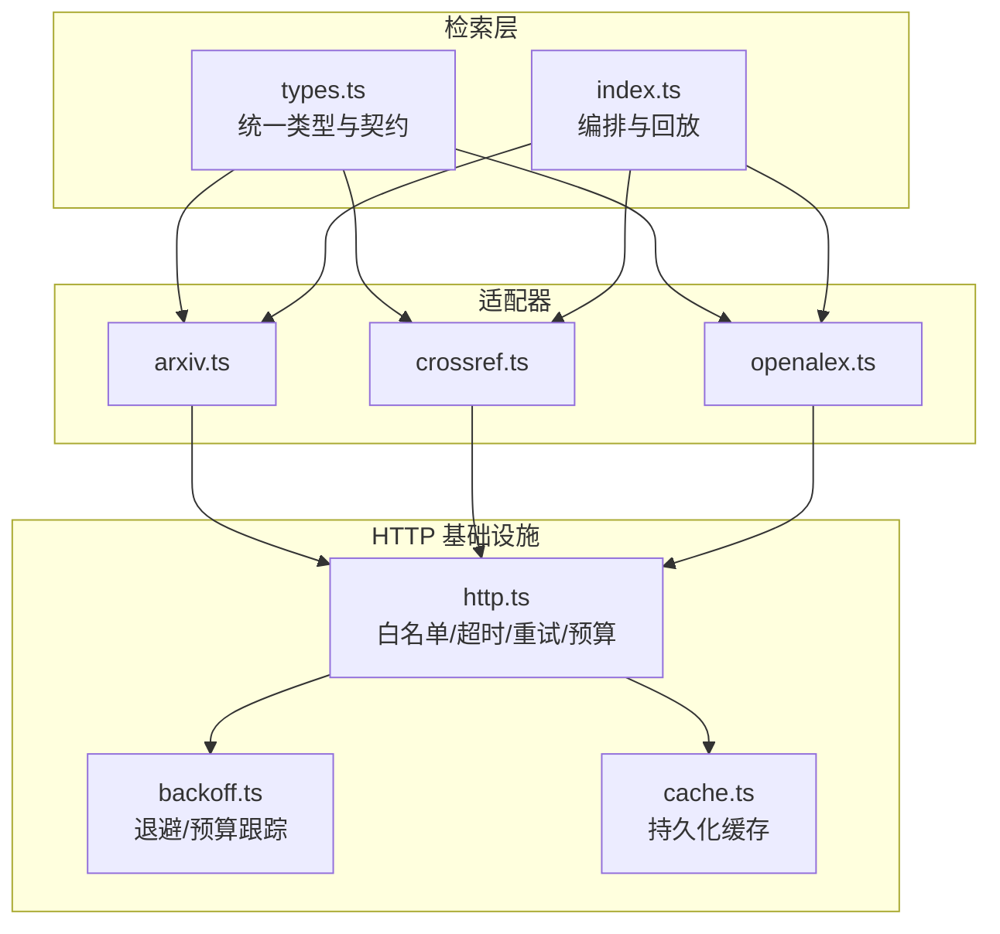
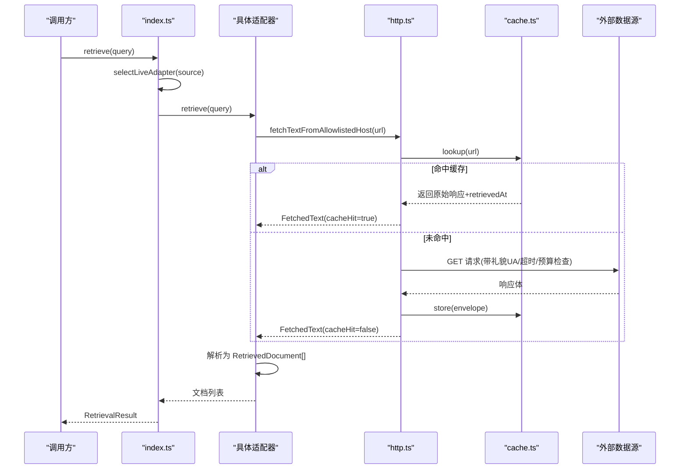
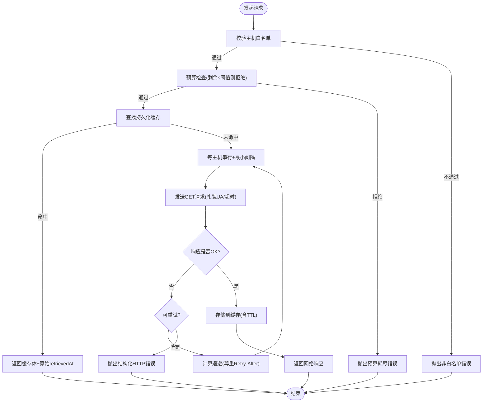
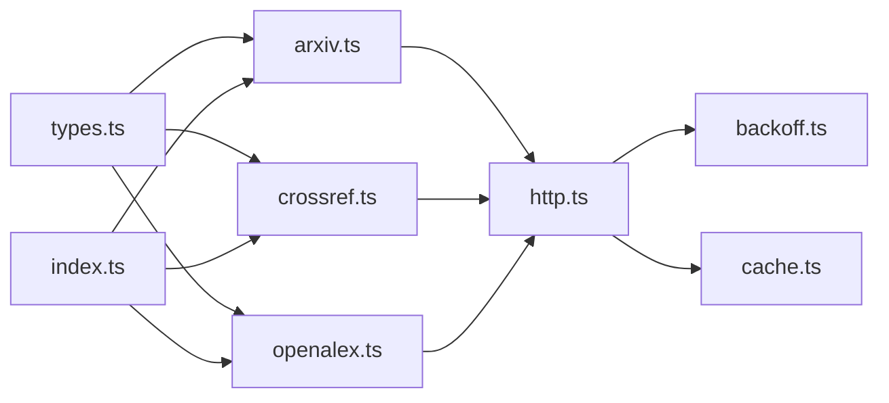

# 检索适配器开发

<cite>
**本文引用的文件**
- [src/retrieval/types.ts](file://src/retrieval/types.ts)
- [src/retrieval/index.ts](file://src/retrieval/index.ts)
- [src/retrieval/http.ts](file://src/retrieval/http.ts)
- [src/retrieval/backoff.ts](file://src/retrieval/backoff.ts)
- [src/retrieval/cache.ts](file://src/retrieval/cache.ts)
- [src/retrieval/adapters/arxiv.ts](file://src/retrieval/adapters/arxiv.ts)
- [src/retrieval/adapters/crossref.ts](file://src/retrieval/adapters/crossref.ts)
- [src/retrieval/adapters/openalex.ts](file://src/retrieval/adapters/openalex.ts)
- [tests/retrieval/arxiv_crossref.test.ts](file://tests/retrieval/arxiv_crossref.test.ts)
- [tests/retrieval/http_hardening.test.ts](file://tests/retrieval/http_hardening.test.ts)
</cite>

## 目录
1. [简介](#简介)
2. [项目结构](#项目结构)
3. [核心组件](#核心组件)
4. [架构总览](#架构总览)
5. [详细组件分析](#详细组件分析)
6. [依赖关系分析](#依赖关系分析)
7. [性能与限流](#性能与限流)
8. [故障排查指南](#故障排查指南)
9. [结论](#结论)
10. [附录：自定义数据源集成示例](#附录自定义数据源集成示例)

## 简介
本指南面向希望在 FAR-Lab 平台中为学术数据源（如 arXiv、CrossRef、OpenAlex 等）或自有 API/本地文件构建“检索适配器”的开发者。文档围绕统一接口设计、抽象层架构、HTTP 客户端使用模式、认证/限流/缓存策略、现有适配器实现解析、以及数据转换与错误处理机制展开，并提供可操作的集成步骤与最佳实践。

## 项目结构
FAR-Lab 的检索子系统位于 src/retrieval，采用“接口 + 适配器 + 基础设施”的分层组织：
- 类型与契约：types.ts 定义 RetrievedDocument、RetrievalQuery、RetrievalAdapter 等核心类型。
- 适配器：adapters/ 下按数据源划分（arxiv.ts、crossref.ts、openalex.ts），每个适配器实现统一的 retrieve 方法。
- HTTP 基础设施：http.ts 提供白名单主机、超时、重试、退避、预算跟踪、持久化缓存回放等能力。
- 编排入口：index.ts 暴露 selectLiveAdapter、retrieve、createReplayAdapter 等高层 API。
- 辅助模块：backoff.ts（退避与预算）、cache.ts（内容寻址缓存）。

图表来源
- [src/retrieval/types.ts:1-123](file://src/retrieval/types.ts#L1-L123)
- [src/retrieval/index.ts:1-90](file://src/retrieval/index.ts#L1-L90)
- [src/retrieval/http.ts:1-348](file://src/retrieval/http.ts#L1-L348)
- [src/retrieval/backoff.ts:1-136](file://src/retrieval/backoff.ts#L1-L136)
- [src/retrieval/cache.ts:1-167](file://src/retrieval/cache.ts#L1-L167)

章节来源
- [src/retrieval/types.ts:1-123](file://src/retrieval/types.ts#L1-L123)
- [src/retrieval/index.ts:1-90](file://src/retrieval/index.ts#L1-L90)

## 核心组件
- 统一接口 RetrievalAdapter：每个数据源必须实现 source、sourceName、retrieve(query) 三个成员，返回标准化的 RetrievedDocument 列表。
- 标准查询 RetrievalQuery：包含 text、maxResults、source 字段，用于指定搜索文本、结果上限与目标数据源。
- 标准文档 RetrievedDocument：包含 documentId（程序生成哈希）、persistentIdentifier、canonicalUrl、title、authors、publicationDate、retrievedAt、retrievalMethod、rawHash、normalizedHash 等强溯源字段。
- 编排与回放：selectLiveAdapter(source) 选择实时适配器；retrieve(query) 执行检索并返回 RetrievalResult；createReplayAdapter(...) 用于离线回放。

章节来源
- [src/retrieval/types.ts:22-123](file://src/retrieval/types.ts#L22-L123)
- [src/retrieval/index.ts:42-90](file://src/retrieval/index.ts#L42-L90)

## 架构总览
检索流程遵循“适配器 → HTTP 基础设施 → 数据源”的单向调用链，所有网络访问通过 http.ts 的白名单与失败关闭策略保护；响应经适配器解析为标准文档后回传上层。

图表来源
- [src/retrieval/index.ts:42-66](file://src/retrieval/index.ts#L42-L66)
- [src/retrieval/http.ts:188-299](file://src/retrieval/http.ts#L188-L299)
- [src/retrieval/cache.ts:117-160](file://src/retrieval/cache.ts#L117-L160)

## 详细组件分析

### 统一接口与适配器契约
- RetrievalAdapter 要求：
  - source: 数据源标识（如 'arxiv'/'crossref'/'openalex'）。
  - sourceName: 人类可读名称。
  - retrieve(query): 将查询转换为对数据源的请求，并返回标准化文档数组。
- 适配器职责边界：
  - 仅负责 URL 构造、协议适配、响应解析、字段映射与合规过滤（如摘要许可校验）。
  - 不直接处理网络细节、重试、缓存、限流——这些由 http.ts 与 backoff.ts 承担。

章节来源
- [src/retrieval/types.ts:91-123](file://src/retrieval/types.ts#L91-L123)

### HTTP 客户端与安全策略
- 主机白名单：仅允许 api.openalex.org、export.arxiv.org、api.crossref.org。
- 超时控制：默认 20s，AbortController 强制中断挂起请求。
- 每主机串行与最小间隔：避免并发竞争，遵守各源 TOU（如 arXiv 3s 间隔）。
- 预算跟踪：基于 X-RateLimit-* 头维护每日配额，低于阈值时提前拒绝，避免浪费请求。
- 重试与退避：429/503/504/网络/超时自动重试，支持 Retry-After（秒或日期格式），全抖动指数退避，最多 3 次重试。
- 持久化缓存：成功响应以内容寻址方式落盘，TTL 按源设置（arXiv 7d、OpenAlex 24h、Crossref 48h），回放时保留原始 retrievedAt。
- 安全脱敏：写入缓存前检测密钥形状（sk-、ghp_、AKIA、PEM、Bearer 等），命中则拒绝落盘并告警。

图表来源
- [src/retrieval/http.ts:45-70](file://src/retrieval/http.ts#L45-L70)
- [src/retrieval/http.ts:188-299](file://src/retrieval/http.ts#L188-L299)
- [src/retrieval/backoff.ts:41-79](file://src/retrieval/backoff.ts#L41-L79)
- [src/retrieval/cache.ts:50-56](file://src/retrieval/cache.ts#L50-L56)
- [src/retrieval/cache.ts:138-160](file://src/retrieval/cache.ts#L138-L160)

章节来源
- [src/retrieval/http.ts:1-348](file://src/retrieval/http.ts#L1-L348)
- [src/retrieval/backoff.ts:1-136](file://src/retrieval/backoff.ts#L1-L136)
- [src/retrieval/cache.ts:1-167](file://src/retrieval/cache.ts#L1-L167)

### 现有适配器实现分析

#### arXiv 适配器
- 协议与端点：Atom XML 查询接口，无密钥。
- 解析策略：轻量级正则提取 <entry> 块中的 id/title/author/published/summary/doi 等字段，跳过无效条目（fail-closed）。
- 规范化：去除版本后缀、标准化 DOI、空白归一化、ISO 日期截取。
- 合规：arXiv 摘要直接使用 summary；许可证信息在 feed 级别，不在单条记录中。
- URL 构造：search_query=all:<q>，max_results 限制上限。

章节来源
- [src/retrieval/adapters/arxiv.ts:1-170](file://src/retrieval/adapters/arxiv.ts#L1-L170)
- [tests/retrieval/arxiv_crossref.test.ts:37-115](file://tests/retrieval/arxiv_crossref.test.ts#L37-L115)

#### CrossRef 适配器
- 协议与端点：REST JSON 接口，可选 mailto 加入礼貌池。
- 解析策略：从 message.items 中提取 work，过滤无 DOI 的记录；清理 JATS 标签；重建日期。
- 合规：摘要仅在记录级许可为 CC0/CC-BY/CC-BY-SA 或 ODC PDM/BY 时放行，否则标注 withheld 原因。
- URL 构造：works?query=...&rows=...，rows 上限 25。
- DOI 解析：resolveCrossrefDoi 支持单条 DOI 解析，404 视为不存在。

章节来源
- [src/retrieval/adapters/crossref.ts:1-235](file://src/retrieval/adapters/crossref.ts#L1-L235)
- [tests/retrieval/arxiv_crossref.test.ts:121-190](file://tests/retrieval/arxiv_crossref.test.ts#L121-L190)

#### OpenAlex 适配器
- 协议与端点：REST JSON 接口，无密钥，mailto 进入礼貌池。
- 解析策略：从 results 中抽取 work，重构 inverted_index 摘要，提取 W-id 作为 persistentIdentifier。
- URL 构造：search 参数需清洗危险字符（?、|、*），per-page 上限 25。
- 许可证：优先使用 license，其次 open_access.oa_status。

章节来源
- [src/retrieval/adapters/openalex.ts:1-190](file://src/retrieval/adapters/openalex.ts#L1-L190)

### 数据模型与溯源
- 文档 ID：computeDocumentId(source, pid) 生成稳定哈希，确保可复现与不可伪造。
- 哈希：rawHash 对原始响应体求哈希；normalizedHash 对标准化后的文档投影求哈希，便于完整性校验。
- 元数据：sourceType/sourceName/persistentIdentifier/canonicalUrl/title/authors/publicationDate/retrievedAt/retrievalMethod/parserVersion 等字段保证第三方可验证与重解析。

章节来源
- [src/retrieval/types.ts:30-89](file://src/retrieval/types.ts#L30-L89)
- [src/retrieval/adapters/arxiv.ts:106-136](file://src/retrieval/adapters/arxiv.ts#L106-L136)
- [src/retrieval/adapters/crossref.ts:117-148](file://src/retrieval/adapters/crossref.ts#L117-L148)
- [src/retrieval/adapters/openalex.ts:90-120](file://src/retrieval/adapters/openalex.ts#L90-L120)

### 错误处理与降级
- 结构化错误：RetrievalHttpError 携带 kind/status/url/retryAfterMs/rateLimitRemaining，便于上层区分网络/超时/状态码/预算问题。
- 重试策略：仅对 429/503/504/网络/超时进行重试，尊重 Retry-After；超过最大服务器等待时间（60s）直接报错，避免长时间阻塞。
- 失败关闭：未知主机、非白名单、非 JSON/XML 响应均快速失败，不吞异常。
- 适配器内容错：arXiv/Crossref/OpenAlex 解析器对缺失字段/非法条目采取跳过或返回空集合的策略。

章节来源
- [src/retrieval/http.ts:71-99](file://src/retrieval/http.ts#L71-L99)
- [src/retrieval/http.ts:255-299](file://src/retrieval/http.ts#L255-L299)
- [src/retrieval/backoff.ts:76-79](file://src/retrieval/backoff.ts#L76-L79)
- [src/retrieval/adapters/arxiv.ts:78-139](file://src/retrieval/adapters/arxiv.ts#L78-L139)
- [src/retrieval/adapters/crossref.ts:151-173](file://src/retrieval/adapters/crossref.ts#L151-L173)
- [src/retrieval/adapters/openalex.ts:123-145](file://src/retrieval/adapters/openalex.ts#L123-L145)

## 依赖关系分析
- 适配器依赖 types.ts 的类型契约，并通过 http.ts 获取受控的网络访问能力。
- http.ts 依赖 backoff.ts（退避/预算）与 cache.ts（持久化缓存）。
- index.ts 聚合适配器并对外暴露编排 API（selectLiveAdapter、retrieve、createReplayAdapter）。

图表来源
- [src/retrieval/index.ts:23-54](file://src/retrieval/index.ts#L23-L54)
- [src/retrieval/http.ts:188-299](file://src/retrieval/http.ts#L188-L299)

章节来源
- [src/retrieval/index.ts:1-90](file://src/retrieval/index.ts#L1-L90)
- [src/retrieval/http.ts:1-348](file://src/retrieval/http.ts#L1-L348)

## 性能与限流
- 每主机串行与最小间隔：避免并发争用，符合各源服务条款（如 arXiv 3s 间隔）。
- 预算跟踪：基于 X-RateLimit-* 头，当剩余配额低于阈值时主动拒绝请求，减少无效往返。
- 退避策略：全抖动指数退避，上限 8s，结合 Retry-After 降低拥塞时的重试风暴。
- 缓存命中率：重复查询在同一 TTL 内命中缓存，避免消耗配额与网络开销。
- 连接复用：通过全局 fetch 与 AbortController 管理超时，避免长尾请求拖慢整体运行。

章节来源
- [src/retrieval/http.ts:58-69](file://src/retrieval/http.ts#L58-L69)
- [src/retrieval/backoff.ts:25-39](file://src/retrieval/backoff.ts#L25-L39)
- [src/retrieval/backoff.ts:81-135](file://src/retrieval/backoff.ts#L81-L135)
- [src/retrieval/cache.ts:50-56](file://src/retrieval/cache.ts#L50-L56)

## 故障排查指南
- 常见错误分类：
  - 非白名单主机：立即失败，检查 URL 与 HOST_MIN_INTERVAL_MS 配置。
  - 超时：默认 20s，可通过传入 timeoutMs 调整；关注远端延迟与网络质量。
  - 429/503/504：触发重试与退避；若持续失败，检查服务端负载与预算剩余。
  - 预算耗尽：根据 rateLimitRemaining 与 reset 时间判断何时恢复。
- 调试建议：
  - 启用测试隔离：使用 resetRetrievalHttpDefaultsForTests() 重置预算与缓存状态。
  - 观察 User-Agent：确认包含 mailto 以接入礼貌池。
  - 检查缓存：查看 .far/cache/retrieval/ 下的内容地址文件，确认 TTL 与命中情况。
  - 回放模式：使用 createReplayAdapter 配合固定 fixture 进行离线验证。

章节来源
- [src/retrieval/http.ts:147-151](file://src/retrieval/http.ts#L147-L151)
- [src/retrieval/http.ts:236-244](file://src/retrieval/http.ts#L236-L244)
- [tests/retrieval/http_hardening.test.ts:233-275](file://tests/retrieval/http_hardening.test.ts#L233-L275)
- [src/retrieval/cache.ts:117-160](file://src/retrieval/cache.ts#L117-L160)

## 结论
FAR-Lab 的检索适配器体系通过统一接口与强约束的 HTTP 基础设施，实现了跨数据源的标准化检索、严格的溯源与合规控制、稳健的重试与限流、以及可回放的高可靠缓存。新增适配器只需遵循 RetrievalAdapter 契约，利用 http.ts 提供的安全网络能力，即可快速集成新的学术数据源或私有 API。

## 附录：自定义数据源集成示例

### 通用步骤
- 新建适配器文件：在 src/retrieval/adapters/ 下创建 your_source.ts。
- 实现 RetrievalAdapter：
  - source：填写唯一标识（如 'your_source'）。
  - sourceName：人类可读名称。
  - retrieve(query)：构造 URL，调用 fetchTextFromAllowlistedHost，解析响应为 RetrievedDocument[]。
- 注册适配器：在 index.ts 的 selectLiveAdapter 中添加分支，或在 retrieve 编排中扩展。
- 单元测试：参考 tests/retrieval/arxiv_crossref.test.ts，使用合成 fixture 验证解析逻辑与边界条件。

章节来源
- [src/retrieval/index.ts:42-54](file://src/retrieval/index.ts#L42-L54)
- [tests/retrieval/arxiv_crossref.test.ts:1-221](file://tests/retrieval/arxiv_crossref.test.ts#L1-L221)

### 学术数据库（REST/GraphQL）
- 认证：通过环境变量注入 token（例如 YOUR_DB_TOKEN），在 headers 中附加 Authorization。
- 限流：遵循服务端的 RateLimit 头，结合 backoff.ts 的预算跟踪与退避策略。
- 缓存：利用 http.ts 的持久化缓存，注意敏感字段脱敏（cache.ts 已内置密钥形状检测）。
- 数据转换：将数据库记录映射为 RetrievedDocument，确保 documentId、canonicalUrl、rawHash、normalizedHash 等字段正确填充。

章节来源
- [src/retrieval/http.ts:236-244](file://src/retrieval/http.ts#L236-L244)
- [src/retrieval/backoff.ts:81-135](file://src/retrieval/backoff.ts#L81-L135)
- [src/retrieval/cache.ts:138-160](file://src/retrieval/cache.ts#L138-L160)
- [src/retrieval/types.ts:30-89](file://src/retrieval/types.ts#L30-L89)

### API 服务（JSON/XML）
- 协议适配：参照 arXiv（XML）与 CrossRef/OpenAlex（JSON）的解析模式，编写健壮的正则/JSON 解析器。
- 合规过滤：对敏感或受限字段（如摘要）实施许可校验与标记（参考 CrossRef 的 abstractWithheldReason）。
- 错误处理：捕获并上报结构化错误，必要时降级为空结果或提示上游重试。

章节来源
- [src/retrieval/adapters/arxiv.ts:78-139](file://src/retrieval/adapters/arxiv.ts#L78-L139)
- [src/retrieval/adapters/crossref.ts:151-173](file://src/retrieval/adapters/crossref.ts#L151-L173)
- [src/retrieval/adapters/openalex.ts:123-145](file://src/retrieval/adapters/openalex.ts#L123-L145)

### 本地文件（CSV/JSON/Parquet）
- 读取策略：在适配器内部读取本地文件，将其转换为 RetrievedDocument[]。
- 溯源：为每条记录生成 documentId、canonicalUrl（指向本地路径或虚拟 URI）、rawHash（文件内容哈希）、normalizedHash（标准化后哈希）。
- 缓存：可将本地文件快照纳入缓存体系，或使用 createReplayAdapter 直接回放固定结果。

章节来源
- [src/retrieval/index.ts:75-89](file://src/retrieval/index.ts#L75-L89)
- [src/retrieval/types.ts:30-89](file://src/retrieval/types.ts#L30-L89)

### 配置管理与连接池优化
- 配置项：
  - 环境变量：OPENALEX_MAILTO、CROSSREF_MAILTO、FAR_RETRIEVAL_CACHE_DIR、FAR_RETRIEVAL_CACHE。
  - 运行时选项：timeoutMs、maxRetries、sleep/random 注入（测试用）。
- 连接池：当前通过全局 fetch 与每主机串行门控实现“伪连接池”，避免并发冲突与资源争用。
- 优化建议：
  - 合理设置 maxResults 与 per-page/rows，减少不必要的数据传输。
  - 利用缓存与回放提升 CI/离线场景稳定性。
  - 监控预算剩余与重置时间，动态调整批量大小与重试策略。

章节来源
- [src/retrieval/http.ts:153-162](file://src/retrieval/http.ts#L153-L162)
- [src/retrieval/http.ts:175-180](file://src/retrieval/http.ts#L175-L180)
- [src/retrieval/cache.ts:73-82](file://src/retrieval/cache.ts#L73-L82)
- [src/retrieval/backoff.ts:25-39](file://src/retrieval/backoff.ts#L25-L39)