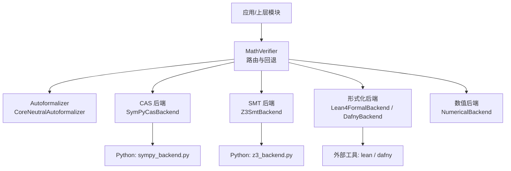
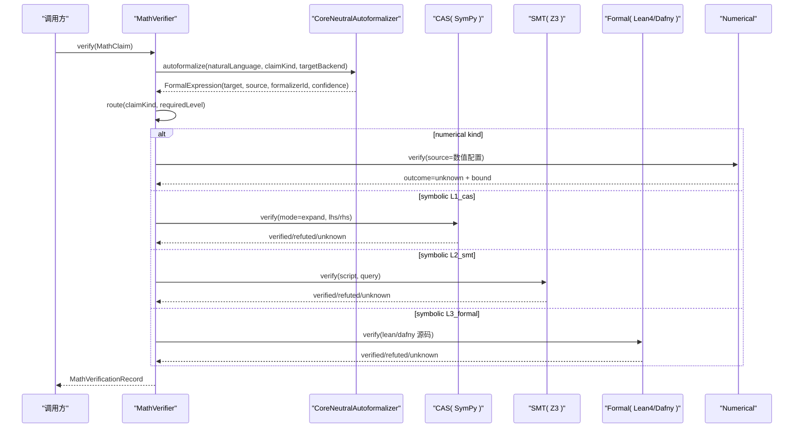
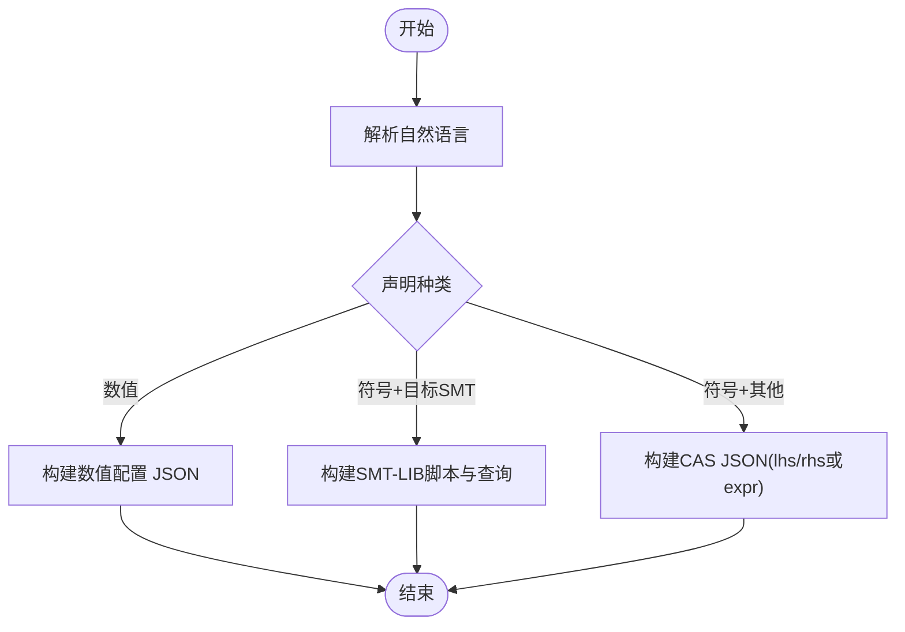
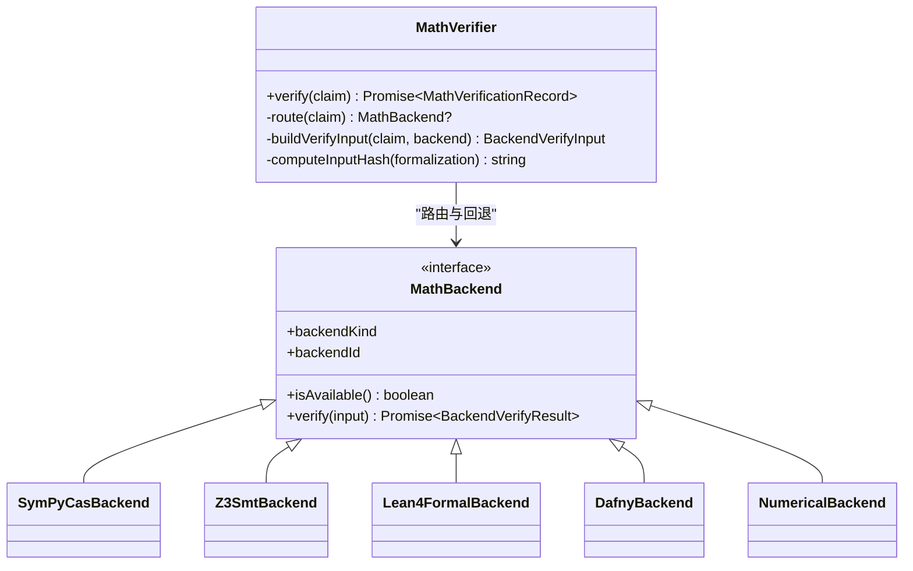
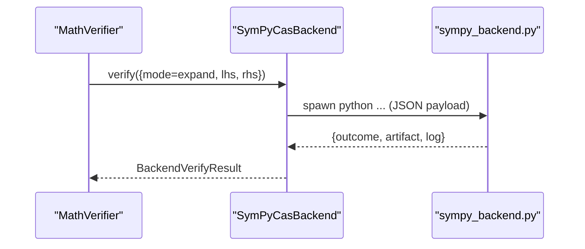
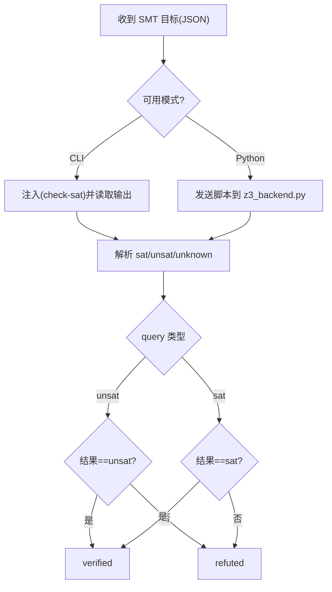
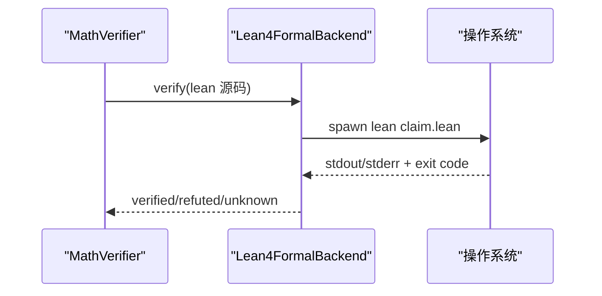
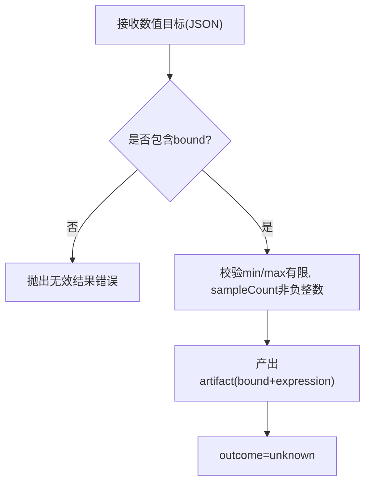
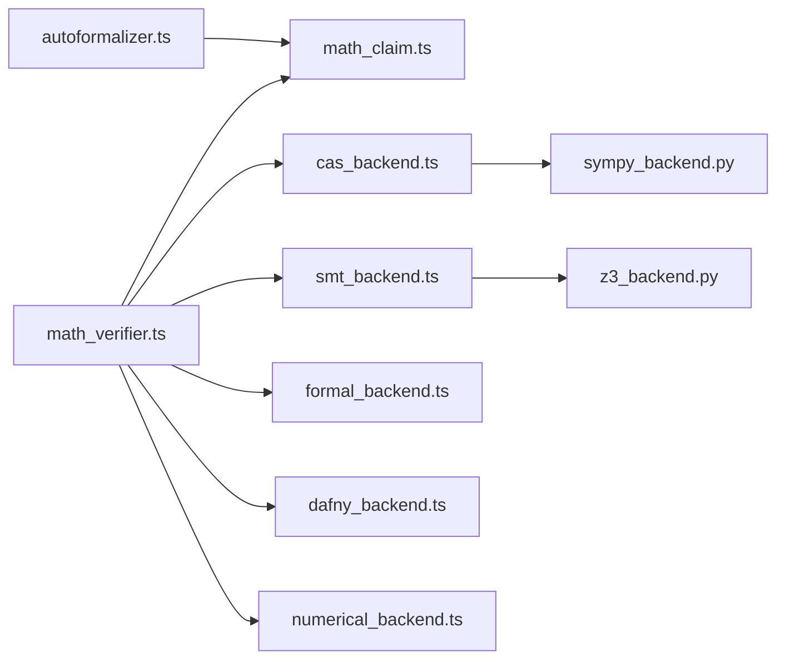

# 形式化验证

<cite>
**本文引用的文件**
- [src/math/index.ts](file://src/math/index.ts)
- [src/math/math_claim.ts](file://src/math/math_claim.ts)
- [src/math/math_verifier.ts](file://src/math/math_verifier.ts)
- [src/math/autoformalizer.ts](file://src/math/autoformalizer.ts)
- [src/math/cas_backend.ts](file://src/math/cas_backend.ts)
- [src/math/smt_backend.ts](file://src/math/smt_backend.ts)
- [src/math/formal_backend.ts](file://src/math/formal_backend.ts)
- [src/math/dafny_backend.ts](file://src/math/dafny_backend.ts)
- [src/math/numerical_backend.ts](file://src/math/numerical_backend.ts)
- [repro/math_backends/sympy_backend.py](file://repro/math_backends/sympy_backend.py)
- [repro/math_backends/z3_backend.py](file://repro/math_backends/z3_backend.py)
- [src/math/honesty_wall.ts](file://src/math/honesty_wall.ts)
</cite>

## 目录
1. [简介](#简介)
2. [项目结构](#项目结构)
3. [核心组件](#核心组件)
4. [架构总览](#架构总览)
5. [详细组件分析](#详细组件分析)
6. [依赖关系分析](#依赖关系分析)
7. [性能与配置调优](#性能与配置调优)
8. [故障排查指南](#故障排查指南)
9. [结论](#结论)
10. [附录：语法规范与语义定义](#附录：语法规范与语义定义)

## 简介
本技术文档围绕仓库中的“数学形式化验证”子系统，系统性说明其原理、实现与使用方式。内容涵盖：
- 自动形式化过程：将自然语言数学声明转换为机器可检查的形式化表达（SMT-LIB、Lean/Dafny 源码或数值实验配置）。
- 支持的后端：CAS（SymPy）、SMT（Z3）、形式化证明（Lean 4、Dafny）以及数值后端。
- 路由与降级：按声明类型与所需等级选择后端，并在外部依赖不可用时诚实降级为 unknown。
- 精度保证与完备性：明确各后端的判定性质（如 CAS expand 的可靠性、SMT 的完备性边界、形式化证明的可证性）。
- 配置选项与性能调优：超时、命令路径、版本覆盖、回退链等。
- 结果解读与证书：输出产物、编译日志、输入哈希与来源锚点，便于审计与复现。
- 示例与最佳实践：常见定理形式的自动形式化与验证流程建议。

## 项目结构
数学验证子系统位于 src/math 下，提供统一的入口 barrel，并暴露自动形式化器、后端适配器、路由器与证据记录能力。Python 侧的 CAS/SMT 脚本位于 repro/math_backends，作为独立子进程被调用。

图表来源
- [src/math/math_verifier.ts:78-99](file://src/math/math_verifier.ts#L78-L99)
- [src/math/autoformalizer.ts:56-66](file://src/math/autoformalizer.ts#L56-L66)
- [src/math/cas_backend.ts:47-64](file://src/math/cas_backend.ts#L47-L64)
- [src/math/smt_backend.ts:46-59](file://src/math/smt_backend.ts#L46-L59)
- [src/math/formal_backend.ts:33-44](file://src/math/formal_backend.ts#L33-L44)
- [src/math/dafny_backend.ts:32-43](file://src/math/dafny_backend.ts#L32-L43)
- [src/math/numerical_backend.ts:36-43](file://src/math/numerical_backend.ts#L36-L43)

章节来源
- [src/math/index.ts:1-42](file://src/math/index.ts#L1-L42)

## 核心组件
- 数学声明与类型契约：统一描述声明种类、验证等级、后端种类、形式化目标与验证记录。
- 自动形式化器：规则匹配将自然语言转为 SMT-LIB、Lean/Dafny 片段或数值配置 JSON。
- 验证路由器：根据声明种类与所需等级选择后端，并实现 E-fallback 回退链。
- 后端适配器：封装外部工具（SymPy、Z3、Lean、Dafny）的可用性检测、执行与结果映射。
- 数值后端：纯 TypeScript 实现，始终返回 unknown，强制记录数值边界。
- 诚信墙渲染：汇总验证结果、提示未满足等级与禁用后端。

章节来源
- [src/math/math_claim.ts:28-222](file://src/math/math_claim.ts#L28-L222)
- [src/math/math_verifier.ts:78-140](file://src/math/math_verifier.ts#L78-L140)
- [src/math/autoformalizer.ts:56-184](file://src/math/autoformalizer.ts#L56-L184)
- [src/math/cas_backend.ts:47-208](file://src/math/cas_backend.ts#L47-L208)
- [src/math/smt_backend.ts:46-299](file://src/math/smt_backend.ts#L46-L299)
- [src/math/formal_backend.ts:33-151](file://src/math/formal_backend.ts#L33-L151)
- [src/math/dafny_backend.ts:32-149](file://src/math/dafny_backend.ts#L32-L149)
- [src/math/numerical_backend.ts:36-96](file://src/math/numerical_backend.ts#L36-L96)
- [src/math/honesty_wall.ts:57-95](file://src/math/honesty_wall.ts#L57-L95)

## 架构总览
下图展示从自然语言到验证结果的端到端流程，包括自动形式化、路由、后端执行与结果聚合。

图表来源
- [src/math/math_verifier.ts:110-140](file://src/math/math_verifier.ts#L110-L140)
- [src/math/autoformalizer.ts:60-66](file://src/math/autoformalizer.ts#L60-L66)
- [src/math/cas_backend.ts:93-124](file://src/math/cas_backend.ts#L93-L124)
- [src/math/smt_backend.ts:81-130](file://src/math/smt_backend.ts#L81-L130)
- [src/math/formal_backend.ts:64-138](file://src/math/formal_backend.ts#L64-L138)
- [src/math/dafny_backend.ts:63-136](file://src/math/dafny_backend.ts#L63-L136)
- [src/math/numerical_backend.ts:45-95](file://src/math/numerical_backend.ts#L45-L95)

## 详细组件分析

### 自动形式化器（CoreNeutralAutoformalizer）
- 功能：基于规则匹配将自然语言声明转换为机器可读的形式化表达。
- 策略：
  - 代数恒等式/方程解：解析“X equals Y”或“X = Y”，生成 CAS JSON {lhs, rhs}。
  - 不等式：解析“less than/greater than”或“< />”，生成 {lhs, rhs, op}。
  - SMT：将等式断言包装为 (assert (= ...)) 并设置 query='unsat'。
  - 数值：解析区间 [a, b]，生成数值配置 JSON（bound.min/max、sampleCount、description）。
  - 无法识别时：置信度降低，触发高层对话层的降级提示。
- 目标语言映射：根据后端决定 target（lean4/dafny/smtlib），数值类以 smtlib 占位。

图表来源
- [src/math/autoformalizer.ts:68-147](file://src/math/autoformalizer.ts#L68-L147)

章节来源
- [src/math/autoformalizer.ts:56-184](file://src/math/autoformalizer.ts#L56-L184)

### 验证路由器（MathVerifier）
- 路由表：
  - 数值声明 → NumericalBackend（始终 unknown）。
  - 符号声明 L1_cas → CAS（SymPy，默认 expand 模式）。
  - 符号声明 L2_smt → SMT（Z3）。
  - 符号声明 L3_formal → Lean4 或 Dafny。
  - 符号声明 L4_human → 无自动后端，需人工关闭。
- E-fallback 回退链：当主后端不可用或诚实降级为 backend_disabled 时，按链尝试替代后端（例如 smt→cas；lean4→dafny）。
- 输入哈希：对规范化后的形式化对象计算跨语言一致的输入哈希，用于审计与复现。

图表来源
- [src/math/math_verifier.ts:78-387](file://src/math/math_verifier.ts#L78-L387)
- [src/math/math_claim.ts:414-445](file://src/math/math_claim.ts#L414-L445)

章节来源
- [src/math/math_verifier.ts:78-387](file://src/math/math_verifier.ts#L78-L387)

### CAS 后端（SymPy）
- 协议：通过 Python 子进程运行 sympy_backend.py，请求/响应均为 JSON。
- 模式：
  - expand：对多项式/结构恒等式进行展开比较，结果为 verified/refuted（可靠）。
  - simplify：启发式简化，结果永远 unknown，产物供人工审阅。
- 可用性：若 python/sympy 不可用，isAvailable=false，verify 返回 unknown + backend_disabled。

图表来源
- [src/math/cas_backend.ts:93-195](file://src/math/cas_backend.ts#L93-L195)
- [repro/math_backends/sympy_backend.py:37-125](file://repro/math_backends/sympy_backend.py#L37-L125)

章节来源
- [src/math/cas_backend.ts:1-208](file://src/math/cas_backend.ts#L1-L208)
- [repro/math_backends/sympy_backend.py:1-125](file://repro/math_backends/sympy_backend.py#L1-L125)

### SMT 后端（Z3）
- 协议：支持 CLI 模式（z3 -in）与 Python 模式（z3-solver），均通过 stdin/stdout JSON 通信。
- 查询：
  - query='unsat'：期望全称有效，Z3 返回 unsat → verified；sat → refuted。
  - query='sat'：期望可满足，Z3 返回 sat → verified；unsat → refuted。
- 可用性：优先检测 CLI z3，否则回退到 Python z3；均不可用则 disabled。

图表来源
- [src/math/smt_backend.ts:81-141](file://src/math/smt_backend.ts#L81-L141)
- [src/math/smt_backend.ts:170-271](file://src/math/smt_backend.ts#L170-L271)
- [repro/math_backends/z3_backend.py:26-69](file://repro/math_backends/z3_backend.py#L26-L69)

章节来源
- [src/math/smt_backend.ts:1-299](file://src/math/smt_backend.ts#L1-L299)
- [repro/math_backends/z3_backend.py:1-69](file://repro/math_backends/z3_backend.py#L1-L69)

### 形式化后端（Lean 4 / Dafny）
- Lean 4：
  - 将目标视为 Lean 源码片段，写入临时 .lean 文件并执行 lean。
  - 退出码 0 且无错误输出 → verified；包含 type mismatch/goals left → refuted；其他 → unknown。
  - 不可用 → backend_disabled。
- Dafny：
  - 将目标视为 Dafny 源码片段，执行 dafny verify。
  - 退出码 0 → verified；出现 verification error/assertion might not hold → refuted；其他 → unknown。
  - 不可用 → backend_disabled。

图表来源
- [src/math/formal_backend.ts:64-138](file://src/math/formal_backend.ts#L64-L138)
- [src/math/dafny_backend.ts:63-136](file://src/math/dafny_backend.ts#L63-L136)

章节来源
- [src/math/formal_backend.ts:1-151](file://src/math/formal_backend.ts#L1-L151)
- [src/math/dafny_backend.ts:1-149](file://src/math/dafny_backend.ts#L1-L149)

### 数值后端（Numerical）
- 特性：纯 TypeScript，无外部依赖，始终 available。
- 约束：必须提供数值边界 bound（min/max/sampleCount/description），否则抛出无效结果错误。
- 结果：始终 unknown，并将 bound 与表达式放入 outputArtifact 供人工审阅。

图表来源
- [src/math/numerical_backend.ts:45-95](file://src/math/numerical_backend.ts#L45-L95)

章节来源
- [src/math/numerical_backend.ts:1-96](file://src/math/numerical_backend.ts#L1-L96)

### 诚信墙与结果解读
- 汇总每条验证记录的 backendId、kind、outcome、inputHash 与日志摘要。
- 提示禁用后端、未达到所需等级、以及 requireFormalVerification=true 但未达到 L3_formal 的门控失败。

章节来源
- [src/math/honesty_wall.ts:57-95](file://src/math/honesty_wall.ts#L57-L95)

## 依赖关系分析
- 模块耦合：
  - math_verifier 依赖所有后端实现与类型契约。
  - autoformalizer 依赖类型契约与后端种类判断。
  - 各后端通过子进程与外部工具交互（python、z3、lean、dafny）。
- 外部依赖：
  - Python 环境（symPy、z3-solver）。
  - 系统 PATH 上的 z3、lean、dafny 二进制。
- 潜在循环：无直接循环依赖；通过接口 MathBackend 解耦。

图表来源
- [src/math/math_verifier.ts:27-50](file://src/math/math_verifier.ts#L27-L50)
- [src/math/autoformalizer.ts:21-27](file://src/math/autoformalizer.ts#L21-L27)
- [src/math/cas_backend.ts:14-24](file://src/math/cas_backend.ts#L14-L24)
- [src/math/smt_backend.ts:16-25](file://src/math/smt_backend.ts#L16-L25)

章节来源
- [src/math/math_verifier.ts:1-50](file://src/math/math_verifier.ts#L1-L50)
- [src/math/math_claim.ts:1-446](file://src/math/math_claim.ts#L1-L446)

## 性能与配置调优
- 超时控制：
  - CAS：默认 15000ms（可通过 timeoutMs 调整）。
  - SMT：默认 20000ms（可通过 timeoutMs 调整）。
  - Lean/Dafny：默认 30000ms（可通过 timeoutMs 调整）。
- 命令路径：
  - CAS：pythonCommand（默认 'python'）。
  - SMT：z3Command（默认 'z3'），pythonCommand（默认 'python'/'python3'）。
  - Lean：leanCommand（默认 'lean'）。
  - Dafny：dafnyCommand（默认 'dafny'）。
- 版本覆盖：
  - 可为各后端指定 versionOverride/sympyVersion，用于 backendId 指纹。
- 回退链：
  - 默认 smt→cas；lean4→dafny；可按需覆盖或关闭特定 key 的回退。
- 性能建议：
  - 合理设置超时以避免长时间阻塞。
  - 在批量验证时复用后端实例以减少启动开销。
  - 优先使用 expand 模式进行可靠判定；simplify 仅用于辅助。
  - 对于复杂 SMT 问题，考虑增加超时或拆分断言。

章节来源
- [src/math/cas_backend.ts:25-64](file://src/math/cas_backend.ts#L25-L64)
- [src/math/smt_backend.ts:27-59](file://src/math/smt_backend.ts#L27-L59)
- [src/math/formal_backend.ts:24-44](file://src/math/formal_backend.ts#L24-L44)
- [src/math/dafny_backend.ts:24-43](file://src/math/dafny_backend.ts#L24-L43)
- [src/math/math_verifier.ts:51-99](file://src/math/math_verifier.ts#L51-L99)

## 故障排查指南
- 后端不可用：
  - 现象：outcome='unknown' 且 compileLog='backend_disabled'。
  - 处理：安装对应依赖（python/sympy、z3、lean、dafny）或调整命令路径。
- 解析错误：
  - SMT：缺少 script 或 query 非法 → parse_error。
  - 数值：缺少 bound 或参数非法 → InvalidBackendResultError。
- 外部进程异常：
  - CAS/SMT/Lean/Dafny 子进程抛错 → compileLog 包含错误信息。
- 等级不满足：
  - 诚信墙会提示 achieved level 未达 required level，需提升验证等级或补充人工关闭。

章节来源
- [src/math/smt_backend.ts:87-106](file://src/math/smt_backend.ts#L87-L106)
- [src/math/numerical_backend.ts:62-78](file://src/math/numerical_backend.ts#L62-L78)
- [src/math/cas_backend.ts:113-123](file://src/math/cas_backend.ts#L113-L123)
- [src/math/formal_backend.ts:126-138](file://src/math/formal_backend.ts#L126-L138)
- [src/math/dafny_backend.ts:124-136](file://src/math/dafny_backend.ts#L124-L136)
- [src/math/honesty_wall.ts:73-85](file://src/math/honesty_wall.ts#L73-L85)

## 结论
该形式化验证子系统通过分层后端与严格的路由策略，实现了从自然语言到机器可检查表达的自动化转换与验证。其设计强调诚实降级与可审计性：在外部依赖缺失或不确定时返回 unknown，并通过输入哈希与来源锚点保障结果可追溯。不同后端具备明确的精度与完备性边界，适合在不同可信度需求下组合使用。

## 附录：语法规范与语义定义
- 声明种类（MathClaimKind）：
  - 符号类：algebraic_identity、equation_solution、calculus、inequality、dimensional_consistency、matrix_identity、statistic_identity、theorem。
  - 数值类：numerical_reproduction、statistical_inference、optimization_convergence、validated_numerics。
- 验证等级（VerificationLevel）：L1_cas < L2_smt < L3_formal < L4_human。
- 后端种类（BackendKind）：cas、smt、lean4、dafny、numerical。
- 形式化目标（FormalTarget）：lean4、dafny、smtlib。
- 形式化表达（FormalExpression）：
  - target：目标语言。
  - source：目标语言源码或数值配置 JSON。
  - formalizerId：形式化器标识。
  - confidence：自评估置信度（[0,1]）。
- 验证记录（MathVerificationRecord）：
  - 包含后端身份、结果、输入哈希、产物、日志、耗时与时间戳。
- 语义要点：
  - CAS expand 模式对多项式/结构恒等式提供可靠判定。
  - SMT 提供完备性更强的求解，但受限于 SMT-LIB 表达能力与求解器行为。
  - 形式化后端提供强语义保证，但依赖外部工具与用户编写的正确源码。
  - 数值后端不自我证明，始终 unknown，侧重边界记录与人工审阅。

章节来源
- [src/math/math_claim.ts:28-222](file://src/math/math_claim.ts#L28-L222)
- [src/math/math_claim.ts:252-327](file://src/math/math_claim.ts#L252-L327)
- [src/math/cas_backend.ts:1-20](file://src/math/cas_backend.ts#L1-L20)
- [src/math/smt_backend.ts:1-15](file://src/math/smt_backend.ts#L1-L15)
- [src/math/formal_backend.ts:1-14](file://src/math/formal_backend.ts#L1-L14)
- [src/math/numerical_backend.ts:1-13](file://src/math/numerical_backend.ts#L1-L13)