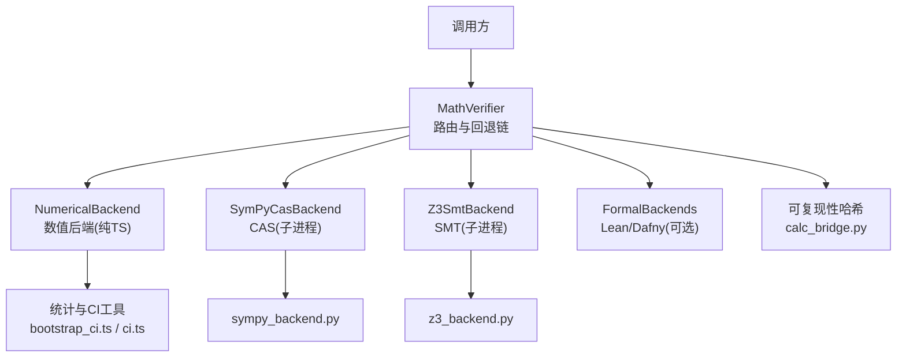
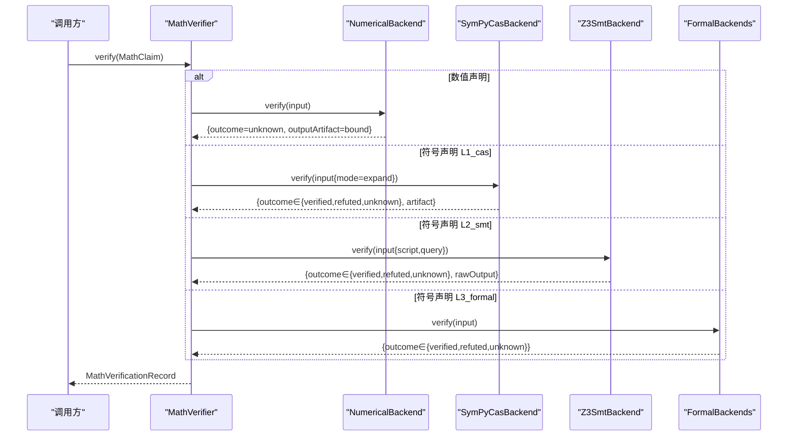
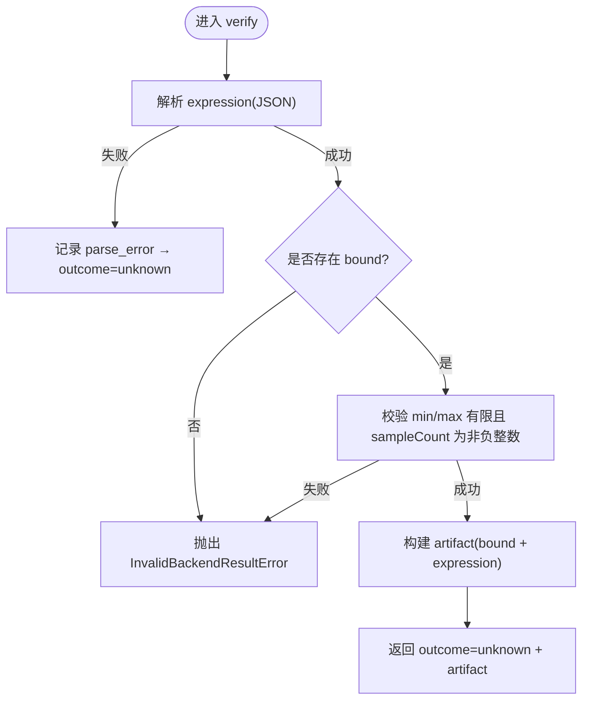
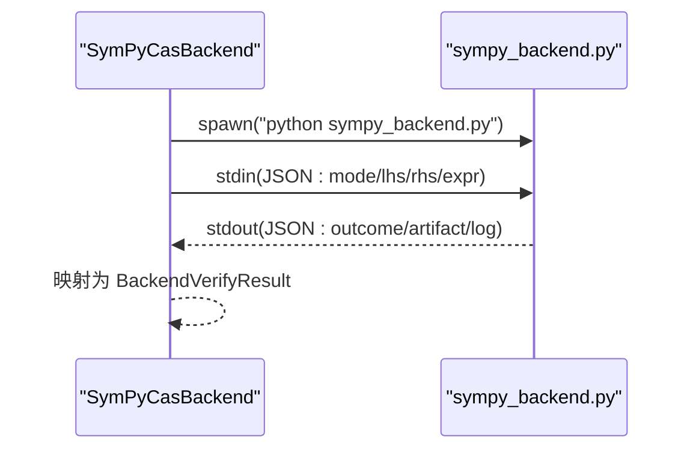
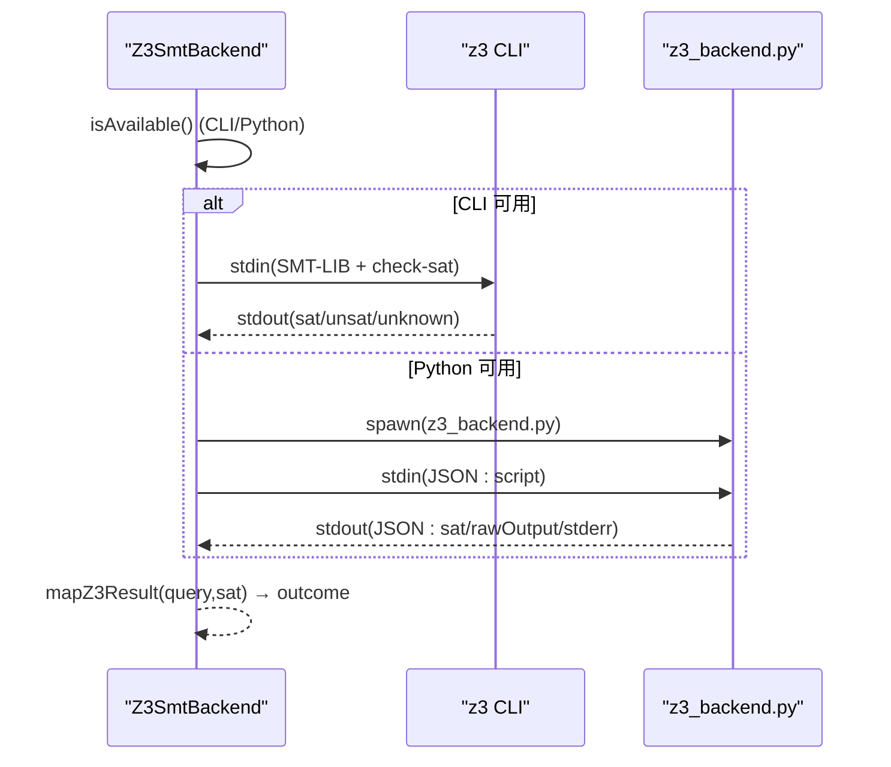
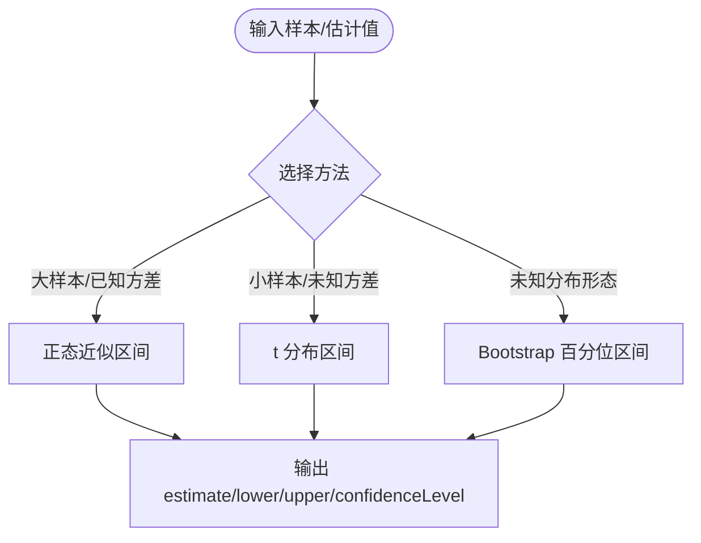
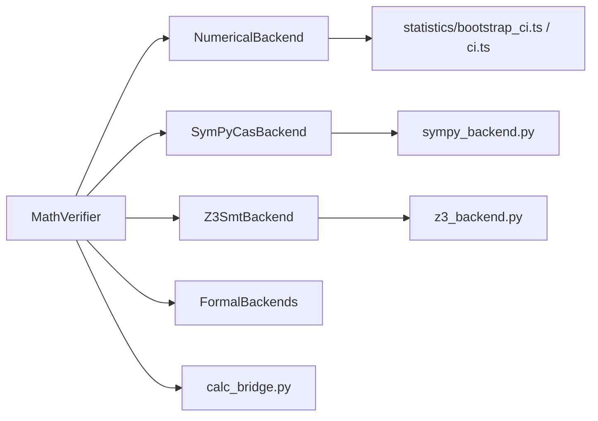

# 数值计算

<cite>
**本文引用的文件**
- [numerical_backend.ts](file://src/math/numerical_backend.ts)
- [math_claim.ts](file://src/math/math_claim.ts)
- [math_verifier.ts](file://src/math/math_verifier.ts)
- [cas_backend.ts](file://src/math/cas_backend.ts)
- [smt_backend.ts](file://src/math/smt_backend.ts)
- [formal_backend.ts](file://src/math/formal_backend.ts)
- [sympy_backend.py](file://repro/math_backends/sympy_backend.py)
- [z3_backend.py](file://repro/math_backends/z3_backend.py)
- [bootstrap_ci.ts](file://src/statistics/bootstrap_ci.ts)
- [ci.ts](file://src/statistics/ci.ts)
- [calc_bridge.py](file://repro/far_chain_repro/calc_bridge.py)
- [verdict_kernel_v2.py](file://repro/far_chain_repro/verdict_kernel_v2.py)
</cite>

## 目录
1. [简介](#简介)
2. [项目结构](#项目结构)
3. [核心组件](#核心组件)
4. [架构总览](#架构总览)
5. [详细组件分析](#详细组件分析)
6. [依赖关系分析](#依赖关系分析)
7. [性能与内存管理](#性能与内存管理)
8. [故障排查指南](#故障排查指南)
9. [结论](#结论)
10. [附录：示例与最佳实践](#附录示例与最佳实践)

## 简介
本技术文档聚焦于仓库中的“数值计算”能力，围绕数值验证算法的实现原理、支持的数值后端（SymPy、Z3）、精度控制与误差传播、符号与数值混合策略、数值稳定性与条件数评估、数值积分与微分方程求解、优化算法、性能优化与内存管理、与科学计算库的集成接口和数据交换格式，以及置信度评估与不确定性量化进行系统化说明。文档同时给出常见数值问题的计算示例与调试技巧，帮助读者在工程实践中正确、稳定地使用系统提供的数学验证与统计推断能力。

## 项目结构
数值计算相关代码主要分布在以下模块：
- 数学验证层（TypeScript）：提供统一的验证路由与后端抽象，包括数值后端、CAS（SymPy）、SMT（Z3）、形式化验证（Lean/Dafny）。
- Python 后端脚本：SymPy 与 Z3 的具体实现，通过子进程与 TS 侧交互。
- 统计与置信区间：提供非参数 Bootstrap 与经典置信区间工具，用于不确定性量化。
- 可复现性哈希与判定核：确保浮点运算与随机性可控，保障跨语言一致性。

图表来源
- [math_verifier.ts:76-140](file://src/math/math_verifier.ts#L76-L140)
- [cas_backend.ts:24-124](file://src/math/cas_backend.ts#L24-L124)
- [smt_backend.ts:25-130](file://src/math/smt_backend.ts#L25-L130)
- [numerical_backend.ts:36-95](file://src/math/numerical_backend.ts#L36-L95)
- [sympy_backend.py:37-124](file://repro/math_backends/sympy_backend.py#L37-L124)
- [z3_backend.py:26-68](file://repro/math_backends/z3_backend.py#L26-L68)
- [bootstrap_ci.ts:74-144](file://src/statistics/bootstrap_ci.ts#L74-L144)
- [ci.ts:21-98](file://src/statistics/ci.ts#L21-L98)
- [calc_bridge.py:68-127](file://repro/far_chain_repro/calc_bridge.py#L68-L127)

章节来源
- [math_verifier.ts:76-140](file://src/math/math_verifier.ts#L76-L140)
- [math_claim.ts:26-183](file://src/math/math_claim.ts#L26-L183)

## 核心组件
- 数值后端（NumericalBackend）：纯 TypeScript，始终返回 outcome='unknown'，强制要求输出 artifact 中包含数值边界（min/max/sampleCount/description），体现“非自证”的设计约束。
- CAS 后端（SymPyCasBackend）：通过子进程调用 SymPy，支持 expand（声学子集）与 simplify（启发式），expand 模式对多项式恒等式具有可判定的结构性相等比较。
- SMT 后端（Z3SmtBackend）：通过子进程调用 Z3 CLI 或 Python 绑定，将断言以 SMT-LIB 提交，根据查询目标（unsat/sat）映射为 verified/refuted/unknown。
- 形式化后端（Lean/Dafny）：当可用时执行编译/类型检查，成功则 verified，否则 refuted 或 unknown。
- 统计与置信区间：提供 t 分布、Welch 校正、Bootstrap 百分位区间等工具，用于不确定性量化与置信度评估。
- 可复现性哈希：通过固定 BLAS 线程数与确定性序列化，保证浮点累加顺序一致，从而获得跨运行一致的 repro_hash。

章节来源
- [numerical_backend.ts:36-95](file://src/math/numerical_backend.ts#L36-L95)
- [cas_backend.ts:47-124](file://src/math/cas_backend.ts#L47-L124)
- [smt_backend.ts:46-130](file://src/math/smt_backend.ts#L46-L130)
- [formal_backend.ts:33-151](file://src/math/formal_backend.ts#L33-L151)
- [bootstrap_ci.ts:74-144](file://src/statistics/bootstrap_ci.ts#L74-L144)
- [ci.ts:21-98](file://src/statistics/ci.ts#L21-L98)
- [calc_bridge.py:68-127](file://repro/far_chain_repro/calc_bridge.py#L68-L127)

## 架构总览
数值验证由 MathVerifier 统一路由，依据声明种类（数值/符号）与所需等级（L1_cas/L2_smt/L3_formal/L4_human）选择后端；数值声明始终走 NumericalBackend，符号声明按等级路由到 CAS/SMT/Formal。所有后端遵循统一输入输出契约，便于证据记录与审计。

图表来源
- [math_verifier.ts:110-140](file://src/math/math_verifier.ts#L110-L140)
- [cas_backend.ts:93-124](file://src/math/cas_backend.ts#L93-L124)
- [smt_backend.ts:81-130](file://src/math/smt_backend.ts#L81-L130)
- [formal_backend.ts:64-151](file://src/math/formal_backend.ts#L64-L151)
- [numerical_backend.ts:45-95](file://src/math/numerical_backend.ts#L45-L95)

## 详细组件分析

### 数值后端（NumericalBackend）
- 设计原则：非自证（non-self-proving），永远返回 outcome='unknown'，禁止声称 verified/refuted。
- 输入契约：expression 为 JSON，必须包含 bound（min/max/sampleCount/description），否则抛出无效结果错误。
- 输出契约：outputArtifact 必须包含 bound 与表达式文本（可选），compileLog 记录“按设计未知”。
- 适用场景：数值重现、统计推断、优化收敛、已验证数值等数值类声明的证据包装与人类审阅。

图表来源
- [numerical_backend.ts:45-95](file://src/math/numerical_backend.ts#L45-L95)

章节来源
- [numerical_backend.ts:36-95](file://src/math/numerical_backend.ts#L36-L95)
- [math_claim.ts:224-273](file://src/math/math_claim.ts#L224-L273)

### CAS 后端（SymPyCasBackend）
- 子进程协议：请求 JSON（mode/lhs/rhs/expr），响应 JSON（outcome/artifact/log）。
- 语义：
  - expand：展开后结构相等 → verified；不相等 → refuted（对多项式/结构恒等式具声阳性）。
  - simplify：启发式，仅返回 unknown 与简化产物供人工审查。
- 可用性检测：首次 isAvailable() 通过 python -c "import sympy; print(version)" 探测并缓存。
- 错误处理：任何异常均降级为 unknown，并记录诊断日志。

图表来源
- [cas_backend.ts:141-195](file://src/math/cas_backend.ts#L141-L195)
- [sympy_backend.py:37-124](file://repro/math_backends/sympy_backend.py#L37-L124)

章节来源
- [cas_backend.ts:47-124](file://src/math/cas_backend.ts#L47-L124)
- [sympy_backend.py:37-124](file://repro/math_backends/sympy_backend.py#L37-L124)

### SMT 后端（Z3SmtBackend）
- 双模式：优先尝试 z3 CLI（-in），回退到 Python 绑定（z3-solver）。
- 协议：target 为 JSON（script=SMT-LIB 断言，query=unsat/sat），根据 query 将 sat/unsat/unknown 映射为 verified/refuted/unknown。
- 可用性检测：分别探测 CLI 与 Python 环境，缓存模式。
- 错误处理：解析/执行异常均返回 unknown，并保留 stderr 信息。

图表来源
- [smt_backend.ts:170-271](file://src/math/smt_backend.ts#L170-L271)
- [z3_backend.py:26-68](file://repro/math_backends/z3_backend.py#L26-L68)

章节来源
- [smt_backend.ts:46-130](file://src/math/smt_backend.ts#L46-L130)
- [z3_backend.py:26-68](file://repro/math_backends/z3_backend.py#L26-L68)

### 形式化后端（Lean/Dafny）
- Lean4：写入临时 .lean 文件并执行 lean，无错误输出 → verified；含 type mismatch/goals left → refuted；其他 → unknown。
- Dafny：作为 Lean4 不可用时的同等级替代（默认回退链中配置）。
- 可用性：不在 PATH 时降级为 backend_disabled。

章节来源
- [formal_backend.ts:33-151](file://src/math/formal_backend.ts#L33-L151)
- [math_verifier.ts:68-75](file://src/math/math_verifier.ts#L68-L75)

### 统计与置信区间（不确定性量化）
- 经典区间：正态近似、t 分布均值区间、Welch 两样本均值差区间、Wilson 比例区间。
- Bootstrap 百分位区间：基于种子 RNG（mulberry32）的非参数重抽样，适用于任意分布假设缺失的场景。
- 用途：为数值结果提供置信度评估与不确定性范围，支撑“置信度评估与不确定性量化”的目标。

图表来源
- [ci.ts:21-98](file://src/statistics/ci.ts#L21-L98)
- [bootstrap_ci.ts:74-144](file://src/statistics/bootstrap_ci.ts#L74-L144)

章节来源
- [ci.ts:21-98](file://src/statistics/ci.ts#L21-L98)
- [bootstrap_ci.ts:74-144](file://src/statistics/bootstrap_ci.ts#L74-L144)

### 可复现性与数值稳定性
- 确定性 BLAS：通过 threadpoolctl 限制 BLAS 线程数为 1，消除并行浮点累加序差异，确保 repro_hash 跨运行一致。
- 七分量哈希：模型快照 + 活跃模型ID排序 + 计算规格 + seed + nthread + 代码哈希 + 环境哈希，构成强约束的可复现标识。
- 数值稳定性：使用 t 分布与 Welch 校正避免小样本下的覆盖不足；Bootstrap 提供稳健的不确定性估计。

章节来源
- [calc_bridge.py:68-127](file://repro/far_chain_repro/calc_bridge.py#L68-L127)
- [ci.ts:61-98](file://src/statistics/ci.ts#L61-L98)
- [bootstrap_ci.ts:74-144](file://src/statistics/bootstrap_ci.ts#L74-L144)

### 判定核与阈值容差
- 五值判定核（verdict_kernel_v2.py）：定义 R0-R9 级联规则，结合统计报告与范围报告得出 CONFIRMED/REFUTED/INCONCLUSIVE/DEGRADED_SCOPE/UNTESTED。
- 浮点容差：使用 VERDICT_FLOAT_TOLERANCE = 1e-7 进行 p 值与阈值的比较，缓解浮点误差影响。

章节来源
- [verdict_kernel_v2.py:41-289](file://repro/far_chain_repro/verdict_kernel_v2.py#L41-L289)

## 依赖关系分析
- 路由依赖：MathVerifier 依赖各后端实现与回退链配置；数值声明不进入符号后端，防止领域混淆。
- 后端耦合：CAS/SMT/Formal 通过子进程与外部工具耦合，具备“诚实降级”机制（不可用时返回 unknown + backend_disabled）。
- 统计依赖：置信区间函数依赖 t 分布与正态分位数；Bootstrap 依赖确定性 RNG。
- 可复现性依赖：calc_bridge 依赖 threadpoolctl 与 canonical_json，确保浮点与序列化一致性。

图表来源
- [math_verifier.ts:76-140](file://src/math/math_verifier.ts#L76-L140)
- [cas_backend.ts:24-124](file://src/math/cas_backend.ts#L24-L124)
- [smt_backend.ts:25-130](file://src/math/smt_backend.ts#L25-L130)
- [numerical_backend.ts:36-95](file://src/math/numerical_backend.ts#L36-L95)
- [bootstrap_ci.ts:74-144](file://src/statistics/bootstrap_ci.ts#L74-L144)
- [ci.ts:21-98](file://src/statistics/ci.ts#L21-L98)
- [calc_bridge.py:68-127](file://repro/far_chain_repro/calc_bridge.py#L68-L127)

章节来源
- [math_verifier.ts:76-140](file://src/math/math_verifier.ts#L76-L140)
- [math_claim.ts:132-183](file://src/math/math_claim.ts#L132-L183)

## 性能与内存管理
- 子进程开销：CAS/SMT/Formal 每次 verify 可能启动子进程，建议批量任务复用连接或降低并发以避免频繁 fork/exec。
- 超时与降级：所有后端均设置超时；不可用或异常时返回 unknown，避免阻塞主流程。
- 内存占用：
  - SymPy 大型表达式展开可能消耗较多内存，建议在 CAS 模式下优先使用 expand 而非复杂 simplify。
  - Z3 大规模断言需关注内存与求解时间，必要时拆分问题或使用增量求解。
  - Bootstrap 迭代次数越大，内存与时间越高；默认 9999 次在多数场景下平衡精度与性能。
- 可复现性代价：限制 BLAS 线程数为 1 会牺牲并行加速，但换来跨运行一致性；若需性能优先，应显式声明非确定性路径并在审计中记录。

[本节为通用指导，无需特定文件引用]

## 故障排查指南
- 数值后端报错：
  - 现象：parse_error 或 InvalidBackendResultError。
  - 排查：确认 expression 为合法 JSON 且包含 bound（min/max/sampleCount/description），min/max 为有限数，sampleCount 为非负整数。
  - 参考：[numerical_backend.ts:45-95](file://src/math/numerical_backend.ts#L45-L95)
- CAS 不可用：
  - 现象：backend_disabled。
  - 排查：检查 python 与 sympy 是否安装；查看 compileLog 中的诊断信息。
  - 参考：[cas_backend.ts:66-91](file://src/math/cas_backend.ts#L66-L91)
- SMT 不可用：
  - 现象：backend_disabled 或 smt_parse_error。
  - 排查：检查 z3 CLI 或 Python z3-solver 是否可用；确认 script 为有效 SMT-LIB；查看 stderr。
  - 参考：[smt_backend.ts:62-79](file://src/math/smt_backend.ts#L62-L79), [smt_backend.ts:87-106](file://src/math/smt_backend.ts#L87-L106)
- 形式化后端不可用：
  - 现象：backend_disabled。
  - 排查：检查 lean/dafny 是否在 PATH；查看 compileLog。
  - 参考：[formal_backend.ts:46-62](file://src/math/formal_backend.ts#L46-L62)
- 判定核阈值敏感：
  - 现象：p 值接近 alpha 导致结论不稳定。
  - 排查：使用容差比较（1e-7）；考虑效应量与置信区间宽度；必要时增加样本量或调整多重检验校正。
  - 参考：[verdict_kernel_v2.py:33-38](file://repro/far_chain_repro/verdict_kernel_v2.py#L33-L38)

章节来源
- [numerical_backend.ts:45-95](file://src/math/numerical_backend.ts#L45-L95)
- [cas_backend.ts:66-91](file://src/math/cas_backend.ts#L66-L91)
- [smt_backend.ts:62-106](file://src/math/smt_backend.ts#L62-L106)
- [formal_backend.ts:46-62](file://src/math/formal_backend.ts#L46-L62)
- [verdict_kernel_v2.py:33-38](file://repro/far_chain_repro/verdict_kernel_v2.py#L33-L38)

## 结论
本系统的数值计算能力以“非自证”为核心原则，通过数值后端记录边界与样本信息，配合符号后端（CAS/SMT/Formal）提供更强证明力；统计工具提供不确定性量化与置信度评估；可复现性机制确保跨语言与跨运行的一致性。在实际工程中，应根据问题规模与精度需求选择合适的后端与方法，并结合回退链与降级策略保证鲁棒性。

[本节为总结，无需特定文件引用]

## 附录：示例与最佳实践

### 支持的数值后端与适用场景
- SymPy（CAS）：适合多项式恒等式与代数表达式的结构化验证；expand 模式对多项式恒等式具声阳性。
- Z3（SMT）：适合逻辑与约束满足问题；可将数值不等式/等式编码为 SMT-LIB 断言进行判定。
- 数值后端：适合需要记录数值边界与样本信息的场景，如实验重现、统计推断与优化收敛验证。

章节来源
- [cas_backend.ts:93-124](file://src/math/cas_backend.ts#L93-L124)
- [smt_backend.ts:81-130](file://src/math/smt_backend.ts#L81-L130)
- [numerical_backend.ts:45-95](file://src/math/numerical_backend.ts#L45-L95)

### 精度控制与误差传播
- 使用 t 分布与 Welch 校正处理小样本与异方差，避免覆盖不足。
- 使用 Bootstrap 百分位区间进行非参数不确定性估计，减少分布假设带来的偏差。
- 在判定核中使用容差比较，缓解浮点误差导致的误判。

章节来源
- [ci.ts:61-98](file://src/statistics/ci.ts#L61-L98)
- [bootstrap_ci.ts:74-144](file://src/statistics/bootstrap_ci.ts#L74-L144)
- [verdict_kernel_v2.py:33-38](file://repro/far_chain_repro/verdict_kernel_v2.py#L33-L38)

### 符号与数值混合策略
- 数值声明走 NumericalBackend，记录边界与样本；符号声明走 CAS/SMT/Formal，提供更强证明。
- 通过 MathVerifier 的路由表与回退链，自动选择合适后端并在不可用时降级。

章节来源
- [math_verifier.ts:76-140](file://src/math/math_verifier.ts#L76-L140)
- [math_claim.ts:26-183](file://src/math/math_claim.ts#L26-L183)

### 数值稳定性分析与条件数评估
- 在小样本与异方差场景优先使用 t 分布与 Welch 校正，提升区间覆盖的可靠性。
- 对于病态问题（如高度共线性或极端尺度），建议标准化数据、正则化或采用更稳健的估计方法（例如稳健回归、缩估计）。
- 使用 Bootstrap 评估估计量的变异性，辅助判断条件数过高的风险。

[本节为通用指导，无需特定文件引用]

### 数值积分、微分方程求解与优化算法
- 当前仓库未直接提供通用数值积分、ODE 求解器或优化器的实现；可通过以下方式扩展：
  - 将问题编码为 SMT-LIB 断言（例如约束优化、可行性问题）交由 Z3 判定。
  - 使用 SymPy 进行符号推导与简化，再转换为数值计算。
  - 在统计模块基础上，封装自定义数值方法（如 Simpson 积分、Runge-Kutta 求解、梯度下降），并通过 NumericalBackend 记录边界与样本信息。
- 注意：新增数值方法需遵循“非自证”原则，输出 artifact 包含边界与不确定性描述。

[本节为通用指导，无需特定文件引用]

### 性能优化与内存管理
- 子进程复用：尽量复用 Python 解释器或 Z3 会话以减少 fork/exec 开销。
- 超时与降级：合理设置 timeoutMs，避免长时间阻塞；不可用时降级为 unknown。
- 内存控制：限制 SymPy 表达式复杂度；Z3 断言拆分；Bootstrap 迭代次数按需调整。
- 可复现性权衡：如需更高性能，可在审计中显式声明非确定性路径（nthread>1），但需记录风险。

章节来源
- [cas_backend.ts:24-33](file://src/math/cas_backend.ts#L24-L33)
- [smt_backend.ts:27-32](file://src/math/smt_backend.ts#L27-L32)
- [bootstrap_ci.ts:55-63](file://src/statistics/bootstrap_ci.ts#L55-L63)
- [calc_bridge.py:68-86](file://repro/far_chain_repro/calc_bridge.py#L68-L86)

### 与科学计算库的集成接口与数据交换格式
- 子进程协议：
  - SymPy：stdin/stdout JSON（mode/lhs/rhs/expr → outcome/artifact/log）。
  - Z3：stdin/stdout JSON（script → sat/rawOutput/stderr）。
- 统计接口：
  - 置信区间函数返回标准对象（estimate/lower/upper/confidenceLevel/standardError）。
  - Bootstrap 返回 estimate/lower/upper/confidenceLevel/iterations/seed。
- 可复现性：
  - 七分量哈希确保计算环境与输入一致；canonical_json 保证序列化一致性。

章节来源
- [sympy_backend.py:37-124](file://repro/math_backends/sympy_backend.py#L37-L124)
- [z3_backend.py:26-68](file://repro/math_backends/z3_backend.py#L26-L68)
- [ci.ts:21-98](file://src/statistics/ci.ts#L21-L98)
- [bootstrap_ci.ts:74-144](file://src/statistics/bootstrap_ci.ts#L74-L144)
- [calc_bridge.py:104-127](file://repro/far_chain_repro/calc_bridge.py#L104-L127)

### 置信度评估与不确定性量化
- 使用 t 分布与 Welch 校正提供保守区间估计。
- 使用 Bootstrap 百分位区间进行非参数不确定性估计。
- 在判定核中使用容差比较与效应量评估，综合判断结论强度。

章节来源
- [ci.ts:61-98](file://src/statistics/ci.ts#L61-L98)
- [bootstrap_ci.ts:74-144](file://src/statistics/bootstrap_ci.ts#L74-L144)
- [verdict_kernel_v2.py:214-289](file://repro/far_chain_repro/verdict_kernel_v2.py#L214-L289)

### 常见数值问题示例与调试技巧
- 示例：
  - 均值置信区间：使用 meanConfidenceIntervalT（小样本）或 bootstrapMeanPercentileCi（未知分布）。
  - 两样本均值差：使用 differenceInMeansConfidenceIntervalWelch（异方差）。
  - 比例区间：使用 wilsonScoreInterval（小样本或极端比例）。
- 调试技巧：
  - 检查输入数据的有限性与有效性（NaN/Inf/空数组）。
  - 逐步缩小问题规模，观察区间宽度变化。
  - 对比不同方法（t 分布 vs Bootstrap）的结果一致性。
  - 利用 compileLog 与 stderr 定位子进程错误。

章节来源
- [ci.ts:21-98](file://src/statistics/ci.ts#L21-L98)
- [bootstrap_ci.ts:74-144](file://src/statistics/bootstrap_ci.ts#L74-L144)
- [smt_backend.ts:87-106](file://src/math/smt_backend.ts#L87-L106)