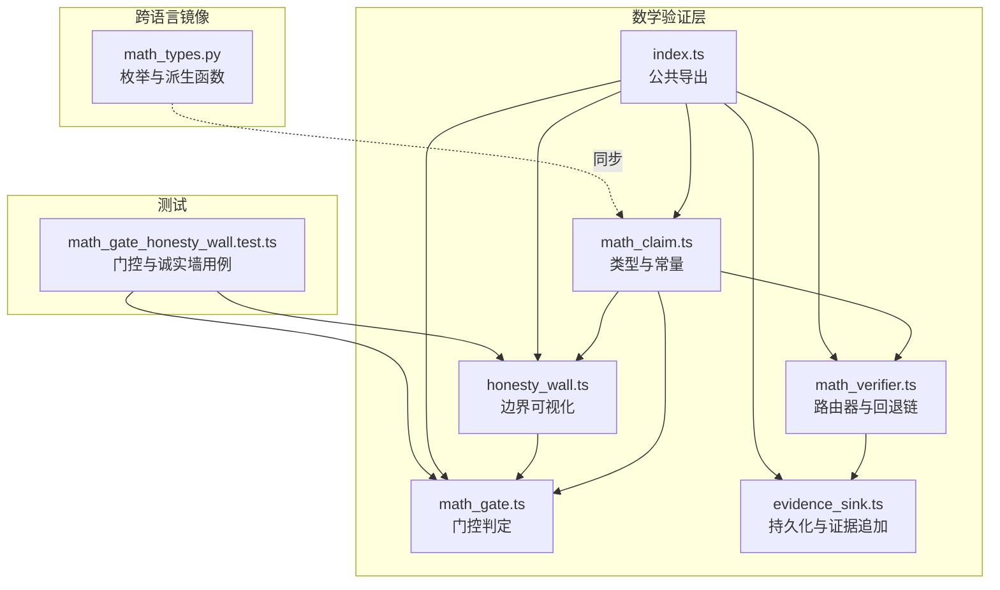
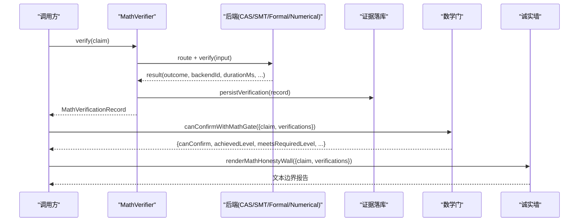
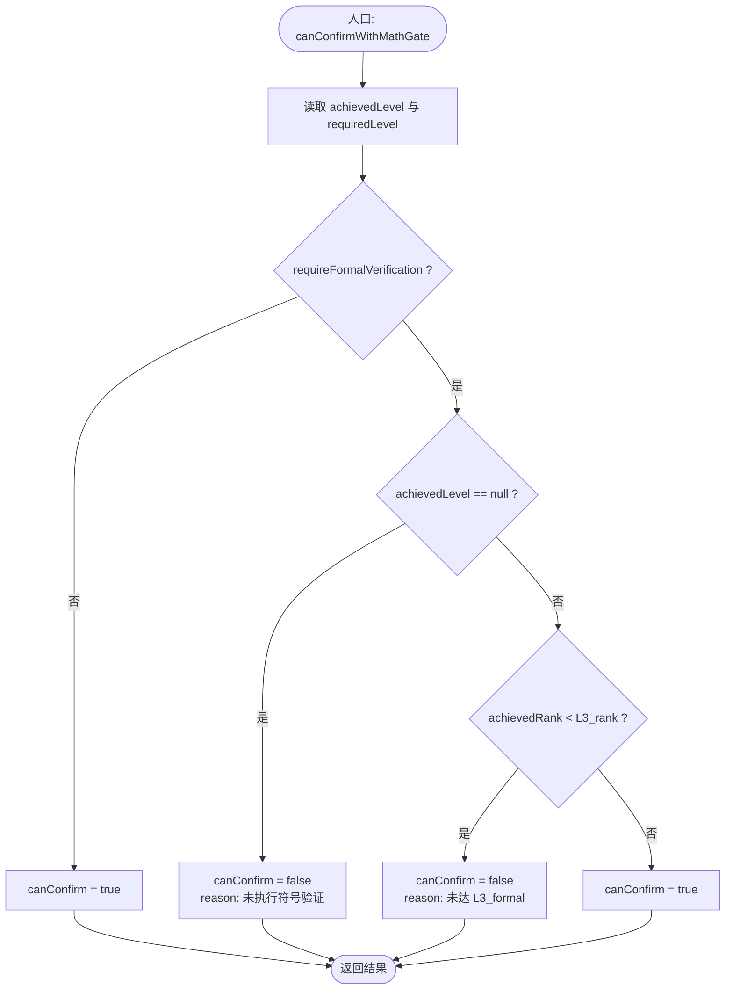
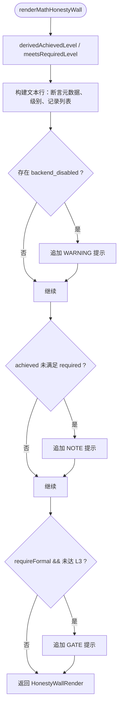
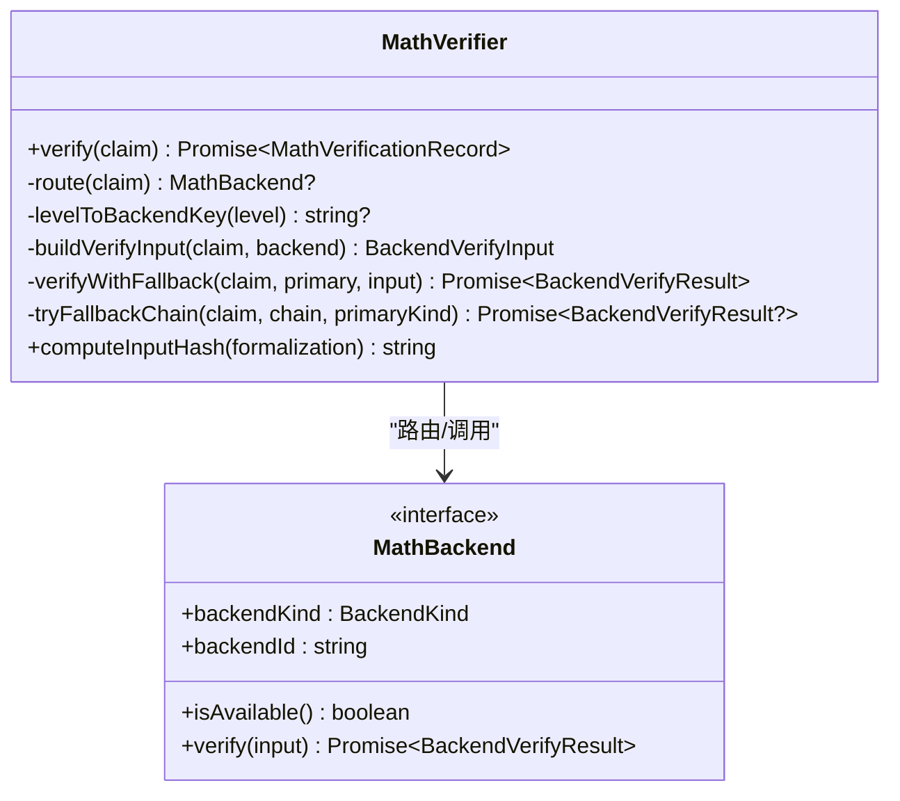
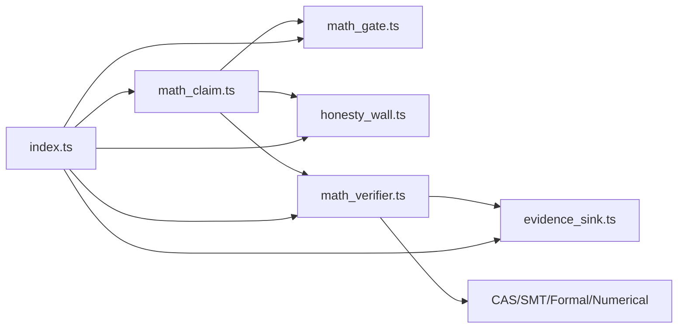

# 数学门控集成

<cite>
**本文引用的文件**
- [src/math/math_gate.ts](file://src/math/math_gate.ts)
- [src/math/honesty_wall.ts](file://src/math/honesty_wall.ts)
- [src/math/math_verifier.ts](file://src/math/math_verifier.ts)
- [src/math/math_claim.ts](file://src/math/math_claim.ts)
- [src/math/index.ts](file://src/math/index.ts)
- [src/math/evidence_sink.ts](file://src/math/evidence_sink.ts)
- [repro/far_chain_repro/math_types.py](file://repro/far_chain_repro/math_types.py)
- [tests/math/math_gate_honesty_wall.test.ts](file://tests/math/math_gate_honesty_wall.test.ts)
</cite>

## 目录
1. [简介](#简介)
2. [项目结构](#项目结构)
3. [核心组件](#核心组件)
4. [架构总览](#架构总览)
5. [详细组件分析](#详细组件分析)
6. [依赖关系分析](#依赖关系分析)
7. [性能考量](#性能考量)
8. [故障排查指南](#故障排查指南)
9. [结论](#结论)
10. [附录](#附录)

## 简介
本技术文档围绕“数学门控集成”展开，说明数学验证如何嵌入到整体验证流程中，并重点阐述以下主题：
- 数学门的概念与作用机制：在要求形式化验证时，强制未达标的断言进入“未测试”状态。
- 诚实墙渲染与验证边界可视化：以可读文本呈现需求级别、达成级别、后端指纹与结果。
- 数学验证结果对整体裁决的影响权重：通过门控开关控制是否将数学结果作为阻断条件。
- 与其他验证组件的协作模式：与证据日志、持久化存储、裁决内核等模块的衔接点。
- 触发条件与阈值配置：基于声明中的 requiredLevel 与 requireFormalVerification 决定门控行为。
- 状态管理与生命周期控制：从断言创建、形式化、路由到多后端执行、降级与落库。
- 失败时的降级策略与错误处理：后端不可用时的诚实降级与回退链。
- 性能监控与指标收集：时长、后端指纹、输入哈希等元数据用于可观测性。
- 配置模板与最佳实践：默认回退链、领域隔离、跨语言一致性等。
- 集成测试与验证示例：覆盖门控开启/关闭、级别不达标、禁用后端等场景。

## 项目结构
数学验证子系统位于 src/math，提供类型契约、路由器、后端实现、门控与诚实墙渲染、证据落库等能力；Python 镜像 repro/far_chain_repro/math_types.py 保证跨语言枚举一致；测试用例 tests/math 覆盖门控与诚实墙行为。

图表来源
- [src/math/math_claim.ts:1-446](file://src/math/math_claim.ts#L1-L446)
- [src/math/math_verifier.ts:1-387](file://src/math/math_verifier.ts#L1-L387)
- [src/math/honesty_wall.ts:1-96](file://src/math/honesty_wall.ts#L1-L96)
- [src/math/math_gate.ts:1-101](file://src/math/math_gate.ts#L1-L101)
- [src/math/evidence_sink.ts:1-208](file://src/math/evidence_sink.ts#L1-L208)
- [repro/far_chain_repro/math_types.py:1-167](file://repro/far_chain_repro/math_types.py#L1-L167)
- [tests/math/math_gate_honesty_wall.test.ts:1-188](file://tests/math/math_gate_honesty_wall.test.ts#L1-L188)

章节来源
- [src/math/index.ts:1-42](file://src/math/index.ts#L1-L42)

## 核心组件
- 类型与常量（math_claim.ts）：定义断言种类、验证等级、后端种类、形式化目标、断言与记录结构，以及派生函数 derivedAchievedLevel、meetsRequiredLevel 和校验 validateMathClaim。
- 验证路由器（math_verifier.ts）：根据 claimKind 与 requiredLevel 路由到 CAS/SMT/Formal/Numerical 后端，并提供 E-fallback 回退链与输入哈希计算。
- 门控（math_gate.ts）：当 requireFormalVerification=true 且未达到 L3_formal 时，阻止确认（canConfirm=false），并给出 forcedUntestedReason。
- 诚实墙（honesty_wall.ts）：输出需求级别 vs 达成级别、各后端指纹与结果、是否满足要求、是否存在禁用后端等可读信息。
- 证据落库（evidence_sink.ts）：将 MathClaim 与 MathVerificationRecord 持久化，并支持追加到共享证据日志。
- 公共导出（index.ts）：统一对外暴露类型、类与函数。

章节来源
- [src/math/math_claim.ts:1-446](file://src/math/math_claim.ts#L1-L446)
- [src/math/math_verifier.ts:1-387](file://src/math/math_verifier.ts#L1-L387)
- [src/math/math_gate.ts:1-101](file://src/math/math_gate.ts#L1-L101)
- [src/math/honesty_wall.ts:1-96](file://src/math/honesty_wall.ts#L1-L96)
- [src/math/evidence_sink.ts:1-208](file://src/math/evidence_sink.ts#L1-L208)

## 架构总览
数学验证层以“声明驱动”的方式工作：调用方构造 MathClaim，交由 MathVerifier 路由到对应后端执行；结果写入证据系统并可被门控与诚实墙消费；门控依据 requireFormalVerification 与 achievedLevel 决定是否放行。

图表来源
- [src/math/math_verifier.ts:100-258](file://src/math/math_verifier.ts#L100-L258)
- [src/math/evidence_sink.ts:120-161](file://src/math/evidence_sink.ts#L120-L161)
- [src/math/math_gate.ts:54-100](file://src/math/math_gate.ts#L54-L100)
- [src/math/honesty_wall.ts:38-95](file://src/math/honesty_wall.ts#L38-L95)

## 详细组件分析

### 数学门（math_gate.ts）
- 作用：在 requireFormalVerification=true 时，若 achievedLevel < L3_formal，则 canConfirm=false，并返回 forcedUntestedReason 供上层映射为 UNTESTED。
- 规则：
  - 门关闭（requireFormalVerification=false）：始终 canConfirm=true（向后兼容，仅信息增强）。
  - 门开启：无符号验证或未达到 L3_formal → 阻止确认。
- 输出字段：canConfirm、forcedUntestedReason、achievedLevel、meetsRequiredLevel、requireFormalVerification。

图表来源
- [src/math/math_gate.ts:54-100](file://src/math/math_gate.ts#L54-L100)
- [src/math/math_claim.ts:292-327](file://src/math/math_claim.ts#L292-L327)

章节来源
- [src/math/math_gate.ts:1-101](file://src/math/math_gate.ts#L1-L101)

### 诚实墙（honesty_wall.ts）
- 功能：渲染“数学验证边界”，包含断言元数据、需求级别、达成级别、各后端指纹与结果、是否满足要求、是否存在禁用后端、门控提示等。
- 关键输出：boundary、text、achievedLevel、meetsRequiredLevel、verificationCount、hasDisabledBackends。
- 典型提示：
  - WARNING：存在 backend_disabled 的后端。
  - NOTE：达成级别未满足需求级别。
  - GATE：requireFormalVerification=true 但未达到 L3_formal。

图表来源
- [src/math/honesty_wall.ts:38-95](file://src/math/honesty_wall.ts#L38-L95)
- [src/math/math_claim.ts:292-327](file://src/math/math_claim.ts#L292-L327)

章节来源
- [src/math/honesty_wall.ts:1-96](file://src/math/honesty_wall.ts#L1-L96)

### 验证路由器与回退链（math_verifier.ts）
- 路由表：
  - 数值域（isNumericalKind）→ NumericalBackend（always unknown + bound）。
  - 符号域 + L1_cas → CasBackend（SymPy，expand 模式）。
  - 符号域 + L2_smt → SmtBackend（Z3）。
  - 符号域 + L3_formal → FormalBackend（Lean4/Dafny）。
  - 符号域 + L4_human → 无人工自动后端，需人工检查点关闭。
- 回退链（E-fallback）：
  - smt → cas
  - lean4 → dafny
  - 其他为空
  - 主后端不可用/抛错/诚实降级时按链尝试替代后端；全部失败则保留主后端 disabled 结果或重抛异常。
- 输入哈希：对规范化后的 formalization JSON 计算 sha256，确保跨语言字节相等。

图表来源
- [src/math/math_verifier.ts:78-350](file://src/math/math_verifier.ts#L78-L350)

章节来源
- [src/math/math_verifier.ts:1-387](file://src/math/math_verifier.ts#L1-L387)

### 类型契约与派生逻辑（math_claim.ts）
- 断言种类：12 种（8 符号 + 4 数值）。
- 验证等级：L1_cas < L2_smt < L3_formal < L4_human。
- 后端种类：cas/smt/lean4/dafny/numerical；其中 numerical 不参与 achievedLevel 聚合。
- 派生函数：
  - derivedAchievedLevel：仅统计 symbolic backends 的 verified 记录，取最高等级。
  - meetsRequiredLevel：比较 achieved 与 required 的等级秩。
  - validateMathClaim：校验 claim 结构约束，包括 requireFormalVerification 必须搭配 L3_formal，且不能用于数值断言。

章节来源
- [src/math/math_claim.ts:1-446](file://src/math/math_claim.ts#L1-L446)

### 证据落库（evidence_sink.ts）
- 持久化：
  - persistMathClaim：写入 math_claims 表。
  - persistVerification：写入 math_verifications 表。
- 查询：getVerificationsForClaim：按时间顺序获取某断言的所有验证记录。
- 证据追加：AppendVerificationEvidenceArgs 提供 callRecordSeq、stageId 等上下文，以便接入共享证据日志。

章节来源
- [src/math/evidence_sink.ts:1-208](file://src/math/evidence_sink.ts#L1-L208)

### 跨语言一致性（math_types.py）
- 与 TS 侧枚举与派生函数保持字节级一致，保障 hash 与判定逻辑在 Python 镜像中可复现。
- 提供 default_required_level、derived_achieved_level、meets_required_level 等同构实现。

章节来源
- [repro/far_chain_repro/math_types.py:1-167](file://repro/far_chain_repro/math_types.py#L1-L167)

## 依赖关系分析
- 耦合与内聚：
  - math_gate 依赖 math_claim 的派生函数，低耦合、高内聚。
  - honesty_wall 依赖 math_claim 的派生函数，仅负责渲染，不改变状态。
  - math_verifier 依赖多种后端实现，并通过回退链提升鲁棒性。
  - evidence_sink 与数据库交互，解耦于业务逻辑。
- 外部依赖：
  - 后端依赖 SymPy/Z3/Lean4/Dafny 等工具可用性，不可用时诚实降级。
- 循环依赖：未发现循环导入；模块职责清晰。

图表来源
- [src/math/index.ts:1-42](file://src/math/index.ts#L1-L42)
- [src/math/math_claim.ts:1-446](file://src/math/math_claim.ts#L1-L446)
- [src/math/math_verifier.ts:1-387](file://src/math/math_verifier.ts#L1-L387)
- [src/math/math_gate.ts:1-101](file://src/math/math_gate.ts#L1-L101)
- [src/math/honesty_wall.ts:1-96](file://src/math/honesty_wall.ts#L1-L96)
- [src/math/evidence_sink.ts:1-208](file://src/math/evidence_sink.ts#L1-L208)

## 性能考量
- 后端选择与回退链：优先尝试主后端，失败时按链尝试替代后端，减少阻塞与重试成本。
- 输入哈希计算：规范化 confidence 后计算哈希，避免跨语言浮点差异导致的重复计算。
- 计时与日志：durationMs 与 compileLog 可用于性能分析与问题定位。
- 领域隔离：数值与符号断言严格分离，避免误路由带来的无效计算。

[本节为通用指导，无需特定文件引用]

## 故障排查指南
- 后端不可用：
  - 现象：compileLog='backend_disabled'，outcome='unknown'。
  - 处理：诚实降级，尝试回退链；若无可用回退，保留 disabled 结果。
- 未达形式化要求：
  - 现象：requireFormalVerification=true 但 achievedLevel<L3_formal。
  - 处理：门控返回 canConfirm=false，上层应映射为 UNTESTED。
- 数值断言与形式化冲突：
  - 现象：validateMathClaim 抛出错误（数值断言不可设置 requireFormalVerification=true）。
  - 处理：调整断言类型或移除形式化要求。
- 证据缺失：
  - 现象：无验证记录或记录不完整。
  - 处理：检查证据落库与查询路径，确保 callRecordSeq 正确传入。

章节来源
- [src/math/math_verifier.ts:148-224](file://src/math/math_verifier.ts#L148-L224)
- [src/math/math_gate.ts:54-100](file://src/math/math_gate.ts#L54-L100)
- [src/math/math_claim.ts:346-399](file://src/math/math_claim.ts#L346-L399)
- [src/math/evidence_sink.ts:120-161](file://src/math/evidence_sink.ts#L120-L161)

## 结论
数学门控集成通过“声明驱动+路由器+回退链+门控+诚实墙”的分层设计，实现了：
- 严格的数学验证门槛（L3_formal）与透明可视化。
- 健壮的后端容错与降级策略。
- 与证据系统与裁决流程的松耦合集成。
- 跨语言一致的枚举与派生逻辑，保障可复现性与审计性。

[本节为总结，无需特定文件引用]

## 附录

### 触发条件与阈值配置
- 触发门控：requireFormalVerification=true。
- 阈值：achievedLevel 必须达到 L3_formal。
- 默认行为：requireFormalVerification=false 时，门控关闭，数学验证仅作为信息增强。

章节来源
- [src/math/math_gate.ts:54-100](file://src/math/math_gate.ts#L54-L100)
- [src/math/math_claim.ts:346-399](file://src/math/math_claim.ts#L346-L399)

### 状态管理与生命周期控制
- 断言创建：构造 MathClaim（含 claimKind、requiredLevel、expectedOutcome、formalization 等）。
- 形式化：formalization.source/target/formalizerId/confidence。
- 路由与执行：MathVerifier.route 选择后端并执行 verify。
- 结果落库：persistVerification 写入 math_verifications。
- 门控与可视化：canConfirmWithMathGate 与 renderMathHonestyWall 消费验证结果。

章节来源
- [src/math/math_verifier.ts:100-258](file://src/math/math_verifier.ts#L100-L258)
- [src/math/evidence_sink.ts:120-161](file://src/math/evidence_sink.ts#L120-L161)
- [src/math/math_gate.ts:54-100](file://src/math/math_gate.ts#L54-L100)
- [src/math/honesty_wall.ts:38-95](file://src/math/honesty_wall.ts#L38-L95)

### 降级策略与错误处理
- 后端不可用：返回 outcome='unknown' 且 compileLog='backend_disabled'。
- 回退链：smt→cas，lean4→dafny；失败则继续尝试下一个。
- 异常传播：主后端抛错且无可用回退时重抛；否则保留 disabled 结果。

章节来源
- [src/math/math_verifier.ts:148-224](file://src/math/math_verifier.ts#L148-L224)

### 性能监控与指标收集
- 指标字段：durationMs、backendId、backendKind、inputHash、verifiedAt。
- 用途：后端性能对比、耗时分析、输入一致性校验、审计追踪。

章节来源
- [src/math/math_verifier.ts:226-258](file://src/math/math_verifier.ts#L226-L258)
- [src/math/evidence_sink.ts:120-161](file://src/math/evidence_sink.ts#L120-L161)

### 配置模板与最佳实践
- 默认回退链：DEFAULT_FALLBACK_CHAINS（smt→cas，lean4→dafny）。
- 领域隔离：数值断言不走符号后端；符号断言按等级路由。
- 跨语言一致性：使用 canonicalConfidence 与 hashCanonicalJson 保证哈希稳定。
- 表单化目标：target ∈ {lean4, dafny, smtlib}；source 非空；formalizerId 非空；confidence ∈ [0,1]。

章节来源
- [src/math/math_verifier.ts:68-99](file://src/math/math_verifier.ts#L68-L99)
- [src/math/math_verifier.ts:315-350](file://src/math/math_verifier.ts#L315-L350)
- [src/math/math_claim.ts:189-222](file://src/math/math_claim.ts#L189-L222)
- [src/math/math_claim.ts:346-399](file://src/math/math_claim.ts#L346-L399)

### 集成测试与验证示例
- 门控场景：
  - 门关闭：canConfirm=true。
  - 门开启且无验证：canConfirm=false。
  - 门开启且仅 L1_cas：canConfirm=false。
  - 门开启且 L3_formal：canConfirm=true。
- 诚实墙场景：
  - 渲染断言元数据与验证记录。
  - 存在禁用后端时输出 WARNING。
  - 达成级别未满足需求时输出 NOTE。
  - 门开启但未达 L3_formal 时输出 GATE。
  - 空验证集时优雅处理。

章节来源
- [tests/math/math_gate_honesty_wall.test.ts:60-188](file://tests/math/math_gate_honesty_wall.test.ts#L60-L188)