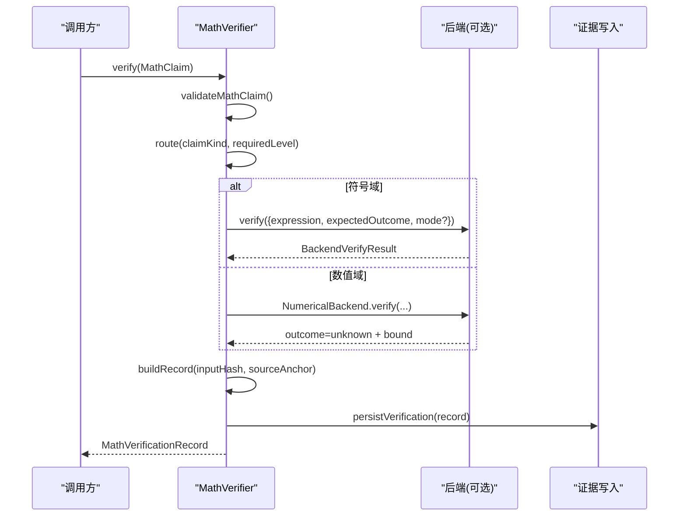
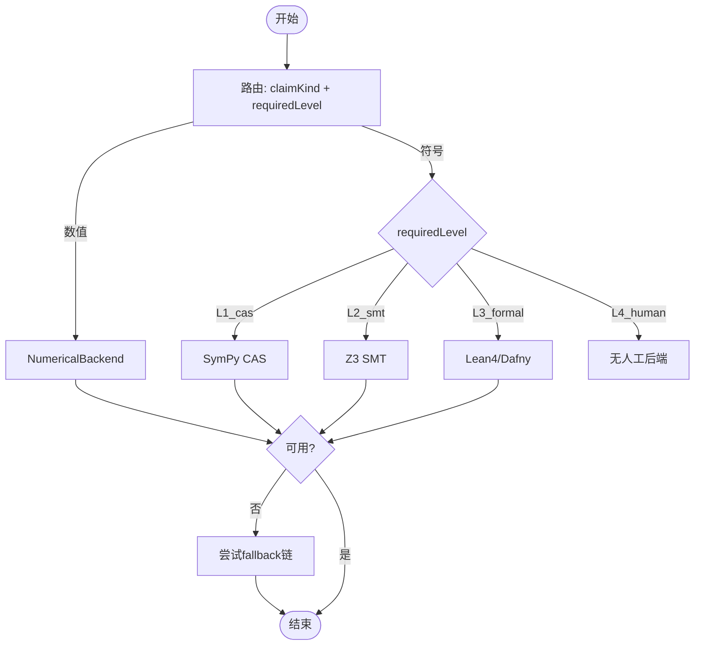
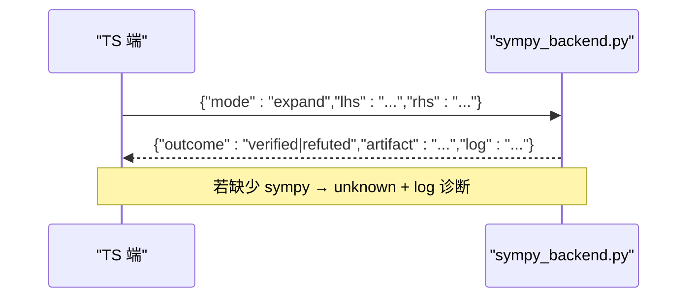
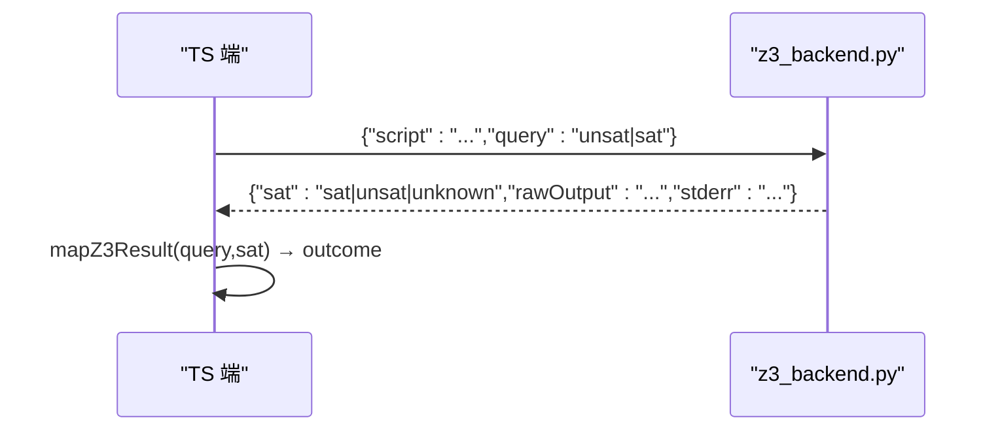
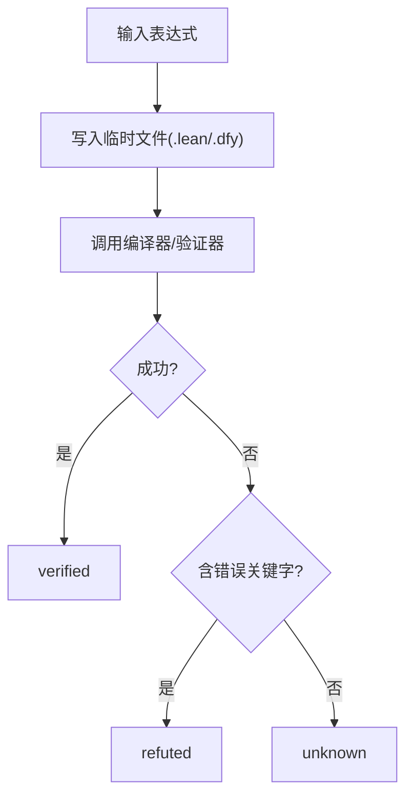
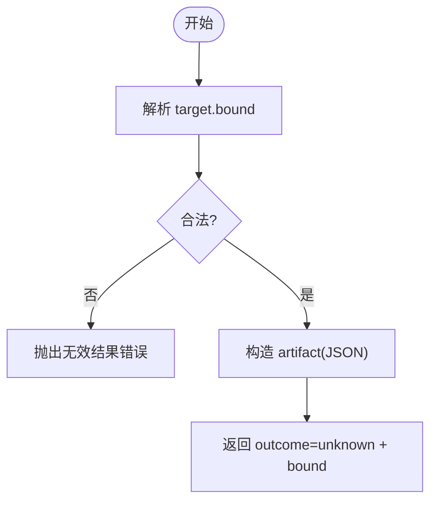
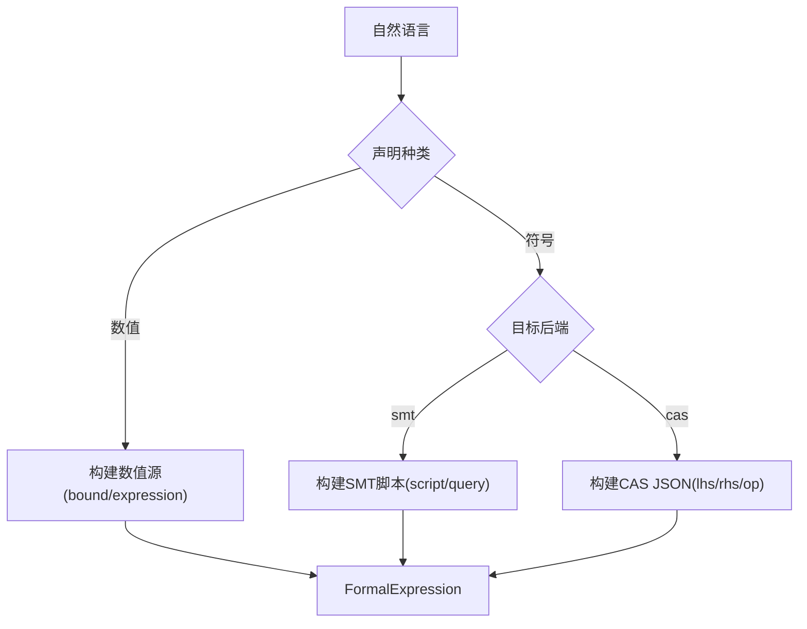
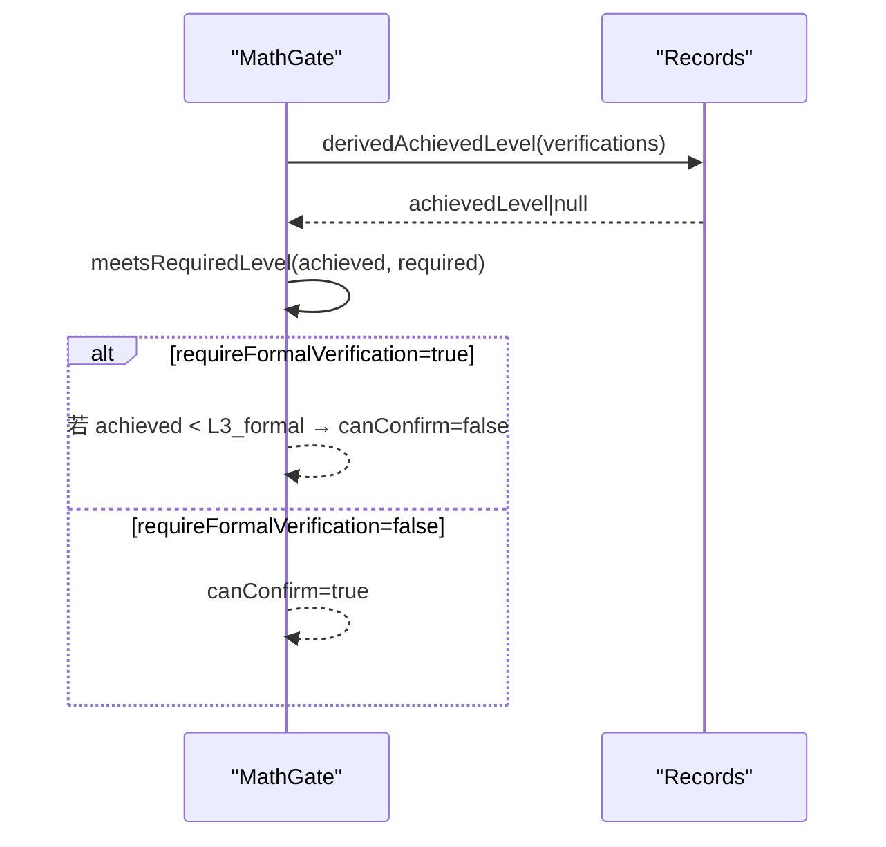
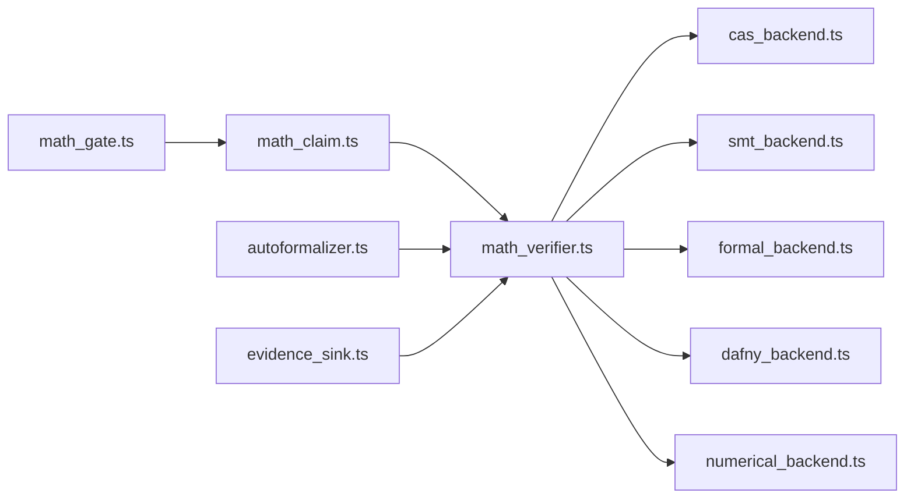

# 数学验证引擎

<cite>
**本文引用的文件**
- [src/math/index.ts](file://src/math/index.ts)
- [src/math/math_verifier.ts](file://src/math/math_verifier.ts)
- [src/math/math_claim.ts](file://src/math/math_claim.ts)
- [src/math/cas_backend.ts](file://src/math/cas_backend.ts)
- [src/math/smt_backend.ts](file://src/math/smt_backend.ts)
- [src/math/formal_backend.ts](file://src/math/formal_backend.ts)
- [src/math/dafny_backend.ts](file://src/math/dafny_backend.ts)
- [src/math/numerical_backend.ts](file://src/math/numerical_backend.ts)
- [repro/math_backends/sympy_backend.py](file://repro/math_backends/sympy_backend.py)
- [repro/math_backends/z3_backend.py](file://repro/math_backends/z3_backend.py)
- [src/math/autoformalizer.ts](file://src/math/autoformalizer.ts)
- [src/math/evidence_sink.ts](file://src/math/evidence_sink.ts)
- [src/math/premise_search.ts](file://src/math/premise_search.ts)
- [src/math/math_gate.ts](file://src/math/math_gate.ts)
- [src/math/errors.ts](file://src/math/errors.ts)
</cite>

## 目录
1. [简介](#简介)
2. [项目结构](#项目结构)
3. [核心组件](#核心组件)
4. [架构总览](#架构总览)
5. [详细组件分析](#详细组件分析)
6. [依赖关系分析](#依赖关系分析)
7. [性能与精度考量](#性能与精度考量)
8. [故障排查指南](#故障排查指南)
9. [结论](#结论)
10. [附录](#附录)

## 简介
本技术文档面向“数学验证引擎”，系统性说明形式化验证与数值计算的实现原理、后端路由策略、自动形式化流程、误差与精度控制、声明解析与验证流水线、约束表达与求解策略、配置与调优、外部软件集成接口，以及结果解读与报告生成。该引擎以多后端（SymPy、Z3、Lean 4、Dafny、数值后端）为核心，提供可插拔的验证能力，并通过严格的类型契约与降级策略保证跨语言一致性与可审计性。

## 项目结构
数学验证子系统位于 src/math，通过统一入口 index.ts 暴露公共 API；核心路由 MathVerifier 根据声明种类与所需等级将任务分派到不同后端；自动形式化器 CoreNeutralAutoformalizer 将自然语言或结构化输入转换为机器可检查的 FormalExpression；证据持久化由 evidence_sink 完成；前提检索 premise_search 支持 LeanDojo 风格的前提选择（本地回退）。

```mermaid
graph TB
A["MathVerifier<br/>路由与降级"] --> B["CAS 后端<br/>SymPy"]
A --> C["SMT 后端<br/>Z3"]
A --> D["形式化后端<br/>Lean 4 / Dafny"]
A --> E["数值后端<br/>NumericalBackend"]
F["自动形式化器<br/>CoreNeutralAutoformalizer"] --> A
G["证据写入<br/>evidence_sink"] <- --> A
H["前提检索<br/>premise_search"] --> D
```

图表来源
- [src/math/math_verifier.ts:76-140](file://src/math/math_verifier.ts#L76-L140)
- [src/math/cas_backend.ts:47-124](file://src/math/cas_backend.ts#L47-L124)
- [src/math/smt_backend.ts:46-130](file://src/math/smt_backend.ts#L46-L130)
- [src/math/formal_backend.ts:33-138](file://src/math/formal_backend.ts#L33-L138)
- [src/math/dafny_backend.ts:32-136](file://src/math/dafny_backend.ts#L32-L136)
- [src/math/numerical_backend.ts:36-94](file://src/math/numerical_backend.ts#L36-L94)
- [src/math/autoformalizer.ts:56-66](file://src/math/autoformalizer.ts#L56-L66)
- [src/math/evidence_sink.ts:27-54](file://src/math/evidence_sink.ts#L27-L54)
- [src/math/premise_search.ts:52-101](file://src/math/premise_search.ts#L52-L101)

章节来源
- [src/math/index.ts:1-42](file://src/math/index.ts#L1-L42)

## 核心组件
- 类型与常量：定义声明种类、验证等级、结果枚举、后端种类、形式化目标等，并提供校验与推导函数（如 derivedAchievedLevel、meetsRequiredLevel、validateMathClaim）。
- 验证路由器：MathVerifier 负责按 claimKind 与 requiredLevel 路由到对应后端，并实现 E-fallback 链与诚实降级。
- 后端实现：
  - CAS（SymPy）：基于 expand 模式的结构相等判定（可靠），simplify 为启发式（未知）。
  - SMT（Z3）：SMT-LIB 脚本 + sat/unsat 查询映射为 verified/refuted/unknown。
  - 形式化（Lean 4/Dafny）：调用编译器/验证器，依据退出码与输出判定。
  - 数值：强制 outcome=unknown，必须包含 bound 描述，用于人类审阅。
- 自动形式化：CoreNeutralAutoformalizer 将自然语言/结构化输入转为 FormalExpression（target/source/formalizerId/confidence）。
- 证据与门控：evidence_sink 持久化声明与验证记录；math_gate 在 requireFormalVerification=true 时强制达到 L3_formal 才可确认。

章节来源
- [src/math/math_claim.ts:28-446](file://src/math/math_claim.ts#L28-L446)
- [src/math/math_verifier.ts:76-140](file://src/math/math_verifier.ts#L76-L140)
- [src/math/cas_backend.ts:47-124](file://src/math/cas_backend.ts#L47-L124)
- [src/math/smt_backend.ts:46-130](file://src/math/smt_backend.ts#L46-L130)
- [src/math/formal_backend.ts:33-138](file://src/math/formal_backend.ts#L33-L138)
- [src/math/dafny_backend.ts:32-136](file://src/math/dafny_backend.ts#L32-L136)
- [src/math/numerical_backend.ts:36-94](file://src/math/numerical_backend.ts#L36-L94)
- [src/math/autoformalizer.ts:56-66](file://src/math/autoformalizer.ts#L56-L66)
- [src/math/evidence_sink.ts:27-54](file://src/math/evidence_sink.ts#L27-L54)
- [src/math/math_gate.ts:54-100](file://src/math/math_gate.ts#L54-L100)

## 架构总览
数学验证引擎采用“声明→形式化→路由→后端→证据”的分层架构。声明经自动形式化生成 FormalExpression；路由器依据领域与等级选择后端；后端执行后返回标准化结果；证据写入数据库并追加到共享证据链；必要时通过 math_gate 阻断或放行。



图表来源
- [src/math/math_verifier.ts:110-140](file://src/math/math_verifier.ts#L110-L140)
- [src/math/math_claim.ts:414-445](file://src/math/math_claim.ts#L414-L445)
- [src/math/evidence_sink.ts:123-143](file://src/math/evidence_sink.ts#L123-L143)

## 详细组件分析

### 验证路由器与降级策略（MathVerifier）
- 路由规则：
  - 数值声明 → NumericalBackend（始终 unknown + bound）。
  - 符号声明：
    - L1_cas → CAS（SymPy，expand 模式）。
    - L2_smt → SMT（Z3）。
    - L3_formal → Lean 4 或 Dafny。
    - L4_human → 无自动后端，需人工检查点关闭。
- E-fallback 链：当主后端不可用或返回 disabled，按顺序尝试替代后端（如 smt→cas，lean4→dafny），并在 compileLog 中记录 fallback 来源。
- 输入哈希：对 {target, source, formalizerId, confidence} 进行规范化（confidence 定点化）后计算哈希，确保跨语言一致性。



图表来源
- [src/math/math_verifier.ts:76-140](file://src/math/math_verifier.ts#L76-L140)
- [src/math/math_verifier.ts:148-224](file://src/math/math_verifier.ts#L148-L224)
- [src/math/math_verifier.ts:266-331](file://src/math/math_verifier.ts#L266-L331)

章节来源
- [src/math/math_verifier.ts:76-387](file://src/math/math_verifier.ts#L76-L387)

### CAS 后端（SymPy）
- 协议：子进程 stdin/stdout JSON 请求/响应；支持 parse/expand/simplify 模式。
- 可靠性：expand 模式对多项式/结构恒等式判定可靠；simplify 为启发式，永远返回 unknown。
- 可用性检测：首次 isAvailable() 缓存；缺失 Python/SymPy 时返回 backend_disabled。



图表来源
- [src/math/cas_backend.ts:93-124](file://src/math/cas_backend.ts#L93-L124)
- [repro/math_backends/sympy_backend.py:37-121](file://repro/math_backends/sympy_backend.py#L37-L121)

章节来源
- [src/math/cas_backend.ts:1-208](file://src/math/cas_backend.ts#L1-L208)
- [repro/math_backends/sympy_backend.py:1-125](file://repro/math_backends/sympy_backend.py#L1-L125)

### SMT 后端（Z3）
- 协议：JSON 包含 SMT-LIB 脚本与查询类型（sat/unsat），后端映射为 verified/refuted/unknown。
- 双模式：优先 CLI z3 -in；回退 Python z3-solver；isAvailable() 缓存并选择模式。
- 错误处理：解析失败或运行异常均返回 unknown 并记录 stderr。



图表来源
- [src/math/smt_backend.ts:81-130](file://src/math/smt_backend.ts#L81-L130)
- [repro/math_backends/z3_backend.py:26-63](file://repro/math_backends/z3_backend.py#L26-L63)

章节来源
- [src/math/smt_backend.ts:1-299](file://src/math/smt_backend.ts#L1-L299)
- [repro/math_backends/z3_backend.py:1-69](file://repro/math_backends/z3_backend.py#L1-L69)

### 形式化后端（Lean 4 / Dafny）
- Lean 4：写临时 .lean 文件，调用 lean 编译；无错误且无 goals → verified；出现 type mismatch/goals left → refuted；其他 → unknown。
- Dafny：写临时 .dfy 文件，调用 dafny verify；退出码 0 → verified；验证错误 → refuted；其他 → unknown。
- 两者均在环境不可用时返回 backend_disabled。



图表来源
- [src/math/formal_backend.ts:64-138](file://src/math/formal_backend.ts#L64-L138)
- [src/math/dafny_backend.ts:63-136](file://src/math/dafny_backend.ts#L63-L136)

章节来源
- [src/math/formal_backend.ts:1-151](file://src/math/formal_backend.ts#L1-L151)
- [src/math/dafny_backend.ts:1-149](file://src/math/dafny_backend.ts#L1-L149)

### 数值后端（NumericalBackend）
- 不变式：数值验证非自证，始终 outcome=unknown；必须在 outputArtifact 中包含 bound（min/max/sampleCount/description）。
- 输入：JSON 包含 bound 与可选 expression；缺失或非法 bound 抛出 InvalidBackendResultError。
- 用途：为人类审阅提供数值范围与上下文。



图表来源
- [src/math/numerical_backend.ts:45-94](file://src/math/numerical_backend.ts#L45-L94)

章节来源
- [src/math/numerical_backend.ts:1-96](file://src/math/numerical_backend.ts#L1-L96)

### 自动形式化（CoreNeutralAutoformalizer）
- 输入：自然语言、声明种类、目标后端、mustBeVerifiedBy。
- 输出：FormalExpression（target/source/formalizerId/confidence）。
- 策略：
  - 数值：提取区间 [a,b] 生成 bound；否则默认零区间。
  - 符号：匹配等式/不等式生成 CAS JSON 或 SMT 脚本；无法识别则回退为 parse 模式。
  - 置信度：匹配到结构模式高置信；否则低置信触发降级提示。



图表来源
- [src/math/autoformalizer.ts:60-163](file://src/math/autoformalizer.ts#L60-L163)

章节来源
- [src/math/autoformalizer.ts:1-184](file://src/math/autoformalizer.ts#L1-L184)

### 证据与门控（Evidence Sink & Math Gate）
- 证据写入：声明与验证记录持久化至 SQLite，并追加到共享证据链（需要 callRecordSeq）。
- 门控逻辑：当 requireFormalVerification=true 时，仅当 achievedLevel ≥ L3_formal 才允许确认；否则强制 UNTESTED 并给出原因。



图表来源
- [src/math/math_gate.ts:54-100](file://src/math/math_gate.ts#L54-L100)
- [src/math/evidence_sink.ts:123-143](file://src/math/evidence_sink.ts#L123-L143)

章节来源
- [src/math/evidence_sink.ts:1-208](file://src/math/evidence_sink.ts#L1-L208)
- [src/math/math_gate.ts:1-101](file://src/math/math_gate.ts#L1-L101)

### 前提检索（Premise Search）
- 策略：优先 mathlib（未实现，占位）；回退到本地已验证声明关键词匹配；结果包含 sourceAnchor。
- 适用场景：辅助形式化证明搜索相关定理/引理。

章节来源
- [src/math/premise_search.ts:1-102](file://src/math/premise_search.ts#L1-L102)

## 依赖关系分析
- 模块耦合：
  - MathVerifier 依赖各后端实现与类型契约；通过 fallbackChains 解耦具体后端可用性。
  - Autoformalizer 与后端无关，仅产出 FormalExpression；竞争适配器可包装其增强能力。
  - Evidence sink 与数据库交互，不依赖后端实现细节。
- 外部依赖：
  - SymPy（Python）、Z3（CLI 或 Python 包）、Lean 4、Dafny 均为可选外部工具；不可用时诚实降级。
- 循环依赖：无直接循环；类型集中在 math_claim.ts，避免重复导入。



图表来源
- [src/math/math_claim.ts:28-446](file://src/math/math_claim.ts#L28-L446)
- [src/math/math_verifier.ts:76-140](file://src/math/math_verifier.ts#L76-L140)
- [src/math/autoformalizer.ts:56-66](file://src/math/autoformalizer.ts#L56-L66)
- [src/math/evidence_sink.ts:27-54](file://src/math/evidence_sink.ts#L27-L54)
- [src/math/math_gate.ts:54-100](file://src/math/math_gate.ts#L54-L100)

章节来源
- [src/math/math_claim.ts:28-446](file://src/math/math_claim.ts#L28-L446)
- [src/math/math_verifier.ts:76-140](file://src/math/math_verifier.ts#L76-L140)

## 性能与精度考量
- 性能优化建议：
  - 复用后端实例：isAvailable() 已缓存可用性；避免重复探测。
  - 超时配置：为 CAS/SMT/Formal 后端设置合理 timeoutMs，防止阻塞。
  - 并行验证：对多个独立声明并发调用 verify()，注意外部进程资源限制。
  - 回退链长度：缩短 fallbackChains 以减少不必要尝试。
- 精度与误差控制：
  - CAS expand 模式对多项式/结构恒等式可靠；simplify 为启发式，不宣称 verified。
  - SMT 结果严格映射 sat/unsat；未知情况保守返回 unknown。
  - 数值后端强制 unknown + bound，供人类审阅；bound 应来自可信数据源。
  - 输入哈希 confidence 定点化（6位小数）确保跨语言一致性，避免浮点表示差异。

[本节为通用指导，无需特定文件引用]

## 故障排查指南
- 常见错误与定位：
  - 后端不可用：compileLog=backend_disabled；检查 PATH 或 Python 环境。
  - 解析失败：smt_parse_error/cas_spawn_error/lean_spawn_error；检查输入格式与外部工具版本。
  - 数值 bound 缺失：InvalidBackendResultError；确保 target.bound 存在且合法。
  - 路由错误：FatalMathError；检查 claimKind 与 requiredLevel 是否匹配。
- 调试步骤：
  - 查看 compileLog 与 outputArtifact 获取后端输出。
  - 使用 createDefaultMathVerifier 注入自定义后端进行单元测试。
  - 通过 evidence_sink 查询历史验证记录，复现问题。

章节来源
- [src/math/errors.ts:1-30](file://src/math/errors.ts#L1-L30)
- [src/math/cas_backend.ts:93-124](file://src/math/cas_backend.ts#L93-L124)
- [src/math/smt_backend.ts:81-130](file://src/math/smt_backend.ts#L81-L130)
- [src/math/formal_backend.ts:64-138](file://src/math/formal_backend.ts#L64-L138)
- [src/math/dafny_backend.ts:63-136](file://src/math/dafny_backend.ts#L63-L136)
- [src/math/numerical_backend.ts:45-94](file://src/math/numerical_backend.ts#L45-L94)

## 结论
数学验证引擎通过分层架构与多后端组合，实现了从自然语言到机器可检查形式的自动化转换，并结合形式化与数值方法提供多层次验证保障。严格的类型契约、诚实降级与证据持久化确保了系统的可审计性与鲁棒性。在实际应用中，应根据问题特性选择合适的后端与等级，并合理配置超时与回退链以获得最佳性能与可靠性。

[本节为总结，无需特定文件引用]

## 附录
- 配置选项要点：
  - MathVerifierOptions：可注入各后端实例与 fallbackChains。
  - 后端选项：pythonCommand/z3Command/leanCommand/dafnyCommand、timeoutMs、versionOverride。
- 集成接口：
  - 外部软件：SymPy（Python 子进程）、Z3（CLI 或 Python 包）、Lean 4、Dafny（CLI）。
  - 数据库：SQLite 表 math_claims、math_verifications；证据链追加需 callRecordSeq。
- 结果解读：
  - verified/refuted/unknown：分别表示证实、反驳、未知。
  - compileLog：记录后端状态与诊断信息（如 backend_disabled、spawn_error）。
  - outputArtifact：包含证明工件、简化结果或数值 bound（JSON 字符串）。

[本节为补充信息，无需特定文件引用]