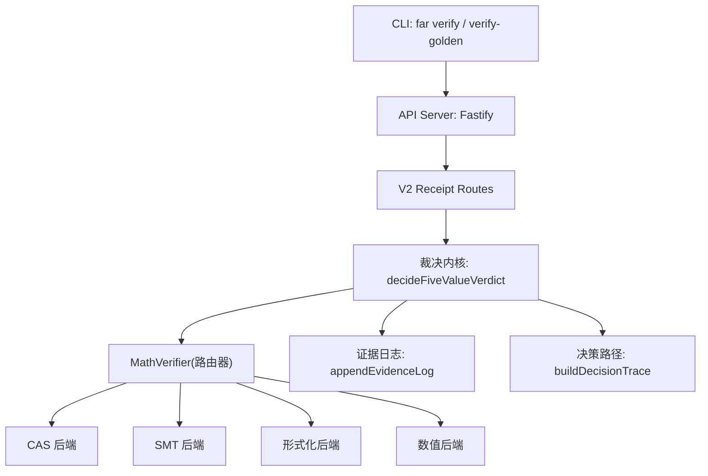
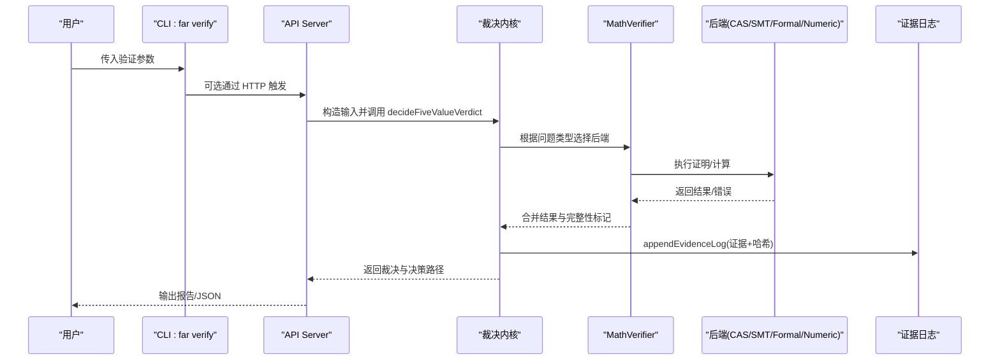
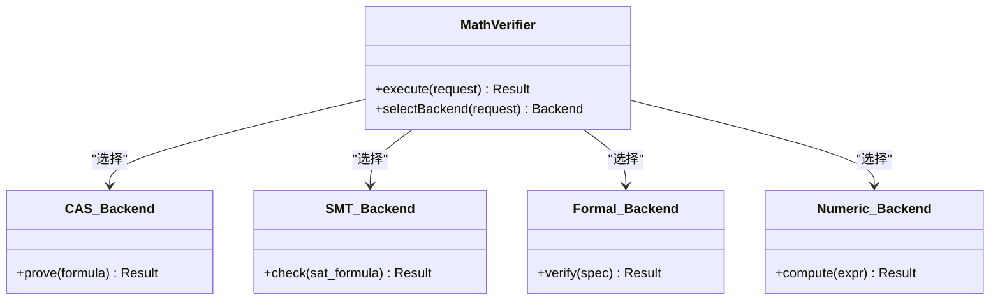
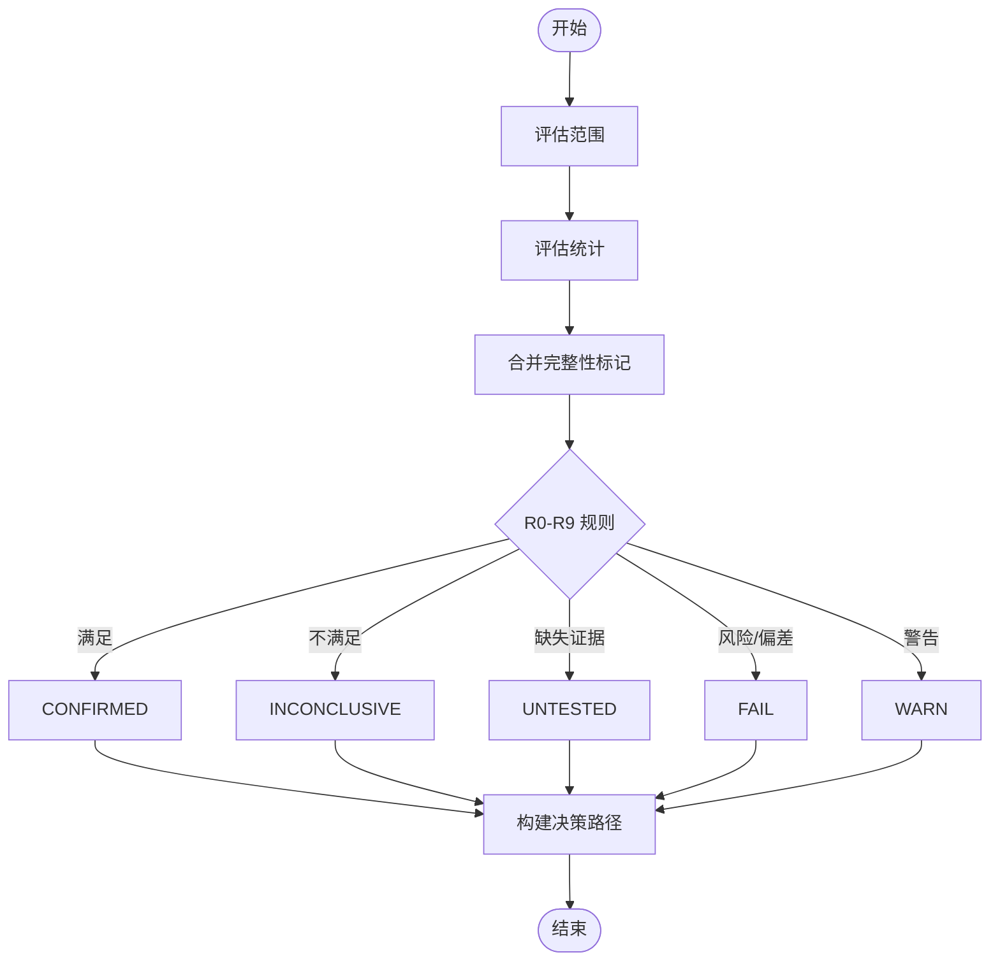
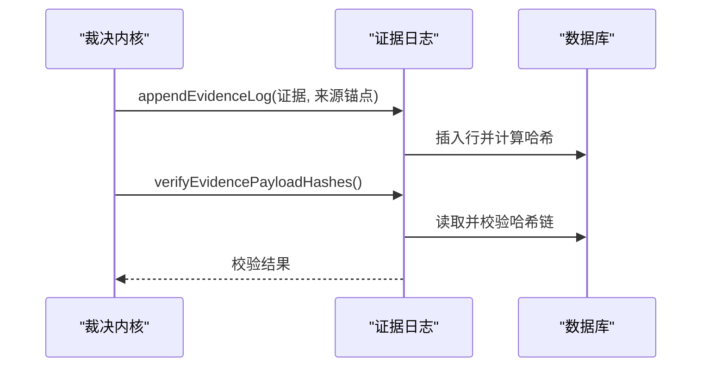
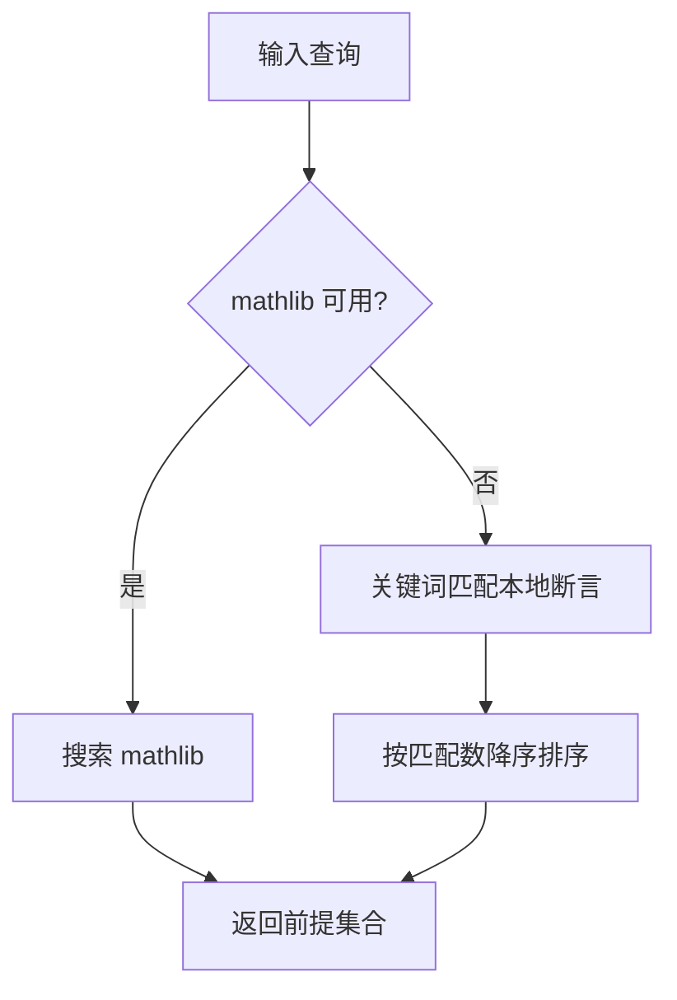
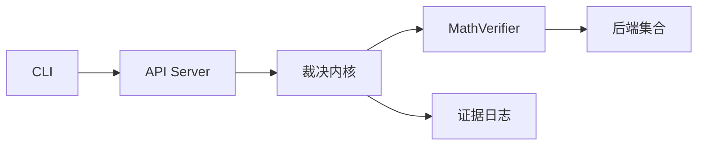

# 验证路由器

<cite>
**本文引用的文件**
- [src/math/index.ts](file://src/math/index.ts)
- [src/math/math_verifier.ts](file://src/math/math_verifier.ts)
- [src/math/cas_backend.ts](file://src/math/cas_backend.ts)
- [src/math/smt_backend.ts](file://src/math/smt_backend.ts)
- [src/math/formal_backend.ts](file://src/math/formal_backend.ts)
- [src/math/numerical_backend.ts](file://src/math/dafny_backend.ts)
- [src/math/premise_search.ts](file://src/math/premise_search.ts)
- [src/math/evidence_sink.ts](file://src/math/evidence_sink.ts)
- [src/falsifiability/index.ts](file://src/falsifiability/index.ts)
- [src/falsifiability/verdict_kernel_v2.ts](file://src/falsifiability/verdict_kernel_v2.ts)
- [src/anti_theater/adapters/kernel_adapter.ts](file://src/anti_theater/adapters/kernel_adapter.ts)
- [src/api/server.ts](file://src/api/server.ts)
- [src/api/routes/v2_receipts_persist.ts](file://src/api/routes/v2_receipts_persist.ts)
- [src/cli/commands/verify_golden.ts](file://src/cli/commands/verify_golden.ts)
- [src/cli/commands/verify.ts](file://src/cli/commands/verify.ts)
- [src/cli/far.ts](file://src/cli/far.ts)
- [src/evidence_log/index.ts](file://src/evidence_log/index.ts)
</cite>

## 目录
1. [简介](#简介)
2. [项目结构](#项目结构)
3. [核心组件](#核心组件)
4. [架构总览](#架构总览)
5. [详细组件分析](#详细组件分析)
6. [依赖关系分析](#依赖关系分析)
7. [性能考量](#性能考量)
8. [故障排查指南](#故障排查指南)
9. [结论](#结论)
10. [附录](#附录)

## 简介
本技术文档聚焦“验证路由器”：将数学验证请求从入口（CLI/API）分发到后端执行，并在裁决内核中完成证据收集、前提搜索、并行调度与结果后处理。文档覆盖以下主题：
- 验证器工厂模式与后端选择策略（CAS/SMT/Formal/Numeric）
- 验证任务的并行执行与资源调度
- 证据收集与分析的数据流
- 前提搜索算法在验证中的作用
- 验证路径的动态选择与优化
- 性能监控与故障恢复
- 结果后处理与报告生成
- 审计追踪与可重现性保证
- 配置选项与扩展开发指南

## 项目结构
验证路由相关代码主要分布在以下模块：
- 数学验证层：统一导出 MathVerifier、后端实现、证据落盘、前提搜索
- 裁决内核：R0-R9 确定性规则树，产出五值裁决与决策路径
- API/CLI 入口：HTTP 路由与命令行子命令，负责参数解析、任务编排与输出
- 证据日志：链式哈希、载荷校验、检索索引与生命周期事件

图表来源
- [src/api/server.ts:112-253](file://src/api/server.ts#L112-L253)
- [src/api/routes/v2_receipts_persist.ts:1-18](file://src/api/routes/v2_receipts_persist.ts#L1-L18)
- [src/falsifiability/index.ts:129-161](file://src/falsifiability/index.ts#L129-L161)
- [src/math/index.ts:21-35](file://src/math/index.ts#L21-L35)

章节来源
- [src/api/server.ts:112-253](file://src/api/server.ts#L112-L253)
- [src/math/index.ts:1-42](file://src/math/index.ts#L1-L42)
- [src/falsifiability/index.ts:1-162](file://src/falsifiability/index.ts#L1-L162)

## 核心组件
- 验证器工厂与路由器
  - 通过统一导出暴露 MathVerifier 与 createDefaultMathVerifier，作为请求分发的中心
  - 支持多后端（CAS/SMT/Formal/Numeric），按策略选择具体执行器
- 裁决内核
  - 提供 decideFiveValueVerdict、evaluateScope、evaluateStatistics 等确定性函数
  - 构建决策路径 trace，用于解释与审计
- 证据日志
  - 追加证据记录、校验载荷哈希、维护链头与生命周期事件
- 前提搜索
  - 基于关键词匹配本地已验证断言，或回退到 mathlib（若可用）
- 入口路由
  - CLI 的 verify/verify-golden 与 API 的 V2 收据端点，负责参数解析、任务编排与输出

章节来源
- [src/math/index.ts:21-35](file://src/math/index.ts#L21-L35)
- [src/falsifiability/index.ts:129-161](file://src/falsifiability/index.ts#L129-L161)
- [src/evidence_log/index.ts:1-92](file://src/evidence_log/index.ts#L1-L92)
- [src/math/premise_search.ts:1-102](file://src/math/premise_search.ts#L1-L102)
- [src/cli/commands/verify.ts:511-535](file://src/cli/commands/verify.ts#L511-L535)
- [src/cli/commands/verify_golden.ts:209-256](file://src/cli/commands/verify_golden.ts#L209-L256)

## 架构总览
验证请求从 CLI 或 API 进入，经路由分发至裁决内核；内核调用验证器路由器选择合适后端执行数学证明/计算；过程中持续写入证据日志并生成决策路径；最终由 CLI/API 渲染为人类可读或机器可读的报告。

图表来源
- [src/cli/far.ts:147-171](file://src/cli/far.ts#L147-L171)
- [src/api/server.ts:112-253](file://src/api/server.ts#L112-L253)
- [src/falsifiability/index.ts:129-161](file://src/falsifiability/index.ts#L129-L161)
- [src/math/index.ts:21-35](file://src/math/index.ts#L21-L35)
- [src/evidence_log/index.ts:1-92](file://src/evidence_log/index.ts#L1-L92)

## 详细组件分析

### 验证器工厂与后端选择策略
- 工厂模式
  - 通过 createDefaultMathVerifier 创建默认路由器实例，封装后端注册与选择逻辑
  - 各后端以统一接口暴露，便于替换与扩展
- 后端种类
  - CAS：计算机代数系统
  - SMT：可满足性模理论求解器
  - Formal：形式化验证器（如 Dafny）
  - Numeric：数值计算后端
- 选择策略
  - 依据问题类型、约束条件与可用性动态选择最优后端
  - 失败时自动降级到其他后端，保障鲁棒性

图表来源
- [src/math/index.ts:21-35](file://src/math/index.ts#L21-L35)
- [src/math/cas_backend.ts](file://src/math/cas_backend.ts)
- [src/math/smt_backend.ts](file://src/math/smt_backend.ts)
- [src/math/formal_backend.ts](file://src/math/formal_backend.ts)
- [src/math/numerical_backend.ts](file://src/math/dafny_backend.ts)

章节来源
- [src/math/index.ts:21-35](file://src/math/index.ts#L21-L35)

### 裁决内核与决策路径
- 决策流程
  - 评估范围（scope）、统计（statistics）、完整性标记（integrityFlags）
  - R0-R9 规则树决定最终五值裁决（CONFIRMED/INCONCLUSIVE/UNTESTED/FAIL/WARN）
- 决策路径追踪
  - buildDecisionTrace 从内核输出提取已计算字段，避免重复计算
  - 输出包含触发规则、阈值、证据充分性等解释信息

图表来源
- [src/falsifiability/verdict_kernel_v2.ts:362-374](file://src/falsifiability/verdict_kernel_v2.ts#L362-L374)
- [src/falsifiability/verdict_kernel_v2.ts:556-584](file://src/falsifiability/verdict_kernel_v2.ts#L556-L584)
- [src/falsifiability/verdict_kernel_v2.ts:908-940](file://src/falsifiability/verdict_kernel_v2.ts#L908-L940)

章节来源
- [src/falsifiability/index.ts:129-161](file://src/falsifiability/index.ts#L129-L161)
- [src/falsifiability/verdict_kernel_v2.ts:362-374](file://src/falsifiability/verdict_kernel_v2.ts#L362-L374)
- [src/falsifiability/verdict_kernel_v2.ts:556-584](file://src/falsifiability/verdict_kernel_v2.ts#L556-L584)
- [src/falsifiability/verdict_kernel_v2.ts:908-940](file://src/falsifiability/verdict_kernel_v2.ts#L908-L940)

### 证据收集与分析数据流
- 证据追加
  - appendEvidenceLog 将证据记录写入数据库，附带来源锚点与派生标志
  - 支持 FTS 索引与检索，便于后续分析与审计
- 载荷校验
  - verifyEvidencePayloadHashes、verifyCallRecordPayloadHashes 确保内容未被篡改
- 生命周期事件
  - 记录状态转换，支持重放与一致性检查

图表来源
- [src/evidence_log/index.ts:1-92](file://src/evidence_log/index.ts#L1-L92)

章节来源
- [src/evidence_log/index.ts:1-92](file://src/evidence_log/index.ts#L1-L92)

### 前提搜索算法
- 策略
  - 若 mathlib 可用，优先搜索外部库定理/引理
  - 否则回退到本地已验证断言，使用关键词匹配并按相关性排序
- 审计
  - 始终包含 sourceAnchor，确保可追溯

图表来源
- [src/math/premise_search.ts:1-102](file://src/math/premise_search.ts#L1-L102)

章节来源
- [src/math/premise_search.ts:1-102](file://src/math/premise_search.ts#L1-L102)

### 验证路径的动态选择与优化
- 动态选择
  - 根据问题特征（符号/数值/可满足性/形式化规范）选择最合适的后端
  - 失败时自动降级，保持端到端可用性
- 优化策略
  - 缓存中间结果（如前提搜索结果）
  - 限制并发度以避免资源争用
  - 超时与重试策略提升鲁棒性

章节来源
- [src/math/index.ts:21-35](file://src/math/index.ts#L21-L35)

### 性能监控与故障恢复
- 监控
  - API 层提供 /metrics 指标端点，暴露运行态信息
  - 请求超时与连接超时保护，防止长尾阻塞
- 恢复
  - 优雅关停（SIGINT/SIGTERM）确保 WAL 落盘
  - 证据链校验失败时快速失败，避免污染后续流程

章节来源
- [src/api/server.ts:112-253](file://src/api/server.ts#L112-L253)

### 结果后处理与报告生成
- 后处理
  - 合并后端结果与完整性标记，生成标准化输出
  - 构建决策路径，用于解释与审计
- 报告
  - CLI/API 支持 JSON 与人类可读格式
  - 支持 golden vectors 重算与跨轴比对（Node/Python/Browser）

章节来源
- [src/cli/commands/verify.ts:511-535](file://src/cli/commands/verify.ts#L511-L535)
- [src/cli/commands/verify_golden.ts:209-256](file://src/cli/commands/verify_golden.ts#L209-L256)

### 审计追踪与可重现性保证
- 审计
  - 所有证据记录携带来源锚点与哈希链
  - 生命周期事件记录状态转换，支持重放
- 可重现性
  - 多轴重算（Node/Python/Browser）确保结果一致
  - 决策路径与阈值参数透明可查

章节来源
- [src/evidence_log/index.ts:1-92](file://src/evidence_log/index.ts#L1-L92)
- [src/cli/commands/verify_golden.ts:209-256](file://src/cli/commands/verify_golden.ts#L209-L256)

### 配置选项与扩展开发指南
- 配置
  - API Server 支持 JWT、CORS、限流、Swagger 等插件
  - 可通过构造函数注入 LLM 网关、事件总线等可选能力
- 扩展
  - 新增后端：实现统一接口并注册到路由器
  - 新增检测器：遵循纯函数、无副作用、可测试原则
  - 新增证据类型：扩展 schema 与索引策略

章节来源
- [src/api/server.ts:112-253](file://src/api/server.ts#L112-L253)

## 依赖关系分析
- 模块耦合
  - 裁决内核依赖验证器路由器与证据日志
  - API/CLI 仅依赖公共接口，降低耦合
- 外部依赖
  - Fastify、better-sqlite3、JWT、Rate Limit 等
- 循环依赖
  - 通过 barrel 导出与分层设计避免循环

图表来源
- [src/api/server.ts:112-253](file://src/api/server.ts#L112-L253)
- [src/falsifiability/index.ts:129-161](file://src/falsifiability/index.ts#L129-L161)
- [src/math/index.ts:21-35](file://src/math/index.ts#L21-L35)
- [src/evidence_log/index.ts:1-92](file://src/evidence_log/index.ts#L1-L92)

章节来源
- [src/api/server.ts:112-253](file://src/api/server.ts#L112-L253)
- [src/falsifiability/index.ts:129-161](file://src/falsifiability/index.ts#L129-L161)
- [src/math/index.ts:21-35](file://src/math/index.ts#L21-L35)
- [src/evidence_log/index.ts:1-92](file://src/evidence_log/index.ts#L1-L92)

## 性能考量
- 并发控制
  - 限制后端调用并发度，避免资源耗尽
  - 使用超时与重试机制提升稳定性
- 缓存策略
  - 缓存前提搜索结果与中间计算结果
- I/O 优化
  - 批量写入证据日志，减少数据库往返
  - 使用 FTS 索引加速证据检索

[本节提供通用指导，无需特定文件引用]

## 故障排查指南
- 常见问题
  - 后端不可用：检查配置与依赖，启用降级路径
  - 证据链断裂：校验载荷哈希与链头一致性
  - 裁决不一致：对比多轴重算结果（Node/Python/Browser）
- 调试工具
  - 使用 --explain 展开规则检查表
  - 查看决策路径与完整性标记定位问题

章节来源
- [src/cli/commands/verify.ts:511-535](file://src/cli/commands/verify.ts#L511-L535)
- [src/cli/commands/verify_golden.ts:209-256](file://src/cli/commands/verify_golden.ts#L209-L256)

## 结论
验证路由器通过工厂模式与多后端策略，实现了灵活、可扩展的数学验证分发。结合裁决内核的确定性规则、证据日志的可审计性与前提搜索的智能回退，系统在正确性、可重现性与鲁棒性方面提供了坚实保障。配合性能监控与故障恢复机制，可在生产环境中稳定运行。

[本节为总结性内容，无需特定文件引用]

## 附录
- 术语表
  - 裁决内核：执行 R0-R9 规则树的确定性模块
  - 证据日志：记录证据与调用记录的链式存储
  - 前提搜索：为形式化证明选择相关定理/引理的算法
- 参考路径
  - 验证入口：CLI 与 API 路由
  - 后端实现：CAS/SMT/Formal/Numeric
  - 证据处理：appendEvidenceLog 与校验函数

[本节为补充信息，无需特定文件引用]