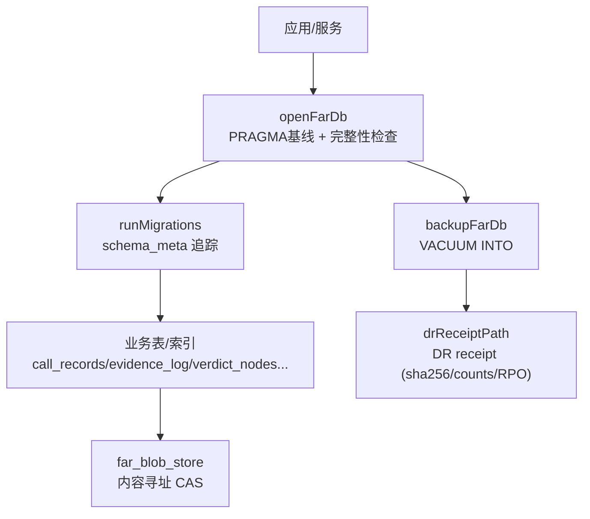
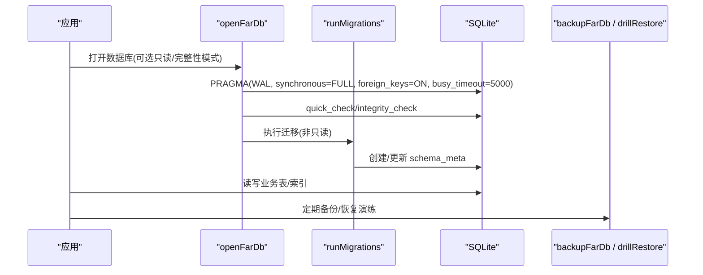
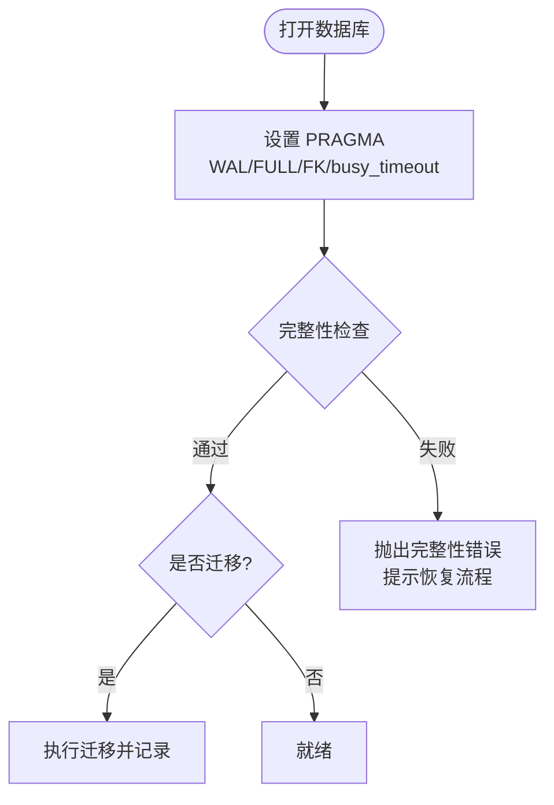
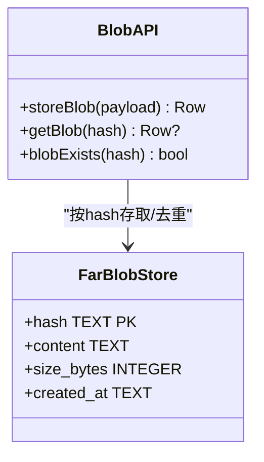
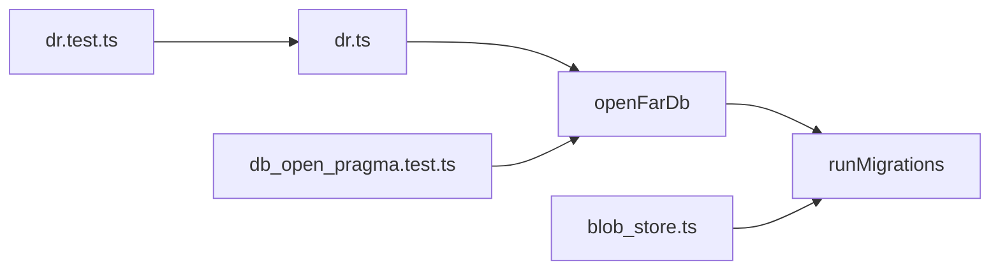

# 性能优化

<cite>
**本文引用的文件**
- [src/db/open.ts](file://src/db/open.ts)
- [src/db/migrator.ts](file://src/db/migrator.ts)
- [src/db/dr.ts](file://src/db/dr.ts)
- [schema/migrations/0001_initial.sql](file://schema/migrations/0001_initial.sql)
- [schema/migrations/0015_far_blob_store.sql](file://schema/migrations/0015_far_blob_store.sql)
- [src/cas/blob_store.ts](file://src/cas/blob_store.ts)
- [tests/db/db_open_pragma.test.ts](file://tests/db/db_open_pragma.test.ts)
- [tests/db/dr.test.ts](file://tests/db/dr.test.ts)
- [src/benchmark/index.ts](file://src/benchmark/index.ts)
- [tests/benchmark/aggregator.test.ts](file://tests/benchmark/aggregator.test.ts)
</cite>

## 目录
1. [简介](#简介)
2. [项目结构](#项目结构)
3. [核心组件](#核心组件)
4. [架构总览](#架构总览)
5. [详细组件分析](#详细组件分析)
6. [依赖关系分析](#依赖关系分析)
7. [性能考量](#性能考量)
8. [故障排查指南](#故障排查指南)
9. [结论](#结论)
10. [附录](#附录)

## 简介
本文件面向FAR-Lab项目的数据库性能优化，聚焦SQLite配置基线、索引与查询优化、批量与事务策略、大对象（Blob/CAS）存储、内存与缓存、监控与瓶颈定位、分片与归档、以及基准测试与压测指导。内容严格基于仓库中的实现与迁移脚本，确保可追溯与可复现。

## 项目结构
FAR-Lab的数据库能力集中在src/db与schema/migrations中：
- 打开与PRAGMA基线：统一入口openFarDb强制WAL、synchronous=FULL、foreign_keys=ON、busy_timeout=5000，并在启动时进行完整性检查。
- 迁移系统：按版本号顺序执行SQL，记录schema_meta，保证版本连续性与幂等。
- 备份与恢复演练：VACUUM INTO安全备份，DR receipt包含sha256、表计数、RPO/RTO度量，支持保留策略。
- 数据模型与索引：初始迁移定义核心表与索引，CAS表提供内容寻址去重。
- 基准模块：聚合器导出latencyMs等指标，便于持续观测。

图表来源
- [src/db/open.ts:72-120](file://src/db/open.ts#L72-L120)
- [src/db/migrator.ts:38-78](file://src/db/migrator.ts#L38-L78)
- [src/db/dr.ts:124-130](file://src/db/dr.ts#L124-L130)
- [schema/migrations/0001_initial.sql:10-47](file://schema/migrations/0001_initial.sql#L10-L47)
- [schema/migrations/0015_far_blob_store.sql:22-29](file://schema/migrations/0015_far_blob_store.sql#L22-L29)

章节来源
- [src/db/open.ts:72-120](file://src/db/open.ts#L72-L120)
- [src/db/migrator.ts:38-78](file://src/db/migrator.ts#L38-L78)
- [schema/migrations/0001_initial.sql:10-47](file://schema/migrations/0001_initial.sql#L10-L47)
- [schema/migrations/0015_far_blob_store.sql:22-29](file://schema/migrations/0015_far_blob_store.sql#L22-L29)

## 核心组件
- 数据库打开与PRAGMA基线：强制WAL、同步策略、外键约束、忙超时；启动即做quick_check或integrity_check，失败fail-closed并给出恢复指引。
- 迁移系统：读取命名规范的SQL文件，校验版本连续性，记录已应用版本，避免重复执行。
- 备份与恢复演练：使用VACUUM INTO生成一致快照；DR receipt记录哈希、大小、时间、表计数；drillRestore进行三关校验；applyRetention按创建时间保留最近N份。
- 内容寻址存储（CAS）：对payload进行规范化JSON后计算hash，INSERT OR IGNORE实现幂等去重；触发器禁止更新删除，保障不可变。
- 基准与指标：benchmark模块导出latencyMs等指标，用于回归与容量规划。

章节来源
- [src/db/open.ts:72-120](file://src/db/open.ts#L72-L120)
- [src/db/migrator.ts:38-78](file://src/db/migrator.ts#L38-L78)
- [src/db/dr.ts:101-166](file://src/db/dr.ts#L101-L166)
- [src/cas/blob_store.ts:31-57](file://src/cas/blob_store.ts#L31-L57)
- [src/benchmark/index.ts:1-36](file://src/benchmark/index.ts#L1-L36)

## 架构总览
下图展示从应用到数据库的关键路径：打开连接→设置PRAGMA→完整性检查→运行迁移→访问表/索引→备份与DR。

图表来源
- [src/db/open.ts:72-120](file://src/db/open.ts#L72-L120)
- [src/db/migrator.ts:38-78](file://src/db/migrator.ts#L38-L78)
- [src/db/dr.ts:124-166](file://src/db/dr.ts#L124-L166)

## 详细组件分析

### SQLite配置调优与基线
- 关键PRAGMA
  - journal_mode=WAL：提升并发读性能与崩溃恢复能力。
  - synchronous=FULL：确保写入持久化，降低数据丢失风险。
  - foreign_keys=ON：在数据库层强制执行引用完整性。
  - busy_timeout=5000ms：避免瞬时锁争用导致立即失败。
- 启动完整性检查
  - 默认quick_check，可按需切换full或关闭（仅测试注入）。
  - 任何异常均fail-closed，附带恢复指引。
- 验证
  - 测试用例显式断言busy_timeout=5000及上述基线未被破坏。

图表来源
- [src/db/open.ts:72-120](file://src/db/open.ts#L72-L120)
- [tests/db/db_open_pragma.test.ts:16-30](file://tests/db/db_open_pragma.test.ts#L16-L30)

章节来源
- [src/db/open.ts:72-120](file://src/db/open.ts#L72-L120)
- [tests/db/db_open_pragma.test.ts:16-30](file://tests/db/db_open_pragma.test.ts#L16-L30)

### 索引设计与查询优化
- 核心表与索引
  - call_records：按stage_id、payload_kind、model_id、dashscope_request_id、purpose_tag建索引，支撑阶段/类型/模型/请求ID检索。
  - evidence_log：按call_record_seq、stage_id、payload_kind、source_anchor_git、source_anchor_req建索引，支撑证据溯源与过滤。
  - verdict_nodes：按evidence_id、parent_verdict_id、node_kind、verdict建索引，支撑裁决树遍历与筛选。
  - repro_runs：按verdict_id、call_record_seq、repro_hash、status建索引，支撑复现实验检索。
- 设计要点
  - 针对高频过滤条件建立单列或多列索引。
  - 对唯一性约束（如from_node,to_node,edge_kind）建立唯一索引防止重复边。
  - 所有关键表采用append-only触发器，减少写放大与一致性开销。

章节来源
- [schema/migrations/0001_initial.sql:10-47](file://schema/migrations/0001_initial.sql#L10-L47)
- [schema/migrations/0001_initial.sql:60-84](file://schema/migrations/0001_initial.sql#L60-L84)
- [schema/migrations/0001_initial.sql:97-127](file://schema/migrations/0001_initial.sql#L97-L127)
- [schema/migrations/0001_initial.sql:187-230](file://schema/migrations/0001_initial.sql#L187-L230)

### 批量操作与事务优化
- 迁移事务
  - 迁移脚本内以PRAGMA开启外键约束，逐条执行SQL并记录schema_meta，保证原子性与可回滚（由上层事务控制）。
- 备份与一致性
  - VACUUM INTO生成一致快照，避免直接拷贝导致的WAL不一致问题。
- 建议实践
  - 将多条INSERT/UPDATE合并为单次事务提交，减少磁盘同步次数。
  - 大批量导入前临时禁用不必要的触发器/索引（谨慎评估），导入后重建。
  - 使用prepared语句与参数绑定，减少解析开销。

章节来源
- [src/db/migrator.ts:38-78](file://src/db/migrator.ts#L38-L78)
- [src/db/open.ts:124-130](file://src/db/open.ts#L124-L130)

### 大文件存储与Blob处理（CAS）
- 内容寻址
  - 对payload进行规范化JSON后计算hash作为主键，相同内容幂等写入（INSERT OR IGNORE）。
  - 触发器禁止更新/删除，确保不可变与审计可追溯。
- 性能考虑
  - 通过hash直接定位，避免二次扫描。
  - 对created_at建立索引，便于按时间范围清理或归档。
  - 大文本字段注意UTF-8字节长度统计，便于容量规划。

图表来源
- [schema/migrations/0015_far_blob_store.sql:22-43](file://schema/migrations/0015_far_blob_store.sql#L22-L43)
- [src/cas/blob_store.ts:31-57](file://src/cas/blob_store.ts#L31-L57)

章节来源
- [schema/migrations/0015_far_blob_store.sql:22-43](file://schema/migrations/0015_far_blob_store.sql#L22-L43)
- [src/cas/blob_store.ts:31-57](file://src/cas/blob_store.ts#L31-L57)

### 内存管理与缓存优化
- WAL与内存页
  - WAL模式减少写放大，配合合适的cache_size与mmap_size可提升吞吐（根据设备内存调整）。
- 连接与事务
  - 合理复用连接，避免频繁打开/关闭；长事务会持有更多内存，应拆分批处理。
- 应用层缓存
  - 对热点只读查询结果进行短期缓存（如进程内Map/Redis），注意失效策略与一致性。
- 监控
  - 通过sqlite3_status与PRAGMA查询观察缓存命中率、临时文件增长等。

[本节为通用指导，不直接分析具体文件]

### 性能监控与瓶颈分析
- 启动期
  - 完整性检查耗时可作为健康度指标；PRAGMA设置失败应立即告警。
- 运行期
  - 利用benchmark模块导出的latencyMs跟踪端到端延迟分布。
  - 关注慢查询：结合EXPLAIN QUERY PLAN分析索引命中情况。
- 备份/恢复
  - DR receipt记录RPO（距上次备份秒数）与RTO（演练耗时毫秒），纳入SLO监控。

章节来源
- [src/benchmark/index.ts:1-36](file://src/benchmark/index.ts#L1-L36)
- [tests/benchmark/aggregator.test.ts:169-176](file://tests/benchmark/aggregator.test.ts#L169-L176)
- [src/db/dr.ts:101-166](file://src/db/dr.ts#L101-L166)

### 分片与归档策略
- 分片思路
  - 按业务域/时间窗口切分数据库文件或表空间，降低单库体积与锁竞争。
  - 对历史数据建立独立库或分区表，热数据保持轻量。
- 归档策略
  - 定期将冷数据迁移至归档库，保留必要索引以支持审计查询。
  - 使用DR receipt与保留策略管理归档副本数量与生命周期。

[本节为概念性指导，不直接分析具体文件]

### 基准测试与压测指导
- 基准套件
  - 使用benchmark聚合器运行多场景，收集latencyMs并输出报告，确保确定性排序与完整性根。
- 压测步骤
  - 准备数据集与索引；预热WAL与缓存。
  - 模拟混合负载（读多写少/写多读少），逐步增加并发。
  - 采集指标：QPS、P95/P99延迟、锁等待、I/O吞吐、WAL文件大小。
  - 迭代优化：调整PRAGMA、索引、批大小、事务边界。
- 回归门禁
  - 将latencyMs阈值纳入CI，防止性能退化。

章节来源
- [tests/benchmark/aggregator.test.ts:81-105](file://tests/benchmark/aggregator.test.ts#L81-L105)
- [tests/benchmark/aggregator.test.ts:169-176](file://tests/benchmark/aggregator.test.ts#L169-L176)

## 依赖关系分析
- openFarDb依赖migrator执行迁移；dr模块依赖openFarDb进行表计数与完整性检查；CAS模块依赖迁移创建的far_blob_store表。
- 迁移脚本定义表结构与索引，被各模块共同消费。
- 测试用例验证PRAGMA基线与DR流程，确保行为稳定。

图表来源
- [src/db/open.ts:72-120](file://src/db/open.ts#L72-L120)
- [src/db/migrator.ts:38-78](file://src/db/migrator.ts#L38-L78)
- [src/db/dr.ts:101-166](file://src/db/dr.ts#L101-L166)
- [src/cas/blob_store.ts:31-57](file://src/cas/blob_store.ts#L31-L57)
- [tests/db/db_open_pragma.test.ts:16-30](file://tests/db/db_open_pragma.test.ts#L16-L30)
- [tests/db/dr.test.ts:96-156](file://tests/db/dr.test.ts#L96-L156)

章节来源
- [src/db/open.ts:72-120](file://src/db/open.ts#L72-L120)
- [src/db/migrator.ts:38-78](file://src/db/migrator.ts#L38-L78)
- [src/db/dr.ts:101-166](file://src/db/dr.ts#L101-L166)
- [src/cas/blob_store.ts:31-57](file://src/cas/blob_store.ts#L31-L57)
- [tests/db/db_open_pragma.test.ts:16-30](file://tests/db/db_open_pragma.test.ts#L16-L30)
- [tests/db/dr.test.ts:96-156](file://tests/db/dr.test.ts#L96-L156)

## 性能考量
- 写入路径
  - 使用WAL与synchronous=FULL平衡性能与可靠性；批量提交减少fsync次数。
  - 合理设置busy_timeout避免瞬时阻塞导致失败风暴。
- 读取路径
  - 充分利用现有索引；避免SELECT *，仅取必要列。
  - 对热点查询加应用层缓存，注意失效与一致性。
- 大对象
  - 优先存hash+引用，必要时将大文本落盘，数据库仅存元信息。
- 备份与归档
  - 定期VACUUM INTO并生成DR receipt；按保留策略清理旧副本。
- 监控
  - 持续采集latencyMs与DR RPO/RTO；对异常波动设置告警。

[本节为通用指导，不直接分析具体文件]

## 故障排查指南
- 启动失败
  - 检查PRAGMA设置与完整性检查结果；若损坏，依据DatabaseIntegrityError提示恢复。
- 备份/恢复
  - 使用drillRestore进行三关校验（哈希、完整性、表计数）；无receipt视为未演练备份。
  - applyRetention按createdAt保留最近N份，成对删除备份与receipt。
- 迁移问题
  - 确认迁移文件名符合“数字_名称.sql”规范且版本连续；schema_meta记录用于诊断。

章节来源
- [src/db/open.ts:19-30](file://src/db/open.ts#L19-L30)
- [src/db/open.ts:100-115](file://src/db/open.ts#L100-L115)
- [src/db/dr.ts:133-166](file://src/db/dr.ts#L133-L166)
- [src/db/dr.ts:174-191](file://src/db/dr.ts#L174-L191)
- [src/db/migrator.ts:93-113](file://src/db/migrator.ts#L93-L113)

## 结论
FAR-Lab在数据库层面建立了严格的PRAGMA基线与完整性检查，结合完善的迁移、备份与恢复演练机制，保障了数据一致性与可恢复性。通过合理的索引设计、CAS去重与基准监控，系统在大规模数据场景下具备可扩展性与可观测性。建议在生产环境中持续遵循本指南，并结合实际负载进行容量规划与压测回归。

## 附录
- 常用PRAGMA参考
  - journal_mode=WAL
  - synchronous=FULL
  - foreign_keys=ON
  - busy_timeout=5000
- 关键表清单
  - call_records、evidence_log、verdict_nodes、repro_runs、far_blob_store
- 关键接口
  - openFarDb、runMigrations、backupFarDb、drillRestore、applyRetention、storeBlob/getBlob/blobExists

[本节为概览性内容，不直接分析具体文件]