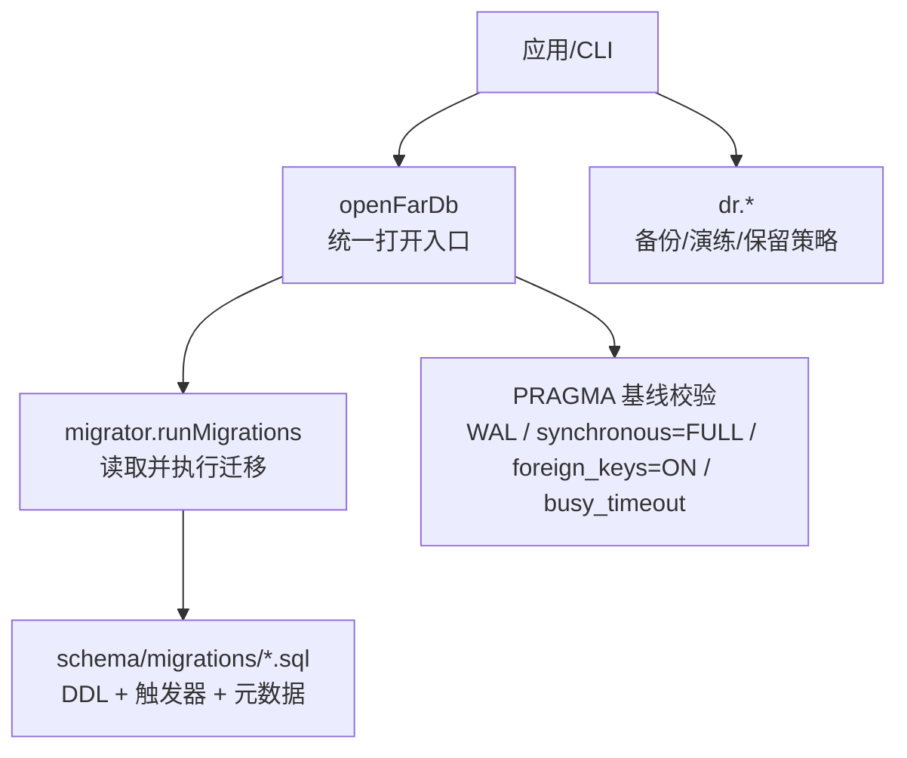
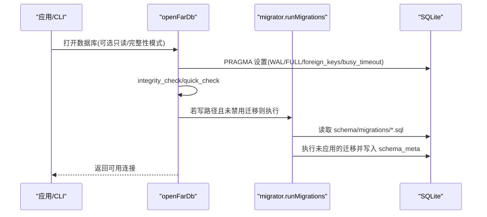
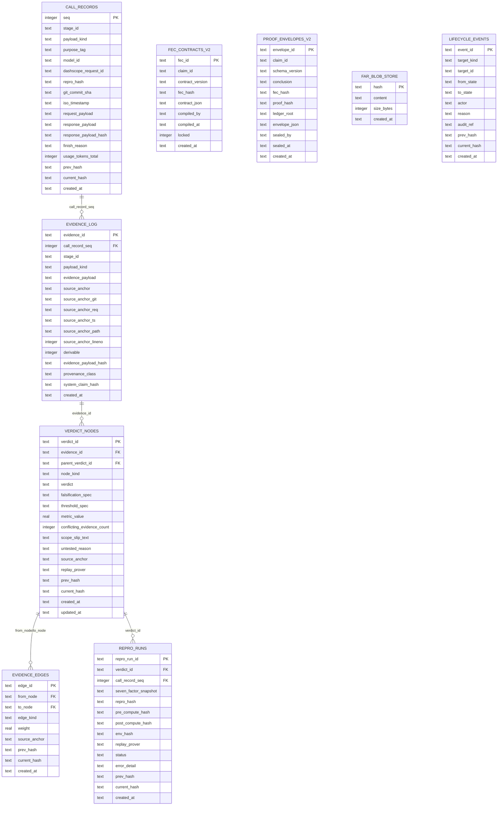
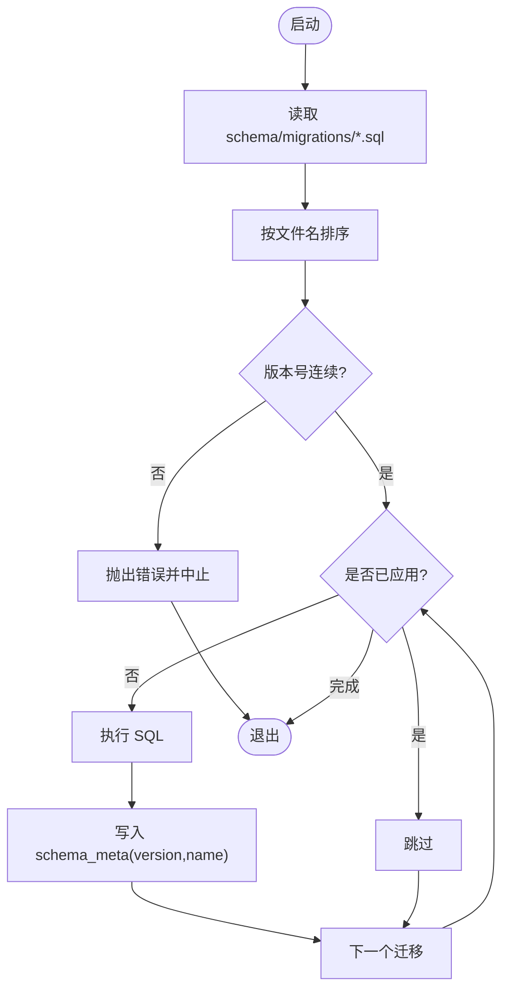
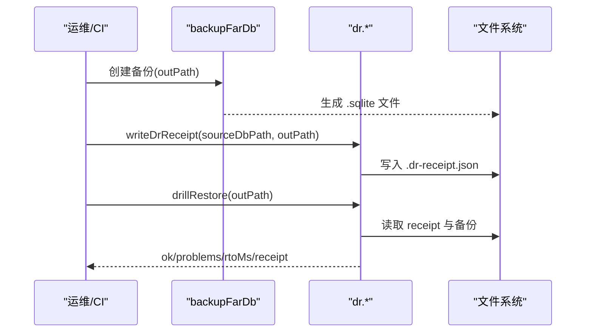
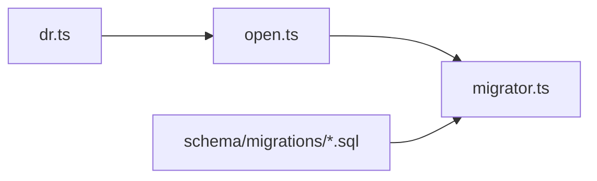

# 数据库设计

<cite>
**本文引用的文件**
- [schema/migrations/0001_initial.sql](file://schema/migrations/0001_initial.sql)
- [schema/migrations/0009_fec_contracts_v2.sql](file://schema/migrations/0009_fec_contracts_v2.sql)
- [schema/migrations/0010_proof_envelopes_v2.sql](file://schema/migrations/0010_proof_envelopes_v2.sql)
- [schema/migrations/0015_far_blob_store.sql](file://schema/migrations/0015_far_blob_store.sql)
- [schema/migrations/0016_evidence_derivable.sql](file://schema/migrations/0016_evidence_derivable.sql)
- [schema/migrations/0017_evidence_provenance_class.sql](file://schema/migrations/0017_evidence_provenance_class.sql)
- [schema/migrations/0021_lifecycle_events.sql](file://schema/migrations/0021_lifecycle_events.sql)
- [schema/migrations/README.md](file://schema/migrations/README.md)
- [src/db/open.ts](file://src/db/open.ts)
- [src/db/migrator.ts](file://src/db/migrator.ts)
- [src/db/index.ts](file://src/db/index.ts)
- [src/db/dr.ts](file://src/db/dr.ts)
</cite>

## 目录
1. [简介](#简介)
2. [项目结构](#项目结构)
3. [核心组件](#核心组件)
4. [架构总览](#架构总览)
5. [详细组件分析](#详细组件分析)
6. [依赖关系分析](#依赖关系分析)
7. [性能与索引优化](#性能与索引优化)
8. [数据完整性与业务规则](#数据完整性与业务规则)
9. [缓存机制与性能优化](#缓存机制与性能优化)
10. [备份、恢复与灾难恢复](#备份恢复与灾难恢复)
11. [数据访问模式与ORM使用指南](#数据访问模式与orm使用指南)
12. [大规模数据的分片与归档方案](#大规模数据的分片与归档方案)
13. [监控与维护最佳实践](#监控与维护最佳实践)
14. [一致性保证与并发控制](#一致性保证与并发控制)
15. [结论](#结论)

## 简介
本文件系统性说明基于 SQLite 的关系型数据库架构，覆盖表结构设计、字段定义与约束、迁移与版本管理、索引与查询优化、数据完整性与业务规则、缓存与性能优化、备份恢复与灾难恢复、数据访问模式与 ORM 使用、大规模数据分片与归档、以及监控维护与一致性并发控制等主题。整体设计围绕“可审计、不可篡改、可验证”的证据链与裁决体系展开，通过触发器、CHECK 约束、外键与内容寻址（CAS）等手段在数据库层实现强一致性与防篡改能力。

## 项目结构
数据库相关代码与脚本主要分布在以下位置：
- schema/migrations：按连续编号的 SQL 迁移文件，定义所有表、索引、触发器与初始元数据。
- src/db：数据库打开、迁移执行、DR（灾难恢复）工具模块。
- tests/db：针对迁移、PRAGMA 基线、DR 流程的测试用例。

**图表来源**
- [src/db/open.ts:72-120](file://src/db/open.ts#L72-L120)
- [src/db/migrator.ts:38-78](file://src/db/migrator.ts#L38-L78)
- [schema/migrations/README.md:22-33](file://schema/migrations/README.md#L22-L33)

**章节来源**
- [src/db/open.ts:15-120](file://src/db/open.ts#L15-L120)
- [src/db/migrator.ts:1-136](file://src/db/migrator.ts#L1-L136)
- [schema/migrations/README.md:1-67](file://schema/migrations/README.md#L1-L67)

## 核心组件
- 数据库打开与基线配置：统一入口 openFarDb 强制 WAL、同步级别 FULL、外键开启、busy_timeout 固定，并在写路径进行完整性检查（quick_check/full），失败即 fail-closed。
- 迁移系统：readMigrationFiles 扫描 schema/migrations，runMigrations 顺序执行未应用的迁移，记录 schema_meta；要求版本号连续且从 1 开始。
- DR 工具：backupFarDb 使用 VACUUM INTO 安全备份；dr.* 提供 sha256 校验、表计数锚点、RPO/RTO 实测、保留策略与恢复演练。

**章节来源**
- [src/db/open.ts:18-137](file://src/db/open.ts#L18-L137)
- [src/db/migrator.ts:9-136](file://src/db/migrator.ts#L9-L136)
- [src/db/dr.ts:20-192](file://src/db/dr.ts#L20-L192)

## 架构总览
下图展示从应用到数据库的核心调用链与数据流：

**图表来源**
- [src/db/open.ts:72-120](file://src/db/open.ts#L72-L120)
- [src/db/migrator.ts:38-78](file://src/db/migrator.ts#L38-L78)

## 详细组件分析

### 核心表与关系模型
- call_records：调用记录追加式存储，包含阶段、载荷类型、用途标签、模型标识、请求/响应负载与哈希链字段 prev_hash/current_hash，禁止更新删除。
- evidence_log：证据日志，关联 call_records，支持派生标记 derivable 与 payload hash，来源分类 provenance_class 与系统声明哈希绑定。
- verdict_nodes：裁决节点树，含父节点引用、节点类型、裁决结果、阈值与指标值、冲突证据计数、范围降级原因、重放证明器等，部分字段可更新但受严格触发器保护。
- evidence_edges：裁决边关系，支持 supports/refutes/derives_from/tests/iterates 等边类型，带权重与唯一性约束。
- repro_runs：复现运行记录，关联 verdict/call_record，记录环境哈希、状态与错误详情。
- fec_contracts_v2：冻结契约 V2，完整 JSON 存储与 fec_hash 校验，编译者固定为确定性编译器。
- proof_envelopes_v2：证据信封 V2，schema_version 固定，proof_hash/fec_hash/ledger_root 长度校验，anti-theater 触发器阻止 WARN/FAIL 下 CONFIRMED。
- far_blob_store：内容寻址 CAS 表，hash 主键、content 文本、size_bytes 非负，追加式存储。
- lifecycle_events：生命周期事件（撤回/纠正/替代），目标种类与状态机迁移记录，事件级哈希链。

**图表来源**
- [schema/migrations/0001_initial.sql:10-245](file://schema/migrations/0001_initial.sql#L10-L245)
- [schema/migrations/0009_fec_contracts_v2.sql:25-53](file://schema/migrations/0009_fec_contracts_v2.sql#L25-L53)
- [schema/migrations/0010_proof_envelopes_v2.sql:20-66](file://schema/migrations/0010_proof_envelopes_v2.sql#L20-L66)
- [schema/migrations/0015_far_blob_store.sql:22-43](file://schema/migrations/0015_far_blob_store.sql#L22-L43)
- [schema/migrations/0016_evidence_derivable.sql:27-32](file://schema/migrations/0016_evidence_derivable.sql#L27-L32)
- [schema/migrations/0017_evidence_provenance_class.sql:27-33](file://schema/migrations/0017_evidence_provenance_class.sql#L27-L33)
- [schema/migrations/0021_lifecycle_events.sql:21-52](file://schema/migrations/0021_lifecycle_events.sql#L21-L52)

**章节来源**
- [schema/migrations/0001_initial.sql:1-245](file://schema/migrations/0001_initial.sql#L1-L245)
- [schema/migrations/0009_fec_contracts_v2.sql:1-54](file://schema/migrations/0009_fec_contracts_v2.sql#L1-L54)
- [schema/migrations/0010_proof_envelopes_v2.sql:1-67](file://schema/migrations/0010_proof_envelopes_v2.sql#L1-L67)
- [schema/migrations/0015_far_blob_store.sql:1-44](file://schema/migrations/0015_far_blob_store.sql#L1-L44)
- [schema/migrations/0016_evidence_derivable.sql:1-33](file://schema/migrations/0016_evidence_derivable.sql#L1-L33)
- [schema/migrations/0017_evidence_provenance_class.sql:1-34](file://schema/migrations/0017_evidence_provenance_class.sql#L1-L34)
- [schema/migrations/0021_lifecycle_events.sql:1-53](file://schema/migrations/0021_lifecycle_events.sql#L1-L53)

### 迁移与版本管理
- 文件名规范：四位数字前缀加描述，如 0001_initial.sql。
- 连续性校验：运行时断言版本号必须从 1 开始且连续，防止空洞或重复。
- 执行策略：仅向前（forward-only），无 down 回滚；每次执行后向 schema_meta 插入版本与名称。
- 元数据表：schema_meta 由 migrator 确保存在，记录 version/name/applied_at。

**图表来源**
- [src/db/migrator.ts:93-136](file://src/db/migrator.ts#L93-L136)
- [schema/migrations/README.md:22-33](file://schema/migrations/README.md#L22-L33)

**章节来源**
- [src/db/migrator.ts:1-136](file://src/db/migrator.ts#L1-L136)
- [schema/migrations/README.md:1-67](file://schema/migrations/README.md#L1-L67)

### 数据完整性与业务规则（触发器与约束）
- 追加式表：call_records、evidence_log、repro_runs、far_blob_store、lifecycle_events 均通过 BEFORE UPDATE/DELETE 触发器禁止修改与删除，保障审计链不可变。
- 枚举与范围约束：payload_kind/purpose_tag/finish_reason/node_kind/verdict/edge_kind/status/provenance_class/scheme_version 等列使用 CHECK 限制取值。
- 业务规则触发器：
  - verdict_nodes 仅允许特定字段更新，禁止终态回滚（CONFIRMED/REFUTED 不可变更）。
  - DEGRADED_SCOPE 与 UNTESTED 需要非空原因字段。
  - CONFIRMED 判决需存在非空 evidence_payload 的证据记录。
  - proof_envelopes_v2 中 anti-theater 报告为 WARN/FAIL 时禁止 CONFIRMED。
  - fec_contracts_v2 锁定编译者为确定性编译器，fec_hash 长度校验。
- 外键约束：evidence_log 引用 call_records，verdict_nodes 引用 evidence_log，evidence_edges 引用 verdict_nodes，repro_runs 引用 verdict/call_record。

**章节来源**
- [schema/migrations/0001_initial.sql:48-185](file://schema/migrations/0001_initial.sql#L48-L185)
- [schema/migrations/0010_proof_envelopes_v2.sql:55-66](file://schema/migrations/0010_proof_envelopes_v2.sql#L55-L66)
- [schema/migrations/0009_fec_contracts_v2.sql:40-53](file://schema/migrations/0009_fec_contracts_v2.sql#L40-L53)
- [schema/migrations/0015_far_blob_store.sql:31-43](file://schema/migrations/0015_far_blob_store.sql#L31-L43)
- [schema/migrations/0021_lifecycle_events.sql:40-52](file://schema/migrations/0021_lifecycle_events.sql#L40-L52)

### 索引设计与查询优化
- 高频查询字段建立索引：
  - call_records：stage_id、payload_kind、model_id、dashscope_request_id、purpose_tag。
  - evidence_log：call_record_seq、stage_id、payload_kind、source_anchor_git、source_anchor_req、derivable、provenance_class。
  - verdict_nodes：evidence_id、parent_verdict_id、node_kind、verdict。
  - evidence_edges：from_node、to_node、edge_kind，唯一索引 (from_node, to_node, edge_kind)。
  - repro_runs：verdict_id、call_record_seq、repro_hash、status。
  - proof_envelopes_v2：claim_id、conclusion、fec_hash、proof_hash。
  - far_blob_store：created_at。
  - lifecycle_events：target_kind、target_id。
- 建议：
  - 对多列联合查询增加复合索引（如 verdict_nodes 的 node_kind+verdict）。
  - 避免在 TEXT 大字段上建索引；必要时使用生成列或外部索引表。
  - 定期 ANALYZE 以优化查询计划（SQLite 中可通过 pragma 或工具辅助）。

**章节来源**
- [schema/migrations/0001_initial.sql:42-46](file://schema/migrations/0001_initial.sql#L42-L46)
- [schema/migrations/0001_initial.sql:79-83](file://schema/migrations/0001_initial.sql#L79-L83)
- [schema/migrations/0001_initial.sql:123-126](file://schema/migrations/0001_initial.sql#L123-L126)
- [schema/migrations/0001_initial.sql:203-207](file://schema/migrations/0001_initial.sql#L203-L207)
- [schema/migrations/0001_initial.sql:227-229](file://schema/migrations/0001_initial.sql#L227-L229)
- [schema/migrations/0010_proof_envelopes_v2.sql:37-40](file://schema/migrations/0010_proof_envelopes_v2.sql#L37-L40)
- [schema/migrations/0015_far_blob_store.sql:29](file://schema/migrations/0015_far_blob_store.sql#L29)
- [schema/migrations/0016_evidence_derivable.sql:30](file://schema/migrations/0016_evidence_derivable.sql#L30)
- [schema/migrations/0017_evidence_provenance_class.sql:31](file://schema/migrations/0017_evidence_provenance_class.sql#L31)
- [schema/migrations/0021_lifecycle_events.sql:38](file://schema/migrations/0021_lifecycle_events.sql#L38)

### 数据访问模式与 ORM 使用指南
- 直接 SQL 访问：通过 better-sqlite3 提供的 Database API 执行查询与事务；迁移与打开逻辑集中在 src/db。
- 推荐模式：
  - 使用事务包裹关键写入（如 appendRecord 系列），确保原子性与一致性。
  - 利用 prepared statements 防止注入与提升性能。
  - 对追加式表仅 INSERT，不尝试 UPDATE/DELETE（触发器会拒绝）。
  - 读取只读路径时使用 readonly=true 并关闭迁移以避免写操作。
- ORM 适配：
  - 本项目未内置 ORM；可在上层封装轻量映射层，将行对象转换为领域模型。
  - 注意保持与触发器与约束一致的写入路径（例如 verdict_nodes 仅允许更新 verdict/metric_value/updated_at）。

**章节来源**
- [src/db/open.ts:72-120](file://src/db/open.ts#L72-L120)
- [src/db/migrator.ts:38-78](file://src/db/migrator.ts#L38-L78)

### 缓存机制与性能优化
- 数据库级缓存：
  - WAL 模式提高并发读写性能与崩溃恢复能力。
  - synchronous=FULL 确保持久化强度，配合 busy_timeout=5000ms 降低忙锁失败概率。
- 应用级缓存：
  - 对于频繁读取的静态配置或枚举，可在进程内缓存（注意失效策略）。
  - 对计算密集型查询结果可考虑短期内存缓存（注意内存占用与一致性）。
- 查询优化：
  - 使用 EXPLAIN QUERY PLAN 分析执行计划。
  - 避免 SELECT *，仅选择必要列。
  - 合理使用 LIMIT/OFFSET 或游标分页。

**章节来源**
- [src/db/open.ts:50-66](file://src/db/open.ts#L50-L66)
- [src/db/open.ts:84-98](file://src/db/open.ts#L84-L98)

### 备份、恢复与灾难恢复
- 备份：
  - 使用 backupFarDb 的 VACUUM INTO 生成一致快照，禁止文件级拷贝。
  - 输出路径不得与源库相同。
- 恢复演练：
  - drillRestore 执行三关：sha256 校验、quick_check 完整性、表计数对拍。
  - 无 receipt 视为未演练备份，不能作为可靠性证据。
- 保留策略：
  - applyRetention 按 receipt.createdAt 新→旧保留前 N 份，成对删除备份与 receipt。
- RPO/RTO：
  - rpoSeconds 基于最近两份 receipt 的时间差计算。
  - rtoMs 记录演练耗时，用于评估恢复时间目标。

**图表来源**
- [src/db/open.ts:123-130](file://src/db/open.ts#L123-L130)
- [src/db/dr.ts:101-166](file://src/db/dr.ts#L101-L166)

**章节来源**
- [src/db/open.ts:123-130](file://src/db/open.ts#L123-L130)
- [src/db/dr.ts:20-192](file://src/db/dr.ts#L20-L192)

### 大规模数据的分片与归档方案
- 当前架构未内置水平分片；建议在应用层按时间或主题进行物理拆分（多数据库实例或目录隔离）。
- 归档策略：
  - 对历史证据与裁决节点按时间窗口导出为只读副本（VACUUM INTO）。
  - 使用 far_blob_store 的内容寻址特性对大对象去重存储，减少冗余。
  - 结合 lifecycle_events 记录归档事件（target_kind/target_id/from_state/to_state）。
- 查询优化：
  - 热点表与冷数据分离，热表保持较小体积以提升性能。
  - 对跨分片查询采用聚合视图或外部索引服务。

[本节为概念性说明，不直接分析具体文件]

### 监控与维护最佳实践
- 启动期检查：
  - openFarDb 默认 quick_check，可切换 full 进行深度检查；失败立即 fail-closed。
- 运行期监控：
  - 监控 WAL 文件大小与增长趋势，及时清理或轮转。
  - 关注 busy_timeout 超时频率，必要时调整或优化查询。
- 维护任务：
  - 定期运行 VACUUM（谨慎评估影响）以减少碎片。
  - 检查 schema_meta 与实际迁移文件的一致性。
  - 定期执行 DR 演练并记录 RPO/RTO。

**章节来源**
- [src/db/open.ts:100-115](file://src/db/open.ts#L100-L115)
- [src/db/dr.ts:129-166](file://src/db/dr.ts#L129-L166)

### 一致性保证与并发控制
- 一致性：
  - 外键约束确保引用完整性。
  - 触发器与 CHECK 约束在数据库层强制执行业务规则。
  - 哈希链（prev_hash/current_hash）保障证据与裁决的不可篡改性。
- 并发控制：
  - WAL 模式支持并发读与有限并发写。
  - busy_timeout=5000ms 降低忙锁冲突导致的失败。
  - 对高并发写入场景，建议批处理与事务合并减少锁竞争。

**章节来源**
- [schema/migrations/0001_initial.sql:1-3](file://schema/migrations/0001_initial.sql#L1-L3)
- [src/db/open.ts:50-66](file://src/db/open.ts#L50-L66)

## 依赖关系分析
- 模块耦合：
  - open.ts 依赖 migrator.ts 执行迁移。
  - dr.ts 依赖 open.ts 打开数据库进行表计数与完整性检查。
  - 迁移文件之间通过 schema_meta 版本串联，确保顺序执行。
- 外部依赖：
  - better-sqlite3 提供数据库连接与 PRAGMA 操作。
  - Node.js fs/crypto 用于文件操作与 SHA256 计算。

**图表来源**
- [src/db/open.ts:15-17](file://src/db/open.ts#L15-L17)
- [src/db/migrator.ts:1-6](file://src/db/migrator.ts#L1-L6)
- [src/db/dr.ts:18-19](file://src/db/dr.ts#L18-L19)

**章节来源**
- [src/db/open.ts:1-137](file://src/db/open.ts#L1-L137)
- [src/db/migrator.ts:1-136](file://src/db/migrator.ts#L1-L136)
- [src/db/dr.ts:1-192](file://src/db/dr.ts#L1-L192)

## 性能与索引优化
- 索引策略：
  - 对高频过滤与连接字段建立单列或复合索引。
  - 对枚举类字段（如 verdict、status）建立索引以加速统计查询。
- 查询优化：
  - 避免全表扫描，使用 WHERE 条件与索引。
  - 对大结果集使用分页与投影。
- 存储优化：
  - 使用 far_blob_store 存储大对象，避免在主表中膨胀。
  - 定期分析表大小与索引效率。

**章节来源**
- [schema/migrations/0001_initial.sql:42-46](file://schema/migrations/0001_initial.sql#L42-L46)
- [schema/migrations/0010_proof_envelopes_v2.sql:37-40](file://schema/migrations/0010_proof_envelopes_v2.sql#L37-L40)
- [schema/migrations/0015_far_blob_store.sql:22-29](file://schema/migrations/0015_far_blob_store.sql#L22-L29)

## 数据完整性与业务规则
- 追加式存储：
  - call_records、evidence_log、repro_runs、far_blob_store、lifecycle_events 禁止更新与删除。
- 枚举与范围：
  - 多列使用 CHECK 限制取值，防止非法状态。
- 业务规则：
  - verdict_nodes 的终态不可回滚，DEGRADED_SCOPE/UNTESTED 需要原因。
  - CONFIRMED 需有非空证据。
  - proof_envelopes_v2 的 anti-theater 报告限制 CONFIRMED。
  - fec_contracts_v2 的编译者与哈希长度校验。

**章节来源**
- [schema/migrations/0001_initial.sql:48-185](file://schema/migrations/0001_initial.sql#L48-L185)
- [schema/migrations/0010_proof_envelopes_v2.sql:55-66](file://schema/migrations/0010_proof_envelopes_v2.sql#L55-L66)
- [schema/migrations/0009_fec_contracts_v2.sql:40-53](file://schema/migrations/0009_fec_contracts_v2.sql#L40-L53)

## 缓存机制与性能优化
- 数据库级：
  - WAL 与 synchronous=FULL 提升性能与安全性。
  - busy_timeout 降低忙锁失败。
- 应用级：
  - 进程内缓存静态数据。
  - 查询结果短期缓存（注意一致性）。
- 查询优化：
  - 使用 EXPLAIN 分析计划。
  - 避免 SELECT *，使用投影与分页。

**章节来源**
- [src/db/open.ts:50-66](file://src/db/open.ts#L50-L66)
- [src/db/open.ts:84-98](file://src/db/open.ts#L84-L98)

## 备份、恢复与灾难恢复
- 备份：
  - VACUUM INTO 生成一致快照。
  - 禁止同路径覆盖。
- 恢复演练：
  - 三关校验：sha256、quick_check、表计数。
  - 无 receipt 视为未演练。
- 保留策略：
  - 按 receipt.createdAt 保留最新 N 份。
- RPO/RTO：
  - rpoSeconds 基于最近两份 receipt。
  - rtoMs 记录演练耗时。

**章节来源**
- [src/db/open.ts:123-130](file://src/db/open.ts#L123-L130)
- [src/db/dr.ts:101-166](file://src/db/dr.ts#L101-L166)

## 数据访问模式与 ORM 使用指南
- 直接 SQL：
  - 使用 better-sqlite3 的 prepare/execute。
  - 事务包裹关键写入。
- ORM 适配：
  - 封装轻量映射层。
  - 遵循触发器与约束的写入路径。

**章节来源**
- [src/db/open.ts:72-120](file://src/db/open.ts#L72-L120)
- [src/db/migrator.ts:38-78](file://src/db/migrator.ts#L38-L78)

## 大规模数据的分片与归档方案
- 物理拆分：
  - 按时间或主题拆分数据库实例。
- 归档：
  - 导出历史数据为只读副本。
  - 使用 far_blob_store 去重大对象。
- 查询：
  - 热点与冷数据分离。
  - 跨分片查询使用聚合视图。

[本节为概念性说明，不直接分析具体文件]

## 监控与维护最佳实践
- 启动检查：
  - quick_check/full 完整性检查。
- 运行监控：
  - WAL 文件大小与增长。
  - busy_timeout 超时频率。
- 维护：
  - 定期 VACUUM。
  - 检查 schema_meta 与迁移文件一致性。
  - 定期 DR 演练。

**章节来源**
- [src/db/open.ts:100-115](file://src/db/open.ts#L100-L115)
- [src/db/dr.ts:129-166](file://src/db/dr.ts#L129-L166)

## 一致性保证与并发控制
- 一致性：
  - 外键约束与触发器强制执行规则。
  - 哈希链保障不可篡改。
- 并发：
  - WAL 支持并发读与有限写。
  - busy_timeout 降低冲突失败。
  - 批处理与事务合并减少锁竞争。

**章节来源**
- [schema/migrations/0001_initial.sql:1-3](file://schema/migrations/0001_initial.sql#L1-L3)
- [src/db/open.ts:50-66](file://src/db/open.ts#L50-L66)

## 结论
本数据库设计通过严格的迁移管理、追加式存储、触发器与约束、内容寻址 CAS、以及完善的备份恢复与 DR 演练机制，构建了高可信、可审计、可验证的证据链与裁决体系。未来可扩展分片与归档策略以应对大规模数据需求，同时持续优化索引与查询性能，确保系统在高性能与高可靠性之间取得平衡。