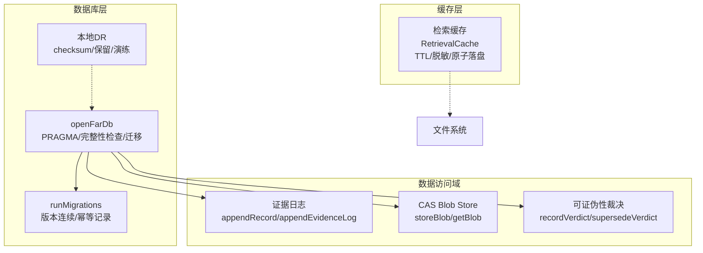
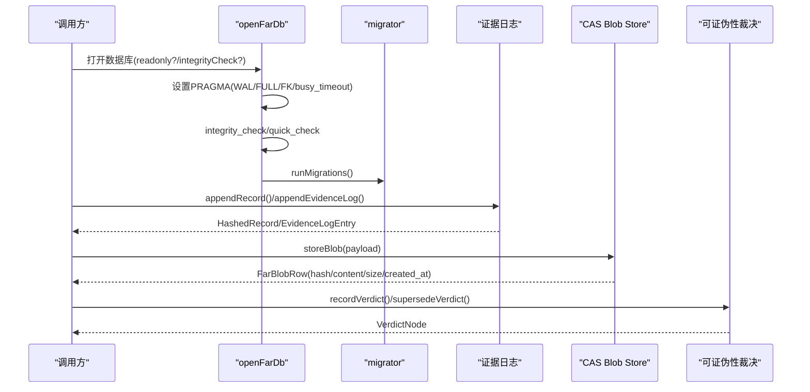
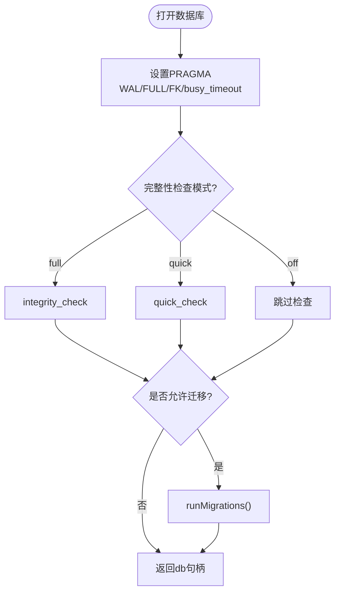
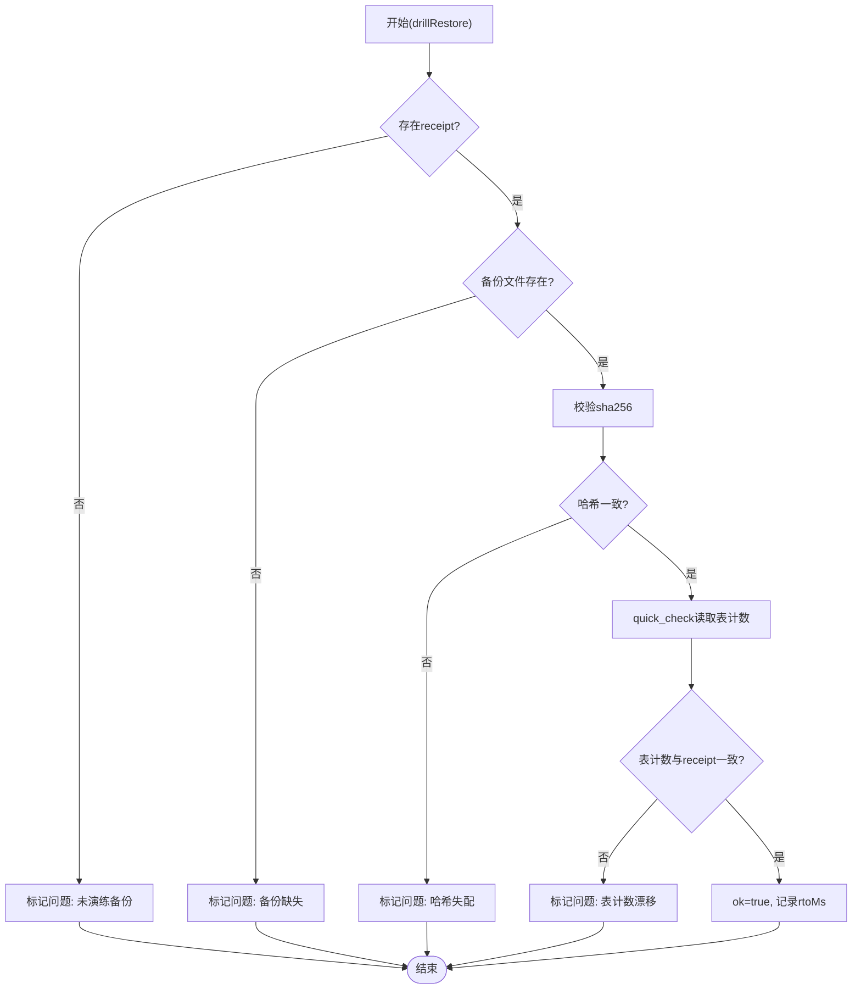
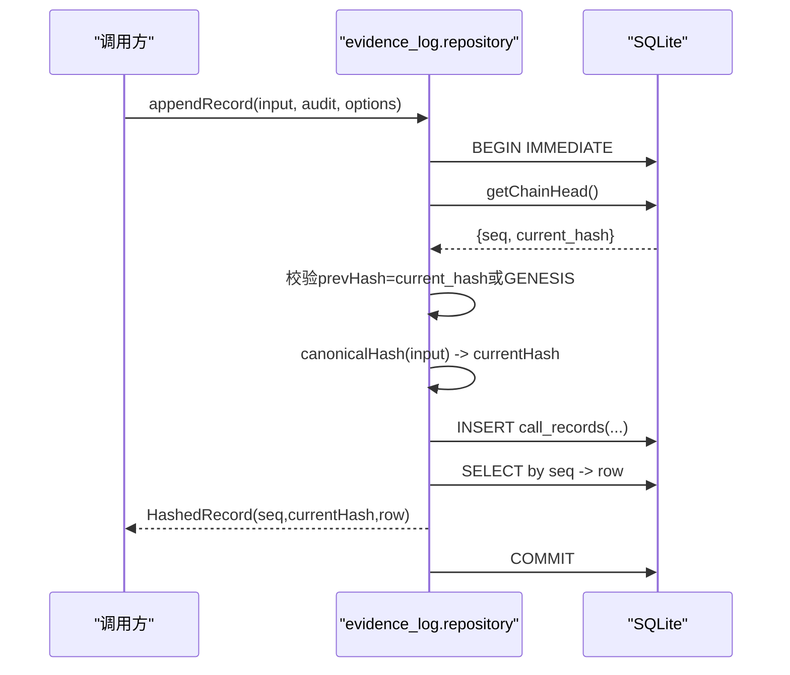
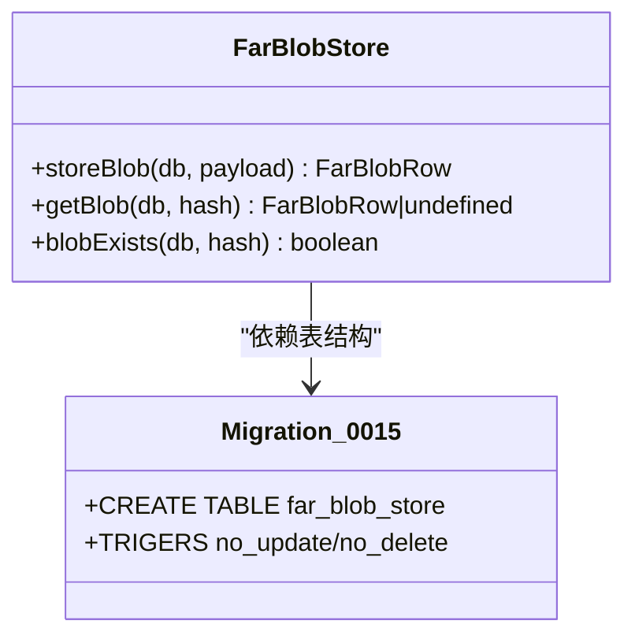
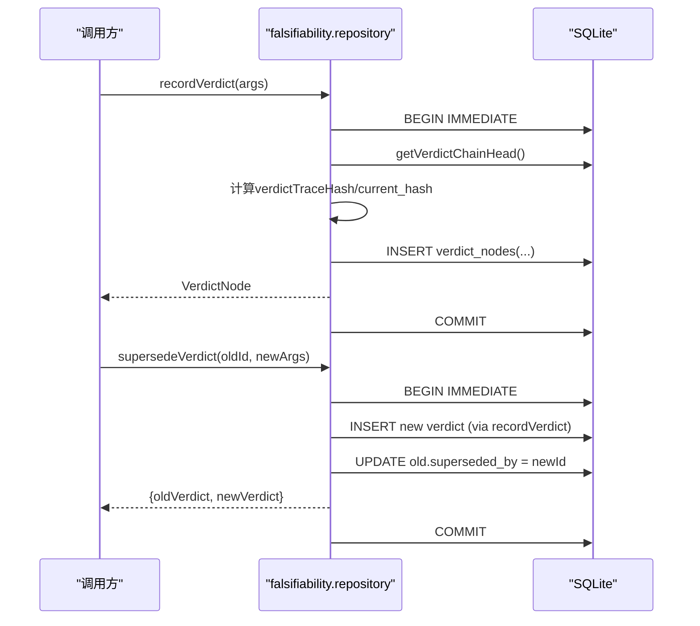
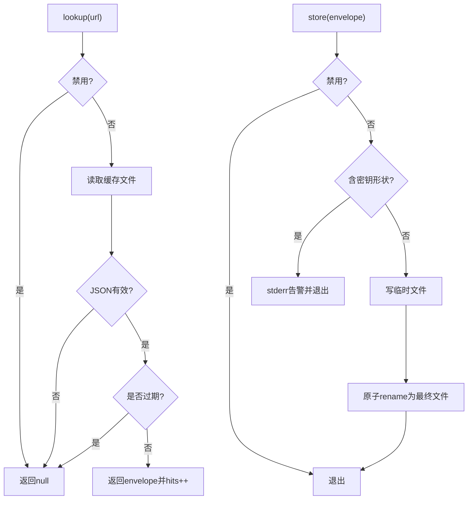
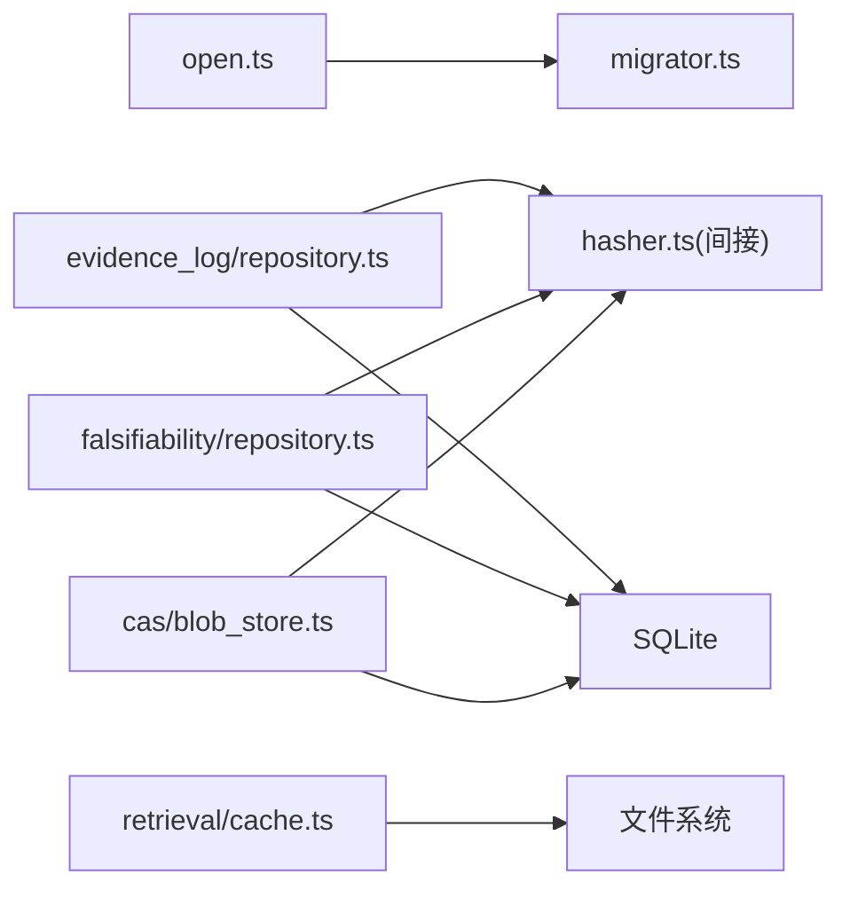

# 数据访问层

<cite>
**本文引用的文件**
- [src/db/open.ts](file://src/db/open.ts)
- [src/db/migrator.ts](file://src/db/migrator.ts)
- [src/db/index.ts](file://src/db/index.ts)
- [src/db/dr.ts](file://src/db/dr.ts)
- [src/cas/blob_store.ts](file://src/cas/blob_store.ts)
- [src/cas/index.ts](file://src/cas/index.ts)
- [src/evidence_log/repository.ts](file://src/evidence_log/repository.ts)
- [src/evidence_log/index.ts](file://src/evidence_log/index.ts)
- [src/falsifiability/repository.ts](file://src/falsifiability/repository.ts)
- [schema/migrations/0015_far_blob_store.sql](file://schema/migrations/0015_far_blob_store.sql)
- [src/retrieval/cache.ts](file://src/retrieval/cache.ts)
</cite>

## 目录
1. [简介](#简介)
2. [项目结构](#项目结构)
3. [核心组件](#核心组件)
4. [架构总览](#架构总览)
5. [详细组件分析](#详细组件分析)
6. [依赖关系分析](#依赖关系分析)
7. [性能考虑](#性能考虑)
8. [故障排查指南](#故障排查指南)
9. [结论](#结论)
10. [附录](#附录)

## 简介
本文件系统性梳理 FAR-Lab 的数据访问层，围绕以下目标展开：
- 数据仓库（DR）模式在本项目的实现与使用方式
- Blob 存储系统（内容寻址 CAS）的设计与文件管理策略
- 证据日志与可证伪性裁决的持久化接口
- 事务处理与并发控制机制
- 缓存策略与性能优化方案
- 连接池管理与资源清理机制
- 数据访问最佳实践与常见陷阱

FAR-Lab 以 SQLite 为核心持久化引擎，通过统一的数据库打开入口、迁移框架、以及面向业务域的数据访问模块（证据日志、CAS、可证伪性裁决等），构建出强一致、可审计、可恢复的数据访问体系。

## 项目结构
数据访问相关代码主要分布在以下目录：
- src/db：数据库统一打开、迁移、本地 DR（备份/保留/演练）
- src/cas：内容寻址 Blob 存储（CAS）
- src/evidence_log：证据日志链式追加、校验与检索
- src/falsifiability：可证伪性裁决节点写入与重评（supersede）
- schema/migrations：数据库迁移脚本
- src/retrieval/cache：检索响应持久化缓存（内容寻址、TTL、脱敏）

图表来源
- [src/db/open.ts:72-120](file://src/db/open.ts#L72-L120)
- [src/db/migrator.ts:38-78](file://src/db/migrator.ts#L38-L78)
- [src/db/dr.ts:102-118](file://src/db/dr.ts#L102-L118)
- [src/evidence_log/repository.ts:94-165](file://src/evidence_log/repository.ts#L94-L165)
- [src/cas/blob_store.ts:31-44](file://src/cas/blob_store.ts#L31-L44)
- [src/falsifiability/repository.ts:73-153](file://src/falsifiability/repository.ts#L73-L153)
- [src/retrieval/cache.ts:99-166](file://src/retrieval/cache.ts#L99-L166)

章节来源
- [src/db/open.ts:72-120](file://src/db/open.ts#L72-L120)
- [src/db/migrator.ts:38-78](file://src/db/migrator.ts#L38-L78)
- [src/db/dr.ts:102-118](file://src/db/dr.ts#L102-L118)
- [src/evidence_log/repository.ts:94-165](file://src/evidence_log/repository.ts#L94-L165)
- [src/cas/blob_store.ts:31-44](file://src/cas/blob_store.ts#L31-L44)
- [src/falsifiability/repository.ts:73-153](file://src/falsifiability/repository.ts#L73-L153)
- [src/retrieval/cache.ts:99-166](file://src/retrieval/cache.ts#L99-L166)

## 核心组件
- 数据库统一入口与基线配置：openFarDb 负责 WAL、同步策略、外键约束、busy_timeout 设置，并在启动时执行完整性检查与迁移；提供 VACUUM INTO 安全备份能力。
- 迁移框架：按版本号顺序扫描并应用 SQL 迁移，维护 schema_meta 记录，确保版本连续性与幂等。
- 本地 DR（Data Repository）：生成 .dr-receipt.json 收据，包含 sha256、表计数快照、RPO/RTO 指标；支持保留策略与恢复演练（哈希校验、quick_check、表计数对拍）。
- 证据日志：链式 appendRecord/appendEvidenceLog，基于 prev_hash/current_hash 保证链完整；使用 IMMEDIATE 事务避免跨进程 TOCTOU 分叉。
- CAS Blob Store：内容寻址存储，hash=sha256(canonical JSON)，INSERT OR IGNORE 去重，触发器禁止 UPDATE/DELETE，保障 append-only。
- 可证伪性裁决：recordVerdict/supersedeVerdict 写入裁决节点，计算 current_hash，支持旧裁决被新裁决覆盖（superseded_by），同样采用 IMMEDIATE 事务。
- 检索缓存：按 URL 内容寻址落盘，带 TTL 与密钥形状检测，原子写入（临时文件+rename）。

章节来源
- [src/db/open.ts:72-120](file://src/db/open.ts#L72-L120)
- [src/db/migrator.ts:38-78](file://src/db/migrator.ts#L38-L78)
- [src/db/dr.ts:102-118](file://src/db/dr.ts#L102-L118)
- [src/evidence_log/repository.ts:94-165](file://src/evidence_log/repository.ts#L94-L165)
- [src/cas/blob_store.ts:31-44](file://src/cas/blob_store.ts#L31-L44)
- [src/falsifiability/repository.ts:73-153](file://src/falsifiability/repository.ts#L73-L153)
- [src/retrieval/cache.ts:99-166](file://src/retrieval/cache.ts#L99-L166)

## 架构总览
数据访问层由“数据库基线 + 迁移 + 领域数据访问 + 缓存”构成。所有写路径均通过 openFarDb 获取一致的 PRAGMA 配置与完整性保障；各域数据访问模块在事务内完成链头读取与写入，确保并发安全；CAS 与证据日志分别提供内容寻址与链式完整性；检索缓存作为旁路加速层，遵循内容寻址与 TTL 策略。

图表来源
- [src/db/open.ts:72-120](file://src/db/open.ts#L72-L120)
- [src/db/migrator.ts:38-78](file://src/db/migrator.ts#L38-L78)
- [src/evidence_log/repository.ts:94-165](file://src/evidence_log/repository.ts#L94-L165)
- [src/cas/blob_store.ts:31-44](file://src/cas/blob_store.ts#L31-L44)
- [src/falsifiability/repository.ts:73-153](file://src/falsifiability/repository.ts#L73-L153)

## 详细组件分析

### 数据库统一入口与迁移（open.ts / migrator.ts）
- 统一打开：强制 WAL、synchronous=FULL、foreign_keys=ON、busy_timeout=5000ms；可选 full/quick/off 完整性检查；只读模式不执行 PRAGMA 与迁移。
- 安全备份：VACUUM INTO 替代文件级拷贝，避免不一致。
- 迁移：按文件名编号顺序执行，记录 schema_meta，要求版本连续且已应用迁移不可重复执行。

图表来源
- [src/db/open.ts:72-120](file://src/db/open.ts#L72-L120)
- [src/db/migrator.ts:38-78](file://src/db/migrator.ts#L38-L78)

章节来源
- [src/db/open.ts:72-120](file://src/db/open.ts#L72-L120)
- [src/db/migrator.ts:38-78](file://src/db/migrator.ts#L38-L78)

### 本地 DR（备份/保留/演练）（dr.ts）
- 收据生成：备份完成后写入 .dr-receipt.json，包含 sha256、大小、创建时间、源库表计数快照、RPO（距上一份 receipt 的时间差）。
- 恢复演练：校验收据存在、哈希一致、备份可读（quick_check）、表计数与收据一致；无收据视为未演练备份。
- 保留策略：按 receipt.createdAt 排序，仅保留最近 keep 份，成对删除备份与收据。

图表来源
- [src/db/dr.ts:133-166](file://src/db/dr.ts#L133-L166)

章节来源
- [src/db/dr.ts:102-118](file://src/db/dr.ts#L102-L118)
- [src/db/dr.ts:133-166](file://src/db/dr.ts#L133-L166)
- [src/db/dr.ts:174-191](file://src/db/dr.ts#L174-L191)

### 证据日志（repository.ts）
- 链式追加：appendRecord 读取链头（getChainHead），校验传入 prevHash 与链头一致，计算 currentHash 后插入 call_records；appendEvidenceLog 将证据 payload 规范化并可选择记录 evidence_payload_hash（derivable=1）。
- 并发控制：使用 db.transaction().immediate() 获取 RESERVED 写锁，防止跨进程 TOCTOU 导致两条记录接同一 prevHash 的分叉。
- 数据校验：严格解析枚举、SourceAnchor、ProvenanceClass 等字段，失败即抛错（fail-closed）。

图表来源
- [src/evidence_log/repository.ts:94-165](file://src/evidence_log/repository.ts#L94-L165)

章节来源
- [src/evidence_log/repository.ts:94-165](file://src/evidence_log/repository.ts#L94-L165)
- [src/evidence_log/repository.ts:193-258](file://src/evidence_log/repository.ts#L193-L258)

### CAS Blob Store（blob_store.ts + 0015 迁移）
- 设计要点：hash = sha256(canonical JSON of payload)；同内容幂等写入（INSERT OR IGNORE）；触发器禁止 UPDATE/DELETE，保障 append-only。
- 接口：storeBlob 返回完整行（hash/content/size_bytes/created_at）；getBlob 按 hash 查询；blobExists 判断存在性。

图表来源
- [src/cas/blob_store.ts:31-44](file://src/cas/blob_store.ts#L31-L44)
- [schema/migrations/0015_far_blob_store.sql:22-41](file://schema/migrations/0015_far_blob_store.sql#L22-L41)

章节来源
- [src/cas/blob_store.ts:31-44](file://src/cas/blob_store.ts#L31-L44)
- [schema/migrations/0015_far_blob_store.sql:22-41](file://schema/migrations/0015_far_blob_store.sql#L22-L41)

### 可证伪性裁决（falsifiability/repository.ts）
- 写入裁决：recordVerdict 计算 verdictTraceHash 与 current_hash，写入 verdict_nodes；CONFIRMED 需关联存在的证据（非空 evidence_payload）。
- 重评覆盖：supersedeVerdict 在同一事务中写入新裁决并更新旧裁决 superseded_by，保持旧链完整性不变。
- 并发控制：同样使用 IMMEDIATE 事务，避免链头竞争。

图表来源
- [src/falsifiability/repository.ts:73-153](file://src/falsifiability/repository.ts#L73-L153)
- [src/falsifiability/repository.ts:196-217](file://src/falsifiability/repository.ts#L196-L217)

章节来源
- [src/falsifiability/repository.ts:73-153](file://src/falsifiability/repository.ts#L73-L153)
- [src/falsifiability/repository.ts:196-217](file://src/falsifiability/repository.ts#L196-L217)

### 检索缓存（retrieval/cache.ts）
- 内容寻址：文件名 = sha256(url).json，用户文本不会进入路径段。
- TTL 策略：按 host 设定不同 TTL（arXiv 7天、OpenAlex 24小时、Crossref 48小时），默认 24 小时。
- 安全：写入前检测密钥形状（sk-、ghp_、AKIA、PEM、Bearer 等），命中则拒绝落盘并告警。
- 原子落盘：先写临时文件再 rename，兼容 Windows 文件锁定场景。

图表来源
- [src/retrieval/cache.ts:117-166](file://src/retrieval/cache.ts#L117-L166)

章节来源
- [src/retrieval/cache.ts:99-166](file://src/retrieval/cache.ts#L99-L166)

## 依赖关系分析
- open.ts 依赖 migrator.ts 进行迁移；各数据访问模块依赖 openFarDb 提供的数据库句柄。
- evidence_log 与 falsifiability 共享 hasher 与类型定义，确保哈希一致性。
- CAS 与证据日志正交：前者按内容 hash 去重，后者按链式 prev_hash 维持审计链。
- 检索缓存独立于数据库，使用文件系统持久化，降低网络开销。

图表来源
- [src/db/open.ts:72-120](file://src/db/open.ts#L72-L120)
- [src/evidence_log/repository.ts:94-165](file://src/evidence_log/repository.ts#L94-L165)
- [src/falsifiability/repository.ts:73-153](file://src/falsifiability/repository.ts#L73-L153)
- [src/cas/blob_store.ts:31-44](file://src/cas/blob_store.ts#L31-L44)
- [src/retrieval/cache.ts:99-166](file://src/retrieval/cache.ts#L99-L166)

章节来源
- [src/db/open.ts:72-120](file://src/db/open.ts#L72-L120)
- [src/evidence_log/repository.ts:94-165](file://src/evidence_log/repository.ts#L94-L165)
- [src/falsifiability/repository.ts:73-153](file://src/falsifiability/repository.ts#L73-L153)
- [src/cas/blob_store.ts:31-44](file://src/cas/blob_store.ts#L31-L44)
- [src/retrieval/cache.ts:99-166](file://src/retrieval/cache.ts#L99-L166)

## 性能考虑
- 数据库层面：
  - WAL 模式提升并发读性能，配合 synchronous=FULL 保证崩溃恢复一致性。
  - busy_timeout=5000ms 缓解短暂锁争用导致的 SQLITE_BUSY。
  - 迁移阶段启用 foreign_keys，确保引用完整性。
- 事务与并发：
  - 证据日志与裁决写入均采用 IMMEDIATE 事务，避免跨进程 TOCTOU 分叉。
  - 链头读取与写入在同一事务内，保证原子性。
- 缓存与去重：
  - CAS 通过内容寻址与 INSERT OR IGNORE 减少重复写入。
  - 检索缓存按 host 设置合理 TTL，减少重复网络请求。
- 磁盘 IO：
  - 证据日志与裁决使用紧凑 JSON 序列化与哈希绑定，减少冗余。
  - 缓存写入采用临时文件+rename 的原子操作，降低损坏风险。

[本节为通用性能讨论，不直接分析具体文件]

## 故障排查指南
- 数据库完整性错误：
  - 现象：openFarDb 抛出 DatabaseIntegrityError，提示完整性检查失败。
  - 处理：根据指引从备份恢复；勿在损坏库上继续写入。
- 迁移失败：
  - 现象：runMigrations 报版本不连续或已应用迁移冲突。
  - 处理：检查 schema/migrations 目录命名与顺序，确保版本连续。
- 证据链断裂：
  - 现象：appendRecord 报 prevHash 不匹配。
  - 处理：确认链头读取正确，避免并发写入导致分叉；必要时回滚到已知良好状态。
- CAS 不变量违反：
  - 现象：storeBlob 插入成功但 SELECT 不到对应行。
  - 处理：检查触发器与并发删除逻辑，确认数据库未被外部篡改。
- 裁决重评异常：
  - 现象：supersedeVerdict 更新旧裁决失败。
  - 处理：确认旧裁决存在且未被并发修改；检查事务边界。
- 缓存写入失败：
  - 现象：检索缓存拒绝存储（检测到密钥形状）或落盘失败。
  - 处理：调整输入数据避免敏感信息；检查磁盘权限与空间。

章节来源
- [src/db/open.ts:19-30](file://src/db/open.ts#L19-L30)
- [src/db/open.ts:100-115](file://src/db/open.ts#L100-L115)
- [src/db/migrator.ts:125-135](file://src/db/migrator.ts#L125-L135)
- [src/evidence_log/repository.ts:107-111](file://src/evidence_log/repository.ts#L107-L111)
- [src/cas/blob_store.ts:39-43](file://src/cas/blob_store.ts#L39-L43)
- [src/falsifiability/repository.ts:196-217](file://src/falsifiability/repository.ts#L196-L217)
- [src/retrieval/cache.ts:144-152](file://src/retrieval/cache.ts#L144-L152)

## 结论
FAR-Lab 的数据访问层以 SQLite 为核心，结合统一入口、迁移框架、领域数据访问模块与缓存层，实现了高一致性、可审计、可恢复的数据管理能力。关键特性包括：
- 严格的数据库基线与完整性检查
- 链式证据日志与内容寻址 CAS 的双重完整性保障
- 基于 IMMEDIATE 事务的并发安全写入
- 本地 DR 的备份、保留与恢复演练机制
- 检索缓存的内容寻址与 TTL 策略

建议在生产环境中：
- 始终使用 openFarDb 打开数据库，避免绕过 PRAGMA 与完整性检查
- 定期运行 DR 演练，确保备份可恢复
- 谨慎配置缓存 TTL，避免过期数据影响决策
- 监控数据库完整性与迁移状态，及时处理异常

[本节为总结性内容，不直接分析具体文件]

## 附录
- 导出接口：
  - 证据日志：index.ts 暴露 appendRecord、appendEvidenceLog、verifyChainHead 等
  - CAS：index.ts 暴露 storeBlob、getBlob、blobExists
  - 数据库：index.ts 暴露迁移相关函数

章节来源
- [src/evidence_log/index.ts:1-92](file://src/evidence_log/index.ts#L1-L92)
- [src/cas/index.ts:1-8](file://src/cas/index.ts#L1-L8)
- [src/db/index.ts:1-12](file://src/db/index.ts#L1-L12)