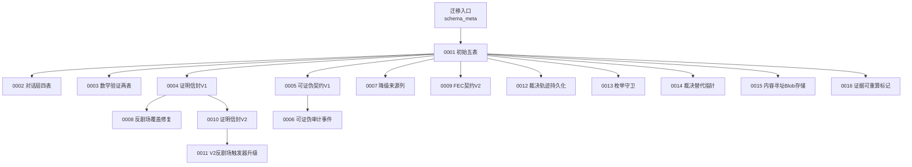
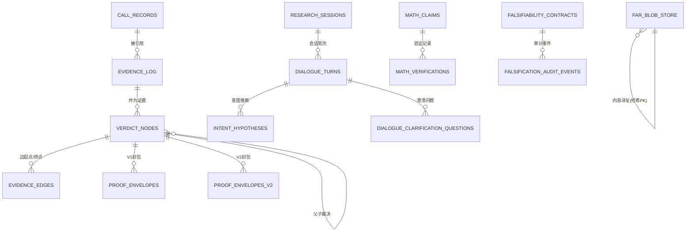
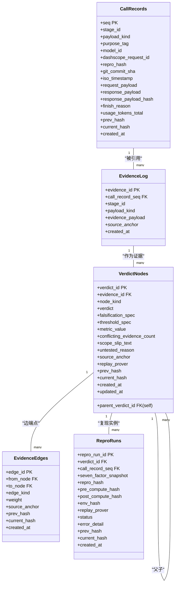
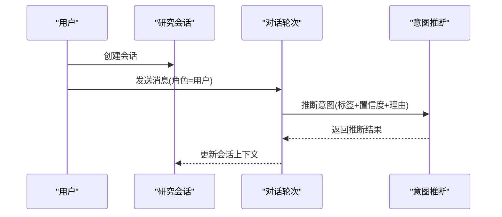
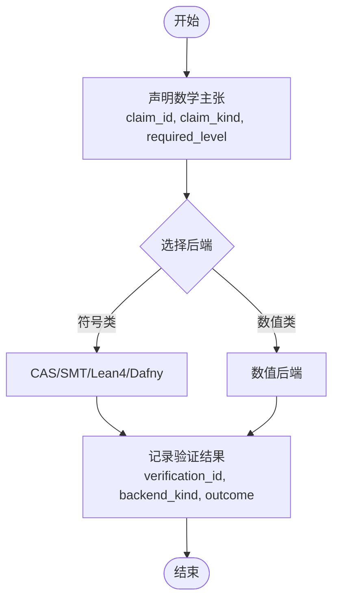
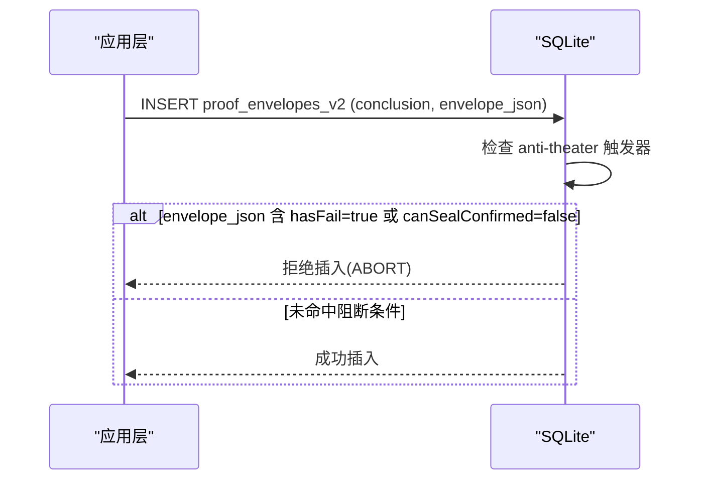
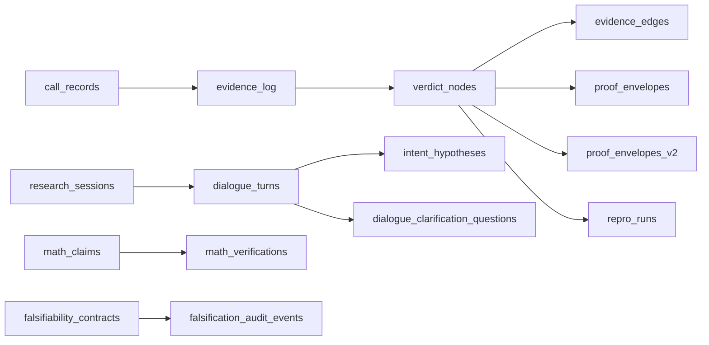

# 表结构设计

<cite>
**本文引用的文件**
- [schema/migrations/0001_initial.sql](file://schema/migrations/0001_initial.sql)
- [schema/migrations/0002_add_dialogue_tables.sql](file://schema/migrations/0002_add_dialogue_tables.sql)
- [schema/migrations/0003_math_verification.sql](file://schema/migrations/0003_math_verification.sql)
- [schema/migrations/0004_proof_envelopes.sql](file://schema/migrations/0004_proof_envelopes.sql)
- [schema/migrations/0005_falsifiability_contracts.sql](file://schema/migrations/0005_falsifiability_contracts.sql)
- [schema/migrations/0006_falsification_audit_events.sql](file://schema/migrations/0006_falsification_audit_events.sql)
- [schema/migrations/0007_add_degraded_from.sql](file://schema/migrations/0007_add_degraded_from.sql)
- [schema/migrations/0008_anti_theater_fail_coverage.sql](file://schema/migrations/0008_anti_theater_fail_coverage.sql)
- [schema/migrations/0009_fec_contracts_v2.sql](file://schema/migrations/0009_fec_contracts_v2.sql)
- [schema/migrations/0010_proof_envelopes_v2.sql](file://schema/migrations/0010_proof_envelopes_v2.sql)
- [schema/migrations/0011_anti_theater_trigger_v2.sql](file://schema/migrations/0011_anti_theater_trigger_v2.sql)
- [schema/migrations/0012_verdict_trace_persist.sql](file://schema/migrations/0012_verdict_trace_persist.sql)
- [schema/migrations/0013_verdict_enum_guard.sql](file://schema/migrations/0013_verdict_enum_guard.sql)
- [schema/migrations/0014_verdict_supersede.sql](file://schema/migrations/0014_verdict_supersede.sql)
- [schema/migrations/0015_far_blob_store.sql](file://schema/migrations/0015_far_blob_store.sql)
- [schema/migrations/0016_evidence_derivable.sql](file://schema/migrations/0016_evidence_derivable.sql)
</cite>

## 目录
1. [引言](#引言)
2. [项目结构](#项目结构)
3. [核心组件](#核心组件)
4. [架构总览](#架构总览)
5. [详细组件分析](#详细组件分析)
6. [依赖关系分析](#依赖关系分析)
7. [性能与索引策略](#性能与索引策略)
8. [数据完整性与业务规则](#数据完整性与业务规则)
9. [版本兼容性与迁移策略](#版本兼容性与迁移策略)
10. [数据字典与字段含义](#数据字典与字段含义)
11. [故障排查指南](#故障排查指南)
12. [结论](#结论)

## 引言
本文件面向FAR-Lab项目的SQLite关系型数据库，系统化梳理基于迁移脚本的表结构、约束、索引、外键与触发器设计，解释主外键关联、查询优化考量、数据完整性与业务规则落地方式，并提供ER图、示例数据与版本兼容性说明。目标是让非专业读者也能理解整体架构与关键设计决策。

## 项目结构
- 数据库DDL以迁移脚本形式组织在 schema/migrations 目录下，按连续编号顺序演进（0001~0016）。
- 每个迁移负责新增表/列/索引/触发器或替换触发器，遵循“追加式”变更原则，避免破坏既有结构。
- 通过 schema_meta 记录已应用迁移的版本与名称，用于迁移状态管理。

图表来源
- [schema/migrations/0001_initial.sql:1-245](file://schema/migrations/0001_initial.sql#L1-L245)
- [schema/migrations/0002_add_dialogue_tables.sql:1-95](file://schema/migrations/0002_add_dialogue_tables.sql#L1-L95)
- [schema/migrations/0003_math_verification.sql:1-97](file://schema/migrations/0003_math_verification.sql#L1-L97)
- [schema/migrations/0004_proof_envelopes.sql:1-66](file://schema/migrations/0004_proof_envelopes.sql#L1-L66)
- [schema/migrations/0005_falsifiability_contracts.sql:1-54](file://schema/migrations/0005_falsifiability_contracts.sql#L1-L54)
- [schema/migrations/0006_falsification_audit_events.sql:1-54](file://schema/migrations/0006_falsification_audit_events.sql#L1-L54)
- [schema/migrations/0007_add_degraded_from.sql:1-18](file://schema/migrations/0007_add_degraded_from.sql#L1-L18)
- [schema/migrations/0008_anti_theater_fail_coverage.sql:1-35](file://schema/migrations/0008_anti_theater_fail_coverage.sql#L1-L35)
- [schema/migrations/0009_fec_contracts_v2.sql:1-54](file://schema/migrations/0009_fec_contracts_v2.sql#L1-L54)
- [schema/migrations/0010_proof_envelopes_v2.sql:1-67](file://schema/migrations/0010_proof_envelopes_v2.sql#L1-L67)
- [schema/migrations/0011_anti_theater_trigger_v2.sql:1-50](file://schema/migrations/0011_anti_theater_trigger_v2.sql#L1-L50)
- [schema/migrations/0012_verdict_trace_persist.sql:1-64](file://schema/migrations/0012_verdict_trace_persist.sql#L1-L64)
- [schema/migrations/0013_verdict_enum_guard.sql:1-55](file://schema/migrations/0013_verdict_enum_guard.sql#L1-L55)
- [schema/migrations/0014_verdict_supersede.sql:1-28](file://schema/migrations/0014_verdict_supersede.sql#L1-L28)
- [schema/migrations/0015_far_blob_store.sql:1-44](file://schema/migrations/0015_far_blob_store.sql#L1-L44)
- [schema/migrations/0016_evidence_derivable.sql:1-33](file://schema/migrations/0016_evidence_derivable.sql#L1-L33)

章节来源
- [schema/migrations/0001_initial.sql:1-245](file://schema/migrations/0001_initial.sql#L1-L245)

## 核心组件
- 调用记录与证据链：call_records、evidence_log、verdict_nodes、evidence_edges、repro_runs
- 对话与研究会话：research_sessions、dialogue_turns、intent_hypotheses、dialogue_clarification_questions
- 数学验证：math_claims、math_verifications
- 证明信封：proof_envelopes（V1）、proof_envelopes_v2（V2）
- 可证伪契约与审计：falsifiability_contracts、falsification_audit_events
- 契约V2：fec_contracts_v2
- 内容寻址存储：far_blob_store
- 元数据：schema_meta

章节来源
- [schema/migrations/0001_initial.sql:10-245](file://schema/migrations/0001_initial.sql#L10-L245)
- [schema/migrations/0002_add_dialogue_tables.sql:16-94](file://schema/migrations/0002_add_dialogue_tables.sql#L16-L94)
- [schema/migrations/0003_math_verification.sql:25-92](file://schema/migrations/0003_math_verification.sql#L25-L92)
- [schema/migrations/0004_proof_envelopes.sql:17-65](file://schema/migrations/0004_proof_envelopes.sql#L17-L65)
- [schema/migrations/0005_falsifiability_contracts.sql:16-53](file://schema/migrations/0005_falsifiability_contracts.sql#L16-L53)
- [schema/migrations/0006_falsification_audit_events.sql:17-53](file://schema/migrations/0006_falsification_audit_events.sql#L17-L53)
- [schema/migrations/0009_fec_contracts_v2.sql:25-53](file://schema/migrations/0009_fec_contracts_v2.sql#L25-L53)
- [schema/migrations/0010_proof_envelopes_v2.sql:20-66](file://schema/migrations/0010_proof_envelopes_v2.sql#L20-L66)
- [schema/migrations/0015_far_blob_store.sql:22-43](file://schema/migrations/0015_far_blob_store.sql#L22-L43)

## 架构总览
下图展示了核心实体之间的主要关系：调用记录驱动证据生成，证据支撑裁决节点，裁决节点形成边关系；证明信封将裁决结果与契约信息封存；数学验证为特定类型主张提供独立证据；对话层围绕研究会话组织交互；可证伪契约与审计事件保障统计假设的可检验性；内容寻址存储提供去重的二进制对象存储。

图表来源
- [schema/migrations/0001_initial.sql:10-245](file://schema/migrations/0001_initial.sql#L10-L245)
- [schema/migrations/0002_add_dialogue_tables.sql:16-94](file://schema/migrations/0002_add_dialogue_tables.sql#L16-L94)
- [schema/migrations/0003_math_verification.sql:25-92](file://schema/migrations/0003_math_verification.sql#L25-L92)
- [schema/migrations/0004_proof_envelopes.sql:17-65](file://schema/migrations/0004_proof_envelopes.sql#L17-L65)
- [schema/migrations/0005_falsifiability_contracts.sql:16-53](file://schema/migrations/0005_falsifiability_contracts.sql#L16-L53)
- [schema/migrations/0006_falsification_audit_events.sql:17-53](file://schema/migrations/0006_falsification_audit_events.sql#L17-L53)
- [schema/migrations/0010_proof_envelopes_v2.sql:20-66](file://schema/migrations/0010_proof_envelopes_v2.sql#L20-L66)
- [schema/migrations/0015_far_blob_store.sql:22-43](file://schema/migrations/0015_far_blob_store.sql#L22-L43)

## 详细组件分析

### 核心五表（0001）
- call_records：LLM调用审计日志，追加写入，禁止更新/删除；包含阶段ID、负载类型、模型ID、请求/响应载荷、完成原因、令牌用量、哈希链等。
- evidence_log：从调用记录派生的证据行，绑定到具体调用，支持溯源锚点与时间戳。
- verdict_nodes：裁决节点树，支持父节点、节点类型、裁决值、阈值/度量、冲突计数、溯源锚点、哈希链等；部分字段不可变，终端裁决不可回滚。
- evidence_edges：裁决节点间的有向边，限定边类型与权重范围，唯一约束防止重复边。
- repro_runs：可复现运行记录，绑定到裁决与调用，记录环境哈希、预/后计算哈希、状态等。

图表来源
- [schema/migrations/0001_initial.sql:10-245](file://schema/migrations/0001_initial.sql#L10-L245)

章节来源
- [schema/migrations/0001_initial.sql:10-245](file://schema/migrations/0001_initial.sql#L10-L245)

### 对话与研究会话（0002）
- research_sessions：研究会话元数据，状态机（创建/活跃/暂停/最终化/归档），可选用户ID与链接运行ID。
- dialogue_turns：每轮对话记录，角色限定（用户/助手/系统），与意图推断和工具调用序列关联。
- intent_hypotheses：意图推断结果，置信度与理由，状态机（待确认/已确认/拒绝）。
- dialogue_clarification_questions：澄清提问记录，类型限定（范围/指标/基线/数据集/方法/通用）。

图表来源
- [schema/migrations/0002_add_dialogue_tables.sql:16-94](file://schema/migrations/0002_add_dialogue_tables.sql#L16-L94)

章节来源
- [schema/migrations/0002_add_dialogue_tables.sql:16-94](file://schema/migrations/0002_add_dialogue_tables.sql#L16-L94)

### 数学验证（0003）
- math_claims：结构化数学主张，类型涵盖代数恒等式、方程求解、微积分、不等式、量纲一致性、矩阵恒等式、统计恒等式、定理、数值复现、统计推断、优化收敛、验证数值等；要求级别与预期结果。
- math_verifications：针对每个主张的多后端验证记录（CAS/SMT/Lean4/Dafny/数值），输出产物、编译日志、耗时、溯源锚点。

图表来源
- [schema/migrations/0003_math_verification.sql:25-92](file://schema/migrations/0003_math_verification.sql#L25-L92)

章节来源
- [schema/migrations/0003_math_verification.sql:25-92](file://schema/migrations/0003_math_verification.sql#L25-L92)

### 证明信封（0004/0008/0010/0011）
- proof_envelopes（V1）：封存证据包，结论与校验结果数组，防剧场触发器阻止含WARN/FAIL时封为CONFIRMED。
- proof_envelopes_v2（V2）：完整证据嵌入信封，固定schema版本，包含fec_hash、proof_hash、ledger_root、envelope_json等；触发器基于envelope_json中的反剧场报告字段阻断CONFIRMED。
- 0008对V1触发器进行扩展，覆盖FAIL场景；0011对V2触发器升级为匹配新字段hasFail/canSealConfirmed。

图表来源
- [schema/migrations/0010_proof_envelopes_v2.sql:20-66](file://schema/migrations/0010_proof_envelopes_v2.sql#L20-L66)
- [schema/migrations/0011_anti_theater_trigger_v2.sql:33-49](file://schema/migrations/0011_anti_theater_trigger_v2.sql#L33-L49)
- [schema/migrations/0004_proof_envelopes.sql:17-65](file://schema/migrations/0004_proof_envelopes.sql#L17-L65)
- [schema/migrations/0008_anti_theater_fail_coverage.sql:22-34](file://schema/migrations/0008_anti_theater_fail_coverage.sql#L22-L34)

章节来源
- [schema/migrations/0004_proof_envelopes.sql:17-65](file://schema/migrations/0004_proof_envelopes.sql#L17-L65)
- [schema/migrations/0008_anti_theater_fail_coverage.sql:22-34](file://schema/migrations/0008_anti_theater_fail_coverage.sql#L22-L34)
- [schema/migrations/0010_proof_envelopes_v2.sql:20-66](file://schema/migrations/0010_proof_envelopes_v2.sql#L20-L66)
- [schema/migrations/0011_anti_theater_trigger_v2.sql:33-49](file://schema/migrations/0011_anti_theater_trigger_v2.sql#L33-L49)

### 可证伪契约与审计（0005/0006）
- falsifiability_contracts：预注册可证伪主张，包含可测量蕴含、指标、比较器、阈值、显著性水平、种子、Bonferroni校正、人群、效应量、功效分析等；锁定与编译者标识。
- falsification_audit_events：对契约执行充分性审计的事件记录，规则ID与结果（PASS/FAIL/WARN/SKIP），密封者与时间戳。

章节来源
- [schema/migrations/0005_falsifiability_contracts.sql:16-53](file://schema/migrations/0005_falsifiability_contracts.sql#L16-L53)
- [schema/migrations/0006_falsification_audit_events.sql:17-53](file://schema/migrations/0006_falsification_audit_events.sql#L17-L53)

### 契约V2（0009）
- fec_contracts_v2：完整冻结契约，contract_version固定为'FEC/2.0'，存储canonical JSON与fec_hash；锁定与编译者标识；追加写入。

章节来源
- [schema/migrations/0009_fec_contracts_v2.sql:25-53](file://schema/migrations/0009_fec_contracts_v2.sql#L25-L53)

### 内容寻址存储（0015）
- far_blob_store：以sha256哈希为主键的内容寻址存储，content为规范化JSON序列化，size_bytes记录字节数；追加写入，禁止更新/删除。

章节来源
- [schema/migrations/0015_far_blob_store.sql:22-43](file://schema/migrations/0015_far_blob_store.sql#L22-L43)

### 其他增强（0007/0012/0013/0014/0016）
- 0007：为call_records增加degraded_from列，记录降级来源模型ID（审计列）。
- 0012：为verdict_nodes增加verdict_trace_json与verdict_trace_hash，持久化裁决内核输出并绑定哈希；重建不可变触发器以保护新增列。
- 0013：为verdict_nodes与proof_envelopes_v2增加枚举守卫触发器，拦截非法裁决/结论值。
- 0014：为verdict_nodes增加superseded_by自指外键，支持裁决替代；不纳入current_hash白名单以避免破坏链式哈希。
- 0016：为evidence_log增加derivable与evidence_payload_hash，区分外部观测与可重算证据，并在验证时比对内容哈希。

章节来源
- [schema/migrations/0007_add_degraded_from.sql:15-17](file://schema/migrations/0007_add_degraded_from.sql#L15-L17)
- [schema/migrations/0012_verdict_trace_persist.sql:33-63](file://schema/migrations/0012_verdict_trace_persist.sql#L33-L63)
- [schema/migrations/0013_verdict_enum_guard.sql:21-54](file://schema/migrations/0013_verdict_enum_guard.sql#L21-L54)
- [schema/migrations/0014_verdict_supersede.sql:23-27](file://schema/migrations/0014_verdict_supersede.sql#L23-L27)
- [schema/migrations/0016_evidence_derivable.sql:27-32](file://schema/migrations/0016_evidence_derivable.sql#L27-L32)

## 依赖关系分析
- 外键关系：
  - evidence_log.call_record_seq → call_records.seq（RESTRICT）
  - verdict_nodes.evidence_id → evidence_log.evidence_id（RESTRICT）
  - verdict_nodes.parent_verdict_id → verdict_nodes.verdict_id（RESTRICT）
  - evidence_edges.from_node/to_node → verdict_nodes.verdict_id（RESTRICT）
  - repro_runs.verdict_id → verdict_nodes.verdict_id（RESTRICT）
  - repro_runs.call_record_seq → call_records.seq（RESTRICT）
  - dialogue_turns.session_id → research_sessions.session_id（CASCADE）
  - intent_hypotheses.session_id/turn_id → research_sessions/dialogue_turns（CASCADE）
  - dialogue_clarification_questions.session_id/turn_id → research_sessions/dialogue_turns（CASCADE）
  - math_verifications.claim_id → math_claims.claim_id（RESTRICT）
  - proof_envelopes.verdict_node_id → verdict_nodes.verdict_id（RESTRICT）
  - falsification_audit_events.contract_id → falsifiability_contracts.contract_id（RESTRICT）
  - verdict_nodes.superseded_by → verdict_nodes.verdict_id（SET NULL）

图表来源
- [schema/migrations/0001_initial.sql:10-245](file://schema/migrations/0001_initial.sql#L10-L245)
- [schema/migrations/0002_add_dialogue_tables.sql:16-94](file://schema/migrations/0002_add_dialogue_tables.sql#L16-L94)
- [schema/migrations/0003_math_verification.sql:25-92](file://schema/migrations/0003_math_verification.sql#L25-L92)
- [schema/migrations/0004_proof_envelopes.sql:17-65](file://schema/migrations/0004_proof_envelopes.sql#L17-L65)
- [schema/migrations/0005_falsifiability_contracts.sql:16-53](file://schema/migrations/0005_falsifiability_contracts.sql#L16-L53)
- [schema/migrations/0006_falsification_audit_events.sql:17-53](file://schema/migrations/0006_falsification_audit_events.sql#L17-L53)
- [schema/migrations/0010_proof_envelopes_v2.sql:20-66](file://schema/migrations/0010_proof_envelopes_v2.sql#L20-L66)
- [schema/migrations/0014_verdict_supersede.sql:23-27](file://schema/migrations/0014_verdict_supersede.sql#L23-L27)

章节来源
- [schema/migrations/0001_initial.sql:10-245](file://schema/migrations/0001_initial.sql#L10-L245)
- [schema/migrations/0002_add_dialogue_tables.sql:16-94](file://schema/migrations/0002_add_dialogue_tables.sql#L16-L94)
- [schema/migrations/0003_math_verification.sql:25-92](file://schema/migrations/0003_math_verification.sql#L25-L92)
- [schema/migrations/0004_proof_envelopes.sql:17-65](file://schema/migrations/0004_proof_envelopes.sql#L17-L65)
- [schema/migrations/0005_falsifiability_contracts.sql:16-53](file://schema/migrations/0005_falsifiability_contracts.sql#L16-L53)
- [schema/migrations/0006_falsification_audit_events.sql:17-53](file://schema/migrations/0006_falsification_audit_events.sql#L17-L53)
- [schema/migrations/0010_proof_envelopes_v2.sql:20-66](file://schema/migrations/0010_proof_envelopes_v2.sql#L20-L66)
- [schema/migrations/0014_verdict_supersede.sql:23-27](file://schema/migrations/0014_verdict_supersede.sql#L23-L27)

## 性能与索引策略
- 高频过滤字段建立索引：
  - call_records：stage_id、payload_kind、model_id、dashscope_request_id、purpose_tag
  - evidence_log：call_record_seq、stage_id、payload_kind、source_anchor_git、source_anchor_req
  - verdict_nodes：evidence_id、parent_verdict_id、node_kind、verdict
  - evidence_edges：from_node、to_node、edge_kind；唯一索引(from_node,to_node,edge_kind)
  - repro_runs：verdict_id、call_record_seq、repro_hash、status
  - research_sessions：status、user_id
  - dialogue_turns：session_id+turn_no（唯一）、role
  - intent_hypotheses：session_id+status、intent_label
  - dialogue_clarification_questions：session_id、question_type
  - math_claims：claim_kind、required_level、linked_verdict_node_id
  - math_verifications：claim_id、backend_id、outcome、backend_kind
  - proof_envelopes：claim_id、verdict_node_id、conclusion、proof_hash
  - proof_envelopes_v2：claim_id、conclusion、fec_hash、proof_hash
  - falsifiability_contracts：claim_id、preregistration_hash
  - falsification_audit_events：contract_id、rule_id、outcome
  - far_blob_store：created_at
- 查询优化建议：
  - 使用复合索引加速会话内轮次排序（session_id, turn_no）。
  - 对裁决树遍历优先使用parent_verdict_id索引。
  - 对证据聚合查询使用payload_kind与stage_id组合过滤。
  - 对证明信封查询使用proof_hash与conclusion快速定位。
  - 对数学验证查询使用backend_kind与outcome筛选。

章节来源
- [schema/migrations/0001_initial.sql:42-46,79-83,123-127,203-207,227-230:42-46](file://schema/migrations/0001_initial.sql#L42-L46)
- [schema/migrations/0002_add_dialogue_tables.sql:29-30,47-48,75-76,91-92:29-30](file://schema/migrations/0002_add_dialogue_tables.sql#L29-L30)
- [schema/migrations/0003_math_verification.sql:45-47,68-71:45-47](file://schema/migrations/0003_math_verification.sql#L45-L47)
- [schema/migrations/0004_proof_envelopes.sql:37-40](file://schema/migrations/0004_proof_envelopes.sql#L37-L40)
- [schema/migrations/0005_falsifiability_contracts.sql:37-38](file://schema/migrations/0005_falsifiability_contracts.sql#L37-L38)
- [schema/migrations/0006_falsification_audit_events.sql:36-38](file://schema/migrations/0006_falsification_audit_events.sql#L36-L38)
- [schema/migrations/0010_proof_envelopes_v2.sql:37-40](file://schema/migrations/0010_proof_envelopes_v2.sql#L37-L40)
- [schema/migrations/0015_far_blob_store.sql:29](file://schema/migrations/0015_far_blob_store.sql#L29)

## 数据完整性与业务规则
- 追加写入与不可变性：
  - call_records、evidence_log、repro_runs、math_claims、math_verifications、proof_envelopes、proof_envelopes_v2、falsifiability_contracts、falsification_audit_events、far_blob_store均通过触发器禁止UPDATE/DELETE，确保审计链与证据链不可篡改。
- 枚举与取值约束：
  - payload_kind、purpose_tag、finish_reason、node_kind、verdict、edge_kind、status、claim_kind、backend_kind、comparator、rule_id、check_kind、conclusion等列使用CHECK约束限制取值集合。
- 业务规则触发器：
  - 裁决节点不可变字段保护（仅允许verdict/metric_value/updated_at变化）。
  - 终端裁决不可回滚（CONFIRMED/REFUTED不可更改）。
  - DEGRADED_SCOPE需非空scope_slip_text；UNTESTED需非空untested_reason。
  - CONFIRMED必须存在非空evidence_payload的证据记录（Red Line #7）。
  - 证明信封V1/V2：当checks/envelope_json包含WARN/FAIL时，禁止封为CONFIRMED（反剧场F1）。
  - 枚举守卫：拦截非法verdict/conclusion值（纵深防御）。
  - 可重算证据：derivable=1时，evidence_payload_hash需与内容一致，验证时比对。
- 哈希链与内容寻址：
  - current_hash/prev_hash维护链式完整性；proof_hash/fec_hash/ledger_root保证封包完整性；far_blob_store以内容哈希为PK实现全局去重。

章节来源
- [schema/migrations/0001_initial.sql:48-58,85-95,128-170,176-185,187-207,232-242:48-58](file://schema/migrations/0001_initial.sql#L48-L58)
- [schema/migrations/0003_math_verification.sql:76-87](file://schema/migrations/0003_math_verification.sql#L76-L87)
- [schema/migrations/0004_proof_envelopes.sql:42-63](file://schema/migrations/0004_proof_envelopes.sql#L42-L63)
- [schema/migrations/0005_falsifiability_contracts.sql:40-51](file://schema/migrations/0005_falsifiability_contracts.sql#L40-L51)
- [schema/migrations/0006_falsification_audit_events.sql:40-51](file://schema/migrations/0006_falsification_audit_events.sql#L40-L51)
- [schema/migrations/0008_anti_theater_fail_coverage.sql:22-34](file://schema/migrations/0008_anti_theater_fail_coverage.sql#L22-L34)
- [schema/migrations/0010_proof_envelopes_v2.sql:42-64](file://schema/migrations/0010_proof_envelopes_v2.sql#L42-L64)
- [schema/migrations/0011_anti_theater_trigger_v2.sql:33-49](file://schema/migrations/0011_anti_theater_trigger_v2.sql#L33-L49)
- [schema/migrations/0012_verdict_trace_persist.sql:37-61](file://schema/migrations/0012_verdict_trace_persist.sql#L37-L61)
- [schema/migrations/0013_verdict_enum_guard.sql:21-54](file://schema/migrations/0013_verdict_enum_guard.sql#L21-L54)
- [schema/migrations/0015_far_blob_store.sql:31-41](file://schema/migrations/0015_far_blob_store.sql#L31-L41)
- [schema/migrations/0016_evidence_derivable.sql:7-15](file://schema/migrations/0016_evidence_derivable.sql#L7-L15)

## 版本兼容性与迁移策略
- 连续编号与追加式变更：
  - 所有迁移按0001~0016连续编号，migrator强制连续性；新增表/列/索引/触发器，不修改历史DDL文件。
- 向后兼容：
  - 旧表与新表共存（如proof_envelopes与proof_envelopes_v2、falsifiability_contracts与fec_contracts_v2），功能保留且逐步迁移。
  - 通过触发器替换而非ALTER破坏性操作（如0008/0011替换触发器），保持旧结构可用。
- 哈希链与白名单：
  - 新增列（如verdict_trace_json/hash、superseded_by、degraded_from、derivable/evidence_payload_hash）明确是否纳入current_hash白名单，避免破坏跨语言一致性。
- 迁移状态管理：
  - schema_meta记录version与name，用于追踪已应用迁移。

章节来源
- [schema/migrations/0001_initial.sql:4-8,244-245:4-8](file://schema/migrations/0001_initial.sql#L4-L8)
- [schema/migrations/0004_proof_envelopes.sql:7-13](file://schema/migrations/0004_proof_envelopes.sql#L7-L13)
- [schema/migrations/0008_anti_theater_fail_coverage.sql:17-20](file://schema/migrations/0008_anti_theater_fail_coverage.sql#L17-L20)
- [schema/migrations/0010_proof_envelopes_v2.sql:7-16](file://schema/migrations/0010_proof_envelopes_v2.sql#L7-L16)
- [schema/migrations/0011_anti_theater_trigger_v2.sql:15-17](file://schema/migrations/0011_anti_theater_trigger_v2.sql#L15-L17)
- [schema/migrations/0012_verdict_trace_persist.sql:21-29](file://schema/migrations/0012_verdict_trace_persist.sql#L21-L29)
- [schema/migrations/0014_verdict_supersede.sql:13-16](file://schema/migrations/0014_verdict_supersede.sql#L13-L16)
- [schema/migrations/0016_evidence_derivable.sql:17-23](file://schema/migrations/0016_evidence_derivable.sql#L17-L23)

## 数据字典与字段含义
- call_records：记录每次模型调用的审计信息，包括阶段、负载类型、目的标签、模型、请求/响应载荷、完成原因、令牌用量、哈希链等。
- evidence_log：从调用记录派生的证据，包含证据载荷、溯源锚点（Git/路径/行号）、时间戳。
- verdict_nodes：裁决节点，包含证据ID、父裁决ID、节点类型、裁决值、阈值/度量、冲突计数、溯源锚点、哈希链等。
- evidence_edges：裁决节点间关系边，包含边类型与权重。
- repro_runs：可复现运行记录，包含快照、哈希、环境哈希、状态、错误详情等。
- research_sessions：研究会话元数据，状态机与用户/运行链接。
- dialogue_turns：对话轮次，角色、内容与意图推断、工具调用关联。
- intent_hypotheses：意图推断结果，标签、置信度、理由、状态。
- dialogue_clarification_questions：澄清提问，类型与问题文本。
- math_claims：数学主张，自然语言描述、类型、形式化表达、要求级别、预期结果等。
- math_verifications：验证记录，后端ID/类型、结果、输入/输出哈希、编译日志、耗时、溯源锚点。
- proof_envelopes（V1）：封存的证据包，结论、证明哈希、校验结果、规范、溯源、复现哈希、密封者、时间戳。
- proof_envelopes_v2（V2）：完整证据嵌入信封，schema版本、结论、fec_hash、proof_hash、ledger_root、envelope_json、密封者、时间戳。
- falsifiability_contracts：可证伪契约，主张ID、预注册哈希、可测量蕴含、指标、比较器、阈值、显著性水平、种子、Bonferroni校正、人群、效应量、功效分析、编译者、锁定状态。
- falsification_audit_events：审计事件，契约ID、主张ID、规则ID、检查类型、结果、细节、哈希、密封者、时间戳。
- fec_contracts_v2：完整冻结契约，主张ID、版本、fec_hash、contract_json、编译者、锁定状态。
- far_blob_store：内容寻址存储，哈希、内容、大小、创建时间。
- schema_meta：迁移元数据，版本号、名称、应用时间。

章节来源
- [schema/migrations/0001_initial.sql:10-245](file://schema/migrations/0001_initial.sql#L10-L245)
- [schema/migrations/0002_add_dialogue_tables.sql:16-94](file://schema/migrations/0002_add_dialogue_tables.sql#L16-L94)
- [schema/migrations/0003_math_verification.sql:25-92](file://schema/migrations/0003_math_verification.sql#L25-L92)
- [schema/migrations/0004_proof_envelopes.sql:17-65](file://schema/migrations/0004_proof_envelopes.sql#L17-L65)
- [schema/migrations/0005_falsifiability_contracts.sql:16-53](file://schema/migrations/0005_falsifiability_contracts.sql#L16-L53)
- [schema/migrations/0006_falsification_audit_events.sql:17-53](file://schema/migrations/0006_falsification_audit_events.sql#L17-L53)
- [schema/migrations/0009_fec_contracts_v2.sql:25-53](file://schema/migrations/0009_fec_contracts_v2.sql#L25-L53)
- [schema/migrations/0010_proof_envelopes_v2.sql:20-66](file://schema/migrations/0010_proof_envelopes_v2.sql#L20-L66)
- [schema/migrations/0015_far_blob_store.sql:22-43](file://schema/migrations/0015_far_blob_store.sql#L22-L43)

## 故障排查指南
- 插入失败（追加写入限制）：
  - 若收到“append-only: UPDATE/DELETE forbidden”，检查是否尝试更新或删除受保护的表（如call_records、evidence_log、repro_runs、math_claims、math_verifications、proof_envelopes、proof_envelopes_v2、falsifiability_contracts、falsification_audit_events、far_blob_store）。
- 裁决值非法：
  - 若收到“verdict enum guard rejected non-frozen value”，检查verdict/conclusion是否为允许的五值之一。
- 反剧场阻断：
  - 若证明信封插入被拒且提示“WARN/FAIL present, cannot seal CONFIRMED”，检查checks或envelope_json中是否存在警告/失败项，调整结论为非CONFIRMED。
- 证据不足：
  - 若插入裁决节点被拒且提示“CONFIRMED requires evidence_log record with non-empty payload”，确保证据记录存在且载荷非空。
- 哈希失配：
  - 若验证current_hash/proof_hash失败，检查相关列是否被静默修改或未纳入白名单的新增列是否正确计算。

章节来源
- [schema/migrations/0001_initial.sql:48-58,85-95,128-170,176-185,232-242:48-58](file://schema/migrations/0001_initial.sql#L48-L58)
- [schema/migrations/0003_math_verification.sql:76-87](file://schema/migrations/0003_math_verification.sql#L76-L87)
- [schema/migrations/0004_proof_envelopes.sql:42-63](file://schema/migrations/0004_proof_envelopes.sql#L42-L63)
- [schema/migrations/0005_falsifiability_contracts.sql:40-51](file://schema/migrations/0005_falsifiability_contracts.sql#L40-L51)
- [schema/migrations/0006_falsification_audit_events.sql:40-51](file://schema/migrations/0006_falsification_audit_events.sql#L40-L51)
- [schema/migrations/0008_anti_theater_fail_coverage.sql:22-34](file://schema/migrations/0008_anti_theater_fail_coverage.sql#L22-L34)
- [schema/migrations/0010_proof_envelopes_v2.sql:42-64](file://schema/migrations/0010_proof_envelopes_v2.sql#L42-L64)
- [schema/migrations/0011_anti_theater_trigger_v2.sql:33-49](file://schema/migrations/0011_anti_theater_trigger_v2.sql#L33-L49)
- [schema/migrations/0013_verdict_enum_guard.sql:21-54](file://schema/migrations/0013_verdict_enum_guard.sql#L21-L54)
- [schema/migrations/0015_far_blob_store.sql:31-41](file://schema/migrations/0015_far_blob_store.sql#L31-L41)

## 结论
FAR-Lab的SQLite数据库采用严格的追加写入与触发器约束，结合CHECK约束、外键与哈希链，构建了高可信的审计与证据体系。通过连续编号的迁移脚本实现平滑演进与向后兼容，同时提供丰富的索引与查询优化策略。该设计确保了数据完整性、可追溯性与抗篡改能力，为科学发现与验证提供了坚实的底层支撑。