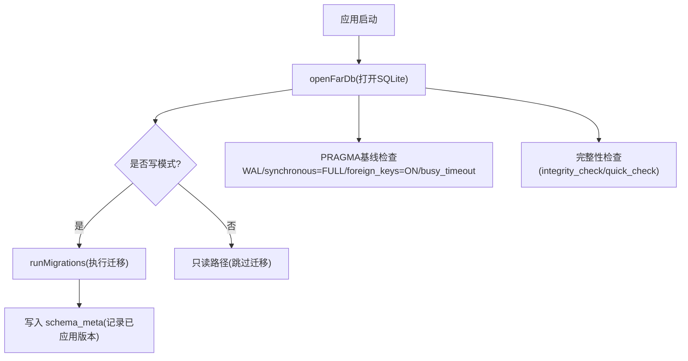
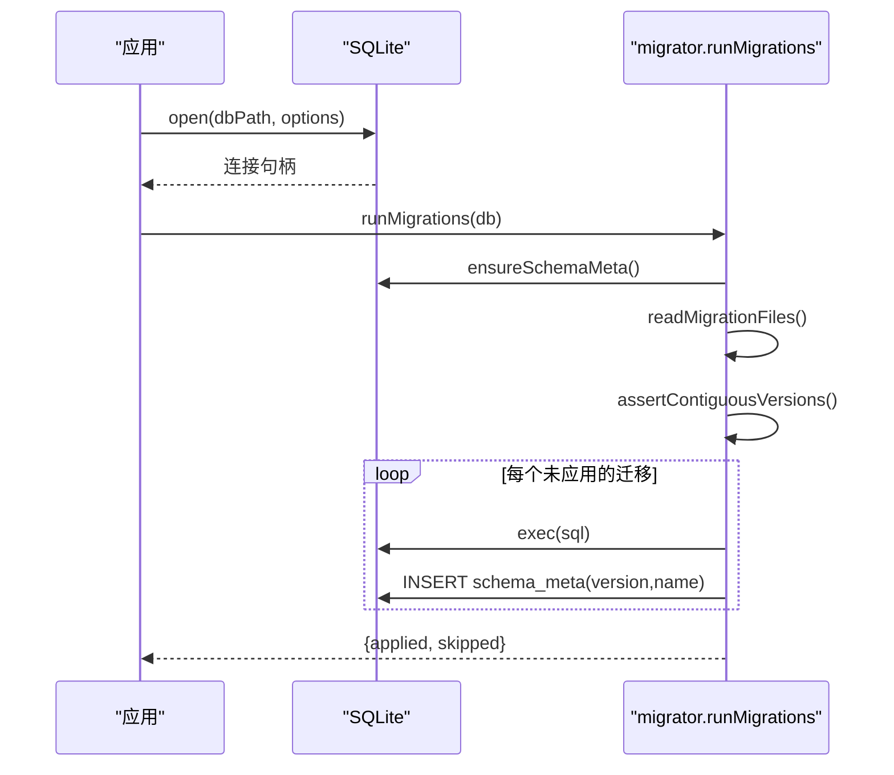
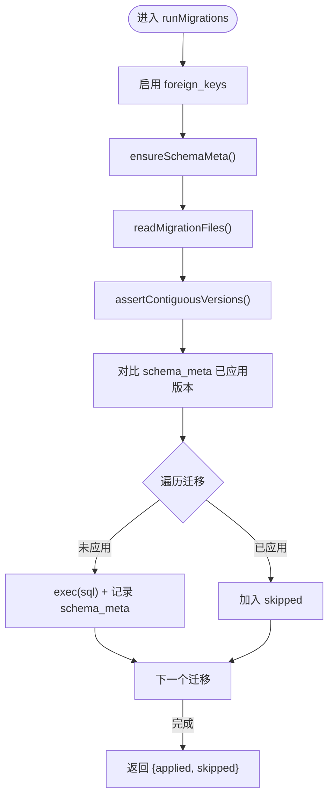
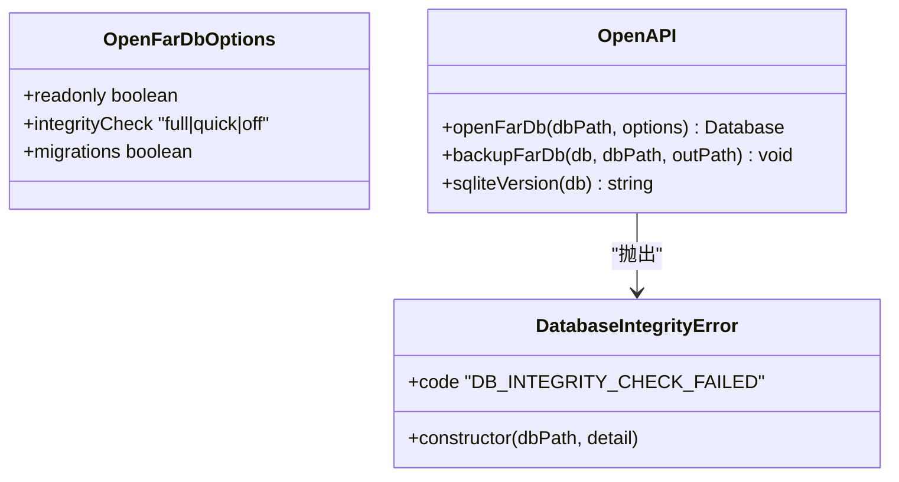
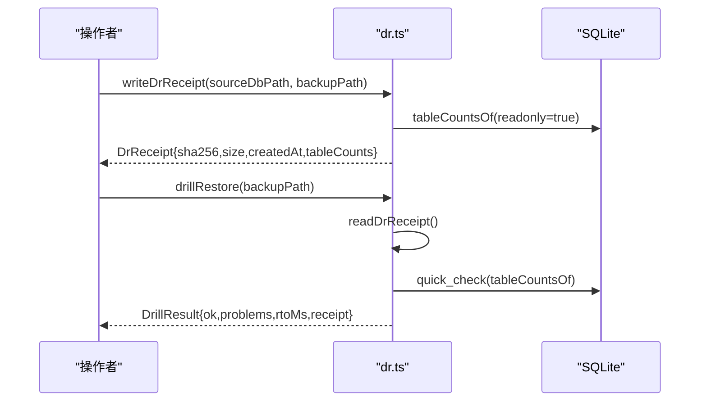
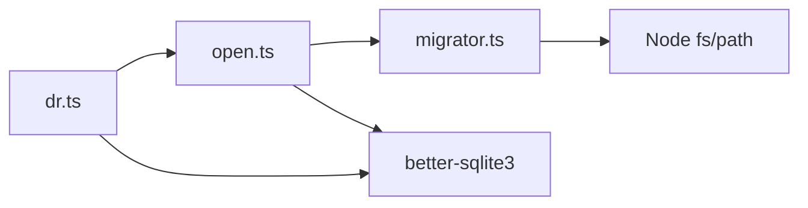

# 迁移管理

<cite>
**本文引用的文件**
- [schema/migrations/README.md](file://schema/migrations/README.md)
- [src/db/migrator.ts](file://src/db/migrator.ts)
- [src/db/index.ts](file://src/db/index.ts)
- [src/db/open.ts](file://src/db/open.ts)
- [src/db/dr.ts](file://src/db/dr.ts)
- [schema/migrations/0001_initial.sql](file://schema/migrations/0001_initial.sql)
- [schema/migrations/0021_lifecycle_events.sql](file://schema/migrations/0021_lifecycle_events.sql)
- [tests/db/migration_v2_receipts.test.ts](file://tests/db/migration_v2_receipts.test.ts)
- [tests/db/migrator_safety.test.ts](file://tests/db/migrator_safety.test.ts)
- [tests/schema/db_migrator.test.ts](file://tests/schema/db_migrator.test.ts)
</cite>

## 目录
1. [简介](#简介)
2. [项目结构](#项目结构)
3. [核心组件](#核心组件)
4. [架构总览](#架构总览)
5. [详细组件分析](#详细组件分析)
6. [依赖关系分析](#依赖关系分析)
7. [性能考虑](#性能考虑)
8. [故障排除指南](#故障排除指南)
9. [结论](#结论)
10. [附录](#附录)

## 简介
本文件系统性说明 FAR-Lab 的数据库迁移管理与版本控制机制，覆盖迁移策略、命名与执行顺序、脚本编写规范、回滚与错误处理、数据安全与一致性保证、迁移测试与验证方法，以及生产环境的安全考虑与部署策略。FAR-Lab 使用 SQLite 作为持久化存储，采用“仅向前”的迁移策略，通过严格的版本连续性与完整性检查确保证据链不可篡改与可审计。

## 项目结构
- 迁移脚本位于 schema/migrations，按数字版本号严格递增且必须连续。
- 迁移运行器在 src/db/migrator.ts，负责读取、校验并顺序执行 SQL。
- 数据库统一打开入口在 src/db/open.ts，默认开启 WAL、外键约束、完整性检查，并在写路径自动执行迁移。
- DR（灾难恢复）能力在 src/db/dr.ts，提供备份、校验、保留策略与恢复演练。
- 测试覆盖迁移安全、幂等性、前向不兼容检测与具体迁移行为。

图示来源
- [src/db/open.ts:72-120](file://src/db/open.ts#L72-L120)
- [src/db/migrator.ts:38-78](file://src/db/migrator.ts#L38-L78)

章节来源
- [src/db/open.ts:1-137](file://src/db/open.ts#L1-L137)
- [src/db/migrator.ts:1-136](file://src/db/migrator.ts#L1-L136)

## 核心组件
- 迁移运行器：读取迁移文件、校验版本连续性、顺序执行 SQL、记录 schema_meta。
- 数据库打开器：配置 PRAGMA 基线、执行完整性检查、按需运行迁移。
- DR 模块：生成备份、计算校验和、表计数快照、恢复演练与保留策略。
- 迁移文档：维护迁移映射、设计原则与未来规划。

章节来源
- [src/db/migrator.ts:1-136](file://src/db/migrator.ts#L1-L136)
- [src/db/open.ts:1-137](file://src/db/open.ts#L1-L137)
- [src/db/dr.ts:1-192](file://src/db/dr.ts#L1-L192)
- [schema/migrations/README.md:1-67](file://schema/migrations/README.md#L1-L67)

## 架构总览
FAR-Lab 的迁移系统以“仅向前、强一致、可审计”为核心目标：
- 版本连续：从 1 开始严格连续，断链即失败。
- 幂等执行：已应用版本被跳过，重复执行安全。
- 前向保护：DB 版本高于代码时 fail-closed，防止旧代码误读新 schema。
- 数据不可变：关键表通过触发器实现 append-only，变更受 hash 链约束。
- 完整性保障：启动时强制 PRAGMA 基线与完整性检查，损坏即 fail-closed。

图示来源
- [src/db/migrator.ts:38-78](file://src/db/migrator.ts#L38-L78)
- [src/db/migrator.ts:93-113](file://src/db/migrator.ts#L93-L113)
- [src/db/migrator.ts:115-135](file://src/db/migrator.ts#L115-L135)

## 详细组件分析

### 迁移运行器（migrator.ts）
- 功能要点
  - 读取 schema/migrations/*.sql，匹配命名模式并排序。
  - 校验版本连续性，断链立即失败。
  - 对比 schema_meta 中已应用版本，跳过已执行迁移。
  - 执行 SQL 后记录 version/name 到 schema_meta。
  - 支持自定义 migrationsDir 用于测试隔离。
- 数据结构
  - MigrationFile：version/name/fileName/sql。
  - SchemaMetaRow：version/name/applied_at。
  - MigrationResult：applied/skipped。
- 复杂度
  - 读取与排序 O(N log N)，N 为迁移文件数。
  - 执行次数等于未应用迁移数量，整体线性于迁移规模。
- 优化机会
  - 对超大迁移集可考虑并行校验与分批执行（当前单进程顺序执行更稳妥）。
  - 缓存 schema_meta 查询结果以减少重复 IO。

图示来源
- [src/db/migrator.ts:38-78](file://src/db/migrator.ts#L38-L78)
- [src/db/migrator.ts:93-113](file://src/db/migrator.ts#L93-L113)
- [src/db/migrator.ts:115-135](file://src/db/migrator.ts#L115-L135)

章节来源
- [src/db/migrator.ts:1-136](file://src/db/migrator.ts#L1-L136)

### 数据库打开器（open.ts）
- 功能要点
  - 写模式强制 PRAGMA 基线：journal_mode=WAL、synchronous=FULL、foreign_keys=ON、busy_timeout=5000。
  - 启动完整性检查：full/quick/off 三种模式，异常 fail-closed。
  - 写路径默认执行迁移；只读路径跳过迁移与 PRAGMA 写入。
  - 提供 VACUUM INTO 安全备份函数。
- 错误处理
  - 打开失败、PRAGMA 失败、完整性检查失败均抛出 DatabaseIntegrityError，附带恢复指引。
- 安全性
  - 禁止文件级拷贝备份，避免不一致状态。
  - 损坏库不继续写入，防止污染证据链。

图示来源
- [src/db/open.ts:18-33](file://src/db/open.ts#L18-L33)
- [src/db/open.ts:72-120](file://src/db/open.ts#L72-L120)
- [src/db/open.ts:123-137](file://src/db/open.ts#L123-L137)

章节来源
- [src/db/open.ts:1-137](file://src/db/open.ts#L1-L137)

### 灾难恢复（dr.ts）
- 功能要点
  - 备份后生成 .dr-receipt.json，包含 sha256、大小、创建时间、表计数快照。
  - 恢复演练 drillRestore：校验哈希、完整性、表计数漂移。
  - 保留策略 applyRetention：按 receipt.createdAt 保留最近 N 份备份。
- 可靠性
  - 无 receipt 视为未演练备份，不能作为可靠性证据。
  - 表计数对拍发现数据漂移或损坏。

图示来源
- [src/db/dr.ts:101-118](file://src/db/dr.ts#L101-L118)
- [src/db/dr.ts:133-166](file://src/db/dr.ts#L133-L166)
- [src/db/dr.ts:174-191](file://src/db/dr.ts#L174-L191)

章节来源
- [src/db/dr.ts:1-192](file://src/db/dr.ts#L1-L192)

### 迁移脚本编写规范与最佳实践
- 命名规范
  - 文件名格式：NNNN_description.sql，其中 NNNN 为四位数字版本号，必须从 1 开始且连续。
  - 不允许占位迁移（空文件），编号必须对应真实实体落地。
- 执行顺序
  - 按文件名排序顺序执行，版本断链将导致启动失败。
- 脚本内容建议
  - 使用 IF NOT EXISTS 创建表与索引，保证幂等。
  - 对关键字段添加 CHECK 约束与触发器，实现数据不变量（如 append-only、枚举守卫）。
  - 在脚本末尾插入 schema_meta 记录（由运行器统一记录亦可，但需保持一致性）。
  - 避免破坏现有 hash 链与触发器；新增字段需评估对 current_hash 的影响。
- 示例参考
  - 初始建表与触发器：[schema/migrations/0001_initial.sql:1-245](file://schema/migrations/0001_initial.sql#L1-L245)
  - 生命周期事件表与 append-only 触发器：[schema/migrations/0021_lifecycle_events.sql:1-53](file://schema/migrations/0021_lifecycle_events.sql#L1-L53)

章节来源
- [schema/migrations/README.md:22-67](file://schema/migrations/README.md#L22-L67)
- [schema/migrations/0001_initial.sql:1-245](file://schema/migrations/0001_initial.sql#L1-L245)
- [schema/migrations/0021_lifecycle_events.sql:1-53](file://schema/migrations/0021_lifecycle_events.sql#L1-L53)

### 回滚机制与错误处理策略
- 设计原则
  - 仅向前迁移，无 down/rollback。原因：证据表含 append-only 触发器，任何删除/更新会破坏 hash 链。
  - 若需修正，通过新增迁移追加字段/表，并在应用层进行数据修复与过渡逻辑。
- 错误处理
  - 版本不连续：启动即失败，阻止潜在损坏的迁移集执行。
  - 前向不兼容：DB 版本高于代码时 fail-closed，防止旧代码误读新 schema。
  - 完整性检查失败：fail-closed，附带恢复指引，禁止在损坏库上继续写入。
- 测试覆盖
  - 前向不兼容检测、幂等性、版本断链检测均有单元测试覆盖。

章节来源
- [schema/migrations/README.md:22-34](file://schema/migrations/README.md#L22-L34)
- [src/db/migrator.ts:48-54](file://src/db/migrator.ts#L48-L54)
- [tests/db/migrator_safety.test.ts:17-32](file://tests/db/migrator_safety.test.ts#L17-L32)
- [tests/db/migrator_safety.test.ts:51-73](file://tests/db/migrator_safety.test.ts#L51-L73)

### 数据安全与一致性保证
- 数据不可变
  - 关键表（call_records、evidence_log、repro_runs、lifecycle_events）通过 BEFORE UPDATE/DELETE 触发器禁止修改与删除。
  - verdict_nodes 限制可变字段，终端判决不可回滚。
- 哈希链
  - prev_hash/current_hash 字段贯穿多表，形成链式校验，旁路篡改可检测。
- 完整性检查
  - 启动时执行 integrity_check/quick_check，异常即 fail-closed。
- 外键约束
  - 严格外键关系，RESTRICT 删除策略防止孤儿记录。
- 备份与恢复
  - 使用 VACUUM INTO 安全备份；DR receipt 提供哈希与表计数校验，演练确保可恢复性。

章节来源
- [schema/migrations/0001_initial.sql:48-58](file://schema/migrations/0001_initial.sql#L48-L58)
- [schema/migrations/0001_initial.sql:85-95](file://schema/migrations/0001_initial.sql#L85-L95)
- [schema/migrations/0001_initial.sql:128-185](file://schema/migrations/0001_initial.sql#L128-L185)
- [schema/migrations/0021_lifecycle_events.sql:40-50](file://schema/migrations/0021_lifecycle_events.sql#L40-L50)
- [src/db/open.ts:72-119](file://src/db/open.ts#L72-L119)
- [src/db/dr.ts:133-166](file://src/db/dr.ts#L133-L166)

### 迁移测试与验证方法
- 迁移集合完整性
  - 测试验证所有迁移按预期应用，schema_meta 记录完整。
- 幂等性
  - 二次执行应全部跳过，applied 为空，skipped 包含全部版本。
- 前向不兼容
  - 模拟 DB 版本高于代码，验证 fail-closed。
- 版本断链
  - 构造缺失中间版本的迁移集，验证启动失败。
- 具体迁移行为
  - 针对特定迁移（如 v2 receipts、anti-theater 触发器）进行插入/选择/约束测试。

章节来源
- [tests/schema/db_migrator.test.ts:13-92](file://tests/schema/db_migrator.test.ts#L13-L92)
- [tests/schema/db_migrator.test.ts:94-104](file://tests/schema/db_migrator.test.ts#L94-L104)
- [tests/schema/db_migrator.test.ts:106-130](file://tests/schema/db_migrator.test.ts#L106-L130)
- [tests/db/migrator_safety.test.ts:17-32](file://tests/db/migrator_safety.test.ts#L17-L32)
- [tests/db/migrator_safety.test.ts:51-73](file://tests/db/migrator_safety.test.ts#L51-L73)
- [tests/db/migration_v2_receipts.test.ts:24-94](file://tests/db/migration_v2_receipts.test.ts#L24-L94)

### 生产环境迁移的安全考虑与部署策略
- 启动前检查
  - 强制 PRAGMA 基线与完整性检查，损坏即 fail-closed。
- 迁移执行时机
  - 仅在写路径执行迁移；只读路径（如健康检查、报表导出）跳过迁移。
- 版本管理
  - 发布前确保迁移文件连续、名称合法、SQL 幂等。
  - 禁止占位迁移，编号必须对应真实变更。
- 回滚策略
  - 无 down 迁移；如需修复，通过新增迁移与数据修复脚本。
- 备份与演练
  - 每次备份生成 DR receipt，定期执行 drillRestore 验证可恢复性。
  - 保留策略控制备份数量，平衡存储与恢复窗口。
- 监控与告警
  - 记录 applied/skipped 列表，异常时快速定位问题迁移。
  - 监控完整性检查结果与 PRAGMA 基线违反情况。

章节来源
- [src/db/open.ts:72-119](file://src/db/open.ts#L72-L119)
- [src/db/dr.ts:101-118](file://src/db/dr.ts#L101-L118)
- [src/db/dr.ts:174-191](file://src/db/dr.ts#L174-L191)
- [schema/migrations/README.md:22-34](file://schema/migrations/README.md#L22-L34)

## 依赖关系分析
- 模块耦合
  - open.ts 依赖 migrator.ts 执行迁移。
  - dr.ts 依赖 open.ts 打开数据库进行表计数与完整性检查。
  - migrator.ts 依赖文件系统读取迁移脚本。
- 外部依赖
  - better-sqlite3 提供数据库连接与执行。
  - Node.js fs/path 用于迁移文件读取与路径处理。
- 循环依赖
  - 当前无循环依赖；migrator.ts 与 open.ts 单向依赖。

图示来源
- [src/db/open.ts:16-17](file://src/db/open.ts#L16-L17)
- [src/db/dr.ts:18-19](file://src/db/dr.ts#L18-L19)
- [src/db/migrator.ts:1-4](file://src/db/migrator.ts#L1-L4)

章节来源
- [src/db/open.ts:1-137](file://src/db/open.ts#L1-L137)
- [src/db/dr.ts:1-192](file://src/db/dr.ts#L1-L192)
- [src/db/migrator.ts:1-136](file://src/db/migrator.ts#L1-L136)

## 性能考虑
- 迁移执行
  - 顺序执行确保一致性；大迁移建议拆分以避免长时间锁表。
  - 索引创建建议在批量数据导入后进行，减少重建开销。
- 完整性检查
  - full 模式适用于小库或离线维护；quick 模式适合启动默认。
- 备份与恢复
  - VACUUM INTO 产生一致快照，但可能耗时；建议在低峰期执行。
  - DR receipt 表计数对拍快速发现漂移，避免全量比对。

## 故障排除指南
- 启动失败：版本不连续
  - 现象：报错提示期望版本与实际不符。
  - 处理：检查迁移文件编号是否连续，补全缺失文件或调整编号。
- 启动失败：前向不兼容
  - 现象：数据库版本高于可用迁移集。
  - 处理：升级代码至匹配数据库版本，或回滚数据库（通过备份恢复）。
- 启动失败：完整性检查错误
  - 现象：integrity_check/quick_check 返回非 ok。
  - 处理：从备份恢复，检查磁盘与文件系统健康。
- 迁移幂等性失效
  - 现象：重复执行迁移产生重复记录或约束冲突。
  - 处理：确保 SQL 使用 IF NOT EXISTS、UNIQUE 约束与幂等逻辑。
- 数据不一致
  - 现象：DR 演练发现表计数漂移。
  - 处理：检查是否有直接 SQL 绕过应用层写入，修复数据源。

章节来源
- [tests/db/migrator_safety.test.ts:51-73](file://tests/db/migrator_safety.test.ts#L51-L73)
- [tests/db/migrator_safety.test.ts:17-32](file://tests/db/migrator_safety.test.ts#L17-L32)
- [src/db/open.ts:100-115](file://src/db/open.ts#L100-L115)
- [src/db/dr.ts:133-166](file://src/db/dr.ts#L133-L166)

## 结论
FAR-Lab 的迁移系统以“仅向前、强一致、可审计”为核心，通过严格的版本连续性、完整性检查与数据不可变约束，确保证据链的完整性与可追溯性。结合 DR 备份与演练机制，系统在生产环境中具备高可靠性与可恢复性。遵循本文档的规范与实践，可有效降低迁移风险，保障数据质量与系统稳定性。

## 附录
- 迁移文件清单与说明参见 schema/migrations/README.md。
- 具体迁移脚本示例参考 0001_initial.sql 与 0021_lifecycle_events.sql。
- 测试用例覆盖迁移安全、幂等性与具体行为验证。