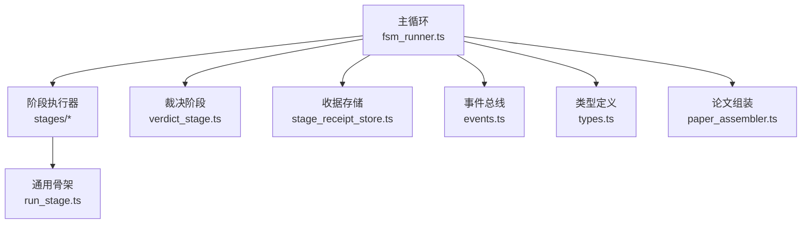
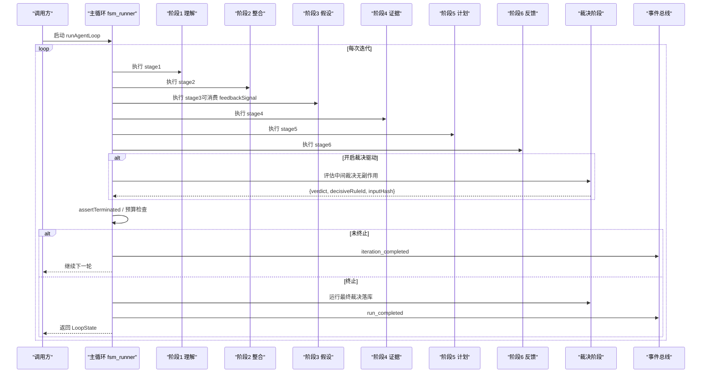
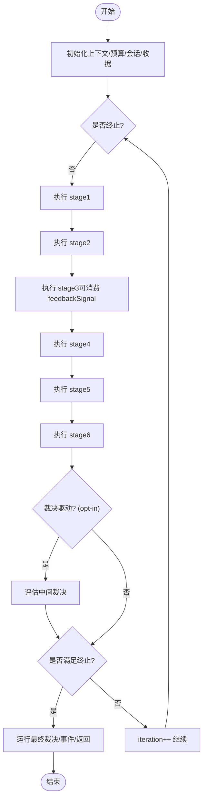
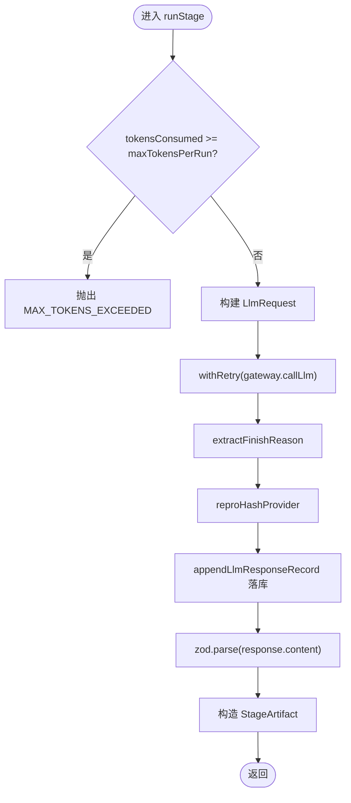
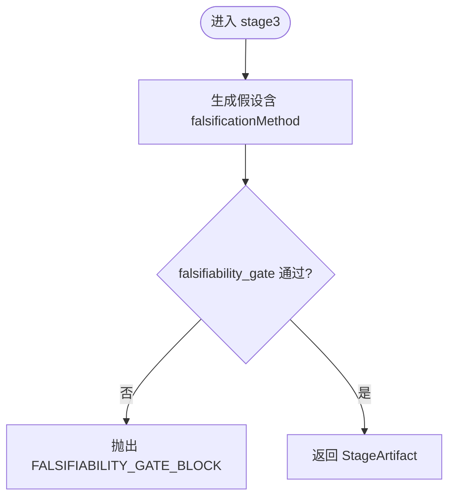
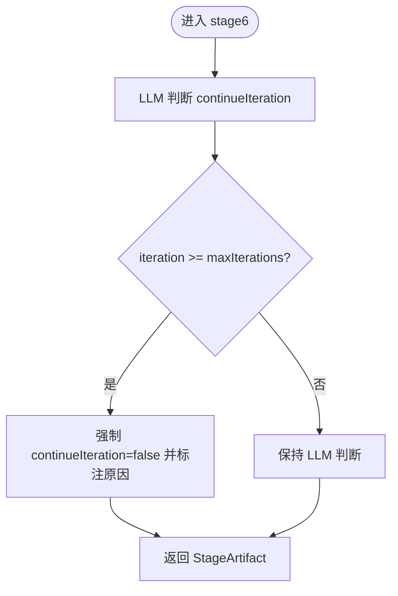
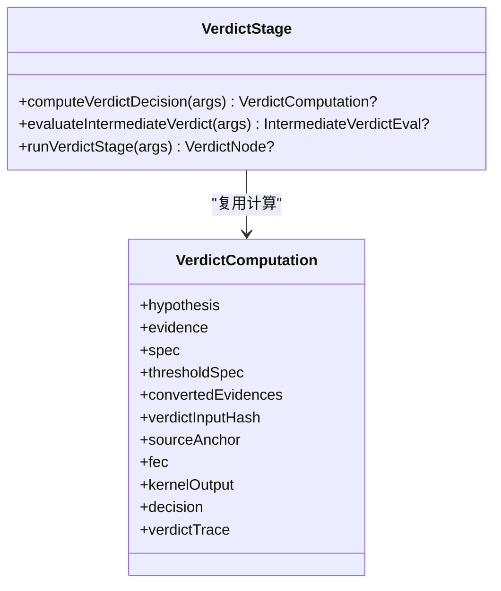
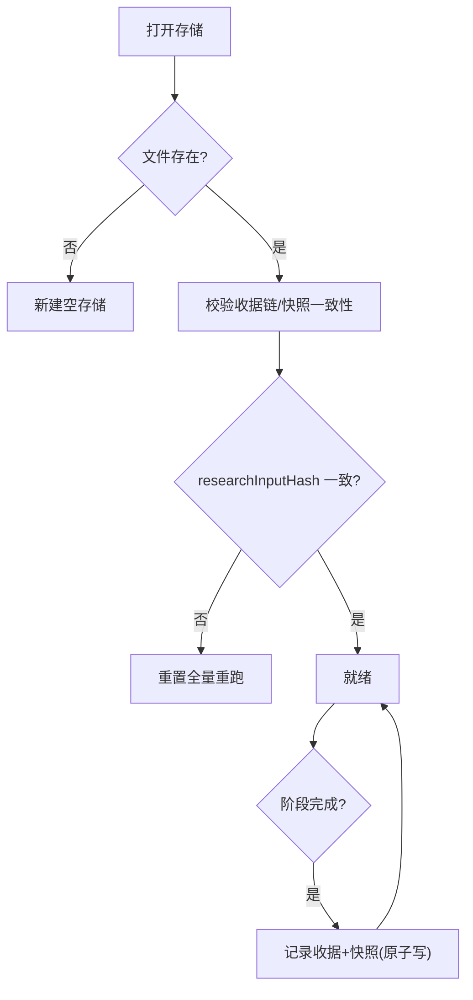
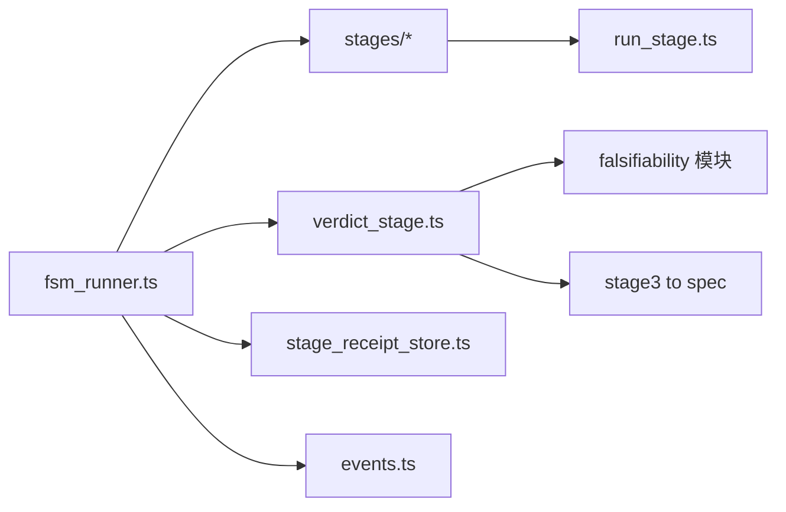

# 代理循环系统

<cite>
**本文引用的文件**
- [src/agent_loop/index.ts](file://src/agent_loop/index.ts)
- [src/agent_loop/fsm_runner.ts](file://src/agent_loop/fsm_runner.ts)
- [src/agent_loop/types.ts](file://src/agent_loop/types.ts)
- [src/agent_loop/run_stage.ts](file://src/agent_loop/run_stage.ts)
- [src/agent_loop/stages/stage1_understanding.ts](file://src/agent_loop/stages/stage1_understanding.ts)
- [src/agent_loop/stages/stage2_integration.ts](file://src/agent_loop/stages/stage2_integration.ts)
- [src/agent_loop/stages/stage3_hypothesis.ts](file://src/agent_loop/stages/stage3_hypothesis.ts)
- [src/agent_loop/stages/stage4_evidence.ts](file://src/agent_loop/stages/stage4_evidence.ts)
- [src/agent_loop/stages/stage5_plan.ts](file://src/agent_loop/stages/stage5_plan.ts)
- [src/agent_loop/stages/stage6_feedback.ts](file://src/agent_loop/stages/stage6_feedback.ts)
- [src/agent_loop/events.ts](file://src/agent_loop/events.ts)
- [src/agent_loop/stage_receipt_store.ts](file://src/agent_loop/stage_receipt_store.ts)
- [src/agent_loop/verdict_stage.ts](file://src/agent_loop/verdict_stage.ts)
- [src/agent_loop/paper_assembler.ts](file://src/agent_loop/paper_assembler.ts)
</cite>

## 目录
1. [简介](#简介)
2. [项目结构](#项目结构)
3. [核心组件](#核心组件)
4. [架构总览](#架构总览)
5. [详细组件分析](#详细组件分析)
6. [依赖关系分析](#依赖关系分析)
7. [性能与预算控制](#性能与预算控制)
8. [故障排查指南](#故障排查指南)
9. [结论](#结论)
10. [附录：自定义阶段与工作流定制](#附录自定义阶段与工作流定制)

## 简介
本文件系统化阐述 FAR-Lab 的“代理循环系统”，聚焦六阶段研究工作流程的状态机设计。该工作流从“理解”到“反馈”形成闭环，包含假设生成、证据收集、计划制定等关键阶段；通过状态转换逻辑、守卫条件检查、错误恢复机制保障可复现与可审计。系统采用事件驱动架构，提供操作审计记录与收据存储，支持断点续跑与幂等重放。文档同时给出完整的工作流图与各阶段实现细节，并提供自定义阶段开发指南与工作流定制方法。

## 项目结构
代理循环系统位于 src/agent_loop，采用“主循环 + 阶段执行器 + 通用骨架 + 裁决/收据/事件/类型”的分层组织：
- 主循环：fsm_runner.ts（runAgentLoop、assertTerminated、终止判定与迭代编排）
- 阶段执行器：stages/stageN_*.ts（六个阶段的具体实现）
- 通用骨架：run_stage.ts（统一 LLM 调用、结构化解析、落库、重试）
- 裁决：verdict_stage.ts（收敛后第 7 阶段，产出 VerdictNode 与中间裁决评估）
- 收据：stage_receipt_store.ts（阶段级收据链与快照，支持恢复与幂等）
- 事件：events.ts（P0-3 运行时事件总线，SSE/CLI/前端实时显示）
- 类型：types.ts（StageId、StructuredPayload、StageContext、LoopState 等）
- 论文组装：paper_assembler.ts（确定性映射为 ResearchPaperOutput）

图表来源
- [src/agent_loop/fsm_runner.ts:215-753](file://src/agent_loop/fsm_runner.ts#L215-L753)
- [src/agent_loop/run_stage.ts:95-179](file://src/agent_loop/run_stage.ts#L95-L179)
- [src/agent_loop/stage_receipt_store.ts:116-239](file://src/agent_loop/stage_receipt_store.ts#L116-L239)
- [src/agent_loop/events.ts:111-184](file://src/agent_loop/events.ts#L111-L184)
- [src/agent_loop/types.ts:63-73](file://src/agent_loop/types.ts#L63-L73)
- [src/agent_loop/verdict_stage.ts:378-451](file://src/agent_loop/verdict_stage.ts#L378-L451)
- [src/agent_loop/paper_assembler.ts:42-73](file://src/agent_loop/paper_assembler.ts#L42-L73)

章节来源
- [src/agent_loop/index.ts:1-36](file://src/agent_loop/index.ts#L1-L36)
- [src/agent_loop/fsm_runner.ts:215-753](file://src/agent_loop/fsm_runner.ts#L215-L753)
- [src/agent_loop/types.ts:63-73](file://src/agent_loop/types.ts#L63-L73)

## 核心组件
- 主循环 runAgentLoop：编排六阶段顺序执行、维护 tokensConsumed/iteration/feedbackSignal、可选 V2 裁决驱动反馈边、并行扩展阶段、事件与 session 录制、收据恢复与幂等重放。
- 单阶段通用骨架 runStage：统一构造请求、LLM 调用、finishReason 提取、reproHash 计算、evidence_log 落库、zod 结构化解析、StageArtifact 返回。
- 六阶段执行器：
  - stage1_understanding：问题理解，输出 UnderstandingPayload
  - stage2_integration：知识整合，输出 IntegrationPayload
  - stage3_hypothesis：假设生成，输出 HypothesisPayload，并过 falsifiability_gate 硬阻断
  - stage4_evidence：证据收集，输出 EvidencePayload
  - stage5_plan：实验规划，输出 PlanPayload
  - stage6_feedback：反馈/收敛，输出 FeedbackPayload，含 continueIteration 决策
- 裁决阶段 verdict_stage：收敛后第 7 阶段，产出真实 VerdictNode；同时提供 evaluateIntermediateVerdict 用于循环内中间裁决评估（无副作用）。
- 收据存储 stage_receipt_store：每阶段签收据+快照，校验链完整性，支持输入变化重置与断点续跑。
- 事件 events：AgentEventBus 提供 on/once/off/emit/snapshot，事件类型安全，供 SSE/CLI/前端实时显示。
- 类型 types：StageId、StructuredPayload、StageContext、LoopState、FeedbackSignal、TerminationCriteria 等。
- 论文组装 paper_assembler：确定性映射 LoopState 为 ResearchPaperOutput（10 字段），不经过 LLM。

章节来源
- [src/agent_loop/fsm_runner.ts:215-753](file://src/agent_loop/fsm_runner.ts#L215-L753)
- [src/agent_loop/run_stage.ts:95-179](file://src/agent_loop/run_stage.ts#L95-L179)
- [src/agent_loop/stages/stage1_understanding.ts:26-35](file://src/agent_loop/stages/stage1_understanding.ts#L26-L35)
- [src/agent_loop/stages/stage2_integration.ts:29-38](file://src/agent_loop/stages/stage2_integration.ts#L29-L38)
- [src/agent_loop/stages/stage3_hypothesis.ts:44-76](file://src/agent_loop/stages/stage3_hypothesis.ts#L44-L76)
- [src/agent_loop/stages/stage4_evidence.ts:33-45](file://src/agent_loop/stages/stage4_evidence.ts#L33-L45)
- [src/agent_loop/stages/stage5_plan.ts:35-44](file://src/agent_loop/stages/stage5_plan.ts#L35-L44)
- [src/agent_loop/stages/stage6_feedback.ts:58-93](file://src/agent_loop/stages/stage6_feedback.ts#L58-L93)
- [src/agent_loop/verdict_stage.ts:378-451](file://src/agent_loop/verdict_stage.ts#L378-L451)
- [src/agent_loop/stage_receipt_store.ts:116-239](file://src/agent_loop/stage_receipt_store.ts#L116-L239)
- [src/agent_loop/events.ts:111-184](file://src/agent_loop/events.ts#L111-L184)
- [src/agent_loop/types.ts:219-225](file://src/agent_loop/types.ts#L219-L225)
- [src/agent_loop/paper_assembler.ts:42-73](file://src/agent_loop/paper_assembler.ts#L42-L73)

## 架构总览
六阶段 FSM 主循环按固定顺序执行，并在每轮结束后进行终止判定；可选开启 V2 裁决驱动反馈边，在循环内评估中间裁决以提前终止或注入软建议。收敛后进入第 7 阶段裁决，产出 VerdictNode。

图表来源
- [src/agent_loop/fsm_runner.ts:424-663](file://src/agent_loop/fsm_runner.ts#L424-L663)
- [src/agent_loop/verdict_stage.ts:350-364](file://src/agent_loop/verdict_stage.ts#L350-L364)
- [src/agent_loop/events.ts:21-90](file://src/agent_loop/events.ts#L21-L90)

章节来源
- [src/agent_loop/fsm_runner.ts:215-753](file://src/agent_loop/fsm_runner.ts#L215-L753)
- [src/agent_loop/verdict_stage.ts:350-364](file://src/agent_loop/verdict_stage.ts#L350-L364)

## 详细组件分析

### 主循环与状态机（runAgentLoop）
- 状态：iteration、tokensConsumed、feedbackSignal、intermediateVerdicts、lastInputHash、verdictHintForNext
- 流程：顺序执行 stage1→stage6，累积 tokens，必要时压缩 prevArtifacts；可选开启 V2 裁决驱动反馈边；每阶段产物追加 artifacts 并触发事件/会话录制；使用 StageReceiptStore 做幂等重放与血缘绑定；到达终止条件后运行裁决阶段并返回 LoopState。
- 终止条件：feedback_converged、verdict_confirmed、verdict_converged、max_iterations、max_tokens、max_duration、error。
- 人工接管：controller.hold()/resume() 在阶段开始处暂停/继续。
- 并行扩展：主链收敛后可并发执行 order>6 的扩展阶段。

图表来源
- [src/agent_loop/fsm_runner.ts:215-753](file://src/agent_loop/fsm_runner.ts#L215-L753)
- [src/agent_loop/fsm_runner.ts:756-796](file://src/agent_loop/fsm_runner.ts#L756-L796)

章节来源
- [src/agent_loop/fsm_runner.ts:215-753](file://src/agent_loop/fsm_runner.ts#L215-L753)
- [src/agent_loop/fsm_runner.ts:756-796](file://src/agent_loop/fsm_runner.ts#L756-L796)

### 单阶段通用骨架（runStage）
- 职责：算力预算闸、构造 LlmRequest（messages/jsonSchema/temperature/maxTokens）、withRetry 调用 gateway、finishReason 提取、reproHash 计算、appendLlmResponseRecord 落库、zod 结构化解析、构造 StageArtifact。
- 错误处理：MAX_TOKENS_EXCEEDED、STAGE_SCHEMA_INVALID；失败不静默吞错。
- 适配器解耦：finishReasonExtractor/reproHashProvider 由 ctx 注入，屏蔽底层 adapter 差异。

图表来源
- [src/agent_loop/run_stage.ts:95-179](file://src/agent_loop/run_stage.ts#L95-L179)
- [src/agent_loop/run_stage.ts:197-224](file://src/agent_loop/run_stage.ts#L197-L224)

章节来源
- [src/agent_loop/run_stage.ts:95-179](file://src/agent_loop/run_stage.ts#L95-L179)
- [src/agent_loop/run_stage.ts:197-224](file://src/agent_loop/run_stage.ts#L197-L224)

### 阶段1：理解（stage1_understanding）
- 输入：researchInput + 可选 dialogueContext（来自 stage0）
- 输出：UnderstandingPayload（problemStatement、scope、keyTerms、falsifiableAngle）
- 多轮优化：若存在上一轮 stage1 产物，作为参考避免重复复述。

章节来源
- [src/agent_loop/stages/stage1_understanding.ts:26-35](file://src/agent_loop/stages/stage1_understanding.ts#L26-L35)
- [src/agent_loop/stages/stage1_understanding.ts:44-76](file://src/agent_loop/stages/stage1_understanding.ts#L44-L76)
- [src/agent_loop/stages/stage1_understanding.ts:83-97](file://src/agent_loop/stages/stage1_understanding.ts#L83-L97)

### 阶段2：整合（stage2_integration）
- 输入：stage1 产物
- 输出：IntegrationPayload（citations、knowledgeGraphSummary、gaps）
- 约束：禁止编造引用，仅使用输入中存在的 evidenceId。

章节来源
- [src/agent_loop/stages/stage2_integration.ts:29-38](file://src/agent_loop/stages/stage2_integration.ts#L29-L38)
- [src/agent_loop/stages/stage2_integration.ts:47-80](file://src/agent_loop/stages/stage2_integration.ts#L47-L80)
- [src/agent_loop/stages/stage2_integration.ts:88-101](file://src/agent_loop/stages/stage2_integration.ts#L88-L101)

### 阶段3：假设（stage3_hypothesis）
- 输入：stage2 产物 + feedbackSignal（[6]→[3] 回灌）+ verdictHint（V2 软建议）
- 输出：HypothesisPayload（claim、falsificationMethod、supportingCitations、scopeSlipText）
- 守卫：falsifiability_gate 硬阻断（无有效 falsificationMethod → 抛 FALSIFIABILITY_GATE_BLOCK）
- 转换：toFalsificationSpecAndThreshold 将 LLM 结构化输出转为 gate 入库形态。

图表来源
- [src/agent_loop/stages/stage3_hypothesis.ts:44-76](file://src/agent_loop/stages/stage3_hypothesis.ts#L44-L76)
- [src/agent_loop/stages/stage3_hypothesis.ts:206-249](file://src/agent_loop/stages/stage3_hypothesis.ts#L206-L249)

章节来源
- [src/agent_loop/stages/stage3_hypothesis.ts:44-76](file://src/agent_loop/stages/stage3_hypothesis.ts#L44-L76)
- [src/agent_loop/stages/stage3_hypothesis.ts:85-153](file://src/agent_loop/stages/stage3_hypothesis.ts#L85-L153)
- [src/agent_loop/stages/stage3_hypothesis.ts:206-249](file://src/agent_loop/stages/stage3_hypothesis.ts#L206-L249)

### 阶段4：证据（stage4_evidence）
- 输入：stage3 产物（claim + falsificationMethod + supportingCitations）
- 输出：EvidencePayload（evidenceRecords、conflictingEvidenceCount）
- 说明：证据记录含 entailmentScore 与 CitationAnchor；后续裁决阶段会转换为 falsifiability 侧的证据模型。

章节来源
- [src/agent_loop/stages/stage4_evidence.ts:33-45](file://src/agent_loop/stages/stage4_evidence.ts#L33-L45)
- [src/agent_loop/stages/stage4_evidence.ts:54-90](file://src/agent_loop/stages/stage4_evidence.ts#L54-L90)
- [src/agent_loop/stages/stage4_evidence.ts:96-109](file://src/agent_loop/stages/stage4_evidence.ts#L96-L109)

### 阶段5：计划（stage5_plan）
- 输入：stage3 + stage4 产物
- 输出：PlanPayload（datasetChoices、methodChoices、scheduleOrFeedback、executableChecks）
- 反剧场：executableChecks.exists 必须反映真实可达性，禁止伪造资源。

章节来源
- [src/agent_loop/stages/stage5_plan.ts:35-44](file://src/agent_loop/stages/stage5_plan.ts#L35-L44)
- [src/agent_loop/stages/stage5_plan.ts:53-101](file://src/agent_loop/stages/stage5_plan.ts#L53-L101)
- [src/agent_loop/stages/stage5_plan.ts:126-139](file://src/agent_loop/stages/stage5_plan.ts#L126-L139)

### 阶段6：反馈（stage6_feedback）
- 输入：全部前序 stage1-stage5 产物 + 当前 iteration/termination
- 输出：FeedbackPayload（feedbackSignal.continueIteration、refinements、iterationSummary）
- 硬收敛：当 iteration >= maxIterations 时强制 continueIteration=false，防止无限烧配额。

图表来源
- [src/agent_loop/stages/stage6_feedback.ts:58-93](file://src/agent_loop/stages/stage6_feedback.ts#L58-L93)
- [src/agent_loop/stages/stage6_feedback.ts:102-157](file://src/agent_loop/stages/stage6_feedback.ts#L102-L157)

章节来源
- [src/agent_loop/stages/stage6_feedback.ts:58-93](file://src/agent_loop/stages/stage6_feedback.ts#L58-L93)
- [src/agent_loop/stages/stage6_feedback.ts:102-157](file://src/agent_loop/stages/stage6_feedback.ts#L102-L157)

### 裁决阶段（verdict_stage）
- 收敛后第 7 阶段：将 hypothesis + evidence 接入 falsifiability 引擎，产出 VerdictNode（落库）。
- 中间裁决评估：evaluateIntermediateVerdict 纯计算（不落库），用于循环内裁决驱动反馈边。
- 证据转换：convertEvidenceRecords 过滤中性证据并映射 supports/refutes。
- 阈值解析：resolveThresholdSpec 统一 gt/lt/range 语义。

图表来源
- [src/agent_loop/verdict_stage.ts:184-326](file://src/agent_loop/verdict_stage.ts#L184-L326)
- [src/agent_loop/verdict_stage.ts:350-364](file://src/agent_loop/verdict_stage.ts#L350-L364)
- [src/agent_loop/verdict_stage.ts:378-451](file://src/agent_loop/verdict_stage.ts#L378-L451)

章节来源
- [src/agent_loop/verdict_stage.ts:184-326](file://src/agent_loop/verdict_stage.ts#L184-L326)
- [src/agent_loop/verdict_stage.ts:350-364](file://src/agent_loop/verdict_stage.ts#L350-L364)
- [src/agent_loop/verdict_stage.ts:378-451](file://src/agent_loop/verdict_stage.ts#L378-L451)

### 收据存储与恢复（stage_receipt_store）
- 收据：每阶段完成签收据（seq、iteration、stageId、inputHash、outputHash、ts、prevHash、receiptHash），脱敏不含 payload。
- 快照：artifact JSON 与收据分离；重启时加载存储→校验链→最近有效收据之后续跑。
- 幂等：已签收阶段跳过执行；输入变化自动重置。
- 血缘绑定：签收时记录 DB call_records 行数与链头，防空心裁决攻击。

图表来源
- [src/agent_loop/stage_receipt_store.ts:116-239](file://src/agent_loop/stage_receipt_store.ts#L116-L239)

章节来源
- [src/agent_loop/stage_receipt_store.ts:116-239](file://src/agent_loop/stage_receipt_store.ts#L116-L239)

### 事件驱动与审计（events）
- AgentEventBus：on/once/off/emit/snapshot/clear，历史容量上限，类型安全 emitTyped。
- 事件类型：run_started、stage_started、stage_completed、iteration_completed、run_completed、run_error、stage_held、stage_resumed。
- 用途：SSE/CLI/前端实时显示；与 SessionRecorder（持久化 JSONL）正交。

章节来源
- [src/agent_loop/events.ts:21-90](file://src/agent_loop/events.ts#L21-L90)
- [src/agent_loop/events.ts:111-184](file://src/agent_loop/events.ts#L111-L184)

### 论文组装（paper_assembler）
- 确定性映射：从 LoopState.artifacts 聚合为 ResearchPaperOutput（10 字段），不经 LLM。
- 字段派生：标题、摘要、理由、技术详情、方法、实验设计、结果、参考文献、迭代计数、最终裁决。

章节来源
- [src/agent_loop/paper_assembler.ts:42-73](file://src/agent_loop/paper_assembler.ts#L42-L73)
- [src/agent_loop/paper_assembler.ts:167-183](file://src/agent_loop/paper_assembler.ts#L167-L183)
- [src/agent_loop/paper_assembler.ts:191-207](file://src/agent_loop/paper_assembler.ts#L191-L207)
- [src/agent_loop/paper_assembler.ts:213-225](file://src/agent_loop/paper_assembler.ts#L213-L225)
- [src/agent_loop/paper_assembler.ts:231-244](file://src/agent_loop/paper_assembler.ts#L231-L244)
- [src/agent_loop/paper_assembler.ts:250-264](file://src/agent_loop/paper_assembler.ts#L250-L264)
- [src/agent_loop/paper_assembler.ts:275-294](file://src/agent_loop/paper_assembler.ts#L275-L294)
- [src/agent_loop/paper_assembler.ts:304-311](file://src/agent_loop/paper_assembler.ts#L304-L311)

## 依赖关系分析
- 主循环依赖各阶段执行器、裁决阶段、收据存储、事件总线、类型定义。
- 阶段执行器依赖通用骨架 runStage，并通过 StageContext 注入 gateway/profile/extractors/appendOptions。
- 裁决阶段依赖 falsifiability 模块与 FEC 强制门，复用 stage3 的转换函数。
- 收据存储依赖文件系统与哈希链校验，确保幂等与血缘绑定。
- 事件总线与 SessionRecorder 分别负责内存事件与持久化审计。

图表来源
- [src/agent_loop/fsm_runner.ts:215-753](file://src/agent_loop/fsm_runner.ts#L215-L753)
- [src/agent_loop/run_stage.ts:95-179](file://src/agent_loop/run_stage.ts#L95-L179)
- [src/agent_loop/verdict_stage.ts:184-326](file://src/agent_loop/verdict_stage.ts#L184-L326)
- [src/agent_loop/stage_receipt_store.ts:116-239](file://src/agent_loop/stage_receipt_store.ts#L116-L239)
- [src/agent_loop/events.ts:111-184](file://src/agent_loop/events.ts#L111-L184)

章节来源
- [src/agent_loop/fsm_runner.ts:215-753](file://src/agent_loop/fsm_runner.ts#L215-L753)
- [src/agent_loop/run_stage.ts:95-179](file://src/agent_loop/run_stage.ts#L95-L179)
- [src/agent_loop/verdict_stage.ts:184-326](file://src/agent_loop/verdict_stage.ts#L184-L326)
- [src/agent_loop/stage_receipt_store.ts:116-239](file://src/agent_loop/stage_receipt_store.ts#L116-L239)
- [src/agent_loop/events.ts:111-184](file://src/agent_loop/events.ts#L111-L184)

## 性能与预算控制
- 算力预算闸：runStage 在阶段入口检查 tokensConsumed >= maxTokensPerRun，超限抛 MAX_TOKENS_EXCEEDED。
- 成本断路器：fsm_runner 在每轮前后检查 budgetProfile，超限即停（fail-closed），错误码 COST_BUDGET_EXCEEDED。
- 时间/迭代限制：maxDurationMs、maxIterations 兜底，防止无限循环。
- 上下文压缩：可选 compactArtifacts，在迭代≥2时对注入 prompt 的 prevArtifacts 应用压缩，减少 token 消耗。
- 低温度：structured 阶段默认 temperature=0.2，提升可复现性。

章节来源
- [src/agent_loop/run_stage.ts:103-111](file://src/agent_loop/run_stage.ts#L103-L111)
- [src/agent_loop/fsm_runner.ts:215-223](file://src/agent_loop/fsm_runner.ts#L215-L223)
- [src/agent_loop/fsm_runner.ts:429-436](file://src/agent_loop/fsm_runner.ts#L429-L436)
- [src/agent_loop/fsm_runner.ts:558-566](file://src/agent_loop/fsm_runner.ts#L558-L566)
- [src/agent_loop/fsm_runner.ts:686-701](file://src/agent_loop/fsm_runner.ts#L686-L701)
- [src/agent_loop/run_stage.ts:127-135](file://src/agent_loop/run_stage.ts#L127-L135)

## 故障排查指南
- 常见错误码：
  - FALSIFIABILITY_GATE_BLOCK：阶段3假设不可证伪（缺少或无效 falsificationMethod）
  - STAGE_RECEIPT_FORGED：收据链校验失败（伪造/断链/血缘不符）
  - EXTENSION_STAGE_FAILED：并行扩展阶段失败（显式错误，不静默吞错）
  - COST_BUDGET_EXCEEDED：成本预算超限
  - MAX_TOKENS_EXCEEDED：阶段入口 token 预算耗尽
  - STAGE_SCHEMA_INVALID：响应非 JSON 或 zod parse 失败
- 诊断要点：
  - 查看事件流（run_error/iteration_completed）定位阶段与轮次
  - 检查 SessionRecorder JSONL 与证据链 head/count 是否匹配
  - 核对收据链 seq/prevHash/receiptHash 是否连续且可重算
  - 确认 budgetProfile 配置是否合理（避免 NaN/undefined/负值）
  - 对 stage3 检查 falsificationMethod 字段完整性（comparator/value/lower/upper）

章节来源
- [src/agent_loop/fsm_runner.ts:664-751](file://src/agent_loop/fsm_runner.ts#L664-L751)
- [src/agent_loop/stage_receipt_store.ts:94-110](file://src/agent_loop/stage_receipt_store.ts#L94-L110)
- [src/agent_loop/stage_receipt_store.ts:133-171](file://src/agent_loop/stage_receipt_store.ts#L133-L171)
- [src/agent_loop/run_stage.ts:197-224](file://src/agent_loop/run_stage.ts#L197-L224)
- [src/agent_loop/stages/stage3_hypothesis.ts:206-249](file://src/agent_loop/stages/stage3_hypothesis.ts#L206-L249)

## 结论
代理循环系统以六阶段 FSM 为核心，结合 V2 裁决驱动反馈边、收据存储与事件驱动架构，实现了可复现、可审计、可恢复的研究工作流。通过严格的预算控制、结构化输出与守卫检查，系统在保证科研严谨性的同时提供了灵活的扩展能力（并行扩展阶段、人工接管、上下文压缩）。裁决阶段将文献证据转化为确定性 VerdictNode，形成完整的“理解→整合→假设→证据→计划→反馈→裁决”闭环。

## 附录：自定义阶段与工作流定制
- 新增阶段步骤：
  - 在 stages/ 下创建新阶段文件，实现 runStageX(ctx): Promise<StageArtifact>
  - 使用 runStage 通用骨架，传入 stageId、payloadKind、purposeTag、schema、buildMessages
  - 在 index.ts 中 re-export 新阶段函数
  - 如需在主循环执行，可在 fsm_runner 中添加顺序调用（注意依赖与数据流转）
- 扩展阶段（order>6）：
  - 通过 stage_registry 注册带 executor 的扩展阶段
  - 启用 runParallelExtensionStages=true 后，主链收敛并发执行扩展阶段
  - 扩展失败显式抛 ExtensionStageError，错误码 EXTENSION_STAGE_FAILED
- 工作流定制：
  - 调整 TerminationCriteria（maxIterations、maxTokensPerRun、maxDurationMs）
  - 启用 verdictDrivenFeedback 以开启循环内中间裁决评估
  - 启用 compactArtifacts 以压缩 prevArtifacts 降低 token 消耗
  - 配置 budgetProfile 为 null 关闭成本断路（需明确授权）
  - 配置 resumeStorePath 启用收据恢复与幂等重放
  - 配置 controller 实现人工接管（hold/resume）
  - 配置 onEvent/onArtifact/sessionPath 实现实时事件与审计录制

章节来源
- [src/agent_loop/index.ts:20-35](file://src/agent_loop/index.ts#L20-L35)
- [src/agent_loop/fsm_runner.ts:182-197](file://src/agent_loop/fsm_runner.ts#L182-L197)
- [src/agent_loop/fsm_runner.ts:582-617](file://src/agent_loop/fsm_runner.ts#L582-L617)
- [src/agent_loop/types.ts:245-249](file://src/agent_loop/types.ts#L245-L249)
- [src/agent_loop/stage_receipt_store.ts:133-171](file://src/agent_loop/stage_receipt_store.ts#L133-L171)
- [src/agent_loop/events.ts:111-184](file://src/agent_loop/events.ts#L111-L184)