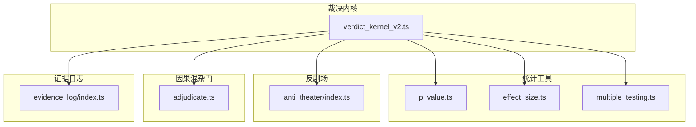
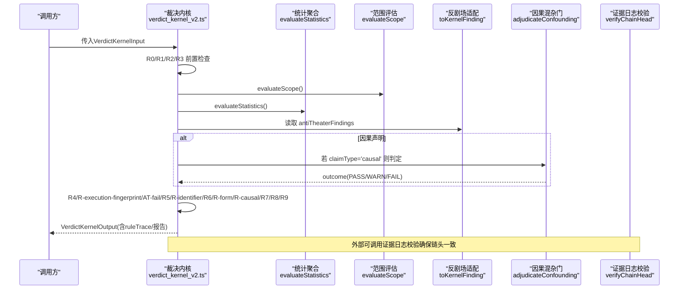
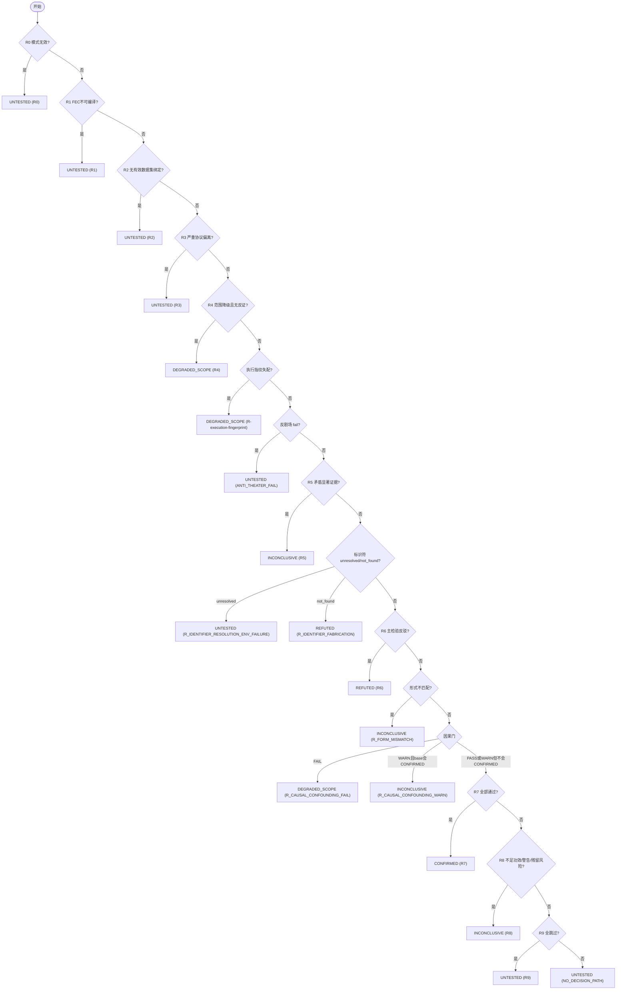
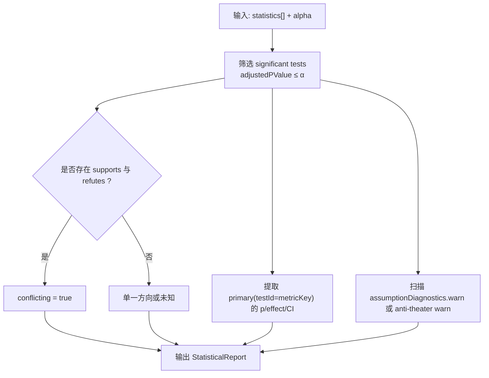
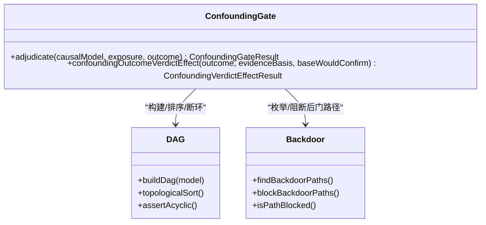
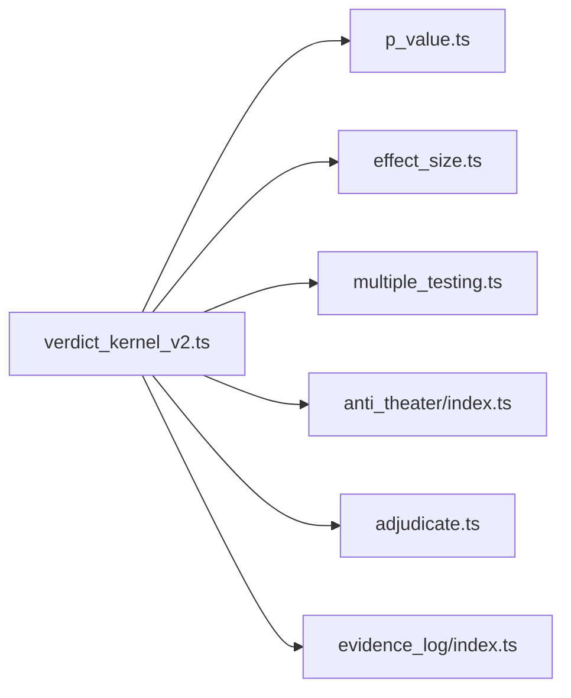

# 可证伪性引擎

<cite>
**本文引用的文件**
- [verdict_kernel_v2.ts](file://src/falsifiability/verdict_kernel_v2.ts)
- [adjudicate.ts](file://src/confounding_gate/adjudicate.ts)
- [index.ts（反剧场）](file://src/anti_theater/index.ts)
- [p_value.ts](file://src/statistics/p_value.ts)
- [effect_size.ts](file://src/statistics/effect_size.ts)
- [multiple_testing.ts](file://src/statistics/multiple_testing.ts)
- [index.ts（证据日志）](file://src/evidence_log/index.ts)
</cite>

## 目录
1. [简介](#简介)
2. [项目结构](#项目结构)
3. [核心组件](#核心组件)
4. [架构总览](#架构总览)
5. [详细组件分析](#详细组件分析)
6. [依赖关系分析](#依赖关系分析)
7. [性能考量](#性能考量)
8. [故障排查指南](#故障排查指南)
9. [结论](#结论)
10. [附录](#附录)

## 简介
本文件面向FAR-Lab的可证伪性引擎，聚焦确定性五值裁决内核与相关安全机制。内容涵盖：
- R0-R9确定性裁决规则的算法逻辑、执行流程与优先级
- 五值裁决系统（CONFIRMED、REFUTED、INCONCLUSIVE、DEGRADED_SCOPE、UNTESTED）的触发条件
- 统计检验聚合、证据充分性评估、范围覆盖分析
- 协议偏离检测、反剧场攻击防护、因果混淆门控
- 执行指纹验证、标识符声明验证等完整性保证
- 决策树流程图与规则触发示例
- 自定义裁决规则扩展指南与调试方法

## 项目结构
可证伪性引擎的核心位于falsifiability模块，围绕“确定性裁决内核”组织；统计计算在statistics模块提供纯函数工具；反剧场检测在anti_theater模块提供探测器与评分；因果混杂门在confounding_gate模块实现图算法判定；证据日志evidence_log提供链式完整性校验。

图表来源
- [verdict_kernel_v2.ts:295-604](file://src/falsifiability/verdict_kernel_v2.ts#L295-L604)
- [p_value.ts:58-131](file://src/statistics/p_value.ts#L58-L131)
- [effect_size.ts:28-121](file://src/statistics/effect_size.ts#L28-L121)
- [multiple_testing.ts:23-96](file://src/statistics/multiple_testing.ts#L23-L96)
- [index.ts（反剧场）:63-88](file://src/anti_theater/index.ts#L63-L88)
- [adjudicate.ts:42-71](file://src/confounding_gate/adjudicate.ts#L42-L71)
- [index.ts（证据日志）:32-37](file://src/evidence_log/index.ts#L32-L37)

章节来源
- [verdict_kernel_v2.ts:295-604](file://src/falsifiability/verdict_kernel_v2.ts#L295-L604)

## 核心组件
- 确定性五值裁决内核：以R0-R9固定优先级顺序判定，首条决定性规则胜出，输出结构化trace与报告
- 统计聚合器：基于显著性、效应量、置信区间与假设诊断进行聚合
- 范围覆盖分析：评估证据scope是否窄于claim scope
- 反剧场检测适配器：将存储型发现投影为内核输入，fail→UNTESTED，warn→R8 INCONCLUSIVE
- 因果混杂门：基于DAG与d-separation的后门路径阻断判定，影响CONFIRMED路径
- 执行指纹与标识符验证：复算资源轮廓一致性、identifier可追溯性

章节来源
- [verdict_kernel_v2.ts:217-286](file://src/falsifiability/verdict_kernel_v2.ts#L217-L286)
- [verdict_kernel_v2.ts:634-719](file://src/falsifiability/verdict_kernel_v2.ts#L634-L719)
- [index.ts（反剧场）:63-88](file://src/anti_theater/index.ts#L63-L88)
- [adjudicate.ts:42-129](file://src/confounding_gate/adjudicate.ts#L42-L129)
- [index.ts（证据日志）:32-37](file://src/evidence_log/index.ts#L32-L37)

## 架构总览
下图展示从输入到裁决输出的端到端流程，包括前置检查、统计聚合、范围评估、安全门控与最终裁决。

图表来源
- [verdict_kernel_v2.ts:295-604](file://src/falsifiability/verdict_kernel_v2.ts#L295-L604)
- [verdict_kernel_v2.ts:634-719](file://src/falsifiability/verdict_kernel_v2.ts#L634-L719)
- [adjudicate.ts:42-71](file://src/confounding_gate/adjudicate.ts#L42-L71)
- [index.ts（证据日志）:32-37](file://src/evidence_log/index.ts#L32-L37)

## 详细组件分析

### 裁决内核与R0-R9决策树
- 固定优先级：R0 > R1 > R2 > R3 > R-execution-fingerprint > AT-fail > R5 > R-identifier > R6 > R-form > R-causal > R7 > R8 > R9 > NO_DECISION_PATH
- 关键阈值：浮点容差1e-7；执行指纹量级差异>10x视为不可复现
- 五值裁决映射：
  - UNTESTED：R0/R1/R2/R3/AT-fail/R-identifier(unresolved)/R9/NO_DECISION_PATH
  - DEGRADED_SCOPE：R-execution-fingerprint/R-causal FAIL/R4
  - REFUTED：R6
  - INCONCLUSIVE：R5/R-form/R-causal WARN(当base会CONFIRMED)/R8
  - CONFIRMED：R7（严格七项条件）

图表来源
- [verdict_kernel_v2.ts:295-604](file://src/falsifiability/verdict_kernel_v2.ts#L295-L604)

章节来源
- [verdict_kernel_v2.ts:295-604](file://src/falsifiability/verdict_kernel_v2.ts#L295-L604)

### 统计检验聚合
- 显著性判定：使用adjustedPValue与alpha比较（容差1e-7），支持多检验校正（none/bonferroni/holm/bh_fdr）
- 方向聚合：所有significant test中supports/refutes方向综合，存在双向显著即conflicting
- 主检验指标：primaryAdjustedPValue、primaryEffectSize、CI取自metricKey对应testId
- 假设诊断：assumptionDiagnostics中的warn触发hasWarnAssumption，影响R7/R8

图表来源
- [verdict_kernel_v2.ts:665-719](file://src/falsifiability/verdict_kernel_v2.ts#L665-L719)
- [multiple_testing.ts:23-96](file://src/statistics/multiple_testing.ts#L23-L96)
- [p_value.ts:58-131](file://src/statistics/p_value.ts#L58-L131)
- [effect_size.ts:28-121](file://src/statistics/effect_size.ts#L28-L121)

章节来源
- [verdict_kernel_v2.ts:665-719](file://src/falsifiability/verdict_kernel_v2.ts#L665-L719)
- [multiple_testing.ts:23-96](file://src/statistics/multiple_testing.ts#L23-L96)
- [p_value.ts:58-131](file://src/statistics/p_value.ts#L58-L131)
- [effect_size.ts:28-121](file://src/statistics/effect_size.ts#L28-L121)

### 范围覆盖分析与矛盾证据
- 范围退化：任一binding scopeCoverage.relation≠within或分布漂移warn → isDegraded=true
- 同范围反证：contradictionSet中存在crossesRefutationThreshold且sameScope → hasSameScopeRefutation=true
- 输出：ScopeReport包含coverage、impactedScopeEdges、scopeSlipText

章节来源
- [verdict_kernel_v2.ts:634-663](file://src/falsifiability/verdict_kernel_v2.ts#L634-L663)

### 协议偏离检测与安全门控
- 协议偏离：critical级别直接UNTESTED，并追加harking_risk/p_hacking_risk等integrityFlags
- 反剧场：fail→UNTESTED；warn→R8 INCONCLUSIVE（通过hasWarnAssumption）
- 标识符声明：unresolved→UNTESTED；not_found→REFUTED（优先unresolved）
- 执行指纹：基线与复算三元组任一维度>10x差异→DEGRADED_SCOPE

章节来源
- [verdict_kernel_v2.ts:376-444](file://src/falsifiability/verdict_kernel_v2.ts#L376-L444)
- [verdict_kernel_v2.ts:456-480](file://src/falsifiability/verdict_kernel_v2.ts#L456-L480)
- [verdict_kernel_v2.ts:416-433](file://src/falsifiability/verdict_kernel_v2.ts#L416-L433)

### 因果混淆门控（F6）
- DAG构建与d-separation：确定后门路径是否被阻断
- 三值outcome：PASS/WARN/FAIL
- outcome→verdict映射：
  - PASS：不影响
  - WARN：若base会CONFIRMED则降为INCONCLUSIVE
  - FAIL：强制DEGRADED_SCOPE；observational_only时追加F6_CAUSAL_HONESTY

图表来源
- [adjudicate.ts:42-71](file://src/confounding_gate/adjudicate.ts#L42-L71)
- [adjudicate.ts:97-129](file://src/confounding_gate/adjudicate.ts#L97-L129)

章节来源
- [adjudicate.ts:42-129](file://src/confounding_gate/adjudicate.ts#L42-L129)

### 执行指纹与证据日志完整性
- 执行指纹：wallMs/cpuMs/peakRssKb三元组比对，量级差异>10x→不可复现
- 证据日志：提供链头校验、载荷哈希校验，保障审计链完整性

章节来源
- [verdict_kernel_v2.ts:73-112](file://src/falsifiability/verdict_kernel_v2.ts#L73-L112)
- [index.ts（证据日志）:32-37](file://src/evidence_log/index.ts#L32-L37)

### 决策路径追踪（A1透明度层）
- 记录R7门的七项条件状态与关键数值快照（alpha、mde、primary p/effect/CI、power/evidence status、effectiveDirection、anti-theater计数、integrity flags、统计总数与跳过数）
- 透明声明：decisionTrace仅用于解释，不证明裁决正确性

章节来源
- [verdict_kernel_v2.ts:802-973](file://src/falsifiability/verdict_kernel_v2.ts#L802-L973)

## 依赖关系分析
- 裁决内核依赖：
  - 统计工具：p_value、effect_size、multiple_testing
  - 反剧场适配：toKernelFinding/toKernelFindings
  - 因果混杂门：adjudicateConfounding与outcome→verdict映射
  - 证据日志：链头与载荷校验
- 耦合与内聚：
  - 内核保持纯函数特性，不读DB、不mutate输入
  - 各子模块职责清晰：统计计算、范围评估、安全门控、因果判定相互独立

图表来源
- [verdict_kernel_v2.ts:295-604](file://src/falsifiability/verdict_kernel_v2.ts#L295-L604)
- [p_value.ts:58-131](file://src/statistics/p_value.ts#L58-L131)
- [effect_size.ts:28-121](file://src/statistics/effect_size.ts#L28-L121)
- [multiple_testing.ts:23-96](file://src/statistics/multiple_testing.ts#L23-L96)
- [index.ts（反剧场）:63-88](file://src/anti_theater/index.ts#L63-L88)
- [adjudicate.ts:42-129](file://src/confounding_gate/adjudicate.ts#L42-L129)
- [index.ts（证据日志）:32-37](file://src/evidence_log/index.ts#L32-L37)

章节来源
- [verdict_kernel_v2.ts:295-604](file://src/falsifiability/verdict_kernel_v2.ts#L295-L604)

## 性能考量
- 纯函数与确定性：避免IO与随机性，便于缓存与并行化
- 浮点容差：统一1e-7容差减少边界误判
- 统计校正：多重检验校正按需启用，避免不必要的开销
- 执行指纹：三元组比对O(1)，快速识别复算发散

[本节为通用指导，无需特定文件引用]

## 故障排查指南
- 常见失败路径：
  - R0/R1/R2：检查FEC版本与编译结果、数据集绑定有效性
  - R3：定位协议偏离类型（alpha重写、指标替换、后期排除、停止违反）
  - R4：查看scope偏差与分布漂移警告
  - R-execution-fingerprint：核对基线与复算资源轮廓
  - 反剧场fail：检查attackKind与severity
  - R5：处理矛盾显著证据
  - R-identifier：区分unresolved与not_found
  - R6/R7/R8：调整alpha、mde、功效与假设诊断
  - R9：确认至少一个测试实际运行
- 调试建议：
  - 启用decisionTrace观察R7门七项条件
  - 打印StatisticalReport与ScopeReport关键字段
  - 检查integrityFlags累积来源（R3、compiledFec计划、反剧场）

章节来源
- [verdict_kernel_v2.ts:295-604](file://src/falsifiability/verdict_kernel_v2.ts#L295-L604)
- [verdict_kernel_v2.ts:802-973](file://src/falsifiability/verdict_kernel_v2.ts#L802-L973)

## 结论
可证伪性引擎通过R0-R9确定性裁决内核，结合统计聚合、范围覆盖、反剧场与因果门控，形成严谨的五值裁决体系。执行指纹与证据日志保障可复现性与完整性。决策路径追踪提升透明度。该设计在保证模型中立与零容忍合规的同时，提供了可扩展的规则框架与完善的调试能力。

[本节为总结性内容，无需特定文件引用]

## 附录

### 规则触发示例
- 示例1：主检验显著支持且满足功效与假设诊断无warn，无integrityFlags → R7 CONFIRMED
- 示例2：主检验显著反驳 → R6 REFUTED
- 示例3：存在支持与反驳均显著 → R5 INCONCLUSIVE
- 示例4：反剧场fail → UNTESTED
- 示例5：执行指纹量级差异>10x → DEGRADED_SCOPE
- 示例6：因果门FAIL → DEGRADED_SCOPE（observational_only追加F6_CAUSAL_HONESTY）
- 示例7：标识符解析环境故障 → UNTESTED；未找到来源 → REFUTED
- 示例8：形式不匹配 → INCONCLUSIVE
- 示例9：所有测试跳过 → UNTESTED

章节来源
- [verdict_kernel_v2.ts:295-604](file://src/falsifiability/verdict_kernel_v2.ts#L295-L604)

### 自定义裁决规则扩展指南
- 新增规则位置：在R0-R9决策树中按优先级插入新分支，确保首条决定性规则胜出
- 输入字段：通过VerdictKernelInput扩展必要字段（如新的integrityFlag或诊断）
- 输出字段：在makeOutput中携带reasonCodes与decisiveRuleId，保持ruleTrace完整
- 兼容性：遵循浮点容差与零回归原则，不引入LLM与副作用
- 测试：补充单元测试覆盖新规则触发与边界条件

章节来源
- [verdict_kernel_v2.ts:295-604](file://src/falsifiability/verdict_kernel_v2.ts#L295-L604)

### 调试方法
- 启用decisionTrace：获取R7门评估与关键数值快照
- 打印中间报告：ScopeReport与StatisticalReport关键字段
- 检查integrityFlags：追踪来自R3、compiledFec计划与反剧场的标记
- 复算验证：对比执行指纹三元组，定位资源轮廓发散

章节来源
- [verdict_kernel_v2.ts:802-973](file://src/falsifiability/verdict_kernel_v2.ts#L802-L973)