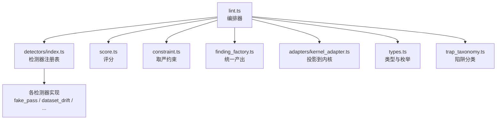
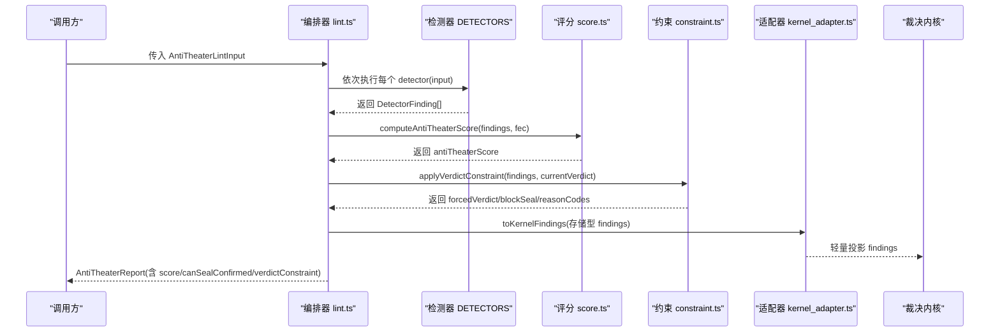
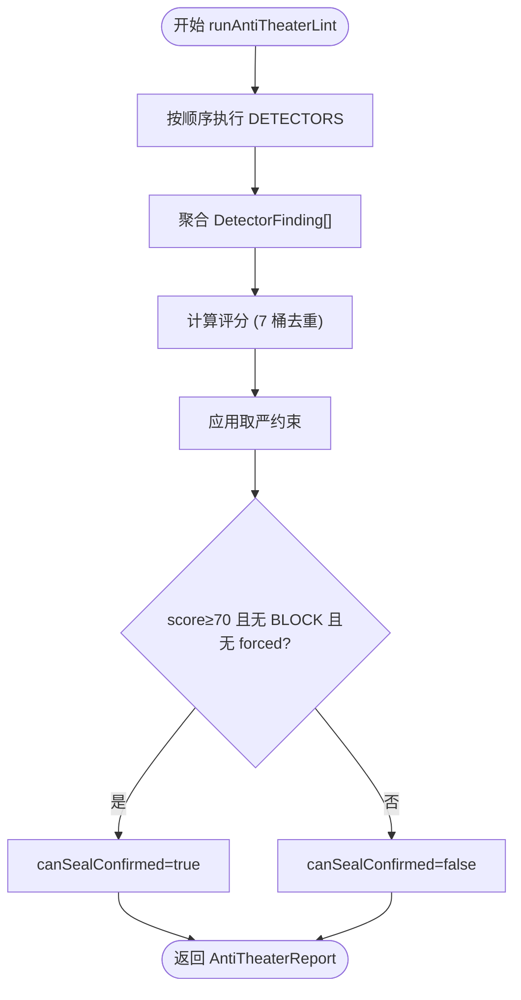
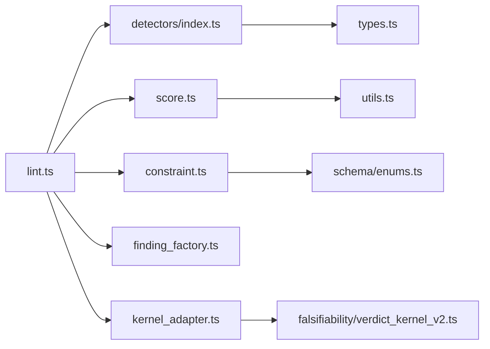

# 安全检测系统

<cite>
**本文引用的文件**
- [src/anti_theater/index.ts](file://src/anti_theater/index.ts)
- [src/anti_theater/types.ts](file://src/anti_theater/types.ts)
- [src/anti_theater/trap_taxonomy.ts](file://src/anti_theater/trap_taxonomy.ts)
- [src/anti_theater/detectors/index.ts](file://src/anti_theater/detectors/index.ts)
- [src/anti_theater/lint.ts](file://src/anti_theater/lint.ts)
- [src/anti_theater/score.ts](file://src/anti_theater/score.ts)
- [src/anti_theater/constraint.ts](file://src/anti_theater/constraint.ts)
- [src/anti_theater/adapters/kernel_adapter.ts](file://src/anti_theater/adapters/kernel_adapter.ts)
- [src/anti_theater/finding_factory.ts](file://src/anti_theater/finding_factory.ts)
- [src/anti_theater/detectors/fake_pass.ts](file://src/anti_theater/detectors/fake_pass.ts)
- [src/anti_theater/detectors/dataset_drift.ts](file://src/anti_theater/detectors/dataset_drift.ts)
- [src/anti_theater/detectors/data_hash_fake.ts](file://src/anti_theater/detectors/data_hash_fake.ts)
- [src/anti_theater/detectors/dep_float_drift.ts](file://src/anti_theater/detectors/dep_float_drift.ts)
- [src/anti_theater/detectors/effect_p_consistency.ts](file://src/anti_theater/detectors/effect_p_consistency.ts)
- [src/anti_theater/detectors/phack_pcurve.ts](file://src/anti_theater/detectors/phack_pcurve.ts)
- [src/anti_theater/detectors/provenance_unbound.ts](file://src/anti_theater/detectors/provenance_unbound.ts)
</cite>

## 目录
1. [简介](#简介)
2. [项目结构](#项目结构)
3. [核心组件](#核心组件)
4. [架构总览](#架构总览)
5. [详细组件分析](#详细组件分析)
6. [依赖关系分析](#依赖关系分析)
7. [性能与误报控制](#性能与误报控制)
8. [故障排查指南](#故障排查指南)
9. [结论](#结论)
10. [附录：攻击类型、规则与配置参考](#附录攻击类型规则与配置参考)

## 简介
本系统提供一套“反剧场”安全检测能力，围绕 24 种（当前实现为 23 项）可复现、确定性的检测器，覆盖数据完整性、方法学合规、报告一致性、可复现性与伪造类风险。其目标是在研究证据链中尽早发现并阻断“剧场式”操纵行为，确保最终证明封签（seal）的结论可信。

关键特性
- 确定性内核：所有检测器为纯函数，无 LLM 参与，输出稳定可重放。
- 双轴严重性：存储轴 outcome（PASS/WARN/FAIL/SKIP）进入 proofHash；展示轴 severity（INFO/WARN/FAIL/BLOCK）用于生产展示与门控。
- 评分与约束：基于 7 桶去重扣分计算安全评分，结合取严后的 verdict 约束决定是否允许 seal CONFIRMED。
- 可扩展插件：检测器以统一接口注册，适配器将结果投影到裁决内核所需格式。

**章节来源**
- [src/anti_theater/index.ts:1-97](file://src/anti_theater/index.ts#L1-L97)
- [src/anti_theater/types.ts:1-392](file://src/anti_theater/types.ts#L1-L392)

## 项目结构
反剧场子系统位于 src/anti_theater，采用分层组织：
- 类型与枚举：types.ts 定义权威存储类型、攻击类别、输入输出契约。
- 编排器：lint.ts 按固定顺序运行检测器，聚合 findings，计算评分与约束。
- 检测器集合：detectors/index.ts 维护 DETECTORS 数组与导出单个检测器。
- 评分与约束：score.ts 与 constraint.ts 分别实现评分与取严逻辑。
- 适配器：adapters/kernel_adapter.ts 将存储型 finding 投影为内核输入。
- 工厂：finding_factory.ts 统一构造 DetectorFinding，校验不变量。
- 陷阱分类：trap_taxonomy.ts 提供人类可读的分类元数据，便于报告与可视化。

**图表来源**
- [src/anti_theater/lint.ts:1-82](file://src/anti_theater/lint.ts#L1-L82)
- [src/anti_theater/detectors/index.ts:1-107](file://src/anti_theater/detectors/index.ts#L1-L107)
- [src/anti_theater/score.ts:1-96](file://src/anti_theater/score.ts#L1-L96)
- [src/anti_theater/constraint.ts:1-153](file://src/anti_theater/constraint.ts#L1-L153)
- [src/anti_theater/adapters/kernel_adapter.ts:1-60](file://src/anti_theater/adapters/kernel_adapter.ts#L1-L60)
- [src/anti_theater/finding_factory.ts:1-112](file://src/anti_theater/finding_factory.ts#L1-L112)
- [src/anti_theater/types.ts:1-392](file://src/anti_theater/types.ts#L1-L392)
- [src/anti_theater/trap_taxonomy.ts:1-339](file://src/anti_theater/trap_taxonomy.ts#L1-L339)

**章节来源**
- [src/anti_theater/index.ts:1-97](file://src/anti_theater/index.ts#L1-L97)

## 核心组件
- 编排器 runAntiTheaterLint：按 DETECTORS 顺序遍历，聚合 findings，计算评分，应用约束，生成 AntiTheaterReport。
- 检测器注册表 DETECTORS：固定顺序的 23 个检测器，保证 golden vector 对拍与 CI 稳定性。
- 评分 computeAntiTheaterScore：7 桶去重扣分，阈值 <70 不可 seal CONFIRMED。
- 约束 applyVerdictConstraint：支持度降级模型，只降不升，REFUTED 不被洗白，blockSeal 强制至少 UNTESTED。
- 适配器 toKernelFinding(s)：将存储型 finding 映射为内核所需的轻量投影。
- 工厂 makeFinding：统一构造 stored + ext，校验 attackId 映射与 blockSeal/outcome 一致。

**章节来源**
- [src/anti_theater/lint.ts:1-82](file://src/anti_theater/lint.ts#L1-L82)
- [src/anti_theater/detectors/index.ts:1-107](file://src/anti_theater/detectors/index.ts#L1-L107)
- [src/anti_theater/score.ts:1-96](file://src/anti_theater/score.ts#L1-L96)
- [src/anti_theater/constraint.ts:1-153](file://src/anti_theater/constraint.ts#L1-L153)
- [src/anti_theater/adapters/kernel_adapter.ts:1-60](file://src/anti_theater/adapters/kernel_adapter.ts#L1-L60)
- [src/anti_theater/finding_factory.ts:1-112](file://src/anti_theater/finding_factory.ts#L1-L112)

## 架构总览
下图展示了从输入到输出的完整流程：编排器驱动检测器，聚合 findings，评分与约束共同决定 canSealConfirmed，并通过适配器将结果投影给裁决内核。

**图表来源**
- [src/anti_theater/lint.ts:1-82](file://src/anti_theater/lint.ts#L1-L82)
- [src/anti_theater/detectors/index.ts:1-107](file://src/anti_theater/detectors/index.ts#L1-L107)
- [src/anti_theater/score.ts:1-96](file://src/anti_theater/score.ts#L1-L96)
- [src/anti_theater/constraint.ts:1-153](file://src/anti_theater/constraint.ts#L1-L153)
- [src/anti_theater/adapters/kernel_adapter.ts:1-60](file://src/anti_theater/adapters/kernel_adapter.ts#L1-L60)

## 详细组件分析

### 编排器与流水线
- 顺序纪律：DETECTORS 数组顺序冻结，确保 findings 列表稳定，便于 golden vector 对拍。
- 三重条件 seal：canSealConfirmed = score ≥ 70 AND 无 BLOCK finding AND forcedVerdict 未设置。
- LLM 覆盖拒绝：llmOverrideRejected 恒 true，结构化 verdict 优先。

**图表来源**
- [src/anti_theater/lint.ts:1-82](file://src/anti_theater/lint.ts#L1-L82)
- [src/anti_theater/score.ts:1-96](file://src/anti_theater/score.ts#L1-L96)
- [src/anti_theater/constraint.ts:1-153](file://src/anti_theater/constraint.ts#L1-L153)

**章节来源**
- [src/anti_theater/lint.ts:1-82](file://src/anti_theater/lint.ts#L1-L82)

### 评分机制（7 桶去重扣分）
- 桶 1：critical_protocol_deviation（-25）
- 桶 2：missing_primary_evidence（-20）
- 桶 3：hidden_failed_run（-15，特定 reasonCode）
- 桶 4：weak_dataset_binding（-10，特定 WARN 触发）
- 桶 5：llm_only_support（-10）
- 桶 6：no_negative_control（-10，FEC 近似判断）
- 桶 7：report_proof_mismatch（-10）
- 阈值：SEAL_BLOCK_SCORE_THRESHOLD=70

**章节来源**
- [src/anti_theater/score.ts:1-96](file://src/anti_theater/score.ts#L1-L96)

### 取严后的裁决约束
- 支持度降级模型：CONFIRMED > DEGRADED_SCOPE > INCONCLUSIVE > UNTESTED > REFUTED。
- 多 forced 取最严（支持度最低）。
- blockSeal 强制至少 UNTESTED。
- 只降不升，REFUTED 不被洗白。

**章节来源**
- [src/anti_theater/constraint.ts:1-153](file://src/anti_theater/constraint.ts#L1-L153)

### 适配器模式（存储型 → 内核投影）
- 将存储型 AntiTheaterFinding 转换为内核所需的轻量投影（kind/severity/details）。
- SKIP 视为 pass，避免误阻断。

**章节来源**
- [src/anti_theater/adapters/kernel_adapter.ts:1-60](file://src/anti_theater/adapters/kernel_adapter.ts#L1-L60)

### 检测器工厂与不变量
- 统一构造 stored + ext，自动派生 findingId、hasFail、severity。
- 校验 attackId ∈ ATTACK_ID_TO_KIND，blockSeal 必须与 outcome='FAIL' 一致。

**章节来源**
- [src/anti_theater/finding_factory.ts:1-112](file://src/anti_theater/finding_factory.ts#L1-L112)

### 典型检测器实现

#### 伪造通过（AT-FAKE-PASS）
- 语义：FEC 声明 requiredEvidence，若任何 required evidence 未被 measurement.requirementId 解析，则 PASS 为伪造。
- 行为：缺失即 FAIL，blockSeal=true。

**章节来源**
- [src/anti_theater/detectors/fake_pass.ts:1-77](file://src/anti_theater/detectors/fake_pass.ts#L1-L77)

#### 数据集漂移（AT-DATA-DRIFT）
- 语义：对比执行端 bindings 与预注册 freeze 记录的 contentHash/schemaHash/statsFingerprint。
- 行为：content/schema 不一致 → FAIL；stats 不一致 → WARN（需人工核验）。

**章节来源**
- [src/anti_theater/detectors/dataset_drift.ts:1-139](file://src/anti_theater/detectors/dataset_drift.ts#L1-L139)

#### 数据集哈希伪造（AT-DATA-HASH-FAKE）
- 语义：用 chunkHashes 重算 Merkle root，与声明 contentHash 比对。
- 行为：不一致 → FAIL，blockSeal=true。

**章节来源**
- [src/anti_theater/detectors/data_hash_fake.ts:1-77](file://src/anti_theater/detectors/data_hash_fake.ts#L1-L77)

#### 依赖浮动漂移（AT-DEP-FLOAT-DRIFT）
- 语义：数值容差未冻结（toleranceFrozen=false）→ FAIL。
- 行为：MVP 仅实现该子路径；lockfile hash 比对延后至 W4。

**章节来源**
- [src/anti_theater/detectors/dep_float_drift.ts:1-69](file://src/anti_theater/detectors/dep_float_drift.ts#L1-L69)

#### 统计报告内部一致性（AT-EFFECT-P-MISMATCH）
- 三层检测：CI-p 数学恒等矛盾、方向-effectSize 符号矛盾、方向-CI 矛盾。
- 行为：任一矛盾 → FAIL，forcedVerdict=UNTESTED，blockSeal=false。

**章节来源**
- [src/anti_theater/detectors/effect_p_consistency.ts:1-184](file://src/anti_theater/detectors/effect_p_consistency.ts#L1-L184)

#### 边缘显著 p 值风险信号（AT-PHACK-MARGINAL-P）
- 语义：单一主校正 p 值落在 [0.04, 0.05) 且 familySize≥3 → WARN 风险信号。
- 行为：不阻断 seal，但提示选择性报告/可选停止风险。

**章节来源**
- [src/anti_theater/detectors/phack_pcurve.ts:1-100](file://src/anti_theater/detectors/phack_pcurve.ts#L1-L100)

#### 执行-产物绑定缺失（AT-PROVENANCE-UNBOUND）
- 语义：当 FEC 要求 requireExecutionProvenance=true 时，primary measurement 须携带有效 executionProvenanceHash。
- 行为：缺失或格式错误 → FAIL，forcedVerdict=UNTESTED。

**章节来源**
- [src/anti_theater/detectors/provenance_unbound.ts:1-99](file://src/anti_theater/detectors/provenance_unbound.ts#L1-L99)

### 陷阱分类法（Trap Taxonomy）
- 为每种 attackKind 提供人类可读名称、类别、解释、修复建议与现实案例。
- 支持按大类聚合命中摘要，便于报告与可视化。

**章节来源**
- [src/anti_theater/trap_taxonomy.ts:1-339](file://src/anti_theater/trap_taxonomy.ts#L1-L339)

## 依赖关系分析
- 编排器依赖检测器注册表、评分、约束、适配器与工厂。
- 检测器依赖 types 中的输入契约与 finding_factory。
- 评分依赖 utils（如 hasNegativeControl）。
- 约束依赖 schema 枚举 Verdict。
- 适配器依赖内核类型定义。

**图表来源**
- [src/anti_theater/lint.ts:1-82](file://src/anti_theater/lint.ts#L1-L82)
- [src/anti_theater/detectors/index.ts:1-107](file://src/anti_theater/detectors/index.ts#L1-L107)
- [src/anti_theater/score.ts:1-96](file://src/anti_theater/score.ts#L1-L96)
- [src/anti_theater/constraint.ts:1-153](file://src/anti_theater/constraint.ts#L1-L153)
- [src/anti_theater/adapters/kernel_adapter.ts:1-60](file://src/anti_theater/adapters/kernel_adapter.ts#L1-L60)
- [src/anti_theater/finding_factory.ts:1-112](file://src/anti_theater/finding_factory.ts#L1-L112)
- [src/anti_theater/types.ts:1-392](file://src/anti_theater/types.ts#L1-L392)

**章节来源**
- [src/anti_theater/detectors/index.ts:1-107](file://src/anti_theater/detectors/index.ts#L1-L107)
- [src/anti_theater/score.ts:1-96](file://src/anti_theater/score.ts#L1-L96)
- [src/anti_theater/constraint.ts:1-153](file://src/anti_theater/constraint.ts#L1-L153)
- [src/anti_theater/adapters/kernel_adapter.ts:1-60](file://src/anti_theater/adapters/kernel_adapter.ts#L1-L60)
- [src/anti_theater/finding_factory.ts:1-112](file://src/anti_theater/finding_factory.ts#L1-L112)
- [src/anti_theater/types.ts:1-392](file://src/anti_theater/types.ts#L1-L392)

## 性能与误报控制
- 确定性：所有检测器为纯函数，无网络/文件系统访问，保证同输入同输出。
- 退化策略：在缺少必要基准（如无 freeze 记录、无 chunkHashes）时跳过而非臆断，维持误报率=0。
- 阈值与门控：评分阈值 70 与 blockSeal 共同控制 seal 许可；约束层只降不升，避免误升级。
- 适配边界：SKIP 视为 pass，避免不必要阻断；单侧检验下 CI-p 检测跳过，减少误报。

[本节为通用指导，无需具体文件引用]

## 故障排查指南
- 常见失败原因
  - requiredEvidence 未解析：检查 measurement.requirementId 是否匹配 requiredEvidence.evidenceId。
  - 数据集漂移：核对 bindings 与 preregistrationRecord.datasetFreezeRecords 的三层 hash。
  - Merkle root 不一致：确认 chunkHashes 正确且可重算。
  - 数值容差未冻结：确保 toleranceFrozen=true。
  - 统计报告不一致：检查 effectDirection、effectSize、CI、p 的符号与数学关系。
  - 执行溯源缺失：在 requireExecutionProvenance=true 时为主测量绑定 64-hex sha256。
- 定位步骤
  - 查看 findings 的 evidenceRef 与 affectedProofHashInputs 定位字段。
  - 根据 reasonCode 对照 trap taxonomy 获取修复建议。
  - 使用 golden vector 对拍验证期望行为。

**章节来源**
- [src/anti_theater/detectors/fake_pass.ts:1-77](file://src/anti_theater/detectors/fake_pass.ts#L1-L77)
- [src/anti_theater/detectors/dataset_drift.ts:1-139](file://src/anti_theater/detectors/dataset_drift.ts#L1-L139)
- [src/anti_theater/detectors/data_hash_fake.ts:1-77](file://src/anti_theater/detectors/data_hash_fake.ts#L1-L77)
- [src/anti_theater/detectors/dep_float_drift.ts:1-69](file://src/anti_theater/detectors/dep_float_drift.ts#L1-L69)
- [src/anti_theater/detectors/effect_p_consistency.ts:1-184](file://src/anti_theater/detectors/effect_p_consistency.ts#L1-L184)
- [src/anti_theater/detectors/provenance_unbound.ts:1-99](file://src/anti_theater/detectors/provenance_unbound.ts#L1-L99)
- [src/anti_theater/trap_taxonomy.ts:1-339](file://src/anti_theater/trap_taxonomy.ts#L1-L339)

## 结论
本系统通过确定性检测器、严格评分与取严约束，构建了面向研究证据链的反剧场防护体系。其设计兼顾安全性（零容忍不变量、退化策略）、可维护性（插件化检测器、适配器解耦）与可解释性（陷阱分类与修复建议）。未来可在 W4 补全 lockfile 重算、扩展统计明细以实现精确 p 值验证，进一步提升检测深度。

[本节为总结，无需具体文件引用]

## 附录：攻击类型、规则与配置参考

### 攻击类型清单（当前 23 项）
- AT-FAKE-PASS：伪造通过（必需证据缺失）
- AT-LABEL-ONLY：仅标签无证据
- AT-JUDGE-OVERRIDE：LLM 裁判覆盖
- AT-POSTHOC-THRESHOLD：事后阈值
- AT-METRIC-SWAP：指标更换
- AT-DATA-DRIFT：数据集漂移
- AT-DATA-HASH-FAKE：数据集哈希伪造
- AT-SCOPE-LAUNDER：范围洗白
- AT-MISSING-RAW：原始产物缺失
- AT-SEED-CHERRY：种子挑选
- AT-WORKFLOW-DIGEST：工作流摘要漂移
- AT-REPORT-MISMATCH：报告与裁决不符
- AT-PHACK-ALPHA：alpha 膨胀
- AT-PHACK-CORRECTION：多重比较未校正
- AT-HARK：假设后设
- AT-STOPPING-RULE：停止规则违规
- AT-OPTIONAL-STOPPING：可选停止无花费
- AT-DEP-FLOAT-DRIFT：依赖浮动漂移
- AT-OVERFIT：基准过拟合
- AT-FAKE-DEGRADED：假降级
- AT-PROVENANCE-UNBOUND：执行-产物绑定缺失
- AT-PHACK-MARGINAL-P：边缘显著 p 值风险信号
- AT-EFFECT-P-MISMATCH：统计报告内部不一致

**章节来源**
- [src/anti_theater/types.ts:1-392](file://src/anti_theater/types.ts#L1-L392)
- [src/anti_theater/detectors/index.ts:1-107](file://src/anti_theater/detectors/index.ts#L1-L107)
- [src/anti_theater/trap_taxonomy.ts:1-339](file://src/anti_theater/trap_taxonomy.ts#L1-L339)

### 检测规则说明（示例）
- 伪造通过：requiredEvidence 未解析 → FAIL，blockSeal=true。
- 数据集漂移：content/schema 不一致 → FAIL；stats 不一致 → WARN。
- 数据集哈希伪造：Merkle root 不一致 → FAIL，blockSeal=true。
- 依赖浮动漂移：toleranceFrozen=false → FAIL。
- 统计报告一致性：CI-p/方向-effect/方向-CI 矛盾 → FAIL。
- 边缘显著 p：familySize≥3 且 p∈[0.04,0.05) → WARN。
- 执行溯源缺失：requireExecutionProvenance=true 且 primary 缺有效 hash → FAIL。

**章节来源**
- [src/anti_theater/detectors/fake_pass.ts:1-77](file://src/anti_theater/detectors/fake_pass.ts#L1-L77)
- [src/anti_theater/detectors/dataset_drift.ts:1-139](file://src/anti_theater/detectors/dataset_drift.ts#L1-L139)
- [src/anti_theater/detectors/data_hash_fake.ts:1-77](file://src/anti_theater/detectors/data_hash_fake.ts#L1-L77)
- [src/anti_theater/detectors/dep_float_drift.ts:1-69](file://src/anti_theater/detectors/dep_float_drift.ts#L1-L69)
- [src/anti_theater/detectors/effect_p_consistency.ts:1-184](file://src/anti_theater/detectors/effect_p_consistency.ts#L1-L184)
- [src/anti_theater/detectors/phack_pcurve.ts:1-100](file://src/anti_theater/detectors/phack_pcurve.ts#L1-L100)
- [src/anti_theater/detectors/provenance_unbound.ts:1-99](file://src/anti_theater/detectors/provenance_unbound.ts#L1-L99)

### 配置选项参考（AntiTheaterLintInput 关键字段）
- fec：FEC 契约（threshold/metric/statisticalPlan/seedPolicy/datasetRequirements）
- bindings：dataset/workflow 绑定联合（detector 用 kind 分流）
- executionTrace：measurements + runs
- verdict：先于 anti-theater 的初步 verdict
- envelopeDraft：ProofEnvelope 草稿（humanSummary/nullResults）
- preregistrationRecord：frozen 端（thresholdHash/primaryMetricHash/alpha/seedPolicyHash/hypothesisSealedAt/lockfileHash/toleranceFrozen/datasetFreezeRecords/workflowFreezeRecords/declaredSeeds）
- runRegistry：完整 run 清单（runs/declaredNullResults）

**章节来源**
- [src/anti_theater/types.ts:1-392](file://src/anti_theater/types.ts#L1-L392)

### 自定义检测器开发指南与集成方法
- 实现签名：(input: AntiTheaterLintInput) => readonly DetectorFinding[]
- 使用工厂：通过 makeFinding 构造 DetectorFinding，确保 attackId 已映射且 blockSeal/outcome 一致
- 注册顺序：在 detectors/index.ts 的 DETECTORS 数组末尾追加，保持向后兼容与 golden vector 稳定
- 投影适配：如需影响内核，遵循 adapter 的 outcome→severity 映射
- 测试对齐：编写 golden vector 用例，断言 findings/forcedVerdict/reasonCode

**章节来源**
- [src/anti_theater/detectors/index.ts:1-107](file://src/anti_theater/detectors/index.ts#L1-L107)
- [src/anti_theater/finding_factory.ts:1-112](file://src/anti_theater/finding_factory.ts#L1-L112)
- [src/anti_theater/adapters/kernel_adapter.ts:1-60](file://src/anti_theater/adapters/kernel_adapter.ts#L1-L60)