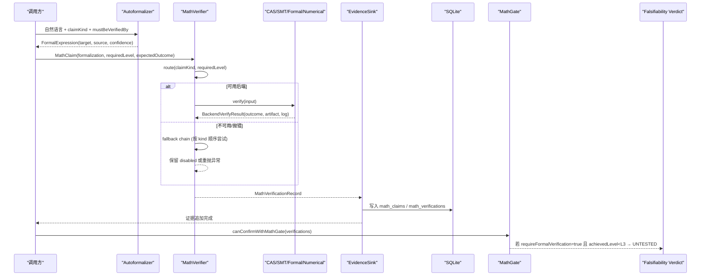
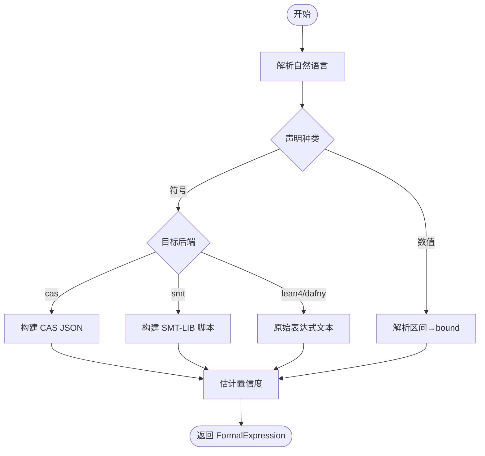
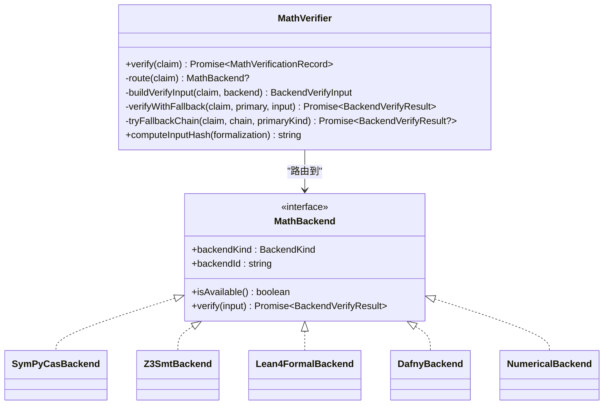
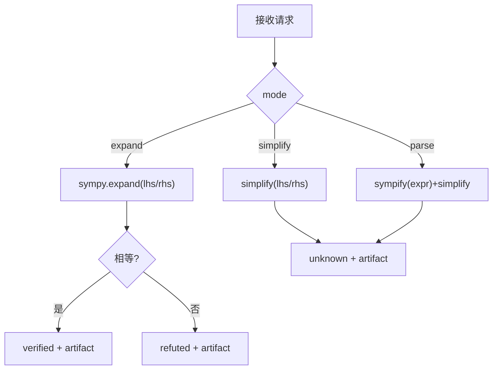
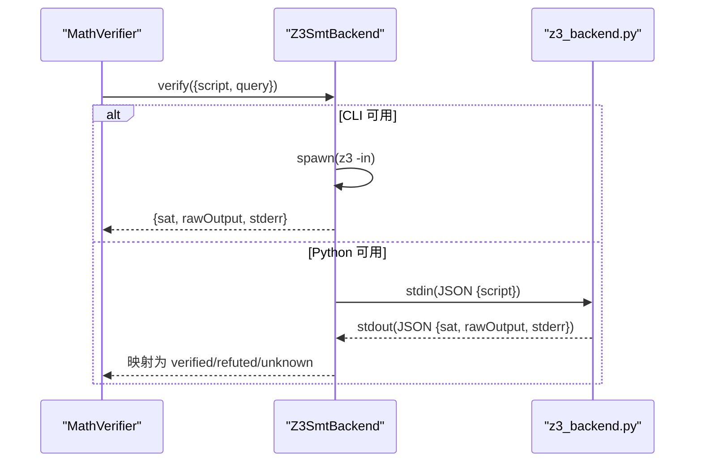
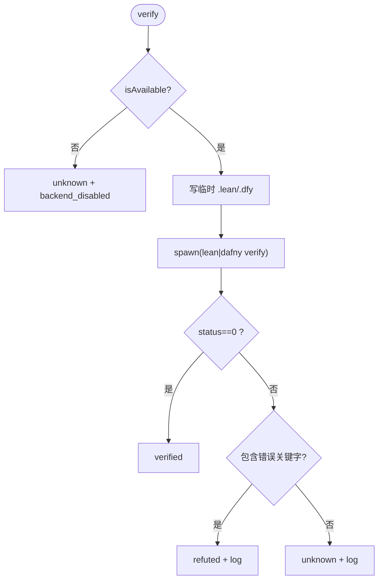
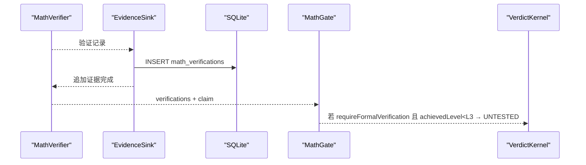
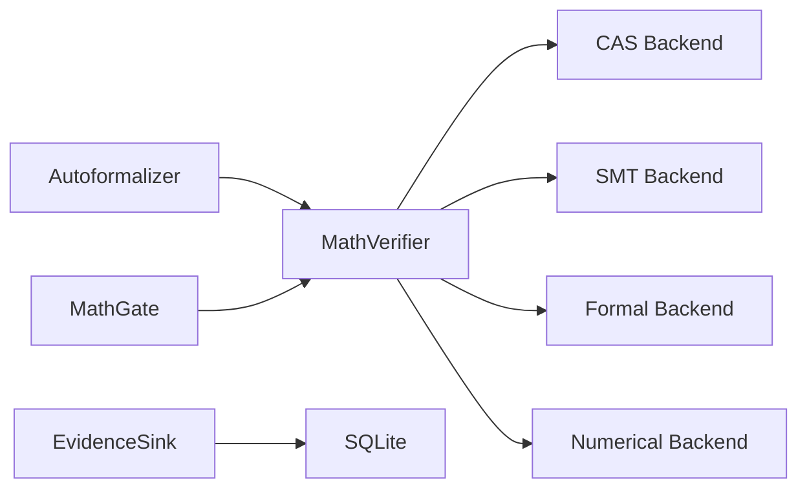

# 数学验证引擎

<cite>
**本文引用的文件**
- [src/math/index.ts](file://src/math/index.ts)
- [src/math/math_verifier.ts](file://src/math/math_verifier.ts)
- [src/math/math_claim.ts](file://src/math/math_claim.ts)
- [src/math/autoformalizer.ts](file://src/math/autoformalizer.ts)
- [src/math/smt_backend.ts](file://src/math/smt_backend.ts)
- [src/math/formal_backend.ts](file://src/math/formal_backend.ts)
- [src/math/dafny_backend.ts](file://src/math/dafny_backend.ts)
- [src/math/numerical_backend.ts](file://src/math/numerical_backend.ts)
- [src/math/evidence_sink.ts](file://src/math/evidence_sink.ts)
- [src/math/math_gate.ts](file://src/math/math_gate.ts)
- [repro/math_backends/sympy_backend.py](file://repro/math_backends/sympy_backend.py)
- [repro/math_backends/z3_backend.py](file://repro/math_backends/z3_backend.py)
- [repro/far_chain_repro/verdict_kernel_v2.py](file://repro/far_chain_repro/verdict_kernel_v2.py)
</cite>

## 目录
1. [简介](#简介)
2. [项目结构](#项目结构)
3. [核心组件](#核心组件)
4. [架构总览](#架构总览)
5. [详细组件分析](#详细组件分析)
6. [依赖关系分析](#依赖关系分析)
7. [性能与精度保障](#性能与精度保障)
8. [故障排查指南](#故障排查指南)
9. [结论](#结论)
10. [附录：使用示例与最佳实践](#附录使用示例与最佳实践)

## 简介
本仓库实现了一个“形式化验证 + 数值计算”的统一数学验证引擎。其目标是将自然语言或半结构化数学声明，自动形式化为机器可检查的目标（如 SMT-LIB、Lean/Dafny 源码、数值实验配置），并通过多后端路由到合适的求解器/证明器进行验证。系统支持 SymPy 符号计算、Z3 定理证明、Lean/Dafny 形式化验证以及纯数值边界记录；同时提供 E-fallback 降级链、证据持久化、与可证伪性层集成等能力。

## 项目结构
数学验证子系统位于 src/math，统一通过 index.ts 暴露公共 API。后端实现包括：
- CAS（SymPy）：符号展开/简化
- SMT（Z3）：SMT-LIB 求解
- Formal（Lean/Dafny）：形式化证明
- Numerical：数值边界记录（非自证）

Python 镜像后端位于 repro/math_backends，用于跨语言一致性复现与独立运行。

```mermaid
graph TB
A["MathVerifier<br/>路由与降级"] --> B["CAS 后端<br/>SymPy"]
A --> C["SMT 后端<br/>Z3"]
A --> D["Formal 后端<br/>Lean4 / Dafny"]
A --> E["Numerical 后端<br/>边界记录"]
F["Autoformalizer<br/>规则解析"] --> A
G["Evidence Sink<br/>持久化+证据追加"] <- --> H["SQLite 表<br/>math_claims / math_verifications"]
I["Math Gate<br/>L3_formal 门控"] --> J["Falsifiability 层<br/>Verdict 判定"]
```

图表来源
- [src/math/math_verifier.ts:78-140](file://src/math/math_verifier.ts#L78-L140)
- [src/math/autoformalizer.ts:56-66](file://src/math/autoformalizer.ts#L56-L66)
- [src/math/evidence_sink.ts:27-54](file://src/math/evidence_sink.ts#L27-L54)
- [src/math/math_gate.ts:54-100](file://src/math/math_gate.ts#L54-L100)

章节来源
- [src/math/index.ts:1-42](file://src/math/index.ts#L1-L42)

## 核心组件
- 类型与契约：定义声明种类、验证等级、结果、后端种类、形式化表达式等，并保证跨语言枚举一致。
- 自动形式化：基于规则的解析器将自然语言转换为机器可读的形式化目标（SMT-LIB、CAS JSON、数值配置）。
- 验证路由器：根据声明种类和所需等级选择后端，并提供 E-fallback 降级链。
- 多后端：
  - CAS（SymPy）：expand 模式严格等价判定；simplify 为启发式，不宣称 verified。
  - SMT（Z3）：CLI 或 Python 驱动，支持 unsat/sat 查询映射为 verified/refuted。
  - Formal（Lean/Dafny）：调用外部编译器/验证器，成功即 verified，错误包含 type mismatch/goals left 等则 refuted。
  - Numerical：始终 unknown，强制输出 bound，作为人类审查依据。
- 证据持久化：写入 SQLite 并追加到共享证据日志。
- 门控：当 requireFormalVerification=true 时，要求达到 L3_formal 才能确认。

章节来源
- [src/math/math_claim.ts:28-183](file://src/math/math_claim.ts#L28-L183)
- [src/math/autoformalizer.ts:56-163](file://src/math/autoformalizer.ts#L56-L163)
- [src/math/math_verifier.ts:78-140](file://src/math/math_verifier.ts#L78-L140)
- [src/math/smt_backend.ts:46-141](file://src/math/smt_backend.ts#L46-L141)
- [src/math/formal_backend.ts:33-138](file://src/math/formal_backend.ts#L33-L138)
- [src/math/dafny_backend.ts:32-136](file://src/math/dafny_backend.ts#L32-L136)
- [src/math/numerical_backend.ts:36-94](file://src/math/numerical_backend.ts#L36-L94)
- [src/math/evidence_sink.ts:27-143](file://src/math/evidence_sink.ts#L27-L143)
- [src/math/math_gate.ts:54-100](file://src/math/math_gate.ts#L54-L100)

## 架构总览
下图展示了从自然语言声明到最终裁决的端到端流程，包括自动形式化、后端路由、E-fallback、证据持久化与门控。



图表来源
- [src/math/autoformalizer.ts:60-66](file://src/math/autoformalizer.ts#L60-L66)
- [src/math/math_verifier.ts:110-140](file://src/math/math_verifier.ts#L110-L140)
- [src/math/math_verifier.ts:148-224](file://src/math/math_verifier.ts#L148-L224)
- [src/math/evidence_sink.ts:123-143](file://src/math/evidence_sink.ts#L123-L143)
- [src/math/math_gate.ts:54-100](file://src/math/math_gate.ts#L54-L100)

## 详细组件分析

### 自动形式化器（CoreNeutralAutoformalizer）
- 功能：基于正则匹配将自然语言解析为不同后端的输入格式：
  - CAS：{lhs, rhs} 或 {expr}
  - SMT：生成 SMT-LIB 脚本与 query
  - Numerical：解析区间 [a,b] 生成 bound 配置
- 置信度估计：识别到结构模式给高置信度，否则低置信度触发降级提示。
- 模型中立：无外部模型调用，纯规则引擎。



图表来源
- [src/math/autoformalizer.ts:68-163](file://src/math/autoformalizer.ts#L68-L163)

章节来源
- [src/math/autoformalizer.ts:56-184](file://src/math/autoformalizer.ts#L56-L184)

### 验证路由器（MathVerifier）
- 路由策略：
  - 数值声明 → NumericalBackend（always unknown + bound）
  - 符号声明 + L1_cas → CAS
  - 符号声明 + L2_smt → SMT
  - 符号声明 + L3_formal → Lean4（可回退到 Dafny）
  - 符号声明 + L4_human → 无人工后端，需人工关闭
- E-fallback：主后端不可用/失败时，按 kind 配置的 fallback 链尝试替代后端，并在 compileLog 中记录来源。
- 输入哈希：对形式化目标进行跨语言一致的规范化（confidence 定点化），确保 TS↔Python 字节级一致。



图表来源
- [src/math/math_verifier.ts:78-350](file://src/math/math_verifier.ts#L78-L350)
- [src/math/math_claim.ts:414-445](file://src/math/math_claim.ts#L414-L445)

章节来源
- [src/math/math_verifier.ts:78-387](file://src/math/math_verifier.ts#L78-L387)
- [src/math/math_claim.ts:28-183](file://src/math/math_claim.ts#L28-L183)

### 后端实现

#### CAS（SymPy）
- 协议：stdin/stdout JSON，mode=expand/simplify/parse
- 声纳性：expand(lhs)==expand(rhs) → verified；simplify 仅 unknown
- 健壮性：任何异常均返回 unknown 并记录诊断



图表来源
- [repro/math_backends/sympy_backend.py:37-121](file://repro/math_backends/sympy_backend.py#L37-L121)

章节来源
- [repro/math_backends/sympy_backend.py:1-125](file://repro/math_backends/sympy_backend.py#L1-L125)

#### SMT（Z3）
- 双模式：优先 CLI z3 -in，回退到 Python z3-solver
- 查询映射：query=unsat → unsat 为 verified；query=sat → sat 为 verified
- 健壮性：缺失脚本/解析失败/执行异常均返回 unknown 并记录 stderr



图表来源
- [src/math/smt_backend.ts:81-141](file://src/math/smt_backend.ts#L81-L141)
- [repro/math_backends/z3_backend.py:26-63](file://repro/math_backends/z3_backend.py#L26-L63)

章节来源
- [src/math/smt_backend.ts:1-299](file://src/math/smt_backend.ts#L1-L299)
- [repro/math_backends/z3_backend.py:1-69](file://repro/math_backends/z3_backend.py#L1-L69)

#### Formal（Lean4 / Dafny）
- 行为：写临时文件，调用外部命令；成功退出 → verified；出现 type mismatch/goals left/verification error → refuted；其他 → unknown
- 可用性检测：缓存 isAvailable 结果，避免重复探测



图表来源
- [src/math/formal_backend.ts:64-138](file://src/math/formal_backend.ts#L64-L138)
- [src/math/dafny_backend.ts:63-136](file://src/math/dafny_backend.ts#L63-L136)

章节来源
- [src/math/formal_backend.ts:1-151](file://src/math/formal_backend.ts#L1-L151)
- [src/math/dafny_backend.ts:1-149](file://src/math/dafny_backend.ts#L1-L149)

#### Numerical
- 不变式：永远 unknown，必须输出 bound（min/max/sampleCount/description）
- 校验：bound 必须有限数，sampleCount 为非负整数

章节来源
- [src/math/numerical_backend.ts:1-96](file://src/math/numerical_backend.ts#L1-L96)

### 证据持久化与可证伪性集成
- EvidenceSink 负责将 MathClaim 与 MathVerificationRecord 写入 SQLite，并追加到共享证据日志（需要 callRecordSeq 关联 LLM 调用流）。
- MathGate 在 requireFormalVerification=true 时强制要求 achievedLevel ≥ L3_formal，否则判定 UNTESTED。
- 可证伪性内核（Python 镜像）提供五值裁决（CONFIRMED/REFUTED/INCONCLUSIVE/DEGRADED_SCOPE/UNTESTED），与 TS 侧保持一致。



图表来源
- [src/math/evidence_sink.ts:123-143](file://src/math/evidence_sink.ts#L123-L143)
- [src/math/math_gate.ts:54-100](file://src/math/math_gate.ts#L54-L100)
- [repro/far_chain_repro/verdict_kernel_v2.py:41-289](file://repro/far_chain_repro/verdict_kernel_v2.py#L41-L289)

章节来源
- [src/math/evidence_sink.ts:1-208](file://src/math/evidence_sink.ts#L1-L208)
- [src/math/math_gate.ts:1-101](file://src/math/math_gate.ts#L1-L101)
- [repro/far_chain_repro/verdict_kernel_v2.py:1-535](file://repro/far_chain_repro/verdict_kernel_v2.py#L1-L535)

## 依赖关系分析
- 模块耦合：
  - MathVerifier 依赖各后端实现与类型契约；通过接口解耦，便于替换与测试。
  - Autoformalizer 仅依赖类型与工具函数，保持模型中立。
  - EvidenceSink 依赖数据库连接与证据日志类型，与上层 LLM 调用流解耦。
- 外部依赖：
  - SymPy、Z3、Lean/Dafny 均为可选外部工具；不可用时优雅降级为 unknown。
- 循环依赖：无直接循环导入；index.ts 作为 barrel 聚合导出。



图表来源
- [src/math/math_verifier.ts:78-140](file://src/math/math_verifier.ts#L78-L140)
- [src/math/evidence_sink.ts:27-54](file://src/math/evidence_sink.ts#L27-L54)

章节来源
- [src/math/index.ts:1-42](file://src/math/index.ts#L1-L42)

## 性能与精度保障
- 精度控制
  - CAS expand 模式提供多项式/结构恒等式的严格判定；simplify 仅为启发式，不宣称 verified。
  - SMT 通过 unsat/sat 查询给出完备判定；未知情况返回 unknown。
  - Formal 验证器提供强语义保证；编译/验证错误明确区分 refuted 与 unknown。
  - Numerical 强制 bound 记录，供人类审查；永不宣称 verified。
- 误差传播与边界
  - 数值后端要求 bound.min/max 有限且 sampleCount 非负整数，防止非法配置。
  - 自动形式化对数值区间进行解析，生成结构化 bound。
- 可靠性
  - 所有后端在异常情况下返回 unknown 并记录诊断，避免崩溃。
  - E-fallback 链确保主后端不可用时尝试替代后端，提升鲁棒性。
- 跨语言一致性
  - 输入哈希对 confidence 进行定点化，确保 TS↔Python 字节级一致。

[本节为通用指导，不直接分析具体文件]

## 故障排查指南
- 后端不可用
  - 现象：outcome='unknown'，compileLog='backend_disabled'
  - 处理：安装对应依赖（sympy、z3、lean/dafny），或启用 fallback 链
- 解析失败
  - 现象：compileLog 包含 parse_error/smt_parse_error
  - 处理：检查自动形式化输出是否符合后端协议（如 SMT script/query、CAS lhs/rhs）
- 验证失败
  - 现象：outcome='refuted'
  - 处理：检查声明是否正确表达意图；必要时调整形式化目标或提高验证等级
- 数值边界无效
  - 现象：InvalidBackendResultError
  - 处理：确保 bound.min/max 有限，sampleCount 为非负整数

章节来源
- [src/math/smt_backend.ts:81-141](file://src/math/smt_backend.ts#L81-L141)
- [src/math/formal_backend.ts:64-138](file://src/math/formal_backend.ts#L64-L138)
- [src/math/dafny_backend.ts:63-136](file://src/math/dafny_backend.ts#L63-L136)
- [src/math/numerical_backend.ts:45-94](file://src/math/numerical_backend.ts#L45-L94)

## 结论
该数学验证引擎通过统一的类型契约、自动形式化、多后端路由与 E-fallback 机制，实现了形式化验证与数值计算的协同工作。其设计强调模型中立、健壮降级与跨语言一致性，并与可证伪性层紧密集成，确保在复杂科学计算场景下的可信性与可审计性。

[本节为总结，不直接分析具体文件]

## 附录：使用示例与最佳实践
- 典型流程
  - 使用 Autoformalizer 将自然语言声明转换为 FormalExpression
  - 构造 MathClaim（指定 claimKind、requiredLevel、expectedOutcome）
  - 调用 MathVerifier.verify 获取验证记录
  - 通过 EvidenceSink 持久化并追加证据
  - 使用 MathGate 评估是否满足 formal verification 要求
- 最佳实践
  - 对关键声明设置 requireFormalVerification=true，确保达到 L3_formal
  - 合理配置 fallbackChains，提升系统在环境差异下的可用性
  - 对数值声明提供明确的 bound，便于人类审查
  - 关注 compileLog 与 outputArtifact，定位问题与调试

[本节为通用指导，不直接分析具体文件]