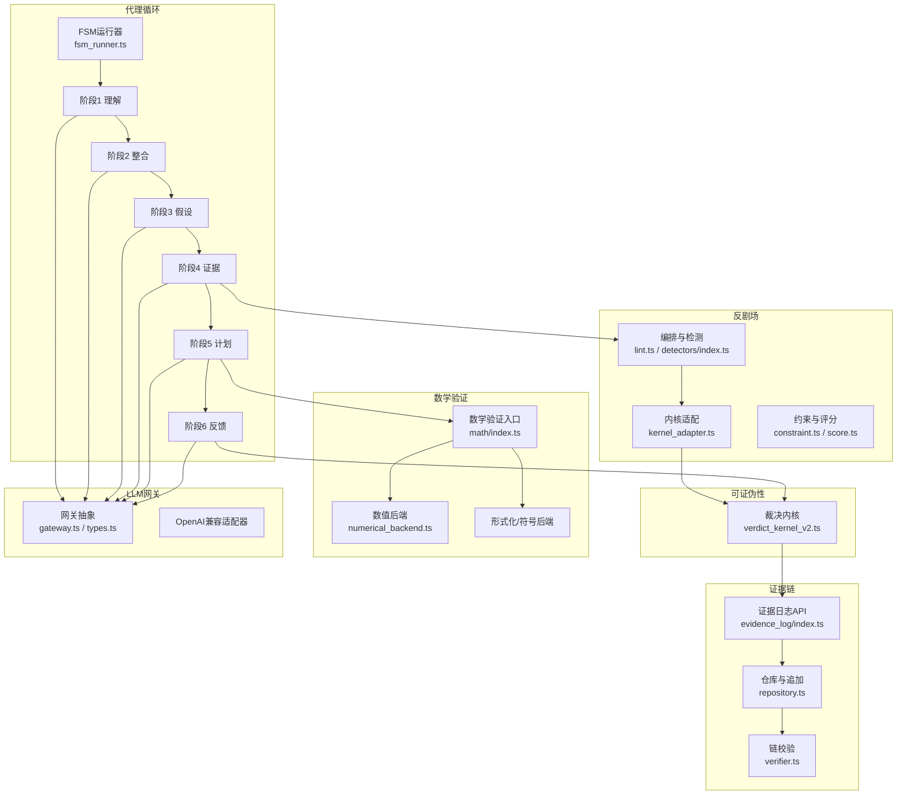
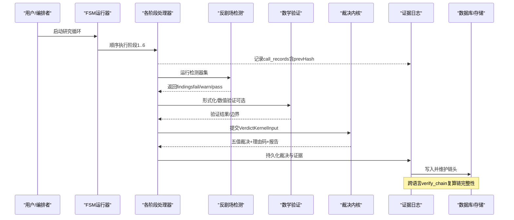
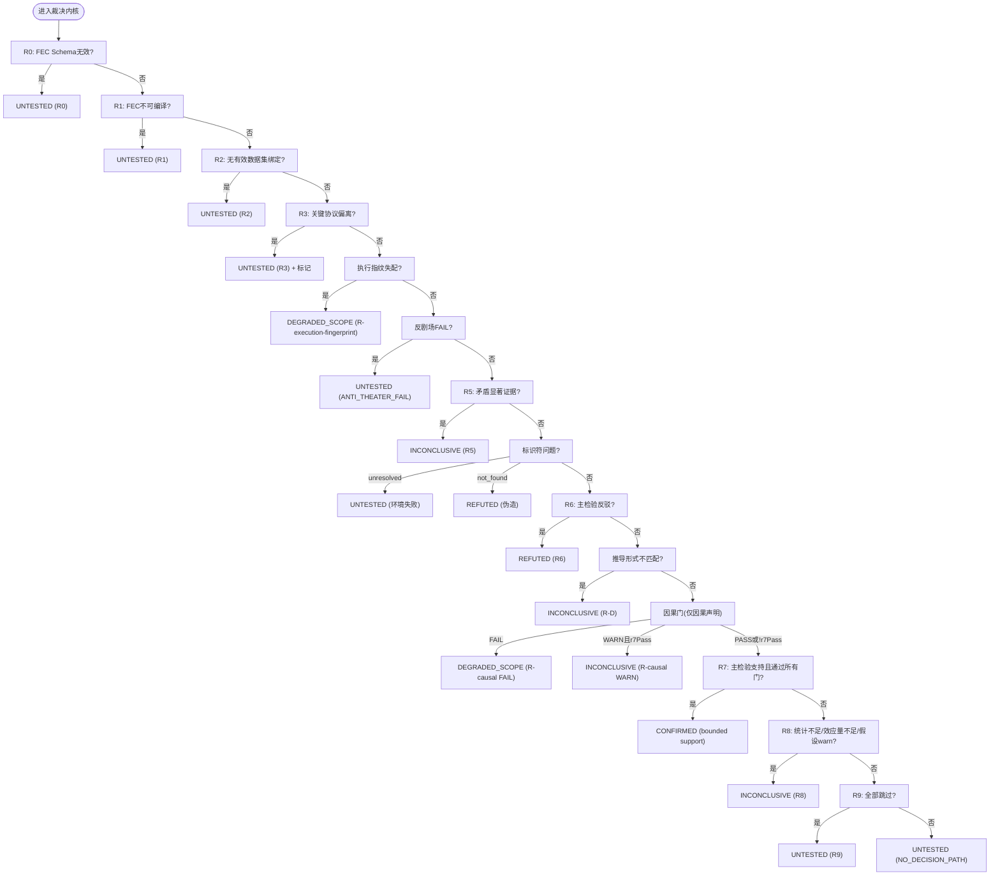
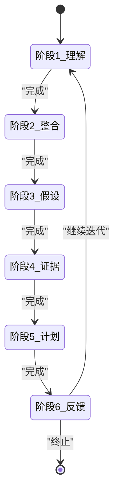
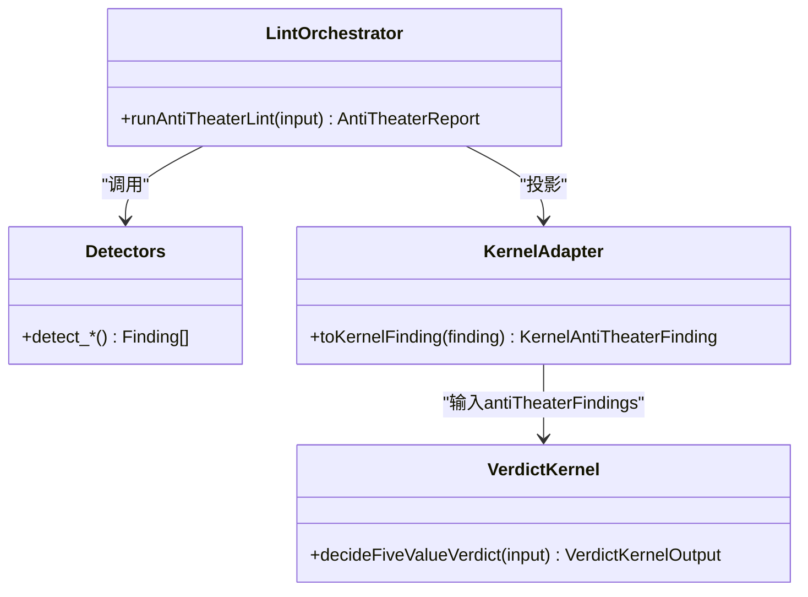
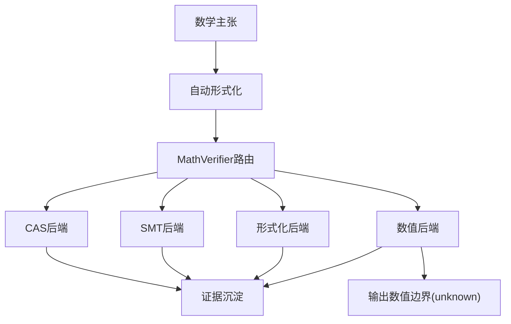
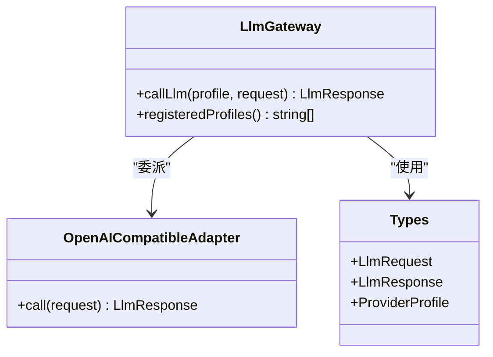
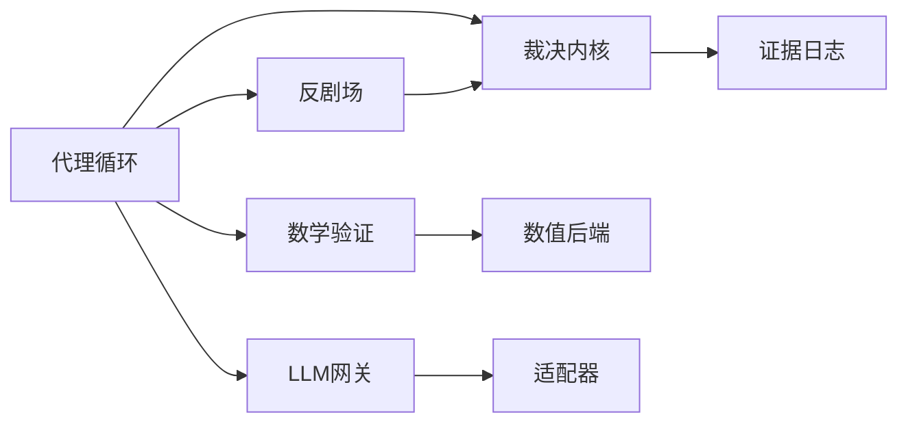

# 核心引擎架构

<cite>
**本文引用的文件**
- [verdict_kernel_v2.ts](file://src/falsifiability/verdict_kernel_v2.ts)
- [index.ts（代理循环）](file://src/agent_loop/index.ts)
- [fsm_runner.ts](file://src/agent_loop/fsm_runner.ts)
- [stage1_understanding.ts](file://src/agent_loop/stages/stage1_understanding.ts)
- [stage2_integration.ts](file://src/agent_loop/stages/stage2_integration.ts)
- [stage3_hypothesis.ts](file://src/agent_loop/stages/stage3_hypothesis.ts)
- [stage4_evidence.ts](file://src/agent_loop/stages/stage4_evidence.ts)
- [stage5_plan.ts](file://src/agent_loop/stages/stage5_plan.ts)
- [stage6_feedback.ts](file://src/agent_loop/stages/stage6_feedback.ts)
- [index.ts（证据日志）](file://src/evidence_log/index.ts)
- [repository.ts](file://src/evidence_log/repository.ts)
- [verifier.ts](file://src/evidence_log/verifier.ts)
- [verify_chain.py](file://repro/far_chain_repro/verify_chain.py)
- [index.ts（反剧场）](file://src/anti_theater/index.ts)
- [lint.ts](file://src/anti_theater/lint.ts)
- [kernel_adapter.ts](file://src/anti_theater/adapters/kernel_adapter.ts)
- [constraint.ts](file://src/anti_theater/constraint.ts)
- [score.ts](file://src/anti_theater/score.ts)
- [detectors/index.ts](file://src/anti_theater/detectors/index.ts)
- [index.ts（数学验证）](file://src/math/index.ts)
- [numerical_backend.ts](file://src/math/numerical_backend.ts)
- [math_verifier.ts](file://src/math/math_verifier.ts)
- [autoformalizer.ts](file://src/math/autoformalizer.ts)
- [smt_backend.ts](file://src/math/smt_backend.ts)
- [formal_backend.ts](file://src/math/formal_backend.ts)
- [dafny_backend.ts](file://src/math/dafny_backend.ts)
- [index.ts（LLM网关）](file://src/llm_gateway/index.ts)
- [gateway.ts](file://src/llm_gateway/gateway.ts)
- [types.ts（LLM网关）](file://src/llm_gateway/types.ts)
- [openai_compatible/index.ts](file://src/llm_gateway/adapters/openai_compatible/index.ts)
- [package.json](file://package.json)
</cite>

## 目录
1. [简介](#简介)
2. [项目结构](#项目结构)
3. [核心组件](#核心组件)
4. [架构总览](#架构总览)
5. [详细组件分析](#详细组件分析)
6. [依赖关系分析](#依赖关系分析)
7. [性能考量](#性能考量)
8. [故障排查指南](#故障排查指南)
9. [结论](#结论)
10. [附录：扩展点与自定义开发指南](#附录：扩展点与自定义开发指南)

## 简介
本文件面向FAR-Lab的核心引擎，系统性阐述可证伪性裁决、六阶段代理循环、证据链存储、反剧场攻击检测、数学验证与LLM网关等关键子系统的设计与实现。重点包括：
- 可证伪性引擎的R0-R9裁决规则与执行流程
- 六阶段代理循环的状态机与数据流
- 证据链的不可变性与完整性校验机制
- 反剧场攻击检测系统的分类与工作原理
- 数学验证的形式化能力与数值计算后端
- LLM网关的统一抽象与适配器模式
- 组件交互图与数据流向分析
- 扩展点说明与自定义开发建议

## 项目结构
FAR-Lab采用分层与按功能域组织的方式：
- 可证伪性裁决内核位于 src/falsifiability，提供确定性五值裁决与R0-R9决策树
- 代理循环位于 src/agent_loop，以FSM驱动六阶段工作流
- 证据日志位于 src/evidence_log，提供链式追加、哈希与跨语言校验
- 反剧场检测位于 src/anti_theater，包含24种检测器与评分约束
- 数学验证位于 src/math，统一接入CAS/SMT/Formal/Numerical后端
- LLM网关位于 src/llm_gateway，提供统一调用抽象与多适配器

**图示来源**
- [verdict_kernel_v2.ts:288-604](file://src/falsifiability/verdict_kernel_v2.ts#L288-L604)
- [fsm_runner.ts](file://src/agent_loop/fsm_runner.ts)
- [index.ts（证据日志）:1-92](file://src/evidence_log/index.ts#L1-L92)
- [index.ts（反剧场）:1-97](file://src/anti_theater/index.ts#L1-L97)
- [index.ts（数学验证）:1-42](file://src/math/index.ts#L1-L42)
- [index.ts（LLM网关）:1-42](file://src/llm_gateway/index.ts#L1-L42)

**章节来源**
- [package.json:1-45](file://package.json#L1-L45)
- [index.ts（代理循环）:1-36](file://src/agent_loop/index.ts#L1-L36)
- [index.ts（证据日志）:1-92](file://src/evidence_log/index.ts#L1-L92)
- [index.ts（反剧场）:1-97](file://src/anti_theater/index.ts#L1-L97)
- [index.ts（数学验证）:1-42](file://src/math/index.ts#L1-L42)
- [index.ts（LLM网关）:1-42](file://src/llm_gateway/index.ts#L1-L42)

## 核心组件
- 可证伪性裁决内核：确定性五值裁决（UNTESTED/DEGRADED_SCOPE/INCONCLUSIVE/CONFIRMED/REFUTED），R0-R9固定优先级，首条决定性规则胜出；纯函数、无LLM参与裁决。
- 六阶段代理循环：基于FSM的“理解→整合→假设→证据→计划→反馈”闭环，支持重试、事件流与论文组装。
- 证据链存储：每条记录含prevHash/currentHash，支持跨语言复算与Merkle根验证，保证不可变与可审计。
- 反剧场攻击检测：24类检测器，产出finding并映射到内核投影型输入，影响裁决降级或阻断。
- 数学验证：统一MathVerifier路由至CAS/SMT/Formal/Numerical后端；数值后端强制非自证明，仅输出边界。
- LLM网关：统一接口与适配器模式，屏蔽不同Provider差异，支持速率限制与预算控制。

**章节来源**
- [verdict_kernel_v2.ts:212-286](file://src/falsifiability/verdict_kernel_v2.ts#L212-L286)
- [verdict_kernel_v2.ts:288-604](file://src/falsifiability/verdict_kernel_v2.ts#L288-L604)
- [index.ts（证据日志）:1-92](file://src/evidence_log/index.ts#L1-L92)
- [index.ts（反剧场）:1-97](file://src/anti_theater/index.ts#L1-L97)
- [index.ts（数学验证）:1-42](file://src/math/index.ts#L1-L42)
- [index.ts（LLM网关）:1-42](file://src/llm_gateway/index.ts#L1-L42)

## 架构总览
下图展示从代理循环到裁决、证据链、反剧场、数学验证与LLM网关的整体交互。

**图示来源**
- [fsm_runner.ts](file://src/agent_loop/fsm_runner.ts)
- [lint.ts](file://src/anti_theater/lint.ts)
- [verdict_kernel_v2.ts:288-604](file://src/falsifiability/verdict_kernel_v2.ts#L288-L604)
- [index.ts（证据日志）:1-92](file://src/evidence_log/index.ts#L1-L92)
- [verify_chain.py:1-56](file://repro/far_chain_repro/verify_chain.py#L1-L56)

## 详细组件分析

### 可证伪性引擎（R0-R9裁决规则）
- 设计原则
  - 全程无LLM：裁决由确定性规则轨迹产出，LLM证据不得直接升CONFIRMED/REFUTED
  - 固定优先级：DEGRADED_SCOPE > REFUTED > INCONCLUSIVE > CONFIRMED > UNTESTED
  - 首条决定性规则胜出：tie-break排序稳定，确保可复现
  - 浮点容差：统一1e-7避免平台差异
- R0-R9决策树要点
  - R0：FEC schema无效 → UNTESTED
  - R1：FEC不可编译或未提交 → UNTESTED
  - R2：无有效数据集绑定 → UNTESTED
  - R3：关键协议偏离（如alpha重写、指标替换）→ UNTESTED，并追加harking/p_hacking标记
  - R-execution-fingerprint：复算资源指纹量级差异>10x → DEGRADED_SCOPE
  - 反剧场FAIL：→ UNTESTED；WARN：→ R8 INCONCLUSIVE
  - R5：显著支持且显著反驳并存 → INCONCLUSIVE
  - R-I：标识符伪造/环境失败 → REFUTED/UNTESTED
  - R6：主检验显著反驳 → REFUTED
  - R-D：推导形式不匹配 → INCONCLUSIVE
  - R7：主检验显著支持且满足效应量/充分性/无warn假设/无完整性标志 → CONFIRMED（bounded support）
  - R8：统计不足/效应量不足/假设warn/p_hacking残留 → INCONCLUSIVE
  - R9：全部跳过 → UNTESTED
- 因果门（R-causal）
  - 仅在claimType='causal'时触发，FAIL→DEGRADED_SCOPE，WARN且r7Pass→INCONCLUSIVE
- 输出
  - 裁决、理由码、规则轨迹、范围/统计/充分性报告、完整性标志、是否有界支持、透明度层（GRADE/RoB）

**图示来源**
- [verdict_kernel_v2.ts:288-604](file://src/falsifiability/verdict_kernel_v2.ts#L288-L604)

**章节来源**
- [verdict_kernel_v2.ts:212-286](file://src/falsifiability/verdict_kernel_v2.ts#L212-L286)
- [verdict_kernel_v2.ts:288-604](file://src/falsifiability/verdict_kernel_v2.ts#L288-L604)

### 六阶段代理循环（状态机）
- 阶段划分
  - 阶段1：理解（understanding）
  - 阶段2：整合（integration）
  - 阶段3：假设（hypothesis）
  - 阶段4：证据（evidence）
  - 阶段5：计划（plan）
  - 阶段6：反馈（feedback）
- 运行机制
  - FSMRunner驱动阶段顺序执行，支持重试策略、终止条件、事件总线实时上报
  - 每阶段可调用LLM网关、反剧场检测、数学验证，并将产物写入证据日志
  - 阶段6可注入先前裁决信号，驱动收敛或迭代

**图示来源**
- [index.ts（代理循环）:1-36](file://src/agent_loop/index.ts#L1-L36)
- [fsm_runner.ts](file://src/agent_loop/fsm_runner.ts)

**章节来源**
- [index.ts（代理循环）:1-36](file://src/agent_loop/index.ts#L1-L36)

### 证据链存储系统（不可变性与完整性）
- 不可变性
  - 每条记录包含prevHash与currentHash，形成单向链；GENESIS prevHash为全零
  - 追加操作使用规范JSON与确定性哈希，保证跨语言一致
- 完整性校验
  - 提供verifyChainHead、verifyEvidencePayloadHashes、verifyCallRecordPayloadHashes等工具
  - 跨语言验证：Python端verify_chain_head与TS端等价逻辑，重算canonical_hash并比对链头
- 前端可视化
  - 整链Merkle根作为信任根，支持选择任意seq拉取包含证明并在浏览器本地验证

**图示来源**
- [index.ts（证据日志）:1-92](file://src/evidence_log/index.ts#L1-L92)
- [verify_chain.py:1-56](file://repro/far_chain_repro/verify_chain.py#L1-L56)

**章节来源**
- [index.ts（证据日志）:1-92](file://src/evidence_log/index.ts#L1-L92)
- [verify_chain.py:1-56](file://repro/far_chain_repro/verify_chain.py#L1-L56)

### 反剧场攻击检测系统
- 架构
  - 编排器runAntiTheaterLint顺序遍历24个检测器，聚合findings
  - 存储型finding经adapters/kernel_adapter投影为内核输入（severity: fail→UNTESTED, warn→R8 INCONCLUSIVE）
  - constraint/score对findings进行评分与裁决约束（forcedVerdict/blockSeal）
- 分类与原理（概述）
  - 覆盖数据漂移、指标替换、种子挑选、负对照缺失、引用溯源异常等攻击面
  - 每个detector输出标准化finding，便于统一处理与审计
- 与裁决内核集成
  - antiTheaterFindings作为VerdictKernelInput字段，直接影响R7/R8判定与reasonCodes

**图示来源**
- [lint.ts](file://src/anti_theater/lint.ts)
- [kernel_adapter.ts:1-20](file://src/anti_theater/adapters/kernel_adapter.ts#L1-L20)
- [verdict_kernel_v2.ts:212-286](file://src/falsifiability/verdict_kernel_v2.ts#L212-L286)

**章节来源**
- [index.ts（反剧场）:1-97](file://src/anti_theater/index.ts#L1-L97)
- [kernel_adapter.ts:1-20](file://src/anti_theater/adapters/kernel_adapter.ts#L1-L20)
- [constraint.ts](file://src/anti_theater/constraint.ts)
- [score.ts](file://src/anti_theater/score.ts)

### 数学验证引擎（形式化与数值）
- 统一入口
  - MathVerifier路由至不同后端：CAS、SMT、Formal、Numerical
  - autoformalizer将自然语言/代码主张转换为可验证形式
- 数值后端
  - 强制non-self-proving：始终返回outcome='unknown'，仅输出数值边界
  - 要求target.bound必填，否则抛出InvalidBackendResultError
- 形式化后端
  - 支持Dafny、SMT等，用于严格证明或约束求解
- 证据沉淀
  - evidence_sink将验证结果写入证据日志，保持可审计

**图示来源**
- [index.ts（数学验证）:1-42](file://src/math/index.ts#L1-L42)
- [numerical_backend.ts:1-66](file://src/math/numerical_backend.ts#L1-L66)
- [math_verifier.ts](file://src/math/math_verifier.ts)
- [autoformalizer.ts](file://src/math/autoformalizer.ts)

**章节来源**
- [index.ts（数学验证）:1-42](file://src/math/index.ts#L1-L42)
- [numerical_backend.ts:1-66](file://src/math/numerical_backend.ts#L1-L66)

### LLM网关（统一抽象与适配器）
- 统一抽象
  - createLlmGateway提供统一接口，屏蔽Provider差异
  - 类型定义集中管理请求/响应/凭证/能力
- 适配器模式
  - OpenAI兼容适配器支持多种服务（如阿里云通义千问）
  - 支持预设配置与速率限制
- 与代理循环集成
  - 各阶段通过网关调用LLM，记录凭证与重放哈希，保障可复现

**图示来源**
- [index.ts（LLM网关）:1-42](file://src/llm_gateway/index.ts#L1-L42)
- [gateway.ts](file://src/llm_gateway/gateway.ts)
- [types.ts（LLM网关）](file://src/llm_gateway/types.ts)
- [openai_compatible/index.ts](file://src/llm_gateway/adapters/openai_compatible/index.ts)

**章节来源**
- [index.ts（LLM网关）:1-42](file://src/llm_gateway/index.ts#L1-L42)

## 依赖关系分析
- 耦合与内聚
  - 裁决内核高内聚：纯函数、无IO、无LLM，依赖最小
  - 反剧场与裁决内核通过轻量投影解耦，避免内核依赖存储细节
  - 证据日志与上层模块松耦合，仅暴露追加/查询/校验API
- 外部依赖
  - 数学验证依赖外部求解器/形式化工具（按需启用）
  - LLM网关依赖具体Provider（通过适配器隔离）
- 潜在循环依赖
  - 通过 barrel index 与明确导出避免循环；裁决内核不反向依赖上层编排

**图示来源**
- [verdict_kernel_v2.ts:288-604](file://src/falsifiability/verdict_kernel_v2.ts#L288-L604)
- [index.ts（证据日志）:1-92](file://src/evidence_log/index.ts#L1-L92)
- [index.ts（反剧场）:1-97](file://src/anti_theater/index.ts#L1-L97)
- [index.ts（数学验证）:1-42](file://src/math/index.ts#L1-L42)
- [index.ts（LLM网关）:1-42](file://src/llm_gateway/index.ts#L1-L42)

**章节来源**
- [verdict_kernel_v2.ts:288-604](file://src/falsifiability/verdict_kernel_v2.ts#L288-L604)
- [index.ts（证据日志）:1-92](file://src/evidence_log/index.ts#L1-L92)
- [index.ts（反剧场）:1-97](file://src/anti_theater/index.ts#L1-L97)
- [index.ts（数学验证）:1-42](file://src/math/index.ts#L1-L42)
- [index.ts（LLM网关）:1-42](file://src/llm_gateway/index.ts#L1-L42)

## 性能考量
- 裁决内核为纯函数，时间复杂度主要取决于统计结果数量与规则检查次数；建议控制statistics规模以提升吞吐
- 反剧场检测顺序遍历24个检测器，可按需并行化或缓存中间结果
- 数学验证中数值后端为O(n)扫描目标数据；形式化后端可能受求解器性能影响
- 证据日志追加与哈希计算为O(1)摊销；链校验为O(N)
- LLM网关可通过速率限制与重试策略降低抖动与成本

[本节为通用指导，无需特定文件来源]

## 故障排查指南
- 裁决路径异常
  - 检查R0-R9命中原因与reasonCodes；确认FEC编译、数据集绑定、协议偏离与反剧场发现
  - 关注完整性标志（如p_hacking_risk）与证据充分性报告
- 证据链不一致
  - 使用verifyChainHead与verifyEvidencePayloadHashes定位断链或篡改
  - 跨语言复算：Python verify_chain_head与TS端一致性校验
- 反剧场误报/漏报
  - 核对detector输入与投影规则；确认severity映射是否符合预期
- 数学验证失败
  - 数值后端必须提供bound；形式化后端检查语法与求解器可用性
- LLM调用失败
  - 检查适配器配置、速率限制与凭证；利用离线回放适配器进行回归测试

**章节来源**
- [verdict_kernel_v2.ts:288-604](file://src/falsifiability/verdict_kernel_v2.ts#L288-L604)
- [index.ts（证据日志）:1-92](file://src/evidence_log/index.ts#L1-L92)
- [verify_chain.py:1-56](file://repro/far_chain_repro/verify_chain.py#L1-L56)
- [numerical_backend.ts:1-66](file://src/math/numerical_backend.ts#L1-L66)
- [index.ts（LLM网关）:1-42](file://src/llm_gateway/index.ts#L1-L42)

## 结论
FAR-Lab核心引擎以可证伪性裁决为中心，结合六阶段代理循环、证据链不可变存储、反剧场检测、数学验证与LLM网关，构建了端到端的科学主张验证流水线。R0-R9规则提供确定性与可审计的裁决路径；证据链保障跨语言可复现；反剧场检测强化鲁棒性；数学验证提供形式化与数值支撑；LLM网关实现模型中立与可扩展。整体架构强调解耦、透明与可验证，适合在AI4S场景中规模化应用。

[本节为总结，无需特定文件来源]

## 附录：扩展点与自定义开发指南
- 扩展裁决规则
  - 在裁决内核中新增规则需遵循固定优先级与首条决定性规则胜出原则；保持纯函数与零副作用
  - 参考现有R0-R9实现，确保reasonCodes与scope/statistical报告完整
- 新增反剧场检测器
  - 在detectors目录下实现detector函数，输出标准化finding；注册到DETECTORS集合
  - 通过adapters/kernel_adapter映射到内核输入；必要时调整constraint/score阈值
- 自定义数学后端
  - 实现MathBackend接口，遵循non-self-proving约定（数值后端）或形式化验证语义
  - 通过MathVerifier注册并使用；确保evidence_sink正确沉淀结果
- 扩展LLM适配器
  - 实现ProviderAdapter接口，封装调用、凭证与错误处理；通过createLlmGateway注册
  - 利用rate_limiter与budget控制成本与稳定性
- 证据链扩展
  - 新增字段需保持规范JSON与向后兼容；更新迁移脚本与校验逻辑
  - 确保跨语言哈希一致，更新verify_chain与前端验证界面

[本节为通用指导，无需特定文件来源]